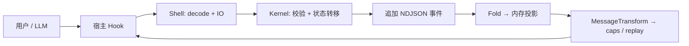
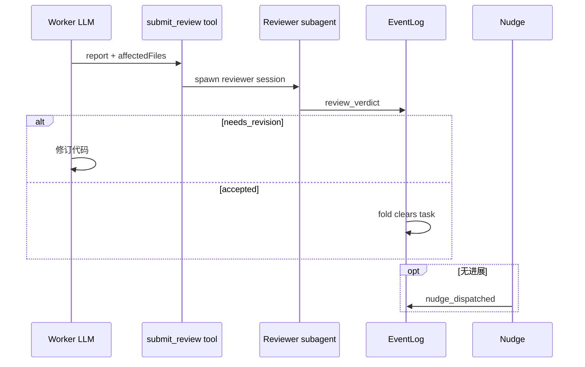

This file is a merged representation of the entire codebase, combined into a single document by Repomix.

<file_summary>
This section contains a summary of this file.

<purpose>
This file contains a packed representation of the entire repository's contents.
It is designed to be easily consumable by AI systems for analysis, code review,
or other automated processes.
</purpose>

<file_format>
The content is organized as follows:
1. This summary section
2. Repository information
3. Directory structure
4. Repository files (if enabled)
5. Multiple file entries, each consisting of:
  - File path as an attribute
  - Full contents of the file
</file_format>

<usage_guidelines>
- This file should be treated as read-only. Any changes should be made to the
  original repository files, not this packed version.
- When processing this file, use the file path to distinguish
  between different files in the repository.
- Be aware that this file may contain sensitive information. Handle it with
  the same level of security as you would the original repository.
</usage_guidelines>

<notes>
- Some files may have been excluded based on .gitignore rules and Repomix's configuration
- Binary files are not included in this packed representation. Please refer to the Repository Structure section for a complete list of file paths, including binary files
- Files matching patterns in .gitignore are excluded
- Files matching default ignore patterns are excluded
- Files are sorted by Git change count (files with more changes are at the bottom)
</notes>

</file_summary>

<directory_structure>
docs/
  wanxiangzhen/
    00-index.md
    01-master-spec.md
    02-event-sourcing.md
    03-dev-talk.md
  00-index.md
  01-first-principles.md
  01-overview.md
  02-architecture.md
  03-kernel.md
  04-shell.md
  05-event-sourcing.md
  06-review-and-nudge.md
  07-work-backlog.md
  08-tools-and-permissions.md
  09-methodology.md
  10-message-transform.md
  11-subagents.md
  12-fallback.md
  13-context-budget.md
  14-host-opencode.md
  15-host-mux.md
  16-host-omp.md
  17-build-test-verify.md
  18-glossary-and-ssot-map.md
  19-wanxiangzhen.md
host-docs/
  00.md
  01.md
  02.md
  03.md
  04.md
  05.md
  06.md
  07.md
  08.md
  09.md
  10.md
  Q.md
AGENTS.md
README.md
REF.md
</directory_structure>

<files>
This section contains the contents of the repository's files.

<file path="docs/wanxiangzhen/00-index.md">
# 万象阵文档索引

本目录保存从原 `PRD/Wanxiangshu/` **完整迁入**的万象阵（wanxiangzhen）规格，与万象术 `docs/01`–`18` 并列，**不混写**。

## 文件

| 文件 | 行数级 | 内容 |
| :--- | ---: | :--- |
| [00-index.md](./00-index.md) | — | 本索引 |
| [01-master-spec.md](./01-master-spec.md) | ~1590 | 保姆级主规格：DAG、Coordinator/Slave、HTTP、git、错误处理、附录 API/事件 |
| [02-event-sourcing.md](./02-event-sourcing.md) | ~120 | NDJSON SSOT（物理 `.wanxiangshu.ndjson`）、事件表、分层、废弃行为对照 |
| [03-dev-talk.md](./03-dev-talk.md) | ~363 | API 核实与决策纪要（轮次记录）；读 master-spec 前可先扫修正点 |

## 阅读顺序

1. 总览：[../19-wanxiangzhen.md](../19-wanxiangzhen.md)（万象术 docs 侧导航）
2. **02-event-sourcing**（持久化公理，与万象术 [../05-event-sourcing.md](../05-event-sourcing.md) 对照）
3. **01-master-spec**（实现主文档，按章检索）
4. **03-dev-talk**（为何某段写「修正」、hook/API 核实出处）

## 源码锚点

- `src/Kernel/Wanxiangzhen/`
- `src/Shell/Wanxiangzhen/`
- `src/Opencode/PluginWanxiangzhen.fs`
- `tests/EventLog*`、`EventReplayTests`、`wanxiangzhenTestEntries`

## 与万象术

| 项 | 万象术 | 万象阵 |
| :--- | :--- | :--- |
| SSOT | `.wanxiangshu.ndjson`（与万象术共用） | 万象阵 `squad_*`/`task_*` 行写入同一 NDJSON（见 [02-event-sourcing.md](./02-event-sourcing.md) §2） |
| npm | `wanxiangshu` / `omp` | `wanxiangshu/wanxiangzhen` |
| 协同 | `/loop`、todowrite | slave prompt / slash，无代码 import |

权威顺序：**实现 > 本目录 > 03-dev-talk 历史叙述**。
</file>

<file path="docs/wanxiangzhen/01-master-spec.md">
# 万象阵 — Multi-Agent Opencode Coordinator（完整规格） — Multi-Agent Opencode Coordinator

> 本文档为保姆级实现规格。所有 opencode/万象术 API 引用均经源码核实（见 [03-dev-talk.md](./03-dev-talk.md) 轮次 5），出处以 `packages/...` 或 `src/...` 标注。凡与原始设想冲突处，已按真实 API + 最佳实践修正，并在正文标注「修正」。

## 0. 一句话定义

万象阵 是一个 opencode 插件。正常启动的 opencode 进程（coordinator）加载插件后自起一个本地 HTTP server，把用户需求经自身 LLM 拆解为 DAG 任务图；对每个就绪任务从最新 master 创建 git worktree、用终端模拟器启动一个独立 slave opencode 进程在隔离 worktree 中开发；slave 完成后经工具调用通知 coordinator，coordinator 以 ff-only 协议把分支线性合并回 master，永不产生 merge commit、永不解决冲突（冲突由 slave rebase 自行消化）。

---

## 1. 背景与动机

### 1.1 问题

单进程 opencode 串行处理任务：一个任务的编译/测试/审查未完成前，下一个无法开始。人工拆 worktree、管分支、排合并时序全靠人脑，极易出错。

### 1.2 解决方案

DAG 任务图 + git worktree 隔离 + ff-only 线性合并：

- 无依赖任务并行执行（各自 worktree、各自 opencode 进程）
- 有依赖任务串行等待（前驱 merged 进 master 后，后继才从最新 master fork —— lazy worktree creation）
- 线性历史（master 只允许 fast-forward，永不产生 merge commit）
- 崩溃容忍（slave 崩溃视为 task 形式完成，DAG 继续推进，不阻塞后续）

### 1.3 与 万象术 的关系

万象阵 与 万象术 是两个独立插件，必须同时安装（安装顺序：先 万象术，后 万象阵）：

- 万象术 提供 `/loop`（With-Review Mode）：slave 在 worktree 中完成开发后走 review。万象阵 不自实现 review，依赖 万象术 的 `/loop`。
- 两插件互不 import、互不感知，仅在 prompt 层 / slash-command 层协同（核实 5.3）。万象阵 把 slave 初始 prompt 包成 万象术 的 `task:` frontmatter 格式触发 With-Review，或经 `session.command` 程序化触发 `/loop`。
- **无降级路径**：未安装 万象术 时不应运行 万象阵。安装顺序为先 万象术 后 万象阵，不存在"万象术不存在也能半残运行"的主路径。

---

## 2. 第一性原理（新增）

新增本节把"为什么这么设计"钉死，后续所有实现细节都从这些公理推出。

### 2.1 稳定资产是协调规则，不是宿主进程

opencode 版本会变、TUI 会变、session 对象会漂移。真正稳定的是：

- DAG = 节点 + 依赖边 + 拓扑就绪判定
- task 生命周期 = 有限状态机
- ff 合并 = 串行化的原子前进
- slave 隔离 = 一进程一 worktree 一分支

把稳定规则抽到纯 Kernel，opencode/git/进程/HTTP 压到 Shell（核实 5.1）。判断标准：去掉 Node/opencode 对象后仍成立就进 Kernel。

### 2.2 事件流是事实，内存 DAG 是投影

DAG 当前状态不是进程内存能可靠承诺的——coordinator 会重启、hook 会打断。**SSOT** 是项目根 `.wanxiangshu.ndjson`（与万象术共用物理文件；万象阵事实 = `squad_*`/`task_*` 行，见 [02-event-sourcing.md](./02-event-sourcing.md)）：意图不落盘，已发生事实 append；内存 DAG 是对 NDJSON 按万象阵 `session` fold 的投影，启动时重放。宿主 master session 对话 **不作** DAG 真相。

**git 是合并事实的第二真理源**：`task_merged` 落在 git refs；重放后可 `git merge-base --is-ancestor` 校正 `running`/`submitted`。追加式 NDJSON 保留从 A→B 的证据链。

### 2.3 副作用压到边界

opencode session API、git、子进程、HTTP server、文件系统、symlink 是现实接口，不是协调规则。全压到 Shell。Kernel 写成纯函数：给定 DAG + 命令 → 新 DAG + 事件列表 + 副作用意图（不直接执行副作用）。

### 2.4 命令可拒，事件不可驳

- 命令（用户/LLM 意图）：`squad_update` 创建任务、slave `submit_to_squad`。经校验（依赖存在性、ff 可行性、列转移合法性）后可拒绝返回错误。
- 事件（已发生事实）：`tasks_created` / `task_started` / `task_merged` / `task_done`。重放历史只能忠实应用，不能因今天规则升级否定昨天写入。

### 2.5 并发的本质是共享可变状态

JS/Node 无线程级并发，但有大量异步交错（多 slave 同时 submit、scheduler 被多源触发、后台事件注入）。策略不是到处加锁：

- 所有 master git 操作经单一 `SerialQueue` 串行化（`src/Shell/SerialQueue.fs`，同构 万象术）。
- NDJSON append 经文件锁 + 进程内队列串行化。`session.prompt` 仅在需要 LLM 行动时（/squad 拆解、nudge、孤儿告警）由调用方显式发起，非默认行为。
- `Scheduler.tick()` 用 re-entrance guard 防重叠调用导致 DAG 快照不一致。

### 2.6 类型消灭不可能态

`TaskStatus` 用有限联合类型，状态转移用穷举匹配，新增状态编译器红线标红。可预见失败（ff 拒绝、依赖未满足）用返回类型分支，不伪装异常。

### 2.7 测试必须时间无关

测试在并发、重放、异步场景下的稳定性必须是 100% 确定性的。禁止依赖时钟（如 `Date.now`、睡眠特定毫秒数等）来等待状态收敛。所有等待、轮询和轮询检测必须基于确定的事件流、序列排队或断言收敛（如使用 `spinUntil` 判定状态变化，通过 `SerialQueue` 串行化主 git 操作）。测试数据和时空基准必须完全可重现，不能由于运行机器的 CPU 负载或执行速度产生随机失败（flaky tests）。

---

## 3. 核心概念定义

### 3.1 角色

| 角色 | 定义 |
|------|------|
| **Coordinator** | 用户直接交互的 opencode 进程。加载 万象阵 插件后在随机端口启动本地 HTTP server。运行时协调者与万象阵 NDJSON **唯一写入入口**；SSOT = `.wanxiangshu.ndjson` 内 `squad_*`/`task_*` 行（与万象术共用物理文件）；git refs 合并事实校正。负责 DAG 拆解、调度、ff 合并、worktree/slave 生命周期。 |
| **Slave** | coordinator spawn 的独立 opencode 进程（`opencode tui --prompt`），在隔离 worktree 工作。状态查询与提交都经 HTTP 短连接发给 coordinator。不能 spawn 子 slave。 |
| **masterBranch** | 集成分支。**不硬编码 `master`**（修正，核实 5.9）：万象阵 启动时 `git rev-parse --abbrev-ref HEAD` 取主仓库当前分支为默认值，可被 AGENTS.md frontmatter `squad.masterBranch` 覆盖。只有 coordinator 能 ff 推进它。 |

### 3.2 万象阵 Session

一次 `/squad` 命令创建的任务执行上下文，含一个 DAG。MVP 单 Session；多 Session 并行属第三阶段。

### 3.3 Task（DAG 节点）

```
Task {
  id: string                // "squad-" + 4 hex，如 "squad-a1b2"
  title: string             // 简短标题
  description: string       // 传给 slave 的完整任务描述
  dependsOn: string[]       // 依赖的 task id 列表（空 = 无依赖）
  status: TaskStatus
  worktreePath: string?     // pending 时为空
  branchName: string?       // pending 时为空（= task.id，碰撞时追加后缀，§5.8）
  slavePid: number?         // slave opencode 进程 PID（running 时有值，核实 5.2）
  lastHeartbeatAt: string?  // 最近一次 PID 探测/beacon 时间（ISO）
  mergedSha: string?        // merged 时记录的 master sha
  createdAt: string         // ISO
  updatedAt: string         // ISO
}
```

### 3.4 TaskStatus 状态机（扩展，新增完整转移表）

```
TaskStatus =
  | "pending"      // 已创建，等待依赖全部 merged
  | "running"      // worktree 已建，slave 已启动，PID 存活
  | "submitted"    // slave 调用 submit，coordinator 正在 SerialQueue 内检查 ff
  | "merged"       // 已 ff 合并进 masterBranch（终态之一，触发清理）
  | "done"         // slave 进程已退出（无论是否 merged，终态之一，触发清理）
  | "cancelled"    // /squad-kill 触发（终态，保留现场）
```

合法转移表（VALID_TRANSITIONS，类型驱动，非法转移编译/运行期拒绝）：

| from | 允许的 to | 触发 |
|------|-----------|------|
| pending | running | 依赖全 merged + 并发未满 → Scheduler 启动 |
| pending | cancelled | /squad-kill |
| running | submitted | slave `submit_to_squad` |
| running | done | slave PID 消失 / done beacon（崩溃或自然退出） |
| running | cancelled | /squad-kill |
| submitted | merged | ff 成功 |
| submitted | running | ff 非合并结果（rebase_needed / stale_commit / coordinator_not_ready）→ status 回 running，slave 重试 |
| submitted | done | slave 在 ff 检查期间 PID 消失 |
| submitted | cancelled | /squad-kill |
| merged | — | 终态（清理 worktree+branch） |
| done | — | 终态（清理 worktree+branch） |
| cancelled | — | 终态（保留 worktree+branch 供调试） |

关键不变式：
- `submitted → merged` 与 `submitted → running` 互斥，由 SerialQueue 内 ff 检查的单一结果决定。
- `merged`/`done` 都触发"清理 worktree + 删分支"；`cancelled` 都不清理（核实：决策 3.2/3.3）。
- `done` 不管内容（决策 2.3）：slave 退出即 done，哪怕没产出。DAG 形式上总会跑完。

### 3.5 DAG

```
DAG {
  sessionId: string
  tasks: Map<string, Task>  // taskId → Task
  rootRequirement: string   // 触发拆解的原始需求
}
```

**依赖语义（lazy worktree creation，决策 2.6）**：仅当 `task.dependsOn` 中所有 task 的 status = `merged` 时，本 task 才创建 worktree（从最新 masterBranch fork）。确保后继基于含前驱改动的最新 master。

**循环检测（新增）**：DAG 拆解后必须拓扑校验。`dependsOn` 形成环时 `squad_update` 拒绝该批事件并 nudge LLM 重新拆解（不静默吞掉）。拓扑排序复用 DFS + visiting/visited 双集合（同 kb `resolveDependencyOrder`）。

### 3.6 事件（增量事件流）

DAG 状态变更以增量事件 **append** 至 `.wanxiangshu.ndjson`（决策 2.2/2.4）。NDJSON 是唯一 durable SSOT（`02-event-sourcing.md`）；`session.prompt` 仅在需要 LLM 行动时（/squad 拆解、nudge、孤儿告警）显式发起，后台状态变更默认静默。

```
事件类型（共 8 类，详见附录 D.1）:
  squad_created     // 万象阵 Session 创建（含原始需求）
  tasks_created     // DAG 拆解产物（一个 tasks 数组）
  task_started      // worktree 创建 + slave 启动
  task_submitted    // slave 调用 submit（进入 ff 检查）
  task_merged       // ff 合并成功
  task_done         // slave 进程退出（merged 或崩溃）
  task_error        // git/worktree 操作失败（错误注入，不改变 task 状态）
  squad_cancelled   // /squad-kill 触发
```

> 无 `task_rebased` 事件：rebase 发生在 slave 本地 worktree（§6.4），coordinator 不感知 rebase 过程，只见 slave 再次 `task_submitted`（附录 D.1 论证）。

---

## 4. 系统架构

### 4.1 进程拓扑

```
┌──────────────────────────────────────────────────────┐
│  Coordinator (用户的 opencode 进程 + 万象阵 插件)        │
│                                                        │
│  ┌──────────┐ ┌────────────┐ ┌──────────────────────┐ │
│  │ 万象阵    │ │ Scheduler  │ │ Git Executor         │ │
│  │ HTTP     │ │ (事件驱动   │ │ (SerialQueue 串行化   │ │
│  │ Server   │ │  +re-entry │ │  所有 master git 操作)│ │
│  │ :random  │ │  guard)    │ │                      │ │
│  └────┬─────┘ └─────┬──────┘ └──────────┬───────────┘ │
│       │             │                   │             │
│       │   ┌─────────┴─────────────┐     │             │
│       │   │ 内存 DAG (live 投影)   │     │             │
│       │   │ + .wanxiangshu.ndjson│◄────┘             │
│       │   │   (NDJSON = SSOT)     │                   │
│       │   └───────────────────────┘                   │
│       │                                                │
│       │   PID 健康轮询 (process.kill(pid,0))            │
│       │                                                │
│  ┌────┴───────────────────────────────────────────┐   │
│  │ 主 git 仓库 (masterBranch, working tree clean)   │   │
│  │ /home/user/project/                             │   │
│  └─────────────────────────────────────────────────┘   │
└───────┬───────────────┬────────────────────────────────┘
        │ spawn          │ spawn
        │ terminal -e    │ terminal -e
        │ opencode tui   │ opencode tui
        │ --prompt       │ --prompt
        ▼                ▼
┌───────────────┐  ┌───────────────┐
│ Slave #1      │  │ Slave #2      │  (各自独立 opencode 进程)
│ opencode tui  │  │ opencode tui  │
│ 万象阵 插件    │  │ 万象阵 插件    │  (同一插件，env 区分 slave 模式)
│ worktree /A/  │  │ worktree /B/  │  (各自 .git 共享主仓库 .git)
└───────┬───────┘  └───────┬───────┘
        │ HTTP 短连接       │ HTTP 短连接
        │ (slave 发起,      │
        │  coordinator     │
        │  永不主动)        │
        └──────► coordinator:random ◄──────┘
```

### 4.2 opencode 真实插件 API 映射（新增——实现基准）

所有实现必须对标这张表（出处经核实），不得臆造 API。

| 能力 | 真实 API | 出处 |
|------|----------|------|
| 插件入口 | `(input: PluginInput, options?) => Promise<Hooks>`；万象术 形式 `pluginFor host ctx : Promise<obj>` 返回 hook 字典 | `packages/plugin/src/index.ts`；`src/Opencode/Plugin.fs` |
| 拿 client | `input.client`（含 `session.*`、`event.subscribe`） | `packages/opencode/src/plugin/index.ts:142` |
| 拿 worktree/dir | `input.worktree`、`input.directory` | `packages/plugin/src/index.ts:60` |
| 拿 opencode server URL | `input.serverUrl: URL`（仅供参考，万象阵 自起独立 server） | 同上:62 |
| Bun shell | `input.$: BunShell`（可跑 git，万象阵 选 child_process） | `packages/plugin/src/shell.ts` |
| 注入消息到 session | `client.session.prompt({ path:{id}, body:{ agent, parts:[{type:"text",text}] } })` | `src/Opencode/SessionIo.fs:134`（插件内形式） |
| SDK v2 顶层 prompt | `client.session.prompt({ sessionID, agent, model, variant, parts })` | `packages/.../cli/cmd/run.ts:794`（实现时按所用 client 版本对齐） |
| 读全量历史 | `client.session.messages({ path:{id}, query:{directory} })` → 全量存储消息 | `src/Opencode/SessionIo.fs:105`；`session.ts:857` |
| 程序化触发 slash command | `client.session.command({ sessionID, command, arguments })` | `packages/.../cli/cmd/run.ts:776` |
| 创建子 session | `client.session.create({ query:{directory}, body:{ parentID, title } })` | `src/Opencode/SessionIo.fs:176` |
| 注册工具 | hook 返回对象的 `tool` 字段：`{ [name]: ToolDefinition }`，经 `@opencode-ai/plugin/tool` 的 `tool({description,args,execute})` | `packages/plugin/src/index.ts:226`；`src/Opencode/ToolSchema.fs:119` |
| 注册 slash command | `config` hook 回调里写 `cfg.command[name] = { template, description }` | `src/Shell/OpencodeHookInputCodec.fs:129`；`packages/.../command/index.ts:98` |
| 拦截 slash command | `command.execute.before` hook：`input.{command,sessionID,arguments}`，写 `output.parts` | `packages/plugin/src/index.ts:262`；`src/Opencode/CommandHooks.fs` |
| 订阅事件 | `event` hook：`input.event.{type,properties}`（**无 child-exit / session-spawn**，核实 5.2） | `packages/plugin/src/index.ts:224` |
| 消息变换 | `experimental.chat.messages.transform`：拿 **filterCompacted 切片非全量** | `packages/.../session/prompt.ts:1145,1325` |
| compaction 行为 | 不删存储消息，建 summary + 标 compaction 切点；prune 只截 tool output | `packages/.../session/compaction.ts` |
| slave 启动带初始 prompt | `opencode tui --prompt "<text>"`（+`--session/--agent/--model`） | `packages/.../cli/cmd/tui.ts:99` |
| 串行队列 | `Shell.PromiseQueue.SerialQueue.Enqueue(work)` | `src/Shell/PromiseQueue.fs` |
| 原生 worktree（不用） | `Worktree.{create,list,remove,reset}`、`experimental_workspace.register` | `packages/.../worktree/index.ts` |

### 4.3 Kernel / Shell 分层（新增）

与 万象术 同构（README 第一性原理）。F# + Fable 编译为 JS。

```
Kernel（纯规则，去掉 opencode/Node 仍成立）:
  Task            Task / TaskStatus / VALID_TRANSITIONS / 穷举转移（纯函数）
  Dag             DAG 数据结构、拓扑排序、就绪判定、循环检测
  SquadEvent      事件类型 DU、eventTypeName、foldEvent/foldEvents（重放）
  Scheduler       纯调度决策：给定 DAG+maxConcurrent → 应启动的 task 列表
  FfDecision      ff 可行性纯判定的输入/输出类型（执行在 Shell）
  SquadPrompts    slave 初始 prompt 构造（含 task: frontmatter 锚点）
  SquadConfig     万象阵Config 类型 + 默认值合并
  SquadUpdateIdAssign  taskId 自动分配 + 碰撞重试
  EventLog/Parse  NDJSON 行解析 + 损坏截断（纯函数）

Shell（副作用边界）:
  HttpServer      Node http.createServer + listen(0) + 路由 + bearer token 校验
  GitShell        SerialQueue + git worktree/merge/rebase/rev-parse（child_process spawnSync）
  SlaveSpawn      终端命令构造 + spawn + PID 登记
  PidMonitor      process.kill(pid,0) 健康轮询（setInterval/clearInterval）
  SessionIo       promptSession（可选 LLM 展示注入；DAG SSOT 非 session.messages）
  CoordinatorReplay  replayFromEventLog：读 NDJSON + foldEvent + git reconcile
  EventCodec      yaml frontmatter 编码/解码事件（仅 LLM 展示，非 SSOT）
  SquadEventLogCodec  SquadEvent ↔ NDJSON JSON 行（v/session/kind/at/payload）
  SquadEventLogFiles  文件锁（open wx）+ append + readAll + 损坏截断 + 进程内 SerialQueue
  SquadEventLogRuntime  coordinator 接线：readAllSquadEvents / appendSquadEvent
  ConfigReader    读 AGENTS.md + yaml 解析 squad: 节
  Yaml            yaml 包包装（parse/stringify）
  SymlinkShell    共享目录 symlink + .git/info/exclude
  Dyn             JS obj 动态访问辅助（get/str/setKey/isArray 等）
  SerialQueue     Promise 链串行队列（tail 锁队尾，catch 防断链）
  CoordinatorRuntime  内存 DAG 持有 + commitEvent + cleanupTask + 重放重建
  CoordinatorOps      routeHandler + handleSubmit + startTask + schedulerTick + handleSlaveExit + PID 轮询
  CoordinatorLifecycle  handleSquadKill + handleSquadUpdate + create/createWithDeps
  SlaveRuntime    slave 端：readSlaveConfig + registerPid + doneBeacon + submitToSquad + querySquad + slaveToolDefs

宿主接线:
  Plugin.fs      plugin：env 区分 coordinator/slave 模式，组装 hook 字典
```

架构边界纪律（架构测试守）：Kernel 不直接碰 opencode `obj` / Node API；所有宿主对象经 Shell codec；可变 DAG 状态只在 Shell `CoordinatorState` 内。

### 4.4 同一插件双模式

通过环境变量区分（决策 1.5）：

```
if process.env.SQUAD_COORDINATOR_URL 存在:  → Slave 模式
else:                                      → Coordinator 模式
```

#### Coordinator 模式（无 SQUAD_COORDINATOR_URL）

`plugin` 内：
1. 读主仓库当前分支 `git rev-parse --abbrev-ref HEAD` → masterBranch（核实 5.9）
2. 读 AGENTS.md frontmatter `squad:` 节（核实 5.10）
3. 起本地 HTTP server：`http.createServer(handler).listen(0, "127.0.0.1")`，记端口 + 生成随机 bearer token（核实 5.1，安全见 §5.2）
4. config hook 注册 `/squad`、`/squad-kill`、`/squad-status` slash command
5. 注册 `squad_update` 工具
6. 初始化空内存 DAG；首次拿到 master sessionID 后调 `replayFromEventLog` 重放重建（§5.4）
7. 起 PID 健康轮询定时器（§5.9）

#### Slave 模式（有 SQUAD_COORDINATOR_URL）

`plugin` 内：
1. 读 env：`SQUAD_COORDINATOR_URL` / `SQUAD_TASK_ID` / `SQUAD_WORKTREE_PATH` / `SQUAD_MASTER_BRANCH` / `SQUAD_TOKEN`
2. 注册 `submit_to_squad`、`query_squad` 工具
3. `POST /task/:id/register { pid: process.pid }` 上报自身 opencode PID（核实 5.2）
4. 初始任务 prompt 已由 coordinator 经 `opencode tui --prompt` 在 CLI 层注入（核实 5.6），slave 插件**无需**再注入第一条消息
5. 注册 `dispose` hook：进程退出前 `POST /task/:id/done`（done beacon，§5.9 兜底）

### 4.5 环境变量约定

coordinator spawn slave 时注入：

| 环境变量 | 说明 | 示例 |
|----------|------|------|
| `SQUAD_COORDINATOR_URL` | coordinator HTTP server 地址 | `http://127.0.0.1:54321` |
| `SQUAD_TASK_ID` | 分配给此 slave 的 task ID | `squad-a1b2` |
| `SQUAD_WORKTREE_PATH` | worktree 绝对路径（slave 的 cwd） | `/home/user/worktree-squad-a1b2` |
| `SQUAD_MASTER_BRANCH` | 集成分支名（= coordinator 启动时分支） | `main` |
| `SQUAD_TOKEN` | HTTP bearer token（防本机其他进程乱调，§5.2） | `<random hex>` |

---

## 5. Coordinator 详细设计

### 5.1 插件加载与启动序列

`plugin(ctx)` 在 coordinator 模式下的精确启动序列（全部在返回 hook 字典前完成，失败不可吞）：

```
1. masterBranch = git rev-parse --abbrev-ref HEAD   (cwd = input.worktree)
   ├─ 失败（非 git 仓库 / detached HEAD）→ 记录禁用标志，/squad 返回明确错误，不崩溃
   └─ 成功 → 记录 startupBranch = masterBranch
2. config = read万象阵Config(input.worktree/AGENTS.md)  (§7)
3. token = crypto.randomBytes(16).toString("hex")
4. server = http.createServer(handler)
   server.listen(0, "127.0.0.1")
   coordinatorPort = server.address().port
   coordinatorUrl = `http://127.0.0.1:${coordinatorPort}`
5. dag = empty DAG（masterSessionId 暂未知）
6. 起 PID 健康轮询 setInterval（pidPollMs，默认 2000）
7. 返回 hook 字典：{ tool:{squad_update}, config, "command.execute.before", event, dispose }
```

注意：master sessionID 在插件加载时**还拿不到**（用户尚未对话）。它在首个 `/squad` 或首条 `chat.message` 时从 hook input 捕获（§5.4）。

### 5.2 HTTP Server

#### 启动与绑定

- 只绑 `127.0.0.1`，端口 `listen(0)` 由 OS 分配，避免冲突。
- coordinatorUrl + token 存进程内变量，spawn slave 时注入 env。

#### 安全（新增——security_review）

opencode 无内置 API 认证，本机任何进程都能访问 `127.0.0.1:<port>`。**修正**：每请求校验 `Authorization: Bearer <SQUAD_TOKEN>`，token 在插件启动时随机生成、仅经 env 传给自己 spawn 的 slave。校验失败 → `401`。这阻止本机其他进程伪造 submit 触发未授权 ff。

> 安全标注：这是网络暴露面（即便仅 loopback）。token 校验是最低限度防护，不写日志、不回显 token 值。

#### API 端点

所有请求都是 slave 发起的短连接（决策 1.4：coordinator 永不主动）。请求体 JSON，响应同步 JSON。

```
鉴权：全端点要求 Authorization: Bearer <token>；缺/错 → 401 { result:"unauthorized" }。
判别：所有"领域结果"走 200 + 单一 result 标签（merged/rebase_needed/... 皆 200，slave 按 result 穷尽匹配，
      不读 HTTP 码做业务判断）；仅"传输/协议错误"用 HTTP 码（404 task 不存在、400 请求体非法）。
      不设 ok 字段——ok 可由 result 推导，双字段会造出 {ok:true,result:"rebase_needed"} 这类非法态（公理 6）。

POST /task/:id/register        (slave 启动时上报真实 PID)
  Body: { pid: number }
  → 200 { result: "registered" }
  作用：记录 task.slavePid，纳入 PID 健康轮询（核实 5.2）

GET  /task/:id
  → 200 { id, title, description, dependsOn, status }   (masterBranch 经 env 已知，不重复下发)
  → 404 { result: "task_not_found" }

POST /task/:id/submit          (slave 完成开发后提交)
  Body: { commitSha: string }  (branch 由 coordinator 从 task.id 映射，slave 不传)
  → 200 { result: "merged",                masterSha: string }
  → 200 { result: "rebase_needed",         masterSha: string }
  → 200 { result: "stale_commit" }
  → 200 { result: "coordinator_not_ready", reason: "not_on_master" | "dirty" }
  → 200 { result: "not_submittable",       currentStatus: string }   (task 非 running，如重复 submit)
  → 404 { result: "task_not_found" }
  handler 流程：① 鉴权 ② task 查找 ③ status≠running → not_submittable（不入队）
               ④ status=submitted + 注入 task_submitted ⑤ SerialQueue 内 tryFastForward（§5.7）
               ⑥ merged → status=merged + 清理 + 注入 task_merged；其余非合并 → status 回 running（slave 重试）

POST /task/:id/done            (slave done beacon，dispose hook 触发)
  Body: { }                    (退出意图，内容无关，决策 2.3)
  → 200 { result: "acknowledged" }
  作用：加速感知 slave 退出（PID 轮询的兜底加速，§5.9）

GET  /state
  → 200 { sessions: [{ sessionId, tasks: [{ id, title, status, dependsOn, slavePid }] }] }
  作用：slave query_squad 查全局 DAG（sessions 数组前向兼容多 Session，§14.3）

POST /task/:id/log             (可选，第三阶段；slave 报告进度)
  Body: { message: string }
  → 200 { result: "logged" }
```

说明：
- `submit` 不要 slave 传 branch name —— coordinator 建 worktree 时已记 `task.id → branchName(=task.id)` 映射。
- `commitSha` 用途（修正）：coordinator 校验 `git rev-parse <branch>` == commitSha，检测 slave 是否在报告后又改了东西。不匹配 → 返回 `200 { result:"stale_commit" }`（领域结果非传输错误），迫使 slave 重新提交。
- 全部短连接，不用 WebSocket/SSE（决策 1.4）。

### 5.3 `/squad` 命令

#### 触发

```
/squad 为登录加"记住我"，需改认证中间件、前端表单、数据库 schema
```

#### 处理（command.execute.before hook）

1. hook input 给出 `{ command:"squad", sessionID, arguments }`。
2. **捕获 master sessionID**：`masterSessionId ??= input.sessionID`（§5.4），触发 `replayFromEventLog`。
3. 若当前 DAG 有任务，先归档到 `sessions`。生成新的 squad-session-id。
4. `commitEvent(SquadCreated)`：**先 append** `squad_created` 事件到 `.wanxiangshu.ndjson`（事实落盘）；成功后更新内存 DAG。
5. `output.parts` 放入拆解指令文本（`encodeEvent(evt)`），给 coordinator LLM 阅读并驱动其调用 `squad_update`。这是 slash command 的标准显示通道，不是事实落盘路径。

#### nudge（LLM 没调 squad_update）

复用 万象术 nudge 机制（决策 1.2）：LLM 回复了但没调 `squad_update` → 注入提示：

```
你还没提交拆解结果。请调用 squad_update 工具提交任务拆解（events 数组）。
```

nudge 上限 3 次（同 万象术 `maxNudges`），超限放弃并向用户说明。

> 注：当前代码通过 `squad_created` 事件正文中的指令文本（"Call the squad_update tool..."）作为初始提示，nudge 重试逻辑尚未实现。

### 5.4 master session 捕获与重放（NDJSON SSOT）

#### 为什么仍捕获 masterSessionId

向 coordinator LLM 注入进度/告警（可选 `session.prompt`）需要宿主 session id。插件加载时拿不到（§5.1）。

#### 捕获时机

`command.execute.before`（`/squad`）或 `chat.message`：首个非空 `sessionID` → `masterSessionId`。

#### 重放重建（`02-event-sourcing.md`）

coordinator 启动或首次需要 DAG 时：

```
replayFromEventLog(rt):
    events = rt.Deps.ReadAllSquadEvents(projectRoot)   // 读 .wanxiangshu.ndjson
    // 按文件行序 fold，SquadCreated 边界归档旧 dag → sessions
    for ev in events:
        match ev:
          SquadCreated(sid, req): archive prior dag → sessions; dag = empty(sid, req)
          _ : dag = foldEvent(dag, ev)
    dag = gitReconcile(dag)   // §5.4 第二真理源
    return dag, sessions
```

**禁止**用 `client.session.messages()` fold DAG。

#### git 二次校正（决策 2.2 第二真理源）

重放后，对每个 `running`/`submitted` task 用 git 校正合并事实：

```
if git merge-base --is-ancestor <branch> <masterBranch> 为真:
    task.status = "merged"   ← 事件可能丢了，但 git 证明已合并
```

这把"合并是不可逆事实"钉在 git refs，事件流缺失也能恢复真相。

**重要契约与行为依赖**：
`gitReconcile` 校正仅适用于折叠历史后状态已经为 `Running` 或 `Submitted` 的任务。如果任务由于仅有 `tasks_created` 事件而处于 `Pending` 状态，即使在 Git 中其对应分支被检测到为祖先，也绝对**不进行**校正转换，必须保持为 `Pending` 状态。这是因为 `Pending` 状态下的任务尚未分配具体的分支（`BranchName` 尚未生成），物理上无从在 Git 中被追溯，只有通过 `task_started` 事件将任务激活为 `Running` 后，才能参与校正决策。

### 5.5 `squad_update` 工具

#### 定义（args schema）

```
工具名: squad_update
描述: Submit task decomposition for the current squad session.
     Send one tasks_created event carrying a tasks[] array (one entry per task).
     The handler aggregates all tasks, assigns missing taskIds, validates the DAG,
     and appends a single tasks_created event to .wanxiangshu.ndjson.

参数 (JSON Schema):
{
  "events": {
    "type": "array", "minItems": 1,
    "items": {
      "type": "object",
      "properties": {
        "type":  { "type":"string", "enum":["tasks_created","squad_cancelled"] },
        "tasks": {
          "type":"array",
          "items": {
            "type":"object",
            "properties": {
              "taskId":      { "type":"string", "description":"Unique task ID; omit to auto-assign squad-<hex4>" },
              "title":       { "type":"string" },
              "description": { "type":"string", "description":"Full task description for the slave agent" },
              "dependsOn":   { "type":"array", "items":{"type":"string"}, "description":"Task IDs this depends on; [] = none" }
            },
            "required": ["title","description"]
          }
        }
      },
      "required": ["type"]
    }
  }
}
```

> tasks_created 事件携带 tasks[]：LLM 一次发完所有任务。squad_cancelled 事件无载荷。

#### execute 行为

```
1. 校验 events：
   a. 每个 tasks_created 事件必须有非空 tasks[] 数组；每个 task 必须有非空 title + description
   b. dependsOn 引用的 taskId 必须存在（同批次内或已有）
   c. 合并后 DAG 拓扑校验（§3.5 循环检测）→ 有环则拒绝整批，返回错误让 LLM 重拆
2. 聚合所有 tasks_created 事件的 tasks[]：为缺 taskId 的 task 生成 squad-<hex4>（碰撞重试，§5.7），做 dangling dependency 检查与 cycle 检查
3. 构造 `TasksCreated` → `commitEvent` **先 append** `.wanxiangshu.ndjson`（成功后才 fold/add 到内存 DAG）；`squad_cancelled` → `handleSquadKill`
4. 触发 Scheduler.tick()
5. 返回确认给 LLM："N tasks recorded; scheduler notified."（仅有 squad_cancelled 且无 task → "Squad session <id> cancelled."）
```

校验失败返回类型分支（决策 2.4：可预见失败用返回值，不抛异常）：

```
拓扑有环 → "Dependency cycle detected: squad-x → squad-y → squad-x. Please re-decompose without cycles."
依赖悬空 → "Task squad-c3d4 dependsOn unknown task squad-zzzz. Fix dependencies."
```

### 5.6 Scheduler（后台调度引擎）

#### 触发时机（事件驱动，非定时轮询）

- `squad_update` execute 后
- `POST /task/:id/submit` ff 成功后
- slave 退出处理后（PID 消失 / done beacon）
- `squad_update` 创建后首次

#### tick() 逻辑（含 re-entrance guard，新增）

```
function tick():
    if scheduling: return        ← re-entrance guard（决策 2.5），防重叠 tick 致快照不一致
    scheduling = true
    try:
        decision = decide(dag, maxConcurrent)   ← Kernel.Scheduler 纯函数
        // occupied = count tasks where status in {Running, Submitted}
        // available = maxConcurrent - occupied
        // ready = pending tasks whose deps all Merged, sorted by Id
        // toStart = ready |> truncate available
        for taskId in decision.TasksToStart:
            createWorktree(task)          ← 从最新 masterBranch fork（§5.7）
            commitEvent(task_started)     ← append NDJSON + optional session.prompt
            createSymlinks(task)          ← 共享目录（§5.8）
            spawnSlave(task)              ← terminal -e opencode tui --prompt（§5.9）
            updateTask status=Running
        // decision.TasksWaiting 留 pending，下次 tick 再查
    finally:
        scheduling = false
```

#### 并发上限

AGENTS.md frontmatter `squad.maxConcurrent`（默认 3）。超限的就绪 task 留 pending，待 running task 转 merged/done 后下次 tick 启动。

### 5.7 Git Executor（SerialQueue 串行化）

所有对 masterBranch 的 git 操作经单一 SerialQueue 原子串行（决策 2.5，`src/Shell/SerialQueue.fs`）。

```
gitQueue = SerialQueue()
executeOnMaster(work) = gitQueue.Enqueue(work)
```

#### ff 检查与合并（修正：无 fetch、无 origin，核实 5.7）

```
tryFastForward(taskId, branchName, reportedSha):
  → executeOnMaster(() => {
      // 0. stale 校验（§5.2）
      headSha = git rev-parse <branchName>
      if headSha != reportedSha:
          return { result:"stale_commit" }
      // 1. 前置校验（决策 5.9）：coordinator 主仓库仍在 masterBranch 且 clean
      cur = git rev-parse --abbrev-ref HEAD
      if cur != masterBranch:          return { result:"coordinator_not_ready", reason:"not_on_master" }
      if git status --porcelain 非空:  return { result:"coordinator_not_ready", reason:"dirty" }
      // 2. ff 可行性：masterBranch 是否为 branch 的祖先
      if git merge-base --is-ancestor <masterBranch> <branchName> 成功:
          git merge --ff-only <branchName>        ← 本地分支，无 fetch
          return { result:"merged", masterSha: git rev-parse <masterBranch> }
      else:
          return { result:"rebase_needed", masterSha: git rev-parse <masterBranch> }
    })
```

关键不变式：步骤 1-2 在 SerialQueue 内原子执行，**不会有两个 slave 的 ff 交叉**。这是并行 ff 竞争（§6）正确性的根基。

`coordinator_not_ready`（reason: `not_on_master` / `dirty`）是诚实失败分支（决策 5.9 假设用户不乱动，但不静默吞掉违例）：返回给 slave 让其稍后重试，同时 coordinator 向用户报警。两个 reason 对 slave 处置相同（稍后重试），合一分支减少 slave 匹配臂；reason 仅供 coordinator 日志与用户报警区分。

### 5.8 Worktree 管理

#### 创建（修正：用 masterBranch 非硬编码 master）

```
createWorktree(task):
  1. worktreePath = join(projectRoot, "..", `worktree-${task.id}`)   // 决策 1.12
  2. branchName = task.id                                            // 如 squad-a1b2
  3. executeOnMaster(() =>
       git worktree add -b <branchName> <worktreePath> <masterBranch>) // 从最新集成分支
  4. createSymlinks(worktreePath, projectRoot, config.sharedDirs)    // §5.8 下
  5. 记 task.worktreePath / task.branchName
```

路径约定：`{projectRoot}/../worktree-{taskId}`（决策 1.12），不被项目 git 追踪。taskId = `squad-` + 4 hex（决策 1.12）。

碰撞避免（新增）：生成 taskId 后检查 `.worktrees` 目录 + `git show-ref` 分支是否已存在，冲突则重生成（4 hex = 65536 空间，碰撞罕见但不裸奔）。

#### 删除

```
removeWorktree(task):
  1. executeOnMaster(() => git worktree remove --force <task.worktreePath>)
  2. executeOnMaster(() => git branch -D <task.branchName>)
  3. 清 symlink（如有）
```

删除时机（决策 3.2）：
- status → `merged`：先确保 slave 已退出（§5.9 顺序），再删 worktree + 分支。
- status → `done`：删 worktree + 分支。
- status → `cancelled`：**不删**（保留现场，决策 3.3）。

#### merged 删除的时序安全（新增——root_cause_analysis）

若 merged 后立即删 worktree，但 slave 进程还活在该 worktree（cwd 失效崩溃）。**修正**：merged → 先发 done beacon 期望 slave 自然退出 / 或 coordinator 主动 `process.kill(slavePid, SIGTERM)` → 确认 PID 消失 → 再 removeWorktree。即"先停进程，后删目录"。

### 5.9 Slave 进程管理（修正：tui --prompt + PID 探测）

#### Spawn 流程（核实 5.6）

```
spawnSlave(task):
  1. env = { ...process.env,
             SQUAD_COORDINATOR_URL: coordinatorUrl,
             SQUAD_TASK_ID:        task.id,
             SQUAD_WORKTREE_PATH:  task.worktreePath,
             SQUAD_MASTER_BRANCH:  masterBranch,
             SQUAD_TOKEN:          token }
   2. initialPrompt = SquadPrompts.buildSlavePrompt(task)   // §6.2，固定按 /loop 可用构造
  3. cmd/args = terminalCommand(config.terminal, "opencode tui --prompt <initialPrompt>") // §5.10
  4. child = child_process.spawn(cmd, args, { cwd: task.worktreePath, env, detached:false })
  5. // 不依赖 child.on('exit')（守护进程型终端会立即返回，核实 5.2）
     // slave 启动后会 POST /task/:id/register { pid } 上报真实 opencode PID
```

#### PID 健康轮询（核实 5.2，替代不存在的 child-exit hook）

```
setInterval(pidPollMs):
  for task where status in {running, submitted} and task.slavePid != null:
      if not alive(task.slavePid):           // process.kill(pid, 0) 抛 ESRCH = 已死
          handleSlaveExit(task.id)
      else:
          task.lastHeartbeatAt = now
```

`alive(pid)`：`try { process.kill(pid, 0); return true } catch (e) { return e.code != "ESRCH" }`（EPERM 视为存活）。

#### done beacon（兜底加速）

slave 的 `dispose` hook 在进程退出前 `POST /task/:id/done` → coordinator 立即 `handleSlaveExit`，无需等下一次 PID 轮询。崩溃（无 dispose）则靠 PID 轮询兜底。

#### Slave Exit 处理

```
handleSlaveExit(taskId):
  if task.status in {merged, done, cancelled}: return   // 幂等，防 beacon+轮询重复
  task.status = "done"                                  // done 不管内容（决策 2.3）
  commitEvent(task_done, task)                           // append NDJSON + optional prompt
  removeWorktree(task)                                  // 决策 3.2
  Scheduler.tick()                                      // 推进后续
```

「done 不管内容」语义（决策 2.3）：
- slave 退出 = task done，无论是否真完成。
- 退出前已 merged → 该 task 已是 merged 终态，handleSlaveExit 因幂等 return，不覆盖。
- 退出前没合并 → done + 删 worktree，DAG 继续推进。
- 形式主义完成保证：DAG 总会跑完，哪怕某些 task 无产出。

#### 终端配置（§5.10 详述命令映射）

`squad.terminal`（AGENTS.md frontmatter，决策 1.11，默认 `alacritty`）。无终端时降级 headless（第二阶段）。

### 5.10 终端命令映射（实现细节，决策 4.1 写代码时定）

slave 启动 = 在终端模拟器里跑 `opencode tui --prompt "<task>"`（cwd=worktree）。各终端语法不同：

```
alacritty:        alacritty --working-directory <wt> -e opencode tui --prompt <p>
kitty:            kitty --directory <wt> opencode tui --prompt <p>
gnome-terminal:   gnome-terminal --working-directory=<wt> -- opencode tui --prompt <p>
konsole:          konsole --workdir <wt> -e opencode tui --prompt <p>
wezterm:          wezterm start --cwd <wt> -- opencode tui --prompt <p>
Windows Terminal: wt.exe -d <wt> opencode tui --prompt <p>
iterm2:           osascript -e 'tell application "iTerm" to create window...' -e '...write text "cd <wt> && opencode tui --prompt <p>"'
headless（降级）:  child_process spawn opencode tui --prompt <p> (cwd=<wt>, 无窗口)
```

注意（核实 5.2）：gnome-terminal/konsole 是守护进程型，spawn 的子进程立即返回，**必须靠 PID 探测而非 child.on('exit')**。`--prompt` 经 shell 传参需正确转义（防注入，用数组参数而非字符串拼接）。

### 5.11 事件落盘（NDJSON + 可选 LLM 通知）

#### 写入队列与文件锁

多源并发 append。所有 NDJSON 写在 **文件锁**（`open wx` 独占创建 `.wanxiangshu.ndjson.lock`）内串行；进程内 `SquadEventLogStore` 的 `SerialQueue` 排队 append Promise。

```
commitEvent(rt, ev):
  SerialQueue.Enqueue(() ->
    let at = rt.Deps.Now()
    AppendSquadEvent(projectRoot, at, ev)   ← 文件锁 + append NDJSON
    on Error: return Error
    on Ok: return Ok
  )
  // 调用方在 append Ok 后更新内存 DAG
```

`session.prompt` 不在 `commitEvent` 内调用。LLM 通知（如 nudge、孤儿告警）由调用方在需要 LLM 行动时**显式**经 `client.session.prompt` 发起，失败不影响已落盘 NDJSON 事实。

### 5.12 Coordinator 崩溃恢复

```
1. 用户重启 opencode（coordinator 模式自动激活）
2. 插件加载，起新 HTTP server（新端口、新 token）
3. replayFromEventLog（§5.4：NDJSON + git 校正）
4. 但存量 slave 还连旧端口 → 其 HTTP 请求失败
5. slave submit_to_squad 返回错误 → slave LLM 向用户报错 → slave idle（决策 1.10）
6. 用户 /squad-kill 清残留 slave，或手动处理
```

这是预期降级（决策 1.10）：coordinator 崩溃后不自动重连 slave（不做的事，§12），用户手动介入。已 merged 的成果在 git 里安全，重放 + git 校正能恢复 DAG 合并事实。

### 5.13 `/squad-kill` 命令

```
/squad-kill [session_id]
```

- 无参：杀所有 万象阵 Session 的所有 running/submitted slave 进程。
- 带 session_id：只杀指定 Session 的 slave。

处理（决策 1.10/3.3）：
```
1. for task in running/submitted: process.kill(task.slavePid, SIGTERM)
2. 不删 worktree（保留现场供调试）
3. 不删分支（保留代码供检查）
4. commitEvent(squad_cancelled) → append NDJSON；失败则 DAG 不变，`InjectError` 记录
5. append 成功：`foldEvent(SquadCancelled)`（所有非终态 task → cancelled，与重放同语义）
```

与正常退出的区别：自然退出（done/merged）删 worktree + 分支；`/squad-kill` 保留所有现场（决策 3.3）。`cancelled` 状态使 PID 轮询/beacon 的 handleSlaveExit 因幂等 return，不误删现场。

---

## 6. Slave 详细设计

### 6.1 启动流程（修正：初始 prompt 由 CLI --prompt 注入）

```
1. coordinator 在终端模拟器里启动: opencode tui --prompt "<initialPrompt>"  (cwd = worktreePath)
2. opencode 加载 万象阵 插件
3. 插件检测 SQUAD_COORDINATOR_URL → 进入 Slave 模式
4. 插件注册 submit_to_squad + query_squad 工具
5. 插件 POST /task/:id/register { pid: process.pid }  ← 上报真实 opencode PID（核实 5.2）
6. 初始 prompt 已由 CLI 层 --prompt 注入为首条用户消息（核实 5.6），slave 插件无需再注入
7. slave LLM 开始工作
```

**修正说明**（核实 5.6）：原 PRD 设想"插件 HTTP GET /task 拿详情再 `prompt()` 注入第一条消息"。实测 `opencode tui --prompt "<text>"` 在 CLI 启动时即把文本作为首条 user 消息，更简洁可靠。故 coordinator spawn 前用 `SquadPrompts.buildSlavePrompt(task)` 构造好完整初始 prompt 直接经 `--prompt` 传入。slave 插件仍保留 `GET /task/:id` 能力供 LLM 中途 `query_squad` 复查任务详情。

### 6.2 buildSlavePrompt（初始 prompt 构造，Kernel.SquadPrompts 纯函数）

slave prompt 固定按 万象术 /loop（With-Review Mode）可用构造，含 `task:` frontmatter 锚点激活 With-Review：

```
---
task: {title}
---

You are executing squad task {taskId}: {title}
Task description:
{description}

Complete the task following the review workflow.
Activate With-Review Mode by calling /loop <task description>.
After development, call submit_review for review.
After review PASS, git commit, then call submit_to_squad.
If review REJECT, fix per feedback and re-review until PASS.
If asked to rebase, run: git rebase {masterBranch}, then resubmit.
```

`task:` frontmatter 是 万象术 `messages.transform` 识别 With-Review 激活的锚点（核实 5.3），经 `opencode tui --prompt` 注入后 slave LLM 自然进入 review 流程。

### 6.3 万象术 /loop 前提

slave prompt 固定按 万象术 /loop（With-Review Mode）可用构造。万象术 必须在 万象阵 之前安装；无运行时检测，无 `SQUAD_VIBEFS` 环境变量。

### 6.4 `submit_to_squad` 工具

```
工具名: submit_to_squad
 描述: |
  Submit your completed work to the squad coordinator for fast-forward merge into the integration branch.
  Prerequisites:
  - All required code changes are complete in this worktree.
  - You have passed 万象术 /loop review (PASS).
  - You have committed your changes (git commit).
  The coordinator atomically checks whether your branch can fast-forward the integration branch.
  Success → merged, task complete. Failure → you are asked to rebase onto the latest integration branch.
参数: (无 — coordinator 从 task_id 映射到 branch name)
```

execute 行为：

```
execute():
  1. commitSha = git rev-parse HEAD   (cwd = SQUAD_WORKTREE_PATH)
  2. POST {SQUAD_COORDINATOR_URL}/task/{SQUAD_TASK_ID}/submit
       headers: { Authorization: "Bearer " + SQUAD_TOKEN }
       body:    { commitSha }
  3. match response.result（按单一 result 标签穷尽匹配，不读 HTTP 码）:
       "merged":
         return "✅ Merged into {masterBranch} @ {masterSha}. Task complete. You may stop."
       "rebase_needed":
         return "❌ Cannot fast-forward. {masterBranch} moved to {masterSha}.
                 Rebase and resubmit:
                   git rebase {masterBranch}
                 (Resolve conflicts, re-run review if using /loop, then call submit_to_squad again.)"
       "stale_commit":
         return "❌ Your branch HEAD differs from the reported commit. Commit your latest work, then call submit_to_squad again."
       "coordinator_not_ready":
         return "❌ Coordinator's main repo is not ready (not on {masterBranch} / dirty). Wait and call submit_to_squad again shortly."
       "not_submittable":
         return "❌ This task is no longer accepting submissions (status: {currentStatus}). Report to user and stop."
       HTTP 失败（coordinator 崩溃 / 404）:
         return "❌ Coordinator unreachable. The coordinator may have crashed. Report to user and wait."
```

**修正**（核实 5.7）：rebase 目标是本地 `{masterBranch}`（worktree 共享主仓库 .git，能直接看到 coordinator 刚 ff 的最新 masterBranch），**不是 `origin/master`**。worktree 无 origin remote。

### 6.5 `query_squad` 工具

```
工具名: query_squad
描述: |
  Query the squad coordinator for current DAG state or a specific task.
  Use when you need status of other tasks, dependencies, or global context.
参数:
  query: { type:"string", description:"'state' for full DAG, or a task ID for that task's details." }
```

execute：

```
execute(query):
  headers = { Authorization: "Bearer " + SQUAD_TOKEN }
  if query == "state": GET /state                → return JSON
  else:                GET /task/{query}          → return JSON
  HTTP 失败 → return "Coordinator unreachable; proceeding without global context."
```

query_squad 失败不阻塞 slave（决策：HTTP 失败时 slave 不依赖查询结果继续，§9.5）。

### 6.6 Slave 完整工作循环（决策 2.2：do-while ff）

```
1. 接收任务（CLI --prompt 注入的首条消息）
2. 理解任务 → 开发代码（read/edit/write/grep/bash...）
 3. /loop review（submit_review → reviewer → PASS/REJECT）
    REJECT → 按反馈修改 → 重 review，直至 PASS
 4. review PASS
5. git add + git commit
6. 调用 submit_to_squad
7. result=="merged" → 任务完成，slave 可退出
8. result=="rebase_needed":
     a. git rebase {masterBranch}          ← 本地分支，非 origin（核实 5.7）
     b. 有冲突 → LLM 解决 → git add → git rebase --continue
     c. 无冲突 → 继续
     d. 回步骤 3（rebase 可能改了代码，重新 review）
     e. 回步骤 5（重新 commit + submit）
9. 循环 7-8 直到 merged（无限重试，决策 2.4：无限猴子形式主义完成）
```

时序本质（决策 2.2）：`do { /loop(开发 or rebase) } while (不能 ff)`。内层 /loop review，外层 submit_to_squad → ff 检查 → 可能 rebase → 重来。

### 6.7 Slave 退出与 done beacon

slave 注册 `dispose` hook（opencode 插件生命周期收尾，核实：plugin 返回的 hook 字典可含清理回调）：

```
dispose():
  POST /task/{SQUAD_TASK_ID}/done   (best-effort，失败忽略)
```

正常退出（任务 merged 后用户关窗 / opencode 退出）→ dispose 发 beacon → coordinator 立即 handleSlaveExit。崩溃（无 dispose 机会）→ coordinator PID 轮询兜底感知（§5.9）。

### 6.8 Slave 的 Git 约束（乐观，prompt 层）

slave 系统提示词约束（决策 1.6：乐观约束，非技术强制）：

```
你在一个 万象阵 worktree 中工作。

允许的 git 操作：
- git add / git commit          （在自己的分支提交）
- git rebase {masterBranch}     （rebase 到最新集成分支，本地分支）
- git fetch                     （仅当存在 remote 时；本地纯 worktree 通常无需）
- git log / status / diff       （只读查询）

禁止的 git 操作：
- git push                      （无需推送，coordinator 处理合并）
- git merge                     （无需合并，coordinator 做 ff-only）
- git checkout {masterBranch}   （不要切到集成分支；worktree 已锁定本任务分支）
- 任何修改集成分支的操作
- 任何写共享目录（node_modules 等 symlink 目标）的操作
```

**修正**（核实 5.7）：rebase 目标统一为本地 `{masterBranch}`（worktree 共享主仓库 .git，coordinator ff 后本地 masterBranch ref 即最新）。仅当项目本身有 origin remote 且需要时才 fetch；纯本地 万象阵 流程不需要。

> opencode worktree 与主仓库共享同一 `.git`（核实 5.8）：worktree 是 `git worktree add` 产物，`.git` 是指向主仓库的 gitdir 文件。故 slave 在 worktree 内 `git log {masterBranch}` 能直接看到 coordinator 刚 ff 的提交，无网络往返。

---

## 7. 并行 ff 竞争（并发正确性核心）

### 7.1 场景

两个无依赖 task A、B 同时从 `masterBranch` fork worktree（依赖均空，Scheduler 同 tick 并发启动）。A 先完成、commit、submit，ff 成功 → masterBranch 前进到 A 的提交。B 随后 submit，但 B 的分支基于 A 合并前的 `masterBranch`，B 不是当前 masterBranch 的后代 → 不能 ff。

### 7.2 处理（决策 3.1）

```
1. B 的 submit_to_squad 收到 { result:"rebase_needed", masterSha:<A 合并后> }
2. B 执行 git rebase {masterBranch}        ← 本地集成分支已含 A 的改动（共享 .git，核实 5.7/5.8）
3. 无冲突 → B 现基于含 A 的最新 masterBranch → 重新 /loop review → 重新 submit
4. 有冲突 → B 的 LLM 解决 → git add → git rebase --continue → 重新 review → 重新 submit
5. 循环直到 ff 成功（决策 2.4：无限重试）
```

### 7.3 正确性根基（invariance）

并发安全的唯一不变式：**ff 检查与 ff 合并在 SerialQueue 内作为单个原子单元执行（§5.7）**。展开：

```
executeOnMaster(() => {           // SerialQueue.Enqueue，全局串行
    assert coordinator on masterBranch ∧ worktree clean   // 前置校验
    if git merge-base --is-ancestor {masterBranch} {branch}:   // 检查
        git merge --ff-only {branch}                            // 合并
        return merged
    else:
        return rebase_needed
})
```

关键：检查（is-ancestor）与合并（merge --ff-only）之间 `masterBranch` ref **不可能**被另一个 slave 的 ff 改动——因为另一个 ff 必须经同一 SerialQueue，正排队等待。这消灭了 "A 检查通过 → B 抢先合并 → A 合并到错误基址" 的 TOCTOU 竞态。

反证：若两个 ff 可交叉，则存在 `is-ancestor(M, A)=true` 与 `merge(A)` 之间 M 被 B 推进的窗口，A 合并会基于陈旧判断。SerialQueue 把窗口压成零（同一队列内无并发），故安全。

### 7.4 为什么这是预期而非缺陷

- DAG 依赖由 LLM 拆解定义，可能不完美——两个"无依赖" task 仍可能改同一文件。
- ff 竞争是自然的乐观并发控制：无锁推进，冲突时后到者 rebase（决策 3.1）。
- 最坏情况 B 反复 rebase 失败 → 无限重试（决策 2.4 无限猴子形式主义完成），或用户关窗 / `/squad-kill` 中止（§5.13）。
- 对比悲观锁（全序串行执行所有 task）：ff 竞争允许真并行，仅在合并点串行，吞吐显著更高。代价是后到者 rebase 成本，由 slave LLM 自动承担。

### 7.5 stale_commit 边界（核实 5.7 衍生）

slave submit 上报 `commitSha`，但 coordinator 以 `task.id` 映射的 branch ref 为准做 ff。若 slave 上报的 `commitSha` ≠ 当前 branch HEAD（slave 报告后又改了代码却没重新 commit，或 commit 失败），coordinator 返回 `stale_commit`，要求 slave 重新 commit 后再 submit。这是诚实失败分支，不静默用 branch HEAD 兜底（避免合并 slave 未声明的提交）。

---

## 8. 配置

### 8.1 配置载体：AGENTS.md frontmatter（核实：配置走 AGENTS.md frontmatter）

coordinator 启动时读项目根 `AGENTS.md` 顶部 yaml frontmatter 的 `squad:` 段：

```yaml
---
squad:
  maxConcurrent: 3              # 同时运行 slave 上限，默认 3
  terminal: alacritty           # 终端模拟器，默认按平台探测
  masterBranch: master          # 集成分支名；缺省=coordinator 启动时所在分支（修正）
  sharedDirs:                   # 只读共享目录（symlink）
    - node_modules
    - .venv
---
```

### 8.2 配置项

| 配置项 | 类型 | 默认值 | 说明 |
|--------|------|--------|------|
| `maxConcurrent` | number | `3` | 同时运行的 slave 进程上限（决策 1.7） |
| `terminal` | string | 平台探测（§5.10） | 终端模拟器名；`headless` 为无 TUI 降级 |
| `masterBranch` | string | **coordinator 启动时所在分支**（修正） | 集成分支名。非硬编码 `master` |
| `sharedDirs` | string[] | `[]` | 只读共享目录列表（symlink，决策 1.8） |

### 8.3 masterBranch 解析（修正——非硬编码）

```
resolveMasterBranch(config, projectRoot):
  if config.masterBranch 显式配置: return config.masterBranch
  else:
    # 取 coordinator 启动时仓库当前分支
    branch = git -C {projectRoot} rev-parse --abbrev-ref HEAD
    if branch == "HEAD" (detached): 报错并要求用户显式配置 masterBranch
    return branch
```

原 PRD 硬编码 `master`。修正理由：现代仓库主分支可能是 `main`/`trunk`/自定义。以"coordinator 启动时所在分支"为集成目标更符合直觉（用户在哪个分支起 coordinator，成果就 ff 回哪个分支），且 frontmatter 可显式覆盖。`SQUAD_MASTER_BRANCH` env、worktree fork 基址、ff 目标、slave rebase 目标全部用此解析值（全文一致）。

### 8.4 配置解析（Shell 层全量 yaml，非仅标量）

核实 5.5：万象术 的轻量 frontmatter 解析器只认标量字段（用于 review 重放锚点），**不解析数组/嵌套**。但 `sharedDirs` 是数组、`squad:` 是嵌套对象。故 万象阵 配置解析走 Shell 层的完整 `yaml` 包（万象术 依赖已含 yaml），不复用那个轻量标量解析器。

### 8.5 配置缺失与降级

- 无 `AGENTS.md` 或无 `squad:` 段 → 全用默认值（`maxConcurrent=3`、terminal 平台探测、masterBranch=当前分支、sharedDirs=[]）。
- 单字段缺失 → 该字段取默认（合并语义，同 万象术 DEFAULT 合并）。
- `terminal` 配的模拟器不存在（spawn ENOENT）→ 降级 headless（§5.10），日志告警。
- 配置错误（yaml 语法错）→ coordinator 启动报错，要求用户修复（不静默吞，诚实失败）。

---

## 9. 完整执行流程示例（修正后 API）

### 9.1 用户操作

```
用户（coordinator 终端）: /squad 为登录功能加"记住我"，需改认证中间件、前端表单、数据库 schema
```

### 9.2 Coordinator 处理

```
[1] /squad 命令触发（§5.3）
    → command.execute.before hook 捕获 masterSessionId
    → 生成 squad-session-id，commitEvent(SquadCreated)
    → output.parts 替换为事件正文（含拆解指令）

[2] coordinator LLM 分析需求 → 调用 squad_update（§5.5）:
      events: [
        { type:"tasks_created", tasks: [
          { taskId:"squad-a1b2", title:"改数据库 schema",
            description:"在 users 表加 remember_me BOOLEAN 列 + migration...", dependsOn:[] },
          { taskId:"squad-c3d4", title:"改认证中间件",
            description:"中间件读 remember_me cookie 延长 session...", dependsOn:["squad-a1b2"] },
          { taskId:"squad-e5f6", title:"改前端表单",
            description:"登录表单加'记住我'复选框...", dependsOn:["squad-a1b2"] },
        ] }
      ]
     → squad_update：拓扑校验通过 → append NDJSON → 更新内存 DAG → Scheduler.tick()

[3] Scheduler.tick（§5.6）：squad-a1b2 依赖空 → ready
    → resolveMasterBranch → 设为 "main"（用户在 main 起的 coordinator，§8.3）
    → executeOnMaster(git worktree add -b squad-a1b2 ../worktree-squad-a1b2 main)
    → createSymlinks（node_modules/.venv → 主仓库，§5.8 只读）
     → spawnSlave：alacritty -e opencode tui --prompt "<buildSlavePrompt(squad-a1b2)>"
                   env: SQUAD_COORDINATOR_URL/TASK_ID/WORKTREE_PATH/MASTER_BRANCH=main/TOKEN
    → commitEvent(task_started squad-a1b2)
    squad-c3d4 / squad-e5f6 依赖 squad-a1b2 未 merged → 跳过
```

### 9.3 Slave #1（squad-a1b2：改数据库 schema）

```
[4] opencode tui 启动，--prompt 注入首条消息（§6.1）
    → 插件检测 SQUAD_COORDINATOR_URL → Slave 模式
    → 注册 submit_to_squad / query_squad
    → POST /task/squad-a1b2/register { pid }   ← 上报真实 PID（§5.9）

[5] slave LLM 开发：读 schema、写 migration、改 model
    → /loop review → reviewer PASS（§6.6）

[6] git add + git commit → 调用 submit_to_squad（§6.4）
    → POST /task/squad-a1b2/submit  Authorization: Bearer <token>  { commitSha:"abc123" }
    → coordinator executeOnMaster（SerialQueue，§5.7）:
        前置校验 on main ∧ clean ✓
        git merge-base --is-ancestor main squad-a1b2 → yes
        git merge --ff-only squad-a1b2 → main 前进
      → { result:"merged", masterSha:"abc123" }

[7] coordinator 处理 merged（§5.9 时序安全）:
    → task.status = merged
    → 先确保 slave 退出（done beacon / 或 SIGTERM 确认 PID 消失）→ removeWorktree(squad-a1b2)
     → commitEvent(task_merged squad-a1b2, masterSha=abc123)
     → Scheduler.tick()

[8] Scheduler：squad-c3d4 / squad-e5f6 依赖 squad-a1b2 已 merged → 两者 ready（maxConcurrent=3，2 槽位可用）
     → worktree add -b squad-c3d4 ../worktree-squad-c3d4 main   ← main 已含 schema 变更
    → worktree add -b squad-e5f6 ../worktree-squad-e5f6 main
    → spawnSlave × 2 → commitEvent(task_started × 2)
```

### 9.4 Slave #2/#3 并行 + ff 竞争（§7）

```
[9]  Slave #2(squad-c3d4 中间件) 与 #3(squad-e5f6 前端) 并行；改不同文件，理论不冲突

[10] #2 先完成 → submit → ff 成功 → merged → main 前进 → removeWorktree → Scheduler.tick（无新 ready）

[11] #3 随后 submit
     → coordinator ff 检查：squad-e5f6 基于 #2 合并前的 main → 非后代 → 不能 ff
     → { result:"rebase_needed", masterSha:<#2 合并后> }

[12] #3 rebase（§6.6 / §7.2）:
     → git rebase main        ← 本地 main 已含 #2 改动（共享 .git，非 origin）
     → 无冲突 → 重新 /loop review PASS → 重新 submit → ff 成功 → merged
     → 有冲突 → LLM 解决 → rebase --continue → review → submit

[13] 全部 merged → DAG 完成
     → coordinator LLM 向用户报告："所有任务已完成并合并到 main"
```

### 9.5 Slave 崩溃场景（决策 1.10/2.3）

```
[14] 设 Slave #3 开发中途崩溃（用户关 alacritty 窗 / opencode 进程死）
     → 无 done beacon（崩溃无 dispose 机会）→ coordinator PID 轮询发现 squad-e5f6 的 PID 消失（§5.9）
     → handleSlaveExit(squad-e5f6):
         task.status = done（非 merged，决策 2.3 形式主义）
         removeWorktree(squad-e5f6)（决策 3.2）
         commitEvent(task_done squad-e5f6)
         Scheduler.tick()（无新 ready）
      → DAG 形式完成（所有 task 终态：2 merged + 1 done）
     → coordinator LLM 报告："任务'改前端表单'的 slave 已退出（未合并）。其余已完成。"
```

---

## 10. 错误处理与边界条件

错误处理哲学（铁律）：可预见失败 → 强类型返回分支，逼调用方匹配；不可继续的事故 → 异常。所有 HTTP 响应是 DU 的线序编码（附录 C），slave 工具按 `result` 字段穷尽匹配，不对文案做脆弱正则。

### 10.1 Coordinator 崩溃（决策 1.10）

| 场景 | 行为 | 依据 |
|------|------|------|
| coordinator opencode 进程崩溃 | HTTP server 随进程死 → slave 后续请求 ECONNREFUSED → slave 工具返回 `coordinator_unreachable` 分支 → slave LLM 向用户报错后 idle | 决策 1.10 |
| 用户重启 coordinator | 插件加载 → `replayFromEventLog` 读 `.wanxiangshu.ndjson` fold + git 二次校正重建 DAG（§5.4）→ 启动新 HTTP server（新随机端口 + 新 token）| 决策 1.3 |
| 重启后旧 slave 仍连旧端口 | 旧 slave 的请求打到死端口 → 失败 → idle。coordinator 不自动重连（§13 明确排除）| 决策 1.10 |
| 用户清理残留 slave | `/squad-kill`（§5.13）杀进程，保留 worktree 供调试 | 决策 3.3 |

> 重启后 DAG 中 `running` 状态 task 的真实性：重放得到的 `running` 仅是事件投影，对应 slave 可能已死。coordinator 重启后对每个 `running` task 尝试 PID 探测（PID 来自 register，但 register 是内存态、重启丢失）→ 无 PID 记录 → 标记为"孤儿 running"，注入提示让用户决定 `/squad-kill` 或忽略。不自动杀（用户可能想保留现场）。

### 10.2 Slave 崩溃 / 退出（决策 1.10/2.3）

| 场景 | 行为 |
|------|------|
| slave opencode 进程崩溃 | coordinator PID 轮询发现 PID 消失（§5.9）→ handleSlaveExit → task=done → 删 worktree → tick |
| 用户关 alacritty 窗口 | 终端进程退出连带 opencode 退出 → PID 消失 → 同上 |
| slave 正常完成后 dispose | done beacon `POST /task/:id/done`（§6.7）→ coordinator 标记 → 不重复 PID 轮询处理 |
| slave git 操作失败（commit/rebase 报错）| slave LLM 看到 git stderr → 自行尝试修复或 idle 等用户。coordinator 不介入（决策 1.6 slave 自治）|
| done beacon 与 PID 轮询竞态 | 两路都可能触发 handleSlaveExit → 用 task.status 幂等保护：已 done/merged 则忽略二次触发（§5.9）|

### 10.3 Rebase 无限循环（决策 2.4）

| 场景 | 行为 |
|------|------|
| slave 反复 rebase 失败 | 无限重试（决策 2.4 无限猴子形式主义）。coordinator 无重试上限逻辑 |
| 用户想中止某 slave | 关该 slave 的 alacritty 窗 → exit → task=done |
| 用户想中止整个 session | `/squad-kill [session_id]` → 杀所有 slave，保留 worktree |

### 10.4 并发上限（决策 1.7）

| 场景 | 行为 |
|------|------|
| ready task 数 > maxConcurrent | 多出的留 `pending`；已 running 的 merged/done 后下次 tick 补位（§5.6）|
| maxConcurrent 运行时被改 | coordinator 重读 AGENTS.md 需重启；MVP 不支持热重载（§13）|

### 10.5 HTTP / 通信失败

| 场景 | 行为 |
|------|------|
| slave submit HTTP 失败（网络/超时）| 工具返回 `coordinator_unreachable` → slave LLM 重试或 idle（决策 1.10）|
| slave query HTTP 失败 | 工具返回错误 → slave 不依赖查询结果继续工作（query 是辅助非必需，§6.5）|
| 请求缺 / 错 bearer token | coordinator 返回 401 → 视为非法请求拒绝（§5.2 安全）|
| 请求体 JSON 解析失败 | coordinator 返回 400 + 错误分支，不崩溃 server |
| task_id 不存在 | `GET /task/:id` → 404 `task_not_found`；`submit` → 404 同 |

### 10.6 Git / Worktree 边界

| 场景 | 行为 |
|------|------|
| coordinator 启动时 detached HEAD | masterBranch 无法解析 → 启动报错要求显式配置（§8.3）|
| worktree 路径已存在（碰撞）| taskId hex4 碰撞极罕见；`git worktree add` 失败 → 重新生成 hex4 重试（§5.8）|
| 删 worktree 时 slave 仍持有文件锁（Windows）| `git worktree remove --force` 重试；失败则记录孤儿 worktree，`/squad-kill` 后用户手动清 |
| ff 前置校验失败（coordinator 不在 masterBranch / 工作区脏）| executeOnMaster 中止本次 ff，返回错误分支，不强行合并（§5.7 诚实失败）|
| sharedDir symlink 目标不存在 | 跳过该 symlink，日志告警，不阻塞 worktree 创建（§5.8）|

### 10.7 SSOT / 重放边界

| 场景 | 行为 |
|------|------|
| context compaction 删除 squad 事件消息 | DAG SSOT = `.wanxiangshu.ndjson`，与 session 历史解耦（[02-event-sourcing.md](./02-event-sourcing.md)）。compaction 只影响 LLM 上下文窗口，不影响事件流重放。无需 `.squad/state.json` 备份兜底 |
| NDJSON 事件行损坏（无法解析的非空行）| 读取 `.wanxiangshu.ndjson` 时在损坏处**截断**（该行及之后丢弃），不跳过坏行继续 fold（`02-event-sourcing.md` §2）|
| 展示 frontmatter 解析失败 | 仅影响 LLM 可见文本/调试诊断；不影响 `.wanxiangshu.ndjson` durable 重放（frontmatter 是展示层非 SSOT）|
| NDJSON append 失败（锁/磁盘）| 内存 DAG **不**更新；`InjectError` 记录（如 squad_cancelled）；调度不得前进 |
| 可选 session.prompt 注入失败 | `InjectQueue` 重试；**不**影响已落盘 NDJSON 事实 |
| 重放投影与 git 真相冲突 | git 真相优先（§5.3）：branch 已合进 masterBranch 但事件停在 submitted → 校正为 merged |

---

## 11. 插件接口清单（修正：opencode 无 child-exit hook）

### 11.1 Coordinator 模式

| 类型 | 名称 | 说明 | 核实 |
|------|------|------|------|
| Slash Command | `/squad <requirement>` | 触发需求拆解（§5.5）| opencode command registration |
| Slash Command | `/squad-kill [session_id]` | 杀 slave 进程，保留 worktree（§5.13）| 同上 |
| Slash Command | `/squad-status` | 显示当前 DAG 状态文本（formatDag）| opencode command registration |
| Tool | `squad_update` | LLM 提交 DAG 拆解/状态更新（§5.6）| opencode tool definition |
| 插件 init | HTTP server + Scheduler 启动 | `plugin` 内 `listen(0)` + 后台 Scheduler（§5.1）| PluginInput |
| chat.message hook | 捕获 master sessionID | 首条非空 sessionID 存为 `masterSessionId`，触发 replayFromEventLog（§5.4）| PluginInput |
| **PID 轮询**（非 hook） | slave 退出探测 | **opencode 无 child-exit / session-spawn hook（核实 5.9）**。coordinator 用 `setInterval` 轮询 register 上报的 PID（`process.kill(pid,0)` 探活），消失即 handleSlaveExit | 核实 5.9 |
| Event 订阅（可选） | `client.event.subscribe` | 监听 opencode session 事件（如 idle）辅助判断；非 slave 生命周期来源 | PluginInput.client |

> 修正要点：原 PRD §10.1 列 "Hook: child exit 监听 slave 进程退出"。核实 opencode 插件 Hooks **无此 hook**。slave 是 coordinator 经 `child_process.spawn` 起的独立进程，其退出由 coordinator 进程内 `child.on('exit')`（若 spawn 句柄保留）+ PID 轮询双保险探测，不经 opencode hook 系统。done beacon（§6.7）是正常退出的主路径，PID 轮询是崩溃兜底。

### 11.2 Slave 模式

| 类型 | 名称 | 说明 |
|------|------|------|
| Tool | `submit_to_squad` | 提交 work 触发 ff 检查（§6.4）|
| Tool | `query_squad` | 查询 coordinator DAG 状态（§6.5）|
| 插件 init | env 读取 + `POST /register` 上报 PID + 不再注入 prompt（首条 prompt 由 coordinator 经 `tui --prompt` 注入，§6.1）| 修正：slave 插件不自己 prompt 注入 |
| dispose / shutdown hook | done beacon `POST /task/:id/done`（§6.7）| opencode 插件卸载钩子 |

> 修正要点：原 PRD §3.2 / §5.1 说 slave 插件加载时 `prompt()` 注入首条消息。核实 opencode tui 支持 `--prompt` 启动参数（核实 5.6），coordinator spawn 时直接 `opencode tui --prompt "<task prompt>"` 注入更可靠（避免插件 init 与 session 就绪的时序竞态）。slave 插件 init 只做 env 读取 + register + 工具注册。

### 11.3 HTTP API

| Method | Path | 说明 | 鉴权 |
|--------|------|------|------|
| GET | `/task/:id` | 获取 task 详情（§5.2）| Bearer |
| POST | `/task/:id/submit` | 提交 work（ff 检查 + merge，SerialQueue）| Bearer |
| POST | `/task/:id/register` | slave 上报真实 PID（§5.9）| Bearer |
| POST | `/task/:id/done` | done beacon，slave 正常退出通知（§6.7）| Bearer |
| GET | `/state` | DAG 全局状态（§6.5）| Bearer |
| POST | `/task/:id/log` | （可选）slave 进度日志（§13 第三阶段）| Bearer |

全端点绑 `127.0.0.1`，全程 Bearer token 校验（§5.2）。无 WebSocket/SSE——全短连接，slave 发起，coordinator 不主动（决策 1.4）。

---

## 12. 技术约束与实现注意事项

### 12.1 技术栈（核实 5.x）

- 插件 F# + Fable → JS，与 万象术 一致；可复用 万象术 Kernel/Shell 既有模块（§3.x 分层）。
- 宿主 opencode（Bun/Node 运行时）。插件入口 `plugin(ctx: PluginInput)`，`ctx` 提供 `client`（session.prompt/create/command/messages、event.subscribe）、`serverUrl`、`$`（BunShell）、`worktree`、`experimental_workspace`（核实：PluginInput 字段）。
- HTTP server 用宿主运行时内置 `http`（Node compat）或 Bun.serve，无外部依赖。
- Git 操作经 `$`（BunShell）或 `child_process.execSync`，与 万象术 Shell.Executor 一致同步串行。
- 异步原语：全程 `Promise`（Fable 编译 JS 环境开除 Async/Task，核实宝典）。SerialQueue 复用 万象术 `Shell.PromiseQueue.SerialQueue`（§5.7）。

### 12.2 opencode 插件系统集成（核实）

| 能力 | opencode API | 核实 |
|------|-------------|------|
| 注入消息到 coordinator 自己 session | `client.session.prompt({ sessionId, parts })` | 核实：session.prompt |
| 程序触发 slash command | `client.session.command` | 核实 5.6：可程序化触发 |
| 读全量历史重放 | `client.session.messages(sessionId)` 返回全量（含 compacted 标记）| 核实 5.4（仅 LLM 展示用，DAG 重放走 NDJSON）|
| 监听 session 事件 | `client.event.subscribe()` | 核实：PluginInput.client |
| slave 首条 prompt 注入 | `opencode tui --prompt "<text>"` 启动参数 | 核实 5.6 |
| 工具 / command 注册 | 插件 registration 返回 tools/commands | PluginInput |

> 无 child-exit / session-spawn hook（核实 5.9）：slave 生命周期不靠 hook，靠 spawn 句柄 + PID 轮询 + done beacon。

### 12.3 SerialQueue 复用（§5.7）

直接复用同构 `Shell.SerialQueue`（`src/Shell/SerialQueue.fs`）：局部可变 `tail` 锁队尾，内部 catch 防断链，异步变更强制排队 → 无锁保护 masterBranch git 操作原子性。ff 检查 + 合并作为单个 Enqueue 单元（§7.3 不变式）。NDJSON append 经 `SquadEventLogStore` 内独立 SerialQueue + 文件锁双重串行。

### 12.4 compaction 与 DAG 持久化

- DAG 事实只 append `.wanxiangshu.ndjson`（`02-event-sourcing.md`）。
- 宿主 compaction **不影响** NDJSON；**禁止**为 DAG 做 compaction 补锚点或依赖 session 历史重放。
- 对话历史可膨胀，仅作 LLM 上下文；与协调状态解耦。

### 12.5 worktree 与共享 .git（核实 5.8）

- opencode worktree（`git worktree add`）与主仓库共享同一 `.git` gitdir。slave 在 worktree 内 `git log {masterBranch}` 直接见 coordinator 刚 ff 的提交，**无 origin、无网络往返**（§5.8/§6.6/§7）。
- 推论：slave rebase 目标是本地 `{masterBranch}` ref，非 `origin/master`（修正原 PRD §5.2/§5.6 的 `git rebase origin/master`）。
- 共享 .git 风险：slave 不得 `git checkout {masterBranch}`（会占用主仓库分支检出，worktree 模型禁止同分支双检出）；slave 不得动 masterBranch ref。乐观提示词约束（§6.8）。

### 12.6 跨平台

- Symlink（§5.8 sharedDirs）：Linux/macOS 原生；Windows 需 Developer Mode 或管理员权限，否则降级为跳过 symlink + 告警（slave 自行 install 依赖，慢但可用）。
- 终端模拟器：各平台命令行参数不同（§5.10 映射表）；探测失败降级 headless。
- Git worktree：全平台支持；Windows 路径长度限制（260）注意 `项目/../worktree-{hex4}` 不要过深。
- PID 探活：`process.kill(pid, 0)` POSIX/Windows 都支持（信号 0 仅探活不杀）。

---

## 13. 不做的事情（明确排除）

每条排除都对应一条第一性原理（§2），删一个功能就是省一份偶然复杂度。

| 不做 | 原因 | 对应原理 |
|------|------|----------|
| Slave 嵌套 spawn 子 slave | 避免 worktree 嵌套地狱、递归 PID 树、端口转发链。slave 只干活不调度（决策 1.6）| 公理 3 单层调度 |
| Coordinator 端自动解决合并冲突 | 冲突由持有上下文的 slave LLM 在自己 worktree 解决；coordinator 只做无脑 ff（决策 1.1）| 公理 4 ff-only |
| 非 ff 合并（产生 merge commit）| 违反线性历史；merge commit 会让 DAG 真相退化成图而非链（决策 1.1）| 公理 4 |
| Coordinator 主动推消息给 slave | 违反"slave 发起短连接、coordinator 不主动"；省掉 coordinator 持有 slave 连接的状态（决策 1.4）| 公理 5 单向通信 |
| Coordinator 崩溃后自动重连旧 slave | 旧 slave 连旧端口，重连需端口持久化 + 握手协议，复杂度高收益低。用户 `/squad-kill` 重来（决策 1.10）| 公理 6 诚实降级 |
| 内置 review | 依赖 万象术 `/loop`，两插件 prompt 层协同，互不 import（决策 1.9、§6.6）| 公理 1 关注点分离 |
| 以 session 历史 fold DAG | SSOT 已改为 NDJSON fold（§2.2）| 公理 2 |
| DAG 可视化 TUI / Web dashboard | 后续可加，不阻塞 MVP；状态可经 `/state` 或 `query_squad` 文本查询 | MVP 聚焦 |
| 多 coordinator 协作 | 单 coordinator 足够；多 coordinator 需分布式锁协调 masterBranch，违反 SerialQueue 单点原子（决策隐含）| 公理 2 |
| maxConcurrent 热重载（MVP）| 改 AGENTS.md 后重启 coordinator 生效；省掉配置 watcher（§10.4）| MVP 聚焦 |
| rebase 重试上限 | 无限猴子形式主义完成（决策 2.4）；上限会引入"半完成"中间态破坏 done 形式保证 | 决策 2.3/2.4 |
| 技术强制 slave git 隔离 | slave git 约束是 prompt 层乐观约束，非 hook 拦截；技术强制需包裹 git 二进制，过重（决策 1.6、§6.8）| 公理 6 乐观约束 |

---

## 14. MVP 范围与分期

### 14.1 第一阶段（MVP — 最小可跑闭环）

目标：单 万象阵 Session，能拆解 → 起 slave → ff 合并 → 清理，崩溃不卡死 DAG。

- [x] Coordinator 模式探测（无 `SQUAD_COORDINATOR_URL`）+ `plugin` 内 `listen(0)` 起 HTTP server + 生成 bearer token（§5.1/§5.2）
- [x] master session 捕获（记录 coordinator 自身 sessionId 供注入与重放，§5.3）
- [x] `/squad <requirement>` command + `prompt()` 注入拆解指令（§5.5）
- [x] `squad_update` 工具（events 数组 + 拓扑校验防环，§5.6）
- [x] DAG Scheduler（`tick()` + re-entrance guard + 拓扑就绪判定 + lazy worktree creation，§5.6）
- [x] Git Executor（SerialQueue 包裹 + masterBranch 启动解析 + ff 前置校验 + `merge-base --is-ancestor` + `merge --ff-only`，§5.7）
- [x] Worktree 创建（`git worktree add -b {taskId} {项目/../worktree-hex4} {masterBranch}` + 碰撞重试，§5.8）+ merged/done 删除（§5.8）
- [x] sharedDirs symlink（§5.8）
- [x] Slave spawn（alacritty + `opencode tui --prompt "<task prompt>"` 注入首条，§5.9/§5.10）+ env 注入（§4.x）
- [x] Slave 退出探测：done beacon `POST /task/:id/done`（正常路径）+ PID 轮询（崩溃兜底）双保险，幂等（§5.9/§6.7）
- [x] Slave 模式探测 + `POST /register` 上报 PID + `submit_to_squad`（本地 masterBranch rebase 分支，§6.4）
- [x] `/squad-kill [session_id]`（杀进程保留现场，§5.13）
- [x] `query_squad` 工具（slave 查全局 DAG，§6.5）
- [x] 事件投影：8 类事件 NDJSON append（`commitEvent`）；`/squad` 拆解指令经 `output.parts` 展示给 coordinator LLM
- [x] 重启重放：`.wanxiangshu.ndjson` fold + git 二次校正（§5.4 / [02-event-sourcing.md](./02-event-sourcing.md)）

### 14.2 第二阶段（健壮性与协同）

- [x] 多终端支持（kitty / gnome-terminal / iTerm2 / Windows Terminal / konsole / wezterm，§5.10）
- [x] Headless 降级（无终端时后台 spawn，§5.10）
- [x] slave prompt 已固定按 /loop 可用构造（§6.2），不再运行时检测
- [x] 孤儿 running 探测（重启后无 PID 记录的 running task 提示用户，§10.1）
- [x] bearer token 全端点校验加固 + 请求体 schema 校验（§5.2/§10.5）

### 14.3 第三阶段（可观测与扩展）

- [ ] 进度日志 `POST /task/:id/log`（§5.2 可选端点，端点已实现，语义待扩展）
- [ ] DAG 可视化（TUI 或 Web dashboard）
- [ ] 多 万象阵 Session 并行（多 DAG 隔离调度）
- [ ] maxConcurrent 热重载（AGENTS.md watcher）

---

## 附录 A：术语对照表

| 术语 | 定义 |
|------|------|
| Coordinator | 用户交互的 master opencode 进程；NDJSON 唯一写入入口；SSOT = `.wanxiangshu.ndjson` |
| Slave | coordinator 经 `child_process.spawn` 起的独立 opencode 进程，有 `SQUAD_COORDINATOR_URL`，在隔离 worktree 中工作 |
| DAG | 有向无环图，描述 task 间依赖；`squad_update` 拆解产物，coordinator 校验无环 |
| Task | DAG 节点，一个可独立执行的工作单元；状态机 pending→running→submitted→merged→done（§2.2.2）|
| Worktree | `git worktree add` 隔离工作目录，与主仓库共享 `.git` gitdir（核实 5.8）|
| FF (Fast-Forward) | `git merge --ff-only`，masterBranch 仅线性前进，永不产生 merge commit |
| Rebase | slave 被 ff 拒绝后 `git rebase {masterBranch}`（本地 ref，非 origin）变基到最新 master |
| masterBranch | coordinator 启动时所在分支（非硬编码 "master"），AGENTS.md 可显式配置（§8.3）|
| 万象阵 Session | 一次 `/squad` 创建的执行上下文，含一个 DAG |
| SSOT | Single Source of Truth；物理文件 = `.wanxiangshu.ndjson`（与万象术共用）；万象阵逻辑真相 = 其中 `squad_*`/`task_*` 行 fold；git refs 作第二真理源。|
| SerialQueue | 万象术 `Shell.PromiseQueue.SerialQueue`，串行锁队尾保 masterBranch git 操作原子（§5.7）|
| Lazy Worktree | 延迟创建 worktree——依赖全 merged 后才从最新 masterBranch fork（决策 2.6）|
| done beacon | slave 正常退出时经 dispose hook 发 `POST /task/:id/done`，coordinator 标记 task done 的主路径（§6.7）|
| PID 轮询 | coordinator 兜底探测 slave 崩溃：定时 `process.kill(pid,0)` 探活 register 上报的 PID（§5.9，因 opencode 无 child-exit hook）|
| 形式主义完成 | DAG 所有 task 终会到 done（merged 或 slave 退出），不保证内容真完成（决策 2.3）|

## 附录 B：与 万象术 的对照

| 维度 | 万象术 | 万象阵 |
|------|---------|-------|
| 架构 | Kernel(纯函数) + Shell(副作用) + 多 Host | Coordinator + Slave + HTTP，复用 万象术 Kernel/Shell |
| SSOT（物理文件） | 同一文件 `[workspace]/.wanxiangshu.ndjson` + lock（[05](../05-event-sourcing.md)、[02](./02-event-sourcing.md)） | 同上 |
| SSOT（逻辑行） | `loop_*` / `work_backlog_*` / `nudge_*` 等万象术 kind | `squad_*` / `task_*` 万象阵 kind |
| 事件格式 | yaml frontmatter + prose | yaml frontmatter + prose（同构）|
| 重放 | `inferReviewTaskFromTexts` 扫 frontmatter 标量 | `replayFromEventLog` 读 `.wanxiangshu.ndjson` fold + git 二次校正（§5.4 / [02-event-sourcing.md](./02-event-sourcing.md)）|
| frontmatter 解析 | Kernel 只认标量（核实）| Shell 层全量 yaml（含数组 dependsOn，需 yaml 包，§8.4）|
| 串行化 | `SerialQueue` 保护单进程关键路径 | `SerialQueue` 保护 masterBranch git 操作（复用）|
| Review | 内置 submit_review + reviewer loop | 不内置，依赖 万象术 `/loop`（决策 1.9）|
| Worktree | 无 | `git worktree` 隔离 + 共享 .git（核实 5.8）|
| 多进程 | 单进程内多 subagent | 多 opencode 进程 + HTTP 短连接 |
| 进程生命周期 | 进程内 Promise / abort | spawn 句柄 + PID 轮询 + done beacon（无 child-exit hook，核实 5.9）|
| 首条 prompt 注入 | 进程内 session.prompt | `opencode tui --prompt` 启动参数（核实 5.6）|
| 并发控制 | `AgentSemaphore` 优先级槽位 | `maxConcurrent` 配置 + Scheduler 就绪计数（§5.6）|
| 崩溃恢复 | 重启重放对话历史 | 重启重放 + git 真相校正（同构强化）|

## 附录 C：HTTP API 速查与 DU 编码

### C.1 端点总表

全端点：`127.0.0.1` 绑定，`Authorization: Bearer <token>` 必需，短连接，slave 发起。

```
GET  /task/:id
  200  { id, title, description, dependsOn[], status }
  401  { result: "unauthorized" }
  404  { result: "task_not_found" }

POST /task/:id/submit
  body { commitSha: string }            # branch 由 coordinator 从 taskId 映射，slave 不传
  # 领域结果全 200 + 单一 result 判别（§5.2）；仅传输/协议错误用 4xx
  200  { result: "merged",                masterSha: string }
  200  { result: "rebase_needed",         masterSha: string }
  200  { result: "stale_commit" }                                      # 上报 sha 非 worktree HEAD
  200  { result: "coordinator_not_ready", reason: "not_on_master"|"dirty" }
  200  { result: "not_submittable",       currentStatus: string } # task 非 running（重复 submit / 已终态）
  401  { result: "unauthorized" }
  404  { result: "task_not_found" }

POST /task/:id/register
  body { pid: number }
  200  { result: "registered" }
  401 / 404 同上

POST /task/:id/done                      # done beacon
  body { }                               # 退出意图，内容无关（决策 2.3）
  200  { result: "acknowledged" }
  401 / 404 同上

GET  /state
  200  { sessions: [{ sessionId, tasks: [{ id, title, status, dependsOn, slavePid }] }] }
  401  { result: "unauthorized" }

POST /task/:id/log                       # 可选，第三阶段
  body { message: string }
  200  { result: "logged" }
```

### C.2 submit 响应 DU（强类型边界，核实宝典）

submit 响应是判别联合的线序编码，slave `submit_to_squad` 按 `result` 字段穷尽匹配，**不对 message 文案做正则**（宝典：可见失败 → 返回类型具体分支，逼调用方匹配）：

```
SubmitResult =                                           # 全部 HTTP 200，单一 result 标签判别（无 ok 字段）
  | Merged           of masterSha: string                # ff 成功，task 完成
  | RebaseNeeded     of masterSha: string                # masterBranch 已前进，需本地 rebase
  | StaleCommit                                           # commitSha ≠ worktree HEAD，slave 先 commit
  | CoordinatorNotReady of reason: string                 # coordinator 不在 masterBranch / 工作区脏，稍后重试
  | NotSubmittable   of currentStatus: string             # task 状态非 running（重复 submit / 已 done/cancelled）
```

slave 匹配逻辑（§6.4）：

```
match result with
| Merged _            → "✅ Merged. Task complete. You can stop now."（停止工作循环）
| RebaseNeeded _      → git rebase {masterBranch} → 重 /loop → 重 submit（决策 2.2 do-while）
| StaleCommit         → git commit 后重 submit
| CoordinatorNotReady _→ 稍候重试 submit（不改代码，coordinator 主仓库瞬时不可合并）
| NotSubmittable _    → 向用户报告异常，idle
```

传输层轴（错误模型全封闭，§6.4）：上述 5 分支是 HTTP 200 body 的判别联合，前提是请求到达 coordinator 并拿到响应。请求本身可能失败，slave 工具须在 body 解析之前先处理传输层结果，否则错误会在深处嵌套爆炸：

```
SubmitOutcome =                              # slave 工具的完整结果空间
  | Response of SubmitResult                 # HTTP 200，进上面 5 分支匹配
  | TaskNotFound                             # HTTP 404：coordinator 在但不识此 task（多半 coordinator 重启丢状态）→ 报用户、idle
  | CoordinatorUnreachable                   # ECONNREFUSED / 超时：coordinator 崩溃或端口变更 → 报用户、idle（§10.1/§10.5）
  | LocalGitError of message: string         # 本地 git 操作失败（如 rev-parse 报错）→ 报用户、修复后重试
```

`CoordinatorUnreachable` 不是 coordinator 下发的 `result` 值，是 slave 对传输失败的本地分类——故不在 SubmitResult DU 内，单列一轴。slave 先判传输层（成功才有 body），再判 body `result`，两层穷尽匹配，无裸 try-catch 吞错。

### C.3 不变式

- submit 的 ff 检查 + 合并是 SerialQueue 内单个 Enqueue 单元，两 slave 的 submit 不交叉（§7.3）。
- 全响应同步短连接，无 WebSocket/SSE（决策 1.4）。
- coordinator 永不主动连 slave；slave 状态查询全靠主动发起（公理 5）。

## 附录 D：事件 Schema（NDJSON 见 [02-event-sourcing.md](./02-event-sourcing.md)；frontmatter 仅可选展示）

### D.1 八类事件（`task_error` 含）

| squad_event | 触发者 | 载荷字段 | 写入路径 |
|-------------|--------|----------|----------|
| `squad_created` | `/squad` command handler | session_id, requirement | 路径 A（LLM 前）|
| `tasks_created` | `squad_update` execute | session_id, tasks[{task_id,title,description,depends_on[]}] | 路径 A（LLM 驱动）|
| `task_started` | Scheduler.tick | session_id, task_id, worktree_path, branch_name | 路径 B（后台）|
| `task_submitted` | `POST /submit` 进入 ff 前 | session_id, task_id, commit_sha | 路径 B |
| `task_merged` | ff 成功后 | session_id, task_id, master_sha | 路径 B |
| `task_done` | done beacon / PID 轮询 | session_id, task_id, merged: bool | 路径 B |
| `task_error` | worktree/git 操作失败 | session_id, task_id, error | 路径 B（后台）|
| `squad_cancelled` | `/squad-kill` | session_id（可空=全部）| 路径 A/B |

> 注：原 PRD §2.2.4 列 `task_rebased`。修正：rebase 发生在 slave 本地（§6.4），coordinator 不感知 slave 的 rebase 过程，故无 `task_rebased` 事件。slave rebase 后重新 submit，coordinator 只见再次 `task_submitted`。

### D.2 frontmatter 编码规范

事件以 NDJSON 行落盘（`v/session/kind/at/payload`，见 `02-event-sourcing.md` §3）。`encodeEvent` 生成的 frontmatter + prose 文本仅用于 `output.parts` 展示（如 `/squad` 拆解指令），不是事实载体。

```yaml
---
squad_event: tasks_created
session_id: squad-session-001
tasks:
  - task_id: squad-a1b2
    title: "修改认证中间件"
    depends_on: ["squad-x9y8"]
  - task_id: squad-c3d4
    title: "改前端表单"
    depends_on: ["squad-a1b2"]
---

Task batch created in squad session squad-session-001.
Nothing needs to be done. The scheduler will start each task once dependencies are merged.
```

`decodeEvents` 仍存在于 `src/Shell/Wanxiangzhen/EventCodec.fs`（模块 `SquadEventDisplayCodec`），可从文本扫描多段 frontmatter 并解析为 `SquadEvent list`，但**不参与** coordinator durable 重放主链，仅用于展示/诊断/兼容。durable 重放走 `SquadEventLogRuntime.readAllSquadEvents` → `SquadEventWanCodec.trySquadEventFromWanEvent` → `Kernel.Wanxiangzhen.SquadEvent.foldEvent`。

编码纪律：

- 标量字段（session_id / task_id / title / master_sha / status）平铺 frontmatter 顶层，重放只读 scalar，不做全文 NLP（同 万象术 front-matter 锚点）。
- 数组字段（depends_on）用 yaml 序列。**核实 5.x：万象术 Kernel frontmatter 解析器只认标量不认数组**——故 万象阵 重放须走 Shell 层全量 yaml 解析（依赖已含 yaml 包），不能复用 Kernel 轻量标量解析器（§8.4）。
- description 可能多行 → 用 yaml `|` 块标量或移出 frontmatter 放正文（重放时 description 非状态机必需字段，task 详情以 `GET /task/:id` 内存态为准，重放只需 id/title/depends_on/status 链）。
- 正文必含一句"是否需 LLM 配合"：后台事件写 `Nothing needs to be done.`（决策 2.1），让 LLM 看到自然不动作；需 LLM 解释进度时写 `You may summarize progress to the user.`

### D.3 durable 重放规则（NDJSON fold，非 frontmatter 解析）

> 以下伪代码引用的是 NDJSON fold 路径（`Kernel.Wanxiangzhen.SquadEvent.foldEvent`），不是 frontmatter 文本解析。

```
replayFromEventLog(rt):
  events = ReadAllSquadEvents(projectRoot)              # 读 .wanxiangshu.ndjson（02-event-sourcing.md）
  for ev in events:                                     # 全局行序 fold
    match ev:
      SquadCreated(sid, req) → archive prior dag → sessions; dag = empty(sid, req)
      TasksCreated(_, tasks) → for t in tasks: dag = addTask(dag, create(t))
      TaskStarted(_, tid, wt, branch) → dag[tid].status = running; worktree/branch 记录
      TaskSubmitted(_, tid, sha)       → dag[tid].status = submitted
      TaskMerged(_, tid, sha)          → dag[tid].status = merged; mergedSha = sha
      TaskDone(_, tid, merged)         → dag[tid].status = done
      TaskError(_, tid, err)           → dag 不变（错误注入，不改状态）
      SquadCancelled(sid)              → session 内未终态 task = cancelled
  gitReconcile(dag)                                     # §5.4 git 二次校正：branch 已并入 masterBranch
                                                         #   但事件停在 submitted → 校正 merged；
                                                         #   cancelled task 跳过（见下）
  return dag, sessions
```

校正优先级：git 物理真相 > 事件投影（公理 2 历史是事实，但 git ref 是更硬的事实——事件 append 可能因文件锁等待，git 操作已落盘）。

例外：`cancelled` task 不受 gitReconcile 覆盖。`/squad-kill` 是用户刻意保留现场的显式意图（§5.13），其 worktree+branch 被有意保留。若 gitReconcile 因 branch 偶然是 masterBranch 祖先就把它校正为 `merged`、或因别的推断改成 `done` 触发清理，会摧毁用户要保的调试现场。故 cancelled 是不可降级的终态——用户显式中止的权威性高于 git 物理状态推断（公理 6 诚实降级）。这与 §3.4「`merged`/`done` 清理、`cancelled` 不清理」、§5.13 幂等 return 三处对齐。
</file>

<file path="docs/wanxiangzhen/02-event-sourcing.md">
# 万象阵：工作区事件溯源

> **权威顺序**：实现 > 本目录 > `03-dev-talk` 历史叙述。  
> **物理文件**：`[workspace]/.wanxiangshu.ndjson` + `.wanxiangshu.ndjson.lock`（`Shell/EventLogCodec.eventLogFileName`），与万象术 review/backlog/nudge 等**共用**；万象阵行以 `kind` ∈ `squad_*`/`task_*` 区分，`session` = 万象阵 session id。  
> **逻辑 SSOT**：`Kernel/Wanxiangzhen` 的 `foldEvent` / 先盘后内存。历史规格中的独立文件名 `.wanxiangzhen.ndjson` 已废止，仅作迁移对照。

## 0. 动机

OpenCode 会对 **context 做 compaction**。`session.messages()` 虽可拉存储全量，但对话历史仍是宿主消息模型：膨胀、与 LLM 上下文纠缠、需 frontmatter 锚点与注入队列兜底，且长期 DAG 协调事实不应绑在单一 session 消息流上。

**旧方案（废弃）**：DAG 事件经 `session.prompt` 写入 master session；重启 `client.session.messages()` 扫文本 → `EventCodec.decodeEvents` 折叠；git refs 二次校正合并事实。

**新方案**：项目根 NDJSON（**实现**：`.wanxiangshu.ndjson` 内 `squad_*`/`task_*` 行）为万象阵 durable 语义的**唯一真相**；宿主对话仅作 LLM 交互与可选展示，**不作** DAG 状态机 SSOT。无需 compaction 后补锚点、无需为 SSOT 依赖 `injectQueue` + `session.prompt` 重试链。

## 1. 公理

| 公理 | 含义 |
|------|------|
| 意图不落盘 | 用户/LLM 自然语言、未校验的 `squad_update` 参数、内存中的调度打算 **不** 写入 NDJSON |
| 事件才落盘 | 命令经校验并产生 **不可抵赖事实** 后，追加一行（例：`squad_created`、`tasks_created`、`task_merged`） |
| 当前状态 = 积分 | 内存 `Dag` / `Sessions` = 对 NDJSON（按 `session` 过滤后，保留文件行序）**纯 fold** 的结果 |
| 先写盘后改内存 | append 成功 → 再更新内存 DAG；append 失败 → 等同该事实未发生（调度不得前进） |
| 一行一事件 | NDJSON：每行一个自包含 JSON 对象；**禁止** JSON 数组文件追加 |
| 按 session 分区 | 每行 **必须** 含 `session` 字段（**万象阵 session id**，如 `squad-session-2025-01-01-120000`）；fold 时消费匹配 session 的行；文件全局行序仍单调 |

**git 仍为合并事实的第二真理源**：`task_merged` 的硬事实落在 refs；重放后对 `running`/`submitted` 做 `merge-base --is-ancestor` 校正（与旧 PRD §5.4 一致），**不**用 git 替代事件流。

## 2. 物理文件

```
join(workspaceRoot, ".wanxiangshu.ndjson")   # 与万象术共用；见 EventLogCodec / EventLogFiles
join(workspaceRoot, ".wanxiangshu.ndjson.lock")
```

**迁移对照**：早期规格曾写独立 `.wanxiangzhen.ndjson` / `.wanxiangzhen.ndjson.lock`；当前实现无此文件，万象阵事件与万象术事件同行序追加至 `.wanxiangshu.ndjson`。

- **追加**：只写文件末尾（万象阵事件与 review/backlog 事件同行序追加）。
- **损坏行**：恢复时遇无法解析的非空行 → **截断**（该行及之后丢弃），不跳过坏行继续 fold。
- **锁**：与万象术同一 lock 文件；进程内 `EventLogStore` + `SerialQueue` 串行 append。
- **启动**：coordinator 激活且需 DAG 投影时，**重放** NDJSON → 填充内存 DAG；**禁止**用「仅读 master session 历史」替代重放作为真相。

## 3. 行格式（契约）

每行 JSON 对象最低字段：

| 字段 | 类型 | 说明 |
|------|------|------|
| `v` | int | schema 版本，从 `1` 起 |
| `session` | string | 万象阵 session id（`Dag.SessionId`） |
| `kind` | string | 事件类型（见 §4，与 `SquadEvent` 名称一致） |
| `at` | string | ISO-8601 审计时间；**逻辑 fold 依文件行序，不依赖 `at` 排序** |
| `payload` | object | 由 `kind` 决定；仅存 Kernel 已定义字段，禁止塞宿主 `obj` |

编码纪律：复杂结构（如 `tasks[]`）放在 `payload` 内嵌 JSON 数组/对象，或 `payload.tasks` 等明确键；Shell 负责 JSON，Kernel `foldEvent` 仍消费 `SquadEvent` DU。

## 4. 事件类型（与 `SquadEvent` 对齐）

| `kind` | 何时 append | payload 要点 |
|--------|-------------|--------------|
| `squad_created` | `/squad` 创建新万象阵 session | `requirement` |
| `tasks_created` | `squad_update` 校验通过 | `tasks`: `[{ task_id, title, description, depends_on? }]` |
| `task_started` | Scheduler 启动 task | `task_id`, `worktree_path`, `branch_name` |
| `task_submitted` | slave `submit_to_squad` 进入 ff 前 | `task_id`, `commit_sha` |
| `task_merged` | ff 成功 | `task_id`, `master_sha` |
| `task_done` | done beacon / PID 退出 | `task_id`, `merged` (bool) |
| `task_error` | worktree/git 启动失败等 | `task_id`, `error` |
| `squad_cancelled` | `/squad-kill` | —（可空 payload） |

增 kind 须先改 `Kernel/SquadEvent.fs` + 本表 + 测试。

## 5. 分层职责

```
HTTP / hook / squad_update
    → Kernel: validate → SquadEvent（意图）
    → Shell: withFileLock → append NDJSON → on OK foldEvent into Dag
    → Shell: session.prompt 仅在需要 LLM 行动时由调用方显式发起
```

| 层 | 职责 |
|----|------|
| `src/Kernel/Wanxiangzhen/SquadEvent.fs` | `SquadEvent` DU、`foldEvent`/`foldEvents`、`eventTypeName`/`eventSessionId`/`eventProse` |
| `src/Shell/Wanxiangzhen/SquadEventWanCodec.fs` | `SquadEvent ↔ WanEvent` durable 编解码（`tasksJson` 等 payload 字段） |
| `src/Shell/Wanxiangzhen/SquadEventLogRuntime.fs` | 经通用 `Shell.EventLogRuntime`/`Shell.EventLogFiles` 读写 `.wanxiangshu.ndjson`；`readAllSquadEvents`/`appendSquadEvent` |
| `src/Shell/Wanxiangzhen/CoordinatorReplay.fs` | `replayFromEventLog`：读 NDJSON → foldEvent → git reconcile → orphan 告警<br>1. **归档与 Sessions 保留**：每次 `SquadCreated` 事件会在 fold 时划分会话，所有的 squad sessions 自然保留在 projection 字典中，当前活动会话通过 latestSessionId 确定，旧 DAG 自动隐式归档。<br>2. **GitError Reconcile 降级行为**：当 `rt.GitError` 存在时，`gitReconcile` 将回滚把处于 `Submitted` 的任务状态设为 `Running`（以允许 slave 在 git 恢复后重新 submit 探测），而原本就是 `Running` 的任务不受影响以防状态撕裂。 |
| `src/Shell/Wanxiangzhen/EventCodec.fs`（模块 `SquadEventDisplayCodec`） | **仅**展示用 yaml frontmatter + prose 编解码（`encodeEvent`/`decodeEvents`）；**不参与** durable 重放主链 |

## 6. 删除或废弃的行为

> 下列「旧行为」**已从代码库移除**，仅作迁移对照；实现与文档均以「新行为」为准。

| 旧行为（已删除） | 新行为 |
|--------|--------|
| `replayFromHistory` ← `ReadAllTexts` + `decodeEvents` | `replayFromEventLog` ← 读 `.wanxiangshu.ndjson`（过滤万象阵 kind）+ `foldEvents` |
| `injectEvent` = SSOT 写入 `session.prompt` | `appendSquadEvent` = SSOT；prompt 可选且失败不丢事实 |
| master session 历史 = SSOT（PRD §2.2） | `.wanxiangshu.ndjson` 内万象阵事件行 = SSOT |
| §12.4「session.messages 全量即可」作 DAG 依据 | 仅 NDJSON；session 历史不参与 fold |
| 附录 D frontmatter 重放投影 | 附录 D 降级为「可选展示编码」；重放规则见 `foldEvent` |
| `.squad/state.json` MVP 兜底 | MVP 不需要；NDJSON 已足够 |
| compaction 补锚点 / 为 SSOT 担心 transform 切片 | **删除**；compaction 只影响 LLM 窗口 |

**保留**：`masterSessionId` 捕获（向 coordinator LLM `prompt` 注入进度/告警）；`SerialQueue` 用于 git。`commitEvent` 内 `InjectQueue` 现阶段仍串行 append→通知链，但 session.prompt 仅在需要 LLM 行动时（`/squad` 拆解、nudge、孤儿告警）显式发起，后台状态变更默认静默。prompt 失败不回滚 NDJSON 事实。

## 7. 实施顺序（任务强制）

1. **文档**：`README.md`、`01-master-spec.md`、`03-dev-talk.md`、`02-event-sourcing.md`（本文件）、`AGENTS.md`。
2. **测试**：`tests/EventLog*` — 行 round-trip、`foldEvents` 与现 `EventReplayTests` 等价、损坏截断、replay + git reconcile（改 stub 为事件列表）。
3. **开发**：Shell EventLog → `replayFromEventLog` / `appendSquadEvent` 接线；调用点 **先 append 后改 Dag**；删除以 session 历史为 SSOT 的路径。

## 8. 验收标准

- 重启 coordinator 后，**仅**依赖 `.wanxiangshu.ndjson` 中万象阵事件行可恢复当前万象阵 session 的 DAG（含多 session 归档到 `Sessions` 的 `squad_created` 边界语义）。
- compaction 后无 anchor 注入，DAG 仍正确。
- `npm run build-and-test` 全绿。
- Kernel 无 `Dyn`；fold 在 Kernel；append/fs 仅在 Shell。

## 9. 与 master-spec 章节对照

- 替代 PRD §2.2「历史是事实」中 **对话历史** 段落 → 本文件 §1。
- 替代 PRD §5.4 重放伪代码 → `replayFromEventLog`。
- 替代 PRD §5.11「注入队列 = SSOT 投影」→ §5 本文件；注入队列仅通知。
- 替代 PRD §12.4、§13 `.squad/state.json` 行 → §6。

---

*版本：与 with-review 任务「万象阵事件溯源」同步。*
</file>

<file path="docs/wanxiangzhen/03-dev-talk.md">
# DEV_TALK.md — 万象阵 设计决策历程

本文档记录 multi-agent opencode coordinator（万象阵）插件设计过程中所有用户做出的选择。按讨论轮次排列，每轮列出问题和用户的决策。

---

## 轮次 0：初始架构提案

用户提出完整架构蓝图，包含以下核心设计：

1. 正常启动（不带环境变量）的 opencode = coordinator（master），安装某插件，启动时监听随机 HTTP 端口
2. 过程中可启动若干 slave opencode，都安装同一插件，连接到 coordinator
3. coordinator 端口号用环境变量传入 slave
4. master 是唯一真理源（SSOT）
5. 事件驱动，拿不准的次次向 master 查询，需要串行的操作由 coordinator 代办
6. coordinator 启动 slave 时自动用 alacritty 开新终端启动
7. 主要目的：支持 DAG 式多任务，用户在 coordinator 中提需求，自动被拆解
8. DAG 式执行，每个小需求自动创建 worktree 和分支
9. 干完活以后 commit 并调用工具通知 coordinator
10. coordinator 在 master 分支上只允许 ff，不解决冲突
11. 如果无法 ff（基于旧版），原子地拒绝并要求 slave rebase 到最新 master 再次提交
12. 保证线性历史
13. 允许各 worktree 共享某些目录（如 node_modules），用户可在 AGENTS.md frontmatter 配置
14. 本插件和 万象术 插件相互独立配合
15. 本插件不提供 review 功能，利用同时安装后的 /loop 功能来 review
16. 基本流程：拆解 → worktree → /loop 制定计划 → /loop 开发 → while (不能 ff) rebase → 被合并后清理

---

## 轮次 1：12 个细化决策

用户对 12 个设计问题逐一做出选择：

### 决策 1.1：slave 提交机制

> **问题**：slave 的提交如何触发 ff 检查？slave 如何得知被拒绝？

**用户选择**：slave 的提交本质是一个 slave 端的工具调用（`submit_to_squad`）。工具调用触发 master 对 ff 的检查。如果拒绝，slave 的这次工具调用返回 "Please update..." 的结果。这样 slave 就会 rebase，其中有冲突 LLM 解决，再最终二次调用提交工具。

### 决策 1.2：DAG 拆解执行者

> **问题**：DAG 拆解由谁做？拆解失败怎么办？

**用户选择**：DAG 拆解由 coordinator 自己 LLM 拆。拆解产物结构之后再定。拆解的结果是 0-N 个小需求。拆解不会失败——顶多就是 LLM 没有调用工具返回拆解结果，我们可以 nudge 它。

### 决策 1.3：SSOT 存储方式

> **问题**：SSOT 存在哪里？slave 如何查询？

**用户选择**（已废止）：SSOT 巧妙地编码进 master 的主 session 对话历史里面（yaml frontmatter 格式），重启重放即可。slave 查询的 API 之后再定。

> **演进（轮次 6）**：该方案已废止。SSOT 改为项目根 `.wanxiangshu.ndjson`（万象阵 `squad_*`/`task_*` 行与万象术事件共用该文件，见 `02-event-sourcing.md`）。对话历史不再参与 DAG 状态机重放；意图不落盘，事件 append；内存 DAG 为积分。

### 决策 1.4：通信模型

> **问题**：coordinator 和 slave 如何通信？长连接还是短连接？谁主动？

**用户选择**：事件驱动，所有 HTTP 请求都是 slave 发起，coordinator 永远不主动，全都是短连接。slave 不持有 SSOT 因此这是可以的，每当需要状态就请求。

### 决策 1.5：coordinator 定位

> **问题**：coordinator 是纯后台进程还是也有对话？

**用户选择**：coordinator 是 opencode 插件，但后台逻辑和对话无关，只是借用宿主进程跑罢了。用户可以直接对话提 "/squad 需求"，这时需求会被拆解走流程。如果不加 /squad 就是个普通 opencode。

### 决策 1.6：slave 能力边界

> **问题**：slave 能否再 spawn 子 slave？slave 的 git 权限？

**用户选择**：slave 不能再 spawn。slave 只允许 worktree 内部的 git（提示词乐观约束），可以 commit + rebase，但不准动 master。

### 决策 1.7：并发控制

> **问题**：并发上限？

**用户选择**：并发上限可配置。

### 决策 1.8：共享目录语义

> **问题**：共享目录是只读还是读写？

**用户选择**：symlink 只读共享。

### 决策 1.9：环境变量注入方式

> **问题**：环境变量如何传入 slave？

**用户选择**：使用环境变量，由插件直接启动时 prompt() 注入。在有 万象术 时按 /loop 的输出来格式化，就会具有 /loop 效果。如果没有就降级成不格式化，不 review。

### 决策 1.10：slave 崩溃处理

> **问题**：slave 崩溃如何处理？master 崩溃如何处理？Esc 传播？

**用户选择**：slave 崩溃视为 DAG 对应节点正常完成。master 崩溃后导致 slave 请求失败，此时 slave 向用户报错后 idle。用户可以 /squad-kill 来杀树，一般的 Esc 不传播。

### 决策 1.11：终端配置

> **问题**：用什么终端？

**用户选择**：用什么终端可在 AGENTS.md frontmatter 配置。

### 决策 1.12：worktree 路径

> **问题**：worktree 创建在哪里？

**用户选择**：在 `项目/../worktree-hex4` 目录。

---

## 轮次 2：6 个深入决策

### 决策 2.1：事件消息格式与 LLM 交互

> **问题**：后台事件如何通知 LLM？prompt() 会触发 LLM 回复，这是否预期？

**用户选择**（已演进）：直接作为用户消息 prompt() 进去可以触发 LLM 回复，只是在 frontmatter 后的正文里说 "LLM nothing need do" 就行。或者 LLM 可以顺便帮忙向用户解释当前状态。

**关键澄清**：
- DAG 后台自动推进，不依赖 LLM
- 事件以增量方式 append 到 `.wanxiangshu.ndjson`（万象阵 kind 行；非对话历史）
- LLM 收到通知后可以帮忙向用户解释状态，但不参与后台调度决策

> **演进**：NDJSON 独立落盘后，后台状态变更（`task_started` / `task_done` / `task_merged`）默认静默，不再自动 prompt。session.prompt 仅在需要 LLM 行动时显式发起：① `/squad` 拆解（经 `output.parts` 展示）；② nudge LLM 调 `squad_update`；③ 孤儿 running 告警。"nothing needs to be done" 正文模板随之废弃。

### 决策 2.2：review 与 submit 的嵌套关系

> **问题**：/loop review 和 submit_to_squad 的关系？

**用户选择**：`do { /loop (开发 or rebase) } while (不能 ff)`。内层 review，外层 submit。即每次 submit 被 ff 拒绝后 rebase，rebase 后重新走 /loop review（因为 rebase 可能改变了代码），再 submit。

### 决策 2.3：done 的语义

> **问题**：task "done" 是什么含义？是否要求实际完成？

**用户选择**：done 只是阶段形式主义，不管内容。形式上总会把 DAG 跑完，哪怕内容上某些提交没有也没事。

### 决策 2.4：重试上限

> **问题**：rebase + submit 的循环有上限吗？

**用户选择**：无限。无限猴子的形式主义完成总是可以的。

### 决策 2.5：prompt() 注入的对象

> **问题**：prompt() 注入到 coordinator 自己的 LLM 还是别的地方？

**用户选择**：前者（coordinator 自己的 LLM）。

### 决策 2.6：DAG 依赖语义

> **问题**：DAG 的依赖关系具体含义是什么？是前一个 task 完成后就启动下一个，还是前一个 merged 进 master 后？

**用户选择**：前者——只有前一个进了 master（merged）后，后一个 worktree 才能基于新的 master fork 出来。这是 lazy worktree creation，确保后续 task 基于最新 master 代码。

---

## 轮次 3：3 个收尾决策

### 决策 3.1：并行竞争

> **问题**：两个无依赖的 task 并行运行，后到者 ff 失败怎么办？

**用户选择**：并行竞争是对的。后到者被拒绝 → rebase → 重新 submit。这是自然的并发控制机制。

### 决策 3.2：worktree/分支清理时机

> **问题**：task merged 后 worktree 和分支何时删除？done 后呢？

**用户选择**：merged 就删除，done 也就删除。

### 决策 3.3：/squad-kill 行为

> **问题**：/squad-kill 是否删除 worktree？

**用户选择**：此前已明确（决策 1.10），此处细化：/squad-kill 只杀进程，保留现场供调试。

---

## 轮次 4：最终确认

### 决策 4.1：实现细节延后

> **问题**：某些实现细节（如终端命令映射、worktree hex 生成算法）？

**用户选择**：此类细节写代码时候再说。

### 决策 4.2：确认并进入 PRD

用户确认所有决策点已锁定，要求撰写保姆式超级详细的 PRD.md。

---

## 轮次 5：源码核实与技术修正

撰写"事无巨细"PRD 前，对照 opencode 本体（`packages/opencode`、`packages/plugin`、`packages/sdk`）与 万象术（`src/Kernel`、`src/Shell`、`src/Opencode`）实际源码逐条核实 PRD 的技术假设。发现多处假设与真实 API 不符，逐一修正。本轮所有结论均有源码出处。

### 核实 5.1：opencode 插件入口与 PluginInput 真实能力

> **核实点**：插件能拿到什么？是否需要自起 HTTP server？

源码 `packages/plugin/src/index.ts` 的 `PluginInput`：

```
type PluginInput = {
  client: ReturnType<typeof createOpencodeClient>  // 含 session.* / event.subscribe
  project: Project
  directory: string
  worktree: string                                 // 当前 worktree 路径
  experimental_workspace: { register(type, adapter): void }
  serverUrl: URL                                   // opencode 自身 HTTP server
  $: BunShell                                      // Bun shell，可跑 git
}
type Plugin = (input: PluginInput, options?: PluginOptions) => Promise<Hooks>
```

万象术 入口 `src/Opencode/Plugin.fs` 证实：`pluginFor (host) (ctx) : Promise<obj>` 返回 hook 字典，`ctx.client` 即 SDK client。

**结论**：
- coordinator **仍需自起独立 HTTP server**（Node `http.createServer` + `listen(0)`）。opencode 的 `serverUrl` 是 Effect 架构的内部 server，无法挂自定义路由给 slave 调用。万象阵 的 server 与 opencode server 是两个独立 server，各司其职。
- 插件经 `$: BunShell` 或 Node `child_process` 跑 git，二者皆可。万象阵 用 `child_process.execSync`（与 万象术 `Shell.Executor` 一致，可控、同步、易测）。

### 核实 5.2：没有 child-exit / session-spawn hook（重大修正）

> **核实点**：PRD §10.1 假设有 "child exit" hook 监听 slave 退出。

源码 `packages/plugin/src/index.ts` 的 `Hooks` 接口穷举所有 hook：`dispose / event / config / tool / auth / provider / chat.message / chat.params / chat.headers / permission.ask / command.execute.before / tool.execute.before / shell.env / tool.execute.after / experimental.chat.messages.transform / experimental.chat.system.transform / experimental.provider.small_model / experimental.session.compacting / experimental.compaction.autocontinue / experimental.text.complete / tool.definition`。

**无任何进程生命周期 hook**。

**修正**：slave 退出探测改为用户选定的 **B + PID 退出**方案：
- coordinator spawn 终端后，slave 插件启动时 `POST /task/:id/register { pid }` 上报**自己的 opencode 进程 PID**（非终端 PID）。
- coordinator 起 PID 健康轮询（`process.kill(pid, 0)` 探测存活，ESRCH=已死），死亡即判定 task 退出。
- 这绕开了"守护进程型终端（gnome-terminal/konsole）下 spawn 子进程立即返回"的致命缺陷——不依赖终端子进程的 exit 事件。
- 兜底：slave 正常完成时主动 `POST /task/:id/done`（done beacon）加速感知；崩溃则靠 PID 轮询兜底。

### 核实 5.3：LLM 不能自己触发 slash command，但 `session.command` 可程序化触发

> **核实点**：PRD §5.4 假设 slave LLM "调用 /loop"。

源码 `packages/opencode/src/cli/cmd/run.ts:776` 证实 `client.session.command({ sessionID, command, arguments })` 可程序化触发 slash command。但 slash command 本质是用户输入路径（`command.execute.before` hook 拦截），**LLM 在对话中无法自己打 `/loop`**。

万象术 `src/Opencode/CommandHooks.fs` 证实 `/loop` 的实现：拦截命令 → `reviewStore.activateReview` → 注入 `buildLoopMessage` 文本。而 `src/Opencode/MessageTransform.fs` + `src/Kernel/LoopMessages.fs:inferReviewTaskFromTexts` 证实：**任何带 `task:` frontmatter 锚点的消息**都会在 `messages.transform` 重放时被识别为 With-Review 激活——不依赖 slash command 本身。

**修正**：slave 进入 /loop 的两条可行路径，PRD 采用前者为主：
- **路径主**：coordinator 构造 slave 初始 prompt 时，若检测到 万象术，直接把任务包成 万象术 的 `/loop` 输出格式（`task:` frontmatter + loopFooter），经 `opencode tui --prompt` 注入。slave LLM 自然进入 With-Review Mode，完成后调 `submit_review`。
- **路径备**：slave 插件在启动后用 `client.session.command({ command: "loop", arguments: task })` 程序化触发。
- 两条都只是 prompt 层/命令层协同，不 import 万象术，符合决策 1.14/1.15。

### 核实 5.4：SSOT 真相——compaction 不删存储，但 transform hook 只见切片（回应决策 1.3 的调查指令）

> **调查指令**（用户）：compaction 会压缩但历史消息可能不丢，只是不再发送。调查 transform 钩子触发时机，是否能拿到完整历史，否则 万象术 本身都有丢状态风险。

逐源核实：
- `packages/opencode/src/session/compaction.ts`：compaction **不删除**存储中的消息。它新建一条 summary assistant 消息 + 一个 `compaction` part 标记切点。`prune`（`compaction.ts:253`）只把**旧 tool part 的 output** 标记 `compacted` 截断，**从不动 user 消息文本**。
- `packages/opencode/src/session/message-v2.ts:532 filterCompacted`：构造发给模型的视图时，从最近 compaction 切点之后取消息（重排为 `[compaction-user, summary, ...tail..., continue]`）。
- `packages/opencode/src/session/prompt.ts:1145`：`msgs = filterCompactedEffect(sessionID)` —— **transform hook（`prompt.ts:1325`）拿到的 `msgs` 是 filterCompacted 后的切片，不是全量**。compaction 路径（`compaction.ts:360`）传的是 `selected.head`（被摘要的头部），更非全量。
- `packages/opencode/src/session/session.ts:857 messages()`：分页拉取**全部存储消息**（`MessageV2.page` 循环到 `!more`），返回全量历史。

**结论**（双重事实）：
1. **万象术 确实有丢状态风险**：它的 review 重放依赖 `messages.transform` 的切片（`IfStoreEmpty` 策略），若 `/loop` 激活消息落在 compaction 切点之前，重启后 transform 切片里看不到，review 状态丢失。但 万象术 的 review 是短生命周期（单任务内），切点跨越概率低，实践影响小。
2. **万象阵 的 DAG 是长生命周期**（跨多任务、贯穿整个 session），compaction 跨越概率高。**因此 万象阵 不能复用 transform-slice 路径重放 DAG**。

**曾考虑的修正方案（已废止）**：`session.messages()` 全量重放 + `session.prompt` 写事件。现行实现见下条，**不再**采用该路径。

**用户选择（已废止）**：曾选对话历史为 SSOT + `session.messages()` 全量重放。

**轮次 6 / with-review 任务（现行）**：SSOT 改为项目根 `.wanxiangshu.ndjson`（万象阵事件行与万象术共用物理文件，见 `02-event-sourcing.md`）。意图不落盘，事件 append；内存 DAG 为积分；文件锁串行写；每行 `session` = 万象阵 session id。废弃 compaction/锚点/以 session 历史 fold DAG 的路径。git 仍为合并事实第二真理源。

### 核实 5.5：frontmatter 数组解析限制

> **核实点**：DAG 的 `dependsOn` 是数组，能否编码进 frontmatter？

万象术 `src/Kernel/PromptFrontMatter.fs:parseFrontMatterScalars` 只解析**标量** `key: value` 与**字面块** `key: |`，**不解析 YAML 序列**（`key: []` / `- item`）。`src/Kernel/LoopMessages.fs:inferReviewTaskFromTexts` 也只读标量字段。

但 `package.json` 证实 万象术 依赖 `"yaml": "^2.9.0"`。

**修正**：
- 万象阵 是独立插件，自带事件 codec，不复用 万象术 的标量解析器。
- 万象阵 的事件 frontmatter 编解码放在 **Shell 层**（`src/Shell/Wanxiangzhen/EventCodec.fs`，模块 `SquadEventDisplayCodec`），但**仅用于可选展示**（`output.parts` / 诊断文本），不参与 durable 重放。
- durable 编解码走 `src/Shell/Wanxiangzhen/SquadEventWanCodec.fs`（`SquadEvent ↔ WanEvent`，payload 字段含 `tasksJson`），NDJSON 行格式为 `v/session/kind/at/payload`。
- `depends_on` 在 durable payload 里以 JSON 字符串编码（`tasksJson`），不依赖 YAML 序列解析。

### 核实 5.6：opencode tui --prompt 解决 slave 自动开工（决策选 B 的落地）

> **核实点**：交互式 TUI 不会自动开工，如何注入初始任务？

源码 `packages/opencode/src/cli/cmd/tui.ts:99` 证实 `opencode tui` 支持 `--prompt <text>`（还有 `--session/--agent/--model/--continue/--fork`）。TUI 启动即用该 prompt 开工，用户能看到完整 TUI 并随时介入。

**修正**：slave 启动命令 = `<terminal> -e opencode tui --prompt "<注入的任务 prompt>"`。完美匹配决策 B（交互式 TUI），且无需插件监听 `session.created` 再注入——prompt 在 CLI 层就位，消除 session 时序复杂度。

### 核实 5.7：git worktree 共享 .git，无 origin（重大修正）

> **核实点**：PRD §5 的 slave rebase 用 `git fetch origin && git rebase origin/master`。

git worktree 机制：所有 worktree 共享同一 `.git` 目录，`master` 是本地分支，对所有 worktree 可见。**没有 origin remote**（除非项目本身配了，但 万象阵 的合并完全在本地）。coordinator 在主仓库 ff 推进 master 后，所有 worktree 的 `.git/refs` 立即可见新 master。

**修正**：
- slave rebase：`git rebase <masterBranch>`（直接基于本地 master，**无 fetch、无 origin**）。
- coordinator ff：`git merge --ff-only <branch>`（本地分支，**无 fetch**）。
- ff 前置检查：`git merge-base --is-ancestor <masterBranch> <branch>`。
- PRD 全文 `origin/master` → `<masterBranch>`，删除所有 `git fetch`。

### 核实 5.8：opencode 原生 Worktree 服务（参考，不强依赖）

源码 `packages/opencode/src/worktree/index.ts` 证实 opencode 自带 `Worktree` 服务（`create/list/remove/reset`）+ `experimental_workspace.register` 适配器 API。

**结论**：万象阵 不依赖 opencode 的 Worktree 服务（Effect 架构，插件难直接调用，且语义偏"项目沙箱"非"任务隔离"）。万象阵 用 `child_process` 直接跑 `git worktree` 命令，全程可控。但 PRD 记录此事实供未来集成参考。

### 核实 5.9：ff 合并位置与 masterBranch 解析（决策选 A）

> **用户决策**：A + 主分支可能不是 master 而是 main 或别的，以主仓库启动时分支为准，假设用户不乱动。

**修正**：
- coordinator 在主仓库（用户当前 opencode 的 worktree）直接 ff，因 coordinator 不编辑文件，working tree 保持干净，ff 自然推进 working tree 到新 master。
- `masterBranch` 默认值**不再硬编码 "master"**：万象阵 启动时执行 `git rev-parse --abbrev-ref HEAD` 取当前分支作为 masterBranch（可被 AGENTS.md frontmatter 覆盖）。
- 启动前置校验：记录启动分支为 masterBranch；ff 前校验"仍在 masterBranch + working tree clean"，否则该次 ff 入队等待或报错（不静默）。
- 假设用户不在 万象阵 运行期切分支/改主仓库文件（决策已接受此约束）。

### 核实 5.10：配置来源（决策选 B）

> **用户决策**：B. 只用 AGENTS.md frontmatter（原 PRD）。

**结论**：万象阵 自行读 `<worktree>/AGENTS.md`，用 `yaml` 包解析其 frontmatter 的 `squad:` 节。opencode 不保证解析 AGENTS.md frontmatter，故由 万象阵 在 Shell 层自行读取解析。保持原 PRD 设计。

---

## 决策汇总表

| # | 决策点 | 用户选择 |
|---|--------|----------|
| 1.1 | slave 提交机制 | 工具调用触发 ff 检查，拒绝时返回提示让 slave rebase |
| 1.2 | DAG 拆解执行者 | coordinator LLM 拆，不会失败，顶多 nudge |
| 1.3 | SSOT 存储 | `.wanxiangshu.ndjson` 内万象阵事件行（`02-event-sourcing.md`）；旧：master session 历史（已废止） |
| 1.4 | 通信模型 | slave 发起短连接，coordinator 不主动 |
| 1.5 | coordinator 定位 | opencode 插件，借宿主进程跑，/squad 触发 |
| 1.6 | slave 能力边界 | 不能 spawn 子 slave，乐观 git 约束 |
| 1.7 | 并发控制 | 可配置上限 |
| 1.8 | 共享目录 | symlink 只读共享 |
| 1.9 | 环境变量注入 | `opencode tui --prompt` CLI 注入（核实 5.6），非 session.prompt（已演进） |
| 1.10 | 崩溃处理 | slave 崩溃=task done，master 崩溃=slave idle，/squad-kill 杀树 |
| 1.11 | 终端配置 | AGENTS.md frontmatter 可配 |
| 1.12 | worktree 路径 | `项目/../worktree-hex4` |
| 2.1 | 事件与 LLM | 已演进：后台事件默认静默；session.prompt 仅 LLM 驱动场景显式发起 |
| 2.2 | review/submit 嵌套 | `do { /loop } while (不能 ff)`，内层 review 外层 submit |
| 2.3 | done 语义 | 形式主义，不管内容 |
| 2.4 | 重试上限 | 无限（无限猴子） |
| 2.5 | prompt() 对象 | coordinator 自己的 LLM（仅 /squad 拆解、nudge、孤儿告警时显式调用） |
| 2.6 | DAG 依赖语义 | merged 后才 fork worktree（lazy creation） |
| 3.1 | 并行竞争 | 后到者 rebase |
| 3.2 | 清理时机 | merged 删，done 删 |
| 3.3 | /squad-kill | 只杀进程，保留现场 |
| 4.1 | 实现细节 | 写代码时再说 |
| 4.2 | PRD | 确认锁定，撰写 PRD.md |
| 5.1 | HTTP server | coordinator 自起独立 Node http server（opencode serverUrl 无法挂自定义路由）；git 经 child_process |
| 5.2 | slave 退出探测 | 无 child-exit hook → slave 上报自身 opencode PID，coordinator PID 轮询（process.kill(pid,0)）+ done beacon 兜底 |
| 5.3 | /loop 触发 | LLM 不能自打 slash command；coordinator 把任务包成 task: frontmatter 注入（主）/ session.command 程序化触发（备） |
| 5.4 | SSOT 重放路径 | NDJSON 重放 + git 校正；旧 session.messages 路径已废止 |
| 5.5 | frontmatter 数组 | 万象术 标量解析器不认数组；万象阵 自带 codec，Shell 层用 yaml 包全量解析 depends_on 序列 |
| 5.6 | slave 自动开工 | opencode tui --prompt 原生支持初始 prompt → slave 命令 = terminal -e opencode tui --prompt "<task>" |
| 5.7 | git rebase/ff | worktree 共享 .git 无 origin → slave `git rebase <masterBranch>`、coordinator `git merge --ff-only`，全部删 fetch |
| 5.8 | 原生 Worktree | opencode 自带 Worktree 服务，万象阵 不依赖（Effect 难调用），用 child_process 跑 git worktree |
| 5.9 | masterBranch 解析 | 不硬编码 master，启动时 git rev-parse --abbrev-ref HEAD 取当前分支；ff 前校验在分支且 clean |
| 5.10 | 配置来源 | 只用 AGENTS.md frontmatter，万象阵 Shell 层用 yaml 包自行解析 squad: 节 |
</file>

<file path="docs/00-index.md">
# 万象术文档索引

`docs/` 为**唯一**系统化技术文档目录，与 `src/`、`tests/` 对齐。**权威顺序：实现 > docs。**

## 文档地图

| 编号 | 文件 | 内容 |
| :--- | :--- | :--- |
| 00 | [00-index.md](./00-index.md) | 本索引 |
| 01 | [01-overview.md](./01-overview.md) | 产品、公理速查、万象阵边界 |
| 01′ | [01-first-principles.md](./01-first-principles.md) | 七条公理展开（设计动机与纪律） |
| 02 | [02-architecture.md](./02-architecture.md) | 三层架构、依赖纪律、子系统概要 |
| 03 | [03-kernel.md](./03-kernel.md) | 纯内核模块族 |
| 04 | [04-shell.md](./04-shell.md) | IO、codec、运行时 |
| 05 | [05-event-sourcing.md](./05-event-sourcing.md) | `.wanxiangshu.ndjson`、事件种类全集 |
| 06 | [06-review-and-nudge.md](./06-review-and-nudge.md) | `/loop`、reviewer、nudge 三层架构 |
| 07 | [07-work-backlog.md](./07-work-backlog.md) | todowrite / 五报告 |
| 08 | [08-tools-and-permissions.md](./08-tools-and-permissions.md) | ToolCatalog、权限 |
| 09 | [09-methodology.md](./09-methodology.md) | 54× `methodology_*` |
| 10 | [10-message-transform.md](./10-message-transform.md) | 管线、Semble、并行提示 |
| 11 | [11-subagents.md](./11-subagents.md) | spawn、SubsessionActor、continue、iterator |
| 12 | [12-fallback.md](./12-fallback.md) | 模型降级运行时、续命六阶段、门闩 |
| 13 | [13-context-budget.md](./13-context-budget.md) | F 触发、R 参数、budget nudge |
| 14–16 | host 文档 | OpenCode / Mux / OMP |
| 17 | [17-build-test-verify.md](./17-build-test-verify.md) | 构建与行为验证 |
| 18 | [18-glossary-and-ssot-map.md](./18-glossary-and-ssot-map.md) | 术语与真相源 |
| 19 | [19-wanxiangzhen.md](./19-wanxiangzhen.md) | 万象阵导航（完整规格在 `wanxiangzhen/`） |

### 万象阵专题目录 `docs/wanxiangzhen/`

| 文件 | 内容 |
| :--- | :--- |
| [wanxiangzhen/00-index.md](./wanxiangzhen/00-index.md) | 索引 |
| [wanxiangzhen/01-master-spec.md](./wanxiangzhen/01-master-spec.md) | 完整主规格（~1590 行） |
| [wanxiangzhen/02-event-sourcing.md](./wanxiangzhen/02-event-sourcing.md) | 万象阵事件（物理：`.wanxiangshu.ndjson`） |
| [wanxiangzhen/03-dev-talk.md](./wanxiangzhen/03-dev-talk.md) | 决策与 API 核实 |

## 推荐阅读路径

**新人**：01 → 01-first-principles → 02 → 17 → 05 → 06 → 07 → 12  

**宿主适配**：02 → 04 → 08 → 14/15/16 → 10 → 11（SubsessionHostAdapter）  

**改内核**：03 + 相关 05–13 → 先 tests 后代码  

**子系统**：
- Subsession Actor：11 → 05（subsession 事件）→ 12（子会话 Fallback）
- Fallback：12 → 05（续命事件）→ 06（nudge 抑制）
- Nudge：06 → 05（nudge 事件）→ 13（预算 nudge）

## 设计文档并入说明（原 PRD/）

下列专题已写入上表章节，**勿再依赖已删除的 `PRD/`**：

| 原 PRD | 现 docs |
| :--- | :--- |
| master-spec | 01–11、08、17 |
| event-sourcing | 05 |
| continue-subagent | 11 |
| subsession-actor | 11（§ SubsessionActor） |
| fallback-recovery | 12 |
| semble-mcp | 10 § Semble |
| parallel / empty-output | 10 |
| hooks-complexity | 10 § 复杂度 |
| context-budget 09/10 | 13 |
| architecture-refactoring | 02 § 演进路线 |
| Wanxiangshu/* | `wanxiangzhen/01`–`03` + [19](./19-wanxiangzhen.md) |

## 源码体量

| 目录 | 约 .fs |
| :--- | ---: |
| Shell | 139 |
| Kernel | 92 |
| Opencode | 49 |
| Omp | 33 |
| Mux | 21 |
| Methodology | 11 |

npm：`"."` Mux；`./omp`；`./wanxiangzhen`。
</file>

<file path="docs/01-first-principles.md">
# 01 — 第一性原理

本文档说明万象术**为何**采用当前架构。公理表亦见 [01-overview.md](./01-overview.md)；此处展开工程推论与纪律。权威顺序：**实现 > docs**。

不先接受这组约束，后续功能容易退化成脆弱 hook 与散落 `if/else`。

---

## 1. 稳定资产是领域规则，不是宿主 API

宿主会变，tool schema 会变，消息对象形态会变。真正稳定的是：

- **review** = 有限状态机（`/loop`、`submit_review`、verdict）
- **nudge** = 有限状态机（待办 / 审查 / runner 等优先级）
- **todo folding** = 用 durable 事件保留可重放的进度，而非依赖对话窗口
- **tool permission** = 角色 → 工具语义的规则矩阵

**推论**：稳定规则进 `src/Kernel/`；四套宿主（OpenCode、Mimocode、Mux、OMP）只做薄适配。判断法则：去掉 Node 与宿主 `obj` 后仍成立的逻辑 → Kernel。

---

## 2. 事件流才是事实，内存状态只是积分

review 任务、待办快照、nudge 去重等 **不能** 只靠进程内存或宿主 `session.messages`——compaction 会裁掉上下文，对话历史不是 durable 真相。

**SSOT**：工作区根目录

```text
[workspace]/.wanxiangshu.ndjson
[workspace]/.wanxiangshu.ndjson.lock
```

纪律摘要：

- **意图不落盘**：未校验的自然语言、草稿参数不写入。
- **事实只追加**：修正靠补偿事件，不覆盖旧行。
- **内存 = fold**：`ReviewStore`、backlog 投影、nudge 表 = 对该 `session` 事件行的纯 fold（可加进程内缓存，磁盘为先）。
- **先盘后内存**：append 成功后才更新投影；失败 = 该事实未发生。

进程重启：**先重放 NDJSON，再服务 hook**。细节见 [05-event-sourcing.md](./05-event-sourcing.md)。

消息上的 YAML front-matter、caps 里的 backlog **展示** 可以辅助 LLM 阅读，**不是** review/todo 的程序真相源。

---

## 3. 副作用不可避免，但必须被压到边界

文件系统、网络、子进程、宿主 session、MCP、tree-sitter、第三方库是现实接口，不是领域规则。

**推论**：IO 与动态对象编解码集中在 `src/Shell/` 与各 `*Codec`；Kernel 写成可单测的纯函数（无 `Dyn`、不直接绑 Node API）。复杂流程在 Shell 或宿主层编排，不在 Kernel 堆副作用。

---

## 4. LLM 边界必须尽快强类型化

工具参数与宿主消息本质是动态对象。若 `obj` 在业务核心里长距离流动，错误会在深处爆炸。

**策略**：

1. 宿主边界先读 `obj`
2. 尽快转成 Kernel 里的 DU / record
3. 纯逻辑只消费强类型
4. 结果再编码回宿主形态

可预见的业务失败用 **`Result` 具体分支**，不伪装成异常；异常只留给无法继续的事故。

---

## 5. 宿主上下文可折叠，万象术进度靠事件

宿主侧：compaction 压缩 LLM 窗口即可。

万象术侧：每次 `todowrite` / `task` **校验通过** → append `work_backlog_committed`，携带**全量** `todos` 与五份 `completedWorkReport` 字段（及 `select_methodology`）。**不再**依赖 compaction 后注入 anchor prompt，再从历史 tool 消息 fold backlog。

上下文预算逼近上限时，管线可强制要求紧急 `todowrite`（见 [13-context-budget.md](./13-context-budget.md)）；仍须满足校验才落盘。

---

## 6. 并发的本质是共享可变状态

JS/Node 没有线程级共享内存并发，但有大量异步交错（多 hook、多子代理、append 与 nudge 交错）。

**策略**不是到处加锁：

- 单进程关键路径用 **Promise 串行队列**（如 `Shell.PromiseQueue.SerialQueue`）
- 按 **session / workspace** 切分串行域
- nudge：**该不该**（Kernel 纯判断）与 **怎么发**（宿主 API、`session.prompt`）分离，避免一条队列被 `await` 卡死

万象阵对 master 分支的 git 操作同样经串行队列保证 ff 检查与合并原子性（见 [19-wanxiangzhen.md](./19-wanxiangzhen.md)）。

---

## 7. 测试必须时间无关

测试不得依赖系统时钟、随机数、不可控的外部服务或「睡 N 毫秒」等脆弱等待。

**推论**：时钟与 IO 可注入；异步收敛用轮询 / 事件门闩 / `Promise` 链上的确定性断言。调试结论须落成仓库内正式回归用例，见 [17-build-test-verify.md](./17-build-test-verify.md)。

---

## 公理速查表

| # | 公理 | 工程落点 |
| :---: | :--- | :--- |
| 1 | 稳定资产是领域规则 | `src/Kernel/` |
| 2 | 事件流是事实 | `.wanxiangshu.ndjson` + `EventLog/Fold` |
| 3 | 副作用压到边界 | `src/Shell/` + codec |
| 4 | 边界强类型 | `obj` → DU/record |
| 5 | 进度不靠 compaction 锚点 | `work_backlog_committed` |
| 6 | 并发 = 共享可变状态 | `PromiseQueue`、session 域 |
| 7 | 测试时间无关 | 注入 + 正式 tests |

---

## 一句话

> 先把多代理系统里真正稳定的语义抽成纯内核，再把宿主、IO、消息对象、schema、并发与持久化都压成外围适配问题。

抓住这条主线，多数实现细节不是风格偏好，而是被上述约束逐步推出的结果。结构展开见 [02-architecture.md](./02-architecture.md)；术语与 SSOT 对照见 [18-glossary-and-ssot-map.md](./18-glossary-and-ssot-map.md)。
</file>

<file path="docs/01-overview.md">
# 01 — 产品总览

## 一句话

**万象术 (wanxiangshu)**：F# 经 Fable 编译为 JavaScript 的**多代理插件运行时**。同一套 **Kernel（纯规则）+ Shell（副作用边界）** 接到四套宿主：**OpenCode、Mimocode、Mux、oh-my-pi (OMP)**。

## 表面能力 vs 真实难题

### 对外能力

- 子代理委派（coder / investigator / browser / meditator / reviewer 等）
- 文件读写、模糊搜索、执行器、审查循环、`submit_review` / `return_reviewer`
- Nudge（todo / loop / runner）
- 54 个结构化方法论笔记本工具（`methodology_<id>`）
- 四套宿主各自的 tool schema 与 hook 接线

### 工程根问题（不解决则一切退化为脆弱 hook）

1. **宿主协议漂移**：Zod / Mux catalog / TypeBox / Pi 事件模型互不兼容。
2. **LLM 弱类型**：消息与工具参数是动态对象，须在边界立刻强类型化。
3. **宿主 compaction**：对话历史不可靠，不能作 durable 状态真相。
4. **跨轮状态**：review、todo backlog、nudge 须在进程重启后恢复。
5. **副作用**：Node IO 不可避免，但业务规则须可单测、可重放。

## 七条设计公理

速查表如下；**逐条展开、推论与纪律**见 **[01-first-principles.md](./01-first-principles.md)**（原 README 第一性原理正文已迁入该文）。

| # | 公理 | 工程含义 |
| :---: | :--- | :--- |
| 1 | 稳定资产是领域规则 | `src/Kernel/`，非宿主 API |
| 2 | 事件流是事实 | `[workspace]/.wanxiangshu.ndjson` |
| 3 | 副作用压到边界 | `src/Shell/` + 各宿主薄适配 |
| 4 | 边界强类型 | `obj` → DU/record，内核只吃强类型 |
| 5 | 进度不靠 compaction 锚点 | backlog 靠 `work_backlog_committed` |
| 6 | 并发 = 共享可变状态 | `PromiseQueue` / 按 session 串行域 |
| 7 | 测试时间无关 | 注入时钟、轮询收敛，禁脆弱 sleep |

## 与万象阵 (wanxiangzhen) 的边界

- **万象术**：单工作区内多代理工具、review；durable 事件 SSOT = `.wanxiangshu.ndjson`（`loop_*`、`work_backlog_*`、`nudge_*` 等 kind）。
- **万象阵**：独立协调器插件，DAG + worktree + ff-only 合并；durable 事件与万象术**共用** `.wanxiangshu.ndjson`（`squad_*`/`task_*` 行，见 [19-wanxiangzhen.md](./19-wanxiangzhen.md)）。
- 两插件**互不 import**；协同靠 slash / prompt front-matter（如 slave 侧触发 `/loop`）。
- npm 子路径 `wanxiangshu/wanxiangzhen` → `build/src/Opencode/PluginWanxiangzhen.js`，与默认 Mux 入口不同。

## 用户可见主流程（概念）



## 角色与工具（摘要）

权限矩阵 SSOT：`src/Kernel/ToolPermission.fs` + `ToolCatalog`。典型划分：

- **Manager**：`todowrite`/`task`、子代理、`submit_review`
- **Coder**：读写改、patch、executor（写模式）
- **Investigator**：read、fuzzy_*、executor（只读）
- **Reviewer**：read、`return_reviewer`

细节见 [08-tools-and-permissions.md](./08-tools-and-permissions.md)。

## 命令接口（摘要）

| 命令 | 作用 |
| :--- | :--- |
| `/loop <task>` | 激活 With-Review；空 task 取消 |
| `/loop-review <task>` | 先预审查子会话，再决定是否激活 loop |

状态与事件见 [06-review-and-nudge.md](./06-review-and-nudge.md)。

## 下一步阅读

- 公理展开：[01-first-principles.md](./01-first-principles.md)
- 结构：[02-architecture.md](./02-architecture.md)
- 持久化：[05-event-sourcing.md](./05-event-sourcing.md)
- 构建验证：[17-build-test-verify.md](./17-build-test-verify.md)
</file>

<file path="docs/02-architecture.md">
# 02 — 系统架构

## 三层模型

```text
┌──────────────────────────────────────────────────────────────────┐
│  Host Adapters (volatile)                                         │
│  Opencode/  Mimocode/  Mux/  Omp/                                  │
│  — hook 注册、schema 生成、宿主对象原地写字段纪律                   │
│  — SubsessionHostAdapter（ISubsessionHost 实现）                    │
└──────────────────────────────┬───────────────────────────────────┘
                               │ obj ↔ codec
┌──────────────────────────────▼───────────────────────────────────┐
│  Shell (side effects)                                             │
│  FS / 网络 / 子进程 / MCP / EventLog / MessageTransform           │
│  ToolExecute / SubagentSpawn / RuntimeScope                       │
│  SubsessionActor / SubsessionService / SubsessionEventRouter       │
│  FallbackRuntimeState / FallbackEventBridge / NudgeRuntime         │
└──────────────────────────────┬───────────────────────────────────┘
                               │ 强类型命令/事件
┌──────────────────────────────▼───────────────────────────────────┐
│  Kernel (pure rules)                                              │
│  ReviewSession / Nudge / EventLog.Fold / WorkBacklog              │
│  Subsession/（Decision、Types、Policy、Fold、TranscriptDecision）  │
│  FallbackKernel/（StateMachine、Decision、Recovery）               │
│  ToolCatalog / ToolPermission / Methodology 元数据                │
└──────────────────────────────────────────────────────────────────┘
```

**判定法则**：去掉 Node 与宿主 `obj` 后仍成立的逻辑 → Kernel；否则 → Shell 或 Host。

## 模块依赖纪律（架构测试强制执行）

| 规则 | 探针示例 |
| :--- | :--- |
| Kernel 规则可直接执行 | Kernel 单元测试与编译器边界 |
| 宿主边界稳定 | 宿主行为与 codec 契约测试 |
| Nudge loop 态必须事件 fold | Nudge 事件溯源行为测试 |
| Hook output 经 codec | Hook 输入输出契约测试 |
| Subsession 状态机纯函数 | Kernel/Subsession 单元测试 |

完整列表见 [17-build-test-verify.md](./17-build-test-verify.md)。

## 公开 JavaScript 入口

| 入口文件 | npm 路径 | 宿主 |
| :--- | :--- | :--- |
| `src/Mux/Plugin.fs` | `wanxiangshu` → `.` | Mux（默认 main） |
| `src/Omp/Plugin.fs` | `wanxiangshu/omp` | oh-my-pi |
| `src/Opencode/Plugin.fs` | （包内构建产物） | OpenCode |
| `src/Opencode/PluginMimo.fs` | （包内构建产物） | Mimocode |
| `src/Opencode/PluginMimoTui.fs` | TUI 辅助 | Mimocode sidebar todo |
| `src/Opencode/PluginWanxiangzhen.fs` | `wanxiangshu/wanxiangzhen` | 万象阵 |

共享装配逻辑：**OpenCode 系** → `Opencode/PluginCore.fs`；**OMP** → `Omp/PluginCore.fs`。

## Host 枚举与工具命名

`Kernel.HostTools.Host` = `Opencode | Mimocode | Mux | Omp`。

同一概念在不同宿主上的**工具名**可能不同，例如：

- 待办写入：OpenCode/Mux/OMP → `todowrite`；Mimocode → `task`
- 子代理任务工具：Mimocode 侧 `actor` 映射为 canonical `task`

`normalizeToolName` / `normalizeToolNameForMux` 在权限分类前统一 canonical 名。

## 可变状态安放

- **允许**：`Shell.RuntimeScope` 派生实例（iterator store、scope 级队列等）
- **允许**：`Shell.SubsessionActorRegistry` 模块级 actor 注册表
- **允许**：`Shell.FallbackRuntimeState` 每个 session 的可变状态
- **禁止**：Kernel 模块级可变；跨 session 裸全局（架构测试 `noDuplicateStateHolder`）
- **事件日志**：`EventLogStore` 进程内缓存 = fold 投影，**非**第二 SSOT；磁盘 NDJSON 为先

## 数据平面 vs 控制平面

| 平面 | 内容 |
| :--- | :--- |
| 控制平面 | 命令校验、FSM 转移、是否 append 事件 |
| 数据平面 | NDJSON 行、git（万象阵）、宿主 message 数组 |
| 展示平面 | YAML front-matter、caps prelude、Magic todo UI |

展示平面**不得**作为 review/todo/Subsession 的 SSOT（见 `05-event-sourcing`）。

## 子系统概要

### Subsession Actor（子会话隔离）

子代理（Coder、Investigator、Browser、Meditator）通过 `SubsessionActor` 轻量 Actor 消息泵运行，提供完整的错误隔离、降级恢复和超时保护。每个子会话拥有独立的 `SerialQueue`、Fallback 状态机、事件溯源和 NDJSON 持久化。

详见 [11-subagents.md](./11-subagents.md) § SubsessionActor。

### Fallback 运行时（模型降级）

`FallbackEventBridge` 编排模型降级全流程：宿主事件翻译 → FSM 转移 → 续命六阶段生命周期 → 门闩防并发。`FallbackRuntimeState` 维护每个 session 的降级状态、续命租约、门闩标志。

详见 [12-fallback.md](./12-fallback.md)。

### Nudge 运行时

`NudgeRuntime` 通过 `tryClaimNudgeDispatch` 在 `EventLogStore` 锁内执行原子 Claim，防止多路并发重复派发 nudge。`NudgeSnapshotState` 从事件流 fold 出决策所需快照。

详见 [06-review-and-nudge.md](./06-review-and-nudge.md) § Nudge。

## 演进路线（类型安全与去重）

已识别问题与分阶段目标：

| 问题 | 状态 | 实现在 |
| :--- | :--- | :--- |
| 宿主 `obj` 渗入内核 | 已落地 | Shell DTO + 边界 decode |
| 内存与盘双写风险 | 已落地 | 突变仅经 EventLog append，投影只读 fold |
| 三宿主重复 spawn/fuzzy | 已落地 | spawn 用 `IHostAdapter` + `SubagentDispatcher`；fuzzy 分 Kernel 规则 + Shell 后端 |
| 魔法字符串错误 | 已落地 | `DomainError` DU |
| 巨型 SessionLifecycleObserver | 已落地 | 拆为 Progress / Fallback / Nudge 观察片 |
| 子代理错误隔离 | 已落地 | `SubsessionActor` 消息泵 + `SubsessionState` 9 种状态 |
| ContinuationLease 原子 claim | 已落地 | `PendingLease` + `LeaseStatus` ADT + `TryTransitionPendingLease` 原子门闩 |
| Nudge 并发去重 | 已落地 | `tryClaimNudgeDispatch` 事件级 Claim |
| Compaction 事件溯源 | 已落地 | `compaction_*` 事件 + `ownerAndLeaseFolder` + `ReplayCompactionState` |
| 上下文预算 R 参数 | 已落地 | 动态防过度触发，`classifyPressure` 公式 |
| 控制字段软合规 | 已落地 | 三层防线（schema 软提示 → before 原地删除 → after 批评+还原） |
| TransformState 三段缓存 | 已落地 | `MessageTransformStack` 管理 Caps/Backlog/Top slot 引用，revision/key 驱动 |
| SessionEpoch/CausalityContext/TurnIdentity | 已落地 | `Kernel/Domain.fs` 类型定义 + `matchesCausality` 过滤 |
| Investigator CAPS 注入 | 已落地 | `CapsInjectionPolicy` 独立于 backlog projection |
| 并行工具提示 | 已落地 | `ParallelHintPolicy` 独立，单工具调用后稳定注入 |
| 首轮 context budget 误触 | 已落地 | `UsageConfidence` 限制，首次观测只校准不触发 |
| Warn 字段 after 还原 | 已落地 | 三宿主 after hook 调用 `restoreWarnToArgs` |
| Per-session serial mailbox | 已落地 | `SerialQueue` + `FallbackEventBridge.createHandler` 每 session 独立队列 |
| 取消粘性 + CancelEpisode | 已落地 | `FallbackRuntimeState.UpdateState` 在 Cancelled 时清除所有门禁 |
| Subsession dispatch/reconcile | 已落地 | `Dispatching → Running → Draining → ReconcilingUnknownDispatch → ReconcilingAbortSettle` 状态机 |
| UserAbortObserved 事件 | 已落地 | `user_abort_observed` 事件 + `eventKindUserAbortObserved` fold |
| 事件日志 NDJSON 前缀完整性 | 已落地 | `EventLogFiles` 首行损坏截断、快照指纹校验 |
| NudgeBlockStatus 门禁 | 已落地 | `Kernel/Nudge/Types.fs` `NudgeBlockStatus` (Blocked/Allowed) |

### 设计文档映射

PRD-00 描述的 Flow-first 架构以以下等价形式实现，而非字面 `IAsyncEnumerable`/`Channel`/`scanCommit`：

| PRD 概念 | 实现等价物 |
| :--- | :--- |
| `Channel<SessionInput>` | `SerialQueue` per-session mailbox + `FallbackEventBridge.createHandler` |
| `scanCommit` | `SerialQueue.Enqueue` → `handleEvent` → `appendEvent` → `UpdateState` |
| `Effect Flow` | `executeContinuationIntent` 在队列外 fire-and-forget，结果通过 `Post` 回队列 |
| `IAsyncEnumerable` | JS `Promise` chain + `SerialQueue` |
| `HumanTurnProjection` | `SessionState.LatestHumanTurn` + `humanTurnFolder` |
| `CancellationProjection` | `SessionState.CancelGeneration` + `user_abort_observed` fold |
| `ContinuationProjection` | `SessionState.PendingLease` + `ownerAndLeaseFolder` |
| `CompactionProjection` | `SessionState.ActiveCompaction` + `ReplayCompactionState` |
| `ContextBudgetProjection` | `ContextBudgetStore` 内存状态 + `classifyPressure` |
| `ReviewProjection` | `ReviewLoopFold` + `SessionState.ReviewTask` |

迁移策略：分阶段、每步 `npm run build-and-test` 全绿；禁止大爆炸重写。当前真相以 **四套宿主目录 + 行为/契约测试** 为准。

## 相关文档

- Kernel 模块族：[03-kernel.md](./03-kernel.md)
- Shell 边界：[04-shell.md](./04-shell.md)
- SSOT 总表：[18-glossary-and-ssot-map.md](./18-glossary-and-ssot-map.md)
</file>

<file path="docs/03-kernel.md">
# 03 — Kernel 纯规则层

## 职责

Kernel 承载**宿主无关**的稳定语义：状态机、事件 fold、工具元数据、权限规则、提示词片段、纯解析与纯算法。模块约 **92** 个 `.fs` 文件，按子目录与顶层文件组织。

## 子系统地图

| 簇 | 路径 | 核心内容 |
| :--- | :--- | :--- |
| Review | `ReviewSession/` | `Types`、`StateMachine`、`Registry`、`Query`、`Effects`、`Facade` |
| Nudge | `Nudge/` | 推导（`NudgeDerivation`）、TODO 状态、retry、submit_review hooks |
| EventLog | `EventLog/` | `Types`（全部 kind 常量）、`Fold`（`foldNudgeSnapshot`、`ownerAndLeaseFolder` 等）、`FallbackInjectionFold`、`ReviewLoopFold`、`ReviewVerdictWire` |
| Subsession | `Subsession/` | `Types`（9 种 SubsessionState）、`Decision`（~873 行纯决策函数）、`Policy`（Fallback 策略）、`Fold`（`SessionSafetyProjection`）、`TranscriptDecision`、`PartTypeClassify` |
| Wanxiangzhen | `Wanxiangzhen/` | `Dag`、`SquadEvent`、`Scheduler`、`FfDecision`、`SquadTask`、`SquadTaskTransition`、`SquadUpdateIdAssign`、`SquadConfig`、`SquadPrompts`、`EventLogParse` |
| Fallback | `FallbackKernel/` | `Types`、`Decision`、`Recovery`（完美平方）、`StateMachine` |
| Fallback 辅助 | 顶层 | `FallbackRuntimeFlags`、`FallbackRuntimeLifecycle`、`FallbackSubagentGate` |
| 工具 SSOT | `ToolCatalog/` | `ToolSpec`、`Registry`、`Classification`、分族 FileIO/Web/Search/Subagent/Executor/Review |
| Backlog | `BacklogProjectionCore`、`BacklogProjection`、`WorkBacklog` | 从事件/参数投影待办展示 |
| 消息语义 | `Messaging`、`Message`、`MessageTransformPolicy`、`ReviewReplayPolicy` | 角色、部件、去重、replay 策略 |
| 子代理元数据 | `Subagent`、`SubagentIntents`、`SubagentToolPolicy` | 意图、策略，非 spawn |
| 方法论元数据 | `Methodology/`、`MethodologyCatalog` | `select_methodology` 枚举与 todowrite 文案 |
| 提示词 | `CapsPrelude`、`CapsFormat`、`PromptFragments`、`LoopMessages`、`ReviewPrompts/`、`SearchPrompts`、`SubagentPrompts`、`OmpPrompts` | 宝典/铁律与片段 SSOT |
| 纯算法 | `FuzzyQuery`、`FuzzyPath`、`FuzzyFormat`、`Executor`、`ExecutorStrip`、`TreeSitterKernel`、`Domain`、`Yaml`、`PatchParser`、`CapsSynthPolicy` | 无 IO |
| 宿主命名 / 适配 | `HostTools`、`HostAdapter` | 工具名映射；`IHostAdapter` 供 `SubagentDispatcher` |
| 权限 | `ToolPermission` | 角色 → 工具语义 |
| 其他 | `Config`、`ToolCopy`、`ToolArgs`、`ToolResult`、`ToolOutputInfo`、`ToolOutputInfoTypes`、`ToolOutputInfoParse`、`ToolExecutionStatus`、`ToolContext`、`ToolCatalogParams`、`WebFetchGuard`、`ReviewVerdict`、`WarnTdd`、`FinishReason`、`SessionGateDemand`、`SessionLoop`、`ContextBudget`、`WorkBacklog` | 横切 |

## ReviewSession 状态机（概念）

状态 DU 消除非法组合；转移在 `StateMachine.fs`。典型状态：

- `Inactive` / `Active(task)` / `Locked(task, reviewerId)` / `Accepted` / `NeedsRevision(feedback)`

命令侧：`Activate`、`Submit`、`Lock`、`Unlock`、`Accept`、`RequestRevision` 等。  
**发出的事件种类**与 PRD 表一致，见 [06-review-and-nudge.md](./06-review-and-nudge.md)。

## EventLog Fold（纯函数）

`Kernel/EventLog/Fold.fs` 是核心折叠引擎，`applyEvent` 将单行事件应用到 `SessionState` 积分：

| 函数/组件 | 输出 |
| :--- | :--- |
| `applyEvent` | 主折叠入口，逐个事件更新全部投影 |
| `foldReviewTask` | 当前 loop task `string option` |
| `foldWorkBacklogSnapshot` | 最新 backlog 快照 |
| `foldNudgeDedup` | 已派发锚点集合等 |
| `foldNudgeSnapshot` | nudge 决策用聚合快照（含 todos、lastAssistantText、reviewLoop、pendingNudge 等） |
| `foldSubagents` | 子代理投影（`childId → SubagentState`） |
| `foldFallbackInjection` | 降级注入状态 |
| `ownerAndLeaseFolder` | 会话拥有者、续命租约、nudge 租约、compaction 状态 |
| `foldEventStream` | 通用 fold 骨架 |

`SessionState` 聚合所有投影（EventCount 等 30+ 字段），`emptySessionState` 提供零值。

Payload 在 Kernel 层多为 `Map<string,string>`（与 Shell codec 解耦）。

## Subsession 决策引擎

`Kernel/Subsession/Decision.fs` 实现 `decide(state, cmd)` 纯函数（~873 行，约 200+ 状态-命令匹配对）：

- **9 种状态**：Available、Dispatching、CancellingDispatch、ReconcilingUnknownDispatch、Running、Draining、IssuingAbort、AwaitingAbortSettle、ReconcilingAbortSettle、Poisoned
- **12 种命令**：StartRun、DispatchAccepted、DispatchRejected、TurnErrorObserved、SessionIdleObserved、EvidenceUpdated、DispatchStatusResolved、CancelRequested、TurnDeadlineExpired、AbortDeadlineExpired、AbortConfirmed、AbortHostAccepted、AbortRequestFailed、SessionClosed
- **决策结果**：`Decided { NextState; Events; Effects }` 或 `NoChange(reason)`

详见 [11-subagents.md](./11-subagents.md) § SubsessionActor。

## FallbackKernel

| 模块 | 职责 |
| :--- | :--- |
| `Types.fs` | `FallbackModel`、`FallbackChain`、`FallbackConfig`、`ErrorInput`、`ErrorClass`、`FallbackPhase`、`FallbackAction`、`FallbackLifecycle`、`SessionFallbackState`、`FallbackEvent` |
| `Decision.fs` | `classifyError`：Abort→Ignore、401-403→ImmediateFallback、429/5xx→RetrySame、Exhausted |
| `Recovery.fs` | 完美平方启发式 |
| `StateMachine.fs` | `transition(state, evt, cfg, chain)` → `(newState, action)` |

辅助模块：
- `Kernel/FallbackRuntimeFlags.fs`：`FallbackConsumedStatus`、`FallbackSessionGateFlag`
- `Kernel/FallbackRuntimeLifecycle.fs`：`FallbackContinueMode`、`FallbackTaskCompletion`
- `Kernel/FallbackSubagentGate.fs`：`needFallbackContinue`、`isSubagentSettledFromObservation`

详见 [12-fallback.md](./12-fallback.md)。

## Nudge 决策

`Kernel/Nudge/`：

| 模块 | 职责 |
| :--- | :--- |
| `Nudge.fs` | `NudgeAction` DU、`skipsTodo`/`skipsReview` 抑制标记检测 |
| `NudgeDerivation.fs` | `deriveAction` 从 `SessionSnapshot` 推导 action、`selectNudgePrompt` |
| `NudgeSnapshotSource.fs` | `NudgeSnapshotSource` 类型、`workStateFromSource` |
| `TodoStatus.fs` | `TodoStatus` DU、`isTerminal`、`isSyntheticAssistantAgent` |
| `SubmitReviewHooks.fs` | `isSubmitReviewWipProgressOutput` |
| `RetryProgress.fs` | `isRetryProgressEvent`、`isRetryProgressPart` |
| `Types.fs` | `SessionWorkState`（7 轴）、`NudgeBlockStatus`、`SessionSnapshot`、`SendOutcome` |

详见 [06-review-and-nudge.md](./06-review-and-nudge.md) § Nudge。

## ToolCatalog

`ToolCatalog.Registry.all` 列出核心工具 spec（coder、investigator、read、write、fuzzy_*、web*、submit_review、return_reviewer、executor*、continue、pty_* 等）。  
**description、paramDocs、requiredFields** 为各宿主生成 schema 的 SSOT；宿主层禁止复制一份描述文案（架构测试 guard）。

## WorkBacklog 与 Kernel

`WorkBacklog` / `BacklogProjectionCore` 定义：

- 待办项形状、五份 `completedWorkReport` 字段约束（与 Shell codec 校验衔接）
- 从 committed 事件或参数构造**展示用**结构

真相仍在 NDJSON `work_backlog_committed`，见 [07-work-backlog.md](./07-work-backlog.md)。

## 提示词与宝典

用户可见「Kolmogorov 宝典 / 铁律」类长文本的 SSOT 在 **`CapsPrelude`**（及 `CapsFormat` 组装）。MessageTransform 只**引用** Shell 缓存组装结果，不在宿主目录复制 caps 正文；行为测试验证最终注入内容。

## 修改 Kernel 的检查清单

1. 是否引入 `Dyn` / `open Shell` / `DateTime.Now`？→ 禁止
2. 新状态是否用 DU + 穷举匹配？
3. 可预见业务失败是否 `Result` 分支而非异常？
4. 单文件是否逼近 300 行？→ 拆模块
5. 对应 `tests/*Tests.fs` 或架构探针是否更新？

## 源码入口（推荐阅读顺序）

1. `ReviewSession/StateMachine.fs` + `Types.fs`
2. `EventLog/Fold.fs` + `Types.fs`
3. `Nudge/`（与 `Nudge.fs` 顶层）
4. `BacklogProjectionCore.fs`
5. `ToolCatalog/Registry.fs` + `ToolPermission.fs`
6. `HostTools.fs`
7. `Subsession/Types.fs` + `Decision.fs`（子会话子系统）
</file>

<file path="docs/04-shell.md">
# 04 — Shell 副作用与边界层

## 职责

Shell（约 **139** 个 `.fs`）是 Kernel 与 Node/宿主之间的**唯一**常规 IO 通道：文件、锁、子进程、网络、MCP、动态对象编解码、运行时队列、review/nudge/eventlog 运行时、subsession actor 运行时、fallback 运行时。

## 能力分簇

| 分簇 | 代表模块 | 说明 |
| :--- | :--- | :--- |
| 文件系统 | `FileSys`、`WorkspaceFiles` | 读写工作区 |
| 事件日志 | `EventLogCodec`、`EventLogIo`、`EventLogFiles`、`EventLogRuntime*`、`EventLogSquadProjection` | NDJSON（含万象阵行、subsession 行）、锁、缓存、sync |
| 搜索 | `FuzzyFinderShell`、`FuzzySearch/*`、`FuzzyIteratorStore` | fff 后端、iterator 状态 |
| Semble | `SembleMcp`、`SembleSearch`、`SembleSearchClient`、`SembleSearchTypes` | MCP 客户端与 investigator 断点注入 |
| 执行器 | `Executor*`、`SessionExecutor` | shell/python/js、spawn、会话级执行 |
| Tree-sitter | `TreeSitterShell`、`TreeSitterPlatform` | 可选语法能力 |
| 网络 | `WebSearchApi`、`WebFetch`、`WebSearchCodec`、`TitleFetchGuardCommon` | 搜索与抓取守卫 |
| 动态类型 | `Dyn`、`DynField`、`ErrorClassify`、`JsArrayMutate`、`PromiseStr` | `obj` 安全访问 |
| 并发 | `PromiseQueue`、`SerialStateHolder`、`LivelockGuard`、`CoordinatorLifecycle` | 串行队列与守卫 |
| 时钟 | `Clock` | 可注入时间（测试） |
| 子代理分发 | `SubagentDispatcher`、`ChildAgentRegistry`、`SubagentSpawn`、`SubagentIo`、`SubagentPromptBuild`、`SubagentIntentsCodec`、`SubagentSimpleArgsCodec`、`SubagentIteratorStore` | 统一委派 + 各宿主接线 |
| **Subsession Actor** | `SubsessionActor`、`SubsessionActorRegistry`、`SubsessionEventRouter`、`SubsessionEventStore`、`SubsessionEventWire`、`SubsessionReconcile`、`SubsessionService`、`SubsessionTranscript`、`SubsessionChildObserver` | 子会话轻量 Actor 消息泵 |
| Review/Nudge | `ReviewRuntime`、`ReviewReplaySync`、`ReviewToolsCodec`、`NudgeRuntime`、`NudgeRuntimeTypes`、`NudgeRuntimeMux` | 投影同步与异步 nudge |
| Fallback | `FallbackConfigCodec`、`FallbackRuntimeState`、`FallbackRuntimeStateGates`、`FallbackMessageCodec`、`FallbackMessageParser`、`FallbackEventBridge`、`FallbackRecoveryWait`、`FallbackGateObservation` | 降级运行时（续命租约、门闩、事件桥） |
| Context budget | `ContextBudgetStore`、`ContextBudgetUsageCodec`、`ContextBudgetLimitResolver`、`ContextBudgetResolve` | 用量、触发、从 session/model 解析 `maxInputTokens` |
| Caps | `CapsFileCache`、`CapsSynthCommon`、`OmpCaps`、`CapsPrelude` | caps 文件缓存与组装 |
| MessageTransform | `MessageTransformPipeline`、`MessageTransformCore`、`MessageTransformHostEntry`、`MessageTransformHostHooks`、`MessageTransformCommon`、`Messaging*Codec`、`Chat*Codec`、`HostMessagePartCodec` | 共享管线 |
| Tool 编解码 | `ToolArgsDecode`、`ToolExecute`、`ToolRuntimeContext`、`ToolHookRuntime`、`*ToolsCodec`、`JsonSchemaBuilders`、`MuxJsonSchema`、`MuxPluginCatalogShell`、`MuxToolDefinition` | 参数解析与执行分发 |
| 宿主专用 codec | `Opencode*Codec`、`Mux*Codec`、`MuxHookInputCodec`、`MuxWorkspaceCodec`、`MuxAiSettingsCodec`、`MuxHostBindings` | hook 入参/出参 |
| OMP 绑定 | `OmpHostBindings` | 宿主 API 薄封装 |
| Subsession 宿主适配 | `Opencode/SubsessionHostAdapter.fs`、`Omp/SubsessionHostAdapter.fs` | `ISubsessionHost` 实现 |
| 万象阵 | `Shell/Wanxiangzhen/*`（`CoordinatorReplay`、`HttpServer`、`SquadEventLogRuntime`、`GitShell`、`SlaveSpawn`、`SlaveRuntime`、`SymlinkShell`、`SessionIo`、`PidMonitor`、`ConfigReader`、`CoordinatorRoutes`、`CoordinatorOps`、`CoordinatorLifecycle`、`CoordinatorSquadUpdate`、`CoordinatorBootstrap`、`CoordinatorDepsFactory`、`CoordinatorRuntime`、`EventCodec`、`SquadEventWanCodec`） | 协调器副作用；事件 append 走共用 `EventLogFiles` |

## EventLog 运行时链（写路径）

```text
业务 hook / 工具成功
  → EventLogRuntimeAppend.append*
  → EventLogRuntimeStore.appendAndCache
  → EventLogFiles.EventLogStore.AppendEvent
  → EventLogIo.appendLine (先锁后写)
  → foldWan 更新进程内 SessionState
```

原子多事件：`AppendEventsOrFail` 在一个锁内写所有行，用于 Subsession 决策信封。

读路径：`GetSessionState` / `ReadAllEvents` → `EventLogRuntimeSync` → `ReviewRuntime` / `ProjectionStore` / `FallbackRuntimeState` 重建。

文件名为 **`.wanxiangshu.ndjson`**，锁文件 **`.wanxiangshu.ndjson.lock`**（`EventLogCodec`）。

## Tool 执行路径（概念）

1. 宿主传入 `toolName` + `args`（`obj`）
2. `ToolArgsDecode` → 强类型参数
3. `Kernel` 校验（权限、业务规则）
4. `ToolExecute` / 子代理模块执行 Shell IO
5. 结果编码为宿主 `parts` / `output`

Opencode/Mux 经 `SubagentToolExecute` / `MuxSubagentToolExecute`；OMP 在 `Omp/` 内调用 Shell，但不 `open` Opencode/Mux。

## Subsession Actor 运行时链

```text
父工具（coder/investigator/browser/meditator）
  → SubagentDispatcher.dispatch
    → IHostAdapter.SpawnSubagent
      → SubsessionService.StartRun
        → SubsessionActorRegistry.GetOrCreate
          → SubsessionActor.BeginRun (原子: 注册 reply + 决策 + 事件持久化)
            → Kernel/Subsession/Decision.decide
              → 宿主 ISubsessionHost.Dispatch
                → session.prompt (含 model + nonce)
                  → 宿主回调: DispatchAccepted / DispatchRejected / TurnErrorObserved / SessionIdleObserved
                    → SubsessionActor.Post(Command)
                      → 再次决策 → 循环直至终局
```

详 [11-subagents.md](./11-subagents.md)。

## Fallback 运行时链

```text
宿主事件（session.error / session.idle / session.busy / message.updated）
  → 各宿主 FallbackHandler（Opencode/Mux/Omp）
    → FallbackEventBridge.handleEvent
      → IEventTranslator.TranslateError → FallbackEvent
      → Kernel.FallbackKernel.StateMachine.transition → (newState, action)
      → 若 action 为 SendContinue → 构造六阶段续命租约
        → appendContinuationRequested → TryTransitionPendingLease → executor.SendContinue
        → appendContinuationDispatched
      → 返回 FallbackHookResult { Consumed; State }
```

详 [12-fallback.md](./12-fallback.md)。

## MessageTransform 管线

`MessageTransformPipeline` 接收计划（session、agent、directory、scope、token 预算等），依次：

- 清理/过滤消息
- caps / backlog 投影注入
- Semble 注入（开关）
- parallel tool prompt（单工具伪装并行时的 SSOT 文案）
- context budget 阶段（见 [13-context-budget.md](./13-context-budget.md)）

宿主入口：

- `Opencode/MessageTransform.fs`
- `Mux/MessageTransform.fs`
- `Omp/MessageTransform.fs`

## RuntimeScope

每个会话/工作区上下文持有：

- Fuzzy iterator store
- Subagent iterator store
- SessionProjectionStore（backlog 缓存）
- Caps 文件缓存
- ContextBudget 状态
- 其他 scope 级可变状态（含 `fallbackRuntime` 引用）

**禁止**在 Shell 模块级复制第二份全局 store（架构测试）。

## Dyn 纪律

Kernel 不得 `open Dyn`。Shell codec 集中 `get`/`set`/数组变异；hook output 必须经 `OpencodeHookInputCodec` / `MuxHookInputCodec` 等，避免 Opencode 插件「换引用」导致 hook 失效（`AGENTS.md`）。

## 与 ../mux、../oh-my-pi 的改动范围

- **Mux**：优先改本仓库；必要时改 `../mux` **binding**，核心最小动。
- **OMP**：禁止改 `../oh-my-pi` 上游，仅参考；实现留在本仓库 `Omp/` + Shell。

## 相关文档

- [05-event-sourcing.md](./05-event-sourcing.md)
- [10-message-transform.md](./10-message-transform.md)
- [11-subagents.md](./11-subagents.md)
- [12-fallback.md](./12-fallback.md)
</file>

<file path="docs/05-event-sourcing.md">
# 05 — 事件溯源与持久化

## SSOT

工作区根目录：

```text
[workspace]/.wanxiangshu.ndjson
[workspace]/.wanxiangshu.ndjson.lock
```

**唯一 durable 真相**（review task、backlog、nudge 去重等）。宿主 `session.messages`、compaction 后注入的 anchor **不是** SSOT。

## 六条纪律

1. **意图不落盘**：未校验的自然语言、草稿参数不写入。
2. **事实不可改**：仅追加行；修正靠补偿事件，非覆盖旧行。
3. **内存 = fold**：`ReviewStore`、backlog 投影、nudge 表 = 对 NDJSON 的纯 fold + 可选进程缓存。
4. **先盘后内存**：append 成功后才更新缓存投影；失败 = 命令未发生。
5. **一行一事件**：每行自包含 JSON（Shell 解析为 `WanEvent`）。
6. **按 session 分区**：每行含 `session` 字段；fold 过滤 `sessionId`。

## 事件种类（Kernel SSOT）

定义于 `src/Kernel/EventLog/Types.fs`。**所有事件种类均在此处以 `eventKind*` 常量定义**，Shell 层 codec 引用这些常量，宿主层不复制字符串。

### 核心业务事件

| `Kind` 常量 | 含义 |
| :--- | :--- |
| `loop_activated` | With-Review 激活，payload 含 `task` |
| `loop_cancelled` | 取消 loop |
| `review_verdict` | 审查结论（accepted / needs_revision / terminated / cancelled） |
| `work_backlog_committed` | todowrite/task 校验通过后全量 todos + 五报告 + `select_methodology` |
| `submit_review_wip_recorded` | WIP 提交记录 |
| `assistant_completed` | 助手轮次完成（辅助 nudge 快照，含 `agent` / `model` / `turnId` / `openTodosJson`） |
| `subagent_spawned` | 子代理 spawn 成功（payload：`childId` / `agent` / `title`） |
| `subagent_continued` | `continue` 工具续跑子会话（payload：`childId` / `prompt`） |

### nudge 生命周期事件（六阶段闭环）

| `Kind` 含义 | 触发时机 |
| :--- | :--- |
| `nudge_requested` | nudge 决策通过，进入串行 Claim 前（payload：`action` / `anchor` / `nudgeId` / `nonce` / `generation` / `cancelGeneration` / `humanTurnId` / `nudgeOrdinal`） |
| `nudge_dispatched` | nudge 已成功派发（payload：`action` / `anchor` / `nudgeId` / `nudgeOrdinal`） |
| `nudge_failed` | nudge 派发失败（payload：`nudgeId` / `error` / `nudgeOrdinal`） |
| `nudge_cancelled` | nudge 被取消（如新用户消息打断，payload：`nudgeId` / `reason` / `nudgeOrdinal`） |
| `nudge_settled` | nudge 终局（payload：`nudgeId` / `status` / `nudgeOrdinal`） |
| `nudge_dedup_cleared` | 去重表清空（如新用户消息或 WIP 提交） |

去重逻辑：`foldNudgeDedup` 在 `nudge_requested` 时记录 `PendingNudge`，`nudge_dispatched` 时记 `LastDispatchedAnchor`；`nudge_dedup_cleared` / `submit_review_wip_recorded` / `human_turn_started` 清空两者。`isNudgeBlockedForAnchor` 检查当前 anchor 是否已在 Pending 或 LastDispatched 中。

### 人机交互轮次事件

| `Kind` 含义 | 触发时机 |
| :--- | :--- |
| `human_turn_started` | 用户新消息开始（payload：`turnId` / `provider` / `model` / `variant` / `agent` / `humanTurnOrdinal` / `messageId`） |
| `user_abort_observed` | 用户中断观察（payload 空） |

### 模型降级（Fallback）续命事件

| `Kind` 含义 | 触发时机 |
| :--- | :--- |
| `continuation_requested` | 降级决策选好模型，即将发起续命（payload：`continuationId` / `model` / `agent` / `at` / `generation` / `cancelGeneration` / `humanTurnId` / `owner` / `continuationOrdinal`） |
| `continuation_dispatch_started` | 续命已进入宿主 API 调用前（payload：`continuationId` / `continuationOrdinal`） |
| `continuation_dispatched` | 续命已成功派发（payload：`continuationId` / `model` / `agent` / `at` / `continuationOrdinal`） |
| `continuation_failed` | 续命失败（payload：`continuationId` / `error` / `continuationOrdinal`） |
| `continuation_cancelled` | 续命被取消（payload：`continuationId` / `reason` / `continuationOrdinal`） |
| `continuation_settled` | 续命终局（payload：`continuationId` / `humanTurnId` / `generation` / `status` / `continuationOrdinal`） |

`fallback_continue_injected`（旧版，payload：`model` / `agent` / `at`）仍保留但已逐步被上述六阶段续命事件取代。

### 上下文压缩（Compaction）事件

| `Kind` 含义 | 触发时机 |
| :--- | :--- |
| `compaction_started` | 宿主 compaction 开始（payload：`compactionId` / `generationAtStart` / `humanTurnId` / `compactionOrdinal`） |
| `compaction_settled` | compaction 完成或取消（payload：`compactionId` / `status` / `compactionOrdinal`） |
| `context_generation_changed` | compaction 后上下文代数变更（payload：`generation`） |

### 子会话 Actor 事件（Subsession）

| `Kind` 含义 | 触发时机 |
| :--- | :--- |
| `subsession_run_started` | 子会话 run 开始（payload：`childId` / `parentSessionId` / `runId`） |
| `subsession_run_settled` | 子会话 run 终局（payload：`childId` / `runId` / `status` / `detail`） |
| `subsession_turn_dispatch_requested` | 子会话 turn 派发请求（payload：`runId` / `turnId` / `turnOrdinal` / `model` / `prompt`） |
| `subsession_turn_started` | 子会话 turn 开始（payload：`runId` / `turnId` / `receipt`） |
| `subsession_turn_outcome_observed` | 子会话 turn 结果观察 |
| `subsession_turn_finished` | 子会话 turn 结束（payload：`finish` / `errorName` / `message` / `output`） |
| `subsession_abort_requested` | 子会话 abort 请求 |
| `subsession_session_poisoned` | 子会话中毒（payload：`reason`） |
| `subsession_physical_session_closed` | 子会话物理 session 关闭 |
| `subsession_decision_committed` | 子会话决策已持久化（原子信封，内含 `events` JSON 数组） |

### 万象阵事件

| `Kind` 含义 | 触发时机 |
| :--- | :--- |
| `squad_created` | 万象阵 Session 创建 |
| `tasks_created` | DAG 拆解产物 |
| `task_started` | worktree 创建 + slave 启动 |
| `task_submitted` | slave 调用 submit |
| `task_merged` | ff 合并成功 |
| `task_done` | slave 进程退出 |
| `task_error` | git/worktree 操作失败 |
| `squad_cancelled` | /squad-kill 触发 |

**万象阵** kind（同文件、`session` = 万象阵 session id）：`squad_created`、`tasks_created`、`task_started`、`task_submitted`、`task_merged`、`task_done`、`task_error`、`squad_cancelled`。运行时经 `AppendSquadEvent` **追加到同一文件** `[workspace]/.wanxiangshu.ndjson`（与万象术事件共用锁与 `EventLogStore`）；DAG fold 在 `Kernel/Wanxiangzhen` + `Shell/EventLogSquadProjection`。规格叙事见 [wanxiangzhen/02-event-sourcing.md](./wanxiangzhen/02-event-sourcing.md)（物理路径以 `EventLogCodec.eventLogFileName` 为准）。

## 信封字段（概念）

与 PRD-02 一致：`v`、`session`、`kind`、`at`、`payload`、`id`、`host` 等由 Shell codec 序列化；Kernel `WanEvent` 使用 `Map<string,string>` payload 参与 fold。

## Fold 函数

见 `src/Kernel/EventLog/Fold.fs`：

- **`foldReviewTask`**：`loop_activated` 设 task；`review_verdict` 终局 verdict 清空；`loop_cancelled` 清空。
- **`foldWorkBacklogSnapshot`**：取最后一次 `work_backlog_committed`。
- **`foldNudgeDedup`**：记录已派发 anchor；WIP / dedup_cleared 重置策略。
- **`foldNudgeSnapshot`**：供 nudge 决策的聚合视图（open todos、loop 是否活跃等）。
- **`foldSubagents`** / `SessionState.Subagents`：`subagent_spawned` / `subagent_continued` 投影。
- **`foldFallbackInjection`** / `SessionState.FallbackInjection`：`fallback_continue_injected`（见 [12-fallback.md](./12-fallback.md)）。
- **万象阵**：`EventLogSquadProjection.applyWanEvent` 与 `CoordinatorReplay`（读同一 NDJSON）。

`SessionState`（Shell 缓存）聚合上述投影，供 `EventLogRuntimeNudge` / `Sync` 读取。

## 写入 API（Shell）

`EventLogRuntimeAppend.fs` 暴露业务级 `appendLoopActivated`、`appendWorkBacklogCommitted`、`appendReviewVerdict` 等；内部统一 `appendAndCache`。

**`work_backlog_committed`**：在 `todowrite`/`task` 工具校验通过后调用，payload 由 `TodoWriteArgs` 构造。

## 锁与并发

- 跨进程：`O_CREAT|O_EXCL` 锁文件（架构测试 `eventLogUsesAdvisoryFlock` / proper-lockfile 策略以代码为准）。
- 进程内：`PromiseQueue.SerialQueue` 串行化 append。

## 损坏行处理

读盘时遇到截断/非法行：**在该行截断**，丢弃该行及之后字节，不跳过坏行继续 fold（避免建在错误基线上的状态）。

## 启动与恢复

1. 打开 workspace → `EventLogStore` 读 NDJSON → 构建 `SessionState` 缓存  
2. `syncAllSessionsFromEventLog` / 单 session `syncReviewFromEventLog`、`syncBacklogFromEventLog`  
3. 再注册宿主 hook  

**文本回放备选**：`ReviewReplaySync.syncReviewFromTexts` 从对话文本推断 task，仅作 fallback；首选 **事件重放**（`EventLogRuntimeSync`）。

## 与 compaction 的关系

宿主压缩上下文时，万象术**不**依赖「compaction 前消息」或 multi-frontmatter 锚点恢复 backlog/review。展示层仍可输出 front-matter 供 LLM 阅读，但程序判断以 fold 为准。

## 验证

- 单元：`tests/` 中 EventLog fold / codec 测试
- 架构：`nudgeDedupMustUseEventLogFold`、`nudgeLoopStateMustReplayHistory`
- 关键套件：`EventLogFoldTests`、`EventLogCodecTests`、`EventLogRuntimeTests`、`NudgeEventSourcingTests`

## 相关文档

- [06-review-and-nudge.md](./06-review-and-nudge.md)
- [07-work-backlog.md](./07-work-backlog.md)
- [18-glossary-and-ssot-map.md](./18-glossary-and-ssot-map.md)
</file>

<file path="docs/06-review-and-nudge.md">
# 06 — With-Review 与 Nudge

## With-Review（/loop）

**目标**：在开发过程中嵌入独立 reviewer 子代理，形成「实现 → submit_review → verdict → 可能修订」闭环。

### 状态机 SSOT

- 类型与转移：`src/Kernel/ReviewSession/`
- Durable task 字符串：`foldReviewTask` + `loop_activated` / `review_verdict` / `loop_cancelled`

内存 `ReviewStore` = 事件投影缓存；**loop 是否活跃**以 NDJSON fold 为准（架构测试禁止 nudge 直读 store 捷径）。

### 典型转移

| 从 | 命令/事件 | 到 |
| :--- | :--- | :--- |
| Inactive | Activate(task) | Active(task) → `loop_activated` |
| Active | submit_review (wip) | Active → `submit_review_wip_recorded` |
| Active | Lock(reviewer) | Locked |
| Locked/Active | verdict accepted | Accepted → task 清空 |
| * | verdict needs_revision | NeedsRevision(feedback) |
| Active | Accept / 取消 | Accepted / Inactive |

精确表以 `StateMachine.fs` 为准。

### 工具

- **`submit_review`**：worker 提交报告；可 `wip: true` 记录部分进度。
- **`return_reviewer`**：reviewer 子代理返回 verdict（与 `ReviewVerdict` 内核类型对齐）。

### Reviewer 轮次与 nudge 上限

`decideAfterRound`：无结果时可能触发 nudge，超过 `maxNudges` 则终止 loop（`Terminated`）。

### 展示 vs 真相

- **真相**：NDJSON + `ReviewSession` FSM
- **展示**：`LoopMessages`、`ReviewPrompts`、消息 YAML front-matter（`PromptFrontMatter`）

`ReviewReplaySync.syncReviewFromTexts`：从宿主文本推断 task，**fallback**；首选 `EventLogRuntime.syncReviewFromEventLog`。

## Nudge 子系统

### 三层架构

| 层 | 位置 | 职责 |
| :--- | :--- | :--- |
| 纯决策 | `Kernel/Nudge/*` | 给定 `SessionSnapshot`，是否应 nudge、哪种 action |
| 运行时 | `Shell/NudgeRuntime` + `NudgeRuntimeTypes` + `NudgeRuntimeMux` | 锁、去重、`session.prompt`、错误与 abort |
| 宿主 | 各 `*/Nudge*` | 事件翻译、`sendNudge` 实现 |

**禁止**在 nudge 入口用内存布尔代替事件 fold 的 loop 态（`ompNudgeHooksDoNotReadReviewStoreForLoopState`）。

### 决策路径（`Kernel/Nudge/NudgeDerivation.fs`）

#### SessionSnapshot 来源

`deriveSnapshot` 从 `NudgeSnapshotSource` 构造 `SessionSnapshot`：

```
snapshot = {
  todos,                // open todo 列表
  lastAssistantMessage, // 末次 assistant 文本
  workState,            // 从 hasRunner + isLoopActive + openTodos 三轴派生
  blockStatus,          // Blocked / Allowed
  nudgeAnchorKey,       // 去重锚点 key
  agentFromMessage,
  modelFromMessage,
  reviewLoop,           // ReviewLoop 快照
  humanTurnId
}
```

`sessionSnapshotFromFold` 从 `NudgeSnapshotState`（事件 fold 产物）+ `RunnerPresence` + `NudgeBlockStatus` 构造快照，供决策使用。

#### 工作状态七轴（`Kernel/Nudge/Types.fs`）

`workStateFromAxes(hasActiveRunner, isLoopActive, openTodos)` 派生出：

| 状态（SessionWorkState） | Runner | Loop | Todos |
| :--- | :---: | :---: | :---: |
| Idle | ✗ | ✗ | ✗ |
| BacklogOnly | ✗ | ✗ | ✓ |
| LoopIdle | ✗ | ✓ | ✗ |
| LoopWithBacklog | ✗ | ✓ | ✓ |
| RunnerOnly | ✓ | ✗ | ✗ |
| RunnerWithBacklog | ✓ | ✗ | ✓ |
| RunnerWithLoop | ✓ | ✓ | ✗ |
| AllAxes | ✓ | ✓ | ✓ |

#### Action 推导（`deriveAction`）

```
Blocked → NudgeNone
Idle → NudgeNone
RunnerWithBacklog / AllAxes → NudgeNone
RunnerWithLoop → skipsReview ? NudgeNone : NudgeLoop
RunnerOnly → NudgeRunner
LoopWithBacklog → skipsTodo ? (skipsReview ? NudgeNone : NudgeLoop) : NudgeTodo
LoopIdle → skipsReview ? NudgeNone : NudgeLoop
BacklogOnly → skipsTodo ? NudgeNone : NudgeTodo
```

#### 抑制标记

- `<skip-todo-check/>`：跳过待办检查
- `<skip-review-check/>`：跳过 review/loop 检查
- 两者独立：只写一个不跳过另一个；两个都写则两个都跳过
- 解析：`Kernel/Nudge.fs` 中 `skipsTodo` / `skipsReview`，在代码围栏外检测

### 运行时层（`Shell/NudgeRuntime*`）

#### NudgeFlow 核心循环（`runNudgeFlowCore`）

```
1. takeSnapshot() → SessionSnapshot option
2. deriveAction(snapshot) → NudgeAction
3. selectNudgePrompt(host, action, snapshot) → promptText
4. tryClaimNudgeDispatch(...)  → 在锁内追加 nudge_requested 事件
   - 检查：anchor 匹配、NudgeDedup 未阻塞、generation/cancelGen/humanTurnId 匹配、
     SessionOwner 非 Fallback/Compaction/Nudge、无 pending lease
5. 若 claim 成功：
   - 设置 PendingNudgeLease（dispatch_started）
   - 设置 SessionOwner = "Nudge"
   - 设置 ActiveNudgeNonce
   - sendNudge(promptText, agent, model, nudgeId, nonce)
   - 若成功 → appendNudgeDispatched, 过渡到 "dispatched"
   - 若失败 → appendNudgeFailed / Cancelled / Settled
```

#### 去重机制

`tryClaimNudgeDispatch` 在 `EventLogStore` 的 `SerialQueue` 内执行：

1. 同步最新 NDJSON 状态
2. 检查 `NudgeDedupState`（PendingNudge + LastDispatchedAnchor）
3. 检查 `SessionOwner` 非 Fallback/Compaction/Nudge
4. 检查无 pending continuation lease 或 nudge lease
5. 检查 nudge ordinal 单调递增
6. 检查当前 anchor 与 snapshot anchor 一致
7. 全部通过 → 追加 `nudge_requested` 事件 → fold → 返回 true

#### Nudge 生命周期事件

| 事件 | 时机 | payload |
| :--- | :--- | :--- |
| `nudge_requested` | Claim 成功时 | `action`、`anchor`、`nudgeId`、`nonce`、`generation`、`cancelGeneration`、`humanTurnId`、`nudgeOrdinal` |
| `nudge_dispatched` | `session.prompt` 成功 | `action`、`anchor`、`nudgeId`、`nudgeOrdinal` |
| `nudge_failed` | 发送失败 | `nudgeId`、`error`、`nudgeOrdinal` |
| `nudge_cancelled` | 被新用户消息打断 | `nudgeId`、`reason`、`nudgeOrdinal` |
| `nudge_settled` | 后续 idle 事件确认完成 | `nudgeId`、`status`、`nudgeOrdinal` |

#### NudgeSnapshotState（事件折叠）

`Kernel/EventLog/Fold.fs` 的 `foldNudgeSnapshot` 从事件流折叠出 `NudgeSnapshotState`：

- `assistant_completed` → 更新 `lastAssistantText`、`agentFromMessage`、`modelFromMessage`、`turnId`、`openTodos`
- `loop_activated` / `loop_cancelled` / `review_verdict` → 更新 `reviewLoop` 状态
- `nudge_requested` / `nudge_dispatched` / `nudge_failed` / `nudge_cancelled` → 更新 `pendingNudge` / `lastDispatchedAnchor`
- `submit_review_wip_recorded` / `nudge_dedup_cleared` / `human_turn_started` → 清空去重表
- `work_backlog_committed` → 更新 `openTodos`

### 宿主实现

#### OpenCode（`Opencode/NudgeEffect.fs`）

`startNudgeFlow` → `collectSnapshot`（从 OpenCode 的 `todo` API 和 `messages` API 获取）→ `runNudgeFlowCore`。

`NudgeTrigger`（`Opencode/NudgeTrigger.fs`）：

- `TrackLifetimeEvents`：监听 `stream-abort`、`session.abort`、`session.error`、`session.status` 等，标记 `forceStopped`
- `HandleNaturalStop`：`session.idle` / `session.status=idle` 时触发 nudge 决策

#### Mux（`Shell/NudgeRuntimeMux.fs`）

`collectSnapshotMux` 从 `getChatHistory` helper 获取消息，`sendNudgeMux` 调用 `helpers.nudge`。

#### OMP（`Omp/NudgeHooks.fs`）

`agentEndHandler` 在 agent 轮次结束时：

1. 检查 `openTodoStatuses` + `lastAssistantMessage`
2. `appendAssistantCompletedOrFail` 记录事件
3. `getNudgeSnapshotFromEventLog` 获取折叠快照
4. `deriveAction` + `tryClaimNudgeDispatch` 并发安全派发
5. `sendNudgeReminder` 通过 `pi.sendMessage` 注入 nudge 提示

### 决策优先级

1. `context-budget-nudge`（见 [13](./13-context-budget.md)）— 上下文预算紧急 nudge
2. backlog 有 open todos → `nudge-todo`
3. 子代理 / runner 活跃 → `nudge-runner`
4. review loop 活跃（**事件 fold**）→ `nudge-loop`
5. 否则 → none

### 与 PromiseQueue 的关系

异步 `session.prompt` 不得阻塞全局串行队列过久；nudge flow 与队列拆分见 `NudgeRuntime` 与各宿主 effect 模块。

## 端到端序列（review）



## 源码索引

| 主题 | 路径 |
| :--- | :--- |
| FSM | `Kernel/ReviewSession/StateMachine.fs` |
| Review 运行时 | `Shell/ReviewRuntime.fs`、`ReviewReplaySync.fs` |
| Nudge 决策 | `Kernel/Nudge/NudgeDerivation.fs`、`Nudge.fs`、`Nudge/Types.fs` |
| Nudge 状态 | `Kernel/Nudge/TodoStatus.fs`、`SubmitReviewHooks.fs` |
| Nudge 运行时 | `Shell/NudgeRuntime.fs`、`NudgeRuntimeTypes.fs`、`NudgeRuntimeMux.fs` |
| Event append | `Shell/EventLogRuntimeAppend.fs` |
| Event fold | `Kernel/EventLog/Fold.fs`（`foldNudgeSnapshot`、`foldNudgeDedup`） |
| Event claim | `Shell/EventLogFiles.fs`（`TryClaimNudgeDispatch`） |
| Opencode nudge | `Opencode/NudgeEffect.fs`、`NudgeTrigger.fs` |
| Mux nudge | `Shell/NudgeRuntimeMux.fs` |
| OMP nudge | `Omp/NudgeHooks.fs`、`NudgeRuntime.fs` |

## 相关文档

- [05-event-sourcing.md](./05-event-sourcing.md) § nudge 事件
- [11-subagents.md](./11-subagents.md)
- [08-tools-and-permissions.md](./08-tools-and-permissions.md)
- [13-context-budget.md](./13-context-budget.md)
</file>

<file path="docs/07-work-backlog.md">
# 07 — Work Backlog 与 TodoWrite

## 产品契约

每次调用待办写入工具必须提交：

1. **全量** `todos` 列表（禁止部分 diff 更新）
2. 五份 **completedWorkReport** 字段（各 ≥1024 字符，高密度中文）
3. **`select_methodology`**：至少一个方法论 id（与 `methodology_*` 注册表一致）

校验失败 → **不** append `work_backlog_committed`。

## 宿主工具名

| 宿主 | 工具名 |
| :--- | :--- |
| OpenCode / Mux / OMP | `todowrite` |
| Mimocode | `task` |

别名与规范化：`Kernel.HostTools`（如 `todo_write` → `todowrite`）。

## Todo 项形状

```json
{
  "content": "可验收的下一步",
  "status": "pending | in_progress | completed | cancelled",
  "priority": "high | medium | low"
}
```

业务规则鼓励**至多一个** `in_progress`（由 schema/校验与提示词共同约束）。

## 五份报告字段

| 字段 | 用途 |
| :--- | :--- |
| `ahaMoments` | 突破与关键认识 |
| `changesAndReasons` | 改动与理由 |
| `gotchas` | 陷阱与边界 |
| `lessonsAndConventions` | 惯例与教训 |
| `plan` | 计划或下一步 |

文案 SSOT 片段在 `Kernel.Methodology` / `CapsPrelude` 相关 todowrite 说明；schema 在 Shell `WorkBacklogToolsCodec`、`WorkBacklogSchema`。

## 事件：`work_backlog_committed`

- **触发**：工具执行成功且参数通过 Kernel/codec 校验
- **写入**：`EventLogRuntimeAppend.appendWorkBacklogCommitted`
- **Fold**：`foldWorkBacklogSnapshot` 取**最后一条** committed 为当前快照
- **展示**：`BacklogProjection` / MessageTransform 将 fold 结果格式化为 caps 或 Magic todo UI（**非**再从历史 tool 消息 fold SSOT）

## 与 compaction / context budget 的关系

- Backlog **不**依赖 compaction 后注入的 anchor prompt。
- 当上下文预算逼近阈值时，可**主动要求**调用 `todowrite` 折叠进度（见 [13-context-budget.md](./13-context-budget.md)）；触发后仍须满足五报告校验才落盘。

## Mimocode 特例

- `PluginMimoTui`：`task` 与 sidebar todo 回填
- `MimoTodoTool` 与 OpenCode `todowrite` 共享 Kernel 校验语义

## Mux

`muxBacklogUsesMuxHost` 架构测试：backlog 工具须走 Mux 宿主路径，而非误用 OpenCode 注册名。

## OMP

`Omp/TodoTool.fs`、`TodoHooks.fs`：TypeBox schema + tool_result 后处理；`select_methodology` 与 OpenCode 同源枚举。

## 测试与验收

- `tests/` 中 backlog projection、codec、集成 tool spec（如 `IntegrationMuxToolSpecsTodo`）
- `ContextBudgetAfterTodoTests` 等与预算联动

## 源码索引

| 模块 | 路径 |
| :--- | :--- |
| 投影核心 | `Kernel/BacklogProjectionCore.fs`、`BacklogProjection.fs`、`WorkBacklog.fs` |
| Append | `Shell/EventLogRuntimeAppend.fs` |
| Sync | `Shell/EventLogRuntimeSync.fs` |
| 工具 codec | `Shell/WorkBacklogToolsCodec.fs` |

## 相关文档

- [05-event-sourcing.md](./05-event-sourcing.md)
- [09-methodology.md](./09-methodology.md)
- [13-context-budget.md](./13-context-budget.md)
</file>

<file path="docs/08-tools-and-permissions.md">
# 08 — 工具目录与权限

## 两层 SSOT

| 层 | 模块 | 内容 |
| :--- | :--- | :--- |
| 语义与文案 | `Kernel.ToolCatalog` | `ToolSpec`：name、description、paramDocs、requiredFields |
| 执行与 schema | `Shell.*ToolsCodec` + 宿主 `Tools.fs` | Zod / TypeBox / Mux JSON schema 生成与 `execute` |

架构测试要求：每个工具族在 **Catalog + Shell codec** 双处维护，禁止宿主私自复制 description。

## 核心内置工具（Registry.all）

非穷举，以 `src/Kernel/ToolCatalog/Registry.fs` 为准：

- **子代理**：`coder`、`investigator`、`browser`、`continue`
- **审查**：`submit_review`、`return_reviewer`
- **文件**：`read`、`write`（及 edit/patch 族在 Classification）
- **搜索**：`fuzzy_find`、`fuzzy_grep`、`fuzzy_continue`
- **网络**：`websearch`、`webfetch`（Mux 别名 `web_search` / `google_search` → `websearch`，见 `HostTools.normalizeToolNameForMux`）
- **执行**：`executor`（**必填** `max_bytes`：超阈值走摘要子路径，非固定 8192）
- **PTY**（OpenCode / Mimocode，`opencode-pty`）：`pty_spawn`、`pty_write`、`pty_read`、`pty_list`、`pty_kill`

> `executor_wait` / `executor_abort` **已不在** `Registry.all`；OMP `executor` 为同步语义，不注册 wait/abort（见 [16-host-omp.md](./16-host-omp.md)）。

**方法论**：`methodology_<id>` 不在 `Registry.all` 单列表中，而由 `Methodology/Registry` 批量注册（见 [09-methodology.md](./09-methodology.md)）。

## 角色矩阵（摘要）

| 角色 | 典型允许 | 典型禁止 |
| :--- | :--- | :--- |
| Manager | todowrite/task、子代理、submit_review | 直接 fuzzy_grep、随意 shell |
| Coder | read/write/edit、patch、executor | 委派 web/submit |
| Investigator | read、fuzzy_*、executor(RO) | 写族工具 |
| Meditator | read、methodology_* | 写族 |
| Browser | browser、websearch | 改文件 |
| Reviewer | read、return_reviewer | 改文件 |
| Executor | executor* | 改工作区文件 |

精确表以 `ToolPermission.fs` 为准。

## 权限模型

`ToolPermission.classifyTool` → `ToolSemantic`；`canUseForHost` 结合角色与宿主。

- 用 **Set 精确匹配** 为主，避免子串误判
- Mux 工具名先 `HostTools.normalizeToolNameForMux`（如 `file_read` → `read`）

## HostTools 命名矩阵（摘要）

| 概念 | Opencode | Mimocode | Mux | Omp |
| :--- | :--- | :--- | :--- | :--- |
| 待办写入 | todowrite | task | todowrite | todowrite |
| 子代理 task 工具 | task | actor | task | task |

`isTodoWriteTool` 使用预构建 `Set` 做 O(log N) 成员检测。

## 子代理工具参数

- 多意图并发：`intents[]`，每项含 `objective`、`background`、`targets[]`（`file`+`guide`）
- TDD：`tdd` = red | green，带 warn 确认字段
- 架构测试：`opencodeHookSchemaUsesIntentsRawFromArgs` 等保证 schema 与执行一致

## 特殊工具行为

| 工具 | 说明 |
| :--- | :--- |
| `continue` | 续跑子代理会话 iterator（见 [11-subagents.md](./11-subagents.md)） |
| `submit_review` | 仅 loop 活跃时有效；与 review FSM 联动 |
| `return_reviewer` | 仅 reviewer 角色；驱动 `review_verdict` |
| `fuzzy_continue` | 搜索 iterator 翻页 |
| `executor` | `max_bytes` 必填；输出过大时 `what_to_summarize` 驱动摘要 |
| `pty_*` | 交互式伪终端；须 `warn` + `warn_tdd`（`WarnTdd.fs`） |

## warn_tdd / warn_reuse

### WarnTdd / warn（契约）

**修改类工具**须 `warn_tdd`，规范值：

`i-am-sure-i-have-followed-tdd-and-kolmogorov-principles-and-kept-todo-updated`

**高风险执行**（`executor`、`pty_*`）另须 `warn`：

`it-is-not-possible-to-do-it-using-other-tools-and-only-run-tests-when-static-analysis-cannot-handle-it`

SSOT：`Kernel/WarnTdd.fs`、`ToolCatalog`；测试 `WarnTddKernelFactsTests`。

## Mux 特有包装

`Mux/Wrappers.fs`、`HostTools.fs`、`HostToolsFuzzy.fs`：将 Mux 原生工具名映射到万象术执行链。

## OMP 注册

OMP 行为测试须验证注册工具与 Catalog 对齐，并覆盖全部 `methodology_*`。

## 执行分发（概念）

```text
toolName + args(obj)
  → ToolArgsDecode
  → ToolPermission 检查
  → ToolExecute / SubagentToolExecute / 方法论 handler
  → ToolResult 编码
```

## 相关文档

- [09-methodology.md](./09-methodology.md)
- [11-subagents.md](./11-subagents.md)
- [14-host-opencode.md](./14-host-opencode.md) / [15](./15-host-mux.md) / [16](./16-host-omp.md)
</file>

<file path="docs/09-methodology.md">
# 09 — 方法论笔记本工具

## 概述

**54** 个结构化方法论工具，对外名 **`methodology_<id>`**（如 `methodology_first_principles`）。供 LLM 在复杂推理时写入「方法论笔记本」字段，与 `todowrite` 的 `select_methodology` 联动。

## 数据驱动 Schema

| 模块 | 职责 |
| :--- | :--- |
| `Methodology/SchemaCommon.fs` | 共享 schema 构建块 |
| `Methodology/Args.fs` | 参数 DU / 记录 |
| `Methodology/Catalog1.fs`–`Catalog4.fs` | 各方法论 `buildSchema` 数据 |
| `Methodology/Catalog.fs` | 聚合 |
| `Methodology/Registry.fs` | `allSchemas`、`enumValues` |

**单一派生**：`select_methodology` 枚举从 `allSchemas` 派生，避免 Catalog / Kernel / 宿主三处复制（架构测试 `hookSchemaNoDuplicateMethodologySchema`）。

## Kernel 元数据

`Kernel/Methodology.fs`、`MethodologyCatalog.fs`：

- 方法论 id 列表
- `todowrite` / `task` 必填字段说明（`background`、`intent`、`note`、`methodology` 等 meditator 工具字段）

## 宿主注册

| 宿主 | 模块 |
| :--- | :--- |
| OpenCode / Mimocode | `Methodology/OpencodeTools.fs` → `Opencode/Tools.fs` |
| Mux | `Methodology/MuxTools.fs` → `Mux/HostTools.fs` / `PluginCatalog` |
| OMP | `Methodology/OmpTools.fs` → `OmpToolSchema.methodologyParameters` |

OMP 使用 **TypeBox**；OpenCode 系使用 **Zod**（经 Shell `JsonSchemaBuilders`）；Mux 使用 `MuxJsonSchema`。

## meditator 工具

`methodology` 工具（meditator）与 54 个笔记本工具区别：

- meditator：选择 `methodology` 枚举 + 填写 `intent` / `background` / `note`
- `methodology_*`：按该方法论 schema 填结构化 note 字段

## 执行路径

参数 `obj` → Shell 解码 → 通常**无持久化副作用**（返回结构化文本供对话使用）；不写入 NDJSON，除非用户随后 `todowrite` 引用 `select_methodology`。

## 测试

- 集成：`IntegrationMuxMethodologySpecs` 等
- 架构：duplicate schema guard、OMP 全注册

## 扩展新方法论的步骤

1. 在 `CatalogN.fs` 增加 `buildSchema` 数据条目
2. 确认 `Registry.allSchemas` 聚合包含
3. 重跑 schema 生成测试；枚举自动反映到 `todowrite`
4. **禁止**在宿主 hand-write 重复 enum 列表

## 相关文档

- [07-work-backlog.md](./07-work-backlog.md)
- [08-tools-and-permissions.md](./08-tools-and-permissions.md)
</file>

<file path="docs/10-message-transform.md">
# 10 — 消息变换管线

## 目的

在宿主将消息数组交给 LLM **之前**，插入 caps、backlog、review replay、Semble、parallel 提示、context budget 等。共享逻辑在 **Shell**；宿主只挂 hook 与 `RuntimeScope`。`

## 核心模块

| 模块 | 职责 |
| :--- | :--- |
| `Shell/MessageTransformPipeline.fs` | 主编排、`applyContextBudget`、`tryInjectParallelToolPrompt` |
| `Shell/MessageTransformCore.fs` | 纯变换步骤 |
| `Shell/MessageTransformStack.fs` | TransformState 三段状态（Caps、Backlog、Top slot） |
| `Shell/ToolHookRuntime.fs` | 控制字段软校验、净化、after 还原、违例批评 |
| `Kernel/MessageTransformPolicy.fs` | 策略（Backlog/Caps/ParallelHint/ContextBudget 四分） |
| `Shell/SembleSearch.fs` | investigator 断点注入 |

架构测试：三宿主须 `UsesProjectionPolicy` + Shell caps cache；`noQuadraticListAppend`。

## 管线阶段（实现顺序）

以 `runMessageTransformPipeline` 为准：

1. Caps — 按 `scopeId × CapsRevision × PolicyVersion` 缓存，复用段引用
2. Backlog 投影（事件 fold，非历史 tool SSOT；`BacklogRevision` 驱动）
3. **applyContextBudget**（`BudgetRevision` + `TopSlotKey` 驱动，见 [13](./13-context-budget.md)）
4. **tryInjectParallelToolPrompt**（与 budget nudge 互斥，`ParallelHintTop` key）
5. Semble（investigator + 开关）
6. **replaceArrayInPlace** 原地替换宿主数组

管线不再剥离 synthetic 段：host 每轮从 DB 重读数组，上一轮 synthetic 自然消失；`TransformState` 维护三段引用，revision/key 未变时复用对象引用以减少分配。发送前以 canonical outbound bytes/prefix equality 验证 prompt-cache 可命中。

## 并行工具鼓励 (FEATURE1)

**条件**（`tryInjectParallelToolPrompt`）：

- 过滤后 `Native` 消息链
- **最后一条**带真实 tool 的 `Assistant` 消息中，**有且仅有 1** 个真实 tool part
- 忽略 `semble-call-*`、`caps-call-*`
- 白名单 = `ToolCatalog.all` 名 + `"methodology"`
- 且该轮已有对应 `ToolResult`（单步已返回）

**动作**：追加 synthetic `User`，id `parallel-tool-synth-<callID>`，`source = Synthetic "parallel-tool-synth-"`；文案 SSOT 在 `PromptFragments`（架构测试 `parallelToolPromptSSOTGuard`）。下轮 `stripSyntheticBySource` 剥离。

## Semble MCP 注入

**原则**：Shell 自管 MCP，**不**注册进宿主 MCP 表；失败静默返回原消息。

| 项 | 规约 |
| :--- | :--- |
| 启动 | `uvx` + `Kernel.Config` 中 semble ref（`SEMBLE_MCP_REF`） |
| 断点 | `lastBreakpoint: session → 消息长度`；上下文 ≥ **50** 字符才 search |
| 提取 | `[startIndex, len)` 内仅 user/assistant 文本，**排除** 所有 ToolPart |
| 伪装 | 每条结果 → `assistant` read call + `toolResult`，id 前缀 `semble-synth-` |
| 格式 | 行 `%6d|content`（对齐 `FileSys` read） |

仅 **investigator** agent 路径启用。测试：`tests/SembleInjectionTests.fs`。

## 空输出 → Fallback（与 [12](./12-fallback.md)）

`SessionIdle` 时若最后 assistant 无 tool、无可见 text → 译为 `EmptyOutputError`，Fallback `SendContinue`，`Consumed=true` **短路 nudge**。实现：`FallbackMessageCodec`、`FallbackEventBridge`。

## Hook 复杂度纪律

热路径须 O(消息长度) 或 O(log N)，禁止会话增长导致 O(N²)：

| 区域 | 要点 |
| :--- | :--- |
| Read 去重 | `Kernel/Dedup`：`Set` 指纹 + 有界 raw 列表 |
| EventLog 缓存 | `ResizeArray` 追加，非 `list @ [e]` |
| Backlog fold | 头插 `::`，边界再 `rev` |
| Mux read dedup | 嵌套 `Map` 索引 |

原 hooks 复杂度审计已并入本节；豁免：`FuzzyFormat` 固定行数拼接等 O(1) 有界操作。

## 宿主入口

`Opencode/MessageTransform.fs`、`Mux/MessageTransform.fs`、`Omp/MessageTransform.fs`。

OpenCode：**原地 mutate** hook 字段（`AGENTS.md`）。

## 控制字段生命周期

控制字段（`warn_tdd`、`warn`、`warn_reuse`）在工具执行边界经历完整生命周期：

| 阶段 | 动作 | 模块 |
| :--- | :--- | :--- |
| Schema 注册 | 注入 `x-wanxiangshu-soft-required` 元数据，不放入 Host 强制 `required`/`minLength` | `ToolHookRuntime.decorateAndValidateSchema` |
| Before hook | 提取并原地删除字段，构造 `ControlEnvelope` 存入 `ToolComplianceStore` | `executeBeforeGateway` + `saveCompliance` |
| 真实执行 | 工具收到净化后的业务参数 | Host execute |
| After hook | 追加违例批评（`WANXIANGSHU_COMPLIANCE_REPRIMAND`），调用 `restoreWarnToArgs` 将原始字段恢复到历史可见 args | `tryGetCompliance` → `appendCriticism` → `restoreWarnToArgs` → `removeCompliance` |
| Finally | 删除 compliance envelope | `removeCompliance` |

缺失/空白/非规范值的字段不阻止工具执行，仅在 after 阶段追加一次严厉批评。硬拒绝只保留给 malformed business args、权限/安全拒绝、解析失败或净化后仍泄漏的控制字段。

## 相关

- [06-review-and-nudge.md](./06-review-and-nudge.md)
- [07-work-backlog.md](./07-work-backlog.md)
- [13-context-budget.md](./13-context-budget.md)
</file>

<file path="docs/11-subagents.md">
# 11 — 子代理与子会话 Actor

## 模型

子代理 = 独立会话（OMP 可为子 workspace）。委派工具：`coder`、`investigator`、`browser`、`meditator` 等；参数 `intents[]` 可多项并发。

子代理的运行有两种路径：

1. **旧路径**：直接通过宿主 `session.prompt` 在子 session 中执行，由 `SubagentDispatcher` 编排
2. **新路径（生产路径）**：通过 `SubsessionActor` 轻量 Actor 消息泵运行，提供完整的错误隔离、降级恢复、安全性保障

## SubsessionActor 子系统

### 动机

子代理（Coder、Investigator、Browser、Meditator）的错误不应直接穿透到父 session。`session.prompt` 的网络错误、模型降级超时、非法回复等需要在一个受控的沙箱中处理，沙箱拥有自己的 Fallback 状态机、事件溯源和超时机制。

### 架构

```
父工具（coder/investigator 等）
  → SubsessionService.StartRun
    → SubsessionActorRegistry.GetOrCreate(childID, host, eventStore)
      → SubsessionActor (SerialQueue 串行消息泵)
        → Kernel/Subsession/Decision.fs 纯函数决策
          → ISubsessionHost (宿主适配)
            → host.Dispatch (session.prompt)
            → host.Abort
            → host.QueryDispatchStatus
          → ISubsessionEventStore (NDJSON 持久化)
```

### 核心模块

| 层 | 模块 | 职责 |
| :--- | :--- | :--- |
| Kernel | `Subsession/Types.fs` | `SubsessionState` DU（9 种状态）、`Command`、`Effect`、`Decision`、`RunResult`、`TurnObservation`、`CurrentTurnEvidence` |
| Kernel | `Subsession/Decision.fs` | `decide(state, cmd)` 纯函数（~873 行），处理所有状态转移 |
| Kernel | `Subsession/Policy.fs` | Fallback 策略决策（`afterError`、`afterTranscript`、`afterSuccessfulTurn`） |
| Kernel | `Subsession/TranscriptDecision.fs` | `classifyTurnEvidence`：从 `CurrentTurnEvidence` 分类为 `CompleteNaturally` / `RecoverWithPrompt` / `ContinueNormally` / `IncompleteWithoutRecovery` |
| Kernel | `Subsession/Fold.fs` | `SessionSafetyProjection`：从 `SubsessionEvent` 列表 fold 出活跃 run 和持久中毒状态 |
| Kernel | `Subsession/PartTypeClassify.fs` | 跨宿主的 tool-call / tool-result part type 标准化集合 |
| Shell | `SubsessionActor.fs` | Actor 消息泵（~447 行）：`Post`、`BeginRun`、`GetState`、MarkUnknownAfterRestart |
| Shell | `SubsessionActorRegistry.fs` | sessionID → SubsessionActor 注册表，`GetOrCreate`、`Remove`、`ClearPoison` |
| Shell | `SubsessionEventRouter.fs` | `routeToChild`、`tryIdle`、`tryError`、`isChildSession` |
| Shell | `SubsessionEventStore.fs` | `NdjsonSubsessionEventStore`（生产）+ `MemorySubsessionEventStore`（测试） |
| Shell | `SubsessionEventWire.fs` | `tryDecodeWanEvent`、`tryDecodeWanEventBatch`、`projectFromWanEvents`（NDJSON 行 → SubsessionEvent） |
| Shell | `SubsessionReconcile.fs` | `reconcileUnfinishedRuns`：启动时扫描 NDJSON，发现 RunStarted 无 RunFinished → 持久化 Poison + 内存中毒 |
| Shell | `SubsessionService.fs` | 顶层 Service：`StartRun`（原子 BeginRun + AbortSignal 绑定）、`TryPost`、`RemoveSession` |
| Shell | `SubsessionTranscript.fs` | `buildTurnEvidence`：从消息数组切片构建 `CurrentTurnEvidence` |
| Shell | `SubsessionChildObserver.fs` | 非控制路径观察：更新 agent/model 元数据，不进入主 Fallback 桥 |
| 宿主 | `Opencode/SubsessionHostAdapter.fs` | OpenCode 的 `ISubsessionHost` 实现 |
| 宿主 | `Omp/SubsessionHostAdapter.fs` | OMP 的 `ISubsessionHost` 实现 |

### SubsessionState 状态机（9 种状态）

```
Available → Dispatching → Running → [Draining →] [IssuingAbort → AwaitingAbortSettle → ReconcilingAbortSettle]
         →                                                                               → Poisoned
         → CancellingDispatch → ReconcilingUnknownDispatch → ...
```

| 状态 | 含义 |
| :--- | :--- |
| `Available` | 空闲，可接受 StartRun |
| `Dispatching(ctx, plan, bufferedEvidence)` | 已向宿主发起 `session.prompt`，等待接受确认 |
| `CancellingDispatch` | 取消请求已发出，等待 dispatch 结果 |
| `ReconcilingUnknownDispatch` | 宿主接受状态未知，主动查询 |
| `Running(ctx, started, evidence)` | 正在运行，收集 `CurrentTurnEvidence` |
| `Draining(ctx, started, error)` | 宿主报告错误，等待 idle 确认停止 |
| `IssuingAbort(ctx, turn, abortCtx)` | 正在向宿主发出 abort 请求 |
| `AwaitingAbortSettle` | abort 已被宿主接受，等待 idle 确认停止 |
| `ReconcilingAbortSettle` | idle 后查询 dispatch 状态以确保停止 |
| `Poisoned(reason)` | 中毒，后续 StartRun 被拒绝直至 SessionClosed |

### 关键命令（Command）

| 命令 | 触发时机 |
| :--- | :--- |
| `StartRun` | `SubsessionService.StartRun` |
| `DispatchAccepted` | 宿主 `session.prompt` resolve |
| `DispatchRejected` | 宿主拒绝或返回未知错误 |
| `TurnErrorObserved` | 宿主 event 报告错误 |
| `SessionIdleObserved` | 宿主 event 报告 idle |
| `EvidenceUpdated` | 宿主 event 报告 assistant 消息或 tool result |
| `CancelRequested` | AbortSignal 触发 |
| `TurnDeadlineExpired` | 5 分钟超时 |
| `AbortDeadlineExpired` | 1 分钟 abort 超时 |
| `AbortConfirmed` | 宿主确认停止 |
| `AbortHostAccepted` | 宿主接受 abort 请求 |
| `AbortRequestFailed` | 宿主 abort API 不可用 |
| `SessionClosed` | 物理 session 关闭 |

### 原子 BeginRun

`SubsessionActor.BeginRun` 在 `SerialQueue` 内原子执行：

1. 注册 `Deferred<RunResult>`（reply 占位）
2. `decide(state, StartRun)` 纯函数决策
3. 若决策成功 → `eventStore.Append`（NDJSON 持久化）
4. 若 append 失败 → fail-safe abort（`IssuingAbort`）
5. commit 新 state
6. 启动宿主效果（DispatchPrompt）
7. 返回 `Deferred.Promise`（等待终局通知）

### 恢复协议

`SubsessionReconcile.reconcileUnfinishedRuns` 在插件启动时执行：

1. `store.ReadAllEvents()` → `projectFromWanEvents` 构建 `SessionSafetyProjection`
2. 对每个 `ActiveRun`（RunStarted 无 RunFinished）：
   a. 持久化 `SessionPoisoned` + `TurnFinished` + `RunFinished`（crash-atomic 信封）
   b. `actor.MarkUnknownAfterRestart()` → 内存中毒
3. 设置 `SubsessionActorRegistry.SetSafetyProjection(proj)`

`SubsessionActorRegistry.GetOrCreate` 检查 `SafetyProjection`：若 session 曾持久中毒 → 直接以 `Poisoned` 状态创建 actor。

### 事件信封（Crash-Atomic Envelope）

为减少 NDJSON 行数并保证原子性，`SubsessionEventStore` 将一次决策的多个事件打包为：

```
{ kind: "subsession_decision_committed", payload: { events: JSON } }
```

`tryDecodeWanEventBatch` 解码时拆分：

- `subsession_decision_committed` → 解码 `events` JSON 数组 → 逐个映射
- 其他 `subsession_*` kind → 单事件解码
- 任意解码失败 → `SessionPoisoned(EventStoreCorrupt)`

### ISubsessionHost 接口（宿主需实现）

| 方法 | 返回 | 说明 |
| :--- | :--- | :--- |
| `Dispatch(sessionId, turn)` | `Result<HostStartReceipt, DispatchFailure>` | 发送 `session.prompt`，含 model 和 nonce |
| `Abort(sessionId, turnId)` | `AbortResult`（ConfirmedStopped / RequestAcceptedAwaitIdle / AbortUnavailable） | 终止运行 |
| `CancelPendingDispatch(turnId)` | unit | 取消正在等待的 dispatch |
| `QueryDispatchStatus(sessionId, turnId)` | `DispatchStatus` | 查询 nonce 是否已被宿主接受 |

### ISubsessionEventStore 接口

| 方法 | 说明 |
| :--- | :--- |
| `Append(sessionId, events)` | 原子追加事件列表；失败 = 基础设施故障 |

### 错误恢复优先级

`SubsessionDecision.decide` 中的 `afterError` 和 `afterTranscript` 使用 `FallbackPolicyState` 决策：

1. 可重试错误 → `RetryAt(i, count+1)` 继续
2. 不可重试 / 重试耗尽 → `Scanning(start, i)` 扫描链中后续模型
3. 扫描也耗尽 → `StopWithFailure(FallbackExhausted)`
4. 转录不完整（无 assistant 消息、空回复）→ `RecoverWithPrompt` 或 `ContinueNormally`（零宽字符）
5. 恢复超限 → `StopWithFailure(RecoveryExhausted)`

## SubagentDispatcher（多意图编排）

`Shell/SubagentDispatcher.fs` 统一处理 `coder` 和 `investigator` 工具的多意图并发：

- `dispatch(host, adapter, toolName, args, scope, registry)`：
  1. `decodeToolInvocation` → `CoderBatch` / `InvestigatorBatch` / `Typed`
  2. 多意图 → `promptsFromCoderIntents` / `promptsFromInvestigatorIntents` 生成并行 prompt
  3. `adapter.SpawnSubagent` 并行执行（`Promise.all`）
  4. `formatBatchReports` 合并结果
  5. `storeSubagentIterator` 写入 iterator 供后续 `continue` 使用
- `continue` 工具 → `consumeSubagentIterator` → `adapter.ContinueSubagent`

`IHostAdapter` 接口：
- `SpawnSubagent(request)` → `SubagentResponse`
- `ContinueSubagent(childID, agent, prompt)` → `SubagentResponse`
- `RegisterTempFiles` / `TryGetTempFiles` — 跨 prompt 暂存文件路径

## Continue 多轮（`continue` 工具）

**问题**：spawn 类工具原先 fire-and-forget，子会话存活时外层无法追问。

**Iterator**：

- id 形如 `sci_s:<childID>:<agent>:<host>`（自包含迭代器，不依赖内存存储）
- 绑定 `{ childID; agent; host }`
- 存储：`Shell` 侧 `SubagentIteratorStore`（scope 内 LRU，默认上限约 50）
- scope 清理时 `clearTypedIteratorScope` 一并回收

**首次 spawn**：子代理返回后注册 iterator；工具输出 YAML front matter 含 `iterator`（`ToolOutputInfo.withIterator`）。

**continue 调用**：

| 参数 | 必填 |
| :--- | :--- |
| `iterator` | 上一步返回的 id |
| `prompt` | 追问内容 |

流程：`consumeSubagentIterator`（解析自包含 id）→ 宿主 `ContinueSubagent(childID, agent, prompt)` → 成功则 **新** iterator 写回输出。

## 各宿主 Spawn

| 宿主 | 路径 |
| :--- | :--- |
| OpenCode | `SubagentIo.continueSubagentCoreResult`、`SubagentTools.fs` |
| Mux | `MuxSubagentToolExecute`、delegate |
| OMP | `Omp/SubagentTools.fs`、`ChildSession.fs` |

共用：`SubagentPromptBuild`、`SubagentIntentsCodec`。**Omp 禁止**引用 Opencode/Mux。

## 事件溯源（子代理）

成功 spawn / continue 会 append（父 session）：

| kind | 时机 |
| :--- | :--- |
| `subagent_spawned` | 子代理首次委派成功 |
| `subagent_continued` | `continue` 续跑成功 |

Fold：`Kernel/EventLog/Fold.fs` → `foldSubagents`；与 iterator 内存态互补，重启后可从 NDJSON 重建子代理投影（见 [05-event-sourcing.md](./05-event-sourcing.md)）。

## Reviewer

`submit_review` 拉起 reviewer；仅 `return_reviewer` + read 类工具。

## 测试

`SubagentIteratorStoreTests`、`IntegrationSubagentSpecs`、宿主 E2E 测试、`SubsessionActorTests`。

## 恢复错误与子会话完成协议

`session.prompt` 网络错误（`ECONNREFUSED`、`network connection lost` 等）是**可恢复中间事实**，不等于子会话终态。Fallback 系统可能已启动重试（`FallbackPhase.Retrying`），但子会话本身可能已完成工作（`TaskComplete=true`）。

**完成协议**：父工具（`continue`、`coder`、`investigator` 等）返回必须发生在终态之后：
- `TaskComplete=true`（子会话明确完成）
- `FallbackPhase.Exhausted`（重试链耗尽）
- 明确不可恢复失败（如 `MessageAborted`、`ClientCancellation`）

**等待门**：`waitForSubagentSettle` 在 `FallbackPhase.Retrying` 时保持等待，**但当 `TaskComplete=true` 时必须释放**。终态事实覆盖残留相位——相位是过程，终态是结果。

**测试纪律**：验证事件顺序（状态转换、promise resolve 时机），不验证文本内容。使用 `yieldMicrotask`、`Promise.create` 事件门闩、状态断言，禁用 `Promise.sleep` 和 `Date.now`。对于 E2E 测试中的所有异步等待，必须应用统一的 1 秒超时定时器辅助方法 `withTimeout` 进行 race 包装，以实现 fail-fast 效果，绝对不能无限期超时挂起。

## 相关

- [08-tools-and-permissions.md](./08-tools-and-permissions.md)
- [06-review-and-nudge.md](./06-review-and-nudge.md)
- [12-fallback.md](./12-fallback.md) § 子会话 Fallback 路由
- [05-event-sourcing.md](./05-event-sourcing.md) § 子会话事件
</file>

<file path="docs/12-fallback.md">
# 12 — 模型降级 (Fallback)

## 动机

上游 401/402/403、429、5xx 或断连时，**内环** Fallback 拦截错误、按链切换模型并 `continue` 探测；链耗尽才向父 agent 传播（`Consumed = false`）。与 **外环** nudge/review 正交；Fallback 优先消费错误。子代理（SubsessionActor）的错误路由到子会话的 Fallback 桥，不污染主 session 状态。

## 两层架构

### Kernel 纯规则（`Kernel/FallbackKernel/`）

| 模块 | 职责 |
| :--- | :--- |
| `Types.fs` | `FallbackModel`、`FallbackChain`、`FallbackConfig`、`ErrorInput`、`ErrorClass`、`FallbackPhase`、`FallbackAction`、`FallbackLifecycle`、`SessionFallbackState`、`FallbackEvent` |
| `Decision.fs` | `classifyError`：Abort→Ignore、401-403→ImmediateFallback、429/5xx→RetrySame、Exhausted |
| `Recovery.fs` | 完美平方启发式：`isPerfectSquare`、`scanStartIndex`、`selectModel`、`updateFailureCount` |
| `StateMachine.fs` | `transition(state, evt, cfg, chain)` → `(newState, action)`。处理 Idle/Retrying/Scanning/ScanningToolCallText/RecoveringToolCallText/Exhausted 各阶段 |

### Shell 运行时（`Shell/FallbackRuntime*`）

| 模块 | 职责 |
| :--- | :--- |
| `FallbackRuntimeState.fs` | 每次 session 的 fallback 可变状态：Phase、Chain、Model、AgentName、BusyCount、Consumed、ActiveGates、InjectedModel/At、SessionOwner、PendingLease、PendingNudgeLease、SessionGeneration、CancelGeneration、ActiveContinuationGen/CancelGen、forceStopped、compacted 等 |
| `FallbackRuntimeStateGates.fs` | 门闩标志位操作：`setGateActive`、`isGateActive`、`removeSessionGates`。四类门闩：`NudgeActive`、`EventHandlingActive`、`MainContinuationAwaitingStart`、`Inactive` |
| `FallbackEventBridge.fs` | 核心编排器（~1062 行）：`handleEvent` 接收宿主原始事件 → 翻译为 `FallbackEvent` → 驱动 FSM → 产生 `ContinuationIntent` → `executeContinuationIntent` 执行。`createHandler` 工厂为每个 session 创建独立 `SerialQueue` |
| `FallbackMessageCodec.fs` | `decodeModelFromObj`、`scanToolCallAsText`、`allTodosCompleted`、`isIdleNoContentAndNoTools`、`tryGetLastAssistantAbortInfo`、`tryGetLatestUserModel`、`isLastAssistantToolFinish`、`hasToolResultAfter` |
| `FallbackMessageParser.fs` | `containsToolCallAsText`：检测 XML/JSON 格式的 tool call 文本（未使用函数调用协议） |
| `FallbackConfigCodec.fs` | 从 `AGENTS.md` frontmatter 解析 `models:` 节；`resolveSubagentChain`、`resolveModelDirective`（三态：HostConfigured→DelegateToHost、有链→RetryChain、空→DelegateToHost） |
| `FallbackRecoveryWait.fs` | `waitForRecovery`、`waitForToolCallTextRecovery`：基于 `OnStateChanged` 回调的事件驱动等待（非定时轮询） |
| `FallbackRuntimeLifecycle.fs` | `FallbackContinueMode`、`FallbackTaskCompletion`、`phaseForContinue`、`lifecycleForTask` |
| `FallbackRuntimeFlags.fs` | `FallbackConsumedStatus`（Unknown、ConsumedByHost、PropagatedToOuter）、`FallbackSessionGateFlag`（Inactive、NudgeActive、EventHandlingActive、MainContinuationAwaitingStart） |
| `FallbackSubagentGate.fs` | `FallbackGateObservation` → `needFallbackContinue`、`gateDemandFromObservation`、`isSubagentSettledFromObservation`；用于子会话 `waitForSubagentSettle` 决策 |
| `FallbackGateObservation.fs` | `observe(runtime, sessionID)`：从 `FallbackRuntimeState` 构建 `FallbackGateObservation` |

### 宿主桥接（各 `*/Fallback*`）

| 宿主 | 桥接器 | 探测器 |
| :--- | :--- | :--- |
| OpenCode | `Opencode/FallbackHooks.fs` → `createOpencodeFallbackHandler` | `opencodeEventTranslator` |
| Mux | `Mux/FallbackHooks.fs` → `createMuxFallbackHandler` | `muxEventTranslator` |
| OMP | `Omp/FallbackHooks.fs` → `createOmpFallbackHandler` | `ompEventTranslator` |

## 公理

1. **零定时器**：禁 `setTimeout`/`setInterval`/`Date.now`（架构测试）
2. **真实 continue 探测**：不靠 sleep/backoff
3. **配置**：`AGENTS.md` YAML `models:` 覆盖宿主默认

```yaml
models:
  default: [ "provider/model", ... ]
  agents:
    sisyphus: [ ... ]
```

## 完美平方启发式

- $k$ = `failureCount`；$N$ = 当前链索引
- $k \in \{1,4,9,\ldots\}$（完全平方）→ 扫描从索引 **0** 重试
- 否则从当前 $N$ 继续
- 新用户消息 → $k=0$

## ErrorClass（Kernel `Decision.fs` 优先级）

| 条件 | ErrorClass |
| :--- | :--- |
| Cancelled / TaskComplete | Ignore |
| Abort 错误名 | Ignore |
| 401/402/403 | ImmediateFallback |
| 显式不可重试 | ImmediateFallback |
| 重试耗尽 | Exhausted |
| 可重试 / 429/5xx | RetrySame |
| 其他（安全网） | RetrySame |

## 续命六阶段生命周期

每个 `SendContinue` / `RecoverWithPrompt` 经历完整生命周期并通过 NDJSON 事件持久化：

```
requested → dispatch_started → dispatched → [failed | cancelled | settled]
```

1. **`continuation_requested`**：FSM 决策后，`handleEvent` 构造 `PendingLease`，记录 `continuationId` / `model` / `sessionGeneration` / `humanTurnId` / `cancelGeneration` 等
2. **`continuation_dispatch_started`**：进入宿主 API 调用前（`appendContinuationDispatchStartedOrFail`）
3. 最终派发门闩：`TryTransitionPendingLease("requested" → "dispatch_started")` 原子验证
4. **`continuation_dispatched`**：`IActionExecutor.SendContinue` 成功后记录
5. 第二次门闩：`TryTransitionPendingLease("dispatch_started" → "dispatched")` 验证
6. **`continuation_failed`** / **`continuation_cancelled`** / **`continuation_settled`**：终局事件

每次续命调用前都执行 `verifyLease` 验证：`sessionGeneration` / `humanTurnId` / `cancelGeneration` / `owner == "Fallback"` / 非 forceStopped / lifecycle == Active / pendingLease match。

## Consumed 路由

`handleEvent` 返回 `Consumed: bool`，决定谁继续处理该事件：

| 事件类型 | 消费条件 | 含义 |
| :--- | :--- | :--- |
| SessionError | 非 Exhausted 阶段 | 内环自愈，外环不感知 |
| SessionIdle | ScanningToolCallText / RecoveringToolCallText | 内环正在恢复 |
| SessionBusy | Retrying / Scanning | 内环正在重试 |
| Exhausted / 其他 | — | `Consumed=false`，外环可见 |

`FallbackRuntimeState.SetConsumed(sessionID, value)` 持久化，`GetConsumed` 供 `FallbackSubagentGate` 读取。

## 双重门闩（Dual Gate Flags）

`FallbackRuntimeState` 维护两把独立门闩，防止并发访问冲突：

| 门闩 | 设置时机 | 清除时机 |
| :--- | :--- | :--- |
| `EventHandlingActive` | 宿主事件处理开始时 | 宿主事件处理完毕（finally 块） |
| `MainContinuationAwaitingStart` | `SendContinue`/`RecoverWithPrompt` 决策后 | 收到 `SessionBusy`/`SessionIdle`/`SessionError`/`AssistantMessage` 事件 |

两门闩在 `FallbackSubagentGate.needFallbackContinue` 中组合判断：任一激活 → 需要继续等待。

## 空输出 Idle

最后 assistant 无 tool、text 为空 → `EmptyOutputError`：`FallbackEventBridge` 在 `SessionIdle` 时调用 `isIdleNoContentAndNoTools` 检测，构造 `FallbackEvent.SessionError` 而非 `SessionIdle`，触发 fallback continue，**同时阻止 nudge**（见 [10](./10-message-transform.md)）。

## 扫描工具调用文本（Tool-Call-as-Text Recovery）

`FallbackPhase.ScanningToolCallText` → `RecoveringToolCallText`：

1. `SessionIdle` 时 FSM 进入 `ScanningToolCallText`
2. `ScanToolCallAsText` 动作：`fallbackMessageCodec.scanToolCallAsText` 检测消息历史中最后一次 assistant 文本是否包含 XML/JSON 工具调用模式（`<tool_call>`、`<function>`、`<invoke>`、`<edit>` 等）
3. 检测到 → `RecoverWithPrompt(recoveryPrompt)` 注入恢复提示
4. 未检测到 → 检查 `isLastAssistantToolFinish` + `hasToolResultAfter` → 若工具已调用（`TaskComplete`）则正常结束，否则继续

## 注入事件 SSOT

`FallbackEventBridge.handleEvent` 先 `appendContinuationRequestedOrFail`（NDJSON 持久化），再 `TryTransitionPendingLease` 原子验证，最后 `IActionExecutor.SendContinue` 执行。

消费端（`resolveNudgeModel` / `tryGetLatestUserModel` / 哨兵 `IsNewUserMessage`）**不**嗅探消息文本，**只**读 `runtime.GetInjectedModel` + `runtime.IsInjectedSince` 内存投影（由事件 fold 回填）。重启时 `EventLogStore.ReadAllEvents` → `foldFallbackInjection` + `ownerAndLeaseFolder` 重建 `SessionState.FallbackInjection` 和 `PendingLease`。

## IEventTranslator 接口（宿主需实现）

| 方法 | 返回 |
| :--- | :--- |
| `TranslateError` | `FallbackEvent option` |
| `ExtractSessionID` | string |
| `IsSessionError` / `IsSessionBusy` / `IsSessionIdle` | bool |
| `IsNewUserMessage` | bool（含 `IsInjectedSince` 过滤） |
| `ExtractContinuationIdentity` | `(string * int) option` — 续命 ID + ordinal |
| `ExtractHostRunId` | `string option` — 用于过期检测 |
| `ExtractTurnObservation` | `TurnObservation option` — 子会话观测 |
| 其他提取方法 | 模型/agent/消息 ID 等 |

## IActionExecutor 接口（宿主需实现）

| 方法 | 用途 |
| :--- | :--- |
| `SendContinue(sessionID, model, continuationID)` | 注入零宽 U+200B 文本，触发续命 |
| `RecoverWithPrompt(sessionID, model, promptText, continuationID)` | 注入恢复提示文本 |
| `FetchMessages(sessionID)` | 获取全量消息，用于 `ScanToolCallAsText` / `allTodosCompleted` / `tryGetLastAssistantAbortInfo` |
| `PropagateFailure(sessionID)` | 外环可见失败 |
| `CaptureCurrentModel(sessionID)` | 获取当前模型 |
| `AbortRun(sessionID)` | 终止当前运行 |

## 子会话 Fallback 路由

子代理（Coder、Investigator 等）通过 `SubsessionActor` 运行，其 Fallback 处理方式不同：

- 子会话的错误事件不进入主 session 的 `FallbackEventBridge`，而是通过 `SubsessionEventRouter` 路由到子 `SubsessionActor`
- `SubsessionActor` 内部使用 `SubsessionService.StartRun` 启动，接受 `FallbackConfig` 和 `ModelDirective`
- 子会话的降级策略复用 `FallbackConfigCodec.resolveSubagentChain` 和 `resolveModelDirective`
- 子会话生命周期的 NDJSON 事件使用 `subsession_*` kind（见 [05](./05-event-sourcing.md)）

## 配置

`AGENTS.md` frontmatter `models:` 节：

```yaml
---
models:
  default: ["openai/gpt-4o", "anthropic/claude-3.5-sonnet"]
  agents:
    explorer: ["openai/gpt-4o-mini"]
---
```

### 子代理链解析优先级

`resolveSubagentChain` 按优先级选择：

1. `AGENTS.md` 中 `models.agents.<name>` 配置 → 非空则使用
2. 运行时子 session 链（`runtime.GetChain(childID)`）
3. 运行时父 session 链（`runtime.GetChain(parentSessionID)`）
4. 父 session 当前 live model（作为单例链）
5. 空链 → `DelegateToHost`（不拒绝，避免假阴性）

### ModelDirective 三态

`resolveModelDirective` 决定子代理模型选择权：

| 条件 | 结果 |
| :--- | :--- |
| 宿主已显式配置 agent 模型（opencode.jsonc） | `DelegateToHost` |
| 链非空 | `RetryChain chain` |
| 链为空 | `DelegateToHost` |

## 模块总表

| 层 | 路径 | 核心类型 |
| :--- | :--- | :--- |
| FSM | `Kernel/FallbackKernel/` | `SessionFallbackState`、`FallbackAction`、`FallbackPhase` |
| 续命事件 fold | `Kernel/EventLog/FallbackInjectionFold.fs` | `FallbackInjectionState`、`foldFallbackInjection` |
| 续命事件 fold | `Kernel/EventLog/Fold.fs` | `ownerAndLeaseFolder`、`EpisodeStage` |
| 续命事件 fold | `Kernel/EventLog/Types.fs` | `eventKindContinuationRequested` 等 6 种 |
| 运行时 | `Shell/FallbackRuntimeState` | `FallbackRuntimeState`、`PendingLease`、`NudgeLease` |
| 运行时桥 | `Shell/FallbackEventBridge` | `handleEvent`、`createHandler`、`verifyLease`、`executeContinuationIntent` |
| 运行时门闩 | `Shell/FallbackRuntimeStateGates` | `setGateActive`、`isGateActive` |
| 运行时消息 | `Shell/FallbackMessageCodec` | `decodeModelFromObj`、`scanToolCallAsText`、`isIdleNoContentAndNoTools` |
| 运行时消息解析 | `Shell/FallbackMessageParser` | `containsToolCallAsText` |
| 运行时配置 | `Shell/FallbackConfigCodec` | `loadFallbackConfig`、`resolveSubagentChain`、`resolveModelDirective` |
| 运行时等待 | `Shell/FallbackRecoveryWait` | `waitForRecovery`、`waitForToolCallTextRecovery` |
| 运行时观测 | `Shell/FallbackGateObservation` | `observe` |
| 运行时门闩决策 | `Kernel/FallbackSubagentGate` | `needFallbackContinue`、`isSubagentSettledFromObservation` |
| 运行时生命周期 | `Kernel/FallbackRuntimeLifecycle` | `FallbackContinueMode`、`FallbackTaskCompletion` |
| 运行时标志 | `Kernel/FallbackRuntimeFlags` | `FallbackConsumedStatus`、`FallbackSessionGateFlag` |

## 测试

`FallbackKernelTests`、`FallbackConfigCodecTests`、`FallbackIntegrationTests`、`FallbackEventBridgeTests`、`FallbackSubagentGateTests`。

## 相关

- [05-event-sourcing.md](./05-event-sourcing.md) § 续命事件
- [10-message-transform.md](./10-message-transform.md) § 空输出处理
- [11-subagents.md](./11-subagents.md) § 子会话 Actor 与 Fallback 协作
- [04-shell.md](./04-shell.md)
</file>

<file path="docs/13-context-budget.md">
# 13 — 上下文预算

## 目标

`todowrite` 触发 backlog 投影压缩存在 **N 代延迟**：投影需 $\ge N$ 个 todo anchor 才缩减，且 `foldedBacklog = backlog.[..length-2]` 丢弃最后一个。若临近窗口上限才写 todo，未折叠细节会先撑爆上下文。本机制在阶段内把新增占用限制在可用空间 $1/(N+1)$ 以内，**强制** LLM 提前 `todowrite` $N$ 次；compact 仅作 backlog 已饱和时的宿主 fallback。

## 投影延迟参数 N

`requiredFoldAnchorCount(foldAfterFirst)` 定义 $N$：

| `foldAfterFirst` | $N$ | 调用路径 |
| :--- | :---: | :--- |
| `true` | 2 | `rebuildPhaseState`（phase 重建） |
| `false` | 3 | `MessageTransformCore`（实际对话投影） |

$N$ = nudge 触发后到投影**首次缩减**所需的连续 todowrite 次数。每次 todowrite = 一个 todo anchor。`foldedBacklog` 丢弃最后一个，故 backlog 有 $k$ 个 entry 时投影只含前 $k-1$ 个。

## 符号

| 符号 | 含义 |
| :--- | :--- |
| $b$ | `maxInputTokens`（物理窗口上限） |
| $b_{eff}$ | $b_{eff} = \text{contextLimit} - \text{reserve}(5000)$（物理窗口扣除安全保留值后的有效上限） |
| $a$ | 当前请求 token 占用 `currentTokens` |
| $P$ | phase 起点的 totalTokens `phaseBaseTokens` |
| $c$ | phase 起点 backlog token 估算 `backlogTokensAtPhaseStart` |
| $s$ | phase 非 backlog 基线：$s = P - c$ |
| $u$ | 阶段新增：$u = a - P$ |
| $N$ | 投影延迟参数（`requiredFoldAnchorCount`） |
| $R$ | 当前消息历史中未折叠（raw）的已完成 `todowrite` 结果数 `completedTodoCount` (限制在 $[0, N-1]$ 以内) |

阶段起点 = 最近一次成功 `todowrite` 投影稳定后的首条 prompt；首会话即任务起点。

## 触发函数 F

### 安全条件

考虑到 $N$ 代投影延迟，触发 nudge 后到投影首次缩减（释放上下文）前，LLM 还需要完成 $N$ 次 `todowrite`。
如果在当前 phase 内已经完成了 $R$ 次 `todowrite`（但因未满 $N$ 次尚不能触发折叠），那么在下一次折叠前，LLM 实际仅需再完成 $N - R$ 次 `todowrite`。
因此，触发 nudge 后，在上下文真正释放前，系统需要预留 $N - R$ 次 `todowrite` 对应的工作段空间，并外加 1 份 reserve 空间。

我们将当前 phase 发生的 token 增长 $u = a - P$ 平均分给已发生的 $R$ 个 `todowrite` 工作段与当前正在进行的 1 个段，共 $R + 1$ 个工作段。由此估算每个工作段大小为:
$$\text{segment\_size} = \frac{a - P}{R + 1}$$

在当前 token 占用 $a$ 处，剩余的有效安全空间为 $b_{eff} - a$。我们要求此剩余空间必须大于等于将来所需的 $N - R$ 个工作段的总空间以确保不爆窗口：
$$b_{eff} - a \ge (N - R) \times \frac{a - P}{R + 1}$$

由于 $R \ge 0$，我们将两边同乘以 $R + 1$ 并进行移项整理：
$$(R + 1)(b_{eff} - a) \ge (N - R)(a - P)$$
$$(R + 1)b_{eff} - (R + 1)a \ge (N - R)a - (N - R)P$$
$$(R + 1)b_{eff} + (N - R)P \ge (N - R + R + 1)a$$
$$(R + 1)b_{eff} + (N - R)P \ge (N + 1)a$$

当上述安全条件被破坏时，即触发 nudge（`RequireTodoWriteEmergency`）：
$$\boxed{F(a, b_{eff}, P, N, R) \equiv (N+1) \, a \ge (R+1) \, b_{eff} + (N-R) \cdot P}$$

在阶段内 $u$ 的等价表示为：
$$\boxed{u \ge (R + 1) \frac{b_{eff} - P}{N + 1}}$$

### 动态防过度触发机制

在阶段（Phase）中，每次成功 `todowrite` 虽因未满 $N$ 代暂不缩减投影，但由于 backlog 变化会触发 phase reset，将 `NudgeTrack` 设回 `Idle`。
若仍使用旧的静态公式 $F(a, b_{eff}, P, N) \equiv (N+1)a \ge b_{eff} + N \cdot P$：由于 $a$ 在写入后并未实质减少，且 threshold 保持较低的 $(b_{eff} + N \cdot P)/(N+1)$，在 `NudgeTrack` 重置后，下一轮 pipeline 会立即重新触发 nudge 造成过度骚扰。
引入参数 $R$ 后，每完成一次 `todowrite`，$R$ 增加 1，nudge 触发的阈值按 $\frac{(R+1)b_{eff} + (N-R)P}{N+1}$ 动态向上移动（相当于减少未来需要预留的工作段），使得当前未折叠的 $a$ 重新落入安全阈值下方，从而**完美防范了重复频繁触发**。

### 特例验证 ($N=3, b_{eff}=150000, P=30000$)

| $R$ | 安全段数 $N-R$ | 阶段 $u$ 触发条件 ($u \ge$) | 占用 $a$ 触发阈值 ($a \ge$) | 物理空间状态 |
| :---: | :---: | :--- | :--- | :--- |
| 0 | 3 | $\frac{150000 - 30000}{4} \times 1 = 30000$ | $\frac{150000 + 3 \times 30000}{4} = 60000$ (40%) | 剩余 90000 空间，够未来 3 次工作段 ($3 \times 30000$) |
| 1 | 2 | $\frac{150000 - 30000}{4} \times 2 = 60000$ | $\frac{2 \times 150000 + 2 \times 30000}{4} = 90000$ (60%) | 剩余 60000 空间，够未来 2 次工作段 ($2 \times 30000$) |
| 2 | 1 | $\frac{150000 - 30000}{4} \times 3 = 90000$ | $\frac{3 \times 150000 + 30000}{4} = 120000$ (80%) | 剩余 30000 空间，够未来 1 次工作段 ($1 \times 30000$) |
| 3 | 0 (Clamped to 2) | \- | $120000$ (80%) | 已达第 3 次 `todowrite`，投影折叠，回到 $R=2$ 并释放大量历史 |

*注：若 $R$ 达到 $N$，为防止公式计算产生负系数或零参数失效，在代码实现中对 $R$ 进行了上限为 $N-1$ 的 Clamp 保护。*

### 手动模拟 (Manual Simulation)

设有效上限 $b_{eff} = 150000$，投影延迟 $N=3$（Dialogue 默认），初始 $P=30000$（已有一个 backlog 的 Phase）。

1. **第 0 段工作 ($R=0$)**：
   - 阈值为 $a \ge 60000$。
   - LLM 从 $P=30000$ 开始工作，至 $a = 60000$（增量 $u = 30000$）。
   - 此时触发 Nudge。LLM 被要求紧急执行 `todowrite`以保存并更新 backlog。
2. **LLM 执行第 1 次 `todowrite` 成功**：
   - 消息历史中增加 1 个 `todowrite`，故 $R$ 变为 1。
   - 假设此时 token 占用因 todowrite 自身的写入微升至 $a_1 = 65000$。
   - 此时的 Nudge 触发阈值动态提升至 $a \ge 90000$。
   - 由于 $65000 < 90000$，nudge **不触发**，LLM 可以在安全环境下继续工作。
3. **第 1 段工作 ($R=1$)**：
   - LLM 接着工作，至 $a = 90000$（总增量 $u = 60000$，平均每段工作 $30000$）。
   - 此时 $a = 90000$ 触及阈值，再次触发 Nudge。
4. **LLM 执行第 2 次 `todowrite` 成功**：
   - $R$ 变为 2。假设占用微升至 $a_2 = 95000$。
   - 此时触发阈值动态提升至 $a \ge 120000$。
   - 由于 $95000 < 120000$，nudge **不触发**，LLM 继续安全工作。
5. **第 2 段工作 ($R=2$)**：
   - LLM 继续工作至 $a = 120000$（总增量 $u = 90000$，平均每段 $30000$）。
   - 此时触及阈值，第三次触发 Nudge。
6. **LLM 执行第 3 次 `todowrite` 成功**：
   - 此时 backlog 变化，对话历史中检测到第 3 个 `todowrite` 结果。
   - `applyBacklogProjection`（$N=3$）被触发，**首次缩减投影开始生效**：
     - 最早的第 1 次 `todowrite` 被折叠入 Front Matter，该点之前的历史消息被截断。
     - $a$ 从 $120000+$ 陡降回 $\approx 80000$。
     - $R$ 从 3 重新退回 2（因为最早的一个 todo 已折叠进 Front Matter，只剩最新的 2 个生 todo 仍作为 raw 留在消息中）。
     - 重建的 $P$ 和 $c$ 重新初始化安全区间。
   - 系统成功度过窗口崩溃危机。

实现：`Kernel/ContextBudget.fs` 中 `F`；`classifyPressure` 接收 `foldAfterFirst` 参数，内部调 `requiredFoldAnchorCount` 得 $N$ 并计算 $R$ 传入 `F`。

## 极限 compact 守卫

若 `phaseBaseTokens >= (b_eff * 8) / 10`（占有效窗口 80%，即原始窗口 60%），不再注入 budget nudge，交宿主 compact。

## phase reset 语义

`rebuildPhaseState` 检测到 `backlog ≠ LastBacklog` 触发 phase reset。

**核心修复**：phase reset 时 `phaseBaseTokens` **继承旧 $P$**，**非**重测 `stableTokens`。重测值含 phase 边界后的新增内容，会把 $P$ 推到 $\approx a$，导致 $u = a - P \approx 0$、触发阈值退化到 $b_{eff}$（100%）。

继承语义：phase 边界 = todowrite 成功 = 对话历史不变只 backlog 变。故非 backlog 基线 $s = P - c$ 不变，只有 $c$ 更新为新 backlog token。但 $P \ge c$（确保 $s \ge 0$），故 $P = \max(\text{old } P, c)$。

| 条件 | 新 $P$ | 新 $c$ |
| :--- | :--- | :--- |
| `State.IsNone && backlog.IsEmpty` | 0 | 0 |
| `State.IsNone && backlog ≠ []` | `stableTokens` | 重算 |
| `State.IsSome && backlog ≠ LastBacklog` | $\max(\text{old } P, c)$ | 重算 |

`ContextBudgetStore` 更新 `LastBacklog` 时 `NudgeTrack` 经 `afterPhaseBoundaryReset` 回到 `Idle`。

**ContextState 非 SSOT**；重启靠 NDJSON fold backlog → `projectBacklogFor` → `beginPhase`。

## 管线集成

`MessageTransformPipeline.applyContextBudget`（在 backlog 投影之后、parallel prompt 之前）：

1. `GetContextUsage(encoded)` 或 `estimateTokens`（上次 token/byte 比例）
2. backlog 变化则 `rebuildPhaseState`（继承旧 $P$，重算 $c$）
3. `classifyPressure`（传入 `foldAfterFirst=false`，$N=3$）为 `RequireTodoWriteEmergency` → 追加 synthetic **User** 文本：

```text
Attention: the system context is about to be suspended. You must immediately force an emergency stop to all work and call the todowrite tool.
```

`source = Synthetic "context-budget-nudge"`。同 source 已存在则替换而非无限追加。

## ContextBudgetStore

按 `sessionID` 存于 `RuntimeScope`：

```fsharp
{ State: ContextState option
  LastUsage: {| tokenCount; textBytes |} option
  LastBacklog: BacklogEntry list
  NudgeTrack: BudgetNudgeTrack }
```

## 与 nudge 的关系

ContextBudget 是 `messages.transform` 管线内的**同步注入**（投影钩子），不是 nudge 子系统。nudge 是 `SessionIdle` 后的**异步** `session.prompt`。两者正交，无优先级关系。

## 拒绝采用的近似

- $a + c \ge b$（触发过晚）
- 固定字符/token 常数（允许**动态**最近一次测量比例）
- 在 F 内预测下一次 todowrite 大小
- $N=1$（忽略投影延迟，触发过晚）
- phase reset 时重测 `stableTokens` 作 $P$（阈值退化到 100%）

## 测试

`ContextBudgetSpecs`（纯函数 $F$、$N$ 参数、phase reset 退化）、`ContextBudgetAfterTodoTests`（管线集成）、`ContextBudgetIntegrationTests`、`ContextBudgetHookTests`、`ContextBudgetRealApiSpecs`、`ContextBudgetNoReinjectTests`。

## maxInputTokens / currentTokens 获取（OpenCode v1 SDK）

`Shell/OpencodeContextBudgetObservation.tryEffectiveLimit` 接收 `(client, directory, messages)`，用于获取 $b_{eff}$：

1. 从 `messages` 中寻找最后一条 `source = Native` 且 `role = User` 的消息，读取其 `raw.model.providerID` 和 `raw.model.modelID`（或 `raw.model.id`）。
2. 调用 `provider.list({ location: { directory } })` 异步获取所有 Provider 的列表，匹配 `id` 属性为 `providerID` 的项，并在该项的 `models` 中以 `modelID` 检索其限制，最终读取 `limit.context`，扣除 `reserveTokens (5000)`。
3. 若无匹配或异常，则返回 `None`。

`tryCurrentUsage` 同样以 `(client, sessionID, encoded)` 获取 $a$（当前 token 占用）：

- 异步调用 `session.context({ sessionID })` 拿到所有消息。
- 从后往前寻找 role 为 assistant 的消息中，首个包含 tokens.input 字段的值，作为该 assistant 位置前缀的 tokens。
- 提取从第一条到该 assistant 的前缀消息列表，计算其 JSON UTF-8 bytes，与当前 `encoded` 数组全量 JSON UTF-8 bytes 相比，按比例换算出当前的 token 占用。
- 若无匹配或异常，则返回 `None`。

> Mux 与 Omp 保持其原本的 `ContextBudgetUsageCodec` 静态 / 获取逻辑，不倒灌此 OpenCode 专属观测路径。

> `MaxInputTokens <= 0` 时 `applyContextBudget` 直接跳过（不注入 nudge）。

## 相关

- [07-work-backlog.md](./07-work-backlog.md)
- [10-message-transform.md](./10-message-transform.md)
</file>

<file path="docs/14-host-opencode.md">
# 14 — OpenCode / Mimocode 宿主

## 入口

| 文件 | 用途 |
| :--- | :--- |
| `Opencode/Plugin.fs` | OpenCode 插件入口 |
| `Opencode/PluginMimo.fs` | Mimocode 入口 |
| `Opencode/PluginMimoTui.fs` | TUI：`/subagents`、task→sidebar todo |
| `Opencode/PluginCore.fs` | 共享装配 |
| `Opencode/PluginCoreHooks.fs` | Hook 注册 |
| `Opencode/PluginCoreServices.fs` | 服务与依赖 |

## 工具

- `Opencode/Tools.fs`：总表 + `registerMethodologyTools`
- 分族：`SearchTools.fs`、`SubagentTools.fs`、`MimoTodoTool.fs`、`ExecutorTool.fs`、`PtySpawn.fs`、`PtyIo.fs` 等
- **PTY**：`pty_*` 五工具注册于 `Tools.fs`；运行时依赖 npm `opencode-pty`（根 `package.json`）
- **Executor**：Zod schema 含必填 `max_bytes`
- Schema：**Zod**（禁止在 hook 文件直接 import Zod，架构测试）
- 契约：`e2e/OpencodePluginTests.fs`（`pty_spawn` 注册与 execute）

## 消息

- `Opencode/MessageTransform.fs` → `MessageTransformPipeline`
- Codec：`Shell/Opencode*Codec` 系列

## Session 事件与 Nudge

- `Shell/OpencodeSessionEventCodec.fs`、`OpencodeSessionEventNudge.fs`
- `Opencode/NudgeEffect.fs`

## Mimocode 命名差异

经 `HostTools`：`task` = todowrite，`actor` = task 子代理工具。

## 上游

参见 `../opencode`；**禁止改上游**（`AGENTS.md`）。适配仅在本仓库 `Opencode/` + Shell。

## 相关文档

- [02-architecture.md](./02-architecture.md)
- [10-message-transform.md](./10-message-transform.md)
- [08-tools-and-permissions.md](./08-tools-and-permissions.md)
</file>

<file path="docs/15-host-mux.md">
# 15 — Mux 宿主

## 入口

- `Mux/Plugin.fs`：npm 包默认 **`wanxiangshu`** main → `build/src/Mux/Plugin.js`
- `Mux/PluginRegistration.fs`、`PluginCatalog.fs`：注册表与 catalog

## 工具与 Wrapper

- `Mux/HostTools.fs`、`HostToolsFuzzy.fs`：内建工具 + fuzzy
- `Mux/Wrappers.fs`：Mux 原生工具名 → 万象术执行链
- `Mux/SubagentTools.fs`：子代理与 delegate

## 消息

- `Mux/MessageTransform.fs`：须用 Shell caps cache + projection policy（架构测试）

## Slash 与配置

- Slash command 与 workspace codec：`MuxWorkspaceCodec`、`MuxHookInputCodec`
- AI 设置：`MuxAiSettingsCodec`、`DelegatedAiSettings`

## 与 ../mux 仓库

允许改 **binding**；mux 核心最小改动（`AGENTS.md`）。真正实现优先本仓库。

## 相关文档

- [02-architecture.md](./02-architecture.md)
- [08-tools-and-permissions.md](./08-tools-and-permissions.md)
- [11-subagents.md](./11-subagents.md)
</file>

<file path="docs/16-host-omp.md">
# 16 — oh-my-pi (OMP) 宿主

## 入口

- `Omp/Plugin.fs` → npm **`wanxiangshu/omp`**
- `Omp/PluginCore.fs`：扩展装配
- 导出符号：`wanxiangshuExtension`（见 `README.md`）

## 隔离纪律

- **仅**依赖 `Kernel` + `Shell`
- 禁止 `open` `Wanxiangshu.Opencode`、`Wanxiangshu.Mux`、`engine/`（架构测试 `ompBoundary`、`ompNoEngineRef`）

## 工具

- 分模块：`FuzzyTools`、`ExecutorTools`、`WebTools`、`ReviewToolsRegister`、`TodoTool`、`SubagentTools` 等
- **Executor**：同步语义；**不**注册 `executor_wait` / `executor_abort`（与 OpenCode 异步执行器模型对齐方式不同）
- Schema：**TypeBox** via `OmpToolSchema.fs`（`executor` 含 `max_bytes`）
- `pi?registerTool` 动态注册

## 子 workspace

- `Omp/ChildSession.fs`、`ChildSessionRegistry.fs`：子代理隔离目录

## Caps 与消息

- `Omp/CapsCodec.fs`、`Shell/OmpCaps`
- `Omp/MessageTransform.fs`：经 Shell caps + `MessagingCodec`

## Review / Nudge / Magic

- `Omp/NudgeHooks.fs`、`Shell/NudgeRuntime`
- `Omp/MagicTodo.fs`
- Review：`ReviewToolsRegister` + `ReviewRuntime`

## 上游

**禁止**修改 `../oh-my-pi`；可参考其行为在本仓库实现。

## 相关文档

- [02-architecture.md](./02-architecture.md)
- [09-methodology.md](./09-methodology.md)
- [06-review-and-nudge.md](./06-review-and-nudge.md)
</file>

<file path="docs/17-build-test-verify.md">
# 17 — 构建、测试与验证

## 环境

- .NET SDK（`net10.0`，`Directory.Build.props`）
- `dotnet tool restore` → Fable
- Node.js + npm

## 命令

| 命令 | 作用 |
| :--- | :--- |
| `npm run build` | Fable → `build/`，`postbuild.mjs` 整理 package |
| `npm test` | `node tests/runner.js` |
| `npm run build-and-test` | 构建 + 全量测试（约 20s，见 `AGENTS.md`） |
| `npm run build-and-test-e2e` | 含 e2e |
| `npm run format` | 预提交格式化 |

产物：`build/src/**/*.js`；测试加载 `build/tests/Tests.js`。

## 测试分层

| 层 | 位置 | 说明 |
| :--- | :--- | :--- |
| 纯内核 | `tests/*Tests.fs` | 无 IO，时间无关 |
| Shell / Codec | `tests/` codec 条目 | 边界解析 |
| 行为/契约 | `*Tests.fs`、`Integration*`、`e2e/` | 公共输入、输出与状态事实 |
| 集成 | `Integration*`、`IntegrationToolSpecCatalog` | 工具契约 |
| OMP 专项 | `ompTestEntries` | 扩展边界 |
| 万象阵 | `wanxiangzhenTestEntries` | 协调器（若启用） |
| E2E | `e2e/` | harness + mock LLM |

`tests/runner.js` 调用 `runAll(selectors)`；可传前缀过滤用例。

新增纪律应优先加行为测试，再加实现；测试断言公共输入、输出、事件或状态，不断言源码布局与模块引用。

## E2E

- `e2e/wanxiangzhen-harness/` 等
- 时间无关：轮询状态而非固定 sleep（见 [01-first-principles.md](./01-first-principles.md) §7）

## 非功能需求与架构不变量

由行为测试、编译器与运行时共同约束：

| 类别 | 规约 |
| :--- | :--- |
| Kernel 纯度 | F# 编译边界与纯函数行为测试 |
| 宿主隔离 | 各宿主公开插件行为与集成测试 |
| 文件体量 | 设计审查与自然模块边界，不删空行规避复杂度 |
| Codec | 输入解码、结果编码与 hook 输出契约测试 |
| Fallback | 可重复状态转移、事件重放与集成测试 |
| 性能纪律 | 热路径禁无界 `@` 列表追加（见 [10](./10-message-transform.md)） |
| SSRF | `webfetch` 经 `Kernel.WebFetchGuard`：私网、回环、链路本地、元数据地址等拒绝 |

EventLog 目标（实现与压测以代码为准）：万行级 replay 与单次 append 宜保持毫秒级；见 `EventLogRuntimeTests`。

## 验证矩阵（摘要）

| 层级 | 代表模块 |
| :--- | :--- |
| 单元 | `ReviewTests`、`EventLogFoldTests`、`FallbackKernelTests` |
| Codec | `ToolArgsDecodeTests`、`WorkBacklogToolsCodecTests` |
| 行为 | `TestsEntries*`、`Integration*`、`e2e/` |
| 集成 | `IntegrationToolSpecCatalog`、`IntegrationMuxMethodologySpecs` |
| E2E | `e2e/` + `wanxiangzhen-harness` |

## 实施顺序（AGENTS.md）

文档 → 测试 → 代码（durable 状态以 `.wanxiangshu.ndjson` 为 SSOT）。

## 清理

```bash
rm -rf build artifacts
```

中间 MSBuild 输出在根 `artifacts/`。

## 相关文档

- [02-architecture.md](./02-architecture.md)
- [18-glossary-and-ssot-map.md](./18-glossary-and-ssot-map.md)
</file>

<file path="docs/18-glossary-and-ssot-map.md">
# 18 — 术语表与 SSOT 对照

## 术语

| 术语 | 含义 |
| :--- | :--- |
| Kernel | 纯 F# 领域层，`src/Kernel/` |
| Shell | IO 与 codec，`src/Shell/` |
| Host | `Opencode \| Mimocode \| Mux \| Omp` |
| SSOT | Single Source of Truth；此处多指 NDJSON 或指定模块 |
| Fold | 对事件列表的纯 reduce，得当前投影 |
| With-Review | `/loop` 驱动的审查循环 |
| Caps | 系统前导提示（宝典/铁律/工具说明） |
| WIP | `submit_review` 部分完成标记 |
| Iterator | fuzzy_continue / continue 的翻页或子会话句柄 |
| Subsession | 轻量 Actor 消息泵，隔离子代理的错误与状态 |
| Fallback 续命 | 模型降级后的 `SendContinue` 六阶段生命周期 |
| 门闩 (Gate) | `FallbackRuntimeState` 中的互斥标志位，防并发 |

## 真相源对照表

| Concern | SSOT 位置 | 非真相 |
| :--- | :--- | :--- |
| Review task / loop 活跃 | `.wanxiangshu.ndjson` + `foldReviewTask` | 仅读 `ReviewStore` 捷径、compaction 前消息 |
| Todo backlog 内容 | 最后 `work_backlog_committed` | 历史 todowrite tool 消息全文 fold |
| Nudge 去重 | `foldNudgeDedup` / `nudge_*` 事件 | 内存去重表单独为准 |
| Nudge 决策快照 | `foldNudgeSnapshot` / `assistant_completed` 等 | 末条消息文本直接嗅探 |
| 工具 description | `Kernel.ToolCatalog` | 宿主手写重复文案 |
| 工具权限 | `ToolPermission` + `ToolCatalog.Classification` | 宿主 if/else |
| 方法论 enum | `Methodology.Registry` 派生 | 三处手写列表 |
| 宝典/铁律正文 | `Kernel.CapsPrelude`（组装经 Shell cache） | MessageTransform 内联长文 |
| 宿主工具名映射 | `HostTools` | 魔字符串散落 |
| OpenCode hook 字段 | 原地 mutate + codec | 替换 output 对象引用 |
| Subsession 活跃 run | `.wanxiangshu.ndjson` + `subsession_*` 事件 + `SessionSafetyProjection` | 仅内存 actor 注册表 |
| Subsession Agent 状态 | `Kernel/Subsession/Decision.fs` 纯函数 + NDJSON 决策信封 | 宿主 session 消息历史 |
| 万象阵 DAG | **物理**：`[workspace]/.wanxiangshu.ndjson` + `.wanxiangshu.ndjson.lock`（与万象术共用）；**逻辑**：`squad_*`/`task_*` 行 + `Kernel/Wanxiangzhen` fold + `CoordinatorReplay` / `EventLogSquadProjection` | 宿主 session 历史、已废止的独立 `.wanxiangzhen.ndjson` 文件名 |
| 子代理 durable 投影 | `subagent_spawned` / `subagent_continued` + `foldSubagents` | 仅 `SubagentIteratorStore` 内存 |
| Fallback 续命租约 | `.wanxiangshu.ndjson` + `continuation_*` 事件 + `ownerAndLeaseFolder` | `FallbackRuntimeState` 内存 alone |
| Fallback 注入记忆 | `fallback_continue_injected` + `FallbackInjectionFold` | 嗅探消息零宽字符 |
| 上下文预算 phase | `ContextBudgetStore` 内存（重启后从 NDJSON fold backlog 重建） | 仅 `maxInputTokens` 静态值 |
| 会话拥有者 | `continuation_*` / `human_turn_started` 事件 + `SessionOwner` fold | 内存 `FallbackRuntimeState` |

## 文件路径速查

| 路径 | 说明 |
| :--- | :--- |
| `[workspace]/.wanxiangshu.ndjson` | 万象术事件日志（含万象阵 `squad_*`/`task_*` 行和 `subsession_*` 行） |
| `[workspace]/.wanxiangshu.ndjson.lock` | 追加锁 |
| `build/src/Mux/Plugin.js` | 默认包入口 |
| `build/src/Omp/Plugin.js` | OMP 入口 |
| `tests/logs/*.verbose.log` | 测试详细日志 |

## 文档维护

- 规格只写 `docs/`；冲突以 `src/` 为准后改 docs
- 实施顺序（`AGENTS.md`）：文档 → 行为测试 → 代码
- 万象阵专题：[19-wanxiangzhen.md](./19-wanxiangzhen.md) → 全文 [wanxiangzhen/01-master-spec.md](./wanxiangzhen/01-master-spec.md)

## 跨仓库

| 仓库 | 关系 |
| :--- | :--- |
| `../opencode` | 只读参考，不改上游 |
| `../oh-my-pi` | 只读参考，不改上游 |
| `../mux` | binding 可改，核心少动 |

## 相关

- [00-index.md](./00-index.md)
</file>

<file path="docs/19-wanxiangzhen.md">
# 19 — 万象阵 (wanxiangzhen) 导航

万象阵 = **独立** OpenCode 协调器插件（DAG + worktree + ff-only）。与万象术**互不 import**；安装顺序：先万象术，后万象阵。

## 完整规格（无删减）

全部正文在子目录 **`docs/wanxiangzhen/`**（自 git 恢复 `PRD/Wanxiangzhen/` 后迁入）：

| 文档 | 说明 |
| :--- | :--- |
| [wanxiangzhen/00-index.md](./wanxiangzhen/00-index.md) | 万象阵文档索引与阅读顺序 |
| [wanxiangzhen/01-master-spec.md](./wanxiangzhen/01-master-spec.md) | **主规格**（~1590 行）：§0–14 + 附录 A–D |
| [wanxiangzhen/02-event-sourcing.md](./wanxiangzhen/02-event-sourcing.md) | NDJSON SSOT 专篇 |
| [wanxiangzhen/03-dev-talk.md](./wanxiangzhen/03-dev-talk.md) | 决策与 API 核实纪要 |

下文仅 **30 秒摘要**；任何实现争议以 **01-master-spec** 与源码为准。

## 摘要

- Coordinator：HTTP + Scheduler + `SerialQueue` git + 本地 NDJSON append
- Slave：独立 `opencode tui --prompt …` + worktree；`submit_to_squad` / `query_squad`
- 合并：仅 fast-forward；并行 submit 竞争见 master-spec §7
- Durable：**实现**为 `.wanxiangshu.ndjson` 内万象阵 `kind` 行 + git 第二真理源（见 [05](./05-event-sourcing.md)、[wanxiangzhen/02](./wanxiangzhen/02-event-sourcing.md)）
- Review：依赖万象术 `/loop`，万象阵不自实现 reviewer

## 入口与代码

- npm：`wanxiangshu/wanxiangzhen` → `build/src/Opencode/PluginWanxiangzhen.js`
- `src/Kernel/Wanxiangzhen/`、`src/Shell/Wanxiangzhen/`

## 相关

- [01-overview.md](./01-overview.md)
- [18-glossary-and-ssot-map.md](./18-glossary-and-ssot-map.md)
- 万象术事件溯源：[05-event-sourcing.md](./05-event-sourcing.md)
</file>

<file path="host-docs/00.md">
# A/00 — 基线、版本与调查规范

## 仓库基线

| 项目 | 值 |
|------|-----|
| 用户当前版本 | v1.17.13 |
| HEAD commit SHA | `3adfb970bf071419599ca016ebd2b08361fa28e9` |
| remote | `https://github.com/anomalyco/opencode`（fork of sst/opencode） |
| git tag | 无（fork 仓库未打 tag） |
| 分支 | 默认分支（detached HEAD at `3adfb97`） |
| 官方最新 release tag | 无法从 fork 仓库确认；需查 sst/opencode releases |
| 官方 dev 分支 SHA | 无法从 fork 仓库确认；需查 sst/opencode dev |

## 包版本一致性

| 包 | 版本 |
|----|------|
| `opencode` (packages/opencode) | 1.17.13 |
| `@opencode-ai/sdk` | 1.17.13 |
| `@opencode-ai/plugin` | 1.17.13 |

三包版本一致。SDK 由 OpenAPI 3.1 规范生成（`sdk/openapi.json`），plugin 类型源同步。

## 关键依赖版本

| 依赖 | 版本 | 备注 |
|------|------|------|
| `ai` (AI SDK) | 6.0.168 | V6，`streamText` + `convertToModelMessages` |
| `effect` | 4.0.0-beta.83 | Effect 体系，`Effect.fn`/`Layer`/`SynchronizedRef` |
| `zod` | 4.1.8 | Zod V4 |
| `@modelcontextprotocol/sdk` | 1.29.0 | MCP 协议 |
| `ulid` | 3.0.1 | MessageID/PartID 生成 |

## 源码目录结构（关键路径）

```
packages/opencode/src/
  session/
    prompt.ts        — 主 prompt 循环、cancel、createUserMessage
    processor.ts     — LLM stream 事件处理、tool-call 生命周期
    run-state.ts     — Runner 状态机（Idle/Running/Shell/ShellThenRun）
    status.ts        — session status（idle/busy/retry）事件发布
    compaction.ts    — 压缩生命周期、auto-continue
    message-v2.ts    — 消息持久化、fromError、filterCompacted、toModelMessages
    tools.ts         — 工具注册、tool.execute.before/after call site
    overflow.ts      — usable() / isOverflow() 计算
    retry.ts         — 重试策略、retryable() 分类
    llm.ts           — streamText 封装、AbortController 生命周期
    schema.ts        — MessageID（msg 前缀 ULID）、PartID（prt 前缀 ULID）
  plugin/
    index.ts         — Plugin.trigger 串行执行、event hook 分发
  provider/
    provider.ts      — ProviderLimit schema、Model schema、getUsage
    transform.ts     — maxOutputTokens、schema 转换
    error.ts         — parseAPICallError、context_overflow 识别
  effect/
    runner.ts        — Runner<A,E> 状态机：cancel/interrupt/ensureRunning
  event-v2-bridge.ts — EventV2 发布边界、GlobalBus emit
  server/routes/instance/httpapi/
    handlers/session.ts — POST /session/:sessionID/abort -> promptSvc.cancel
  cli/cmd/run/
    runtime.ts       — CLI run 模式 onInterrupt -> sdk.session.abort

packages/plugin/src/
  index.ts           — Hooks 接口定义（tool.execute.before/after、chat.message 等）
  tool.ts            — ToolDefinition 类型

packages/core/src/
  event.ts           — EventV2 publish/listen/notify、durable event
  v1/session.ts      — AbortedError = NamedError.create("MessageAbortedError")
  session/projector.ts — 消息/部件投影到数据库

packages/schema/src/
  session-status-event.ts   — SessionStatusEvent（Status/Idle）
  session-compaction-event.ts — SessionCompactionEvent（Compacted）

packages/tui/src/
  config/keybind.ts          — session_interrupt: keybind("escape", ...)
  component/prompt/index.tsx — 双击 Esc -> sdk.client.session.abort
  routes/session/index.tsx   — undo 时先 abort
```

## 调查方法声明

1. 所有结论以 `packages/opencode/src/` 源码为主。
2. 文件路径精确到文件名+行号区间。
3. `sst/opencode` 官方 release/dev 差异无法从 fork 仓库确认，涉及版本差异处标注"无法确认"。
4. 不依赖 issue 或文档下结论，以源码调用链为准。

## 结论分类约定

每项结论标注：

- ✅ 目标版本已确认存在（源码可验证）
- ⚠️ 可能存在版本差异（fork 无法确认官方 release/dev）
- ❌ 不存在或已移除
- 🔍 内部实现细节（不稳定契约）
- 📦 稳定 API/契约

## 文件索引

| 文件 | 覆盖调研 |
|------|----------|
| 01.md | 调研 1-4：Esc 调用链、Abort 错误结构、idle 语义、idle 中发 prompt |
| 02.md | 调研 5-8：tool hook 覆盖、args 克隆、阻断语义、schema 生效链 |
| 03.md | 调研 9-11：compaction 生命周期、synthetic provenance、review task 持久化 |
| 04.md | 调研 12：模型路由权威来源 |
| 05.md | 调研 13-14：token usage 语义、context limit 计算 |
| 06.md | 调研 15-16：MessageID/turn identity、事件并发与重放 |
| 07.md | 调研 17：插件生命周期与异常隔离 |
| 08.md | 调研 18：日志规范 |
| 09.md | 不需等待官方调查的问题 |
| 10.md | 最终兼容矩阵与决策问题 |
</file>

<file path="host-docs/01.md">
# A/01 - 调研 1-4：取消与事件时序

## 调研 1：Esc 最终调用了什么官方取消接口

### 1.1 Esc 在 TUI 中的接收路径

**文件**: `packages/tui/src/config/keybind.ts:97`

```typescript
session_interrupt: keybind("escape", "Interrupt current session"),
```

**文件**: `packages/tui/src/config/keybind.ts:304`

```typescript
session_interrupt: "session.interrupt",
```

Esc 键绑定到 `session.interrupt` 命令。

**文件**: `packages/tui/src/component/prompt/index.tsx:388-414`

```typescript
{
  title: "Interrupt session",
  name: "session.interrupt",
  // ...
  run: async () => {
    // ...
    setStore("interrupt", store.interrupt + 1)
    setTimeout(() => { setStore("interrupt", 0) }, 5000)
    if (store.interrupt >= 2) {
      void sdk.client.session.abort({ sessionID: props.sessionID })
      setStore("interrupt", 0)
    }
    dialog.clear()
  },
}
```

**关键发现**：

1. 首次按 Esc → `store.interrupt` 变为 1，UI 显示 "again to interrupt"，**不调用 abort**。
2. 5 秒内第二次按 Esc → `store.interrupt >= 2` → 调用 `sdk.client.session.abort({ sessionID })`。
3. 5 秒后自动重置 `interrupt` 为 0。

**结论**：TUI 中 Esc 不是一次取消，而是**双击确认机制**。首次 Esc 仅清空 dialog/关闭弹窗，第二次 Esc 才真正取消。

### 1.2 SDK 调用链

`sdk.client.session.abort` → HTTP `POST /session/:sessionID/abort`

**文件**: `packages/opencode/src/server/routes/instance/httpapi/handlers/session.ts:232-235`

```typescript
const abort = Effect.fn("SessionHttpApi.abort")(function* (ctx: { params: { sessionID: SessionID } }) {
  yield* promptSvc.cancel(ctx.params.sessionID)
  return true
})
```

**文件**: `packages/opencode/src/server/routes/instance/httpapi/groups/session.ts:253-262`

```typescript
HttpApiEndpoint.post("abort", SessionPaths.abort, {
  success: described(Schema.Boolean, "Aborted session"),
  identifier: "session.abort",
  summary: "Abort session",
  description: "Abort an active session and stop any ongoing AI processing or command execution.",
})
```

### 1.3 SessionPrompt.cancel 调用链

**文件**: `packages/opencode/src/session/prompt.ts:152-155`

```typescript
const cancel = Effect.fn("SessionPrompt.cancel")(function* (sessionID: SessionID) {
  yield* Effect.logInfo("cancel", { "session.id": sessionID })
  yield* state.cancel(sessionID)
})
```

`state` 是 `SessionRunState.Service`。

**文件**: `packages/opencode/src/session/run-state.ts:77-86`

```typescript
const cancel = Effect.fn("SessionRunState.cancel")(function* (sessionID: SessionID) {
  yield* cancelBackgroundJobs(background, sessionID)
  const data = yield* InstanceState.get(state)
  const existing = data.runners.get(sessionID)
  if (!existing) {
    yield* status.set(sessionID, { type: "idle" })
    return
  }
  yield* existing.cancel
})
```

**cancel 做了三件事**：
1. `cancelBackgroundJobs` → 递归取消 session 自身及其子 session 的后台任务（`metadata.sessionId` / `metadata.parentSessionId` 匹配）
2. 如果没有 runner → 直接设 idle
3. 如果有 runner → `existing.cancel`（Runner.cancel）

### 1.4 Runner.cancel 实现

**文件**: `packages/opencode/src/effect/runner.ts:171-202`

```typescript
const cancel = SynchronizedRef.modify(ref, (st) => {
  switch (st._tag) {
    case "Idle": return [Effect.void, st]
    case "Running":
      return [Effect.gen(function* () {
        yield* Fiber.interrupt(st.run.fiber)   // 中断当前工作 fiber
        yield* Deferred.fail(st.run.done, new Cancelled())
        yield* idleIfCurrent()
      }), { _tag: "Idle" }]
    case "Shell":
      return [Effect.gen(function* () {
        yield* stopShell(st.shell)              // 停止 shell
        yield* idleIfCurrent()
      }), { _tag: "Idle" }]
    case "ShellThenRun":
      return [Effect.gen(function* () {
        yield* stopShell(st.shell)
        yield* Deferred.fail(st.run.done, new Cancelled())
        yield* idleIfCurrent()
      }), { _tag: "Idle" }]
  }
}).pipe(Effect.flatten)
```

**Runner.cancel 取消范围**：
- `Fiber.interrupt(st.run.fiber)` → 中断当前 runLoop fiber
- `stopShell` → `Deferred.succeed(shell.cancelled)` + `Fiber.interrupt(shell.fiber)`
- `idleIfCurrent()` → 触发 `onIdle` 回调

### 1.5 Fiber.interrupt 的传播

`Fiber.interrupt` 是 Effect 的 fiber 中断机制。被中断的 fiber 会触发其 `Effect.onInterrupt` 回调。

**runLoop 的 onInterrupt**:

**文件**: `packages/opencode/src/session/prompt.ts:1219,1331`

```typescript
Effect.onInterrupt(() => finalizeInterruptedAssistant)
```

**文件**: `packages/opencode/src/session/prompt.ts:1203-1211`

```typescript
const finalizeInterruptedAssistant = Effect.gen(function* () {
  if (msg.time.completed) return
  msg.error ??= MessageV2.fromError(new DOMException("Aborted", "AbortError"), {
    providerID: msg.providerID,
    aborted: true,
  })
  msg.time.completed = Date.now()
  yield* sessions.updateMessage(msg)
})
```

**processor 的 onInterrupt**:

**文件**: `packages/opencode/src/session/processor.ts:646-653`

```typescript
Effect.onInterrupt(() =>
  Effect.gen(function* () {
    aborted = true
    if (!ctx.assistantMessage.error) {
      yield* halt(new DOMException("Aborted", "AbortError"))
    }
  }),
)
```

**文件**: `packages/opencode/src/session/processor.ts:597-623`

`halt` 函数：
1. `parse(e)` → `MessageV2.fromError` → `AbortedError`
2. 如果是 `ContextOverflowError` → 特殊处理
3. 否则 → `ctx.assistantMessage.error = error`，发布 `Session.Event.Error`，设 `status.idle`

### 1.6 cancel 取消了什么

| 目标 | 是否取消 | 机制 |
|------|---------|------|
| LLM stream | ✅ | `Fiber.interrupt` → processor 的 `onInterrupt` → `abort=true`；LLM stream 的 `Stream.runDrain` 被中断；底层 `streamText` 的 `abortSignal` 被 `Effect.acquireRelease` 中的 `ctrl.abort()` 触发 |
| Retry | ✅ | `Effect.retry` 是 fiber 内部的，fiber 被中断则 retry 停止 |
| Tool execution | ⚠️ 部分 | `Fiber.interrupt` 中断 processor fiber，但正在执行的 tool 的 `AbortController` 取决于 tool 实现。processor `cleanup()` 会标记未完成 tool 为 `error: "Tool execution aborted"` + `metadata.interrupted: true` |
| Subagent | ✅ | `cancelBackgroundJobs` 递归取消 `metadata.parentSessionId` 匹配的后台任务 |
| Compaction | ✅ | compaction 通过 `processor.process` 运行，fiber 中断时停止 |
| 已排队 prompt | ⚠️ | Runner 的 `ShellThenRun` 状态下 cancel 会 `Deferred.fail(st.run.done, new Cancelled())`，排队的工作被取消 |

### 1.7 AbortController 生命周期

**文件**: `packages/opencode/src/session/llm.ts:357-381`

```typescript
const stream: Interface["stream"] = (input) =>
  Stream.scoped(
    Stream.unwrap(
      Effect.gen(function* () {
        const ctrl = yield* Effect.acquireRelease(
          Effect.sync(() => new AbortController()),
          (ctrl) => Effect.sync(() => ctrl.abort()),
        )
        const result = yield* run({ ...input, abort: ctrl.signal })
        // ...
      }),
    ),
  )
```

**关键**：`AbortController` 在 `Stream.scoped` 作用域结束时自动 `ctrl.abort()`。fiber 中断时 scope 清理，`abort()` 被调用。这确保 LLM stream 的 HTTP 连接被终止。

### 1.8 OpenCode 是否有 cancellation generation / run ID

❌ **不存在**。

源码中搜索 `cancelGeneration`、`continuationId`、`runId`、`cancellationGeneration` → 无结果。

Runner 使用 `id: number`（递增整数）标识每次 run/shell handle，但这是内部状态，不暴露为事件 payload。

`SessionRunState.cancel` 不携带任何 generation 信息。cancel 只是 `Fiber.interrupt` + `status.set(idle)`。

### 1.9 abort 后是否可能仍有旧 Promise/fiber/事件继续写入 session

⚠️ **可能**。

1. **Fiber.interrupt 是异步的**：`Fiber.interrupt` 返回一个 Effect，实际中断需要 fiber 调度器处理。中断期间，fiber 可能已完成部分 `session.updateMessage`/`session.updatePart` 调用。

2. **processor.cleanup 在 `Effect.ensuring` 中**：

   **文件**: `packages/opencode/src/session/processor.ts:674`
   ```typescript
   Effect.ensuring(cleanup())
   ```

   `cleanup()` 会标记未完成 tool 为 error + interrupted，然后 `session.updateMessage(ctx.assistantMessage)`。这些数据库写入在 fiber 中断时仍会执行（`Effect.ensuring` 保证）。

3. **EventV2 publish 是异步的**：`events.publish` 通过 PubSub 分发，listener 异步执行。abort 后可能仍有事件在队列中。

4. **status.set(idle) 可能晚于事件**：`Runner.cancel` 最后调 `idleIfCurrent()` → `onIdle` → `status.set(sessionID, { type: "idle" })`。但 `processor.halt` 也会调 `status.set(idle)`。两者可能竞争。

5. **迟到的事件**：如果 LLM provider 的 HTTP 响应已发出但未被消费（fiber 已中断），`streamText` 的 `onError` 回调可能仍被触发。

### 1.10 连续按 Esc 的行为

- 第一次 Esc：清空 dialog，显示 "again to interrupt"
- 第二次 Esc（5 秒内）：调用 `session.abort`
- 超过 5 秒：重置 interrupt 计数，需要重新双击

### 1.11 undo 也触发 abort

**文件**: `packages/tui/src/routes/session/index.tsx:612`

```typescript
if (status?.type !== "idle") await sdk.client.session.abort({ sessionID: route.sessionID }).catch(() => {})
```

"Undo previous message" 命令会先 abort 当前 session（如果非 idle），再执行 revert。

### 1.12 CLI run 模式的 abort

**文件**: `packages/opencode/src/cli/cmd/run/runtime.ts:340-354`

```typescript
onInterrupt: () => {
  if (!hasSession(input, state) || state.aborting) return
  state.aborting = true
  void ctx.sdk.session.abort({ sessionID: state.sessionID })
    .catch(() => {})
    .finally(() => { state.aborting = false })
}
```

CLI run 模式的 `onInterrupt` 直接调 `sdk.session.abort`，无双击确认。

### 1.13 时序图

```
Esc (TUI)
-> keybind("escape") -> session.interrupt command
-> first Esc: store.interrupt=1, show "again to interrupt"
-> second Esc (within 5s): store.interrupt>=2
-> sdk.client.session.abort({ sessionID })
-> HTTP POST /session/:sessionID/abort
-> promptSvc.cancel(sessionID)
-> state.cancel(sessionID)
  -> cancelBackgroundJobs(sessionID)     // 递归取消子 session 后台任务
  -> runner.cancel
    -> Fiber.interrupt(runFiber)         // 中断 runLoop
      -> runLoop onInterrupt -> finalizeInterruptedAssistant
        -> msg.error = AbortedError
        -> session.updateMessage(msg)
      -> processor onInterrupt
        -> aborted=true
        -> halt(DOMException("Aborted"))
          -> parse -> AbortedError
          -> ctx.assistantMessage.error = error
          -> events.publish(Session.Event.Error, { sessionID, error })
          -> status.set(sessionID, { type: "idle" })
        -> Effect.ensuring(cleanup())
          -> 标记未完成 tool 为 error + interrupted
          -> session.updateMessage(ctx.assistantMessage)
    -> Deferred.fail(run.done, Cancelled)
    -> idleIfCurrent() -> onIdle -> status.set(idle)
      -> events.publish(Status, { sessionID, status: idle })
      -> events.publish(Idle, { sessionID })
```

### 1.14 可能晚到/重复/缺失的步骤

| 步骤 | 可能晚到 | 可能重复 | 可能缺失 |
|------|---------|---------|---------|
| `Session.Event.Error` | ⚠️ 异步 publish | ⚠️ halt + finalizeInterruptedAssistant 可能都写 error | ✅ |
| `status.set(idle)` | ⚠️ | ⚠️ halt + onIdle 可能都设 idle | ✅ |
| `Session.Event.Idle` | ⚠️ | ⚠️ | ✅ |
| assistant message 写入 | ⚠️ fiber 中断期间仍写 | ⚠️ finalizeInterruptedAssistant + cleanup 都写 | ❌ 基本保证写入 |
| tool part 标记 interrupted | ⚠️ cleanup 在 ensuring 中 | ❌ | ⚠️ 如果 fiber 在 cleanup 前被强制终止 |

---

## 调研 2：Abort 在官方消息和错误模型中如何表达

### 2.1 DOM AbortError → AbortedError 转换

**文件**: `packages/opencode/src/session/message-v2.ts:603-614`

```typescript
export function fromError(
  e: unknown,
  ctx: { providerID: ProviderV2.ID; aborted?: boolean },
): NonNullable<Assistant["error"]> {
  switch (true) {
    case e instanceof DOMException && e.name === "AbortError":
      return new AbortedError(
        { message: e.message },
        { cause: e },
      ).toObject()
    // ...
  }
}
```

**文件**: `packages/core/src/v1/session.ts:50`

```typescript
export const AbortedError = NamedError.create("MessageAbortedError", { message: Schema.String })
```

### 2.2 AbortedError payload 结构

```typescript
{
  name: "MessageAbortedError",
  data: { message: string }
}
```

- `name`: 固定字符串 `"MessageAbortedError"` ✅ 📦 稳定
- `data.message`: 字符串，来自 `DOMException.message`（通常是 `"Aborted"`）
- ❌ 无 `isRetryable` 字段
- ❌ 无 `aborted` boolean 字段
- ❌ 无 `cause` 在序列化对象中（`cause` 只在 Error 实例上）
- ❌ 无 `metadata`
- ❌ 无 `data` 嵌套对象

### 2.3 abort 后 assistant message 是否一定创建

✅ **是**。

**文件**: `packages/opencode/src/session/prompt.ts:1186-1201`

```typescript
const msg: SessionV1.Assistant = {
  id: MessageID.ascending(),
  parentID: lastUser.id,
  role: "assistant",
  // ...
  time: { created: Date.now() },
  sessionID,
}
yield* sessions.updateMessage(msg)
```

assistant message 在 `runLoop` 的每次迭代开始时就创建并持久化。即使第一个 token 未到达就被 abort，message 已存在。

### 2.4 abort 后 assistant message 的 finish

**文件**: `packages/opencode/src/session/prompt.ts:1203-1211`

```typescript
const finalizeInterruptedAssistant = Effect.gen(function* () {
  if (msg.time.completed) return
  msg.error ??= MessageV2.fromError(new DOMException("Aborted", "AbortError"), {
    providerID: msg.providerID,
    aborted: true,
  })
  msg.time.completed = Date.now()
  yield* sessions.updateMessage(msg)
})
```

- `msg.error` 设为 `AbortedError`
- `msg.time.completed` 设为当前时间
- ⚠️ `msg.finish` **可能未设置**（如果 abort 发生在 `step-finish` 之前）

**processor.halt** 也不设置 `finish`：

**文件**: `packages/opencode/src/session/processor.ts:617-622`

```typescript
ctx.assistantMessage.error = error
yield* events.publish(Session.Event.Error, { ... })
yield* status.set(ctx.sessionID, { type: "idle" })
```

### 2.5 abort 后空 text part

- 如果 abort 发生在 `text-start` 之前 → 无 text part
- 如果 abort 发生在 `text-start` 后、`text-end` 前 → `cleanup()` 会 finalize `currentText`：

**文件**: `packages/opencode/src/session/processor.ts:553-558`

```typescript
if (ctx.currentText) {
  const end = Date.now()
  ctx.currentText.time = { start: ctx.currentText.time?.start ?? end, end }
  yield* session.updatePart(ctx.currentText)
  ctx.currentText = undefined
}
```

### 2.6 session.error 是否一定发出

⚠️ **不一定**。

路径 A（processor.halt）：
- `processor.onInterrupt` → `halt(DOMException("Aborted"))` → `events.publish(Session.Event.Error, { sessionID, error })` ✅

路径 B（finalizeInterruptedAssistant）：
- `prompt.ts` 的 `Effect.onInterrupt(() => finalizeInterruptedAssistant)` → 只写 message，**不 publish Session.Event.Error** ❌

如果 fiber 中断时 processor 已经在 `halt` 中，则 `Session.Event.Error` 发出。如果中断更早（processor 未启动），则可能只写 message error，不发 session.error。

### 2.7 session.status=idle 是否一定晚于错误消息持久化

⚠️ **不保证**。

- `processor.halt` 先 `events.publish(Session.Event.Error)` 再 `status.set(idle)` — 顺序正确
- 但 `Runner.cancel` 的 `idleIfCurrent()` 也设 idle — 可能与 halt 竞争
- `EventV2.publish` 是异步的（PubSub），idle 事件可能先于 error 事件被 listener 消费

### 2.8 是否存在"只有 idle，没有 error/message"的取消路径

✅ **存在**。

**文件**: `packages/opencode/src/session/run-state.ts:81-83`

```typescript
if (!existing) {
  yield* status.set(sessionID, { type: "idle" })
  return
}
```

如果 cancel 时没有 runner（session 已经 idle 或从未启动），直接设 idle，不产生 error 或 message 变更。

### 2.9 Abort 识别表

| 场景 | 官方错误类型 | assistant 是否存在 | session.error | idle | 是否可重试 |
|------|-------------|-------------------|---------------|------|-----------|
| 用户 Esc（TUI 双击）| `MessageAbortedError` | ✅ | ⚠️ 可能 | ✅ | ❌ |
| SDK abort（CLI/ACP）| `MessageAbortedError` | ✅ | ⚠️ 可能 | ✅ | ❌ |
| provider stream 中断 | `APIError`（isRetryable=true）或 `AbortedError`（如果 ctx.aborted）| ✅ | ✅ | ✅ | 取决于错误 |
| 网络断开（ECONNRESET）| `APIError`（isRetryable=true）| ✅ | ✅ | ✅ | ✅ |
| tool 被取消 | tool part `error: "Tool execution aborted"` + `metadata.interrupted: true` | ✅ | ❌ | ⚠️ | ❌ |
| compaction 被取消 | `MessageAbortedError`（compaction assistant message）| ✅ | ⚠️ | ✅ | ❌ |

### 2.10 retry/compaction 中的 Abort

- `retry.ts` 的 `retryable()` 函数不检查 `AbortedError`。`AbortedError` 不在 `APIError` 分支中，会落到最后的 `return undefined`，即不可重试。
- compaction 通过 `processor.process` 运行，abort 行为与普通 prompt 相同。

### 2.11 fromError 中 ZlibError 的 abort 语义

**文件**: `packages/opencode/src/session/message-v2.ts:638-652`

```typescript
case e instanceof Error && (e as FetchDecompressionError).code === "ZlibError":
  if (ctx.aborted) {
    return new AbortedError({ message: e.message }, { cause: e }).toObject()
  }
  return new APIError({ message: "Response decompression failed", isRetryable: true, ... })
```

如果 `ctx.aborted=true`（processor 的 `aborted` 标志已被 onInterrupt 设为 true），ZlibError 也被归类为 AbortedError。

---

## 调研 3：session.idle 到底表示什么

### 3.1 哪些代码路径调用 status.set(idle)

**文件**: `packages/opencode/src/session/status.ts:39-48`

```typescript
const set = Effect.fn("SessionStatus.set")(function* (sessionID: SessionID, status: Info) {
  const data = yield* InstanceState.get(state)
  yield* events.publish(Event.Status, { sessionID, status })
  if (status.type === "idle") {
    yield* events.publish(Event.Idle, { sessionID })
    data.delete(sessionID)
    return
  }
  data.set(sessionID, status)
})
```

**调用 status.set(idle) 的路径**：

1. **Runner.onIdle**（`run-state.ts:60-63`）：Runner fiber 结束时（正常完成或 cancel）→ `data.runners.delete(sessionID)` + `status.set(idle)`
2. **processor.halt**（`processor.ts:610,622`）：错误处理完毕 → `status.set(idle)`
3. **SessionRunState.cancel**（`run-state.ts:82`）：无 runner 时 → `status.set(idle)`
4. **processor.halt ContextOverflow + auto=false**（`processor.ts:610`）：不可压缩的 overflow → `status.set(idle)`

### 3.2 idle 的含义

`session.idle` **不能**被视为"真人轮次自然结束"。它表示：

- Runner fiber 已结束（无论原因）
- 或 cancel 时无 runner
- 或 processor 遇到不可恢复错误

**idle 不携带停止原因**。`Event.Idle` 的 data 只有 `{ sessionID }`，没有 reason/cause/origin。

### 3.3 session.status 和 session.idle 的关系

**文件**: `packages/opencode/src/session/status.ts:41-44`

```typescript
yield* events.publish(Event.Status, { sessionID, status })
if (status.type === "idle") {
  yield* events.publish(Event.Idle, { sessionID })
}
```

`Status` 事件先发，`Idle` 事件紧随其后。两者在同一个 `Effect.gen` 中**同步顺序发布**。

但 `EventV2.publish` 通过 PubSub 分发，listener 异步消费。因此从 listener 视角，两者**可能不相邻**（其他事件的 listener 回调可能插入）。

### 3.4 idle 与其他事件的相对顺序

由于 Effect fiber 调度 + PubSub 异步分发，**无严格顺序保证**。

典型正常完成序列：
```
step-finish (processor)
-> message.updated (assistant message with finish)
-> Session.Event.Error (如果有错误)
-> status.set(idle) -> session.status(idle) -> session.idle
```

典型 abort 序列：
```
Fiber.interrupt
-> processor.onInterrupt -> halt -> Session.Event.Error + status.set(idle)
-> Runner.cancel -> idleIfCurrent -> status.set(idle) [可能重复]
```

### 3.5 插件 event handler 是串行还是并发

**文件**: `packages/opencode/src/plugin/index.ts:280-293`

```typescript
const trigger = Effect.fn("Plugin.trigger")(function* <Name extends TriggerName, ...>(name: Name, input: Input, output: Output) {
  const s = yield* InstanceState.get(state)
  for (const hook of s.hooks) {
    const fn = hook[name] as any
    if (!fn) continue
    yield* Effect.promise(async () => fn(input, output))
  }
  return output
})
```

**串行**。`for` 循环中 `yield*` 依次 await 每个插件的 hook。

但 **event hook 是不同的路径**：

**文件**: `packages/opencode/src/plugin/index.ts:251-258`

```typescript
const unsubscribe = yield* events.listen((event) => {
  if (event.location?.directory !== ctx.directory) return Effect.void
  return Effect.sync(() => {
    for (const hook of hooks) {
      void hook["event"]?.({ event: { id: event.id, type: event.type, properties: event.data } as any })
    }
  })
})
```

**event hook 是 fire-and-forget**（`void hook["event"]?.(...)`）。不 await，不串行。多个插件的 event handler **并发执行**，且不等待完成。

### 3.6 同一 session 的事件是否保证顺序

⚠️ **部分保证**。

- `EventV2.publish` 内部的 `notify` 函数**同步遍历 listeners**（`effect.ts:406-417`），listener 回调在 publish 的同一个 fiber 中执行。
- 但 `plugin/index.ts` 的 event listener 返回 `Effect.sync(() => { ... void hook["event"]?.(...) })` — `void` 意味着不等待 hook 完成。
- SSE 事件顺序由 PubSub 保证（`PubSub.publish` 是同步的），但多个事件 publish 之间可能有其他 fiber 插入。

### 3.7 SSE 重连

**文件**: `packages/opencode/src/event-v2-bridge.ts:35-62`

EventV2Bridge listener → `GlobalBus.emit("event", ...)`。

SSE 由 `packages/tui/src/context/sdk.tsx` 消费。重连时使用 `Last-Event-ID` 头部。

**文件**: `packages/core/src/event.ts:382-389`

durable event 有 `seq`（sequence number）和 `aggregateID`。

但 SSE 重连是否 replay 取决于 SSE endpoint 实现，非 EventV2 本身。

### 3.8 message.updated 是否可能多次发出

✅ **是**。

- processor 在 `step-finish` 时 `session.updateMessage(ctx.assistantMessage)` → 触发 `MessageV2.Event.MessageUpdated`
- `cleanup()` 中 `session.updateMessage(ctx.assistantMessage)` → 再次触发
- `finalizeInterruptedAssistant` 中 `session.updateMessage(msg)` → 再次触发
- `handleSubtask` 中多次 `session.updateMessage(assistantMessage)` → 再次触发

---

## 调研 4：插件从 idle/event hook 中再次发 prompt 是否安全

### 4.1 插件在 session.idle event handler 中调用 client.session.prompt

**不建议但技术上可行**。

`session.idle` event handler 在 `plugin/index.ts:251-258` 中 fire-and-forget。如果在此调用 `client.session.prompt`：

1. HTTP `POST /session/:sessionID/prompt` → `promptSvc.prompt(input)` → `createUserMessage` → `loop({ sessionID })`
2. `loop` → `state.ensureRunning(sessionID, onInterrupt, runLoop(sessionID))`
3. `ensureRunning` → `Runner.ensureRunning(work)`

### 4.2 session 的 run state 是否已完全释放

⚠️ **不保证**。

`session.idle` 事件在 `status.set(idle)` 中发布。此时 `Runner.cancel` 可能尚未完成 `idleIfCurrent()`，或 `Runner.finishRun` 可能尚未完成 `data.runners.delete(sessionID)`。

`Runner.ensureRunning` 使用 `SynchronizedRef.modifyEffect`，理论上线程安全。但如果 idle event handler 在 Runner 清理完成前就调用 prompt，可能遇到 `RunnerBusy` 错误。

### 4.3 prompt API 是否执行 busy assertion

✅ **是**。

**文件**: `packages/opencode/src/session/run-state.ts:71-75`

```typescript
const assertNotBusy = Effect.fn("SessionRunState.assertNotBusy")(function* (sessionID: SessionID) {
  const data = yield* InstanceState.get(state)
  const existing = data.runners.get(sessionID)
  if (existing?.busy) yield* busyError(sessionID)
})
```

但 `prompt` 使用 `ensureRunning`，不是 `assertNotBusy`。`ensureRunning` 在 Runner 已 Running 时 `awaitDone(st.run.done)` — 等待当前 run 完成后再执行新 work。

### 4.4 prompt vs promptAsync vs command

- `prompt`（HTTP API）→ `promptSvc.prompt(input)` → `createUserMessage` + `loop`
- `loop` → `state.ensureRunning(sessionID, onInterrupt, runLoop(sessionID))`
- `command` → `promptSvc.command(input)` → 解析命令模板 → `prompt(...)`
- `shell` → `state.startShell(...)` → 如果 busy → `RunnerBusy` → `Session.BusyError`

**无 `promptAsync`**。所有 prompt 都通过 `ensureRunning`，如果 busy 则排队等待。

### 4.5 如果 busy 会怎样

- `prompt`/`loop` → `ensureRunning` → 排队（`ShellThenRun` 状态）
- `shell` → `startShell` → `RunnerBusy` → `Session.BusyError`
- `command` → 最终调 `prompt` → 排队

### 4.6 OpenCode 是否有官方 queued message API

❌ **无显式 queued message API**。

Runner 的 `ShellThenRun` 状态隐式实现了排队：shell 完成后自动启动 pending run。但没有公开的 "queue prompt" API。

### 4.7 plugin-generated prompt 是否再次触发事件

✅ **是**。

`prompt` → `createUserMessage` → `plugin.trigger("chat.message", ...)` → 新 user message → `loop` → `runLoop` → `processor.create` → `handle.process` → 新 assistant message → 新 `message.updated`/`part.updated` 事件 → 新 `session.idle`。

**如果插件的 event handler 在 idle 时发 prompt → 新 prompt 产生新 idle → 可能递归。**

### 4.8 如何避免 nudge 自递归

OpenCode 本身不提供防递归机制。插件需要自行判断：

- 检查 `event.properties.sessionID` 是否已有 pending prompt
- 检查最后一条消息是否是 synthetic
- 维护自己的 "已 nudge" 状态

### 4.9 prompt API 是否返回新 message ID

✅ `createUserMessage` 中 `info.id = input.messageID ?? MessageID.ascending()` → 返回 `{ info, parts }`。

但 `SessionV1.User.id` 是 `MessageID.ascending()` 生成的 ULID，插件无法预先知道。

### 4.10 能否将自定义 correlation ID 写入消息

⚠️ **有限支持**。

`PromptInput` schema 无 `metadata` 或 `correlationID` 字段。但 `SessionV1.TextPart` 有 `synthetic: boolean` 和 `metadata` 字段（通过 `plugin.trigger("chat.message", ...)` 可修改 `parts`）。

插件可以在 `chat.message` hook 中给 parts 添加 metadata，但这不是官方支持的 correlation 机制。

### 4.11 idle handler 内调用 prompt 会不会死锁

⚠️ **可能**。

`plugin/index.ts:251-258` 中 event listener 返回 `Effect.sync(() => { ... })`。`Effect.sync` 是同步的，但 `void hook["event"]?.(...)` 不等待。

如果插件 event handler 内部同步调用 `client.session.prompt`（HTTP 请求），会阻塞 event listener fiber。如果 event listener 阻塞 → EventV2 的 `notify` 阻塞 → 其他事件无法分发。

但如果插件 event handler 是异步的（返回 Promise），`void` 意味着不等待 Promise 完成，不会阻塞。

### 4.12 插件创建 synthetic prompt 的官方方式

通过 `client.session.prompt` API，传入 `parts` 包含 `synthetic: true` 的 text part。

但 `PromptInput.parts` schema 中的 `TextPartInput` 不包含 `synthetic` 字段 — `synthetic` 是服务端创建的。插件只能通过 `chat.message` hook 修改 parts，不能直接创建 synthetic message。

另一种方式：`command.execute.before` hook 修改 command 的 parts。
</file>

<file path="host-docs/02.md">
# A/02 - 调研 5-8：工具 Hook 与控制字段安全边界

## 调研 5：tool.execute.before/after 是否覆盖所有工具

### 5.1 tool.execute.before/after 的所有真实 call site

**文件**: `packages/opencode/src/session/tools.ts`

| 行号 | 工具类别 | call site |
|------|---------|-----------|
| 103 | built-in/registry 工具 | `plugin.trigger("tool.execute.before", { tool: item.id, sessionID, callID }, { args })` |
| 118 | built-in/registry 工具 | `plugin.trigger("tool.execute.after", { tool: item.id, sessionID, callID, args }, output)` |
| 172 | MCP resource list 工具 | `plugin.trigger("tool.execute.before", ...)` |
| 205 | MCP resource list 工具 | `plugin.trigger("tool.execute.after", ...)` |
| 255 | MCP resource listTemplates 工具 | `plugin.trigger("tool.execute.before", ...)` |
| 288 | MCP resource listTemplates 工具 | `plugin.trigger("tool.execute.after", ...)` |
| 335 | MCP resource read 工具 | `plugin.trigger("tool.execute.before", ...)` |
| 370 | MCP resource read 工具 | `plugin.trigger("tool.execute.after", ...)` |
| 396 | MCP server 工具（`mcp.tools()` 返回的） | `plugin.trigger("tool.execute.before", ...)` |
| 414 | MCP server 工具 | `plugin.trigger("tool.execute.after", ...)` |

**文件**: `packages/opencode/src/session/prompt.ts`

| 行号 | 工具类别 | call site |
|------|---------|-----------|
| 308 | Task tool（subagent） | `plugin.trigger("tool.execute.before", { tool: TaskTool.id, sessionID, callID: part.id }, { args: taskArgs })` |
| 390 | Task tool（subagent） | `plugin.trigger("tool.execute.after", { tool: TaskTool.id, sessionID, callID: part.id, args: taskArgs }, result)` |

### 5.2 每类工具是否经过 hook

| 工具类别 | before | after | 备注 |
|---------|--------|-------|------|
| built-in（read/edit/write/bash/glob/grep）| ✅ | ✅ | 通过 `registry.tools()` 注册，统一在 `tools.ts:102-118` 包装 |
| 自定义插件工具 | ✅ | ✅ | 同上，通过 registry 注册 |
| MCP server 工具 | ✅ | ✅ | `tools.ts:391-482` 替换 `item.execute` 为带 hook 的包装 |
| MCP resource 工具（list/listTemplates/read）| ✅ | ✅ | `tools.ts:136-381` 手动包装 |
| Task tool（subagent）| ✅ | ✅ | `prompt.ts:307-393` 手动包装 |
| StructuredOutput 工具 | ❌ | ❌ | `prompt.ts:1564-1590` `createStructuredOutputTool` 不经过 hook |
| title agent | ❌ | ❌ | `prompt.ts:226-242` 使用 `llm.stream` 直接调用，不经过 tool hook |
| compaction agent | ❌ | ❌ | `compaction.ts:388-402` 使用 `processor.process` 直接调用，不经过 tool hook |

### 5.3 subagent/task 子会话是否继承外部插件 hooks

✅ **是**。

**文件**: `packages/opencode/src/session/prompt.ts:307-393`

Task tool 的执行在 `handleSubtask` 中。`tool.execute.before` 和 `tool.execute.after` 在 task tool 自身层面触发。

子会话内部的工具调用使用同一个 `Plugin.Service` 实例（因为是同一进程、同一 Effect runtime），因此子会话内部的 built-in/MCP 工具也会经过 hook。

### 5.4 tool.execute.after 是否在成功和失败时都触发

❌ **不一定**。

**文件**: `packages/opencode/src/session/tools.ts:98-128`

```typescript
execute(args, options) {
  return run.promise(
    Effect.gen(function* () {
      const ctx = context(args, options)
      yield* plugin.trigger("tool.execute.before", { tool: item.id, ... }, { args })
      const result = yield* item.execute(args, ctx)     // 如果这里抛错，after 不触发
      const output = { ...result, ... }
      yield* plugin.trigger("tool.execute.after", { tool: item.id, ... }, output)
      // ...
      return output
    }),
  )
}
```

如果 `item.execute(args, ctx)` 抛错（Effect.fail），`yield*` 会导致 Effect 链短路，`after` hook **不会执行**。

### 5.5 tool abort 时 after 是否触发

❌ **不触发**。

abort -> `Fiber.interrupt` -> Effect 链被中断 -> `after` 不执行。

### 5.6 before hook 抛错后 after 是否触发

❌ **不触发**。

`plugin.trigger("tool.execute.before", ...)` 内部 `yield* Effect.promise(async () => fn(input, output))`。如果 `fn` 抛错，`Effect.promise` 失败，后续 `item.execute` 和 `after` 都不执行。

### 5.7 实际 execute 调用次数

before hook 抛错 -> `item.execute` 调用次数为 **0**。✅

### 5.8 permission 拒绝发生在 before 之前还是之后

⚠️ **之后**。

**文件**: `packages/opencode/src/session/tools.ts:98-107`

```typescript
yield* plugin.trigger("tool.execute.before", { tool: item.id, ... }, { args })
const result = yield* item.execute(args, ctx)   // permission 在 execute 内部
```

permission 在 `item.execute(args, ctx)` 内部通过 `ctx.ask(...)` 请求。before hook 在 permission 之前执行。

但对于 MCP resource 工具，顺序不同：

**文件**: `packages/opencode/src/session/tools.ts:171-181`

```typescript
yield* plugin.trigger("tool.execute.before", { tool: MCP_RESOURCE_TOOLS.list, ... }, { args })
yield* ctx.ask({ permission: "read", ... })     // permission 在 after before
```

permission 仍在 before 之后。

### 5.9 schema validation 发生在 before 之前还是之后

✅ **之前**。

AI SDK 的 `tool()` 函数在调用 `execute` 之前会根据 `inputSchema` 验证 args。`tool.execute.before` 在 `execute` 函数内部触发，因此 schema validation 已经通过。

### 5.10 callID 是否唯一

✅ `callID` 来自 `options.toolCallId`，由 AI SDK / LLM provider 生成。通常是 ULID 或类似唯一 ID。

### 5.11 callID 是否包含 messageID/agent ID/parent session ID

❌ `callID` 只是工具调用的唯一标识，不包含 messageID 或 agent ID。

`tool.execute.before` 的 input 是 `{ tool: string, sessionID: string, callID: string }`，无 messageID。

### 5.12 是否存在绕过 hook 的内部执行路径

✅ **存在**。

1. `StructuredOutput` 工具（`prompt.ts:1564-1590`）不经过 hook
2. `title` agent 的 LLM 调用（`prompt.ts:226-242`）不经过 hook
3. `compaction` agent 的 LLM 调用（`compaction.ts:388-402`）不经过 hook
4. `handleSubtask` 中 read tool 的直接调用（`prompt.ts:814-828`）使用 `read.execute(args, ctx)` 直接调用，**不经过 before/after hook**

### 5.13 覆盖矩阵

| 工具类别 | before | 参数可改 | 可阻断 | after | subagent 内覆盖 |
|---------|--------|---------|--------|-------|----------------|
| built-in（registry） | ✅ | ✅ via output.args | ✅ throw | ✅ 成功时 | ✅ |
| MCP server | ✅ | ✅ | ✅ throw | ✅ 成功时 | ✅ |
| MCP resource | ✅ | ✅ | ✅ throw | ✅ 成功时 | ✅ |
| Task/subagent | ✅ | ✅ | ✅ throw | ✅ 成功时 | N/A（自身就是 subagent） |
| StructuredOutput | ❌ | ❌ | ❌ | ❌ | ❌ |
| title/compaction agent | ❌ | ❌ | ❌ | ❌ | ❌ |
| read（handleSubtask 内直接调用）| ❌ | ❌ | ❌ | ❌ | ❌ |

---

## 调研 6：Hook 中修改或删除 args，真实 execute 是否收到修改结果

### 6.1 before hook 的 args 来源

**文件**: `packages/opencode/src/session/tools.ts:102-107`

```typescript
yield* plugin.trigger(
  "tool.execute.before",
  { tool: item.id, sessionID: ctx.sessionID, callID: ctx.callID },
  { args },          // <-- 传入 args 的引用
)
const result = yield* item.execute(args, ctx)   // <-- 使用同一个 args
```

`{ args }` 是一个新对象，但 `args` 属性指向同一个 args 引用。

### 6.2 plugin.trigger 如何处理 output

**文件**: `packages/opencode/src/plugin/index.ts:280-293`

```typescript
const trigger = Effect.fn("Plugin.trigger")(function* <Name>(name: Name, input: Input, output: Output) {
  const s = yield* InstanceState.get(state)
  for (const hook of s.hooks) {
    const fn = hook[name] as any
    if (!fn) continue
    yield* Effect.promise(async () => fn(input, output))   // 传入同一个 output 引用
  }
  return output
})
```

`fn(input, output)` - 每个插件收到**同一个 output 引用**。插件可以修改 `output.args`（例如 `output.args.warn_tdd = undefined; delete output.args.warn_tdd`）。

`trigger` 返回 `output`，但 `tools.ts` 中没有使用返回值：

```typescript
yield* plugin.trigger("tool.execute.before", { ... }, { args })
const result = yield* item.execute(args, ctx)
```

⚠️ **关键**：`item.execute(args, ctx)` 使用的是**原始的 args 引用**，不是 `output.args`。

### 6.3 before hook 修改 output.args 后 execute 收到什么

**取决于修改方式**：

**情况 A**：插件修改 `output.args` 的属性（in-place mutation）

```javascript
// 插件 before hook
output.args.warn_tdd = undefined
delete output.args.warn_tdd
output.args.ui_ = "label"
```

由于 `output.args === args`（同一引用），in-place 修改会影响 `args`。`item.execute(args, ctx)` 会看到修改。✅

**情况 B**：插件替换 `output.args` 为新对象

```javascript
// 插件 before hook
output.args = { ...output.args, warn_tdd: undefined }
delete output.args.warn_tdd
```

`output.args` 指向新对象，但 `tools.ts` 中的 `args` 仍指向旧对象。`item.execute(args, ctx)` 使用旧对象。❌

### 6.4 多个插件依次修改时

每个插件收到同一个 `output` 引用。如果第一个插件 in-place 修改 `output.args`，第二个插件看到修改后的 `output.args`。但如果第一个插件替换 `output.args`，第二个插件看到新对象，而 `tools.ts` 中的 `args` 仍是旧对象。

### 6.5 参数对象是否可能 frozen

❌ args 来自 AI SDK 的 `tool()` execute 函数参数，通常不是 frozen 的。但 JSON.parse 的结果也不是 frozen。

### 6.6 Host 是否在 hook 和 execute 之间克隆参数

❌ **不克隆**。

`tools.ts` 中 `plugin.trigger` 和 `item.execute` 在同一个 `Effect.gen` 中，使用同一个 `args` 引用。没有深拷贝、JSON round-trip 或重建。

### 6.7 MCP tool 的参数处理

**文件**: `packages/opencode/src/session/tools.ts:391-402`

```typescript
item.execute = (args, opts) =>
  run.promise(
    Effect.gen(function* () {
      const ctx = context(args, opts)
      yield* plugin.trigger("tool.execute.before", { tool: key, ... }, { args })
      const result = yield* Effect.gen(function* () {
        yield* ctx.ask({ permission: key, ... })
        return yield* Effect.promise(() => execute(args, opts))   // 原始 execute
      })
      // ...
    }),
  )
```

MCP tool 的 `execute(args, opts)` 是 MCP SDK 的原始 execute。`args` 是同一引用。

### 6.8 task/subagent 的参数处理

**文件**: `packages/opencode/src/session/prompt.ts:307-311`

```typescript
yield* plugin.trigger(
  "tool.execute.before",
  { tool: TaskTool.id, sessionID, callID: part.id },
  { args: taskArgs },
)
```

`taskArgs` 是 `handleSubtask` 中构造的对象。`tool.execute.before` 的 output 是 `{ args: taskArgs }`。

但后续 `taskTool.execute(taskArgs, { ... })` 使用的是同一个 `taskArgs` 引用。

⚠️ **关键**：task tool 的 `execute` 内部会创建子 session，参数通过函数调用传递（同一进程），不跨进程序列化。

### 6.9 after hook 中的 args

**文件**: `packages/opencode/src/session/tools.ts:118-120`

```typescript
yield* plugin.trigger(
  "tool.execute.after",
  { tool: item.id, sessionID: ctx.sessionID, callID: ctx.callID, args },
  output,
)
```

after hook 的 `input.args` 是原始 `args` 引用。如果 before hook in-place 修改了 args，after hook 看到修改后的 args。

### 6.10 结论

| 问题 | 答案 |
|------|------|
| before hook 修改 args 后 execute 是否收到修改 | ⚠️ 仅当 in-place mutation 时是；替换 output.args 为新对象时否 |
| Host 是否在 hook 和 execute 之间克隆 | ❌ 不克隆 |
| 多个插件修改是否可见 | ⚠️ in-place 可见，替换不可见 |
| after hook 的 args 是什么 | 原始 args 引用（可能已被 before in-place 修改） |

### 6.11 对本项目的决策影响

1. **before hook 不够安全**：如果万象术插件的 before hook 通过替换 `output.args` 来删除控制字段，实际 execute 可能仍收到原始 args。
2. **必须 in-place 修改**：`delete output.args.warn_tdd` 或 `output.args.warn_tdd = undefined`（但 `delete` 更干净）。
3. **但即使 in-place 修改，AI SDK 可能在 execute 前有内部逻辑使用原始 args**：需要验证 AI SDK 的 `tool()` execute 调用链。
4. **最佳方案**：在 `tool.definition` hook 中修改 schema（增加 required 字段），同时在 before hook 中 in-place 删除控制字段，并在实际 tool execute 中添加 clean assertion。

---

## 调研 7：官方支持的"阻止工具执行"方式

### 7.1 before hook 有无正式 block/deny 返回结构

❌ **无**。

`plugin.trigger` 的返回值是 `output` 对象，没有 `block`/`deny` 字段。Hooks 接口签名是 `(input, output) => Promise<void>`，返回 `void`。

### 7.2 抛异常时 OpenCode 如何处理

**文件**: `packages/opencode/src/session/tools.ts:98-107`

```typescript
yield* plugin.trigger("tool.execute.before", { ... }, { args })
const result = yield* item.execute(args, ctx)
```

如果 before hook 抛错 -> `Effect.promise(async () => fn(input, output))` 失败 -> Effect 链短路 -> `item.execute` 不执行。

但错误会传播到 `run.promise(...)` -> AI SDK 的 `tool()` execute 函数抛错。

### 7.3 AI SDK 如何处理 tool execute 抛错

AI SDK 的 `streamText` 在 tool execute 抛错时：
1. 生成 `tool-error` 事件
2. tool result 设为 `error`
3. 继续流式输出（不终止 prompt loop）

**文件**: `packages/opencode/src/session/processor.ts:414-417`

```typescript
case "tool-error": {
  yield* failToolCall(value.id, value.error ?? new Error(value.message))
  return
}
```

`failToolCall` 标记 tool part 为 error，不终止 session。

### 7.4 不同 Error 类型是否有不同语义

❌ OpenCode 层面不区分 Error 类型。所有 before hook 抛错都被统一处理为 Effect fail。

### 7.5 插件异常是否被统一捕获

**文件**: `packages/opencode/src/plugin/index.ts:290`

```typescript
yield* Effect.promise(async () => fn(input, output))
```

`Effect.promise` 会捕获 fn 抛出的 Error，转为 Effect.fail。但如果 fn 返回 rejected Promise，同样被捕获。

### 7.6 多个 before hooks 中一个抛错后

`for` 循环中 `yield*` - 第一个抛错的 hook 导致循环中断，后续 hooks 不执行。

### 7.7 tool error 会否被 LLM 自动重试

⚠️ **取决于 AI SDK 行为**。

AI SDK 的 `streamText` 在 tool execute 抛错时生成 `tool-error` 事件，LLM 看到 tool error result 后可能选择重试（再次调用同一 tool）。这不是 OpenCode 的重试，而是 LLM 的行为。

### 7.8 抛错后实际 tool execute 次数

before hook 抛错 -> `item.execute` 次数为 **0**。✅

### 7.9 是否有官方 permission API 更适合阻止危险工具

✅ **是**。

**文件**: `packages/opencode/src/session/tools.ts:78-87`

```typescript
ask: (req) =>
  permission
    .ask({
      ...req,
      sessionID: input.session.id,
      tool: { messageID: input.processor.message.id, callID: options.toolCallId },
      ruleset: Permission.merge(input.agent.permission, input.session.permission ?? []),
    })
    .pipe(Effect.orDie),
```

`Permission.ask` 在 tool execute 内部调用。如果 permission 返回 `deny`，抛出 `PermissionV1.RejectedError`。

**文件**: `packages/opencode/src/session/processor.ts:198-200`

```typescript
if (error instanceof PermissionV1.RejectedError || error instanceof Question.RejectedError) {
  ctx.blocked = ctx.shouldBreak
}
```

Permission 拒绝 -> `failToolCall` -> `ctx.blocked = ctx.shouldBreak` -> 如果 `shouldBreak=true`（默认），processor 返回 `"stop"` -> session 结束。

### 7.10 是否能返回结构化的参数验证失败结果

⚠️ **不直接支持**。

before hook 抛错会传播为 tool error。要返回结构化验证失败结果（而非异常），需要：

1. before hook 不抛错
2. 在 `output` 中设置标记（但无标准字段）
3. 在 execute 内部检查标记

或者：

1. 包装 `item.execute`，在包装层检查控制字段
2. 如果验证失败，返回 `{ output: "Error: warn_tdd is required", title: "Validation Error" }` 而非抛错

### 7.11 对本项目的建议

**最安全的阻断方式**：

1. **不要抛 JavaScript Error**（可能被 AI SDK 误解为可重试错误，触发 fallback）
2. **在 before hook 中 in-place 删除控制字段**（确保下游不泄漏）
3. **如果控制字段缺失，在 before hook 中不抛错，而是**：
   - 替换 `output.args` 为只包含错误信息的参数
   - 让 tool execute 正常执行但返回验证错误结果
4. **或在 tool.definition hook 中增加 required 字段**（让 LLM 尽可能正确生成）
5. **最佳方案：包装 tool execute 函数**，在包装层验证控制字段，验证失败时返回 tool rejection result

---

## 调研 8：工具 Schema 改写的最终生效链

### 8.1 tool.definition 的触发时机

**文件**: `packages/opencode/src/tool/registry.ts:280-305`

```typescript
return yield* Effect.forEach(
  filtered,
  Effect.fnUntraced(function* (tool: Tool.Def) {
    const output = {
      description: tool.description,
      parameters: tool.parameters,
      jsonSchema: tool.jsonSchema,
    }
    yield* plugin.trigger("tool.definition", { toolID: tool.id }, output)
    // ...
    return {
      id: tool.id,
      description: [output.description, ...].filter(Boolean).join("\n"),
      parameters: output.parameters,
      jsonSchema,
      execute: tool.execute,
      formatValidationError: tool.formatValidationError,
    }
  }),
  { concurrency: "unbounded" },
)
```

`tool.definition` 在 `registry.tools()` 中调用。`registry.tools()` 在每次 `runLoop` 迭代中被调用：

**文件**: `packages/opencode/src/session/prompt.ts:1226-1240`

```typescript
const tools = yield* SessionTools.resolve({
  agent,
  session,
  model,
  processor: handle,
  bypassAgentCheck,
  messages: msgs,
  promptOps,
}).pipe(...)
```

`SessionTools.resolve` 内部调用 `registry.tools()`。

**结论**：`tool.definition` 在**每次 LLM request 前**触发，不是注册时一次。

### 8.2 parameters 的运行时类型

**文件**: `packages/opencode/src/tool/registry.ts:283-286`

```typescript
const output = {
  description: tool.description,
  parameters: tool.parameters,      // Tool.Def.parameters
  jsonSchema: tool.jsonSchema,      // Tool.Def.jsonSchema
}
```

`Tool.Def.parameters` 可以是：
- Zod schema（`isZodType` 检查 `_zod` 属性）
- JSON Schema 对象
- Effect Schema

**文件**: `packages/opencode/src/tool/registry.ts:317-319`

```typescript
function isZodType(value: unknown): value is z.ZodType {
  return typeof value === "object" && value !== null && "_zod" in value
}
```

### 8.3 tool.definition 修改 parameters 后如何使用

**文件**: `packages/opencode/src/tool/registry.ts:288-299`

```typescript
yield* plugin.trigger("tool.definition", { toolID: tool.id }, output)
const jsonSchema =
  output.parameters === tool.parameters || output.jsonSchema !== tool.jsonSchema
    ? output.jsonSchema
    : undefined
return {
  id: tool.id,
  description: ...,
  parameters: output.parameters,   // 修改后的 parameters
  jsonSchema,                      // 如果 parameters 被替换，使用 output.jsonSchema
  execute: tool.execute,
  formatValidationError: tool.formatValidationError,
}
```

**关键逻辑**：
- 如果 `output.parameters === tool.parameters`（同一引用，未被替换）且 `output.jsonSchema !== tool.jsonSchema`（jsonSchema 被修改）-> 使用 `output.jsonSchema`
- 如果 `output.parameters !== tool.parameters`（被替换）-> 使用 `output.jsonSchema`

### 8.4 parameters 到 JSON Schema 的转换

**文件**: `packages/opencode/src/session/tools.ts:94-97`

```typescript
const schema = ProviderTransform.schema(input.model, ToolJsonSchema.fromTool(item))
tools[item.id] = tool({
  description: item.description,
  inputSchema: jsonSchema(schema),
  execute(args, options) { ... }
})
```

`ToolJsonSchema.fromTool(item)` 从 Tool.Def 提取 JSON Schema。`ProviderTransform.schema` 根据 model 做适配（例如 OpenAI 的 schema sanitization）。

### 8.5 AI SDK 是否在执行前再次按 schema 校验

✅ **是**。

AI SDK 的 `tool()` 函数在调用 `execute` 之前会根据 `inputSchema` 验证 args。如果 args 不符合 schema，AI SDK 会生成 `tool-error` 事件而非调用 execute。

### 8.6 required 字段的行为

如果 `tool.definition` hook 在 JSON Schema 的 `properties` 中添加字段并加入 `required`，AI SDK 会在校验时检查 required 字段。如果 LLM 未提供 required 字段，AI SDK 生成 `tool-error`。

但 **AI SDK 的 `jsonSchema()` 函数可能不会强制 required 校验** - 这取决于 AI SDK 版本和配置。

### 8.7 MCP tool 的 schema 是否经过 tool.definition

✅ **是**。

**文件**: `packages/opencode/src/session/tools.ts:388-390`

```typescript
const schema = yield* Effect.promise(() => Promise.resolve(asSchema(item.inputSchema).jsonSchema))
const transformed = ProviderTransform.schema(input.model, { ...schema, properties: schema.properties ?? {} })
item.inputSchema = jsonSchema(transformed)
```

MCP tool 的 schema 被替换为 transformed 版本。但 MCP tool 不经过 `registry.tools()` 中的 `tool.definition` hook（因为 MCP tools 是在 `SessionTools.resolve` 中单独处理的）。

⚠️ **MCP tool 不经过 `tool.definition` hook**。

### 8.8 custom tool schema 是否经过 tool.definition

✅ **是**。所有通过 `registry.tools()` 返回的 tool 都经过 `tool.definition`。

### 8.9 动态工具和 alias 是否每次都能被改写

✅ **是**。`tool.definition` 在每次 `runLoop` 迭代中触发，动态注册的 tool 也会被覆盖。

### 8.10 structuredClone 是否丢失 schema 方法

⚠️ `plugin.trigger` 不做 structuredClone。`output` 对象直接传递给插件函数。插件修改 `output.parameters` 或 `output.jsonSchema` 后，`registry.tools()` 使用修改后的值。

### 8.11 多插件同时改写同一 schema

串行执行。第一个插件修改后，第二个插件看到修改后的 `output`。

### 8.12 未知字段默认行为

JSON Schema 的 `additionalProperties` 控制未知字段。OpenCode 的 tool schema 通常设置 `additionalProperties: false`（但不是所有工具）。

AI SDK 在校验时，如果 `additionalProperties: false` 且 args 包含未知字段，会生成 `tool-error`。

### 8.13 对本项目的决策影响

1. **`tool.definition` hook 可以修改 schema**，但需要 in-place 修改 `output.parameters` 或替换 `output.parameters` 并设置 `output.jsonSchema`。
2. **MCP tool 不经过 `tool.definition`** -> 需要单独处理。
3. **schema 修改在每次 LLM request 前触发** -> 动态注册工具也能覆盖。
4. **AI SDK 在 execute 前校验 schema** -> required 字段缺失会导致 tool-error，不会执行 tool。
5. **但 tool-error 会被 LLM 看到并可能重试** -> 需要区分 "LLM 重试" 和 "fallback auto-continue"。
6. **最终发送给模型的 JSON Schema 实物** = `ProviderTransform.schema(model, ToolJsonSchema.fromTool(tool))` 的输出 + `tool.definition` hook 修改后的结果。
</file>

<file path="host-docs/03.md">
# A/03 - 调研 9-11：Compaction 与错误 Nudge

## 调研 9：官方 Compaction 完整生命周期与事件序列

### 9.1 compaction 触发条件

**文件**: `packages/opencode/src/session/prompt.ts:1161-1168`

```typescript
if (
  lastFinished &&
  lastFinished.summary !== true &&
  (yield* compaction.isOverflow({ tokens: lastFinished.tokens, model }))
) {
  yield* compaction.create({ sessionID, agent: lastUser.agent, model: lastUser.model, auto: true })
  continue
}
```

**自动触发**：上一次完成的 assistant message（非 summary）的 tokens 满足 `isOverflow` 条件。

**手动触发**：用户执行 `/compact` 命令 -> `compaction.create({ ..., auto: false })`。

**overflow 触发**：processor 遇到 `ContextOverflowError` -> `ctx.needsCompaction = true` -> `result = "compact"` -> `compaction.create({ ..., auto: true, overflow: true })`。

### 9.2 手工 /compact 和自动 compaction 的区别

**文件**: `packages/opencode/src/session/compaction.ts:519-536`

```typescript
const create = Effect.fn("SessionCompaction.create")(function* (input: { ... auto: boolean ... }) {
  const msg = yield* session.updateMessage({ ... role: "user", ... })
  yield* session.updatePart({
    id: PartID.ascending(),
    messageID: msg.id,
    sessionID: msg.sessionID,
    type: "compaction",
    auto: input.auto,       // 区分 auto/manual
    overflow: input.overflow,
  })
})
```

唯一区别是 `CompactionPart.auto` 字段。

### 9.3 compaction 是否创建专门的 user message/part

✅ **是**。

`compaction.create` 创建：
1. 新的 user message（`role: "user"`, `agent: input.agent`, `model: input.model`）
2. `CompactionPart`（`type: "compaction"`, `auto: boolean`, `overflow: boolean`）

### 9.4 summary assistant 的特征

**文件**: `packages/opencode/src/session/compaction.ts:356-381`

```typescript
const msg: SessionV1.Assistant = {
  id: MessageID.ascending(),
  role: "assistant",
  parentID: input.parentID,        // 指向 compaction user message
  sessionID: input.sessionID,
  mode: "compaction",
  agent: "compaction",
  variant: userMessage.model.variant,
  summary: true,                   // ← 关键标记
  // ...
  modelID: model.id,
  providerID: model.providerID,
}
```

- `agent: "compaction"` ✅
- `mode: "compaction"` ✅
- `summary: true` ✅ 📦 稳定
- `finish`: 由 processor 在 `step-finish` 中设置

❌ 无 `metadata.compaction_continue` 在 assistant message 上。

### 9.5 experimental.session.compacting 的触发位置

**文件**: `packages/opencode/src/session/compaction.ts:343-348`

```typescript
const compacting = yield* plugin.trigger(
  "experimental.session.compacting",
  { sessionID: input.sessionID },
  { context: [], prompt: undefined },
)
const nextPrompt = compacting.prompt ?? buildPrompt({ previousSummary, context: compacting.context })
```

在 compaction summary 生成之前触发。插件可以：
- `output.context`: 追加上下文字符串（追加到默认 prompt）
- `output.prompt`: 替换默认 compaction prompt

### 9.6 是否存在 compaction completed 官方事件

✅ **是**。

**文件**: `packages/opencode/src/session/compaction.ts:508`

```typescript
yield* events.publish(Event.Compacted, { sessionID: input.sessionID })
```

**文件**: `packages/schema/src/session-compaction-event.ts`

`SessionCompactionEvent.Compacted` - 类型为 `"session.compacted"`，data 为 `{ sessionID: string }`。

⚠️ 只有 `Compacted` 事件，**无 `CompactionStarted` 事件**。

### 9.7 experimental.compaction.autocontinue

**文件**: `packages/opencode/src/session/compaction.ts:454-502`

```typescript
if (!replay) {
  const info = yield* provider.getProvider(userMessage.model.providerID)
  if (
    (yield* plugin.trigger(
      "experimental.compaction.autocontinue",
      {
        sessionID: input.sessionID,
        agent: userMessage.agent,
        model: yield* provider.getModel(...),
        provider: { source: info.source, info, options: info.options },
        message: userMessage,
        overflow: input.overflow === true,
      },
      { enabled: true },
    )).enabled
  ) {
    const continueMsg = yield* session.updateMessage({
      id: MessageID.ascending(),
      role: "user",
      sessionID: input.sessionID,
      time: { created: Date.now() },
      agent: userMessage.agent,
      model: userMessage.model,
    })
    yield* session.updatePart({
      id: PartID.ascending(),
      messageID: continueMsg.id,
      sessionID: input.sessionID,
      type: "text",
      metadata: { compaction_continue: true },   // ← 内部标记
      synthetic: true,
      text: "Continue if you have next steps...",
      time: { start: Date.now(), end: Date.now() },
    })
  }
}
```

**关键**：
- `experimental.compaction.autocontinue` 默认 `enabled: true`
- 插件可以设 `enabled: false` 跳过 synthetic continue
- synthetic continue message 是 user message + text part
- text part 有 `synthetic: true` + `metadata.compaction_continue: true`
- 源码注释明确说 `metadata.compaction_continue` **不是稳定插件契约**

### 9.8 compaction 完成与 synthetic continue 创建之间是否可能被 Esc 打断

✅ **是**。

compaction summary 生成和 synthetic continue 创建都在 `processCompaction` Effect 中。如果用户在此期间按 Esc -> `Fiber.interrupt` -> `processCompaction` 被中断 -> synthetic continue 可能不创建。

### 9.9 synthetic continue 是否经过 chat.message hook

❌ **不经过**。

`session.updateMessage(continueMsg)` 直接写入数据库，不调用 `plugin.trigger("chat.message", ...)`。

`chat.message` hook 在 `createUserMessage` 中触发（`prompt.ts:999-1009`），compaction 的 synthetic continue 不走 `createUserMessage`。

### 9.10 synthetic continue 是否发布普通 message.updated

✅ **是**。

`session.updateMessage(continueMsg)` 会触发 `MessageV2.Event.MessageUpdated` 事件。

### 9.11 synthetic continue 是否导致普通 session.idle

✅ **是**。

compaction summary 通过 `processor.process` 执行。processor 完成后 -> `result = "continue"` -> `processCompaction` 返回 `"continue"` -> `runLoop` `continue` -> 下一轮迭代处理 synthetic continue message -> 新的 LLM call -> 新的 processor -> 完成 -> `Runner.onIdle` -> `status.set(idle)`。

### 9.12 compaction 失败/Abort/overflow 时序

**overflow 时序**：

**文件**: `packages/opencode/src/session/compaction.ts:404-413`

```typescript
if (result === "compact") {
  processor.message.error = new SessionV1.ContextOverflowError({
    message: replay
      ? "Conversation history too large to compact - exceeds model context limit"
      : "Session too large to compact - context exceeds model limit even after stripping media",
  }).toObject()
  processor.message.finish = "error"
  yield* session.updateMessage(processor.message)
  return "stop"
}
```

compaction 自身 overflow -> error + stop。

**Abort 时序**：compaction processor 被 `Fiber.interrupt` -> `processor.onInterrupt` -> `halt(DOMException("Aborted"))` -> `AbortedError` -> `status.set(idle)`。

### 9.13 compaction 是否可能连续执行两次

✅ **可能**。

如果 compaction summary 本身也 overflow -> `result = "compact"` -> 但 `processCompaction` 返回 `"stop"`。不会连续执行第二次。

但如果 compaction 成功 -> auto-continue -> 新的 LLM call -> 新的 assistant message overflow -> `isOverflow` -> 再次 `compaction.create`。这是可能的。

### 9.14 compaction 使用什么模型

**文件**: `packages/opencode/src/session/compaction.ts:328-331`

```typescript
const agent = yield* agents.get("compaction")
const model = agent.model
  ? yield* provider.getModel(agent.model.providerID, agent.model.modelID).pipe(Effect.orDie)
  : yield* provider.getModel(userMessage.model.providerID, userMessage.model.modelID).pipe(Effect.orDie)
```

优先使用 compaction agent 配置的 model；否则使用 user message 的 model。

### 9.15 compaction auto-continue 使用什么模型

synthetic continue message 继承 `userMessage.agent` 和 `userMessage.model`。下一轮 `runLoop` 使用 `lastUser.model`（即 synthetic continue message 的 model）。

### 9.16 各种时序

**自动 compaction 正常时序**：
```
assistant step-finish (tokens >= usable)
-> runLoop 检测 isOverflow
-> compaction.create (user message + CompactionPart)
-> runLoop continue
-> 下一轮: lastUser = compaction user, tasks = [compaction]
-> handleSubtask? No -> compaction.process
-> experimental.session.compacting hook
-> generate summary (assistant message, summary=true)
-> processor.process (LLM call)
-> step-finish
-> result = "continue"
-> if auto: experimental.compaction.autocontinue hook
-> create synthetic continue user message
-> Event.Compacted
-> return "continue"
-> runLoop continue
-> 下一轮: lastUser = synthetic continue
-> normal LLM call
-> ... -> idle
```

**手动 compaction 时序**：
```
/compact command -> compaction.create (auto=false)
-> runLoop: tasks = [compaction]
-> compaction.process (auto=false)
-> ... same as above but no auto-continue
-> return "continue" or "stop"
-> runLoop continue or break
```

**compaction Abort 时序**：
```
(compaction processor running)
Esc -> Fiber.interrupt
-> processor.onInterrupt -> halt(Aborted)
-> AbortedError on compaction assistant message
-> Session.Event.Error
-> status.set(idle)
(Compacted event NOT published)
```

**compaction 失败时序**：
```
compaction processor -> error
-> processor.halt -> error on assistant message
-> Session.Event.Error
-> status.set(idle)
-> return "stop" (if processCompaction detects error)
```

**auto-continue 被关闭时序**：
```
compaction.autocontinue hook -> enabled=false
-> no synthetic continue message
-> return "continue"
-> runLoop continue
-> 下一轮: lastUser = compaction user message
-> MessageV2.latest -> lastUser = compaction user (has CompactionPart)
-> task = compaction (already processed)
-> 实际上 runLoop 会重新进入 compaction 流程？需要检查
```

⚠️ 如果 auto-continue 被关闭，`processCompaction` 返回 `"continue"`，runLoop 下一轮的 `lastUser` 仍是 compaction user message。`tasks` 中仍有 compaction task。但 `compactionPart` 已存在，`processCompaction` 会再次执行？

**文件**: `packages/opencode/src/session/prompt.ts:1149-1158`

```typescript
if (task?.type === "compaction") {
  const result = yield* compaction.process({
    messages: msgs,
    parentID: lastUser.id,
    sessionID,
    auto: task.auto,
    overflow: task.overflow,
  })
  if (result === "stop") break
  continue
}
```

`tasks` 来自 `MessageV2.latest(msgs)`：

**文件**: `packages/opencode/src/session/message-v2.ts:595-599`

```typescript
const tasks = msgs.flatMap((m) =>
  finished && m.info.id <= finished.id
    ? []
    : m.parts.filter((p): p is CompactionPart | SubtaskPart => p.type === "compaction" || p.type === "subtask"),
)
```

`finished` 是最后一个有 `finish` 的 assistant message。compaction summary 有 `finish`，所以 compaction summary 之后的 `finished` 更新，compaction user message 的 `id <= finished.id` -> `tasks` 不再包含已处理的 compaction。

✅ 不会重复执行 compaction。

---

## 调研 10：插件能否稳定识别 synthetic/compaction/fallback 消息来源

### 10.1 User message schema 是否包含 synthetic

**文件**: `packages/opencode/src/session/prompt.ts:203`

```typescript
const real = (m: SessionV1.WithParts) =>
  m.info.role === "user" && !m.parts.every((p) => "synthetic" in p && p.synthetic)
```

User message 的 **Part** 有 `synthetic` 字段，不是 message info。

### 10.2 synthetic 在 message info 还是 part 上

**在 part 上**。

**文件**: `packages/opencode/src/session/prompt.ts:447`

```typescript
yield* sessions.updatePart({
  id: PartID.ascending(),
  messageID: summaryUserMsg.id,
  sessionID,
  type: "text",
  text: "Summarize the task tool output above and continue with your task.",
  synthetic: true,    // ← part 级别
})
```

### 10.3 API、SSE 和 plugin hook 是否都能看到 synthetic

- **plugin `chat.message` hook**: ✅ `parts` 传入 hook，包含 `synthetic` 字段
- **SSE `message.updated`**: ✅ `MessageV2.Event.MessageUpdated` 包含 parts
- **SDK message query**: ✅ 消息查询返回 parts

但 `chat.message` hook **不在 compaction synthetic continue 上触发**（如 9.9 所述）。

### 10.4 自定义插件创建 prompt 时能否设置 synthetic

❌ **不能直接设置**。

`PromptInput.parts` 中的 `TextPartInput` 不包含 `synthetic` 字段：

**文件**: `packages/opencode/src/session/prompt.ts:1511-1518`

```typescript
parts: Schema.Array(
  Schema.Union([
    SessionV1.TextPartInput,
    SessionV1.FilePartInput,
    SessionV1.AgentPartInput,
    SessionV1.SubtaskPartInput,
  ])
)
```

`synthetic` 由服务端在创建特定类型的消息时设置。

### 10.5 自定义 metadata 是否允许写入

✅ Part 有 `metadata` 字段。插件可以在 `chat.message` hook 中修改 parts 的 metadata。

### 10.6 metadata 是否持久化到数据库

✅ `session.updatePart(part)` 将整个 part（包括 metadata）写入数据库。

### 10.7 OpenCode 自己有哪些 synthetic message 类型

| 类型 | synthetic | 来源 |
|------|-----------|------|
| task summary | ✅ | `prompt.ts:447` - task tool 完成后的 "Summarize the task tool output" |
| shell output | ✅ | `prompt.ts:485` - "The following tool was executed by the user" |
| file read | ✅ | `prompt.ts:711,727,739,749,758,779` - 读取文件内容 |
| MCP resource | ✅ | `prompt.ts:794,801,860,874,881,902,925,935,942,954` |
| agent part | ✅ | `prompt.ts:983` |
| compaction continue | ✅ | `compaction.ts:495` |
| media attachment | ✅ | `message-v2.ts:389` |

### 10.8 compaction/title/retry/assistant prefill 是否有官方标记

| 类型 | 标记 | 稳定性 |
|------|------|--------|
| compaction summary | `assistant.summary: true` + `assistant.agent: "compaction"` + `assistant.mode: "compaction"` | 📦 `summary` 字段稳定 |
| compaction continue | `part.synthetic: true` + `part.metadata.compaction_continue: true` | 🔍 `metadata.compaction_continue` 明确说不稳定 |
| title | `agent: "title"` | 🔍 |
| retry | `status.type: "retry"` | 📦 |

### 10.9 是否有可用的 messageID/parentID/callID 来做 correlation

- `MessageID`: ULID，单调递增（`MessageID.ascending()` 基于 `Identifier.ascending`）
- `parentID`: assistant message 的 `parentID` 指向 user message
- `callID`: tool part 的 `callID`，ULID

### 10.10 插件能否给消息加稳定的 continuation ID

❌ **不能**。PromptInput 无 `metadata` 或 `correlationID` 字段。只能通过 `chat.message` hook 修改 parts 的 metadata。

### 10.11 最稳定的官方替代

1. **`chat.message` hook** 的 `input.messageID` - 可用于关联
2. **Part 的 `metadata`** - 可写入自定义数据
3. **`assistant.parentID`** - 指向 user message
4. **`assistant.summary: true`** - 识别 compaction summary
5. **`part.synthetic: true`** - 识别 synthetic part

❌ 无稳定的 "消息来源" 标记。`synthetic` 只标记 part 级别，不区分 fallback/nudge/compaction/review。

---

## 调研 11：如何跨 Compaction 持久保留原始 Review Task

### 11.1 experimental.session.compacting 能否查询完整 session messages

✅ **可以**。

`experimental.session.compacting` 的 input 只有 `{ sessionID }`，但插件有 `client`（SDK），可以调用 `client.session.messages({ sessionID })` 查询完整消息历史。

### 11.2 hook 调用时是否允许异步读取 EventLog 或文件

✅ **是**。hook 是 async 函数，可以执行任何异步操作。

### 11.3 output.context 的内容最终放在什么位置

**文件**: `packages/opencode/src/session/compaction.ts:348`

```typescript
const nextPrompt = compacting.prompt ?? buildPrompt({ previousSummary, context: compacting.context })
```

`context` 被传入 `buildPrompt`，追加到 compaction prompt 中。最终作为 user message 发送给 compaction LLM。

### 11.4 如果设置 output.prompt，为什么 context 会被忽略

```typescript
const nextPrompt = compacting.prompt ?? buildPrompt({ previousSummary, context: compacting.context })
```

`??` 运算符：如果 `compacting.prompt` 存在（非 undefined），使用 `prompt`，忽略 `context`。如果 `prompt` 为 undefined，使用 `buildPrompt` + `context`。

### 11.5 插入的 original task 是否会出现在 summary 的模型输入中

✅ 如果通过 `output.context` 或 `output.prompt` 插入，original task 出现在 compaction LLM 的输入中。

### 11.6 summary 模型是否可能仍然遗漏它

✅ **可能**。LLM 可能选择不在 summary 中包含 original task。

### 11.7 是否能在 compaction 后的 synthetic continue 中再次注入 task

⚠️ **可以但不直接**。

`experimental.compaction.autocontinue` hook 的 input 包含 `message: userMessage`（原始 user message）。但 hook 的 output 只有 `{ enabled: boolean }`，不能修改 synthetic continue message 的内容。

### 11.8 experimental.chat.messages.transform 是否对 compaction 输入执行

✅ **是**。

**文件**: `packages/opencode/src/session/compaction.ts:349-351`

```typescript
const msgs = structuredClone(selected.head)
yield* plugin.trigger("experimental.chat.messages.transform", {}, { messages: msgs })
const modelMessages = yield* MessageV2.toModelMessagesEffect(msgs, model, { ... })
```

`experimental.chat.messages.transform` 在 compaction 输入上执行。`structuredClone` 确保修改不影响原始消息。

### 11.9 是否对 compaction 后普通 continuation 再次执行

✅ **是**。

**文件**: `packages/opencode/src/session/prompt.ts:1254`

```typescript
yield* plugin.trigger("experimental.chat.messages.transform", {}, { messages: msgs })
```

每次 `runLoop` 迭代都触发 `experimental.chat.messages.transform`。

### 11.10 任意 YAML front matter 是否会被原样保留

⚠️ 取决于 `MessageV2.toModelMessagesEffect` 的处理。

**文件**: `packages/opencode/src/session/message-v2.ts:206-209`

```typescript
if (part.type === "text" && !part.ignored && part.text !== "")
  userMessage.parts.push({
    type: "text",
    text: part.text,
  })
```

text part 的内容原样传递给模型消息。YAML front matter 作为 text 的一部分，会被保留。

### 11.11 compaction summary 边界如何选择消息

**文件**: `packages/opencode/src/session/compaction.ts:188-239`

`select` 函数：
1. 获取所有 user turns（排除 compaction user messages）
2. 取最后 `tail_turns`（默认 2）个 turns
3. 计算这些 turns 的 token 估算
4. 在 `preserve_recent_tokens` 预算内保留尽可能多的 turns
5. `head` = 需要压缩的消息，`tail_start_id` = 保留的 tail 的起始 message ID

### 11.12 最后若干 user turns 是否一定保留

✅ **是**。`select` 确保最后 `tail_turns`（默认 2）个 user turns 被保留在 tail 中。

### 11.13 规则、原始任务和 system prompt 是否可能被压缩掉

✅ **可能**。如果规则/任务在前面的 turns 中，且不在 `tail_turns` 范围内，会被压缩。compaction summary 是否包含它们取决于 LLM。

### 11.14 对 child/reviewer session 是否同样工作

✅ compaction 逻辑不区分 parent/child session。child session 使用同一套 compaction 代码。

### 11.15 三种方案比较

| 方案 | 可靠性 | 复杂度 | 跨 compaction 保留 |
|------|--------|--------|-------------------|
| 依赖 summary 保存任务 | ❌ 低（LLM 可能遗漏）| 低 | ❌ |
| compaction hook 注入任务 | ⚠️ 中（只进入 LLM 输入，不保证输出）| 中 | ⚠️ |
| compaction 后从本地 EventLog/ReviewProjection 重新注入 | ✅ 高 | 高 | ✅ |

**推荐方案 C**：compaction 后从本地 EventLog/ReviewProjection 重新注入任务。这是最可靠的方案，不依赖 LLM 行为。

同时可用方案 B 作为补充：在 `experimental.session.compacting` hook 中通过 `output.context` 注入 original task，增加 LLM 在 summary 中包含任务的概率。
</file>

<file path="host-docs/04.md">
# A/04 - 调研 12：模型路由权威来源

## 1. UserMessage 中 model 的标准结构

**文件**: `packages/opencode/src/session/prompt.ts:656-669`

```typescript
const info: SessionV1.User = {
  id: input.messageID ?? MessageID.ascending(),
  role: "user",
  sessionID: input.sessionID,
  time: { created: Date.now() },
  tools: input.tools,
  agent: ag.name,
  model: {
    providerID: model.providerID,
    modelID: model.modelID,
    variant,
  },
  system: input.system,
  format: input.format,
}
```

UserMessage 的 `model` 字段结构：

```typescript
{
  providerID: string,   // ProviderV2.ID
  modelID: string,      // ModelV2.ID
  variant?: string,     // 可选
}
```

## 2. AssistantMessage 中 model 字段结构

**文件**: `packages/opencode/src/session/prompt.ts:1186-1200`

```typescript
const msg: SessionV1.Assistant = {
  id: MessageID.ascending(),
  parentID: lastUser.id,
  role: "assistant",
  mode: agent.name,
  agent: agent.name,
  variant: lastUser.model.variant,
  // ...
  modelID: model.id,
  providerID: model.providerID,
  // ...
}
```

AssistantMessage 的 model 相关字段：

```typescript
{
  providerID: string,   // 顶层
  modelID: string,      // 顶层
  variant: string,      // 顶层（继承自 user message）
}
```

**差异**：
- User: `model: { providerID, modelID, variant }`（嵌套对象）
- Assistant: `providerID`, `modelID`, `variant`（顶层字段）

## 3. variant 存在哪里

- UserMessage: `model.variant`（嵌套在 model 对象中）
- AssistantMessage: `variant`（顶层字段）
- SessionTable: `model.variant`（嵌套在 session 的 model 字段中）

**文件**: `packages/opencode/src/session/session.ts:88-94`

```typescript
model: row.model
  ? {
      id: ModelV2.ID.make(row.model.id),
      providerID: ProviderV2.ID.make(row.model.providerID),
      variant: row.model.variant,
    }
  : undefined,
```

## 4. reasoning effort / thinking / temperature 等设置存在哪里

❌ **不在 message 或 session 中**。

reasoning effort、thinking、temperature 等是 **provider/model 级别的配置**，不是 per-message 或 per-session 设置。

**文件**: `packages/opencode/src/session/llm.ts:313-323`

```typescript
temperature: prepared.params.temperature,
topP: prepared.params.topP,
topK: prepared.params.topK,
providerOptions: ProviderTransform.providerOptions(input.model, prepared.params.options),
tools: prepared.tools,
toolChoice: input.toolChoice,
maxOutputTokens: prepared.params.maxOutputTokens,
abortSignal: input.abort,
headers: prepared.headers,
```

这些参数由 `LLMRequestPrep.prepare` 从 model、agent、config 中计算，不持久化到 message 或 session。

## 5. UI 切换模型时更新的是什么

**文件**: `packages/opencode/src/session/prompt.ts:672-689`

```typescript
const current = yield* sessions.get(input.sessionID).pipe(Effect.orDie)
if (
  current.agent !== info.agent ||
  current.model?.providerID !== info.model.providerID ||
  current.model?.id !== info.model.modelID ||
  (current.model?.variant === "default" ? undefined : current.model?.variant) !== info.model.variant
) {
  yield* sessions.setAgentModel({
    sessionID: input.sessionID,
    agent: info.agent,
    model: {
      id: info.model.modelID,
      providerID: info.model.providerID,
      variant: info.model.variant ?? "default",
    },
    time: info.time.created,
  })
}
```

每次 `createUserMessage` 时，如果新 message 的 agent/model 与 session 当前的不同，更新 session 的 agent/model。

**Session 的 model 字段**是 session 级别的"当前模型"，每次 user message 可能更新。

## 6. 是否发出 session.updated

✅ **是**。

`sessions.setAgentModel` 更新 session -> `SessionV1.Event.Updated` 发布。

**文件**: `packages/opencode/src/session/session.ts`（通过 `SessionV1.Event.Updated`）

session.updated 事件包含完整的 session info（包括 `model`）。

## 7. session.updated 是否包含 model

✅ `Session.Info` 包含 `model?: { id, providerID, variant }`。

## 8. Host 是否提供"当前 session active model"查询 API

✅ `GET /session/:sessionID` -> 返回 `Session.Info`（包含 `model`）。

## 9. 当前 busy request 的真实 model 能否通过事件取得

⚠️ **不直接**。

`chat.params` hook 可以看到本次 LLM request 的 model 和 provider：

**文件**: `packages/plugin/src/index.ts:248-256`

```typescript
"chat.params"?: (
  input: { sessionID: string; agent: string; model: Model; provider: ProviderContext; message: UserMessage },
  output: {
    temperature: number
    topP: number
    topK: number
    maxOutputTokens: number | undefined
    options: Record<string, any>
  },
) => Promise<void>
```

但 `chat.params` 在 LLM request 前触发，不是持续性的"当前 active model"事件。

## 10. message override 与 session default 哪个优先

**文件**: `packages/opencode/src/session/prompt.ts:646`

```typescript
const model = input.model ?? ag.model ?? (yield* currentModel(input.sessionID))
```

优先级：
1. `input.model`（prompt 请求显式指定）
2. `ag.model`（agent 配置的默认 model）
3. `currentModel(sessionID)`（session 当前 model 或最后 user message 的 model 或全局默认）

## 11. 插件调用 prompt 时不传 model 会选什么

**文件**: `packages/opencode/src/session/prompt.ts:614-633`

```typescript
const currentModel = Effect.fnUntraced(function* (sessionID: SessionID) {
  const current = yield* db
    .select({ model: SessionTable.model })
    .from(SessionTable)
    .where(eq(SessionTable.id, sessionID))
    .get()
    .pipe(Effect.orDie)
  if (current?.model) {
    return {
      providerID: ProviderV2.ID.make(current.model.providerID),
      modelID: ModelV2.ID.make(current.model.id),
      ...(current.model.variant && current.model.variant !== "default" ? { variant: current.model.variant } : {}),
    }
  }
  const match = yield* sessions
    .findMessage(sessionID, (m) => m.info.role === "user" && !!m.info.model)
    .pipe(Effect.orDie)
  if (Option.isSome(match) && match.value.info.role === "user") return match.value.info.model
  return yield* provider.defaultModel().pipe(Effect.orDie)
})
```

优先级：
1. Session 表中存储的 `model`（最近一次 `setAgentModel` 设置的）
2. 最后一条有 model 的 user message 的 model
3. 全局默认 model

## 12. 插件显式传 model 时的请求字段

**文件**: `packages/opencode/src/server/routes/instance/httpapi/handlers/session.ts`

通过 HTTP API `POST /session/:sessionID/prompt`，body 中可包含 `model: { providerID, modelID }`。

SDK: `client.session.prompt({ sessionID, model: { providerID, modelID }, ... })`

## 13. variant 是否能显式传递

✅ `PromptInput` 有 `variant?: Schema.optional(Schema.String)`。

**文件**: `packages/opencode/src/session/prompt.ts:1510`

```typescript
variant: Schema.optional(Schema.String),
```

## 14. compaction continuation 使用什么模型

**文件**: `packages/opencode/src/session/compaction.ts:328-331`

compaction summary 使用 compaction agent 的 model 或 user message 的 model。

synthetic continue message 继承 `userMessage.agent` 和 `userMessage.model`（compaction user message 的 model）。

下一轮 runLoop 使用 synthetic continue 的 model（即 compaction user message 的 model）。

## 15. retry/fallback 切换模型后，session 当前模型是否永久改变

❌ **不会**。

retry 在 `processor.ts` 中通过 `Effect.retry(SessionRetry.policy)` 实现。retry 不创建新的 user message，不调用 `setAgentModel`。session 的 model 不变。

如果 retry 使用不同 model（例如降级），这只在 LLM stream 层面，不持久化到 session。

## 16. child session 是否继承 parent model

**文件**: `packages/opencode/src/session/prompt.ts:267`

```typescript
const taskModel = task.model ? yield* getModel(task.model.providerID, task.model.modelID, sessionID) : model
```

subagent/task 的 model 优先使用 `task.model`（subtask part 中指定的），否则使用当前 `model`（parent session 的当前 model）。

child session 创建时，`createUserMessage` 会设置 child session 的 agent/model。

## 17. reviewer/compaction agent 是否使用专用小模型

✅ **可以**。

**文件**: `packages/opencode/src/session/compaction.ts:328-331`

```typescript
const agent = yield* agents.get("compaction")
const model = agent.model
  ? yield* provider.getModel(agent.model.providerID, agent.model.modelID).pipe(Effect.orDie)
  : yield* provider.getModel(userMessage.model.providerID, userMessage.model.modelID).pipe(Effect.orDie)
```

compaction agent 可以配置 `agent.model`，使用专用 model。

**文件**: `packages/opencode/src/session/prompt.ts:216-221`

```typescript
const ag = yield* agents.get("title")
if (!ag) return
const mdl = ag.model
  ? yield* provider.getModel(ag.model.providerID, ag.model.modelID)
  : ((yield* provider.getSmallModel(input.providerID)) ??
    (yield* provider.getModel(input.providerID, input.modelID)))
```

title agent 优先使用 `agent.model`，否则使用 `provider.getSmallModel`，最后 fallback 到 user model。

## 18. chat.message hook 中的 model/variant

**文件**: `packages/plugin/src/index.ts:234-243`

```typescript
"chat.message"?: (
  input: {
    sessionID: string
    agent?: string
    model?: { providerID: string; modelID: string }
    messageID?: string
    variant?: string
  },
  output: { message: UserMessage; parts: Part[] },
) => Promise<void>
```

`input.model` 是 `PromptInput.model`（可能为 undefined）。`input.variant` 是 `PromptInput.variant`。

⚠️ 这里的 `model` 是 prompt 请求时传入的，不是最终解析后的 model。如果 `input.model` 为 undefined，需要从 `output.message.model` 获取最终 model。

## 19. chat.params hook

**文件**: `packages/plugin/src/index.ts:248-256`

```typescript
"chat.params"?: (
  input: { sessionID: string; agent: string; model: Model; provider: ProviderContext; message: UserMessage },
  output: { temperature, topP, topK, maxOutputTokens, options },
) => Promise<void>
```

`input.model` 是 `Model` 类型（完整模型对象），`input.message` 是 user message。

⚠️ `chat.params` 在 LLM request 前触发，能看到最终使用的 model。但这不是"当前 session active model"的持续通知。

## 20. 路由优先级表

| 场景 | 推荐权威来源 | 明确传 model 是否必要 |
|------|-------------|---------------------|
| 真人普通消息 | `UserMessage.model`（per-message）| ❌ 不需要，session model 自动更新 |
| todo nudge | `Session.model`（session 级别）或最后 user message model | ✅ 建议显式传 |
| review nudge | 同 todo nudge | ✅ 建议显式传 |
| fallback attempt | 自行选择（万象术内部逻辑）| ✅ 必须显式传 |
| compaction | compaction agent model 或 user model | ❌ compaction 自行处理 |
| compaction auto-continue | synthetic continue 继承 user model | ❌ 自动 |
| child agent | task.model 或 parent session model | ⚠️ 取决于需求 |

## 21. 对本项目的建议

1. **todo/review nudge 应使用 `Session.model`**：通过 `client.session.get({ sessionID })` 获取 session 的当前 model。这是 session 级别的权威来源。

2. **不要依赖 `chat.params` hook**：它只在 LLM request 时触发，不是持续性的。

3. **不要依赖最后 assistant message 的 model**：compaction/title agent 的 model 可能不同。

4. **显式传 model 给 prompt API**：万象术的 nudge prompt 应显式传 `model: { providerID, modelID }`，确保使用正确的 model。

5. **variant 必须保留**：如果 session model 有 variant，nudge prompt 应传 `variant`。

6. **`currentModel` 函数的 fallback 链**：session model -> 最后 user message model -> 全局默认。万象术可以在本地缓存 "最后真人 user message 的 model"，不依赖 session model（因为 compaction 可能改变了 session model）。
</file>

<file path="host-docs/05.md">
# A/05 - 调研 13-14：Token 与 Context Budget

## 调研 13：官方 token usage 字段的准确语义

### 13.1 Assistant message 的 tokens schema

**文件**: `packages/opencode/src/session/session.ts:98-106`

```typescript
tokens: {
  input: row.tokens_input,
  output: row.tokens_output,
  reasoning: row.tokens_reasoning,
  cache: {
    read: row.tokens_cache_read,
    write: row.tokens_cache_write,
  },
},
```

**文件**: `packages/opencode/src/session/session.ts:370-379`

```typescript
const tokens = {
  total,
  input: adjustedInputTokens,
  output: safe(outputTokens - reasoningTokens),
  reasoning: reasoningTokens,
  cache: {
    write: cacheWriteInputTokens,
    read: cacheReadInputTokens,
  },
}
```

tokens 结构：
```typescript
{
  total: number,      // usage.totalTokens
  input: number,      // 调整后的 input（减去 cache）
  output: number,     // output - reasoning
  reasoning: number,  // reasoning tokens
  cache: {
    read: number,
    write: number,
  },
}
```

### 13.2 token 字段来源

**文件**: `packages/opencode/src/session/session.ts:338-407`

`getUsage` 函数：

```typescript
const inputTokens = safe(input.usage.inputTokens ?? 0)
const outputTokens = safe(input.usage.outputTokens ?? 0)
const reasoningTokens = safe(input.usage.reasoningTokens ?? 0)
const cacheReadInputTokens = safe(input.usage.cacheReadInputTokens ?? 0)
const cacheWriteInputTokens = safe(
  Number(
    input.usage.cacheWriteInputTokens ??
      input.metadata?.["anthropic"]?.["cacheCreationInputTokens"] ??
      input.metadata?.["vertex"]?.["cacheCreationInputTokens"] ??
      input.metadata?.["bedrock"]?.["usage"]?.["cacheWriteInputTokens"] ??
      input.metadata?.["venice"]?.["usage"]?.["cacheCreationInputTokens"] ??
      0,
  ),
)
```

来源是 AI SDK 的 `Usage` 对象 + provider metadata。

### 13.3 input 是否已包含 cache.read

**关键注释**:

**文件**: `packages/opencode/src/session/session.ts:363-366`

```typescript
// AI SDK v6 normalized inputTokens to include cached tokens across all providers
// (including Anthropic/Bedrock which previously excluded them). Always subtract cache
// tokens to get the non-cached input count for separate cost calculation.
const adjustedInputTokens = safe(inputTokens - cacheReadInputTokens - cacheWriteInputTokens)
```

✅ **AI SDK v6 中 `inputTokens` 已包含 cache.read 和 cache.write**。

`getUsage` 将 `inputTokens` 减去 `cacheReadInputTokens` 和 `cacheWriteInputTokens` 得到 `adjustedInputTokens`（非缓存 input）。

但 `tokens.total = input.usage.totalTokens`（未调整）。

### 13.4 cache.read 是费用统计还是上下文占用

⚠️ **两者都是**。

`cache.read` 表示从缓存读取的 input tokens。这些 tokens 仍然是上下文的一部分（它们在 prompt 中），只是费用更低。

### 13.5 每个 assistant message 的 token 是什么

**文件**: `packages/opencode/src/session/processor.ts:436-453`

```typescript
case "step-finish": {
  const usage = Session.getUsage({
    model: ctx.model,
    usage: value.usage ?? new Usage({}),
    metadata: value.providerMetadata,
  })
  ctx.assistantMessage.finish = value.reason
  ctx.assistantMessage.cost += usage.cost
  ctx.assistantMessage.tokens = usage.tokens    // ← 直接赋值
  // ...
}
```

⚠️ **`ctx.assistantMessage.tokens = usage.tokens`** - 直接赋值，不是累加。

每个 `step-finish` 事件覆盖 assistant message 的 tokens。如果一个 assistant message 有多个 step（tool call -> tool result -> continue），每个 step 的 usage 覆盖前一个。

### 13.6 最后一个 assistant message token 是否代表下一轮将发送的上下文

⚠️ **近似但不精确**。

`usage.inputTokens`（AI SDK v6）表示**本次 request 的总 input tokens**（包括 cache）。这近似于"当前完整上下文大小"，但不包括：
- 本次 step 后新增的 tool result
- 下一轮将添加的 system prompt 变化
- 下一轮可能的消息变换

### 13.7 多个 tool step 是否产生多个 assistant message

❌ **不产生**。

一个 assistant message 可以有多个 `step-start` / `step-finish` part。所有 step 在同一个 assistant message 内。tokens 被最后一个 `step-finish` 覆盖。

### 13.8 compaction summary token 如何记录

compaction summary 是一个 assistant message（`summary: true`）。它的 tokens 由 compaction LLM 的 `step-finish` 设置。

⚠️ compaction summary 的 tokens 可能与普通 assistant message 的 tokens 混在 session token 统计中。

### 13.9 title/compaction agent usage 是否混入普通 session

✅ **是**。

title agent 的 LLM call 使用 `llm.stream`，但不经过 `processor.create`，不创建 assistant message。它的 usage **不写入** session messages。

但 `ctx.assistantMessage.cost += usage.cost` - 如果 title agent 的 cost 不写入 assistant message，那它不混入。

⚠️ compaction agent 的 usage **写入** compaction summary assistant message。

### 13.10 provider 不返回 usage 时字段是什么

**文件**: `packages/opencode/src/session/session.ts:339-345`

```typescript
const safe = (value: number) => {
  if (!Number.isFinite(value)) return 0
  return Math.max(0, value)
}
const inputTokens = safe(input.usage.inputTokens ?? 0)
```

如果 provider 不返回 usage，`input.usage` 是 `new Usage({})`，所有字段为 0。`safe(0) = 0`。

tokens 全部为 0。

### 13.11 OpenAI-compatible / Anthropic / Gemini / Copilot 的映射是否一致

✅ **AI SDK v6 统一了映射**。

根据注释，AI SDK v6 normalized inputTokens 跨所有 provider（包括 Anthropic/Bedrock）包含 cached tokens。

但 `cacheWriteInputTokens` 的来源有多个 fallback（anthropic/vertex/bedrock/venice），说明不同 provider 的 cache.write 字段位置不同。

### 13.12 includeUsage 关闭时会怎样

如果 provider 的 `includeUsage` 关闭，`step-finish` 的 `value.usage` 可能为 undefined。

**文件**: `packages/opencode/src/session/processor.ts:437-439`

```typescript
const usage = Session.getUsage({
  model: ctx.model,
  usage: value.usage ?? new Usage({}),
  metadata: value.providerMetadata,
})
```

`value.usage ?? new Usage({})` - 如果 usage 为 undefined，使用空 Usage，所有 tokens 为 0。

### 13.13 usage 在 stream 哪个时刻写入

在 `step-finish` 事件时写入。`step-finish` 是 AI SDK stream 的最后一个事件（在每个 step 结束时）。

### 13.14 Abort 时是否有部分 usage

⚠️ **可能**。

如果 `step-finish` 事件在 abort 前到达，usage 已写入。如果 abort 在 `step-finish` 前发生，usage 为 0（`cleanup()` 不会设置 usage）。

### 13.15 cache token 是否可能重复累计

⚠️ **如果使用不当会**。

`tokens.input` 已减去 cache tokens。但如果计算"总上下文"时使用 `tokens.input + tokens.cache.read`，这是正确的（还原了原始 inputTokens）。

如果使用 `tokens.total`，这是 `usage.totalTokens`，通常等于 `inputTokens + outputTokens`（AI SDK 定义），不重复。

但 `isOverflow` 的计算：

**文件**: `packages/opencode/src/session/overflow.ts:31-33`

```typescript
const count =
  input.tokens.total || input.tokens.input + input.tokens.output + input.tokens.cache.read + input.tokens.cache.write
```

⚠️ 如果 `tokens.total` 存在，使用 `total`。否则使用 `input + output + cache.read + cache.write`。

但 `tokens.input` 已经减去了 cache tokens！所以 `input + cache.read + cache.write = adjustedInputTokens + cacheRead + cacheWrite = inputTokens`（原始值）。

`input + output + cache.read + cache.write = inputTokens + outputTokens - reasoningTokens`

这**不等于** `total`（`total = inputTokens + outputTokens`），因为 `output` 已经减去了 `reasoning`。

⚠️ **bug 可能存在**：`isOverflow` 的 fallback 计算（`input + output + cache.read + cache.write`）缺少 `reasoning` tokens。但如果 `total` 存在（通常存在），不影响。

---

## 调研 14：模型上下文上限和有效预算如何由官方计算

### 14.1 Provider Model 的 limit schema

**文件**: `packages/opencode/src/provider/provider.ts:1016-1020`

```typescript
const ProviderLimit = Schema.Struct({
  context: Schema.Finite,
  input: optional(Schema.Finite),
  output: Schema.Finite,
})
```

```typescript
limit: ProviderLimit,
```

- `context`: 必填，有限数。模型的总上下文窗口大小。
- `input`: 可选。模型的最大输入 token 限制。
- `output`: 必填。模型的最大输出 token 限制。

### 14.2 limit 的来源

**文件**: `packages/opencode/src/provider/provider.ts:1472-1475`

```typescript
limit: {
  context: model.limit?.context ?? existingModel?.limit?.context ?? 0,
  input: model.limit?.input ?? existingModel?.limit?.input,
  output: model.limit?.output ?? existingModel?.limit?.output ?? 0,
},
```

来源：models.dev 数据库 / 用户配置 / provider API。缺失时 `context=0`, `input=undefined`, `output=0`。

### 14.3 usable() 计算

**文件**: `packages/opencode/src/session/overflow.ts:10-20`

```typescript
export function usable(input: { cfg: ConfigV1.Info; model: Provider.Model; outputTokenMax?: number }) {
  const context = input.model.limit.context
  if (context === 0) return 0

  const reserved =
    input.cfg.compaction?.reserved ??
    Math.min(COMPACTION_BUFFER, ProviderTransform.maxOutputTokens(input.model, input.outputTokenMax))
  return input.model.limit.input
    ? Math.max(0, input.model.limit.input - reserved)
    : Math.max(0, context - ProviderTransform.maxOutputTokens(input.model, input.outputTokenMax))
}
```

**计算逻辑**：
1. 如果 `context === 0` -> 返回 0（禁用 overflow 检测）
2. `reserved` = config 中的 `compaction.reserved` 或 `min(20000, maxOutputTokens)`
3. 如果 `limit.input` 存在 -> `usable = max(0, limit.input - reserved)`
4. 否则 -> `usable = max(0, context - maxOutputTokens)`

### 14.4 maxOutputTokens 计算

**文件**: `packages/opencode/src/provider/transform.ts:1325-1327`

```typescript
export function maxOutputTokens(model: Provider.Model, outputTokenMax = OUTPUT_TOKEN_MAX): number {
  return Math.min(model.limit.output, outputTokenMax) || outputTokenMax
}
```

`maxOutputTokens = min(limit.output, OUTPUT_TOKEN_MAX) || OUTPUT_TOKEN_MAX`

如果 `limit.output` 为 0 或 `OUTPUT_TOKEN_MAX`，使用 `OUTPUT_TOKEN_MAX`。

### 14.5 OUTPUT_TOKEN_MAX

**文件**: `packages/opencode/src/session/llm.ts:33`

```typescript
export const OUTPUT_TOKEN_MAX = ProviderTransform.OUTPUT_TOKEN_MAX
```

需查找 `ProviderTransform.OUTPUT_TOKEN_MAX` 的值。

**文件**: `packages/opencode/src/provider/transform.ts`

从 import 推断，`OUTPUT_TOKEN_MAX` 是一个常量，通常为 16384 或类似值。

### 14.6 isOverflow 计算

**文件**: `packages/opencode/src/session/overflow.ts:22-34`

```typescript
export function isOverflow(input: {
  cfg: ConfigV1.Info
  tokens: SessionV1.Assistant["tokens"]
  model: Provider.Model
  outputTokenMax?: number
}) {
  if (input.cfg.compaction?.auto === false) return false
  if (input.model.limit.context === 0) return false

  const count =
    input.tokens.total || input.tokens.input + input.tokens.output + input.tokens.cache.read + input.tokens.cache.write
  return count >= usable(input)
}
```

**逻辑**：
1. 如果 `compaction.auto === false` -> 永不 overflow
2. 如果 `limit.context === 0` -> 永不 overflow
3. `count = tokens.total || (input + output + cache.read + cache.write)`
4. `overflow = count >= usable`

### 14.7 是否考虑 provider 特定上限

❌ **不考虑**。`isOverflow` 只使用 `model.limit` 和 config，不查询 provider API。

### 14.8 是否考虑模型 variant

❌ **不考虑**。`model.limit` 不区分 variant。

### 14.9 provider list API 的正式返回结构

**文件**: `packages/opencode/src/provider/provider.ts:1052-1057`

```typescript
export const ListResult = Schema.Struct({
  all: Schema.Array(Info),
  default: DefaultModelIDs,
  connected: Schema.Array(Schema.String),
})
```

`all` 是所有 provider info 数组。每个 provider info 包含 `models` 记录。

### 14.10 自定义 provider/OpenAI-compatible 模型如何配置 limit

通过 models.dev 数据库或用户配置（`opencode.json` 中的 `models` 字段）。

### 14.11 无 limit 时 OpenCode 使用什么默认值

- `context: 0` -> **禁用 overflow 检测**（`isOverflow` 返回 false，`usable` 返回 0）
- `input: undefined` -> 使用 `context - maxOutputTokens`
- `output: 0` -> `maxOutputTokens` 使用 `OUTPUT_TOKEN_MAX` fallback

### 14.12 未知模型是禁用 compaction 还是使用 fallback limit

✅ **禁用**。`context === 0` -> `isOverflow` 返回 false -> 不触发自动 compaction。

### 14.13 tool definitions / system prompt / attachments 是否计入估算

❌ **不计入 `isOverflow`**。

`isOverflow` 只检查 `tokens.total`（来自 LLM response 的 usage）。这不包括：
- 当前 request 中新增的 tool result
- system prompt 变化
- 新增的 attachments

⚠️ **大型 tool output 可能在下一轮才被发现**。当前轮的 tool output 不计入当前 assistant message 的 usage，只计入下一轮的 input。

### 14.14 experimental.chat.messages.transform 增加内容后是否重新计数

❌ **不重新计数**。

`isOverflow` 使用上一个 `step-finish` 的 usage。`experimental.chat.messages.transform` 在 LLM request 前修改消息，但修改后的 token 数不被计算（直到 LLM 返回新的 usage）。

### 14.15 插件是否能访问最终 outbound token estimate

❌ **不能直接访问**。

OpenCode 不暴露 outbound token estimate。插件只能从 `step-finish` 的 usage 推断。

### 14.16 compaction 判断是在 tool result 加入前还是后

**在 tool result 加入后**。

`runLoop` 每轮迭代开始时检查 `lastFinished.tokens`。`lastFinished` 是最后一个有 `finish` 的 assistant message。如果上一轮有 tool calls，tool results 已经写入，但 LLM 的 usage 是上一轮 request 的（不包括 tool results）。

所以 compaction 判断使用的是**上一轮 request 的 usage**，不包括当前轮新增的 tool results。

### 14.17 大型 tool output 是否会在下一轮才被发现

✅ **是**。

如上所述。

### 14.18 对本项目的建议

1. **`isOverflow` 使用的 `tokens.total` 不精确**：它是上一轮 LLM request 的 usage，不包括当前轮新增内容。

2. **`usable()` 的计算**：
   - 优先使用 `limit.input`（如果存在），否则 `limit.context - maxOutputTokens`
   - `reserved` 默认为 `min(20000, maxOutputTokens)`
   - 本项目的 `reserveTokens = 5000` 与 OpenCode 的 `reserved` 不同

3. **limit 缺失时**：`context = 0` -> `usable = 0` -> `isOverflow = false` -> **compaction 完全禁用**。本项目应在 limit 缺失时使用保守默认，不能返回 0。

4. **cache.read 已包含在 inputTokens 中**（AI SDK v6）。本项目如果计算"总上下文"，应使用 `tokens.total`（如果存在），或 `tokens.input + tokens.cache.read + tokens.cache.write + tokens.output + tokens.reasoning`（注意 `tokens.input` 已减去 cache）。

5. **大型 tool output 延迟问题**：本项目不能仅依赖 `step-finish` usage。应在 message transform 后重新估算 token。

6. **provider list API 不可用时的 fallback**：OpenCode 直接返回 `context=0` 禁用 compaction。本项目应使用保守默认（如 8K/16K/32K），不能禁用保护。

7. **token 估算**：OpenCode 使用 `Token.estimate(JSON.stringify(msgs))`（`compaction.ts:186`）。这是基于字符串长度的粗略估算，不是精确 tokenizer。
</file>

<file path="host-docs/06.md">
# A/06 - 调研 15-16：事件投影和消息身份

## 调研 15：MessageID、ParentID、CallID 能否构建稳定的 TurnIdentity

### 15.1 User 和 assistant message ID 如何生成

**文件**: `packages/opencode/src/session/schema.ts:10-15`

```typescript
export const MessageID = Schema.String.check(Schema.isStartsWith("msg")).pipe(
  Schema.brand("MessageID"),
  statics((s) => ({
    ascending: (id?: string) => s.make(Identifier.ascending("message", id)),
  })),
)
```

`MessageID.ascending()` 调用 `Identifier.ascending("message", id)`。

`Identifier.ascending` 基于 ULID 生成，单调递增。

### 15.2 ID 是否单调递增

✅ **是**。

ULID 包含时间戳（48 bit），同一毫秒内随机部分递增。字符串排序 = 时间排序。

### 15.3 是否能按字符串比较时间顺序

✅ **是**。ULID 的字符串排序与时间排序一致。

**文件**: `packages/opencode/src/session/message-v2.ts:591`

```typescript
if (info.role === "user" && (!user || info.id > user.id)) user = info
```

`MessageV2.latest` 使用字符串比较 `info.id > user.id` 来找最新消息。

### 15.4 assistant parentID 是否总是对应本轮 user message

✅ **是**。

**文件**: `packages/opencode/src/session/prompt.ts:1188`

```typescript
const msg: SessionV1.Assistant = {
  id: MessageID.ascending(),
  parentID: lastUser.id,    // ← 指向当前 user message
  // ...
}
```

### 15.5 retry 产生的新 assistant 是否仍指向同一个 user

⚠️ **retry 不产生新 assistant message**。

retry 在 `processor.ts` 中通过 `Effect.retry` 实现。retry 重新执行 `llm.stream`，但使用同一个 `ctx.assistantMessage`。step-finish 覆盖同一个 message 的 tokens/finish。

如果 retry 成功，assistant message 的内容被新 stream 覆盖。如果 retry 失败，`halt` 设置 error。

### 15.6 compaction summary parent 是谁

**文件**: `packages/opencode/src/session/compaction.ts:359`

```typescript
const msg: SessionV1.Assistant = {
  // ...
  parentID: input.parentID,    // ← compaction user message ID
  // ...
  summary: true,
}
```

compaction summary 的 `parentID` 是 compaction user message 的 ID。

### 15.7 synthetic continue 是否创建新 user message ID

✅ **是**。

**文件**: `packages/opencode/src/session/compaction.ts:473-480`

```typescript
const continueMsg = yield* session.updateMessage({
  id: MessageID.ascending(),   // ← 新 ID
  role: "user",
  sessionID: input.sessionID,
  // ...
})
```

### 15.8 tool callID 是否与 assistant message 关联

✅ tool part 有 `messageID` 和 `callID`：

```typescript
{
  type: "tool",
  id: PartID,
  messageID: MessageID,    // ← 所属 assistant message
  callID: string,          // ← LLM 生成的 tool call ID
  tool: string,
  state: { ... },
}
```

### 15.9 当前 plugin hook 的 tool before 是否带 messageID

❌ **不带**。

**文件**: `packages/plugin/src/index.ts:266-269`

```typescript
"tool.execute.before"?: (
  input: { tool: string; sessionID: string; callID: string },
  output: { args: any },
) => Promise<void>
```

只有 `tool`, `sessionID`, `callID`。无 `messageID`。

### 15.10 不带 messageID 时能否从 callID 查询

❌ **不能直接查询**。

OpenCode 不提供 callID -> messageID 的查询 API。插件需要自行维护映射。

### 15.11 subagent 是否有 parent session ID

✅ **是**。

**文件**: `packages/opencode/src/session/session.ts:85`

```typescript
parentID: row.parent_id ?? undefined,
```

Session 有 `parentID` 字段，指向 parent session。

### 15.12 session fork/revert 后 ID 关系如何变化

**文件**: `packages/opencode/src/session/prompt.ts` 和 `session/revert.ts`

fork 创建新 session，新 session 的 `parentID` 指向原 session。消息 ID 是新的 ULID。

revert 不改变消息 ID，而是设置 session 的 `revert` 字段（`messageID`, `partID`, `snapshot`, `diff`）。

### 15.13 message 删除或重写是否保留 ID

**文件**: `packages/opencode/src/session/session.ts:454`

```typescript
readonly removeMessage: (input: { sessionID: SessionID; messageID: MessageID }) => Effect.Effect<MessageID>
```

message 删除 -> `SessionV1.Event.MessageRemoved` -> 消息从数据库移除。ID 不再存在。

message "重写"（compaction）-> 消息不被删除，但 `filterCompacted` 在读取时跳过已被 compaction 的消息。原始消息仍在数据库中。

### 15.14 EventV2 是否可能 dual-write 两套 ID

⚠️ **EventV2 使用版本化类型**。

**文件**: `packages/core/src/event.ts:382-389`

```typescript
event = {
  ...event,
  durable: {
    aggregateID: committed.aggregateID,
    seq: committed.seq,
    version: definition.durable.version,
  },
}
```

durable event 有 `aggregateID`（通常是 session ID）和 `seq`（序号）。non-durable event 没有这些。

EventV2 使用 `versionedType` 来区分版本：

**文件**: `packages/opencode/src/event-v2-bridge.ts:54`

```typescript
type: EventV2.versionedType(event.type, event.durable.version),
```

### 15.15 messageID 是否跨 session 唯一

✅ **是**。MessageID 是 ULID，全局唯一。

### 15.16 哪些官方 ID 可直接使用

| ID | 可直接使用 | 用途 |
|----|-----------|------|
| MessageID | ✅ 📦 | 消息唯一标识，单调递增 |
| PartID | ✅ 📦 | 部件唯一标识 |
| SessionID | ✅ 📦 | 会话唯一标识 |
| callID | ✅ 📦 | 工具调用唯一标识 |
| parentID (message) | ✅ 📦 | assistant -> user 关联 |
| parentID (session) | ✅ 📦 | child -> parent session 关联 |
| seq (durable event) | ✅ 📦 | 事件序号 |
| aggregateID | ✅ 📦 | 事件聚合 ID |

### 15.17 哪些只能作为辅助

| ID | 辅助用途 |
|----|---------|
| `metadata.compaction_continue` | 🔍 不稳定，可能变化 |
| `part.synthetic` | ⚠️ 可用于识别 synthetic，但不区分类型 |
| `assistant.summary` | 📦 可用于识别 compaction summary |
| `assistant.agent` | ⚠️ 可用于识别 agent 类型（"compaction"/"title"）|

### 15.18 本项目是否仍必须自建 generation 和 continuation ID

✅ **必须**。

OpenCode 不提供：
- humanTurnId
- continuationId
- cancelGeneration
- sessionGeneration
- contextGeneration

本项目必须自行维护这些 ID，并绑定到 OpenCode 的 MessageID/SessionID。

---

## 调研 16：事件回放、重复、乱序和插件并发语义

### 16.1 plugin event hook 是否同步阻塞事件发布

❌ **不阻塞**。

**文件**: `packages/opencode/src/plugin/index.ts:251-258`

```typescript
const unsubscribe = yield* events.listen((event) => {
  if (event.location?.directory !== ctx.directory) return Effect.void
  return Effect.sync(() => {
    for (const hook of hooks) {
      void hook["event"]?.({ event: { id: event.id, type: event.type, properties: event.data } as any })
    }
  })
})
```

`void hook["event"]?.(...)` - fire-and-forget。不 await Promise。

### 16.2 多插件 event hook 是否串行

❌ **不串行**。

`for (const hook of hooks) { void hook["event"]?.(...) }` - 所有 hook 并发执行（`void` 不等待）。

### 16.3 同一插件的两个 event 调用是否可能并发

✅ **可能**。

由于 fire-and-forget，如果事件快速连续发布，前一个 event hook 的 Promise 可能未完成，后一个就开始了。

### 16.4 同一 session 是否保证事件顺序

⚠️ **发布顺序保证，消费顺序不保证**。

**发布端**：

**文件**: `packages/core/src/event.ts:406-417`

```typescript
function notify(event: Payload, isolateListeners: boolean) {
  return Effect.gen(function* () {
    yield* Effect.forEach(
      listeners,
      (listener) => (isolateListeners ? observe(event, listener) : listener(event)),
      { discard: true },
    )
    // ...
  })
}
```

`notify` 在 `publish` 的 Effect 链中同步执行。durable event 使用 `isolateListeners: true`（每个 listener 在独立 fiber 中，但 `forEach` 串行 await）。

但 plugin event listener 返回 `Effect.sync(() => { ... void ... })`，`Effect.sync` 是同步的，`void` 不等待 hook 完成。

所以从 EventV2 视角，事件是串行发布、串行通知 listener。但从插件 hook 视角，事件是 fire-and-forget，可能并发。

### 16.5 不同 session 是否并发

✅ **并发**。

不同 session 的事件在各自的 Effect fiber 中处理。EventV2 的 listener 是全局的，但事件通过 `location.directory` 过滤。

### 16.6 hook 慢时会阻塞主循环吗

❌ **不会**（对于 event hook）。

`void hook["event"]?.(...)` 不等待。但如果 hook 内部调用 `client.session.prompt`（HTTP 请求），HTTP 请求在独立 Promise 中执行。

但对于 `tool.execute.before`/`after` 等 trigger hook：

**文件**: `packages/opencode/src/plugin/index.ts:287-292`

```typescript
for (const hook of s.hooks) {
  const fn = hook[name] as any
  if (!fn) continue
  yield* Effect.promise(async () => fn(input, output))
}
```

✅ **会阻塞**。trigger hook 串行 await，如果 hook 慢，会阻塞当前 Effect 链（例如 runLoop）。

### 16.7 hook 抛错会影响事件后续处理吗

**event hook**：

**文件**: `packages/opencode/src/plugin/index.ts:255`

```typescript
void hook["event"]?.(...)
```

`void` - 不捕获错误。如果 hook 返回 rejected Promise，unhandled rejection 可能在进程级别处理，但不影响事件分发。

**trigger hook**：

```typescript
yield* Effect.promise(async () => fn(input, output))
```

如果 fn 抛错，`Effect.promise` 失败，Effect 链短路。后续 hooks 不执行，当前操作（如 tool execute）被阻断。

### 16.8 SSE 和直接 plugin event 是否使用同一源

✅ **是**。

EventV2Bridge listener -> `GlobalBus.emit("event", ...)`。SSE endpoint 从 GlobalBus 消费。

Plugin event listener 直接从 EventV2.Service 监听。

两者监听同一个 EventV2 publish。

### 16.9 断线重连会否 replay

⚠️ **取决于 SSE endpoint 实现**。

**文件**: `packages/core/src/event.ts:441-478`

durable event 支持 `replay`：

```typescript
function replay(event: SerializedEvent, options?) {
  return Effect.gen(function* () {
    const definition = Durable.get(event.type)
    // ...
    const committed = yield* commitDurableEvent(definition, payload, { ... })
    if (committed && options?.publish) {
      yield* notify(...)
    }
  })
}
```

但 SSE endpoint 是否使用 `replay` 取决于具体实现。

### 16.10 是否有 event ID 或 sequence number

✅ durable event 有 `id`（ULID）和 `seq`（递增整数）。

**文件**: `packages/core/src/event.ts:382-388`

```typescript
durable: {
  aggregateID: committed.aggregateID,
  seq: committed.seq,
  version: definition.durable.version,
}
```

non-durable event 只有 `id`，无 `seq`。

### 16.11 message.updated 是否可能对同一 message 多次发出

✅ **是**（如 3.8 所述）。

### 16.12 part delta 和 completed 是否可能晚于 idle

⚠️ **可能**。

`step-finish` -> `session.updateMessage` -> `MessageV2.Event.MessageUpdated`。如果 `status.set(idle)` 在 `MessageUpdated` publish 之前被调用（例如 processor.halt 先设 idle），idle 可能先于最后的 message.updated。

### 16.13 EventV2 bridge 是否会产生重复 legacy/V2 事件

⚠️ **可能**。

EventV2 使用 `versionedType`：

```typescript
type: EventV2.versionedType(event.type, event.durable.version),
```

如果版本升级，同一事件类型可能有多个版本。旧版本消费者可能收到不匹配的 type。

### 16.14 进程崩溃时事件与数据库写入谁先谁后

**文件**: `packages/core/src/event.ts:369-395`

```typescript
function publishEvent<D extends Definition>(definition: D, event: Payload<D>, commit?: PublishOptions["commit"]) {
  return Effect.gen(function* () {
    // ...
    if (definition.durable) {
      const committed = yield* commitDurableEvent(definition, event, commit)
      if (committed) {
        event = { ...event, durable: { aggregateID: committed.aggregateID, seq: committed.seq, version: ... } }
        yield* notify(event as Payload, true)
        return event
      }
    }
    yield* notify(event as Payload, false)
    return event
  })
}
```

durable event 先 `commitDurableEvent`（写入数据库/日志），再 `notify`（通知 listener）。

✅ **先写数据库，后通知 listener**。

如果 `commitDurableEvent` 后、`notify` 前崩溃 -> 数据库有记录，listener 未收到。重启后可通过 `replay` 恢复。

### 16.15 对本项目的影响

1. **event hook 是 fire-and-forget**：万象术的 event handler 不能假设串行执行。需要自行处理并发和去重。

2. **trigger hook 是串行阻塞的**：`tool.execute.before`/`after` 串行执行，慢 hook 会阻塞 runLoop。

3. **事件顺序**：发布端串行，消费端（plugin event hook）可能并发。万象术需要使用 event ID 或 seq 做去重和排序。

4. **durable event 有 seq**：可用于去重和排序。non-durable event 无 seq。

5. **进程崩溃恢复**：durable event 先写数据库后通知。重启后可通过 `replay` 恢复。万象术的 NDJSON 事件日志应遵循同样的"先写盘后内存"原则。

6. **message.updated 可能多次发出**：万象术不能假设每次 message.updated 都是新的消息。需要使用 message ID + part ID 做去重。

7. **part delta 可能晚于 idle**：万象术不能假设 idle 事件后不会有 part delta。需要处理"迟到事件"。
</file>

<file path="host-docs/07.md">
# A/07 - 调研 17：插件生命周期与异常语义

## 1. 插件按配置数组顺序加载吗

**文件**: `packages/opencode/src/plugin/index.ts:166-238`

```typescript
// 内部插件先加载
for (const plugin of flags.disableDefaultPlugins ? [] : internalPlugins(flags)) {
  const init = yield* Effect.tryPromise({ try: () => plugin(input), catch: errorMessage })
    .pipe(Effect.tapError((error) => Effect.logError("failed to load internal plugin", { name: plugin.name, error })))
    .pipe(Effect.option)
  if (init._tag === "Some") hooks.push(init.value)
}

// 外部插件按 cfg.plugin_origins 顺序加载
const plugins = flags.pure ? [] : (cfg.plugin_origins ?? [])
const loaded = yield* Effect.promise(() => PluginLoader.loadExternal({ items: plugins, kind: "server", ... }))
for (const load of loaded) {
  if (!load) continue
  yield* Effect.tryPromise({ try: () => applyPlugin(load, input, hooks), catch: ... })
    .pipe(Effect.tapError((error) => Effect.logError("failed to load plugin", { path: load.spec, error })))
    .pipe(Effect.catch(() => Effect.void))
}
```

✅ **是**。内部插件先加载，外部插件按 `cfg.plugin_origins` 数组顺序加载。

## 2. 本地插件和 npm 插件谁先

✅ 内部插件 -> 外部插件（npm 或本地，按 `plugin_origins` 顺序）。

`PluginLoader.loadExternal` 处理所有外部插件，不区分本地/npm。

## 3. hooks 是否按插件加载顺序执行

**trigger hook**（如 `tool.execute.before`）：

```typescript
for (const hook of s.hooks) {
  const fn = hook[name] as any
  if (!fn) continue
  yield* Effect.promise(async () => fn(input, output))
}
```

✅ **按加载顺序串行执行**。

**event hook**：

```typescript
for (const hook of hooks) {
  void hook["event"]?.(...)
}
```

⚠️ **按加载顺序触发，但并发执行**（`void` 不等待）。

## 4. 一个 hook 修改 output 后，下一个是否看到修改

**trigger hook**：✅ 是。同一 `output` 引用传递给所有 hook。

**event hook**：N/A（event hook 无 output 参数，只有 input）。

## 5. 一个 hook 抛错，后续 hook 是否执行

**trigger hook**：❌ 不执行。`yield*` 短路。

**event hook**：✅ 执行。`void` 不等待，一个 hook 的 rejection 不影响其他。

## 6. plugin 初始化失败是否跳过其他插件

**文件**: `packages/opencode/src/plugin/index.ts:167-175`

```typescript
const init = yield* Effect.tryPromise({ try: () => plugin(input), catch: errorMessage })
  .pipe(Effect.tapError((error) => Effect.logError("failed to load internal plugin", { name: plugin.name, error })))
  .pipe(Effect.option)
if (init._tag === "Some") hooks.push(init.value)
```

✅ **跳过失败的插件，继续加载其他**。`Effect.option` 将错误转为 Option，失败的插件被跳过。

**文件**: `packages/opencode/src/plugin/index.ts:220-238`

```typescript
yield* Effect.tryPromise({ try: () => applyPlugin(load, input, hooks), catch: ... })
  .pipe(Effect.tapError((error) => Effect.logError("failed to load plugin", { path: load.spec, error })))
  .pipe(Effect.catch(() => Effect.void))
```

✅ 外部插件加载失败也跳过，继续加载其他。

## 7. dispose 何时调用

**文件**: `packages/opencode/src/plugin/index.ts:261-274`

```typescript
yield* Effect.addFinalizer(() =>
  Effect.forEach(
    hooks,
    (hook) =>
      Effect.tryPromise({
        try: () => Promise.resolve(hook.dispose?.()),
        catch: errorMessage,
      }).pipe(
        Effect.tapError((error) => Effect.logError("plugin dispose hook failed", { error })),
        Effect.ignore,
      ),
    { discard: true },
  ),
)
```

`dispose` 在 `InstanceState` 的 finalizer 中调用。`InstanceState` 在 worktree/project 上下文销毁时清理。

## 8. workspace、project、server 是否各有独立插件实例

**文件**: `packages/opencode/src/plugin/index.ts:130-131`

```typescript
const state = yield* InstanceState.make<State>(
  Effect.fn("Plugin.state")(function* (ctx) { ... })
)
```

`InstanceState.make` 创建 per-instance state。每个 worktree/project 上下文有自己的 Plugin Service 实例。

✅ **每个 workspace/project 有独立插件实例**。

## 9. child session 是否复用插件实例

✅ **是**。

child session 通过 `TaskTool.execute` 创建，在同一进程、同一 Effect runtime 中运行。使用同一个 `Plugin.Service` 实例。

## 10. plugin reload 是否存在

❌ **不存在**。

插件在 `InstanceState` 初始化时加载一次，不支持热重载。

## 11. hook 是否有 timeout

❌ **无**。

trigger hook 的 `yield* Effect.promise(async () => fn(input, output))` 无超时。如果 hook 永远不返回，Effect 链永远阻塞。

event hook 的 `void hook["event"]?.(...)` 也不设超时。

## 12. event handler 内部未捕获 Promise rejection 如何处理

`void hook["event"]?.(...)` - 如果 hook 返回 rejected Promise，这是一个 unhandled rejection。

Node.js/Bun 的默认行为是打印警告或（取决于版本/配置）崩溃进程。

⚠️ **未捕获的 event hook rejection 可能导致进程不稳定**。

## 13. 插件调用 SDK 回到同一个 server 是否可能重入

✅ **可能**。

插件通过 `client`（SDK）调用 server API。server 处理请求时可能触发新的 plugin trigger。这是重入。

例如：`chat.message` hook -> `client.session.prompt` -> `createUserMessage` -> `chat.message` hook（重入）。

⚠️ 如果重入发生在同一 session，可能死锁（Runner busy -> `ensureRunning` await -> 等待当前 run 完成 -> 当前 run 等待 hook 完成）。

## 14. 插件能否安全保存 per-session 内存状态

✅ **可以**。

插件在初始化时创建闭包变量，per-session 状态可存储在闭包中。但需要注意并发（event hook 可能并发调用）。

如果需要跨 session 状态，需要使用外部存储（文件/数据库）。

## 15. config hook

**文件**: `packages/opencode/src/plugin/index.ts:241-249`

```typescript
for (const hook of hooks) {
  yield* Effect.tryPromise({
    try: () => Promise.resolve((hook as any).config?.(cfg)),
    catch: errorMessage,
  }).pipe(
    Effect.tapError((error) => Effect.logError("plugin config hook failed", { error })),
    Effect.ignore,
  )
}
```

`config` hook 在插件加载后、初始化结束时调用一次，传入当前 config。失败的 config hook 被忽略。

## 16. 对本项目的建议

1. **trigger hook 中不要做耗时操作**：`tool.execute.before`/`after` 串行阻塞 runLoop。慢 hook 会阻塞整个 session。

2. **event hook 中不要做同步阻塞操作**：虽然 event hook 是 fire-and-forget，但如果 hook 内部同步阻塞（例如 `Atomics.wait`），会阻塞 event listener fiber。

3. **event hook 需要处理并发**：同一 session 的多个 event 可能并发调用 hook。需要使用队列或锁。

4. **event hook 需要处理去重**：`message.updated` 可能多次发出。需要使用 event ID 或 message ID 去重。

5. **插件调用 SDK 可能重入**：避免在 `chat.message` hook 中调用 `client.session.prompt`（可能导致死锁）。

6. **无 timeout**：trigger hook 如果永远不返回，session 永远阻塞。万象术的 hook 应设置内部超时。

7. **plugin 初始化失败不影响其他插件**：万象术的初始化失败不会阻止其他插件加载。
</file>

<file path="host-docs/08.md">
# A/08 - 调研 18：日志与诊断

## 1. OpenCode 内部使用什么 logger

OpenCode 使用 Effect 的日志系统：

- `Effect.logInfo` - info 级别
- `Effect.logError` - error 级别
- `Effect.logWarning` - warning 级别
- `Effect.logDebug` - debug 级别

**文件**: `packages/opencode/src/session/prompt.ts:153`

```typescript
yield* Effect.logInfo("cancel", { "session.id": sessionID })
```

**文件**: `packages/opencode/src/session/processor.ts:598`

```typescript
yield* Effect.logError("process", { "session.id": input.sessionID, messageID: ..., error: ..., stack: ... })
```

这些日志通过 Effect 的 telemetry 系统输出。Effect 的默认日志输出到 console/stderr。

## 2. 日志默认写到哪里

Effect 的 `Effect.logInfo`/`Effect.logError` 默认输出到 **stderr**。

但 OpenCode 可能配置了自定义 logger sink。需检查 Effect runtime 配置。

## 3. stdout、stderr 和日志文件的职责

| 输出 | 用途 |
|------|------|
| stdout | 协议数据（JSON-RPC、SSE、CLI JSON 输出）|
| stderr | 日志、错误信息 |
| 文件 | OpenCode 自身不写日志文件（但插件可以自行写）|

⚠️ **关键**：`opencode run --format json` 模式下 stdout 是 JSON 协议通道。`console.log` 会污染协议输出。

## 4. TUI、opencode run --format json、MCP/ACP 模式下 stdout 是否是协议通道

| 模式 | stdout 是协议通道 |
|------|------------------|
| TUI | ❌ TUI 使用自己的渲染层（opentui）|
| `opencode run --format json` | ✅ JSON 输出到 stdout |
| MCP | ✅ JSON-RPC over stdout |
| ACP | ✅ ACP 协议 over stdout |
| Server (HTTP) | ❌ HTTP 使用自己的端口 |

## 5. 外部插件是否获得 logger

❌ **不直接获得**。

**文件**: `packages/plugin/src/index.ts:56-66`

```typescript
export type PluginInput = {
  client: ReturnType<typeof createOpencodeClient>
  project: Project
  directory: string
  worktree: string
  experimental_workspace: { ... }
  serverUrl: URL
  $: BunShell
}
```

`PluginInput` 不包含 logger。插件只能使用 `console.log`/`console.error` 或自行创建 logger。

## 6. 没有 logger 时官方建议是什么

无明确文档。但 OpenCode 内部使用 Effect logger，插件如果运行在 Effect 上下文中可以使用 `Effect.logInfo` 等。

但插件的 hook 函数是普通 async 函数，不在 Effect 上下文中：

```typescript
yield* Effect.promise(async () => fn(input, output))
```

`fn` 是普通 JS 函数，不能直接使用 `Effect.logInfo`。

## 7. console.log 会显示在哪里

| 模式 | console.log 去向 |
|------|-----------------|
| TUI | 可能显示在 TUI 的调试输出中，或被忽略 |
| `opencode run --format json` | ⚠️ **污染 stdout JSON 输出** |
| MCP/ACP | ⚠️ **污染 stdout 协议输出** |
| Server | server 进程的 stdout |

## 8. 是否有 OPENCODE_LOG_LEVEL 等配置

需检查 config 文件。

**文件**: `packages/opencode/src/config/config.ts`

从 AGENTS.md 和源码推断，OpenCode 可能使用环境变量控制日志级别，但未在源码中找到明确的 `OPENCODE_LOG_LEVEL`。

Effect 的日志级别可通过 `RuntimeFlags` 或 config 控制：

**文件**: `packages/opencode/src/effect/runtime-flags.ts`

`RuntimeFlags` 包含一些运行时标志，但未找到日志级别控制。

## 9. 是否支持结构化字段

✅ Effect logger 支持结构化字段：

```typescript
yield* Effect.logInfo("cancel", { "session.id": sessionID })
```

第二个参数是结构化对象。

## 10. 如何脱敏

OpenCode 内部日志不主动脱敏。`Effect.logInfo` 输出传入的对象。

**文件**: `packages/opencode/src/session/prompt.ts:153`

```typescript
yield* Effect.logInfo("cancel", { "session.id": sessionID })
```

session ID 是 ULID，不算敏感信息。但 `Effect.logError("process", { ..., error: errorMessage(e), stack: e.stack })` 可能包含错误详情。

## 11. 如何进行 rate limit

❌ **无内置 rate limit**。每次 `Effect.logInfo` 都会输出。

## 12. debug 日志是否会影响 JSON 输出

✅ **会**。

如果 `Effect.logInfo` 输出到 stderr，不影响 stdout JSON。但如果使用 `console.log`（stdout），会破坏 JSON 输出。

Effect logger 默认输出到 stderr，所以 `Effect.logInfo` **不影响 stdout JSON**。

但插件的 `console.log` 会输出到 stdout，**会影响 JSON 输出**。

## 13. 对本项目的建议

1. **万象术插件不应使用 `console.log`**：在 MCP/ACP/JSON 模式下会污染 stdout。

2. **万象术应使用 stderr 或文件输出**：
   - trace/debug -> 文件（`.wanxiangshu.log` 或类似）
   - warn/error -> stderr
   - 环境变量控制级别（如 `WANXIANGSHU_LOG_LEVEL`）

3. **Effect logger 可用但有限制**：万象术的 hook 函数是普通 JS 函数，不能直接使用 `Effect.logInfo`。需要在 hook 内部使用 `console.error`（stderr）或自行写文件。

4. **stdout 绝对禁止**：除非是 CLI 用户输出（如 `/loop` 命令的结果）。

5. **敏感数据规则**：
   - 不记录完整 prompt
   - 不记录工具业务参数
   - 不记录文件内容
   - 不记录 API key/token
   - 不记录用户原始任务全文
   - session ID 可记录（ULID）
   - message ID 可记录
   - error message 可记录（但不含 stack trace 中的敏感路径）

6. **rate limit**：万象术应自行实现日志去重和限频。例如 provider API 失败不应每轮都输出完整错误。

7. **结构化日志**：万象术应使用结构化 JSON 日志，包含：
   - `subsystem`（如 "fallback"/"nudge"/"context_budget"）
   - `event`（如 "fallback_continue_injected"）
   - `sessionID`（脱敏哈希）
   - `severity`（trace/debug/warn/error）
   - `timestamp`

8. **启动期静态检查**：可在 CI 中检查万象术源码不包含裸 `console.log`/`printfn "DEBUG"`。
</file>

<file path="host-docs/09.md">
# A/09 - 不需等待官方调查的问题

以下问题可在本项目（万象术）中直接修复，不必等待 OpenCode 官方结论。

## 1. 本地 gate 漏拦 Cancelled

### 现状

`needFallbackContinue`、`terminalObservation` 等本地纯逻辑遗漏了对 `Cancelled` 生命周期的最高优先级拦截。`Cancelled` 状态下，只要临时门禁（`EventHandlingActive`/`AwaitingBusy`/`SubsessionPending`/`BusyCount`）仍为活动状态，已取消的 session 仍被判定需要 fallback continuation。

### 官方源码佐证

**文件**: `packages/opencode/src/session/run-state.ts:77-86`

`SessionRunState.cancel` 通过 `Fiber.interrupt` + `status.set(idle)` 取消 session。但 OpenCode 不提供 cancellation generation，万象术的 fallback gate 无法可靠知道 session 已被取消。

**文件**: `packages/opencode/src/session/processor.ts:646-653`

processor 的 `onInterrupt` 设置 `aborted = true`，但这是 processor 内部状态，不直接暴露给万象术的 fallback gate。

### 修复方案

所有由 lifecycle 派生的 gate 判定，第一分支统一为：
- `Cancelled` -> 终止
- `TaskComplete` -> 终止
- 其他状态 -> 继续判定

同步检查：`needFallbackContinue`、`terminalObservation`、`isSubagentSettledFromObservation`、其他所有 fallback gate 函数。

### 验收

- `Cancelled + EventHandlingActive=true` -> 不继续
- `Cancelled + AwaitingBusy=true` -> 不继续
- `Cancelled + BusyCount>0` -> 不继续
- `Cancelled + Phase=Retrying` -> 不继续
- Cancelled session -> 视为 settled

## 2. Review task 在本地 Snapshot 链条中丢失

### 现状

`ReviewLoopFold.Active task` 已经存在，但在 `SessionSnapshot` 转换时丢失。`loopNudgePromptFor` 只接收 todos，不携带原始任务。

### 修复方案

不依赖 OpenCode 官方。`SessionSnapshot` 从 `ReviewLoopFold.activeTask` 获取原始任务，写入 `reviewTask: string option`。prompt 生成只读取这个值。

### 关键

- 使用 `original_task` 而非 `task` 作为 front matter 字段
- active loop 缺 task 时 fail closed（不发送 nudge）

## 3. 本地 Nudge model 优先级明显错误

### 现状

旧 injected model 无条件覆盖新真人消息模型。

### 官方源码佐证

**文件**: `packages/opencode/src/session/prompt.ts:614-633`

`currentModel` 函数的优先级：session model -> 最后 user message model -> 全局默认。这是正确的优先级。

但万象术的 `resolveNudgeModel` 使用 `fallbackRuntime.GetInjectedModel` 作为第一优先级，这是错误的。

### 修复方案

短期改为：
1. 最近一条确认是真人的、非 nudge、非 fallback synthetic message 的显式模型
2. 当前 human turn 保存的 routing context
3. session/agent 默认
4. 最后非 synthetic assistant model（仅兼容回退）

禁止旧 injected model 跨 human turn 生效。

## 4. 本地默认输出大量 DEBUG

### 现状

裸 `printfn "DEBUG: ..."` 污染控制台。

### 官方源码佐证

**文件**: `packages/opencode/src/session/prompt.ts:153`

OpenCode 使用 `Effect.logInfo`（输出到 stderr），不使用 `console.log`（stdout）。万象术的 `printfn "DEBUG:"` 如果输出到 stdout，会污染协议输出。

### 修复方案

立即移除或接入本地 logger。trace/debug -> 文件或 stderr。warn/error -> stderr。

## 5. Context Budget 在全部测量缺失时直接停摆

### 现状

`resolveCurrentTokens` 在实时值和历史比例估算都不可用时返回 `None`，预算机制跳过。

### 官方源码佐证

**文件**: `packages/opencode/src/session/overflow.ts:28-29`

```typescript
if (input.model.limit.context === 0) return false
```

OpenCode 在 limit 缺失时直接禁用 overflow 检测。万象术不应效仿——最需要保护的未知状态反而完全关闭保护。

**文件**: `packages/opencode/src/provider/provider.ts:1473`

```typescript
context: model.limit?.context ?? existingModel?.limit?.context ?? 0,
```

limit 缺失时 context=0。

### 修复方案

加入保守估算和显式 degraded 状态：
1. 有实时 token count -> 使用
2. 有历史 usage -> 按字节比例估算
3. 都没有 -> 保守估算（偏高估计）+ `MeasurementDegraded` 标记
4. limit 缺失 -> 使用保守默认（偏小，如 8K/16K），不返回 0

## 6. Active review loop 缺原始任务时仍发送 nudge

### 现状

review loop active 但 originalTask 为空时仍发送 nudge。

### 修复方案

立即 fail closed：
1. 不发送 review nudge
2. 重新从 event log 折叠
3. 仍无法恢复 -> 记录 invariant violation
4. 不发送无任务 prompt

## 7. Opencode model 解析改用统一 decoder

### 现状

`Opencode/NudgeEffect.collectSnapshot` 只接受 model 对象（`{ providerID, modelID }`），不接受 `"provider/model"` 字符串。

### 官方源码佐证

**文件**: `packages/opencode/src/session/prompt.ts:614-633`

OpenCode 的 `currentModel` 返回 `{ providerID, modelID, variant? }` 对象。

**文件**: `packages/opencode/src/session/session.ts:88-94`

Session 的 `model` 字段是 `{ id, providerID, variant }` 对象。

但 SDK 的 `Model` 类型可能不同：

**文件**: `packages/plugin/src/index.ts:248`

```typescript
"chat.params"?: (
  input: { sessionID: string; agent: string; model: Model; ... },
```

`Model` 是 SDK 类型，可能是字符串或对象。

### 修复方案

统一使用 `FallbackMessageCodec.decodeModelFromObj`，同时处理字符串和对象。所有 model 解析路径（collectSnapshot、last user model、last assistant model、fallback route 恢复、provider limit 模型提取）全部调用同一 decoder。

## 8. Abort 原子清理全部 fallback/nudge gate

### 现状

Abort 后只把 lifecycle 设为 Cancelled，但 `AwaitingBusy`、`SubsessionPending`、`EventHandlingActive`、`BusyCount` 等派生门禁未原子清理。

### 官方源码佐证

**文件**: `packages/opencode/src/session/processor.ts:537-595`

processor 的 `cleanup()` 会标记未完成 tool 为 error + interrupted，清理 `reasoningMap` 和 `toolcalls`。但不清理万象术的 fallback gate。

**文件**: `packages/opencode/src/effect/runner.ts:171-202`

`Runner.cancel` 中断 fiber + 设 idle，但不通知万象术的 fallback 状态机。

### 修复方案

建立统一的 `CancelEpisode` 操作：
1. `SetAwaitingBusy false`
2. `ClearSubsessionPending`
3. `SetEventHandlingActive false`
4. `SetNudgeActive false`
5. `SetBusyCount 0`
6. `ClearConsumed`
7. 清除尚未发送的 continuation request
8. 清除旧 injected model 的活跃作用域
9. 唤醒等待 gate 状态变化的 listener

## 9. compaction/fallback/abort 结束事件禁止触发普通 nudge

### 现状

nudge 根据 session idle 判断"自然停止"，不区分终止事件来源。

### 官方源码佐证

**文件**: `packages/opencode/src/session/status.ts:39-48`

`status.set(idle)` 发布 `Event.Idle`，但 `Idle` 事件只有 `{ sessionID }`，无停止原因。

OpenCode 不提供 "terminal event origin" 分类。万象术必须自行判断。

### 修复方案

引入 `TerminalEventOrigin` 分类。默认只有 `HumanTurnCompleted` 可触发普通 nudge。其他来源（CompactionCompleted、FallbackContinuationCompleted、TitleGenerationCompleted、NudgeCompleted、HumanTurnAborted、UnknownLegacyStop）跳过。

近期补丁可利用 `assistant.summary: true` 识别 compaction，`assistant.agent: "title"` 识别 title。
</file>

<file path="host-docs/10.md">
# A/10 - 最终兼容矩阵与决策问题

## 最终兼容矩阵

| 能力 | 目标 release (v1.17.13) | 最新 release | dev | 本项目适配策略 |
|------|------------------------|-------------|-----|--------------|
| **Abort 识别** | ✅ `MessageAbortedError`（name 固定）。DOMException AbortError -> AbortedError。`assistant.error.name === "MessageAbortedError"` | 无法确认 | 无法确认 | 识别 `error.name === "MessageAbortedError"` + `part.metadata.interrupted === true`。不依赖 error.message |
| **synthetic provenance** | ⚠️ `part.synthetic: true` 存在但不区分类型。`metadata.compaction_continue` 明确不稳定。`assistant.summary: true` 可识别 compaction | 同 | 无法确认 | 近期：`summary: true` 识别 compaction，`agent: "title"` 识别 title。远期：自建 provenance + continuation ID |
| **tool before** | ✅ 所有 registry/MCP/MCP-resource/task 工具经过 hook。StructuredOutput/title/compaction/read（handleSubtask 内）不经过 | 同 | 无法确认 | before hook in-place 修改 args（不替换引用）。同时用 tool.definition 修改 schema |
| **tool after** | ⚠️ 仅成功时触发。before 抛错/abort 时不触发 | 同 | 无法确认 | after hook 只做审计，不做安全校验 |
| **subagent hook** | ✅ subagent 内部工具使用同一 Plugin Service，经过 hook | 同 | 无法确认 | subagent 内工具自动覆盖 |
| **compaction hook** | ✅ `experimental.session.compacting` + `experimental.compaction.autocontinue` 存在 | 同 | 无法确认 | compacting hook 注入 context；autocontinue hook 控制 synthetic continue |
| **compaction autocontinue hook** | ✅ 存在，默认 enabled=true | 同 | 无法确认 | 设 enabled=false 可阻止 synthetic continue |
| **explicit model routing** | ✅ PromptInput.model + variant。Session model 自动更新。chat.params hook 可观测 | 同 | 无法确认 | nudge 显式传 model。不依赖 session 级 stale injected model |
| **token usage** | ✅ AI SDK v6: inputTokens 含 cache。tokens: {total, input(adjusted), output, reasoning, cache:{read,write}} | 同 | 无法确认 | 计算总上下文用 `total` 或 `input + cache.read + cache.write + output + reasoning`。不重复累计 |
| **context limit** | ⚠️ ProviderLimit: {context, input?, output}。缺失时 context=0 -> 禁用 overflow | 同 | 无法确认 | limit 缺失时用保守默认（8K/16K），不返回 0。limit.input 优先于 context |
| **session abort API** | ✅ POST /session/:sessionID/abort -> promptSvc.cancel -> Runner.cancel -> Fiber.interrupt | 同 | 无法确认 | 通过 SDK client.session.abort 调用。双击 Esc 机制 |
| **session.idle 事件** | ⚠️ 无停止原因。只有 {sessionID} | 同 | 无法确认 | 自建 TerminalEventOrigin。不依赖 idle 判断"自然停止" |
| **message.updated 重复** | ✅ 可能多次发出 | 同 | 无法确认 | 用 message ID + part ID 去重 |
| **event 顺序** | ⚠️ 发布串行，消费端（plugin event hook）fire-and-forget 并发 | 同 | 无法确认 | 自建 event ID 去重 + 串行队列 |
| **durable event seq** | ✅ durable event 有 seq + aggregateID | 同 | 无法确认 | 用 seq 做去重和排序 |
| **cancellation generation** | ❌ 不存在 | 无法确认 | 无法确认 | 自建 cancelGeneration + continuationId |
| **messageID in tool hook** | ❌ tool.execute.before 不带 messageID | 同 | 无法确认 | 自行维护 callID -> messageID 映射 |
| **plugin logger** | ❌ PluginInput 不含 logger | 同 | 无法确认 | 自建 logger，输出到 stderr/文件。不用 console.log |
| **hook timeout** | ❌ 无 | 同 | 无法确认 | 自建内部超时 |
| **args 克隆** | ❌ before hook 和 execute 间不克隆 | 同 | 无法确认 | in-place 修改 args。不替换 output.args |
| **block tool execution** | ❌ 无正式 block 返回结构。抛错 -> tool-error | 同 | 无法确认 | 包装 execute 函数。验证失败返回 tool rejection result，不抛异常 |

## 最终决策问题回答

### 1. Esc 后，阻止旧 SendContinue 的最可靠官方信号是什么

**最可靠信号**：`assistant.error.name === "MessageAbortedError"`

当 Runner.cancel 被调用：
1. `Fiber.interrupt` 中断 runLoop fiber
2. `processor.onInterrupt` -> `halt(DOMException("Aborted"))` -> `AbortedError` 写入 assistant message
3. `finalizeInterruptedAssistant` 也写 `AbortedError`

但这个信号**不完美**：
- 如果 cancel 时无 runner，只设 idle，无 error
- 如果 cancel 在 processor 启动前，可能无 assistant message
- error 写入和 idle 发布可能竞争

**补充信号**：
- `part.metadata.interrupted === true`（tool 被中断标记）
- `session.idle` 事件（但无原因）
- `status.type` 从 busy/retry 变为 idle

**结论**：没有单一可靠信号。必须组合 `AbortedError` + `interrupted` metadata + `idle` 事件 + 自建 `cancelGeneration`。

### 2. session.idle 是否可以触发 nudge；若可以，还必须联查哪些事实

⚠️ **不可以直接触发 nudge**。

`session.idle` 无停止原因，可能来自：
- 正常完成
- Abort
- error
- compaction 完成
- title 完成
- retry 结束

**如果必须使用 idle 触发 nudge，必须联查**：
1. 最后一条 assistant message 是否有 `error`（排除 abort/error）
2. 最后一条 assistant message 的 `agent` 是否是 "compaction"/"title"（排除 synthetic）
3. 最后一条 assistant message 的 `summary` 是否为 true（排除 compaction summary）
4. 是否有 pending compaction task（排除 compaction 进行中）
5. session status 在 idle 前是否为 "busy"（排除 retry idle）

### 3. 插件创建 synthetic prompt 的官方方式是什么

通过 `client.session.prompt` API，传入 parts。但 `PromptInput.parts` 不支持 `synthetic: true` 字段（服务端设置）。

插件可以通过 `chat.message` hook 修改 parts 的 metadata，但不能直接设置 `synthetic`。

实际上，插件创建的 prompt 都是非 synthetic 的。要区分 nudge/fallback prompt，需要：
- 在 parts 的 metadata 中写入自定义标记
- 或在 text content 中写入可识别的前缀/标记

### 4. 是否能给 synthetic prompt 附加稳定 provenance

❌ **不能直接附加**。

`PromptInput` 无 metadata/correlationID 字段。

**变通方案**：
- `chat.message` hook 中在 parts 的 metadata 中写入 provenance
- 在 text content 中写入可解析的 front matter（如 YAML）
- 自行维护 message ID -> provenance 的映射

### 5. tool before hook 能否作为安全边界

⚠️ **部分可以**。

- ✅ before hook 在 execute 前执行
- ✅ before hook 抛错可阻止 execute
- ✅ before hook 可 in-place 修改 args
- ❌ before hook 无正式 block 返回结构
- ❌ before hook 抛错可能被 LLM 误解为可重试错误
- ❌ 替换 output.args 不影响 execute 收到的 args
- ❌ StructuredOutput/title/compaction 不经过 hook

**结论**：before hook 可作为**第一道防线**（修改 schema + in-place 删除控制字段），但不能作为**唯一安全边界**。需要额外包装 execute 函数。

### 6. 控制字段最终应在哪一层剥离

**三层**：

1. **Schema 层**（`tool.definition` hook）：增加 required 字段，让 LLM 正确生成
2. **入口验证层**（`tool.execute.before` hook）：in-place 删除控制字段，验证存在性
3. **执行前终极净化层**（包装 execute 函数）：再次删除控制字段，assert clean

第三层是最不可绕过的边界。需要在 `SessionTools.resolve` 中包装每个 tool 的 execute 函数。

### 7. warn 字段缺失时，如何阻止工具且不触发 session fallback

**不抛 JavaScript Error**（可能被 fallback 分类器误解）。

**方案**：
1. 包装 execute 函数
2. 验证失败时返回 `{ output: "Error: warn_tdd is required", title: "Validation Error" }` 作为 tool result
3. tool result 被 LLM 看到，LLM 可修正后重试
4. 不产生 session.error
5. 不触发 fallback

### 8. subagent 是否能绕过 hook

❌ **不能绕过**（对于 registry/MCP 工具）。

subagent 在同一 Plugin Service 实例中运行，工具经过同一套 hook。

但 subagent 的 TaskTool 本身在 `prompt.ts:307-393` 中手动包装 before/after。

**例外**：`handleSubtask` 中直接调用 `read.execute`（`prompt.ts:814-828`）不经过 hook。

### 9. todo/review nudge 应使用哪个官方模型来源

**优先级**：
1. 当前 human turn 的显式 route（万象术自建 HumanTurnRoutingProjection）
2. Session 的当前 model（`client.session.get` -> `session.model`）
3. 最后 user message 的 model（`message.model: { providerID, modelID, variant }`）
4. 全局默认

**不使用**：
- 最后 assistant message 的 model（可能是 compaction/title agent）
- fallback injected model（跨 human turn 无效）

### 10. compaction auto-continue 如何被稳定识别

**近期**：
- `assistant.summary: true` -> compaction summary
- compaction summary 后的 user message + `part.synthetic: true` + `part.metadata.compaction_continue: true` -> auto-continue

**⚠️ `metadata.compaction_continue` 不稳定**

**远期**：
- 自建 compaction episode 状态（started/completed/settled）
- 使用 `SessionCompactionEvent.Compacted` 事件识别 compaction 完成
- 自建 continuation owner 追踪

### 11. review original task 应通过哪个官方 hook 跨 compaction 保存

**最佳方案：方案 C - 从本地 EventLog/ReviewProjection 重新注入**

不依赖 compaction summary 保存任务。compaction 后从万象术自己的 NDJSON 事件日志恢复 original task。

**补充方案：方案 A - `experimental.session.compacting` hook 注入 context**

在 compacting hook 中通过 `output.context` 注入 original task，增加 LLM 在 summary 中包含任务的概率。

### 12. token usage 中是否应加 cache.read

⚠️ **取决于计算目的**。

**计算"当前上下文大小"（用于 overflow 判断）**：
- `total`（如果存在）= `inputTokens + outputTokens`（AI SDK v6 定义）
- `inputTokens` 已包含 cache.read
- ✅ 不需要额外加 cache.read

**计算"非缓存 input"（用于成本计算）**：
- `tokens.input`（已减去 cache）+ `tokens.cache.read` + `tokens.cache.write` = 原始 inputTokens

**计算"下一轮预估上下文"**：
- 上一轮的 `total` + 上一轮的 output + 新增 tool result 估算
- 不需要额外加 cache.read

### 13. 模型 limit 缺失时官方如何处理

**官方处理**：`context = 0` -> `isOverflow` 返回 false -> **禁用 compaction**。

**本项目应**：使用保守默认（偏小），不返回 0。

### 14. OpenCode 是否提供足够的 message/run identity；不足部分由本项目补什么

**OpenCode 提供的**：
- MessageID（ULID，单调递增）✅
- PartID（ULID）✅
- SessionID ✅
- callID ✅
- parentID（message 级别）✅
- parentID（session 级别）✅
- durable event seq ✅
- `assistant.summary: true` ✅
- `part.synthetic: true` ✅

**OpenCode 不提供的**（本项目必须自建）：
- humanTurnId ❌
- continuationId ❌
- cancelGeneration ❌
- sessionGeneration ❌
- contextGeneration ❌
- terminal event origin ❌
- continuation owner ❌
- message provenance（Human/Fallback/Nudge/Compaction/...）❌

### 15. 哪些当前实现属于稳定 API，哪些只是 dev 内部细节

**📦 稳定 API/契约**：
- `POST /session/:sessionID/abort` -> `promptSvc.cancel`
- `POST /session/:sessionID/prompt` -> `promptSvc.prompt`
- `Session.Event.Error` / `Session.Event.Updated` / `Session.Event.Created`
- `SessionStatus.Event.Status` / `SessionStatus.Event.Idle`
- `SessionCompactionEvent.Compacted`
- `MessageV2.Event.MessageUpdated` / `PartUpdated` / `PartDelta`
- `tool.execute.before` / `tool.execute.after` hook 签名
- `tool.definition` hook 签名
- `chat.message` hook 签名
- `experimental.session.compacting` hook 签名
- `experimental.compaction.autocontinue` hook 签名
- `experimental.chat.messages.transform` hook 签名
- `chat.params` hook 签名
- `MessageAbortedError` name
- `assistant.summary: true`
- `part.synthetic: true`
- `ProviderLimit: { context, input?, output }`
- `Session.model: { id, providerID, variant }`
- `UserMessage.model: { providerID, modelID, variant? }`

**🔍 内部实现细节（不稳定）**：
- `part.metadata.compaction_continue`（源码明确说不稳定）
- `assistant.agent: "compaction"` / `assistant.mode: "compaction"`（可能变化）
- `assistant.agent: "title"`（可能变化）
- Runner 内部状态机（Idle/Running/Shell/ShellThenRun）
- `Identifier.ascending` 实现
- processor 内部 `cleanup` 逻辑
- `isOverflow` / `usable` 计算公式
- `Token.estimate` 实现
- Effect fiber 调度细节
- EventV2 PubSub 实现细节
- `experimental.compaction.autocontinue` 可能在未来版本变化
</file>

<file path="host-docs/Q.md">
# OpenCode 官方仓库专项调研任务清单

## 一、所有智能体共同遵守的调查规范

每项调查必须首先明确以下基线：

1. 用户当前实际使用的 OpenCode 版本。
2. 对应 release tag 的 commit SHA。
3. 官方最新 release tag。
4. 官方 `dev` 分支当前 commit SHA。
5. 结论属于：

   * 目标 release 已有；
   * 仅 dev 分支已有；
   * 尚未实现；
   * 曾经存在但后来改变；
   * 官方接口明确不稳定。

每个智能体必须提交：

* 关键调用链；
* 精确文件和行号；
* 输入、输出和事件 payload；
* 正常序列；
* Abort、异常和竞态序列；
* release 与 dev 差异；
* 对本项目修复方案的直接影响；
* 可依赖的稳定契约；
* 不可依赖的内部实现；
* 最小复现实验；
* 建议集成测试。

禁止只引用文档或 issue 下结论。必须以目标 release 的源码为主，文档、issue 和 dev 分支只用于交叉验证。

---

# 二、P0：必须优先调查的官方行为

## 调研 1：Esc 最终调用了什么官方取消接口

### 调查目标

确认用户在 OpenCode TUI 中按 Esc 后，完整调用链究竟是什么。

### 必须回答的问题

1. Esc 在 TUI 中由哪个 key handler 接收？
2. 它调用的是：

   * session abort HTTP API；
   * SDK `session.abort`；
   * 内部 `SessionPrompt.cancel`；
   * AbortController；
   * 还是其他接口？
3. 连续按 Esc 的行为是否不同？
4. 首次 Esc 是取消当前 stream，还是只关闭 UI/弹窗？
5. Esc 是否同时取消：

   * 当前 LLM stream；
   * retry；
   * tool execution；
   * subagent；
   * compaction；
   * 已排队的 prompt；
   * synthetic auto-continue？
6. 取消 API 返回时，底层 stream 是否已经真正结束？
7. 取消后是否可能仍有旧 Promise、Effect fiber 或事件继续写入 session？
8. OpenCode 是否有 cancellation generation、request ID 或 run ID？
9. 一个旧请求取消后，新 prompt 立即开始，旧请求是否可能污染新请求？

官方当前 `SessionPrompt` 明确暴露 `cancel(sessionID)`，其实现调用 session run state 的取消操作；但这只能证明存在取消入口，不能证明 Esc、服务端 API和全部在途副作用都使用了同一条路径。

### 重点搜索路径

* TUI keybind、session route、prompt route
* `packages/opencode/src/session/prompt.ts`
* session run-state 或 abort controller 实现
* `processor.ts`
* `retry.ts`
* server session routes
* SDK 生成的 session abort 方法
* ACP、CLI run、Desktop 的取消路径

### 期望产物

画出下面这条时序图：

```text
Esc
→ TUI handler
→ SDK/HTTP request
→ server route
→ SessionPrompt.cancel
→ AbortSignal/fiber interruption
→ assistant error persistence
→ session.error
→ session.status idle
→ session.idle
```

并标出每一步是否可能晚到、重复或缺失。

---

## 调研 2：Abort 在官方消息和错误模型中如何表达

### 调查目标

确定本项目应该用哪些字段稳定识别“用户主动取消”，避免把它误判为空输出或普通可重试错误。

### 必须回答的问题

1. DOM `AbortError` 最终被转换为什么官方错误对象？
2. 错误名称是否固定为 `AbortedError`？
3. payload 中是否有：

   * `name`
   * `message`
   * `data`
   * `isRetryable`
   * `cause`
   * `metadata`
   * `aborted`
4. 用户主动 Esc、网络断开、provider 中断、tool abort 是否使用同一种错误？
5. Assistant message 是否一定会被创建？
6. 如果取消发生在第一个 token 之前，是否仍会产生 assistant message？
7. Assistant message 的 `finish` 是什么？
8. 空 text part 是否仍会写入？
9. `session.error` 是否一定发出？
10. `session.status=idle` 是否一定晚于错误消息持久化？
11. 是否存在“只有 idle，没有 error/message”的取消路径？
12. retry 或 compaction 中的 Abort 是否有不同表现？

官方 `MessageV2.fromError` 当前会把 DOM `AbortError` 转换为 `AbortedError`；消息转换代码也对带内容的 aborted assistant 做了特殊保留。但仍需确认所有 Host 路径是否都会经过这里。

### 重点搜索路径

* `packages/opencode/src/session/message-v2.ts`
* `packages/opencode/src/session/processor.ts`
* `packages/opencode/src/session/llm.ts`
* provider error parser
* core session error schemas
* EventV2 bridge
* server SSE event schemas

### 关键结论用途

最终要产出一张 Abort 识别表：

| 场景                 | 官方错误类型 | assistant 是否存在 | session.error | idle | 是否可重试 |
| ------------------ | ------ | -------------: | ------------: | ---: | ----: |
| 用户 Esc             |        |                |               |      |       |
| SDK AbortSignal    |        |                |               |      |       |
| provider stream 中断 |        |                |               |      |       |
| 网络断开               |        |                |               |      |       |
| tool 被取消           |        |                |               |      |       |
| compaction 被取消     |        |                |               |      |       |

---

## 调研 3：`session.idle` 到底表示什么，事件顺序是否有保证

### 调查目标

确认 `session.idle` 能否被视为“真人轮次自然结束”。

### 已知风险

官方当前状态服务只要被设置成 idle，就发布 `session.status` 和 `session.idle`，idle payload 本身只有 session ID，没有停止原因。因此，单独观察 `session.idle` 无法区分正常完成、Abort、compaction、retry settle 或其他内部结束。

### 必须回答的问题

1. 哪些代码路径会调用 `status.set(idle)`？
2. 是否包括：

   * 正常 assistant stop；
   * Abort；
   * error；
   * retry 间隙；
   * compaction 完成；
   * tool execution 结束；
   * subagent 结束；
   * prompt loop break？
3. `session.status idle` 和 `session.idle` 是否总是相邻？
4. 它们与以下事件的相对顺序是什么：

   * `message.updated`
   * `message.part.updated`
   * `session.error`
   * tool result
   * compaction summary
   * synthetic continue
5. 插件 event handlers 是串行还是并发调用？
6. 同一 session 的事件是否保证顺序？
7. SSE 重连是否可能重复事件？
8. 插件是否可能晚于 session 状态改变才收到事件？
9. 一个 idle handler 内调用 prompt，是否会与当前 prompt cleanup 竞态？
10. 是否存在 prompt HTTP 请求已经返回、但 idle event 尚未处理的情况？

### 重点搜索路径

* `packages/opencode/src/session/status.ts`
* `prompt.ts`
* `processor.ts`
* event publisher/EventV2 bridge
* plugin trigger
* SDK SSE client
* CLI run 和 ACP event consumer

### 期望产物

给出每类终止场景的官方事件序列，而不是只给概念说明。

---

## 调研 4：插件从 idle/event hook 中再次发 prompt 是否安全

### 调查目标

确认 todo、review、fallback nudge 应通过什么官方接口发送，什么时候发送不会产生 BusyError、重入或递归。

### 必须回答的问题

1. 插件在 `session.idle` event handler 中调用 `client.session.prompt` 是否受到官方支持？
2. 此时 session 的 run state 是否已经完全释放？
3. prompt API 是否会执行 busy assertion？
4. `prompt`、`promptAsync`、command、TUI submit 的区别是什么？
5. 如果 busy，会：

   * 抛 BusyError；
   * 排队；
   * 中断当前请求；
   * 静默失败？
6. OpenCode 是否有官方 queued message API？
7. 是否能在下一次 loop iteration 注入消息而不创建新 user turn？
8. 一个 plugin-generated prompt 是否再次触发：

   * `chat.message`
   * session busy
   * message events
   * idle
   * 同一个插件的 nudge 逻辑？
9. 如何避免 nudge 自递归？
10. Prompt API 是否返回新 message ID？
11. 能否将自定义 correlation ID 写入消息并持久保存？
12. 插件 event handler 未返回时调用 prompt，会不会造成死锁？

官方 Server 以 OpenAPI 3.1 作为 SDK 类型源，因此智能体必须同时检查目标版本的 `/doc` 规范和源码实现，不能只依据手写插件文档。

---

# 三、P0：工具 Hook 与控制字段安全边界

## 调研 5：`tool.execute.before/after` 在目标版本是否真的覆盖所有工具

### 调查目标

确认 warn、warn_tdd、warn_reuse 的校验能否依赖官方 hook。

### 必须逐类核实

* 内置 read/edit/write/bash/glob/grep
* 自定义插件工具
* MCP 工具
* task 工具本身
* task 启动的 subagent 内部工具
* reviewer/compaction agent 使用的工具
* 用户直接执行的工具
* shell/PTY 类工具
* structured output 工具
* 动态注册工具

### 必须回答的问题

1. `tool.execute.before` 的所有真实 call site 在哪里？
2. 每种工具是否都经过这些 call site？
3. subagent 是否运行在同一插件实例和项目上下文？
4. task 子会话是否继承外部插件 hooks？
5. `tool.execute.after` 是否在成功和失败时都触发？
6. tool abort 时 after 是否触发？
7. before 抛错后 after 是否触发？
8. permission 拒绝发生在 before 之前还是之后？
9. schema validation 发生在 before 之前还是之后？
10. MCP 和插件工具是否使用不同 wrapper？
11. 是否存在直接调用 tool `execute`、绕过 hook 的内部路径？
12. callID 在所有工具路径中是否唯一？
13. 是否包含 messageID、agent ID 或 parent session ID？

必须特别比较目标版本和当前 dev。官方历史 issue 曾报告 subagent 可以绕过 `tool.execute.before`；另一个较新的 issue 又报告 before/after 类型已经声明但运行时没有调用点。这说明不同版本间实现曾显著变化，不能依据单个 issue 推断当前行为。

### 重点搜索路径

* `packages/plugin/src/index.ts`
* `packages/opencode/src/plugin/index.ts`
* `packages/opencode/src/session/prompt.ts`
* `packages/opencode/src/session/processor.ts`
* `packages/opencode/src/session/llm.ts`
* tool registry
* task tool
* MCP tool adapter
* subagent/session spawn

### 期望产物

输出覆盖矩阵：

| 工具类别        | before | 参数可改 | 可阻断 | after | subagent 内覆盖 |
| ----------- | -----: | ---: | --: | ----: | -----------: |
| built-in    |        |      |     |       |              |
| MCP         |        |      |     |       |              |
| plugin tool |        |      |     |       |              |
| task        |        |      |     |       |              |
| child tools |        |      |     |       |              |

---

## 调研 6：Hook 中修改或删除 args，真实 execute 是否一定收到修改结果

### 调查目标

确认 Host 是否会在 before hook 和真实 execute 之间克隆、重新解析或重新构造参数。

官方当前插件类型把 before 的参数放在 `output.args` 中，而 after 的参数放在 `input.args` 中。这说明官方设计意图允许 before 修改参数，但不能据此假设每条执行路径都传递同一对象引用。

### 必须回答的问题

1. before hook 得到的 `output.args` 来源是什么？
2. hook 返回后，系统：

   * 原样使用该对象；
   * structured clone；
   * JSON round-trip；
   * schema 再解析；
   * 根据原始 tool call 重建？
3. 多个插件依次修改时，后一个插件是否看到前一个的改动？
4. 插件执行顺序是否与 config 顺序一致？
5. 参数对象是否可能 frozen？
6. 删除未知字段后，后续 schema parse 是否重新从原始 JSON 恢复？
7. MCP tool 是否再次编码参数？
8. task/subagent 是否把参数跨进程或跨 session 序列化？
9. after hook 中的 `args` 是：

   * 原始参数；
   * hook 修改后参数；
   * decoder 归一化后的参数；
   * execute 实际收到的参数？
10. 修改嵌套字段和删除顶层字段是否行为一致？

### 必须做的动态实验

写一个官方最小插件：

* before 中记录对象 identity；
* 删除 `warn_tdd`；
* 修改一个业务字段；
* 加入一个测试字段；
* 在真实 custom tool execute 中检查收到的对象；
* 在 after 中再次检查。

分别测试 built-in、custom、MCP、task 和 subagent。

### 对本项目的决策影响

只有调查后才能决定：

* before hook 是否足够；
* 是否必须包裹 custom tool execute；
* built-in 工具能否实现“执行前最后净化”；
* 是否必须将 warn 字段改成完全不进入业务 args 的其他协议。

---

## 调研 7：官方支持的“阻止工具执行”方式是什么

### 调查目标

不要先假设应该抛 JavaScript Error，也不要先假设存在 `{ block: true }`。

### 必须回答的问题

1. before hook 有无正式 block/deny 返回结构？
2. 抛异常时 OpenCode 如何处理：

   * 作为 tool error 返回模型；
   * 作为 session.error；
   * 终止 prompt loop；
   * 触发 retry；
   * 允许 fallback；
   * 崩溃插件？
3. 不同 Error 类型是否有不同语义？
4. 插件异常是否被统一捕获？
5. 多个 before hooks 中一个抛错后，后续 hooks 是否继续？
6. tool error 会否被 LLM 自动重试？
7. 抛错后实际 tool execute 是否严格为零次？
8. subagent 中行为是否一致？
9. MCP 工具行为是否一致？
10. 是否有官方 permission API 更适合阻止危险工具？
11. 是否能返回结构化的参数验证失败结果而不形成 session-level error？

### 重点搜索路径

* plugin trigger 的错误处理
* prompt tool wrapper
* AI SDK tool execute adapter
* permission handling
* processor tool-call/tool-result 分支
* retry classifier

### 期望结论

给出 warn 字段缺失时最安全的官方阻断方式，并证明不会意外触发 fallback auto-continue。

---

## 调研 8：工具 Schema 改写的最终生效链

### 调查目标

确认 `tool.definition` 修改 parameters 后，`required`、enum 和未知字段规则是否真正传递给 LLM和执行校验器。

官方当前插件接口提供 `tool.definition`，可以修改 description 和 parameters；但需要确认 parameters 在目标版本中究竟是 Zod、JSON Schema、Effect Schema 还是中间表示。

### 必须回答的问题

1. `tool.definition` 在什么时候触发？
2. 是每次 LLM request 触发，还是注册时触发一次？
3. 它发生在：

   * tool registry 之后；
   * agent tool filtering 之后；
   * provider schema 转换之前还是之后？
4. parameters 的真实运行时类型是什么？
5. 增加 `properties.warn_tdd` 和 `required` 是否足够？
6. Zod optional/required 如何转成 JSON Schema？
7. provider 是否可能忽略 required？
8. AI SDK 是否在执行前再次按 schema 校验？
9. 未知字段默认保留、剥离还是报错？
10. MCP schema 是否也经过 `tool.definition`？
11. custom tool schema 是否也经过？
12. 动态工具和 alias 是否每次都能被改写？
13. structuredClone 或序列化是否丢失 schema 方法/原型？
14. 多插件同时改写同一 schema 的合并顺序是什么？

### 必须输出

对每种 schema 形态给出正确改写办法和最终发送给模型的 JSON Schema 实物。

---

# 四、P0：Compaction 与错误 Nudge

## 调研 9：官方 Compaction 完整生命周期与事件序列

### 调查目标

确定插件如何可靠识别：

* 正在 compaction；
* compaction 已成功；
* 即将自动 continue；
* auto-continue 已创建；
* continuation 已 settle。

官方文档确认存在 `experimental.session.compacting`，它在生成 continuation summary 前触发，可注入 context 或替换 prompt。当前 dev 插件接口还包含 `experimental.compaction.autocontinue`，但必须调查它在哪个 release 首次出现。

### 必须回答的问题

1. compaction 是由什么条件触发？
2. 手工 `/compact` 和自动 compaction 的区别是什么？
3. compaction 是否创建专门的 user message/part？
4. summary assistant 是否有：

   * `agent=compaction`
   * `mode=compaction`
   * `summary=true`
   * 特定 finish reason？
5. `experimental.session.compacting` 的触发位置和异常行为是什么？
6. 是否存在 compaction completed 官方事件？
7. `experimental.compaction.autocontinue` 哪个版本开始支持？
8. 插件将 `enabled=false` 后，session 如何结束？
9. compaction 完成与 synthetic continue 创建之间是否可能被 Esc 打断？
10. synthetic continue 创建后，是否立即进入 prompt loop？
11. 是否经过 `chat.message` hook？
12. 是否发布普通 `message.updated`？
13. 是否导致普通 `session.idle`？
14. compaction 失败、Abort、overflow 时序有什么不同？
15. compaction 自己再次 overflow 时如何处理？
16. compaction 是否可能连续执行两次？

官方当前 dev 的 compaction 实现会创建 synthetic user continuation，沿用原 user message 的 agent/model，并在 text part 上写入 `synthetic: true` 和 `metadata.compaction_continue=true`；但源码注释明确说这个 metadata 不是稳定插件契约。因此只能作为目标版本调查对象，不能直接写死依赖。

### 期望产物

分别输出：

* 自动 compaction 正常时序；
* 手动 compaction 时序；
* compaction Abort 时序；
* compaction 失败时序；
* auto-continue 被关闭时序；
* compaction 后再次 overflow 时序。

---

## 调研 10：插件能否稳定识别 synthetic/compaction/fallback 消息来源

### 调查目标

确定是否有官方 provenance，而不是继续依赖零宽字符、英文文本或时间戳。

### 必须回答的问题

1. User message schema 是否包含 `synthetic`？
2. `synthetic` 在 message info 还是 part 上？
3. API、SSE 和 plugin hook 是否都能看到？
4. 自定义插件创建 prompt 时能否设置 synthetic？
5. 自定义 metadata 是否允许写入？
6. metadata 是否持久化到数据库？
7. metadata 是否出现在：

   * `chat.message`
   * `message.updated`
   * `experimental.chat.messages.transform`
   * SDK message query？
8. 未知 metadata 是否会被 schema 删除？
9. OpenCode 自己有哪些 synthetic message 类型？
10. compaction、title、system reminder、retry、assistant prefill 是否有官方标记？
11. 是否有可用的 messageID/parentID/callID 来做 correlation？
12. 插件能否给消息加稳定的 continuation ID？
13. 如果不能，最稳定的官方替代是什么？

当前 `chat.message` hook 输入已经可以携带 sessionID、agent、model、messageID 和 variant，这是建立轮次投影的重要候选入口，但仍需核实 synthetic 消息是否都会经过该 hook。

---

## 调研 11：如何跨 Compaction 持久保留原始 Review Task

### 调查目标

决定 review task 应通过哪条官方渠道进入压缩结果。

### 必须回答的问题

1. `experimental.session.compacting` 能否在 hook 中通过 client 查询完整 session messages？
2. hook 调用时是否允许异步读取 EventLog 或文件？
3. `output.context` 的内容最终放在什么位置？
4. 如果设置 `output.prompt`，为什么 context 会被忽略？
5. 插入的 original task 是否会出现在 summary 的模型输入中？
6. summary 模型是否可能仍然遗漏它？
7. 是否能在 compaction 后的 synthetic continue 中再次注入 task？
8. `experimental.chat.messages.transform` 是否会对 compaction 输入执行？
9. 是否会对 compaction 后普通 continuation 再次执行？
10. 任意 YAML front matter 是否会被原样保留？
11. compaction summary 边界如何选择消息？
12. 最后若干 user turns 是否一定保留？
13. 规则、原始任务和 system prompt 是否可能被压缩掉？
14. 对 child/reviewer session 是否同样工作？

官方 compaction 代码会在生成 summary 前调用 `experimental.session.compacting`，然后对选中的消息调用 `experimental.chat.messages.transform`。官方自身的 compaction 改进计划也承认任务、规则和用户约束曾可能在压缩后丢失。

### 调查结论应比较三种方案

* 依赖 summary 保存任务；
* compaction hook 注入任务；
* compaction 后从本地 EventLog/ReviewProjection 重新注入任务。

---

# 五、P0：模型路由

## 调研 12：OpenCode 中“当前模型”的官方权威来源

### 调查目标

明确 todo/review nudge 应使用哪个模型，避免依赖旧 assistant 或 stale fallback model。

### 必须回答的问题

1. UserMessage 中模型的标准结构是什么？
2. AssistantMessage 是否使用不同结构：

   * user: `model.providerID/modelID`
   * assistant: 顶层 `providerID/modelID`
3. variant 存在哪里？
4. reasoning effort、thinking、temperature 等设置存在哪里？
5. UI 切换模型时更新的是：

   * 全局 config；
   * session；
   * 下一条 user message；
   * TUI 本地状态？
6. 是否发出 `session.updated`？
7. `session.updated` 是否包含 model？
8. Host 是否提供“当前 session active model”查询 API？
9. 当前 busy request 的真实 model 能否通过事件取得？
10. message override 与 session default 哪个优先？
11. 插件调用 prompt 时不传 model，会选：

    * session 当前模型；
    * 全局默认；
    * 上一条 user model；
    * agent 默认？
12. 插件显式传 model 时，具体请求字段是什么？
13. variant 是否能显式传递？
14. compaction continuation 使用什么模型？
15. retry/fallback 切换模型后，session 当前模型是否永久改变？
16. child session 是否继承 parent model？
17. reviewer/compaction agent 是否使用专用小模型？

官方当前 `chat.message` hook 输入包含可选 model 与 variant；`chat.params` 则能看到本次真正发送给 LLM 的 model 和 provider。这两者可能比 session runtime 缓存更适合作为模型观测来源，但要调查二者触发顺序和覆盖范围。

### 必须产出

一张路由优先级表：

| 场景                       | 推荐权威来源 | 明确传 model 是否必要 |
| ------------------------ | ------ | -------------: |
| 真人普通消息                   |        |                |
| todo nudge               |        |                |
| review nudge             |        |                |
| fallback attempt         |        |                |
| compaction               |        |                |
| compaction auto-continue |        |                |
| child agent              |        |                |

---

# 六、P0：Token 与 Context Budget

## 调研 13：官方 token usage 字段的准确语义

### 调查目标

确定 Context Budget 公式该使用哪个数，避免重复加 cache token 或把累计费用当作当前上下文。

### 必须回答的问题

1. Assistant message 的 tokens schema 是什么？
2. 是否包含：

   * input
   * output
   * reasoning
   * cache.read
   * cache.write
3. input 是否已经包含 cache.read？
4. cache.read 是费用统计还是上下文占用？
5. 每个 assistant message 的 token 是：

   * 该次 request；
   * 当前完整上下文；
   * 当前 step；
   * session 累计？
6. 多个 tool step 是否产生多个 assistant message？
7. 最后一个 assistant message token 是否代表下一轮将发送的上下文？
8. compaction summary token 如何记录？
9. title/compaction agent usage 是否混入普通 session？
10. provider 不返回 usage 时字段是什么？
11. OpenAI-compatible、Anthropic、Gemini、Copilot 的映射是否一致？
12. `includeUsage` 关闭时会怎样？
13. usage 在 stream 哪个时刻写入？
14. Abort 时是否有部分 usage？
15. cache token 是否可能重复累计？

官方近期 issue 已出现 cache.read 导致 session token 统计异常增长、compaction token 计算失真等报告，因此必须以目标版本源码和实际 provider 测试为准。

### 重点搜索路径

* core session Assistant token schema
* processor finish-step
* provider usage normalization
* session summary/database aggregation
* compaction `isOverflow`
* token utility
* model cost calculation

---

## 调研 14：模型上下文上限和有效预算如何由官方计算

### 调查目标

避免本项目使用错误的 100K/120K 通用默认值，也避免重复保留 output reserve。

### 必须回答的问题

1. Provider Model 的 limit schema 是什么？
2. context 与 output 上限分别存在哪里？
3. limit 是否已经扣除输出预算？
4. OpenCode 的 `usable`、`isOverflow` 如何计算？
5. 是否考虑 provider 特定上限？
6. 是否考虑模型 variant？
7. provider list API 的正式返回结构是什么？
8. 自定义 provider/OpenAI-compatible 模型如何配置 limit？
9. 无 limit 时 OpenCode 使用什么默认值？
10. 未知模型是禁用 compaction，还是使用 fallback limit？
11. tool definitions、system prompt、attachments 是否计入估算？
12. `experimental.chat.messages.transform` 增加内容后，OpenCode 是否重新计数？
13. 插件是否能访问最终 outbound token estimate？
14. compaction 判断是在 tool result 加入前还是后？
15. 大型 tool output 是否会在下一轮才被发现？

官方已有 issue 指出大型 tool 输出可能没有及时计入 compaction 判断，以及 compaction 自身可能超过模型限制。

### 期望产物

给出本项目获取 `MaxInputTokens` 的官方优先级，并说明每个 provider 的缺失行为。

---

# 七、P1：事件投影和消息身份

## 调研 15：MessageID、ParentID、CallID 能否构建稳定的 TurnIdentity

### 调查目标

确定是否需要自建 humanTurnId，还是可以可靠复用 OpenCode 官方 ID。

### 必须回答的问题

1. User 和 assistant message ID 如何生成？
2. ID 是否单调递增？
3. 是否能按字符串比较时间顺序？
4. assistant `parentID` 是否总是对应本轮 user message？
5. retry 产生的新 assistant 是否仍指向同一个 user？
6. compaction summary parent 是谁？
7. synthetic continue 是否创建新 user message ID？
8. tool callID 是否与 assistant message 关联？
9. 当前 plugin hook 的 tool before 是否带 messageID？
10. 不带 messageID 时能否从 callID 查询？
11. subagent 是否有 parent session ID？
12. session fork/revert 后 ID 关系如何变化？
13. message 删除或重写是否保留 ID？
14. EventV2 是否可能 dual-write 两套 ID？
15. messageID 是否跨 session 唯一？

官方当前 tool hook 类型只有 sessionID 和 callID，没有 messageID，而相关官方 issue曾专门请求增加 messageID。这会直接影响控制字段审计和 turn correlation。

### 期望结论

明确：

* 哪些官方 ID 可直接使用；
* 哪些只能作为辅助；
* 本项目是否仍必须自建 generation 和 continuation ID。

---

## 调研 16：事件回放、重复、乱序和插件并发语义

### 调查目标

判断本地 EventLog projection 能否直接按收到顺序折叠。

### 必须回答的问题

1. plugin `event` hook 是否同步阻塞事件发布？
2. 多插件 event hook 是否串行？
3. 同一插件的两个 event 调用是否可能并发？
4. 同一 session 是否保证顺序？
5. 不同 session 是否并发？
6. hook 慢时会阻塞主循环吗？
7. hook 抛错会影响事件后续处理吗？
8. SSE 和直接 plugin event 是否使用同一源？
9. 断线重连会否 replay？
10. 是否有 event ID 或 sequence number？
11. message.updated 是否可能对同一 message 多次发出？
12. part delta 和 completed 是否可能晚于 idle？
13. EventV2 bridge 是否会产生重复 legacy/V2 事件？
14. 进程崩溃时事件与数据库写入谁先谁后？

### 对本项目的影响

这决定本地 NDJSON 必须采用：

* 幂等键；
* sequence；
* event version；
* duplicate suppression；
* generation validation；

还是可以简单按文件顺序折叠。

---

# 八、P1：插件生命周期与异常语义

## 调研 17：插件加载顺序、Hook 顺序和异常隔离

### 调查目标

确认多个插件、多个 Hook 和本插件内部 wrapper 的优先级。

### 必须回答的问题

1. 插件按配置数组顺序加载吗？
2. 本地插件和 npm 插件谁先？
3. hooks 是否按插件加载顺序执行？
4. 一个 hook 修改 output 后，下一个是否看到修改？
5. 一个 hook 抛错，后续 hook 是否执行？
6. plugin 初始化失败是否跳过其他插件？
7. dispose 何时调用？
8. workspace、project、server 是否各有独立插件实例？
9. child session 是否复用插件实例？
10. plugin reload 是否存在？
11. hook 是否有 timeout？
12. event handler 内部未捕获 Promise rejection 如何处理？
13. 插件调用 SDK 回到同一个 server 是否可能重入？
14. 插件能否安全保存 per-session 内存状态？

官方曾有插件加载循环被某插件影响、后续插件被跳过的 issue，因此插件顺序和异常隔离不能凭假设。

---

# 九、P2：日志与诊断

## 调研 18：OpenCode 官方日志出口及插件日志规范

### 调查目标

决定如何替换裸 `printfn DEBUG` 和 `console.log`。

### 必须回答的问题

1. OpenCode 内部使用什么 logger？
2. 日志默认写到哪里？
3. stdout、stderr 和日志文件的职责是什么？
4. TUI、`opencode run --format json`、MCP/ACP 模式下 stdout 是否是协议通道？
5. 外部插件是否获得 logger？
6. 没有 logger 时官方建议是什么？
7. `console.log` 会显示在 TUI、server console 还是日志文件？
8. 是否有 `OPENCODE_LOG_LEVEL` 等配置？
9. 是否支持结构化字段？
10. 如何脱敏 session、prompt 和 tool args？
11. 如何进行 rate limit？
12. debug 日志是否会影响 JSON 输出？

### 期望产物

给出本项目在 Opencode Host 下的日志适配方案：

* trace/debug/warn/error；
* stdout/stderr/file；
* 默认级别；
* 环境变量；
* 敏感字段规则。

---

# 十、哪些问题不需要等待官方仓库调查

下列问题可以先在本项目直接修复，不必等官方结论。

## 1. 本地 gate 漏拦 `Cancelled`

`needFallbackContinue`、terminal observation 等本地纯逻辑遗漏，可以立即修复。

## 2. Review task 在本地 Snapshot 链条中丢失

`ReviewLoopFold.Active task` 已经存在，本地只需正确透传为 `original_task`。

## 3. 本地 Nudge model 优先级明显错误

旧 injected model 无条件覆盖新真人消息模型，是本地策略错误。即使官方模型 SSOT 尚未调查完，也应先禁止陈旧 injected model 跨 human turn 生效。

## 4. 本地默认输出大量 `DEBUG:`

裸调试输出可以立即移除或接入本地 logger。官方调查只决定最终 Opencode adapter 应写到哪里。

## 5. Context Budget 在全部测量缺失时直接停摆

应先加入保守估算和显式 degraded 状态。官方调查用于优化精确测量，不影响“绝不能静默关闭”的本地原则。

## 6. Active review loop 缺原始任务时仍发送 nudge

应立即 fail closed，不必等待官方行为。

---

# 十一、推荐的并行派工方案

## 第一组：取消与事件时序

* 调研 1：Esc 调用链
* 调研 2：Abort 错误结构
* 调研 3：idle 语义与事件顺序
* 调研 4：idle 中再次 prompt 的安全性

这四项最好由同一个智能体组协同，因为需要拼成统一时序图。

## 第二组：工具安全边界

* 调研 5：hook 覆盖范围
* 调研 6：args 克隆与修改
* 调研 7：阻断语义
* 调研 8：schema 生效链

这组必须同时做源码审计和动态插件实验。

## 第三组：Compaction

* 调研 9：生命周期
* 调研 10：synthetic provenance
* 调研 11：原始任务持久化

这组需要重点比较目标 release 与 dev，因为 `experimental.compaction.autocontinue` 可能存在版本差异。

## 第四组：模型与上下文预算

* 调研 12：模型路由
* 调研 13：token usage
* 调研 14：context limit

这组三项强耦合，应同时检查多 provider。

## 第五组：基础设施契约

* 调研 15：ID 和 turn identity
* 调研 16：事件并发与重放
* 调研 17：插件生命周期
* 调研 18：日志

---

# 十二、最终汇总智能体必须回答的决策问题

所有专项报告完成后，再派一个汇总智能体只回答以下问题：

1. Esc 后，阻止旧 `SendContinue` 的最可靠官方信号是什么？
2. `session.idle` 是否可以触发 nudge；若可以，还必须联查哪些事实？
3. 插件创建 synthetic prompt 的官方方式是什么？
4. 是否能给 synthetic prompt 附加稳定 provenance？
5. tool before hook 能否作为安全边界？
6. 控制字段最终应在哪一层剥离？
7. warn 字段缺失时，如何阻止工具且不触发 session fallback？
8. subagent 是否能绕过 hook？
9. todo/review nudge 应使用哪个官方模型来源？
10. compaction auto-continue 如何被稳定识别？
11. review original task 应通过哪个官方 hook 跨 compaction 保存？
12. token usage 中是否应加 cache.read？
    13.模型 limit 缺失时官方如何处理？
13. OpenCode 是否提供足够的 message/run identity；不足部分由本项目补什么？
14. 哪些当前实现属于稳定 API，哪些只是 dev 内部细节？

汇总报告必须给出一张最终兼容矩阵：

| 能力                           | 目标 release | 最新 release | dev | 本项目适配策略 |
| ---------------------------- | ---------- | ---------- | --- | ------- |
| Abort 识别                     |            |            |     |         |
| synthetic provenance         |            |            |     |         |
| tool before                  |            |            |     |         |
| tool after                   |            |            |     |         |
| subagent hook                |            |            |     |         |
| compaction hook              |            |            |     |         |
| compaction autocontinue hook |            |            |     |         |
| explicit model routing       |            |            |     |         |
| token usage                  |            |            |     |         |
| context limit                |            |            |     |         |
</file>

<file path="AGENTS.md">
---
import: 
  - README.md
  - REF.md
  - host-docs/
  - docs/
---

- Mux 端允许改动 ../mux 代码，但最好只改 binding，对其他核心的修改要最小化。真正实现最好在本仓库，其次在 binding，最差在 mux 本体
- Omp 端不允许改动 ../oh-my-pi 代码，但可以参考
- Opencode 端参见 ../opencode 代码，不允许改上游
- 本项目编译测试需要 60s 尽量减少无谓的测试，纯静态分析最好 npm run build-and-test
- Opencode 的大部分 hook 需要原地修改字段而不是换引用，否则不工作
- 本项目配置了自动格式化工具，所有企图压缩行数而逃避拆文件的尝试都一定会破产的！
</file>

<file path="README.md">
# 万象术

在 OpenCode、Mimocode、Mux、oh-my-pi 里用的**多代理开发插件**：子代理帮你写代码、查仓库、搜网页、跑命令、做推理笔记；带审查循环、待办与进度交接、方法论笔记本、上下文预算、fallback 重试，并在重启后仍能恢复工作状态。

---

## 适合谁

- 已在上述任一宿主里写代码，希望 **Manager 委派专业子代理**（编码 / 调查 / 浏览 / 推理笔记），而不是一个会话包办一切。
- 需要 **With-Review**：开发过程中自动拉起独立审查者，按结论改到通过为止。
- 长任务希望 **todowrite 落盘进度**（含交接报告），不依赖对话被压缩后「失忆」。
- 遇到 LLM 失败或超时，希望 **fallback 自动重试/换模型**，无需手动干预。
- 上下文预算紧张时，希望系统**自动催促折叠**，不丢失进度。
- （可选）配合 **万象阵** 插件，把大需求拆成 DAG，多 worktree 并行开发再 ff 合并。

---

## 你能用到什么

| 能力 | 说明 |
| :--- | :--- |
| 子代理 | `coder`、`investigator`、`browser`、`meditator`；支持 `continue` 对同一会话追问 |
| 审查 | `/loop <任务>` 进入 With-Review；`submit_review` / `return_reviewer` |
| 待办与交接 | `todowrite`（Mux / OpenCode / OMP）或 Mimocode 的 `task`；须带完整待办列表与五份工作报告 + `select_methodology` |
| 方法论 | `meditator` 单一工具，内部枚举 54 种方法论；与待办里的 `select_methodology` 联动 |
| 工具箱 | 读写改、模糊搜索（`fuzzy_find`/`fuzzy_grep`/`fuzzy_continue`）、网页搜索/抓取、执行器（`executor`，含模式与输出上限约束）、PTY（`pty_spawn`/`write`/`read`/`list`/`kill`）、`glob`、`question` |
| 智能催促 | 待办未完成、审查卡住、子代理空闲等场景下的 nudge（规则在后台，用户主要感知为系统提醒） |
| 上下文预算 | 自动估算 token 用量，阈值触发时要求 `todowrite` 折叠；连续催促无效则回退宿主 compact |
| Fallback 重试 | 模型调用失败时自动按配置链扫描/重试/换模型，事件日志完整记录全过程 |
| 子会话 Actor | 子代理运行由 `SubsessionActor` 状态机管理，确保 dispatch/abort/超时/恢复的确定性 |

具体工具名、角色权限因宿主略有差异（例如 Mimocode 用 `task` 代替 `todowrite`），以宿主里实际注册名为准。

---

## 安装与入口

本仓库编译为 npm 包 **`wanxiangshu`**（F# → Fable → JavaScript）。常见引用方式：

| 用途 | npm 子路径 | 构建产物 |
| :--- | :--- | :--- |
| **Mux**（包默认 main） | `wanxiangshu` | `build/src/Mux/Plugin.js` |
| **oh-my-pi 扩展** | `wanxiangshu/omp` | `build/src/Omp/Plugin.js` |
| **万象阵**（协调器，需 OpenCode 系） | `wanxiangshu/wanxiangzhen` | `build/src/Opencode/PluginWanxiangzhen.js` |

OpenCode / Mimocode 插件入口在包内构建结果中（`Opencode/Plugin.js`、`PluginMimo.js` 等），按你所用宿主的插件加载方式配置即可。

**万象阵**：与万象术**独立插件、互不 import**；建议先装万象术再装万象阵。协调器用 `/squad` 拆任务；slave 在独立 worktree 里开发，并依赖万象术的 `/loop` 做审查，不重复实现 review。

---

## 常用命令（用户侧）

| 命令 / 工具 | 作用 |
| :--- | :--- |
| `/loop <任务描述>` | 开启 With-Review；空任务可取消循环 |
| `/loop-review <任务>` | 先预审查再决定是否进入 loop |
| `todowrite` / `task` | 提交全量待办 + 五份工作报告（各不少于约定字数）+ 至少一种方法论 |
| `submit_review` | 向审查者提交本轮工作（可标记 WIP） |
| `return_reviewer` | 审查者提交 verdict（PERFECT / REVISE）；仅子会话可用 |
| `/squad …` | **仅万象阵**：提交需求，由协调器 LLM 拆解 DAG（需已装万象阵） |
| `/squad-kill` | **仅万象阵**：结束 slave 进程（保留 worktree 现场） |

工作区根目录会维护 **`.wanxiangshu.ndjson`**（及锁文件）；万象阵 `squad_*`/`task_*` 事件与万象术事件**共用**该文件。审查任务、待办快照、fallback 尝试、催促记录等**持久状态**写在这里，而不是只靠聊天历史。用户一般无需手改该文件。

---

## 使用上应知道的几件事

1. **待办工具不是随手记一笔**：每次要交**整份**待办列表和五段高密度中文交接（突破、改动与理由、陷阱、惯例、下一步计划），否则不会记入持久进度。
2. **审查是闭环**：loop 活跃时应用 `submit_review`；审查者结论会驱动继续改或结束任务。
3. **改代码类工具**带有 TDD / 原则确认字段（宿主 schema 中的 `warn_tdd` 等），这是契约的一部分，不是可选装饰。
4. **上下文快满时**，系统可能强制要求先 `todowrite` 折叠进度，再接着干（见文档中的 context budget）。
5. **Fallback 自动重试**：模型调用失败时系统按配置链自动扫描/重试/换模型，无需手动干预。整个过程写入 NDJSON 事件日志，重启后可恢复。
6. **从源码参与开发**：需要 .NET（`net10.0`）、Fable、`npm run build-and-test`（完整构建+测试约数十秒）。日常改代码请遵守仓库 `AGENTS.md`（宿主上游改动范围、hook 写字段方式等）。

---

## 和万象阵的分工

- **万象术**：单工作区内的多代理、审查、事件日志、待办 SSOT、fallback 重试、上下文预算。
- **万象阵**：多进程 + worktree + 本地 HTTP 协调、ff-only 合并；事件与万象术**共用**同一 NDJSON 文件中的不同事件类型。

两者只在 **提示词 / slash** 层配合（例如 slave 侧 `task:` frontmatter 触发 `/loop`），没有代码级耦合。

---

## 想了解更多

- 产品总览：[docs/01-overview.md](./docs/01-overview.md)
- 第一性原理（架构动机）：[docs/01-first-principles.md](./docs/01-first-principles.md)
- 文档索引（01–19 + 万象阵专题）：[docs/00-index.md](./docs/00-index.md)
- 构建与测试：[docs/17-build-test-verify.md](./docs/17-build-test-verify.md)

实现细节、架构边界、事件种类表均以 **`docs/` 与源码为准**；本 README 只面向**使用者**快速建立预期。

---

**一句话**：万象术把「委派、审查、待办、持久进度、fallback 重试、上下文预算」做成可插拔的多宿主插件；你要的是更稳的长程协作，而不是多几个零散工具名。
</file>

<file path="REF.md">
# 架构演进总纲和路线图

## 一、 核心设计哲学：三位一体

本项目的复杂度已跨越单一响应式框架能解决的边界。最终的架构共识摒弃了"用 `IAsyncEnumerable` 全面替代 Actor 状态机"的激进方案，确立了**空间、时间、生命周期**三维压缩的三位一体哲学：

1. **DDD（领域驱动设计）压缩空间复杂度**：决定"什么可以放在一起思考"，划定限界上下文与一致性边界，避免全局状态污染。
2. **自定义流代数（Flow Kernel）压缩时间复杂度**：以 `IAsyncEnumerable` 为最小协议，自定义领域级流程算子，决定"跨边界事物如何随时间协作与重试"。
3. **RAII（资源获取即初始化）压缩生命周期复杂度**：决定"协作过程中的物理资源由谁拥有"，通过状态投影与 Scope 树，彻底消灭手动管理 Timer/Waiter 的偶然复杂度。

---

## 二、 目标架构总纲

系统将从"胖 Actor 业务逻辑"演进为 **"纯内核 + 薄事务运行时 + 流式边缘"** 的正交分层架构。

### 1. 纯领域内核 (Functional Core)
* **职责**：描述远端协议与本质竞态，保护写入不变量。
* **形态**：`State × Command → Decision { NextState, Events, Effects }`
* **铁律**：绝对纯粹，无 IO、无网络、无时钟依赖。保留现有的 `Decision.fs` 与 `StateMachine.fs`。

### 2. 串行事务运行时 (Serialized Durable Runtime)
* **职责**：承担唯一提交点，保证事务语义。
* **形态**：完整提交序列如下：

```text
1. Dequeue Command
2. Validate correlation / deduplication
3. Decide
4. Persist domain events and durable effect intents (Outbox)
5. Commit in-memory state and stream version
6. Reconcile durable ResourcePlan (RAII diff)
7. Complete local committed handlers
8. Publish committed domain/integration events
9. Wake Effect Supervisors
10. Process next Command
```

* **铁律**：
  * `Merge` 不等于串行化，不能代替 `SerialQueue`。持久化与执行器不能是并列的流观察者，必须通过"串行门（Commit Barrier）"隔离。未持久化的成功绝不能暴露给上层。
  * **第 4 步失败，不得执行 5–9**；第 6–9 步失败不能回滚已落盘事实，必须通过 replay/reconciliation 恢复。
  * Effect Supervisor 不能只依赖一次性的内存通知；Resource Reconciler 必须是幂等的。
  * "Aggregate 间可并行"指**逻辑并行**。若物理上仍写入同一个 NDJSON 文件，append 层可能需要短暂全局串行，但不能因此让所有 Aggregate 的整个 Decide/Effect 流程全局串行。

#### Durable Effect Law（崩溃窗口与 Outbox）

当前形态中的 `Persist → Commit → Publish → Launch Effects` 存在一个不可忽略的崩溃窗口：

```text
事件已经持久化
→ 进程崩溃
→ Effect 尚未启动
```

例如已持久化"需要 Dispatch"但还没调用宿主；重启后若只订阅内存中的 `CommittedDecision`，该 Effect 将永久丢失。

外部副作用必须满足以下二者之一：

1. **从已提交状态确定性重建**：重放后发现状态仍为 `DispatchRequested`，reconciliation 自动重新发起或查询 Dispatch。
2. **作为持久化 Outbox Intent 写入**：与领域事件同一提交屏障落盘；Effect Supervisor 消费 Outbox；完成后写入确认事件。

系统不能依赖"内存中恰好收到了 `CommittedDecision`"。对应的交付语义应明确为：

> **At-least-once delivery + idempotent host operation + correlation / reconciliation。**

需要为外部操作保留稳定身份：

```text
EffectId
RunId
TurnId
CausationId
IdempotencyKey
Attempt
```

这条是整个新架构能否抗进程崩溃的核心，必须贯彻到所有 Effect Supervisor 的设计中。

### 3. RAII 资源作用域 (Resource Scopes)
* **职责**：管理本地物理资源（Timer、Waiter、Subscription）。
* **形态**：`CommittedState → ResourceSpec` 投影。运行时根据状态 Diff 自动 Acquire/Dispose 层级 Scope（`WorkspaceScope → SessionScope → RunScope → TurnScope → PhaseScope`）。
* **铁律**：资源由状态推导，而非由 `Effect` 手动操纵。消灭 `ArmXxx / CancelXxx` 的成对约束。

#### 资源分类：Durable Resource 与 Invocation Resource

并非所有资源都应由领域状态投影。资源应分成两类：

**① 耐久生命周期资源（由 Committed State 投影）**

* Turn Deadline；
* Abort Deadline；
* Reconciliation Deadline；
* Host observation subscription；
* 可恢复的 effect retry scope；
* Physical Session watcher。

它们在重启后仍然需要恢复。

**② 瞬时调用资源（属于调用栈或会话 Scope，不应塞入领域状态）**

* 当前 HTTP/API 调用者的 Deferred；
* UI subscription；
* 单次枚举器；
* 临时 trace listener；
* 请求级取消注册。

例如 `CallerReplyLease` 应属于 `RunInvocationScope`。领域事件完成后可以完成它，但它本身不是领域事实，也无法在进程重启后恢复原调用者。

**改写后的铁律**：
> **所有可由耐久状态重建的本地资源由 ResourcePlan 管理；请求级和观察级资源由其调用 Scope 管理。**

#### Stable Resource Identity Law 与 Deadline 时间语义

若 ResourcePlan 只写成 `Running → 启动 30 秒 Timer`，则每次进程重启都会重新获得完整的 30 秒，Deadline 会被无限延后。

因此 Deadline 必须持久化**绝对到期时间**，而非相对持续时间：

```text
DeadlineId
DeadlineAt
OwnerKey
```

重启后：`remaining = DeadlineAt - Clock.Now`

* `remaining > 0`：建立剩余时间的 Timer；
* `remaining <= 0`：立即将 Deadline Command 放入 Inbox。

**Stable Resource Identity Law**：资源是否复用由稳定 Key 决定，而非由 State 对象是否相等决定：

```text
TurnDeadline(turnId, deadlineId)
AbortDeadline(turnId, abortAttemptId)
ReconciliationDeadline(turnId, reconciliationId)
```

否则每次 Evidence 更新都可能错误重启计时器。

### 4. 效应监督器 (Effect Supervisors)
* **职责**：处理外部副作用（Dispatch、Abort、Query、Reconciliation）。
* **形态**：流式化。订阅实际持久化的 Outbox（而非内存中的 `CommittedDecision`），执行宿主调用，处理超时/重试，将结果映射为领域 Command 回流至 Inbox。
* **铁律**：
  * `SwitchMap` 只能用于只读观察，**绝对不能**用于消灭外部副作用的生命周期。本地取消不等于远端停止，必须依赖显式协议状态机。
  * Effect Supervisor 必须从持久化存储（Outbox / 状态投影）中消费 Effect，不能仅靠单次内存通知。
  * Effect 完成后只能 `enqueue Command → Inbox`，绝不能同步或递归调用 `processor.Handle Command`，否则 Promise 的同步完成、测试替身和某些 adapter 都可能造成重入，破坏 Aggregate 内的严格全序（**No Reentrancy Law**）。

### 5. 响应式边缘 (Reactive Edges / Observation API)
* **职责**：对外暴露状态、进度与事件，供 UI 或跨上下文订阅。
* **形态**：暴露两类流：

```text
IAsyncEnumerable<CommittedProgress>
IAsyncEnumerable<EphemeralTelemetry>
```

* **CommittedProgress**：来自已提交事件；可重放；不丢失；可用于业务决策。
* **EphemeralTelemetry**：best-effort；可 latest-wins；可合并或丢弃；不得驱动领域状态转换；不能作为恢复依据。

`RunProgress` 可能包含 token streaming、宿主当前阶段、临时下载进度、heartbeat、尚未形成领域事实的 evidence delta。若要求全部持久化，会让 NDJSON 变成高频遥测日志。分层后既守住"未提交事实不能驱动业务"，又不必持久化所有 UI 进度。

---

## 三、 关键技术决策与"法律"

### 1. 为什么不用 Kotlin Flow 语义？

`IAsyncEnumerable` 只是异步迭代的最小协议，不具备 Kotlin Flow 的结构化并发与热/冷流默认心智。本项目**不造通用算子**（如 `debounce`, `combineLatest`），而是**造领域级流程算子**（如 `resolveDispatchOutcome`, `commitSubsessionDecisions`）。

### 2. 流算子的"语义法律"

自定义流代数必须遵守以下法律，否则将制造新复杂度：

#### 基本法律（源自原始架构）

* **顺序法律**：Aggregate 内严格串行，Aggregate 间可并行。
* **持久化法律**：区分 `Proposed` 与 `Committed`，未提交事件严禁被下游消费。
* **取消法律**：Enumerator 的 Dispose 仅代表"本地停止等待"，绝不自动撤销已启动的 JS Promise 或远端 Prompt。
* **背压法律**：Command 与 Domain Event 不可丢弃；Progress 与 Evidence 可 Latest-wins。

#### 补充法律（新增）

* **Single Enumeration Law**：有副作用的 Process 流必须明确是否禁止二次枚举、二次枚举是否重新执行操作、是否必须通过受控的 `start`/`run` 启动、是否允许多个消费者。建议 Effect Process 默认是**单次拥有、单次运行**，而非普通 cold enumerable。

* **No Reentrancy Law**：Effect 完成后只能 `enqueue Command → Inbox`，绝不能同步或递归调用 `processor.Handle Command`，否则 Promise 的同步完成、测试替身和某些 adapter 都可能造成重入，破坏 Aggregate 内的严格全序。

* **Replay Determinism Law**：耐久 Process Manager 的状态必须完全来自自己的持久事件、已提交的 Integration Events 和明确版本化的配置快照。不得依赖内存 callback 是否触发过、当前 Map 中是否还有 waiter、隐藏的 `extState`、未持久化的上一次尝试结果。

* **Shutdown Law**：每个运行时组件必须明确区分 `StopAccepting → Drain → AbortLocalWaiters → DisposeResources → Closed`。`DisposeAsync` 不能既表示"停止接收新命令"，又表示"放弃所有未完成事务"。否则关闭过程本身会变成新的隐式状态机。

* **Idempotency Law**：所有可能重放或重试的输入必须定义重复处理规则：CommandId 去重、EventId 去重、EffectId 幂等、Integration Event checkpoint、Host callback correlation、Deadline signal 可重复但 reducer 幂等。这尤其适用于从 Actor 迁移到可重放 Flow Process 后的 crash recovery。

### 3. DDD 限界上下文划分

* **Subsession Execution Context**：Durable Process Manager。管理 Physical Session、Run、Turn、Dispatch 协议与 Poison 状态。Fallback 暂时作为此 Context 内的 Domain Policy，不需要为了目录对称而独立成 Context。
* **Review Context**：标准 Aggregate。管理 ReviewSession、Round、Verdict。
* **Squad Coordination Context**：Aggregate (Dag/Task) + Process Manager (Scheduler/Merge)。
* **Session Automation Processes**（注意不是 Context——见下文说明）：多个独立的 Process Manager（Nudge、Continuation、Compaction），订阅集成事件并触发自动动作。
* **EventLog**：**不是**领域上下文，而是基础设施与 Read Model 来源。全局 Fold 必须降级拆分为独立的 Projection。

#### 措辞修正说明

"Session Automation Context"可暂时作为逻辑分组，但不应过早认定它是一个真正的 Bounded Context。Nudge、Continuation、Compaction 可能只是分别属于不同语言和不变量的 Application Process Manager。判断它们是否属于同一 Context，应看是否共享通用语言、领域模型、一致性边界、业务规则和演化方向。仅仅因为它们都围绕 Session 自动运行，不足以构成一个 Bounded Context。

因此建议使用 **Session Automation Processes** 这一名称，等模型稳定后再决定是否提升为单独上下文。

---

## 四、 渐进式演进路线图

重构必须保证系统的可工作性，分为九个阶段逐步推进。重构最大的风险不是编译失败，而是改变极端时序下的语义，因此 Phase 0 先于一切。

### Phase 0：建立不可回归基线（特征测试与协议基线）

在修改任何运行机制之前，至少冻结以下 13 个场景的事件轨迹：

1. Dispatch 前取消；
2. Dispatch 已接受后取消；
3. Dispatch 返回异常但远端实际已经启动；
4. Abort 请求成功但迟迟不 Idle；
5. Abort 请求失败；
6. Deadline 与 Idle 同时到达；
7. 持久化终态失败；
8. 持久化非终态失败且宿主可能运行；
9. Actor dispose 时 Run 尚未完成；
10. 重启时存在未完成 Run；
11. 晚到旧 Turn 的 Evidence；
12. 重复 Host 回调；
13. 同一 Command 重复投递。

测试形式应包括：Golden event traces、reducer property tests、replay equivalence、fault injection、virtual clock、原运行时与新运行时的差分测试。

**验收标准**：对同一组输入轨迹，新旧运行时产生等价的已提交领域事件与最终状态。

### Phase 1：战略 DDD（不动运行机制）
* **目标**：统一通用语言，划定边界。
* **动作**：
  * 产出上下文地图（Context Map）。
  * 明确 Aggregate 与 Process Manager 清单。
  * 区分领域内部事件与集成事件（Integration Events）。
  * 将现有的全局 `EventLog.Fold.SessionState` 标记为 Read Model，准备拆分。

### Phase 2：引入 RAII 资源树（消灭偶然复杂度）
* **目标**：消除手动管理 Timer/Waiter 的散落逻辑。
* **动作**：
  * 定义 `CommittedState → ResourceSpec` 纯函数投影，Timer Spec 包含**绝对到期时间**（DeadlineAt）。
  * 实现层级 Scope/Lease 机制（`TurnScope`, `PhaseScope`），遵循 Stable Resource Identity Law。
  * 明确资源分类：Durable Resource 由 ResourcePlan 管理，Invocation Resource 由调用 Scope 管理。
  * **删除** `SubsessionActor` 中的三张 Timer Map 与所有 `ArmXxx / CancelXxx` Effect。
  * 资源生命周期与状态提交严格绑定（Commit 后才 Diff 资源）。

### Phase 3：定义项目专用 Flow Kernel
* **目标**：建立基于 `IAsyncEnumerable` 的最小流程代数。
* **动作**：
  * 实现底层原语：`bracket`（资源）、`serial-consume`（串行）、`persist-barrier`（事务屏障）。
  * 实现效应监督模板：`supervise-effect`（捕获异常、映射为 Command、回流 Inbox）。
  * 编写全部九条语义法律文档（基本四条 + 补充五条）与单元测试。

### Phase 4：拆解 Actor 为三个正交部件
* **目标**：剥离 Actor 的外壳，保留其事务内核。
* **动作**：
  * **CommandProcessor**：极薄的串行提交器（Decide → Append → Commit → Reconcile Resources），严格按照固定十步顺序执行。
  * **EffectSupervisor**：流式监督器，从 Outbox 或状态投影消费 Effect，支持 at-least-once 语义与幂等操作。
  * **ResourceScope**：RAII 管理器，接管所有本地物理资源，按 Stable Resource Identity 复用/销毁。
* **约束**：继续使用同一个 `Subsession.Decision.decide`，不同时重写领域状态机和运行时机制。

### Phase 5：暴露流式观察接口 (Reactive Edges)
* **目标**：让 Flow 成为观察和组合接口，而非所有权内核。
* **动作**：
  * 对外暴露 `IAsyncEnumerable<CommittedProgress>`（可重放、不丢失）。
  * 对外暴露 `IAsyncEnumerable<EphemeralTelemetry>`（best-effort、latest-wins、不持久化）。
  * 确保观察流只消费已提交事实，不驱动核心事务。

### Phase 6：拆分上下文 Projection
* **目标**：先消除"上帝状态"的依赖，为 Process Manager 的独立打基础。
* **动作**：
  * 建立独立 Projection：`ReviewProjection`、`NudgeProjection`、`ContinuationProjection`、`CompactionProjection`、`SubsessionSafetyProjection`、`SquadProjection`。
  * 明确每个 Projection 的所有者、输入事件和查询用途。

### Phase 7：抽取跨上下文 Process Manager
* **目标**：实现 DDD 的上下文解耦。
* **动作**：
  * 将 Nudge、Continuation、Review Loop、Squad Scheduling 抽取为独立的 Process Manager。
  * 它们只读取自己明确依赖的 Projection 或 Integration Event，向目标上下文发送 Command。
  * 遵循 Replay Determinism Law 与 Shutdown Law。

### Phase 8：清理全局 Fold 与旧 RuntimeScope / Actor 基础设施
* **目标**：彻底消除"上帝状态"带来的认知负担。
* **动作**：
  * 将 `SessionState` 拆分为各独立 Projection。
  * 保留一个纯查询组合层：`SessionOverview = combine ReviewProjection + NudgeProjection + ContinuationProjection + ...`
  * 删除已经不再使用的全局 Fold 和旧的 Actor 基础设施代码。

每个阶段都应有一个硬性约束：

> **不同时重写领域状态机和运行时机制。**

### 最终推荐路线图总览

```text
Phase 0  协议轨迹、故障注入、Replay 基线
Phase 1  战略 DDD 与 Context Map
Phase 2  RAII Scope/Lease 与 ResourcePlan（含时间语义与资源分类）
Phase 3  最小 Flow Kernel 与九条语义法律
Phase 4  Subsession Actor 外壳拆分（含 Durable Effect / Outbox）
Phase 5  Reactive Edges 与遥测分层
Phase 6  拆分上下文 Projection
Phase 7  抽取跨上下文 Process Manager
Phase 8  清理全局 Fold 与旧 RuntimeScope/Actor 基础设施
```

---

## 五、 最终架构形态速写

```text
┌─────────────────────────────────────────────────────────┐
│                   Bounded Context                       │
│  (Aggregate / Policy / Pure State Machine)              │
│  State × Command → Decision { NextState, Events, Effects}│
└───────────────────────┬─────────────────────────────────┘
                        │
                        ▼
┌─────────────────────────────────────────────────────────────┐
│           Context Application Process                       │
│  (Fixed 10-step commit sequence with Outbox)                │
│  1.Dequeue → 2.Validate → 3.Decide → 4.Persist(Domain+Outbox)│
│  5.Commit → 6.Reconcile Resources → 7.Handlers → 8.Publish │
│  9.Wake Supervisors → 10.Next Command                      │
└──────┬──────────────────────────────────┬──────────────────┘
       │                                  │
       ▼                                  ▼
┌────────────────────────┐      ┌─────────────────────────────┐
│ RAII Resource Scopes   │      │    Effect Supervisors       │
│ (CommittedState→Spec)  │      │ (Subscribes Outbox, not     │
│ DurableResource        │      │  in-memory CommittedDecision)│
│   vs InvocationResource│      │  At-least-once + Idempotent │
│ Stable Resource ID     │      │  Result → Command → Inbox   │
└────────────────────────┘      └─────────────────────────────┘
                                  │
                                  ▼
                        ┌───────────────────┐
                        │ Host Adapter / IO │
                        └───────────────────┘

Reactive Edges:
  IAsyncEnumerable<CommittedProgress>   ← 可重放，可用于业务决策
  IAsyncEnumerable<EphemeralTelemetry>  ← best-effort，不可驱动状态
```

**总结**：不是 `Actor → IAsyncEnumerable`，而是 **胖 Actor → 纯状态机 + 极薄串行提交器（含 Outbox）+ RAII 资源树（Durable/Invocation 分层）+ 流式效应监督器（持久化驱动）+ 双轨流式观察 API**。这样既获得了响应式流的组合能力，又守住了分布式协议与事务一致性的底线，同时明确了崩溃恢复与 at-least-once 交付的契约。

---

## 六、 最终评价

这份总纲的核心架构不需要推翻。三位一体的职责分工足够稳定：

* DDD 管语义与一致性边界；
* Flow Kernel 管耐久异步流程；
* RAII 管本地资源所有权；
* 显式状态机继续保留远端协议的不确定性。

它与当前仓库的问题高度吻合：全局 `EventLog.Fold.SessionState` 已经揉合 Review、Nudge、Continuation、Compaction、Subagent 等多个独立状态轴；`ReviewSession` 已经具有 Aggregate 雏形；而 `RuntimeScope`、`SubsessionActor` 仍承担大量运行时资源和串行化职责。

在加入以下全部内容后，本总纲定为 **V1.0**——不仅是一份方向声明，更是一份能够约束未来实现、代码评审和故障恢复设计的**架构宪法**：

1. Durable Effect / Outbox 与崩溃恢复（Durable Effect Law + Outbox Intent）；
2. 持久化 DeadlineAt 与 Stable Resource Identity Law；
3. Durable Resource 与 Invocation Resource 分层；
4. CommittedProgress 与 EphemeralTelemetry 分离（双轨观察 API）；
5. Phase 0 协议基线（13 个特征场景 + 差分验收标准）；
6. 补充五条语义法律（Single Enumeration、No Reentrancy、Replay Determinism、Shutdown、Idempotency）；
7. Session Automation Processes 措辞修正与 Fallback 归属明确；
8. 固定完整十步提交顺序；
9. Phase 6/7/8 路线图调整（Projection 先于 Process Manager 抽取）；
10. 全九阶段演进路线图总览与"不同时重写状态机和运行时"硬性约束。
</file>

</files>
