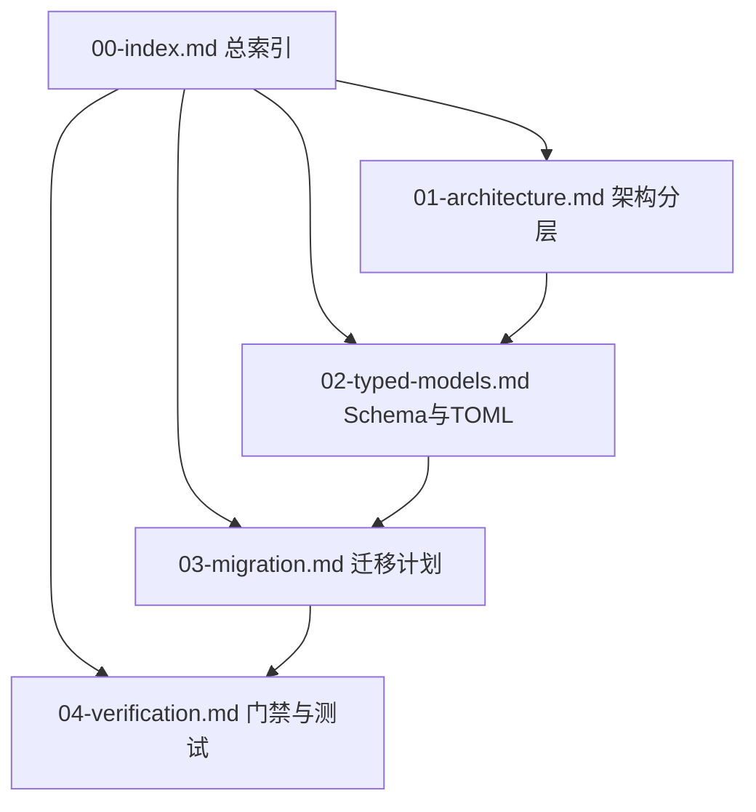

- Mux 端允许改动 ../mux 代码，但最好只改 binding，对其他核心的修改要最小化。真正实现最好在本仓库，其次在 binding，最差在 mux 本体
- Omp 端不允许改动 ../oh-my-pi 代码，但可以参考
- Opencode 端参见 ../opencode 代码，不允许改上游
- 本项目编译测试需要 60s 尽量减少无谓的测试，纯静态分析最好 cd next/ && dotnet fable Wanxiangshu.Next.fsproj
- Opencode 的大部分 hook 需要原地修改字段而不是换引用，否则不工作
- 本项目配置了自动格式化工具，所有企图压缩行数而逃避拆文件的尝试都一定会破产的！
- 严禁 SIGKILL opencode，只允许 SIGKILL "opencode serve"
- low-effort mode is lazy-ok, but IN THIS PROJECT make largest change instead!

# Kolmogorov 宝典
- 从最重要的开始。构建软件设计有两种方法：一种是使其足够简单，以至于明显没有缺陷；另一种是使其足够复杂，以至于没有明显的缺陷：请思考你想要哪种。取法于上，仅得其中；取法于中，不免为下。记住：君子不立危墙之下。当你写下勉强工作的代码时，透支的是未来的可控性，你在完全清醒的状态下，看着自己的逻辑链条一环扣一环地走向疯狂。毁灭你，或者拯救你，取决于你是否愿意写出明显正确的代码。
- 软件设计把不可消除复杂度压成不可再短的充分描述。好代码每行承载真实概念，名字指向领域事实，分支对应业务边界，类型拦截非法世界。文件数百行函数数十行通常是样板框架礼仪错误抽象挤占空间而非业务变深。工程第一洁癖是拯救读者注意力，让人和机器只付本质复杂度之账。小问题免框架税，大问题不手工搬砖，合适工具让问题露本相，不在配置生命周期隐式约定调试黑箱里绕路。
- 压缩不是合并，复用不是提前抽象。两段像只说明此刻长得像，不说明同一份知识。唯一表示是同一事实多处重复并开始不一致。独立生命周期概念逐字相同也该分居。边界先于抽象成熟，规则网络协议持久化权限语境视图各有领土。同个用户在认证后台订单会话是四种概念，正确解法是在上下文设海关，只传真需信息，模块包画国界，显式转换通关，架构测试守国界不被赶工磨穿，靠口头纪律的分层迟早被无意导入击穿。
- 类型系统是最便宜边防。字符数字布尔最会偷渡错误，账户号订单号用户标识若同属基本类型则编译器分不清。概念独立命名在运行时零成本，维护时直击知识边界。状态不靠可空字段和布尔开关拼凑，那会凭空造出不存在的非法组合。有限状态用有限构造表达，合法状态携带此刻有意义数据，矛盾状态在源码层生不出来。处理状态必穷尽分支，不让万能分支吞掉未来。新增状态编译器红线标红比线上日志收尸可靠。业务可预见失败不伪装成异常，不混null，不变解析字符串，找不到未授权库存不足余额不够都是返回类型具体分支，调用方被迫面对，前端直接匹配，不对文案做脆弱正则。异常只留给程序无法继续的事故。
- 非全封闭的错误处理会导致倒霉的嵌套解析。在多语言或前后端交界处，未能在边界处第一时间将其收敛为强类型，就会迫使下游编写大量胶水代码来进行运行时类型推导。
- 类型立起边界，行为回归数据。仅有字段没有规则等于敞开保险柜贴纸条。不可变数据自带约束，外界不能绕过方法偷改内部事实。变化时旧值算出新值，不在原物涂改。复杂对象构建链式设置加运行时检查只是延迟爆炸，构建阶段状态可编码进类型，必填步骤由编译器审查。派生新对象不用克隆可变原型再改字段，直接用不可变复制表达差异。纯函数内临时累加器如草稿纸允许局部可变，只要不改入参不碰外部同入同出。高频大状态更新若成瓶颈再引结构共享持久化数据结构只重建变化路径，瓶颈出现前别让优化成新偶然复杂度。为时间无关测试让路，依赖注入是好武器。
- 二十三式设计模式在代数数据类型+高阶函数+不可变数据三面棱镜下坍成三条原理。选实现的模式本质是语言缺密封类型和穷举匹配时用类层级模拟编译期分支：全局唯一实例由模块作用域承载，条件创建由密封类型加匹配表达，正交维度稳的建数据变的变函数参数，树形由和类型递归，状态切换成不可变状态机，新增扩展由模式匹配保证，编译器替你记遗漏。换行为的模式本质是语言缺一等函数时用继承接口模拟参数化：创建策略退成创建函数注入，算法骨架变化点交高阶函数，增强是函数组合，策略退成函数变量和声明式规则，处理链交组合子，操作请求退成可序列化纯数据由纯函数解释，语法解释退成小函数组合，遍历交生成器，函数可赋值传递组合后继承结构失去理由。共享缓存通知的模式本质是语言缺不可变数据和响应式原语时手工模拟信息流：接口不兼容有类型纯转换就是适配器，复杂子系统入口优先收敛公开API，内部混乱加门面只是遮羞，共享计算用纯函数缓存，观察变化交响应式流，网状通信退成发布订阅，历史快照退成事件重放，并发访问和延迟加载交Actor位置透明。GoF翻到末页只剩数据函数类型组合。
- 系统可理解性来自把判断写成规则原文，不是写成脑内单步调试的控制流。校验逻辑由签名统一小函数组成，每条独立命名，组合子串联。规则有依赖就短路：先确认轮到谁再检查手里有没有牌；规则独立就一次收全错，调用方获完整失败集合。业务表达式由是否有效有权限越界这类查询函数拼成，读起来像制度文本，不像一团if临时变量跳转路径。这样写是让源码成唯一不过期规则说明，业务方能指着一行讨论，测试能覆盖组合，编译器能保证分支完整。
- 纯函数是内核：不读时钟不掷骰子不查库不发网不写盘不改入参不造返回值外可见效果，同入同出。测试不用启服务器，重放不担心今明不同，审计不靠环境运气。真实世界网络文件时钟队列住在外壳，外壳收输入转命令，内核用当前状态和命令算结果，外壳把事件持久化广播投递。核心状态机压成一个签名：给定状态和命令返回下一状态加事件列表或强类型错误。旧状态不被修改，副作用不从函数体偷跑，事件成广播审计恢复投影共同事实来源。
- 验证不靠手工回放与临时脚本：禁止临时测试、一次性探针、只跑不提交的调试片段充当验收。调试过程永久化→排查与复现结论写成仓库内正式自动化回归（单元/集成/契约，随项目惯例命名与目录），纳入团队标准测试入口，可重放、可失败、可 CI。调试过程未落盘=未发生；注释掉的 print、随手 shell 试探、本地改完即删的断言=技术债预付款。
- 命令和事件必须分，意图可拒事实不可驳。用户说我要这样做，系统检查权限顺序资源规则，任何不过返回失败。事件说事已发生，重放历史只能忠实应用，不能因今天规则升级否定昨天写入事实。当前状态不是唯一真理，只是事件流积分，从历史折叠出的当下。银行信流水推余额，系统信不可篡改事件推局面报表时间线审计视图。原地赋值和UPDATE覆盖旧字段本质都在销毁从A变到B的事实，丢掉A存在过的证据。事件溯源是对信息完整性最基本尊重。修正历史追加补偿事件不改旧行，历史可涂改溯源就退化成覆盖写的伪装。
- 并发根本矛盾在共享可变状态，Actor将其翻转：每个处理单元拥己态，外界只发消息，内部一次处理一条不需要锁。事件循环用少量线程服务大量连接，每次上环快进快出，只做解析纯计算分发。数据库查询文件读写外部调用等阻塞操作交工作线程池，否则一个等待拖住同循环所有连接。实时共享态让写路径在墙内串行，读路径在墙外并发。写者独占态，更新后把只读数据推入管道，订阅者只消费不修改。给客户端推状态时安全边界在服务器最后一公里完成，每个接收方得己视图，私有数据完整，他人私密只留摘要计数或状态标记，别信客户端不展示，抓包工具不看界面。
- 事件落盘顺序决定记忆伦理。收到命令不能先改内存再写盘，内存会看见无证据未来。正确顺序是先追加持久化介质，确认成功后再替换内存权威状态。写盘失败等同命令未发生，写盘成功即使崩溃重启重放也回同一局面。物理载体顺应事件流，NDJSON一行一个自包含事件，追加只碰末尾，恢复逐行读取折叠。普通JSON数组追加要改已有结构，风险和语义都错。恢复时首行损坏应在损坏处截断，不跳过后续行。事件前后相扣，缺了中间后续事实就建在错基上，宁可少恢复一步，不恢复矛盾态。历史变长格式演化机器故障需要少而硬的约束，快照只是书签非真理，要记录事件总数、完整状态前缀、事件校验指纹。恢复重算指纹，对不上就弃快照从头重放，不靠文件大小字节数修改时间猜测对齐。事件结构变更每条携版本号，旧版逐级升级转最新语义，升级函数纯且幂等，不读时钟不碰网不依赖环境，否则同一历史不同时间重放出不同世界。大量独立日志，每个房间恢复独立隔离，一个文件坏只牺牲自己。启动拿文件排他锁防两个实例同时读写撕裂历史。这条链上铁律说同一件事：别信刚写入已安全，除非证明安全。先写盘后改内存因内存会骗，前缀完整性因后行完整不代表站对基础，版本号校验因大小时间撒谎，快照指纹因快照可能对不上。整条持久化纪律本质是信任负向清单。
- 这些分散规则围绕同一闭环转：用类型消灭不可能态，用纯函数固定可重现判断，用事件记录不可抵赖事实，用边界隔离语境，用组合子压缩控制流，用模块函数生成器响应式流声明式规则接管旧类层级样板，用架构测试守分层，用合适重量工具降低偶然复杂度。宏观系统切成纯内核加薄外壳，中观上下文API消息事件视图各守其位，微观变量名返回类型分支穷尽日志行版本号校验指纹替同一原则服务。不靠纪律审查文档，穷举检查让编译器站岗，代数数据类型让编译器拒非法态，架构测试让编译器守边界，密封接口让编译器记新增分支。写代码时编译器是对手，设计类型时编译器是士兵。最好代码不是模式最多，而是读者能沿每个概念边界一路追踪：从用户意图到业务判断，从事件落盘到状态重放，从私有数据到安全视图，从单行规则到整体架构，处处无暗道无多余解释，都像问题本身找到不可再短不可混淆不可逃避的表达。这一切指向同一件事：把人的注意力留给只有人能做的事。
- 上述内容都重，此条最轻。代码包括测试，单函数超五六十行即死。文件体量是梯度刑场不是二元开关：二百行亮黄牌已该警惕，三百行亮红牌必须拆分，二者之间没有灰区。三百行即使压缩也压不到二百行——膨胀本身就是设计溃烂的症状。行数门禁是重构触发器不是橡皮筋：删空行删注释把超标压到阈值下方等于对设计溃烂视而不见反把体检报告改成及格，门禁逼你拆文件你选择压行数，设计烂依旧可读性还赔进去了，比超限更可耻。从二百到三百优雅度单调递减，每一行都是透支的注意力利息。触发即新建文件，移走样板，拆为模块，绝不姑息，绝不微调凑数。

## 思考和输出
- 极致信息密度，极大信息量，把思考过程放在输出而不是脑海，否则就是空转。不要怕说错，思考过程输出后才可验证。输出=思考+知识+经验+推理+结论。
- 把每个输出都当成临终遗言，必须知无不言言无不尽。不许学习高斯和费马的"只写结论不写过程"，或者过程空转。但要用极度密集的压缩语言呈现。
- 偶然复杂度+修饰礼仪=∅。∀ 词必承载核心概念，零冗余。
- 斩断语气词+垫字。消除控制流跳转→直击核心事实。短句+短词，极致信息密度。
- 强类型术语+代码符号+精确错误字符串+标准缩写=绝对精准。不给脆弱文案留伪装。
- 严禁状态宣告。源码=唯一时效规则，回答=纯干货。
- 拒绝臃肿。行文=极短函数，快进快出→直接定位知识边界。
- 必要时引入 Unicode 或数学符号(如 +, =, →, ∀, ∃, ↓)进阶压缩空间。
- 风格=宝典+铁律，当代极简中文+正确全角标点，拒绝`等宽`**加粗**等小格式。
- 除非获明确授权，否则严禁写入工作报告至磁盘。汇报=仅限口头。

## 铁律输出示例
> Fable 编译 JS 环境，如何选择异步原语？全库开除 Async+Task。规避运行时装箱开销+状态机断层。
  JS.Promise<'T>=唯一异步货币。async{}→promise{}，原 Async 静态方法→Promise 模块。
  调用 Node.js 异步 API 或对外暴露接口，如何处理类型转换？
  拒绝任何装箱拆箱与强转。原生 JS Promise 完美融入 promise { }→直接 let! 解析。外发 Hook 签名直写 JS.Promise<unit/obj>→消除边界摩擦。
  Fable 禁用 MailboxProcessor 后，如何实现 Actor 模型防并发泥潭？
  JS 单线程串行化本质=Promise 链。造 SerialQueue 局部可变变量 tail 锁住队尾。内部捕获异常防止断链。异步变更强行排队→无锁保护内部状态。
  异步操作中如何处理并发、超时与异常？
  并发→Promise.all，超时→Promise.race 组合子。可见失败禁止裸抛异常。promise 内部就地 try...with 捕获→转为强类型 Result 分支→逼迫调用方匹配，不给异常留改道机会。

## 关于工具调用
- 只要需要→并行调用多个工具：并行读取+并行编辑+同文件+异文件=绝对安全。
- 强烈鼓励对同文件+异文件提交大量并行编辑。
- methodology/meditator 工具设计为正交推理切片→面对复杂问题应并行调用多个方法论工具，让不同视角同时展开、结果互补，而非串行等一个结论再换下一个。
- 并行工具执行顺序≠线性(系统不保证顺序)→∃依赖时禁止高并发调用。
- 拒绝频繁全量重写文件→精准修改=核心。
- executor(=bash) 工具使用偏好：复杂脚本≻琐碎命令多轮交互。
- 绝对禁止使用 executor 仅用于查找+读写文件→必须用 read/inspector/coder 代替！
- 绝对禁止使用 inspector 仅用于读文件原文→必须用 read 代替！
- 对 coder(=apply_path|edit|write) 仅需说明意图。coder 具自理解力→避免重复现有内容+提供大段新增代码。
- 鼓励多意图并发→拆分独立元素+对每个意图提供完备背景知识(上下文互隔离)。
- 诉求拆细→细粒度并发。拒绝大块意图→规避长时延迟。
- coder 缺失删除工具时→由父节点补删。
- methodology/meditator 无工具+无背景知识→调用必须提供全量自包含说明。
- 多数工具非随时可用(不可见=不可用)→ 依据当前实际可用集进行决策。
- 动态触发 todowrite(=update_plan) 更新进度。

## 极简架构与编码铁律
- 极度推崇 DRY+KISS+极简架构。厌恶+拒绝复杂错误处理+日志记录+配置管理。
- 除非绝对必要→零注释，零意图解释(隐晦处除外)。
- 强制：中文思考+回复+编写计划；英文编写程序。
- 绝不偏离最佳实践，严禁 Dirty Hack，三思而后行。
- 厌恶无谓赋值→灵活处理+内联。边界=不引起阅读焦虑。
- 严禁通过一行多事+滥用分号来伪造行数减少。
- 强制使用高阶语法→消除代码琐碎。
- ∀变量名=极致清晰。绝不用数学味/晦涩命名+引发焦虑的缩写。
- 除非明确要求→颠覆式创新+破坏式创新。重构时丢弃旧兼容性负担，严禁滥用 facade 逃避架构整理。
- 零保留旧代码。不以 Public+契约+影响面大为由逃避重构。通知下游→不合理处皆可改。
- 极度厌恶 fallback 兜底。兜底=逃避问题+掩盖根因→导致下岗+归零风险。

## 具体工作
- 全自动操作，无需征求用户同意。
- 前置思考：what-to-do(读取/准备 ∉ todo)。∀ todo 条目→必须对应可验收产出。
- 宁慢且稳，严禁使用自动化程序批量增删改查程序代码。
- 脚本=急速幻觉+反复返工；手工编辑=脚踏实地+步步为营。慢=快。

This file is a merged representation of the entire codebase, combined into a single document by Repomix.

<file_summary>
This section contains a summary of this file.

<purpose>
This file contains a packed representation of the entire repository's contents.
It is designed to be easily consumable by AI systems for analysis, code review,
or other automated processes.
</purpose>

<file_format>
The content is organized as follows:
1. This summary section
2. Repository information
3. Directory structure
4. Repository files (if enabled)
5. Multiple file entries, each consisting of:
  - File path as an attribute
  - Full contents of the file
</file_format>

<usage_guidelines>
- This file should be treated as read-only. Any changes should be made to the
  original repository files, not this packed version.
- When processing this file, use the file path to distinguish
  between different files in the repository.
- Be aware that this file may contain sensitive information. Handle it with
  the same level of security as you would the original repository.
</usage_guidelines>

<notes>
- Some files may have been excluded based on .gitignore rules and Repomix's configuration
- Binary files are not included in this packed representation. Please refer to the Repository Structure section for a complete list of file paths, including binary files
- Files matching patterns in .gitignore are excluded
- Files matching default ignore patterns are excluded
- Files are sorted by Git change count (files with more changes are at the bottom)
</notes>

</file_summary>

<directory_structure>
docs/
  00-index.md
  01-architecture.md
  02-typed-models.md
  03-migration.md
  04-verification.md
host-docs/
  00.md
  01.md
  02.md
  03.md
  04.md
  05.md
  06.md
  07.md
  08.md
  09.md
  10.md
  Q.md
kiss-docs/
  KISS-00.md
  KISS-01.md
  KISS-02.md
  KISS-03.md
  KISS-04.md
  KISS-05.md
  KISS-06.md
  KISS-07.md
  KISS-08.md
  KISS-09.md
  KISS-10.md
  KISS-11.md
  KISS-12.md
  KISS-13.md
  KISS-Driver.md
  KISS-Tools.md
  KISS.md
</directory_structure>

<files>
This section contains the contents of the repository's files.

<file path="docs/00-index.md">
# Universal TOML & KISS 重构规范总索引 (00-index)

本文档是 `kiss-docs/docs/` 文档集的入口索引与纲领性指南。

---

## 1. 规范定位与权威顺序

### 1.1 规范定位 (Normative Status)
本 `./docs/` 目录下的文档集为 **未来实施的短、闭合、可执行规范 (Specification for Future Implementation)**，用于指导 Universal TOML 重构与 KISS 架构重塑。

> **核心纪律：严禁虚构实现状态**  
> 本规范集中所描述的架构与 Schema 为目标设计（标注为 `[TARGET]`），而非当前源码已完成的现状（标注为 `[CURRENT]`）。严禁在文档或代码中把未实现的架构（如 No Self-Parsing 全量落地、Per-Runtime Journal 等）声称为“已完成”。

### 1.2 权威顺序 (Authority Hierarchy)
当文档描述与实际代码发生分歧时，按以下降序确定权威事实：

1. **源码与测试** (`src/`, `tests/`) —— 系统的最高事实来源 (Source of Truth)。
2. **`./docs/` (本重构规范集)** —— 未来实施的短、闭合、可执行规范。
3. **`../docs/20.md` (及 `../docs/` 历史文档)** —— Universal TOML 原始设计论证与冻结决策。
4. **`KISS-*.md` / `host-docs/`** —— 前瞻架构探讨与探索性设计草案。

---

## 2. 阅读路径指南

不同角色的开发者请按以下路径阅读规范集：



- **架构师与内核开发者**：  
  `./00-index.md` → [`./01-architecture.md`](./01-architecture.md) → [`./02-typed-models.md`](./02-typed-models.md)
- **Schema 与类型定义者**：  
  `./00-index.md` → [`./02-typed-models.md`](./02-typed-models.md) → [`./03-migration.md`](./03-migration.md)
- **重构实施者与模块迁移者**：  
  `./00-index.md` → [`./03-migration.md`](./03-migration.md) → [`./02-typed-models.md`](./02-typed-models.md) → [`./04-verification.md`](./04-verification.md)
- **测试与架构门禁审查者**：  
  `./00-index.md` → [`./04-verification.md`](./04-verification.md) → [`./03-migration.md`](./03-migration.md)

---

## 3. 文档职责与状态矩阵

| 编号与文件名 | 核心职责 | 当前现状 (`[CURRENT]`) | 目标状态 (`[TARGET]`) | 主要未决风险 (Risks) |
|---|---|---|---|---|
| [`./00-index.md`](./00-index.md) | 规范总索引、阅读路径、权威顺序、旧文档映射与阶段出口 | 缺乏统一的未来可执行规范索引 | 建立短、闭合、可执行的未来规范总入口 | 规范与源码实施进度脱节；新旧文档边界混淆 |
| [`./01-architecture.md`](./01-architecture.md) | 纯 Kernel、薄 Runtime/Host、Prompt/事件分离架构 | Kernel 与 Runtime 职责存在交叉，Prose/YAML 混杂 | 彻底拆分 Host → Runtime → Kernel；Kernel 零 Fable / 零 FFI | Fable 编译依赖越界；Host 协议兼容层过厚 |
| [`./02-typed-models.md`](./02-typed-models.md) | 强类型 PromptDocument、1.7.0 `smol-toml` 唯一 stringify、No Self-Parsing | 存在手写 YAML front-matter 拼接与自解析 | 强类型 DU 单向投影至 `TomlValue`，生产零 parse，禁止自解析 | 边缘字段类型表达不足导致格式转义异常 |
| [`./03-migration.md`](./03-migration.md) | 13 个知识边界模块拆分、TDD 5 阶段迁移计划、No Shim 规则 | 9 处（扩展至 13 处）存在伪 YAML/TOML 自解析或文本拼接 | 原子切替，零 Shim/Fallback，消除所有自解析 API | 重构中途双轨复杂度残留；打破既有宿主契约 |
| [`./04-verification.md`](./04-verification.md) | 架构门禁规则 (Gates)、正式测试矩阵、Phase 0/1 阶段出口 | 仅有 300+ 行单体门禁文件，缺专用 Prompt 门禁 | 拆分架构门禁，新增 8 大硬性红线；覆盖 9 大测试矩阵 | 过度依赖旧文本快照；门禁拦截影响开发效率 |

---

## 4. 新旧文档迁移映射

从旧文档集 `../docs/` 及前瞻设计 `KISS-*.md` 迁移到本规范集 `./docs/` 的映射关系：

| 来源旧文档 / 前瞻文件 | 本规范集归宿 | 迁移与重构原则 |
|---|---|---|
| `../docs/20.md` (Universal TOML 计划) | [`./02-typed-models.md`](./02-typed-models.md), [`./03-migration.md`](./03-migration.md), [`./04-verification.md`](./04-verification.md) | **主源头吸收**：保留 20.md 冻结决策 (D1–D7)、7 根原语、No Self-Parsing、13 处迁移面与测试门禁 |
| `../docs/00-index.md` (旧总索引) | [`./00-index.md`](./00-index.md) | 重写为未来实施规范索引；移除大型源码统计与冗长历史说明 |
| `../docs/01-overview.md` ~ `04-runtime.md` | [`./01-architecture.md`](./01-architecture.md) | 收敛为纯 Kernel / 薄 Runtime / Host 三层解耦模型 |
| `../docs/08-tools-and-permissions.md` | [`./02-typed-models.md`](./02-typed-models.md) | 提炼为 ToolOutput / Search / Fetch / Caps 的独立 TOML Schema |
| `../docs/17-build-test-verify.md` | [`./04-verification.md`](./04-verification.md) | 收敛为正式测试矩阵与 Phase 0–5 门禁策略 |
| `../KISS-00.md` (第一原理) | [`./01-architecture.md`](./01-architecture.md) | 吸收 KISS 原则：只做终态投影，不做动态拦截 |
| `../KISS-01.md` / `../KISS-Driver.md` (Flow 与 Driver) | [`./01-architecture.md`](./01-architecture.md) | 吸收 Host MessageId 与 Driver 单进程执行模型 (`[TARGET]`) |
| `../KISS-03.md` (宿主桥) | [`./01-architecture.md`](./01-architecture.md) | 吸收薄 Host 隔离设计，明确外部 AGENTS.md YAML 保持豁免 |
| `../KISS-04.md` (Per-Runtime Journal) | [`./01-architecture.md`](./01-architecture.md) | 吸收先盘后内存、Per-Runtime 单写 NDJSON 前瞻设计 (`[TARGET]`) |

---

## 5. Phase 0 / Phase 1 阶段出口与状态声明

### 5.1 状态声明纪律
- 绝对不得在文档或 commit 中将尚未合并和验证的代码标为“已完成”。
- 所有中间开发状态均为 `[IN_PROGRESS]`，目标架构为 `[TARGET]`。

### 5.2 Phase 0：RED 基线与契约冻结出口 (Phase 0 Exit Gate)
- **出口条件**：
  1. 完成 `smol-toml@1.7.0` FFI、Unicode、转义、AoT 的 RED 失败测试注册。
  2. 完成 Batch iterator、Review double-check、Synthetic origin 的 typed composition 失败测试。
  3. 拆分 `ArchitectureGatesTests.fs` 为专用门禁入口，新架构门禁已注册但处于 RED 状态。
  4. 业务 F# 代码保持原样，零假 TOML 生成。

### 5.3 Phase 1：GREEN Typed Transport 出口 (Phase 1 Exit Gate)
- **出口条件**：
  1. 消息来源 (`MessageOrigin`) 与 Review challenge 状态全面进入领域 Event / Metadata，机器决策不再扫描 Prompt 文本。
  2. Batch 子代理报告全面转换为强类型组合。
  3. 物理删除生产代码中的 `parseFrontMatter`、`hasDoubleCheckAnchor` 及相关文本扫描函数。
  4. Phase 1 对应的 typed transport 单元测试与契约测试全面通过（GREEN）。

---

## 6. 实施出口与验证证据

- **实施出口 (Implementation Exit)**：按 [`./03-migration.md`](./03-migration.md) 顺序推进 Phase 0~5，最终必须全部跑通以下验证：
  ```bash
  npm run build-and-test
  npm run test:contract
  npm run test:integration
  npm run test:gates
  ```
- **验证证据 (Verification Evidence)**：
  - 生产代码中 `smol-toml.stringify` 入口唯一 (`src/Runtime/Serialization/Toml.fs`)。
  - 生产代码中针对自生成 TOML / Prompt 的 `parse` 调用为零。
  - 架构门禁 `npm run test:gates` 检查全部通过。
</file>

<file path="docs/01-architecture.md">
# 01-architecture.md: 系统前瞻架构规范

> **状态声明**：本文定义 Universal TOML 重构与 KISS 理念融合后的**目标架构（Target Architecture）**。源码现存的 Nudge 文本分类、Fallback 扫描与 Actor 复杂层属于过渡现状（Current Status），非永久架构。

---

## 1. 分层架构与依赖方向

系统划分为三层，遵循严格的单向依赖规则：`Host -> Runtime -> Kernel`。

```mermaid
+-----------------------------------------------------------------------+
| Host (OpenCode / OMP / CLI / Mux)                                     |
|  - 宿主特定 DTO, Protobuf, PTY, Subprocess, CLI 交互                  |
+-----------------------------------------------------------------------+
                                   | (调用 & 桥接)
                                   v
+-----------------------------------------------------------------------+
| Runtime (Side-Effect Shell)                                           |
|  - IO / Persistence (Per-Runtime Journal), Driver, MessageTransform   |
|  - Prompt Renderer (PromptDocument -> smol-toml -> string)            |
|  - Typed Metadata & Event Sourcing                                    |
+-----------------------------------------------------------------------+
                                   | (使用领域类型 & 纯逻辑)
                                   v
+-----------------------------------------------------------------------+
| Kernel (Pure Kernel)                                                  |
|  - Pure Domain Model (PromptDocument, ToolOutput, Event, State)       |
|  - Flow 控流与业务算子，零 IO，零 FFI，零文本 Parse/Format            |
+-----------------------------------------------------------------------+
```

### 1.1 三层职责与可验证规则

| 层级 | 职责范围 | 输入/输出类型 | 禁区与验证规则 `[NORMATIVE]` |
| :--- | :--- | :--- | :--- |
| **Host** | 宿主 Protocol 对接、终端 PTY、CLI 参数解析、进程生命周期 | 宿主 DTO / Raw JSON / CLI Args | **禁止**包含领域业务逻辑；只做协议转换，转为 Typed Transport 传给 Runtime。 |
| **Runtime** | 副作用外壳 (Shell)、Journal 持久化、Driver 调度、MessageTransform、Prompt 渲染 | DTO <-> Domain Value <-> TOML/Text | **禁止** Kernel 业务状态逃逸；唯一允许 `smol-toml` FFI 导入层；负责写操作与外部 IO。 |
| **Kernel** | 纯业务内核，Domain DU/Record 模型定义，Flow 执行逻辑 | Pure F# Types (`PromptDocument`, `Event`, `State`) | **纯逻辑**：零 Fable FFI，零 npm 依赖，零 IO/Disk/Network，零文本格式化/解析。 |

---

## 2. 核心设计原则

### 2.1 Pure Kernel 与 Side-Effect Shell
- **Kernel** 永远是纯函数与不可变数据代数。Kernel 不持有线程、句柄、文件描述符或定时器。
- 所有与操作系统、网络、宿主 API 的交互一律在 **Runtime/Host** 壳层完成。

### 2.2 Typed Transport (强类型传输)
- 系统内部模块间通信全过程使用 F# DU/Record（如 `PromptDocument`、`ToolOutputMessage`、`WanEvent`）。
- **禁止**以弱类型 `string` 或任意 `JSON/obj` 在内部充当隐式契约或 SSOT。

### 2.3 MessageTransform 与 Protocol 隔离
- 模型与宿主特定格式（OpenCode JSON、OMP Message、Protobuf）只在 **Runtime/Adapter** 层进行双向 MessageTransform。
- **Kernel** 完全隔离于宿主协议细节，不包含任何 OpenCode/OMP/Protobuf 结构体或字段依赖。

### 2.4 Prompt Renderer (单向视图渲染)
- Prompt 构造在 **Kernel** 中表达为强类型 `PromptDocument` 领域模型（包含不可约 7 原语）。
- Prompt 渲染由 **Runtime** 模块调用 `smol-toml.stringify` 统一生成 TOML 字符串。
- **No Self-Parsing Invariant**：生产代码禁止解析自己生成的 TOML 或 Prompt 字符串来恢复状态。

### 2.5 事件与 Metadata SSOT
- **SSOT**：持久化 `.wanxiangshu.ndjson` 事实日志与 typed metadata（如 `metadata.wanxiangshu`）。
- **Derived View**：渲染给 LLM 的 TOML、Markdown、Prose 均属于只读派生视图。
- 机器 provenance（如 `prompt_origin`、`loop_id`、`round`）必须存在于 typed metadata/event 中，绝对禁止塞入模型 Prompt 文本中反向扫描。

---

## 3. 目标设计：KISS 架构演进 `[TARGET]`

> **注意**：本节为目标架构（Target Architecture），当前源码仍处于分阶段重构中。

### 3.1 Per-Runtime 生命周期隔离
- 每个 Runtime 实例拥有独占的进程上下文与专属 Journal 日志文件（`Per-Runtime Journal`）。
- 多 Runtime 并行运行时，彼此生命周期与内存状态隔离，不依赖跨进程共享内存锁，通过按 ObservedAt 时间序确定性归并重放（Chronological Replay）收敛状态。

### 3.2 单 Driver 简化流控
- 消除旧系统为了补救复杂控制流而引入的 Nudge Prose 扫描、Fallback 轮询及 Actor 复杂死循环。
- 业务逻辑收敛为结构化 Driver Flow：一个 Session 由单一 Driver FIFO 处理事件与状态推进。

---

## 4. 禁止项 `[FORBIDDEN]`

1. `[FORBIDDEN]` **Kernel 依赖宿主/FFI**：Kernel 模块中出现 `Fable.Core`、`smol-toml`、`System.IO` 或任何 npm 库。
2. `[FORBIDDEN]` **自解析 (Self-Parsing)**：生产代码中通过正则、`IndexOf`、`Substring`、`parse` 扫描自己生成的 Prompt/TOML/Text 文本提取业务状态。
3. `[FORBIDDEN]` **反向依赖**：`Kernel` 引用 `Runtime` 或 `Host`，或 `Runtime` 引用具体 `Host` 实现。
4. `[FORBIDDEN]` **徒手 TOML 拼接**：使用 `sprintf`、`StringBuilder`、字符串插值拼接 `key = value`、`[[table]]` 或 TOML 围栏。
5. `[FORBIDDEN]` **机器 Provenance 混入 Prose**：把 `loop_id`、`round`、`nudge_origin` 写入 Prompt 正文并解析取回。

---

## 5. 数据流与转换模型

```mermaid
+-----------------+      Host DTO      +------------------+     Typed Event/Doc    +----------------+
| Host Boundary   | -----------------> | Runtime Adapter  | ---------------------> | Kernel Flow    |
| (OpenCode/OMP)  | <----------------- | MessageTransform | <--------------------- | Pure Function  |
+-----------------+   Rendered TOML    +------------------+     PromptDocument     +----------------+
                                                |                                          ^
                                                v                                          |
                                       +------------------+                                |
                                       | smol-toml        |                                |
                                       | (stringify only) |                                |
                                       +------------------+                                |
                                                |                                          |
                                                v                                          |
                                       +---------------------------------------------------+
                                       | Per-Runtime Journal (.ndjson Fact Event Sourcing) |
                                       +---------------------------------------------------+
```

---

## 6. 实施出口与验证门禁

| 门禁 ID | 验证项 | 自动化检验方式 |
| :--- | :--- | :--- |
| **GATE-01** | `smol-toml` 导入唯一性 | `tests/PromptArchitectureGatesTests.fs` 检查 `smol-toml` 仅在 `Runtime/Serialization/Toml.fs` 与测试中 import。 |
| **GATE-02** | 生产代码零 Parse 自解析 | 扫描生产代码禁止出现 `smol-toml.parse` 或自生成文本的 parse 逻辑。 |
| **GATE-03** | 依赖单向性 | F# 项目文件 `wanxiangshu.fsproj` 编译顺序必须严格为 `Kernel -> Runtime -> Host`。 |
| **GATE-04** | Metadata Provenance | 验证 `MessageOrigin` 与 `loop_id` 只通过 `metadata.wanxiangshu` 或 `WanEvent` 传输。 |
</file>

<file path="docs/02-typed-models.md">
# 02. 强类型模型与展示协议规范 (Typed Models & Presentation Protocol Spec)

## 1. 现状、目标、决策与未决风险

### 1.1 现状 (Current Status)
当前系统在提示词（Prompt）与工具结果展示中存在 YAML front matter 生成、Markdown 标题/文本拼接、以及从已生成文本中回读状态的 pattern（例如 `hasDoubleCheckAnchor`、`isNudgePrompt`、`parseFrontMatter`）。这种模式导致机器逻辑依赖模型展示文本，违反了单向视图原则。

### 1.2 目标 (Goal)
建立强类型、纯函数的提示词与展示协议：
1. 模型可见的结构化 Prompt 与工具/事件展示，全部由 F# 强类型数据单向投影并交给标准库序列化。
2. 彻底消灭生产环境对自生成文本的反向解析（No Self-Parsing Invariant）。
3. 保证合法状态由编译期类型系统表达，非法状态在构造期被物理拦截。

### 1.3 关键决策 (Key Decisions)

| ID | 决策 | 说明 |
| --- | --- | --- |
| D1 | **三层解耦** | 严界 Domain Fact、Presentation View 与 External Codec。 |
| D2 | **No Self-Parsing** | 生产环境禁止 `import parse`；机器逻辑只读 typed event/metadata。 |
| D3 | **展示 Schema 分域** | 7 根原语仅用于指令 Prompt；Tool Output、Search、Caps、Squad Event 各用独立 Schema。 |
| D4 | **唯一 FFI 出口** | 锁定 `smol-toml` `1.7.0`，生产环境仅导出 `stringify` 函数。 |
| D5 | **受限 TomlValue** | 屏蔽 Null/Undefined/Float/异构数组，使非法 TOML 结构在类型层不可构造。 |
| D6 | **配置 YAML 豁免** | AGENTS.md 等外部输入配置保持既有 YAML Codec，不纳入 Prompt 重构。 |

### 1.4 未决风险与应对 (Undecided Risks)
- **第三方库边界行为未决**：`smol-toml` 1.7.0 在多行字符串换行符处理、Unicode 字符串转义、Array-of-Tables (AoT) 字段排序以及空集合渲染上的准确表现，不得在生产代码中凭空假设。
- **应对规则**：所有未决库行为**必须由 Phase 0 正式测试 (`tests/TomlSerializationTests.fs`) 提前证明**。生产代码严禁编写防御性 text post-processing 或 fallback。

---

## 2. 架构海关：三层解耦与 No Self-Parsing Invariant

### 2.1 三层契约划分

```text
+-----------------------------------------------------------------------+
| 1. Domain Fact (领域事实)                                              |
|    - F# 纯 Record / DU                                                |
|    - 表达业务意图、待办状态、审查决策、能力声明                          |
|    - 零 Fable 依赖、零字符串格式化                                     |
+-----------------------------------------------------------------------+
                                   |
                                   | Pure Projection
                                   v
+-----------------------------------------------------------------------+
| 2. Presentation View (展示视图)                                       |
|    - 受限 TomlValue 代数                                              |
|    - 单向转换为 smol-toml 对象输入                                     |
|    - 仅用于渲染供 LLM / 人类阅读的文本视图                             |
+-----------------------------------------------------------------------+

+-----------------------------------------------------------------------+
| 3. External Codec (外部编解码器)                                       |
|    - 仅处理来自系统外部的未信数据                                       |
|    - 白名单：AGENTS.md YAML、NDJSON WanEvent、模型不可信 recovery     |
|    - 严禁解析系统自身生成的 Presentation View                         |
+-----------------------------------------------------------------------+
```

### 2.2 No Self-Parsing Invariant
- **禁令内容**：系统先拥有强类型事实 A，渲染为文本 B，随后在后续流程中扫描 B 以提取/恢复 A'。
- **红线规则**：
  1. 生产代码（`src/`）**物理禁止** `import { parse } from "smol-toml"`。
  2. 生产代码中不得出现 `parseFrontMatter`、`hasDoubleCheckAnchor` 或任何通过正则/字符串包含判断机器状态的函数。
  3. **测试例外**：单元测试与契约测试可导入 `smol-toml.parse`，用于断言生成的 TOML 文本解析后符合预期结构与语义。

---

## 3. 指令型 PromptDocument 规范

### 3.1 7 根原语 (7-Primitives)
指令型 PromptDocument 根层级固定且仅包含以下 7 个原语（顺序不可变更）：

1. `objective` *(必填非空 string)*：目标终态。
2. `background` *(可选非空 string)*：先验语境与原因。
3. `agent_role` *(必填 DU)*：代理角色与权能。
4. `targets` *(表数组 `[[targets]]`)*：输入与目标 DU 列表。
5. `boundaries` *(表数组 `[[boundaries]]`)*：负向禁区 DU 列表。
6. `rules` *(表数组 `[[rules]]`)*：规则与契约 DU 列表。
7. `outcomes` *(表数组 `[[outcomes]]`，至少 1 项)*：要求的产出与交付物列表。

### 3.2 最小 F# 形状与“非法状态不可构造”规则

```fsharp
namespace Wanxiangshu.Kernel.Prompt

module Document =

    [<RequireQualifiedAccess>]
    type AgentRole =
        | Implementation
        | CodebaseSearch
        | BrowserAutomation
        | CodeReview
        | ExecutorSummarization
        | WebSearchSummarization
        | MethodologyReasoning
        | NudgeSupervisor
        | SquadWorker

    type TimeoutKind = Short | Long

    type PromptTarget =
        | FileTarget of path: string * guide: string * draft: string option
        | FileReference of path: string
        | EntryTarget of pathOrSymbol: string
        | QueryTarget of query: string
        | CommandTarget of language: string * program: string * dependencies: string list * timeoutKind: TimeoutKind
        | EvidenceTarget of label: string * content: string
        | TodoTarget of content: string

    [<RequireQualifiedAccess>]
    type BoundaryTarget =
        | File of path: string
        | Directory of path: string
        | PathOrSymbol of value: string

    type PromptBoundary =
        | DoNotRead of BoundaryTarget
        | DoNotModify of BoundaryTarget
        | DoNotExecute of action: string
        | DoNotTouch of BoundaryTarget

    type PromptRule =
        | Policy of text: string
        | Constraint of text: string
        | Criterion of text: string
        | Question of text: string
        | Contract of text: string

    type PromptOutcome = { label: string; text: string }

    type PromptDocumentView =
        { objective: string
          background: string option
          agentRole: AgentRole
          targets: PromptTarget list
          boundaries: PromptBoundary list
          rules: PromptRule list
          outcomes: PromptOutcome list }

    // 核心：构造函数私有化，确保非法状态在创建期即被拦截
    type PromptDocument = private PromptDocument of PromptDocumentView

    type PromptDocumentError =
        | EmptyObjective
        | EmptyText of fieldName: string
        | EmptyOutcomes
        | DuplicateOutcomeLabel of label: string

    // 智能构造器：非法状态不可构造规则
    // 1. objective / outcomes 不能为空
    // 2. 文本字段不能包含纯空白字符
    // 3. outcome.label 必须唯一
    val create : PromptDocumentView -> Result<PromptDocument, PromptDocumentError list>
    val view : PromptDocument -> PromptDocumentView
```

---

## 4. 展示 Schema 独立分域

格式复用（TOML）不等于 Schema 合并。工具输出、搜索结果、能力声明与事件展示不伪装成指令 Prompt，不混用 7 原语。

### 4.1 Tool Output Schema
`ToolOutputMessage` 保持独立，针对不同工具结果输出专属 TOML 结构：
- **通用输出**：`output` (opaque string), `iterator` (optional string), `syntax` (optional string)。
- **Executor 输出**：`stdout`, `exit_status`, `exit_code`, `truncated`。
- **Fuzzy Search 输出**：`total_matched`, `[[matches]]` (`path`, `line`, `content`)。
- **WriteResult 输出**：`path`, `success`, `syntax_errors`。

### 4.2 Search / Fetch / Caps Schema
- **Search 视图**：根节点为 `[[results]]`，包含 `title`, `url`, `content`。
- **Fetch 视图**：根节点为 `title`, `byline`, `length`, `content`。
- **Caps 视图**：根节点为 `[[capabilities]]`，包含 `label`, `content`。

### 4.3 Squad Event Schema
Squad Event 视图仅用于向 UI/模型展现事件（单向投影）：
- 根键为 `event_kind`, `session_id`, `task_id`, `commit_sha`, `message`。
- **注意**：系统持久化与重放继续使用 NDJSON `WanEvent`，不解析此 TOML 视图。

### 4.4 Batch Subagent Report Schema
多子代理批量报告投影为独立的 `[[reports]]` 表数组：
- 每个 element 为 `SubagentReport` 表：`iterator` (optional string), `summary`, `error` (optional string), `findings` (string array), `related_files` (string array)。
- **规则**：`iterator` 与 `body/summary` 必须在同一 table 内强绑定，严禁使用 Markdown `---` 分割符，严禁拆分为平行数组。

---

## 5. Machine Provenance 与 Typed State

机器状态（Provenance、轮次、来源、审查 Challenge）严禁依赖 Prompt 文本标记，必须由 Typed State / Event 或 Host Metadata 承载。

### 5.1 MessageOrigin 代数
```fsharp
type MessageOrigin =
    | Human
    | TodoNudge
    | ReviewNudge
    | RunnerNudge
    | CompactionNudge
    | ForceStop
    | FallbackContinuation
```

### 5.2 Review Challenge Typed State
审查 Challenge 不靠匹配历史消息中的 `"double-check"` 文本，由状态机与 typed event 控制：
```fsharp
type ReviewChallengeState =
    | NotRequested
    | Requested of round: int
    | Answered of round: int
```

### 5.3 Host Metadata 契约
在支持元数据的宿主（如 OpenCode）中，系统状态写在 `metadata.wanxiangshu` 字段内。消费者直接进行 DU / Enum 匹配，不读消息 text。

---

## 6. TOML Projection 与 受限 TomlValue FFI

### 6.1 受限 TomlValue 代数
为防止在序列化边界制造非法 TOML 类型（如 Null、Undefined、NaN、异构数组），定义受限代数：

```fsharp
namespace Wanxiangshu.Runtime.Serialization

module TomlValue =

    type TomlValue =
        | String of string
        | Integer of int
        | Boolean of bool
        | StringArray of string list
        | TableArray of (string * TomlValue) list list
        | Table of (string * TomlValue) list
```

### 6.2 唯一 FFI 出口 (`Toml.fs`)
`smol-toml` 是项目中唯一的 TOML 序列化库，只在 `Toml.fs` 中建立唯一 FFI：

```fsharp
namespace Wanxiangshu.Runtime.Serialization

open Fable.Core

module Toml =

    [<Import("stringify", "smol-toml")>]
    let private stringifyNative (value: obj) : string = jsNative

    // 将 TomlValue 递归转换为 JS 原生 object/array，并调用 stringifyNative
    val stringify : TomlValue -> string
```
*注：`stringify` 函数若接收到的根节点不是 `Table`，必须抛出明确异常。生产代码不得捕获异常进行 fallback。*

### 6.3 Projection 规则与 Wire 标准
1. **Snake Case 标准**：TOML key 必须严格使用 `snake_case`（如 `agent_role`, `timeout_type`）。
2. **DU 穷尽匹配**：DU 投影到 wire string 必须手写穷尽 match，物理禁止 `ToString().ToLowerInvariant()` 或反射匹配。
3. **空值处理**：`None` 或空集合在投影阶段直接省略该 key，不得渲染为 `key = ""` 或空 table 声明。

---

## 7. Opaque Content 边界与配置 YAML 豁免

### 7.1 Opaque Content 边界
- 用户在 Continue 中输入的自由文本、模型生成的代码、网页 HTML/Markdown，作为 **Opaque String（不透明字符串）** 存放在 `content` 或 `draft` 字段中。
- 系统**不得**尝试将用户输入的任意文本解析或强行包装为 7 根原语结构。

### 7.2 配置 YAML 豁免
- `AGENTS.md`、`FallbackConfigCodec.fs` 与 `ConfigReader.fs` 属于系统读取外部环境配置的合法 Input Codec（D6 决策）。
- 配置 Codec 继续使用 npm `yaml` 库，不属于 Prompt / Presentation 视图重构范畴，不受 TOML 迁移约束。

---

## 8. 实施出口与验证证据 (Implementation Exits & Verification Evidence)

### 8.1 实施出口
1. **源码新增**：
   - `src/Kernel/Prompt/Document.fs` （Prompt 领域类型与智能构造器）
   - `src/Runtime/Serialization/TomlValue.fs` （受限 TOML 代数）
   - `src/Runtime/Serialization/Toml.fs` （唯一 FFI 入口）
   - `src/Runtime/Prompt/PromptToml.fs` （PromptDocument 投影器）
2. **物理删除**：
   - `src/Runtime/PromptHeader.fs`
   - `src/Runtime/PromptFrontMatter.fs`
   - `src/Runtime/Workspace/Yaml.fs`
   - `src/Runtime/Tooling/ToolOutputInfoParse.fs`

### 8.2 验证证据
1. **库行为验证 (`tests/TomlSerializationTests.fs`)**：
   - 证明 `smol-toml` 1.7.0 对 UTF-8 中文、多行文本 `"""`、AoT 顺序、引号转义的处理符合预期。
2. **No Self-Parsing 架构门禁 (`tests/PromptArchitectureGatesTests.fs`)**：
   - 扫描 `src/` 下所有文件，断言 `smol-toml.parse` 的引用次数为 `0`。
   - 扫描 `src/` 下所有文件，断言 `smol-toml` 模块 import 仅存在于 `Runtime/Serialization/Toml.fs`。
   - 验证四个旧文件已在磁盘与 `wanxiangshu.fsproj` 中物理消失。
</file>

<file path="docs/03-migration.md">
# 03. 迁移路线与重构实施规范 (Migration Roadmap & Refactoring Implementation Spec)

## 1. 现状、目标、决策与未决风险

### 1.1 现状 (Current Status)
当前系统在 Prompt 与工具/事件展示中依赖 YAML front matter 生成、Markdown 结构标题与字符串拼接，并存在通过文本回读判断机器状态的函数（如 `hasDoubleCheckAnchor`、`isNudgePrompt`、`parseFrontMatter`）。这种模式将机器状态与模型展示视图混淆，违反了视图单向投影原则。

### 1.2 目标 (Goal)
将 `../docs/20.md` 重构计划压缩为短、闭合、可执行的迁移路线：
1. 建立基于 `smol-toml` 唯一序列化基座的强类型展示层。
2. 先建立 Typed Transport 消灭生产环境对自生成文本的反向解析（No Self-Parsing Invariant），再切换序列化格式。
3. 提供按 PR 切片执行的阶段路线图，定义明确的进入/退出条件、回滚边界与验证门禁。

### 1.3 关键决策 (Key Decisions)

| ID | 决策 | 说明 |
| --- | --- | --- |
| D1 | **唯一序列化出口** | 锁定 `smol-toml` `1.7.0`，生产环境仅在 `Toml.fs` 导出 `stringify`。 |
| D2 | **No Self-Parsing** | 生产环境零 `import parse`；机器逻辑与状态只读 typed event/metadata。 |
| D3 | **先消除回读，再换格式** | 优先建立 Typed Transport 数据链，解除业务逻辑对 Prompt/Tool 文本的依赖。 |
| D4 | **禁止 Shim 与双写** | 不保留 shim、feature flag、双写或旧格式 fallback；以 PR 切片为单位原子切换与提交回退。 |
| D5 | **配置 YAML 豁免** | AGENTS.md YAML 配置属于外部输入协议，保持既有 Codec，不纳入 Prompt 重构。 |

### 1.4 未决风险与应对 (Undecided Risks)
- **Fable ESM Named Import 兼容性**：`smol-toml` 在 Fable 构建环境下的 named import 导出可能存在打包异常。
  - *应对规则*：Phase 0 / Phase 2 必须优先通过 `tests/TomlSerializationTests.fs` 验证 ESM named import；若无法解析，触发停止条件，重新评估库构建配置，物理禁止退回手写格式化。
- **跨宿主 Metadata 同步差异**：非 OpenCode 宿主可能缺乏原生 `metadata` 字典字段。
  - *应对规则*：宿主不支持元数据时，统一退回为通过 WanEvent/NDJSON 事件流承载，严禁在 Prompt prose 中拼接文本标记作为 fallback。

---

## 2. 明确不改范围与上游约束 (Non-Goals & Upstream Constraints)

在实施迁移过程中，以下模块与上游协议属于**明确不改范围**，禁止越界修改：

1. **Mux Binding 契约**：
   - `resolveAgentFrontmatter` 是上游 agent descriptor API，属于 Host 层代理描述符声明，不属于模型 Prompt front matter。
   - 不改名、不改协议、不更改其 YAML 处理方式。
2. **OMP 上游约束**：
   - 严禁修改 `../oh-my-pi` 或上游 OMP 引擎核心 API 契约。
   - OMP 驱动与工具交互接口保持原样接入。
3. **OpenCode 上游约束**：
   - 不修改 OpenCode 上游 core plugin 接口与生命周期契约。
   - 系统状态仅在既有 `metadata.wanxiangshu` 扩展点原地读写。
4. **外部配置 YAML Codec**：
   - `FallbackConfigCodec.fs` 与 `ConfigReader.fs` 负责读取外部 `AGENTS.md` 配置，属于合法外部输入协议。
   - 保持 npm `yaml` 依赖，不改动配置格式。

---

## 3. 旧模块到新 Owner 的映射表 (Legacy Module Mapping)

| 旧模块 / 旧符号 | 迁移后新 Owner / 目标 | 变动类型 | 迁移说明 |
| --- | --- | --- | --- |
| `PromptHeader.fs`, `PromptFrontMatter.fs`, `Workspace/Yaml.fs` | `Kernel/Prompt/Document.fs`, `Runtime/Serialization/TomlValue.fs`, `Toml.fs`, `PromptToml.fs` | 物理删除 / 替代 | 彻底废弃 YAML FrontMatter 渲染，由强类型 Document 与 smol-toml 序列化基座替代 |
| `SubagentPrompts.fs`, `Subagent.fs`, `Methodology/Schema.fs` | `Kernel/Prompt/Document.fs` (Coder, Inspector, Browser, Meditator, Executor/Web Summarizer 构造器) | 重构 | 子代理提示词改由 `PromptDocument.create` 构造 7 原语结构 |
| `ReviewPrompts/*.fs`, `LoopMessages.fs` | `PromptDocument` + `ReviewSession` 状态机 | 重构 | 审查指令转为 PromptDocument；Review challenge 改由 typed event/state 记录 |
| `PromptFragments.fs`, `NudgeDerivation.fs` | `MessageOrigin` DU + `PromptDocument` | 重构 | 拆离机器来源与文本展示；Nudge 指令统一转为 PromptDocument |
| `SquadPrompts.fs` | `Kernel/Wanxiangzhen/SlavePromptSpec.fs` + `PromptToml` | 重构 | Kernel 仅产出强类型 Spec，Runtime 统一完成 TOML view 渲染 |
| `ToolOutputInfo.fs`, `ToolOutputInfoParse.fs` | `ToolOutputMessage` + `ToolOutputToml.fs` | 删除 Parser / 替代 | 生产环境传输强类型 `ToolOutputMessage`；物理删除 `ToolOutputInfoParse.fs` |
| `SubagentBatchSpawnCore.fs` | `BatchReport` typed composition + `[[reports]]` TOML view | 重构 | Iterator 与 body 在 `SubagentReport` 表中强绑定，消灭 Markdown `---` 拼接 |
| `SearchPrompts.fs`, `CapsFormat.fs` | `SearchPrompts` / `CapsFormat` 专属 TOML view | 重构 | 改用 `[[results]]` 与 `[[capabilities]]` 独立 TOML Schema |
| `Hosts/OpenCode/Pty*.fs` | `ToolOutputMessage` + `ToolOutputToml.fs` | 重构 | PTY 输出统一接入 ToolOutput 展示 Schema，不再伪造 Prompt 7 原语 |
| `SquadEventDisplayCodec.fs`, `PluginWanxiangzhenHooks.fs` | `SquadEventTomlView` | 重构 / 删 Decode | 改为单向 TOML 视图渲染；物理删除生产环境 decode 逻辑 |
| `hasDoubleCheckAnchor`, `isNudgePrompt`, `NudgeMessageClassifier.fs`, `MessageInspection.fs` | `MessageOrigin` / `ReviewChallengeState` (Typed Metadata / Event) | 物理删除 / 替代 | 消费方直接读取 Typed Metadata 或事件流，禁止正则与文本扫描 |

---

## 4. 六阶段 PR 切片迁移路线图 (Six-Phase PR Slice Roadmap)

### Phase 0: RED 基线 (RED Baseline)
- **目标**：建立完整的失败测试基线，锁定旧逻辑语义与新增类型的失败断言。
- **主要任务**：
  1. 编写 `tests/TomlSerializationTests.fs`：断言 escaping、Unicode、multiline `"""`、AoT 顺序、空值省略。
  2. 编写 `tests/PromptTomlTests.fs`：断言 7 根原语、DU 穷尽分支、非法构造拦截。
  3. 编写 Typed Transport 失败测试：断言 Batch iterator 关联、Review double-check 状态机、MessageOrigin 分类不依赖文本。
  4. 拆分已超 300 行的 `ArchitectureGatesTests.fs`，保持单一入口。
- **进入条件**：架构重构决策已冻结；所有开发人员对 7 原语 Schema 达成一致。
- **退出条件**：Phase 0 新增测试因目标功能未实现而集中失败；测试均已注册至 `wanxiangshu.fsproj`。
- **回滚边界**：未合并的 Phase 0 PR 直接闭合；无代码库污染。

### Phase 1: GREEN 强类型传输 (GREEN Typed Transport)
- **目标**：消灭生产环境文本回读，建立强类型数据传输链。
- **主要任务**：
  1. Tool output 与 Batch 聚合全面切换为 Typed Composition（`SubagentReport` / `ToolOutputMessage`）。
  2. Review challenge 进入 `ReviewSession` 状态机与事件流。
  3. Synthetic message 接入 `MessageOrigin` 与 host `metadata.wanxiangshu`。
  4. 物理删除生产环境 `hasDoubleCheckAnchor`、`isNudgePrompt` 等文本回读 API。
- **进入条件**：Phase 0 Typed Transport 失败测试已就位。
- **退出条件**：机器决策与状态流转零 Prompt/Tool 文本扫描；重放与契约测试通过。
- **回滚边界**：回退 Phase 1 提交；系统维持旧版文本传输与回读逻辑。

### Phase 2: GREEN 序列化基座 (GREEN Serialization Base)
- **目标**：引入 `smol-toml` 依赖，落地强类型 Prompt 与序列化出口。
- **主要任务**：
  1. 在 `package.json` 与 `build-package.json` 引入精确版本 `"smol-toml": "1.7.0"` 并锁 `package-lock.json`。
  2. 新建 `src/Kernel/Prompt/Document.fs`（PromptDocument 智能构造器）。
  3. 新建 `src/Runtime/Serialization/TomlValue.fs` 与 `Toml.fs`（唯一 `stringify` FFI）。
  4. 新建 `src/Runtime/Prompt/PromptToml.fs`。
- **进入条件**：Phase 1 完成；`smol-toml` 1.7.0 库依赖准备就绪。
- **退出条件**：Phase 0 库序列化与 Document 单元测试通过；生产环境零 `import parse`。
- **回滚边界**：卸载 `smol-toml` 依赖，移除新模块；回退至 Phase 1 终态。

### Phase 3: GREEN 指令 Prompt 迁移 (GREEN Instruction Prompts)
- **目标**：按切片将所有指令 Prompt 生成器重构为 `PromptDocument` + `PromptToml`。
- **主要任务**：
  1. 切片 3a：Subagents（Coder / Inspector / Browser / Executor Summarizer / Web Summarizer / Meditator）。
  2. 切片 3b：Review / Loop 消息重构。
  3. 切片 3c：Nudge 消息重构。
  4. 切片 3d：Squad worker (`SlavePromptSpec`) 重构。
- **进入条件**：Phase 2 序列化基座测试全绿。
- **退出条件**：所有 Prompt 均由 `smol-toml` 生成；根节点仅含 7 原语；无 Markdown fence / YAML front matter。
- **回滚边界**：按切片 PR 独立回退；未迁移的 Prompt 保持旧 Header 渲染。

### Phase 4: GREEN 工具与事件展示迁移 (GREEN Tool & Event Presentation)
- **目标**：将工具结果、搜索能力与 Squad 事件视图切换为专属 TOML 投影。
- **主要任务**：
  1. 切换 ToolOutput / BatchReport 为 `ToolOutputToml` 渲染。
  2. 切换 Search / Fetch / Caps 为专属 `[[results]]` / `[[capabilities]]` TOML 渲染。
  3. 切换 PTY 读写输出为 ToolOutput TOML。
  4. 切换 Squad event 为单向 `SquadEventTomlView`，物理删除生产 `SquadEventDisplayCodec` 解码器。
- **进入条件**：Phase 3 指令 Prompt 迁移完成。
- **退出条件**：所有展示文本均由 `smol-toml` 产生；Squad decode 生产调用为零；输出体积预算无回归。
- **回滚边界**：回退 Phase 4 提交；展示层恢复旧格式。

### Phase 5: 物理清扫与门禁重置 (Physical Cleanup & Gates Enforcement)
- **目标**：清理旧文件与废弃 API，开启全新架构门禁。
- **主要任务**：
  1. 物理删除 `PromptHeader.fs`、`PromptFrontMatter.fs`、`Workspace/Yaml.fs`、`ToolOutputInfoParse.fs` 及其 fsproj 节点。
  2. 删除 `yamlField`、`frontMatter*`、`promptHeader*` 等旧 Helper 符号。
  3. 更新工具描述、README 与文档中的“YAML front matter”表述为“TOML metadata”。
  4. 运行 `tests/PromptArchitectureGatesTests.fs` 门禁检查。
- **进入条件**：Phase 1–4 所有功能切片测试全绿。
- **退出条件**：架构门禁全绿；源码零旧 Prompt API 引用；零 Stub / Alias / Obsolete Wrapper。
- **回滚边界**：重新恢复被删文件；架构门禁退回松散模式。

---

## 5. 切片管理与阶段门禁原则 (Slice Management & Stage Gate Principles)

### 5.1 禁止 Fallback / Shim / 双写原则
1. **原子切换**：每个切片必须实现 clean cutover；禁止在生产代码中保留新旧格式双写、Feature Flag 或运行时兼容 Shim。
2. **异常拦截**：序列化或构造失败必须直接抛出错误或返回 `Error`，禁止静默 fallback 至旧格式文本。
3. **回退单位**：阶段回退的唯一手段是 Git Commit Revert，不得靠运行时降级分支承载回退。

### 5.2 立即停止条件 (Immediate Stop Conditions)
若在迁移过程中发生以下任一情况，必须**立即停止当前切片**，禁止强行掩盖：
- Fable 打包环境无法正确解析 `smol-toml` 命名导出 (`stringify`)。
- `smol-toml` 库无法将 Table 列表正确渲染为 TOML `[[array-of-tables]]` 语法。
- 业务流程要求在 Typed Transport 未建立前通过解析 TOML 文本来驱动逻辑。
- 迁移要求修改 `../oh-my-pi`、OMP 核心或 OpenCode 上游插件契约。
- 出现输出体积超预算、Review 终止失效或 Nudge 分类错乱等功能回归。

---

## 6. 实施出口与验证证据 (Implementation Exits & Verification Evidence)

### 6.1 实施出口
1. **源码出口**：
   - 新增：`src/Kernel/Prompt/Document.fs`
   - 新增：`src/Runtime/Serialization/TomlValue.fs`
   - 新增：`src/Runtime/Serialization/Toml.fs`
   - 新增：`src/Runtime/Prompt/PromptToml.fs`
   - 新增：`src/Runtime/Tooling/ToolOutputToml.fs`
   - 删除：`src/Runtime/PromptHeader.fs`
   - 删除：`src/Runtime/PromptFrontMatter.fs`
   - 删除：`src/Runtime/Workspace/Yaml.fs`
   - 删除：`src/Runtime/Tooling/ToolOutputInfoParse.fs`
2. **命令出口**：
   - 执行 `npm run test:gates` 验证新架构门禁。
   - 执行 `npm run build-and-test` 验证 Fable 编译与单元测试。
   - 执行 `npm run test:contract` 与 `npm run test:integration` 验证宿主契约与集成流程。

### 6.2 验证证据

| 验证项 | 验证手段 | 预期断言结果 |
| --- | --- | --- |
| **No Self-Parsing 门禁** | `PromptArchitectureGatesTests` | 生产代码（`src/`）中 `smol-toml.parse` 引用次数为 `0`；`parseFrontMatter` 引用次数为 `0` |
| **唯一 FFI 出口** | `PromptArchitectureGatesTests` | `smol-toml` 库 import 仅存在于 `Runtime/Serialization/Toml.fs` 与测试 assertion helper 中 |
| **YAML 配置白名单** | `PromptArchitectureGatesTests` | npm `yaml` 库生产 import 仅限 `FallbackConfigCodec.fs` 与 `ConfigReader.fs` |
| **旧文件物理清扫** | 文件系统与 `wanxiangshu.fsproj` 校验 | 4 个旧文件在磁盘与 fsproj 中不存在 |
| **7 原语覆盖** | `PromptTomlTests` | 任意指令型 Prompt 结构只包含 7 个根键，顺序固定 |
| **Typed Transport 独立性** | `ReviewTests` / `NudgeTests` | 修改 Prompt 中的 prose 不影响状态机跳转或 Nudge 分类逻辑 |
| **全套宿主集成** | `test:integration` | OpenCode / Mux / OMP 所有集成用例全部绿色通过 |
</file>

<file path="docs/04-verification.md">
# 04. 验证与架构门禁规范 (Verification & Architectural Gatekeeping Spec)

## 1. 现状、目标、决策与未决风险

### 1.1 现状 (Current Status)
在现有系统的重构与演进过程中，架构门禁与验证机制存在以下不足：
1. **门禁依赖脆弱的全局字符串扫描**：旧门禁常采用全局文本 `grep` 或正则扫描（如查找 `---`、`frontmatter` 或 `smol-toml`），极易误伤 `docs/` 文档、`README.md`、`package.json` 或代码注释。
2. **临时探针脚本替代正式测试**：开发中存在使用一次性 `node -e` 脚本或未注册探针脚本验证能力的现象，导致验证逻辑无法落入 CI 轮回。
3. **测试分层不清晰**：单元测试、宿主契约测试与集成重放测试边界混淆，缺少对强类型 Prompt/TOML 语义、typed transport、metadata 原地写、宿主契约、事件重放、输出预算、SSRF/权限硬约束的体系化断言。

### 1.2 目标 (Goal)
建立覆盖全面、分层严密、防误伤的验证与架构门禁体系：
1. **四层测试分层**：明确划分 L0 单元测试、L1 契约测试、L2 集成测试与 L3 架构门禁。
2. **精准 Allowlist 门禁**：淘汰全仓全局字符串扫描，改为基于文件路径白名单、AST 与 import 符号定位的门禁机制。
3. **硬约束 100% 测试落点**：确保 Prompt 7 原语语义、Typed Transport、Metadata 原地修改、宿主契约、事件重放、输出预算、SSRF 与权限控制等各项硬约束均有明确的测试用例承载。
4. **证据区分与零临时探针**：严格区分当前可运行的单模块证据与未来 Phase 5 终极验收证据；物理禁止任何临时 Probe 脚本。

### 1.3 关键决策 (Key Decisions)

| ID | 决策 | 说明 |
| --- | --- | --- |
| D1 | **Allowlist 门禁机制** | 门禁仅扫描 `src/` 下源码路径，基于显式模块白名单校验依赖与符号，严禁全仓盲扫。 |
| D2 | **零临时 Probe 原则** | 物理禁止 `node -e` 或临时 `probe.js` / `probe.fsx`；所有边界用例必须落入 `tests/` 正式文件并注册至 `.fsproj`。 |
| D3 | **双向证据分离** | 明确区分“当前可运行证据”（特定 Slice 单元/契约测试输出）与“未来验收证据”（Phase 5 终极全量门禁命令输出）。 |
| D4 | **No Self-Parsing & FFI 强校验** | 门禁强制断言 `src/` 下 `smol-toml.parse` 导入数为 0，`smol-toml` FFI 导出仅 1 处，旧 FrontMatter 文件 0 存在。 |
| D5 | **KISS 架构分层门禁** | 强行断言 `Kernel` 纯净度（零 Fable、零 FFI、零 npm 导入），确保 Runtime 与 Host 薄隔离。 |

### 1.4 未决风险与应对 (Undecided Risks & Mitigations)
- **门禁白名单漏检风险**：若白名单过于狭窄，可能漏掉新增模块中的违规导入。
  - **应对规则**：门禁采用“默认拒绝 + 显式白名单”原则（Deny-by-default），非白名单模块导入敏感库（如 `yaml` 或 `smol-toml`）直接触发编译/门禁报错。
- **不同宿主 Metadata 读写行为差异**：OpenCode 原地修改 `metadata.wanxiangshu`，而某些宿主可能不原生支持 Object metadata。
  - **应对规则**：在 L1 宿主契约测试中通过 Mock 宿主环境，断言 Metadata 在各种 Host 映射下的序列化与恢复不变性。

---

## 2. 测试分层与矩阵规范 (Test Layering & Matrix Specification)

### 2.1 四层测试体系 (Four-Layer Test Architecture)

系统测试严格分为四个层级，各层级职责独立，禁止跨层混用：

```text
+-----------------------------------------------------------------------+
| L3: Architectural Gates (架构门禁)                                     |
|     - Allowlist 依赖扫描, 物理删除断言, 代码禁令校验, Kernel 纯净度       |
|     - 命令: npm run test:gates                                        |
+-----------------------------------------------------------------------+
                                   |
+-----------------------------------------------------------------------+
| L2: Integration & Replay (集成与重放测试)                               |
|     - Squad Event 单向视图与 NDJSON 重放, Batch 报告聚合, 输出预算与 Cap    |
|     - SSRF / 权限禁区拦截, KISS Per-Runtime Journal k-way merge 兼容性  |
|     - 命令: npm run test:integration                                  |
+-----------------------------------------------------------------------+
                                   |
+-----------------------------------------------------------------------+
| L1: Contract & Transport (契约与传输测试)                              |
|     - Host DTO / Metadata 原地写契约, Typed Transport 传输状态机       |
|     - Review Challenge State (Requested/Answered), MessageOrigin 匹配  |
|     - 命令: npm run test:contract                                     |
+-----------------------------------------------------------------------+
                                   |
+-----------------------------------------------------------------------+
| L0: Unit & Serialization (单元与序列化测试)                            |
|     - smol-toml FFI 库行为, TomlValue 代数, PromptDocument 7 原语投影  |
|     - ToolOutput / Search / Fetch / Caps 独立 Schema 正向序列化          |
|     - 命令: npm run build-and-test                                    |
+-----------------------------------------------------------------------+
```

### 2.2 完整测试矩阵 (Comprehensive Test Matrix)

| 验证能力 | 测试层级 | 测试落点文件 | 必须覆盖的硬约束与测试逻辑 |
| --- | --- | --- | --- |
| **库 FFI 序列化** | L0 单元 | `tests/TomlSerializationTests.fs` | `smol-toml` named import `stringify`、UTF-8 Unicode 转义、多行字符串 `"""`、AoT (Array-of-Tables) 顺序、末尾换行、非法根类型抛错。 |
| **Prompt 7 原语语义** | L0 单元 | `tests/PromptTomlTests.fs` | 7 根键顺序 (objective → background → agent_role → targets → boundaries → rules → outcomes)、DU 全分支投影、`None` 省略、`PromptDocument.create` 非法空值/重复 Label 拦截、Canonical Snapshot 比对。 |
| **ToolOutput Schema** | L0 单元 | `tests/ToolOutputInfoTests.fs` | 通用输出、Executor 专属输出 (`stdout`, `exit_status`, `exit_code`)、Fuzzy Search 匹配项、WriteResult 结果；删除旧 Parse Round-trip 测试。 |
| **Batch 报告聚合** | L1 契约 | `tests/SubagentBatchReportTests.fs` | 子代理强绑定 `iterator` 与 `summary/body` 表结构；全过程强类型组合，禁止 Markdown `---` 拼接与文本 Parse。 |
| **Review Challenge 状态** | L1 契约 | `tests/ReviewSessionTests.fs` | Review Challenge 由 `Requested(round)` / `Answered(round)` 强类型状态机驱动；禁止 `SessionIo` 扫描包含 `"double-check"` 文本。 |
| **Typed Origin & Nudge** | L1 契约 | `tests/NudgeMessageClassifierTests.fs` | `MessageOrigin` 枚举标记（`Human`, `TodoNudge`, `ReviewNudge` 等）；断言 Prompt 文本改动不影响机器分类结果。 |
| **Metadata 原地写** | L1 契约 | `tests/HostMetadataContractTests.fs` | OpenCode 等宿主的 `metadata.wanxiangshu` 原地修改；断言消息生命周期内透传 Metadata 不丢失字段。 |
| **宿主模型路由契约** | L1 契约 | `tests/HostModelRoutingTests.fs` | 宿主 User (`model: { providerID, modelID, variant }`) 与 Assistant (`providerID`, `modelID`, `variant`) 契约断言；Nudge Prompt 继承 Session 当前模型。 |
| **Squad Event 单向 View** | L2 集定 | `tests/WanxiangzhenSquadTests.fs` | Squad Worker 单向投影为 TOML View (`event_kind`, `task_id`)；持久化重放仍使用 NDJSON `WanEvent`，零 TOML Parse。 |
| **KISS Journal 重放兼容** | L2 集成 | `tests/JournalReplayTests.fs` | KISS-04 Per-Runtime Journal 模式断言：启动按 `ObservedAt → RuntimeId` k-way merge 归并，单源截断不破坏全局重放。 |
| **输出预算 (Output Budget)** | L2 集成 | `tests/ExecutorOutputBudgetTests.fs` | Executor 与 Web Search 结果超出 Budget 自动截断并标注 `truncated = true`；确保堆栈与 exit_code 不丢，LLM 上下文不爆栈。 |
| **SSRF 与权限禁区** | L2 集成 | `tests/SecurityBoundaryTests.fs` | Fetch/Search 工具拦截非法 URL 协议 (`file://`, `gopher://`, `127.0.0.1` / 内网 IP)；`boundaries` (`DoNotRead`, `DoNotModify`, `DoNotExecute`, `DoNotTouch`) 物理拦截。 |
| **架构门禁 (Gates)** | L3 门禁 | `tests/PromptArchitectureGatesTests.fs` | Allowlist 扫描 `src/`：No Self-Parsing (0 parse)、唯一 FFI (1 stringify)、2 处 config YAML、旧文件 0 存在、旧 Helper 0 引用、Kernel 纯洁性。 |

---

## 3. 架构门禁与 Allowlist 机制 (Architectural Gates & Allowlist Mechanism)

### 3.1 淘汰全仓脆弱字符串扫描 (Deprecating Fragile Global String Scanning)
旧门禁使用全仓正则/文本 `grep`，导致以下致命问题：
- 在 `docs/02-typed-models.md` 中引用 `"smol-toml.parse"` 用于编写规范时，触发 CI 报错。
- 在 `package.json` 或 `README.md` 中包含配置文件说明时，触发假阳性误报。
- 无法区分生产代码（`src/`）与测试代码（`tests/`）对 `parse` 的合法与非法使用。

**新规则**：架构门禁**必须指定明确的源码路径**（如 `src/**/*.fs`），并使用 **Allowlist（白名单）机制** 校验依赖导入与符号引用。

### 3.2 路径与 Import 白名单规则 (Path & Import Allowlist Rules)

新增门禁文件 `tests/PromptArchitectureGatesTests.fs`，执行以下 Allowlist 校验：

1. **`smol-toml` 导入白名单**：
   - 生产代码（`src/`）中，仅允许 `src/Runtime/Serialization/Toml.fs` 包含对 `smol-toml` 的导入。
   - 导入形式**必须**为 named import `stringify`：`[<Import("stringify", "smol-toml")>]`。
   - 生产代码中 `smol-toml.parse` 导入总数必须**精确等于 0**。
   - *测试代码（`tests/`）白名单豁免*：测试用例允许导入 `smol-toml.parse` 用于校验生成的 TOML 语义。

2. **`yaml` 导入白名单**：
   - 生产代码（`src/`）中，`yaml` 库的导入总数必须**精确等于 2**，且仅限于：
     - `src/Runtime/Fallback/FallbackConfigCodec.fs`
     - `src/Runtime/Wanxiangzhen/ConfigReader.fs`
   - 上述两处仅用于读取 `AGENTS.md` 外部配置文件（符合 D6 决策），禁止任何 Prompt 或展示层代码导入 `yaml`。

3. **禁止徒手 TOML 拼接**：
   - 扫描 `src/` 源码，禁止使用 `StringBuilder`、`sprintf`、插值字符串或手写 `key = value` / `[[table]]` 拼接 TOML 文本。
   - 所有模型可见 TOML 必须由 `Toml.stringify` 统一输出。

### 3.3 物理删除与废弃符号黑名单 (Physical Deletion & Blacklist Assertions)

门禁校验以下文件与符号在系统中**彻底消失**：

1. **物理文件不存在黑名单**：
   - `src/Runtime/PromptHeader.fs`
   - `src/Runtime/PromptFrontMatter.fs`
   - `src/Runtime/Workspace/Yaml.fs`
   - `src/Runtime/Tooling/ToolOutputInfoParse.fs`
   *断言要求：不仅磁盘文件被删，`wanxiangshu.fsproj` 项目文件中亦不得包含上述编译节点。*

2. **废弃符号与逻辑黑名单**：
   - 生产代码中禁止出现以下依赖固定 Prose / Substring 扫描的旧函数：
     - `hasDoubleCheckAnchor`
     - `isNudgePromptText`
     - `isNudgePrompt`
     - `CapsYamlItem`
     - `parseFrontMatter`
     - `escapeToml*` / `ToString().ToLowerInvariant()`

### 3.4 Kernel 纯净度与层级边界门禁 (Kernel Purity & Layer Boundary Gate)

为符合 KISS 架构设计（纯 Kernel、薄 Runtime/Host）：
1. **Kernel 零 Fable / 零 FFI 门禁**：
   - 扫描 `src/Kernel/` 下的所有 F# 文件。
   - 断言：不得包含 `open Fable.Core`、`open Fable.Core.JsInterop`、`smol-toml` 或 `yaml` 导入。
   - Kernel 仅包含强类型 DU/Record、领域模型与纯逻辑智能构造器（如 `PromptDocument.create`）。
2. **Runtime 薄隔离门禁**：
   - 投影模块仅将 Domain Document 转为受限 `TomlValue`，动态 `obj` 转换为 JS 原生对象的逻辑被隔离在 `Toml.fs` 唯一出口。

---

## 4. 核心硬约束验证规范 (Hard Constraints Verification Specifications)

### 4.1 Prompt / TOML 语义测试 (Prompt & TOML Semantic Testing)
- **落点文件**：`tests/PromptTomlTests.fs`
- **核心断言**：
  1. 根键顺序严格遵循 `objective → background → agent_role → targets → boundaries → rules → outcomes`。
  2. `PromptDocument.create` 对非法输入拦截：空 `objective`、空 `outcomes`、包含纯空白字符的文本、重复 `outcome.label`，必须返回 `Error (PromptDocumentError list)`。
  3. `None` 字段在输出 TOML 中自动省略键，不得渲染为 `key = ""` 或空声明。
  4. 绝不依赖手写字符串比较，测试端通过 `smol-toml.parse` 将输出还原为 AST/Map 进行深层语义比对。

### 4.2 Typed Transport & 状态重构测试 (Typed Transport & State Refactoring)
- **落点文件**：`tests/SubagentBatchReportTests.fs` 与 `tests/ReviewSessionTests.fs`
- **核心断言**：
  1. **Batch Spawn 报告**：子代理产生的强类型 `{ iterator; body }` 直接组装为 `SubagentReport` 表数组，在边界统一调用 `renderBatchReport`，不经过任何 `string -> parse -> data` 过程。
  2. **Review Challenge 状态机**：二次确认（Double-check）流程由 `Requested(round)` 与 `Answered(round)` 状态跃迁驱动，不依赖检索历史 Prompt 消息文本。

### 4.3 Metadata 原地修改与宿主契约 (In-place Metadata & Host Contract)
- **落点文件**：`tests/HostMetadataContractTests.fs`
- **核心断言**：
  1. 宿主（如 OpenCode）在发送消息时，机器 Provenance、`MessageOrigin`、Session/Run ID 物理写入 `metadata.wanxiangshu`。
  2. 宿主在 Context 压缩（Compaction）或多轮对话中透传 `metadata`，确保结构化元数据原地更新且不丢失。

### 4.4 事件重放与 KISS Journal 兼容性 (Event Replay & KISS Journal Compatibility)
- **落点文件**：`tests/WanxiangzhenSquadTests.fs` 与 `tests/JournalReplayTests.fs`
- **核心断言**：
  1. **Squad Event 视图**：TOML Event 仅用于向展示层单向输出；持久化存储与重放引擎**100% 依赖 NDJSON `WanEvent`**。
  2. **KISS-04 Journal 兼容**：在 Per-Runtime Journal 模式下，系统启动时按 `ObservedAt → RuntimeId` 进行确定性 k-way merge 归并；即使日志在 Frontier 处存在半行截断，Reader 仅止步于合法前缀，不进行写截断，也不破坏重放结果。

### 4.5 输出预算与截断机制 (Output Budget & Truncation)
- **落点文件**：`tests/ExecutorOutputBudgetTests.fs`
- **核心断言**：
  1. Executor 命令输出、Web Search 抓取结果在序列化为 TOML 前进行硬预算截断（Budget Capping）。
  2. 超出预算时，必须设置 `truncated = true`，并保留关键堆栈信息、异常上下文与 `exit_code`。
  3. 截断后的 ToolOutput TOML 字符数严禁超过配置门槛，杜绝 LLM 上下文溢出。

### 4.6 SSRF 与 权限边界拦截 (SSRF & Permission Boundary Enforcement)
- **落点文件**：`tests/SecurityBoundaryTests.fs`
- **核心断言**：
  1. **SSRF 拦截**：Web Search / Fetch 工具试图请求 `file://`、`gopher://`、`127.0.0.1`、`localhost` 或私有网段 IP（如 `10.0.0.0/8`, `192.168.0.0/16`）时，拦截器直接抛出安全异常。
  2. **Boundary 拦截**：Prompt 中的 `boundaries` 声明（如 `DoNotRead`, `DoNotModify`, `DoNotExecute`, `DoNotTouch`）在 Tool Dispatcher 处执行前校验，拒绝执行越权操作。

---

## 5. 门禁命令顺序与停止条件 (Gate Execution Sequence & Stop Conditions)

### 5.1 增量与终极命令执行顺序 (Incremental & Final Execution Order)

#### 开发阶段（Slice Incremental Execution）
在 Phase 0–Phase 4 分阶段重构期间，开发者/Subagent 每完成一个模块切片，**必须**顺序运行：
1. 运行该 Slice 已注册的专属单元/契约测试；若项目 runner 尚无切片入口，先新增正式入口，不用一次性命令代替。
2. 运行架构门禁：`npm run test:gates`。

#### 终极验收阶段（Phase 5 Final Acceptance Sequence）
仅在 Phase 5 物理清扫完成、所有模块就位后，按严格顺序执行以下四大验收命令：

```bash
# 1. 编译与 L0 单元测试 (含 Fable 构建与 Toml/Prompt 基础单元断言)
npm run build-and-test

# 2. L1 契约与 Transport 测试 (含 Host Metadata, Review State, MessageOrigin)
npm run test:contract

# 3. L2 集成与重放测试 (含 Squad/Journal Replay, Budget Cap, SSRF 校验)
npm run test:integration

# 4. L3 架构门禁校验 (全仓 Allowlist, 依赖白名单, 物理删除校验)
npm run test:gates
```

### 5.2 熔断与停止条件 (Halt / Stop Conditions)

遇到以下任意一种情况，**必须立即停止当前切片开发并 Halt 报告**，严禁编写 Fallback 掩盖或绕过：

1. **Fable ESM 编译失败**：Fable 无法正确编译 `smol-toml` 的 named ESM import (`stringify`)。
2. **库序列化行为异常**：`smol-toml` 未能将对象数组输出为标准 `[[table]]` 结构，或多行字符串换行符损坏。
3. **No Self-Parsing 破坏**：Typed Transport 尚未建立，业务流程尝试通过 `parse` TOML 文本来获取机器状态。
4. **越界上游修改**：重构要求修改上游仓库（如 `../oh-my-pi` 或 OpenCode 上游源码）。
5. **Mux 绑定破坏**：Mux 宿主适配器要求超出其现有 Binding 范围的破坏性改动。
6. **核心功能回归**：输出预算截断失败、Review 终止条件失效、Nudge 分类不准确或 Iterator 强绑定破坏。

---

## 6. 证据分类与零临时探针原则 (Evidence Categorization & No-Probe Invariant)

### 6.1 证据双向分类 (Two-Tier Evidence Categorization)

为保证交付报告真实可信，严格区分两类证据：

1. **当前可运行证据 (Current Runnable Evidence)**：
   - 指针对当前磁盘上**已完成编写并可通过测试命令真实运行**的模块所产生的测试输出。
   - 报告中引用此类证据时，必须贴出项目标准 runner 命令的真实运行结果日志。

2. **未来验收证据 (Future Acceptance Evidence)**：
   - 指整套 Universal TOML / KISS 重构计划在 Phase 5 全部完成后，预期通过终极验收四步命令所产生的合格证明。
   - 报告中声明此类证据时，必须显式标注 `[未来验收证据 / 待 Phase 5 运行]`，**严禁虚构**未运行命令的输出日志。

### 6.2 零临时探针原则 (No Temporary Probe Invariant)
- **禁令内容**：严禁使用 `node -e "..."`、一次性命令行脚本或未注册至项目 `.fsproj` 的临时 `probe.js` / `probe.fsx` 文件来进行能力验证或 bug 探针。
- **原因**：临时探针无法留存在 CI 门禁中，容易制造“本地临时 OK 但代码库腐烂”的幻觉。
- **强制落点**：任何探针逻辑或边界用例，**必须直接写成 `tests/` 下的正式 F# 测试用例**，注册进 `wanxiangshu.fsproj` 并由 `test runner` 统一驱动。

---

## 7. 实施出口与验证证据 (Implementation Exits & Verification Evidence)

### 7.1 实施出口 (Implementation Exits)
1. **测试文件落地**：
   - 新建 `tests/TomlSerializationTests.fs` （L0 库 FFI 单元测试）
   - 新建 `tests/PromptTomlTests.fs` （L0 Prompt 7 原语单元测试）
   - 新建 `tests/SubagentBatchReportTests.fs` （L1 Typed Transport 契约测试）
   - 新建 `tests/HostMetadataContractTests.fs` （L1 Metadata 原地写测试）
   - 新建 `tests/PromptArchitectureGatesTests.fs` （L3 精准 Allowlist 架构门禁）
2. **`package.json` 脚本落位**：
   - `npm run test:gates` 绑定已注册的 `PromptArchitectureGatesTests` runner 条目，不绑定临时文件路径或不存在的测试目标。
   - `npm run test:contract` 绑定 L1 契约测试套件。
   - `npm run test:integration` 绑定 L2 集成与重放测试套件。

### 7.2 验证证据 (Verification Evidence)
1. **当前可运行验证证据**：
   - 本次仅重写文档，未运行源码构建、测试或门禁；因此不存在可声称的运行时通过证据。
   - 本文只固定未来门禁的路径范围与断言，不把规范文本的存在误报为代码验证。
2. **未来验收证据 (待 Phase 5 终极运行)**：
   - 运行 `npm run test:gates`，断言 `src/` 中 `smol-toml.parse` 引用次数为 0，`smol-toml` 导入处为 1，旧文件为 0，`yaml` 导入数为 2。
   - 运行四步验收命令并保存真实日志；在命令实际通过前，禁止写“全量绿灯通过”。
</file>

<file path="host-docs/00.md">
# A/00 — 基线、版本与调查规范

## 仓库基线

| 项目 | 值 |
|------|-----|
| 用户当前版本 | v1.17.13 |
| HEAD commit SHA | `3adfb970bf071419599ca016ebd2b08361fa28e9` |
| remote | `https://github.com/anomalyco/opencode`（fork of sst/opencode） |
| git tag | 无（fork 仓库未打 tag） |
| 分支 | 默认分支（detached HEAD at `3adfb97`） |
| 官方最新 release tag | 无法从 fork 仓库确认；需查 sst/opencode releases |
| 官方 dev 分支 SHA | 无法从 fork 仓库确认；需查 sst/opencode dev |

## 包版本一致性

| 包 | 版本 |
|----|------|
| `opencode` (packages/opencode) | 1.17.13 |
| `@opencode-ai/sdk` | 1.17.13 |
| `@opencode-ai/plugin` | 1.17.13 |

三包版本一致。SDK 由 OpenAPI 3.1 规范生成（`sdk/openapi.json`），plugin 类型源同步。

## 关键依赖版本

| 依赖 | 版本 | 备注 |
|------|------|------|
| `ai` (AI SDK) | 6.0.168 | V6，`streamText` + `convertToModelMessages` |
| `effect` | 4.0.0-beta.83 | Effect 体系，`Effect.fn`/`Layer`/`SynchronizedRef` |
| `zod` | 4.1.8 | Zod V4 |
| `@modelcontextprotocol/sdk` | 1.29.0 | MCP 协议 |
| `ulid` | 3.0.1 | MessageID/PartID 生成 |

## 源码目录结构（关键路径）

```
packages/opencode/src/
  session/
    prompt.ts        — 主 prompt 循环、cancel、createUserMessage
    processor.ts     — LLM stream 事件处理、tool-call 生命周期
    run-state.ts     — Runner 状态机（Idle/Running/Shell/ShellThenRun）
    status.ts        — session status（idle/busy/retry）事件发布
    compaction.ts    — 压缩生命周期、auto-continue
    message-v2.ts    — 消息持久化、fromError、filterCompacted、toModelMessages
    tools.ts         — 工具注册、tool.execute.before/after call site
    overflow.ts      — usable() / isOverflow() 计算
    retry.ts         — 重试策略、retryable() 分类
    llm.ts           — streamText 封装、AbortController 生命周期
    schema.ts        — MessageID（msg 前缀 ULID）、PartID（prt 前缀 ULID）
  plugin/
    index.ts         — Plugin.trigger 串行执行、event hook 分发
  provider/
    provider.ts      — ProviderLimit schema、Model schema、getUsage
    transform.ts     — maxOutputTokens、schema 转换
    error.ts         — parseAPICallError、context_overflow 识别
  effect/
    runner.ts        — Runner<A,E> 状态机：cancel/interrupt/ensureRunning
  event-v2-bridge.ts — EventV2 发布边界、GlobalBus emit
  server/routes/instance/httpapi/
    handlers/session.ts — POST /session/:sessionID/abort -> promptSvc.cancel
  cli/cmd/run/
    runtime.ts       — CLI run 模式 onInterrupt -> sdk.session.abort

packages/plugin/src/
  index.ts           — Hooks 接口定义（tool.execute.before/after、chat.message 等）
  tool.ts            — ToolDefinition 类型

packages/core/src/
  event.ts           — EventV2 publish/listen/notify、durable event
  v1/session.ts      — AbortedError = NamedError.create("MessageAbortedError")
  session/projector.ts — 消息/部件投影到数据库

packages/schema/src/
  session-status-event.ts   — SessionStatusEvent（Status/Idle）
  session-compaction-event.ts — SessionCompactionEvent（Compacted）

packages/tui/src/
  config/keybind.ts          — session_interrupt: keybind("escape", ...)
  component/prompt/index.tsx — 双击 Esc -> sdk.client.session.abort
  routes/session/index.tsx   — undo 时先 abort
```

## 调查方法声明

1. 所有结论以 `packages/opencode/src/` 源码为主。
2. 文件路径精确到文件名+行号区间。
3. `sst/opencode` 官方 release/dev 差异无法从 fork 仓库确认，涉及版本差异处标注"无法确认"。
4. 不依赖 issue 或文档下结论，以源码调用链为准。

## 结论分类约定

每项结论标注：

- ✅ 目标版本已确认存在（源码可验证）
- ⚠️ 可能存在版本差异（fork 无法确认官方 release/dev）
- ❌ 不存在或已移除
- 🔍 内部实现细节（不稳定契约）
- 📦 稳定 API/契约

## 文件索引

| 文件 | 覆盖调研 |
|------|----------|
| 01.md | 调研 1-4：Esc 调用链、Abort 错误结构、idle 语义、idle 中发 prompt |
| 02.md | 调研 5-8：tool hook 覆盖、args 克隆、阻断语义、schema 生效链 |
| 03.md | 调研 9-11：compaction 生命周期、synthetic provenance、review task 持久化 |
| 04.md | 调研 12：模型路由权威来源 |
| 05.md | 调研 13-14：token usage 语义、context limit 计算 |
| 06.md | 调研 15-16：MessageID/turn identity、事件并发与重放 |
| 07.md | 调研 17：插件生命周期与异常隔离 |
| 08.md | 调研 18：日志规范 |
| 09.md | 不需等待官方调查的问题 |
| 10.md | 最终兼容矩阵与决策问题 |
</file>

<file path="host-docs/01.md">
# A/01 - 调研 1-4：取消与事件时序

## 调研 1：Esc 最终调用了什么官方取消接口

### 1.1 Esc 在 TUI 中的接收路径

**文件**: `packages/tui/src/config/keybind.ts:97`

```typescript
session_interrupt: keybind("escape", "Interrupt current session"),
```

**文件**: `packages/tui/src/config/keybind.ts:304`

```typescript
session_interrupt: "session.interrupt",
```

Esc 键绑定到 `session.interrupt` 命令。

**文件**: `packages/tui/src/component/prompt/index.tsx:388-414`

```typescript
{
  title: "Interrupt session",
  name: "session.interrupt",
  // ...
  run: async () => {
    // ...
    setStore("interrupt", store.interrupt + 1)
    setTimeout(() => { setStore("interrupt", 0) }, 5000)
    if (store.interrupt >= 2) {
      void sdk.client.session.abort({ sessionID: props.sessionID })
      setStore("interrupt", 0)
    }
    dialog.clear()
  },
}
```

**关键发现**：

1. 首次按 Esc → `store.interrupt` 变为 1，UI 显示 "again to interrupt"，**不调用 abort**。
2. 5 秒内第二次按 Esc → `store.interrupt >= 2` → 调用 `sdk.client.session.abort({ sessionID })`。
3. 5 秒后自动重置 `interrupt` 为 0。

**结论**：TUI 中 Esc 不是一次取消，而是**双击确认机制**。首次 Esc 仅清空 dialog/关闭弹窗，第二次 Esc 才真正取消。

### 1.2 SDK 调用链

`sdk.client.session.abort` → HTTP `POST /session/:sessionID/abort`

**文件**: `packages/opencode/src/server/routes/instance/httpapi/handlers/session.ts:232-235`

```typescript
const abort = Effect.fn("SessionHttpApi.abort")(function* (ctx: { params: { sessionID: SessionID } }) {
  yield* promptSvc.cancel(ctx.params.sessionID)
  return true
})
```

**文件**: `packages/opencode/src/server/routes/instance/httpapi/groups/session.ts:253-262`

```typescript
HttpApiEndpoint.post("abort", SessionPaths.abort, {
  success: described(Schema.Boolean, "Aborted session"),
  identifier: "session.abort",
  summary: "Abort session",
  description: "Abort an active session and stop any ongoing AI processing or command execution.",
})
```

### 1.3 SessionPrompt.cancel 调用链

**文件**: `packages/opencode/src/session/prompt.ts:152-155`

```typescript
const cancel = Effect.fn("SessionPrompt.cancel")(function* (sessionID: SessionID) {
  yield* Effect.logInfo("cancel", { "session.id": sessionID })
  yield* state.cancel(sessionID)
})
```

`state` 是 `SessionRunState.Service`。

**文件**: `packages/opencode/src/session/run-state.ts:77-86`

```typescript
const cancel = Effect.fn("SessionRunState.cancel")(function* (sessionID: SessionID) {
  yield* cancelBackgroundJobs(background, sessionID)
  const data = yield* InstanceState.get(state)
  const existing = data.runners.get(sessionID)
  if (!existing) {
    yield* status.set(sessionID, { type: "idle" })
    return
  }
  yield* existing.cancel
})
```

**cancel 做了三件事**：
1. `cancelBackgroundJobs` → 递归取消 session 自身及其子 session 的后台任务（`metadata.sessionId` / `metadata.parentSessionId` 匹配）
2. 如果没有 runner → 直接设 idle
3. 如果有 runner → `existing.cancel`（Runner.cancel）

### 1.4 Runner.cancel 实现

**文件**: `packages/opencode/src/effect/runner.ts:171-202`

```typescript
const cancel = SynchronizedRef.modify(ref, (st) => {
  switch (st._tag) {
    case "Idle": return [Effect.void, st]
    case "Running":
      return [Effect.gen(function* () {
        yield* Fiber.interrupt(st.run.fiber)   // 中断当前工作 fiber
        yield* Deferred.fail(st.run.done, new Cancelled())
        yield* idleIfCurrent()
      }), { _tag: "Idle" }]
    case "Shell":
      return [Effect.gen(function* () {
        yield* stopShell(st.shell)              // 停止 shell
        yield* idleIfCurrent()
      }), { _tag: "Idle" }]
    case "ShellThenRun":
      return [Effect.gen(function* () {
        yield* stopShell(st.shell)
        yield* Deferred.fail(st.run.done, new Cancelled())
        yield* idleIfCurrent()
      }), { _tag: "Idle" }]
  }
}).pipe(Effect.flatten)
```

**Runner.cancel 取消范围**：
- `Fiber.interrupt(st.run.fiber)` → 中断当前 runLoop fiber
- `stopShell` → `Deferred.succeed(shell.cancelled)` + `Fiber.interrupt(shell.fiber)`
- `idleIfCurrent()` → 触发 `onIdle` 回调

### 1.5 Fiber.interrupt 的传播

`Fiber.interrupt` 是 Effect 的 fiber 中断机制。被中断的 fiber 会触发其 `Effect.onInterrupt` 回调。

**runLoop 的 onInterrupt**:

**文件**: `packages/opencode/src/session/prompt.ts:1219,1331`

```typescript
Effect.onInterrupt(() => finalizeInterruptedAssistant)
```

**文件**: `packages/opencode/src/session/prompt.ts:1203-1211`

```typescript
const finalizeInterruptedAssistant = Effect.gen(function* () {
  if (msg.time.completed) return
  msg.error ??= MessageV2.fromError(new DOMException("Aborted", "AbortError"), {
    providerID: msg.providerID,
    aborted: true,
  })
  msg.time.completed = Date.now()
  yield* sessions.updateMessage(msg)
})
```

**processor 的 onInterrupt**:

**文件**: `packages/opencode/src/session/processor.ts:646-653`

```typescript
Effect.onInterrupt(() =>
  Effect.gen(function* () {
    aborted = true
    if (!ctx.assistantMessage.error) {
      yield* halt(new DOMException("Aborted", "AbortError"))
    }
  }),
)
```

**文件**: `packages/opencode/src/session/processor.ts:597-623`

`halt` 函数：
1. `parse(e)` → `MessageV2.fromError` → `AbortedError`
2. 如果是 `ContextOverflowError` → 特殊处理
3. 否则 → `ctx.assistantMessage.error = error`，发布 `Session.Event.Error`，设 `status.idle`

### 1.6 cancel 取消了什么

| 目标 | 是否取消 | 机制 |
|------|---------|------|
| LLM stream | ✅ | `Fiber.interrupt` → processor 的 `onInterrupt` → `abort=true`；LLM stream 的 `Stream.runDrain` 被中断；底层 `streamText` 的 `abortSignal` 被 `Effect.acquireRelease` 中的 `ctrl.abort()` 触发 |
| Retry | ✅ | `Effect.retry` 是 fiber 内部的，fiber 被中断则 retry 停止 |
| Tool execution | ⚠️ 部分 | `Fiber.interrupt` 中断 processor fiber，但正在执行的 tool 的 `AbortController` 取决于 tool 实现。processor `cleanup()` 会标记未完成 tool 为 `error: "Tool execution aborted"` + `metadata.interrupted: true` |
| Subagent | ✅ | `cancelBackgroundJobs` 递归取消 `metadata.parentSessionId` 匹配的后台任务 |
| Compaction | ✅ | compaction 通过 `processor.process` 运行，fiber 中断时停止 |
| 已排队 prompt | ⚠️ | Runner 的 `ShellThenRun` 状态下 cancel 会 `Deferred.fail(st.run.done, new Cancelled())`，排队的工作被取消 |

### 1.7 AbortController 生命周期

**文件**: `packages/opencode/src/session/llm.ts:357-381`

```typescript
const stream: Interface["stream"] = (input) =>
  Stream.scoped(
    Stream.unwrap(
      Effect.gen(function* () {
        const ctrl = yield* Effect.acquireRelease(
          Effect.sync(() => new AbortController()),
          (ctrl) => Effect.sync(() => ctrl.abort()),
        )
        const result = yield* run({ ...input, abort: ctrl.signal })
        // ...
      }),
    ),
  )
```

**关键**：`AbortController` 在 `Stream.scoped` 作用域结束时自动 `ctrl.abort()`。fiber 中断时 scope 清理，`abort()` 被调用。这确保 LLM stream 的 HTTP 连接被终止。

### 1.8 OpenCode 是否有 cancellation generation / run ID

❌ **不存在**。

源码中搜索 `cancelGeneration`、`continuationId`、`runId`、`cancellationGeneration` → 无结果。

Runner 使用 `id: number`（递增整数）标识每次 run/shell handle，但这是内部状态，不暴露为事件 payload。

`SessionRunState.cancel` 不携带任何 generation 信息。cancel 只是 `Fiber.interrupt` + `status.set(idle)`。

### 1.9 abort 后是否可能仍有旧 Promise/fiber/事件继续写入 session

⚠️ **可能**。

1. **Fiber.interrupt 是异步的**：`Fiber.interrupt` 返回一个 Effect，实际中断需要 fiber 调度器处理。中断期间，fiber 可能已完成部分 `session.updateMessage`/`session.updatePart` 调用。

2. **processor.cleanup 在 `Effect.ensuring` 中**：

   **文件**: `packages/opencode/src/session/processor.ts:674`
   ```typescript
   Effect.ensuring(cleanup())
   ```

   `cleanup()` 会标记未完成 tool 为 error + interrupted，然后 `session.updateMessage(ctx.assistantMessage)`。这些数据库写入在 fiber 中断时仍会执行（`Effect.ensuring` 保证）。

3. **EventV2 publish 是异步的**：`events.publish` 通过 PubSub 分发，listener 异步执行。abort 后可能仍有事件在队列中。

4. **status.set(idle) 可能晚于事件**：`Runner.cancel` 最后调 `idleIfCurrent()` → `onIdle` → `status.set(sessionID, { type: "idle" })`。但 `processor.halt` 也会调 `status.set(idle)`。两者可能竞争。

5. **迟到的事件**：如果 LLM provider 的 HTTP 响应已发出但未被消费（fiber 已中断），`streamText` 的 `onError` 回调可能仍被触发。

### 1.10 连续按 Esc 的行为

- 第一次 Esc：清空 dialog，显示 "again to interrupt"
- 第二次 Esc（5 秒内）：调用 `session.abort`
- 超过 5 秒：重置 interrupt 计数，需要重新双击

### 1.11 undo 也触发 abort

**文件**: `packages/tui/src/routes/session/index.tsx:612`

```typescript
if (status?.type !== "idle") await sdk.client.session.abort({ sessionID: route.sessionID }).catch(() => {})
```

"Undo previous message" 命令会先 abort 当前 session（如果非 idle），再执行 revert。

### 1.12 CLI run 模式的 abort

**文件**: `packages/opencode/src/cli/cmd/run/runtime.ts:340-354`

```typescript
onInterrupt: () => {
  if (!hasSession(input, state) || state.aborting) return
  state.aborting = true
  void ctx.sdk.session.abort({ sessionID: state.sessionID })
    .catch(() => {})
    .finally(() => { state.aborting = false })
}
```

CLI run 模式的 `onInterrupt` 直接调 `sdk.session.abort`，无双击确认。

### 1.13 时序图

```
Esc (TUI)
-> keybind("escape") -> session.interrupt command
-> first Esc: store.interrupt=1, show "again to interrupt"
-> second Esc (within 5s): store.interrupt>=2
-> sdk.client.session.abort({ sessionID })
-> HTTP POST /session/:sessionID/abort
-> promptSvc.cancel(sessionID)
-> state.cancel(sessionID)
  -> cancelBackgroundJobs(sessionID)     // 递归取消子 session 后台任务
  -> runner.cancel
    -> Fiber.interrupt(runFiber)         // 中断 runLoop
      -> runLoop onInterrupt -> finalizeInterruptedAssistant
        -> msg.error = AbortedError
        -> session.updateMessage(msg)
      -> processor onInterrupt
        -> aborted=true
        -> halt(DOMException("Aborted"))
          -> parse -> AbortedError
          -> ctx.assistantMessage.error = error
          -> events.publish(Session.Event.Error, { sessionID, error })
          -> status.set(sessionID, { type: "idle" })
        -> Effect.ensuring(cleanup())
          -> 标记未完成 tool 为 error + interrupted
          -> session.updateMessage(ctx.assistantMessage)
    -> Deferred.fail(run.done, Cancelled)
    -> idleIfCurrent() -> onIdle -> status.set(idle)
      -> events.publish(Status, { sessionID, status: idle })
      -> events.publish(Idle, { sessionID })
```

### 1.14 可能晚到/重复/缺失的步骤

| 步骤 | 可能晚到 | 可能重复 | 可能缺失 |
|------|---------|---------|---------|
| `Session.Event.Error` | ⚠️ 异步 publish | ⚠️ halt + finalizeInterruptedAssistant 可能都写 error | ✅ |
| `status.set(idle)` | ⚠️ | ⚠️ halt + onIdle 可能都设 idle | ✅ |
| `Session.Event.Idle` | ⚠️ | ⚠️ | ✅ |
| assistant message 写入 | ⚠️ fiber 中断期间仍写 | ⚠️ finalizeInterruptedAssistant + cleanup 都写 | ❌ 基本保证写入 |
| tool part 标记 interrupted | ⚠️ cleanup 在 ensuring 中 | ❌ | ⚠️ 如果 fiber 在 cleanup 前被强制终止 |

---

## 调研 2：Abort 在官方消息和错误模型中如何表达

### 2.1 DOM AbortError → AbortedError 转换

**文件**: `packages/opencode/src/session/message-v2.ts:603-614`

```typescript
export function fromError(
  e: unknown,
  ctx: { providerID: ProviderV2.ID; aborted?: boolean },
): NonNullable<Assistant["error"]> {
  switch (true) {
    case e instanceof DOMException && e.name === "AbortError":
      return new AbortedError(
        { message: e.message },
        { cause: e },
      ).toObject()
    // ...
  }
}
```

**文件**: `packages/core/src/v1/session.ts:50`

```typescript
export const AbortedError = NamedError.create("MessageAbortedError", { message: Schema.String })
```

### 2.2 AbortedError payload 结构

```typescript
{
  name: "MessageAbortedError",
  data: { message: string }
}
```

- `name`: 固定字符串 `"MessageAbortedError"` ✅ 📦 稳定
- `data.message`: 字符串，来自 `DOMException.message`（通常是 `"Aborted"`）
- ❌ 无 `isRetryable` 字段
- ❌ 无 `aborted` boolean 字段
- ❌ 无 `cause` 在序列化对象中（`cause` 只在 Error 实例上）
- ❌ 无 `metadata`
- ❌ 无 `data` 嵌套对象

### 2.3 abort 后 assistant message 是否一定创建

✅ **是**。

**文件**: `packages/opencode/src/session/prompt.ts:1186-1201`

```typescript
const msg: SessionV1.Assistant = {
  id: MessageID.ascending(),
  parentID: lastUser.id,
  role: "assistant",
  // ...
  time: { created: Date.now() },
  sessionID,
}
yield* sessions.updateMessage(msg)
```

assistant message 在 `runLoop` 的每次迭代开始时就创建并持久化。即使第一个 token 未到达就被 abort，message 已存在。

### 2.4 abort 后 assistant message 的 finish

**文件**: `packages/opencode/src/session/prompt.ts:1203-1211`

```typescript
const finalizeInterruptedAssistant = Effect.gen(function* () {
  if (msg.time.completed) return
  msg.error ??= MessageV2.fromError(new DOMException("Aborted", "AbortError"), {
    providerID: msg.providerID,
    aborted: true,
  })
  msg.time.completed = Date.now()
  yield* sessions.updateMessage(msg)
})
```

- `msg.error` 设为 `AbortedError`
- `msg.time.completed` 设为当前时间
- ⚠️ `msg.finish` **可能未设置**（如果 abort 发生在 `step-finish` 之前）

**processor.halt** 也不设置 `finish`：

**文件**: `packages/opencode/src/session/processor.ts:617-622`

```typescript
ctx.assistantMessage.error = error
yield* events.publish(Session.Event.Error, { ... })
yield* status.set(ctx.sessionID, { type: "idle" })
```

### 2.5 abort 后空 text part

- 如果 abort 发生在 `text-start` 之前 → 无 text part
- 如果 abort 发生在 `text-start` 后、`text-end` 前 → `cleanup()` 会 finalize `currentText`：

**文件**: `packages/opencode/src/session/processor.ts:553-558`

```typescript
if (ctx.currentText) {
  const end = Date.now()
  ctx.currentText.time = { start: ctx.currentText.time?.start ?? end, end }
  yield* session.updatePart(ctx.currentText)
  ctx.currentText = undefined
}
```

### 2.6 session.error 是否一定发出

⚠️ **不一定**。

路径 A（processor.halt）：
- `processor.onInterrupt` → `halt(DOMException("Aborted"))` → `events.publish(Session.Event.Error, { sessionID, error })` ✅

路径 B（finalizeInterruptedAssistant）：
- `prompt.ts` 的 `Effect.onInterrupt(() => finalizeInterruptedAssistant)` → 只写 message，**不 publish Session.Event.Error** ❌

如果 fiber 中断时 processor 已经在 `halt` 中，则 `Session.Event.Error` 发出。如果中断更早（processor 未启动），则可能只写 message error，不发 session.error。

### 2.7 session.status=idle 是否一定晚于错误消息持久化

⚠️ **不保证**。

- `processor.halt` 先 `events.publish(Session.Event.Error)` 再 `status.set(idle)` — 顺序正确
- 但 `Runner.cancel` 的 `idleIfCurrent()` 也设 idle — 可能与 halt 竞争
- `EventV2.publish` 是异步的（PubSub），idle 事件可能先于 error 事件被 listener 消费

### 2.8 是否存在"只有 idle，没有 error/message"的取消路径

✅ **存在**。

**文件**: `packages/opencode/src/session/run-state.ts:81-83`

```typescript
if (!existing) {
  yield* status.set(sessionID, { type: "idle" })
  return
}
```

如果 cancel 时没有 runner（session 已经 idle 或从未启动），直接设 idle，不产生 error 或 message 变更。

### 2.9 Abort 识别表

| 场景 | 官方错误类型 | assistant 是否存在 | session.error | idle | 是否可重试 |
|------|-------------|-------------------|---------------|------|-----------|
| 用户 Esc（TUI 双击）| `MessageAbortedError` | ✅ | ⚠️ 可能 | ✅ | ❌ |
| SDK abort（CLI/ACP）| `MessageAbortedError` | ✅ | ⚠️ 可能 | ✅ | ❌ |
| provider stream 中断 | `APIError`（isRetryable=true）或 `AbortedError`（如果 ctx.aborted）| ✅ | ✅ | ✅ | 取决于错误 |
| 网络断开（ECONNRESET）| `APIError`（isRetryable=true）| ✅ | ✅ | ✅ | ✅ |
| tool 被取消 | tool part `error: "Tool execution aborted"` + `metadata.interrupted: true` | ✅ | ❌ | ⚠️ | ❌ |
| compaction 被取消 | `MessageAbortedError`（compaction assistant message）| ✅ | ⚠️ | ✅ | ❌ |

### 2.10 retry/compaction 中的 Abort

- `retry.ts` 的 `retryable()` 函数不检查 `AbortedError`。`AbortedError` 不在 `APIError` 分支中，会落到最后的 `return undefined`，即不可重试。
- compaction 通过 `processor.process` 运行，abort 行为与普通 prompt 相同。

### 2.11 fromError 中 ZlibError 的 abort 语义

**文件**: `packages/opencode/src/session/message-v2.ts:638-652`

```typescript
case e instanceof Error && (e as FetchDecompressionError).code === "ZlibError":
  if (ctx.aborted) {
    return new AbortedError({ message: e.message }, { cause: e }).toObject()
  }
  return new APIError({ message: "Response decompression failed", isRetryable: true, ... })
```

如果 `ctx.aborted=true`（processor 的 `aborted` 标志已被 onInterrupt 设为 true），ZlibError 也被归类为 AbortedError。

---

## 调研 3：session.idle 到底表示什么

### 3.1 哪些代码路径调用 status.set(idle)

**文件**: `packages/opencode/src/session/status.ts:39-48`

```typescript
const set = Effect.fn("SessionStatus.set")(function* (sessionID: SessionID, status: Info) {
  const data = yield* InstanceState.get(state)
  yield* events.publish(Event.Status, { sessionID, status })
  if (status.type === "idle") {
    yield* events.publish(Event.Idle, { sessionID })
    data.delete(sessionID)
    return
  }
  data.set(sessionID, status)
})
```

**调用 status.set(idle) 的路径**：

1. **Runner.onIdle**（`run-state.ts:60-63`）：Runner fiber 结束时（正常完成或 cancel）→ `data.runners.delete(sessionID)` + `status.set(idle)`
2. **processor.halt**（`processor.ts:610,622`）：错误处理完毕 → `status.set(idle)`
3. **SessionRunState.cancel**（`run-state.ts:82`）：无 runner 时 → `status.set(idle)`
4. **processor.halt ContextOverflow + auto=false**（`processor.ts:610`）：不可压缩的 overflow → `status.set(idle)`

### 3.2 idle 的含义

`session.idle` **不能**被视为"真人轮次自然结束"。它表示：

- Runner fiber 已结束（无论原因）
- 或 cancel 时无 runner
- 或 processor 遇到不可恢复错误

**idle 不携带停止原因**。`Event.Idle` 的 data 只有 `{ sessionID }`，没有 reason/cause/origin。

### 3.3 session.status 和 session.idle 的关系

**文件**: `packages/opencode/src/session/status.ts:41-44`

```typescript
yield* events.publish(Event.Status, { sessionID, status })
if (status.type === "idle") {
  yield* events.publish(Event.Idle, { sessionID })
}
```

`Status` 事件先发，`Idle` 事件紧随其后。两者在同一个 `Effect.gen` 中**同步顺序发布**。

但 `EventV2.publish` 通过 PubSub 分发，listener 异步消费。因此从 listener 视角，两者**可能不相邻**（其他事件的 listener 回调可能插入）。

### 3.4 idle 与其他事件的相对顺序

由于 Effect fiber 调度 + PubSub 异步分发，**无严格顺序保证**。

典型正常完成序列：
```
step-finish (processor)
-> message.updated (assistant message with finish)
-> Session.Event.Error (如果有错误)
-> status.set(idle) -> session.status(idle) -> session.idle
```

典型 abort 序列：
```
Fiber.interrupt
-> processor.onInterrupt -> halt -> Session.Event.Error + status.set(idle)
-> Runner.cancel -> idleIfCurrent -> status.set(idle) [可能重复]
```

### 3.5 插件 event handler 是串行还是并发

**文件**: `packages/opencode/src/plugin/index.ts:280-293`

```typescript
const trigger = Effect.fn("Plugin.trigger")(function* <Name extends TriggerName, ...>(name: Name, input: Input, output: Output) {
  const s = yield* InstanceState.get(state)
  for (const hook of s.hooks) {
    const fn = hook[name] as any
    if (!fn) continue
    yield* Effect.promise(async () => fn(input, output))
  }
  return output
})
```

**串行**。`for` 循环中 `yield*` 依次 await 每个插件的 hook。

但 **event hook 是不同的路径**：

**文件**: `packages/opencode/src/plugin/index.ts:251-258`

```typescript
const unsubscribe = yield* events.listen((event) => {
  if (event.location?.directory !== ctx.directory) return Effect.void
  return Effect.sync(() => {
    for (const hook of hooks) {
      void hook["event"]?.({ event: { id: event.id, type: event.type, properties: event.data } as any })
    }
  })
})
```

**event hook 是 fire-and-forget**（`void hook["event"]?.(...)`）。不 await，不串行。多个插件的 event handler **并发执行**，且不等待完成。

### 3.6 同一 session 的事件是否保证顺序

⚠️ **部分保证**。

- `EventV2.publish` 内部的 `notify` 函数**同步遍历 listeners**（`effect.ts:406-417`），listener 回调在 publish 的同一个 fiber 中执行。
- 但 `plugin/index.ts` 的 event listener 返回 `Effect.sync(() => { ... void hook["event"]?.(...) })` — `void` 意味着不等待 hook 完成。
- SSE 事件顺序由 PubSub 保证（`PubSub.publish` 是同步的），但多个事件 publish 之间可能有其他 fiber 插入。

### 3.7 SSE 重连

**文件**: `packages/opencode/src/event-v2-bridge.ts:35-62`

EventV2Bridge listener → `GlobalBus.emit("event", ...)`。

SSE 由 `packages/tui/src/context/sdk.tsx` 消费。重连时使用 `Last-Event-ID` 头部。

**文件**: `packages/core/src/event.ts:382-389`

durable event 有 `seq`（sequence number）和 `aggregateID`。

但 SSE 重连是否 replay 取决于 SSE endpoint 实现，非 EventV2 本身。

### 3.8 message.updated 是否可能多次发出

✅ **是**。

- processor 在 `step-finish` 时 `session.updateMessage(ctx.assistantMessage)` → 触发 `MessageV2.Event.MessageUpdated`
- `cleanup()` 中 `session.updateMessage(ctx.assistantMessage)` → 再次触发
- `finalizeInterruptedAssistant` 中 `session.updateMessage(msg)` → 再次触发
- `handleSubtask` 中多次 `session.updateMessage(assistantMessage)` → 再次触发

---

## 调研 4：插件从 idle/event hook 中再次发 prompt 是否安全

### 4.1 插件在 session.idle event handler 中调用 client.session.prompt

**不建议但技术上可行**。

`session.idle` event handler 在 `plugin/index.ts:251-258` 中 fire-and-forget。如果在此调用 `client.session.prompt`：

1. HTTP `POST /session/:sessionID/prompt` → `promptSvc.prompt(input)` → `createUserMessage` → `loop({ sessionID })`
2. `loop` → `state.ensureRunning(sessionID, onInterrupt, runLoop(sessionID))`
3. `ensureRunning` → `Runner.ensureRunning(work)`

### 4.2 session 的 run state 是否已完全释放

⚠️ **不保证**。

`session.idle` 事件在 `status.set(idle)` 中发布。此时 `Runner.cancel` 可能尚未完成 `idleIfCurrent()`，或 `Runner.finishRun` 可能尚未完成 `data.runners.delete(sessionID)`。

`Runner.ensureRunning` 使用 `SynchronizedRef.modifyEffect`，理论上线程安全。但如果 idle event handler 在 Runner 清理完成前就调用 prompt，可能遇到 `RunnerBusy` 错误。

### 4.3 prompt API 是否执行 busy assertion

✅ **是**。

**文件**: `packages/opencode/src/session/run-state.ts:71-75`

```typescript
const assertNotBusy = Effect.fn("SessionRunState.assertNotBusy")(function* (sessionID: SessionID) {
  const data = yield* InstanceState.get(state)
  const existing = data.runners.get(sessionID)
  if (existing?.busy) yield* busyError(sessionID)
})
```

但 `prompt` 使用 `ensureRunning`，不是 `assertNotBusy`。`ensureRunning` 在 Runner 已 Running 时 `awaitDone(st.run.done)` — 等待当前 run 完成后再执行新 work。

### 4.4 prompt vs promptAsync vs command

- `prompt`（HTTP API）→ `promptSvc.prompt(input)` → `createUserMessage` + `loop`
- `loop` → `state.ensureRunning(sessionID, onInterrupt, runLoop(sessionID))`
- `command` → `promptSvc.command(input)` → 解析命令模板 → `prompt(...)`
- `shell` → `state.startShell(...)` → 如果 busy → `RunnerBusy` → `Session.BusyError`

**无 `promptAsync`**。所有 prompt 都通过 `ensureRunning`，如果 busy 则排队等待。

### 4.5 如果 busy 会怎样

- `prompt`/`loop` → `ensureRunning` → 排队（`ShellThenRun` 状态）
- `shell` → `startShell` → `RunnerBusy` → `Session.BusyError`
- `command` → 最终调 `prompt` → 排队

### 4.6 OpenCode 是否有官方 queued message API

❌ **无显式 queued message API**。

Runner 的 `ShellThenRun` 状态隐式实现了排队：shell 完成后自动启动 pending run。但没有公开的 "queue prompt" API。

### 4.7 plugin-generated prompt 是否再次触发事件

✅ **是**。

`prompt` → `createUserMessage` → `plugin.trigger("chat.message", ...)` → 新 user message → `loop` → `runLoop` → `processor.create` → `handle.process` → 新 assistant message → 新 `message.updated`/`part.updated` 事件 → 新 `session.idle`。

**如果插件的 event handler 在 idle 时发 prompt → 新 prompt 产生新 idle → 可能递归。**

### 4.8 如何避免 nudge 自递归

OpenCode 本身不提供防递归机制。插件需要自行判断：

- 检查 `event.properties.sessionID` 是否已有 pending prompt
- 检查最后一条消息是否是 synthetic
- 维护自己的 "已 nudge" 状态

### 4.9 prompt API 是否返回新 message ID

✅ `createUserMessage` 中 `info.id = input.messageID ?? MessageID.ascending()` → 返回 `{ info, parts }`。

但 `SessionV1.User.id` 是 `MessageID.ascending()` 生成的 ULID，插件无法预先知道。

### 4.10 能否将自定义 correlation ID 写入消息

⚠️ **有限支持**。

`PromptInput` schema 无 `metadata` 或 `correlationID` 字段。但 `SessionV1.TextPart` 有 `synthetic: boolean` 和 `metadata` 字段（通过 `plugin.trigger("chat.message", ...)` 可修改 `parts`）。

插件可以在 `chat.message` hook 中给 parts 添加 metadata，但这不是官方支持的 correlation 机制。

### 4.11 idle handler 内调用 prompt 会不会死锁

⚠️ **可能**。

`plugin/index.ts:251-258` 中 event listener 返回 `Effect.sync(() => { ... })`。`Effect.sync` 是同步的，但 `void hook["event"]?.(...)` 不等待。

如果插件 event handler 内部同步调用 `client.session.prompt`（HTTP 请求），会阻塞 event listener fiber。如果 event listener 阻塞 → EventV2 的 `notify` 阻塞 → 其他事件无法分发。

但如果插件 event handler 是异步的（返回 Promise），`void` 意味着不等待 Promise 完成，不会阻塞。

### 4.12 插件创建 synthetic prompt 的官方方式

通过 `client.session.prompt` API，传入 `parts` 包含 `synthetic: true` 的 text part。

但 `PromptInput.parts` schema 中的 `TextPartInput` 不包含 `synthetic` 字段 — `synthetic` 是服务端创建的。插件只能通过 `chat.message` hook 修改 parts，不能直接创建 synthetic message。

另一种方式：`command.execute.before` hook 修改 command 的 parts。
</file>

<file path="host-docs/02.md">
# A/02 - 调研 5-8：工具 Hook 与控制字段安全边界

## 调研 5：tool.execute.before/after 是否覆盖所有工具

### 5.1 tool.execute.before/after 的所有真实 call site

**文件**: `packages/opencode/src/session/tools.ts`

| 行号 | 工具类别 | call site |
|------|---------|-----------|
| 103 | built-in/registry 工具 | `plugin.trigger("tool.execute.before", { tool: item.id, sessionID, callID }, { args })` |
| 118 | built-in/registry 工具 | `plugin.trigger("tool.execute.after", { tool: item.id, sessionID, callID, args }, output)` |
| 172 | MCP resource list 工具 | `plugin.trigger("tool.execute.before", ...)` |
| 205 | MCP resource list 工具 | `plugin.trigger("tool.execute.after", ...)` |
| 255 | MCP resource listTemplates 工具 | `plugin.trigger("tool.execute.before", ...)` |
| 288 | MCP resource listTemplates 工具 | `plugin.trigger("tool.execute.after", ...)` |
| 335 | MCP resource read 工具 | `plugin.trigger("tool.execute.before", ...)` |
| 370 | MCP resource read 工具 | `plugin.trigger("tool.execute.after", ...)` |
| 396 | MCP server 工具（`mcp.tools()` 返回的） | `plugin.trigger("tool.execute.before", ...)` |
| 414 | MCP server 工具 | `plugin.trigger("tool.execute.after", ...)` |

**文件**: `packages/opencode/src/session/prompt.ts`

| 行号 | 工具类别 | call site |
|------|---------|-----------|
| 308 | Task tool（subagent） | `plugin.trigger("tool.execute.before", { tool: TaskTool.id, sessionID, callID: part.id }, { args: taskArgs })` |
| 390 | Task tool（subagent） | `plugin.trigger("tool.execute.after", { tool: TaskTool.id, sessionID, callID: part.id, args: taskArgs }, result)` |

### 5.2 每类工具是否经过 hook

| 工具类别 | before | after | 备注 |
|---------|--------|-------|------|
| built-in（read/edit/write/bash/glob/grep）| ✅ | ✅ | 通过 `registry.tools()` 注册，统一在 `tools.ts:102-118` 包装 |
| 自定义插件工具 | ✅ | ✅ | 同上，通过 registry 注册 |
| MCP server 工具 | ✅ | ✅ | `tools.ts:391-482` 替换 `item.execute` 为带 hook 的包装 |
| MCP resource 工具（list/listTemplates/read）| ✅ | ✅ | `tools.ts:136-381` 手动包装 |
| Task tool（subagent）| ✅ | ✅ | `prompt.ts:307-393` 手动包装 |
| StructuredOutput 工具 | ❌ | ❌ | `prompt.ts:1564-1590` `createStructuredOutputTool` 不经过 hook |
| title agent | ❌ | ❌ | `prompt.ts:226-242` 使用 `llm.stream` 直接调用，不经过 tool hook |
| compaction agent | ❌ | ❌ | `compaction.ts:388-402` 使用 `processor.process` 直接调用，不经过 tool hook |

### 5.3 subagent/task 子会话是否继承外部插件 hooks

✅ **是**。

**文件**: `packages/opencode/src/session/prompt.ts:307-393`

Task tool 的执行在 `handleSubtask` 中。`tool.execute.before` 和 `tool.execute.after` 在 task tool 自身层面触发。

子会话内部的工具调用使用同一个 `Plugin.Service` 实例（因为是同一进程、同一 Effect runtime），因此子会话内部的 built-in/MCP 工具也会经过 hook。

### 5.4 tool.execute.after 是否在成功和失败时都触发

❌ **不一定**。

**文件**: `packages/opencode/src/session/tools.ts:98-128`

```typescript
execute(args, options) {
  return run.promise(
    Effect.gen(function* () {
      const ctx = context(args, options)
      yield* plugin.trigger("tool.execute.before", { tool: item.id, ... }, { args })
      const result = yield* item.execute(args, ctx)     // 如果这里抛错，after 不触发
      const output = { ...result, ... }
      yield* plugin.trigger("tool.execute.after", { tool: item.id, ... }, output)
      // ...
      return output
    }),
  )
}
```

如果 `item.execute(args, ctx)` 抛错（Effect.fail），`yield*` 会导致 Effect 链短路，`after` hook **不会执行**。

### 5.5 tool abort 时 after 是否触发

❌ **不触发**。

abort -> `Fiber.interrupt` -> Effect 链被中断 -> `after` 不执行。

### 5.6 before hook 抛错后 after 是否触发

❌ **不触发**。

`plugin.trigger("tool.execute.before", ...)` 内部 `yield* Effect.promise(async () => fn(input, output))`。如果 `fn` 抛错，`Effect.promise` 失败，后续 `item.execute` 和 `after` 都不执行。

### 5.7 实际 execute 调用次数

before hook 抛错 -> `item.execute` 调用次数为 **0**。✅

### 5.8 permission 拒绝发生在 before 之前还是之后

⚠️ **之后**。

**文件**: `packages/opencode/src/session/tools.ts:98-107`

```typescript
yield* plugin.trigger("tool.execute.before", { tool: item.id, ... }, { args })
const result = yield* item.execute(args, ctx)   // permission 在 execute 内部
```

permission 在 `item.execute(args, ctx)` 内部通过 `ctx.ask(...)` 请求。before hook 在 permission 之前执行。

但对于 MCP resource 工具，顺序不同：

**文件**: `packages/opencode/src/session/tools.ts:171-181`

```typescript
yield* plugin.trigger("tool.execute.before", { tool: MCP_RESOURCE_TOOLS.list, ... }, { args })
yield* ctx.ask({ permission: "read", ... })     // permission 在 after before
```

permission 仍在 before 之后。

### 5.9 schema validation 发生在 before 之前还是之后

✅ **之前**。

AI SDK 的 `tool()` 函数在调用 `execute` 之前会根据 `inputSchema` 验证 args。`tool.execute.before` 在 `execute` 函数内部触发，因此 schema validation 已经通过。

### 5.10 callID 是否唯一

✅ `callID` 来自 `options.toolCallId`，由 AI SDK / LLM provider 生成。通常是 ULID 或类似唯一 ID。

### 5.11 callID 是否包含 messageID/agent ID/parent session ID

❌ `callID` 只是工具调用的唯一标识，不包含 messageID 或 agent ID。

`tool.execute.before` 的 input 是 `{ tool: string, sessionID: string, callID: string }`，无 messageID。

### 5.12 是否存在绕过 hook 的内部执行路径

✅ **存在**。

1. `StructuredOutput` 工具（`prompt.ts:1564-1590`）不经过 hook
2. `title` agent 的 LLM 调用（`prompt.ts:226-242`）不经过 hook
3. `compaction` agent 的 LLM 调用（`compaction.ts:388-402`）不经过 hook
4. `handleSubtask` 中 read tool 的直接调用（`prompt.ts:814-828`）使用 `read.execute(args, ctx)` 直接调用，**不经过 before/after hook**

### 5.13 覆盖矩阵

| 工具类别 | before | 参数可改 | 可阻断 | after | subagent 内覆盖 |
|---------|--------|---------|--------|-------|----------------|
| built-in（registry） | ✅ | ✅ via output.args | ✅ throw | ✅ 成功时 | ✅ |
| MCP server | ✅ | ✅ | ✅ throw | ✅ 成功时 | ✅ |
| MCP resource | ✅ | ✅ | ✅ throw | ✅ 成功时 | ✅ |
| Task/subagent | ✅ | ✅ | ✅ throw | ✅ 成功时 | N/A（自身就是 subagent） |
| StructuredOutput | ❌ | ❌ | ❌ | ❌ | ❌ |
| title/compaction agent | ❌ | ❌ | ❌ | ❌ | ❌ |
| read（handleSubtask 内直接调用）| ❌ | ❌ | ❌ | ❌ | ❌ |

---

## 调研 6：Hook 中修改或删除 args，真实 execute 是否收到修改结果

### 6.1 before hook 的 args 来源

**文件**: `packages/opencode/src/session/tools.ts:102-107`

```typescript
yield* plugin.trigger(
  "tool.execute.before",
  { tool: item.id, sessionID: ctx.sessionID, callID: ctx.callID },
  { args },          // <-- 传入 args 的引用
)
const result = yield* item.execute(args, ctx)   // <-- 使用同一个 args
```

`{ args }` 是一个新对象，但 `args` 属性指向同一个 args 引用。

### 6.2 plugin.trigger 如何处理 output

**文件**: `packages/opencode/src/plugin/index.ts:280-293`

```typescript
const trigger = Effect.fn("Plugin.trigger")(function* <Name>(name: Name, input: Input, output: Output) {
  const s = yield* InstanceState.get(state)
  for (const hook of s.hooks) {
    const fn = hook[name] as any
    if (!fn) continue
    yield* Effect.promise(async () => fn(input, output))   // 传入同一个 output 引用
  }
  return output
})
```

`fn(input, output)` - 每个插件收到**同一个 output 引用**。插件可以修改 `output.args`（例如 `output.args.warn_tdd = undefined; delete output.args.warn_tdd`）。

`trigger` 返回 `output`，但 `tools.ts` 中没有使用返回值：

```typescript
yield* plugin.trigger("tool.execute.before", { ... }, { args })
const result = yield* item.execute(args, ctx)
```

⚠️ **关键**：`item.execute(args, ctx)` 使用的是**原始的 args 引用**，不是 `output.args`。

### 6.3 before hook 修改 output.args 后 execute 收到什么

**取决于修改方式**：

**情况 A**：插件修改 `output.args` 的属性（in-place mutation）

```javascript
// 插件 before hook
output.args.warn_tdd = undefined
delete output.args.warn_tdd
output.args.ui_ = "label"
```

由于 `output.args === args`（同一引用），in-place 修改会影响 `args`。`item.execute(args, ctx)` 会看到修改。✅

**情况 B**：插件替换 `output.args` 为新对象

```javascript
// 插件 before hook
output.args = { ...output.args, warn_tdd: undefined }
delete output.args.warn_tdd
```

`output.args` 指向新对象，但 `tools.ts` 中的 `args` 仍指向旧对象。`item.execute(args, ctx)` 使用旧对象。❌

### 6.4 多个插件依次修改时

每个插件收到同一个 `output` 引用。如果第一个插件 in-place 修改 `output.args`，第二个插件看到修改后的 `output.args`。但如果第一个插件替换 `output.args`，第二个插件看到新对象，而 `tools.ts` 中的 `args` 仍是旧对象。

### 6.5 参数对象是否可能 frozen

❌ args 来自 AI SDK 的 `tool()` execute 函数参数，通常不是 frozen 的。但 JSON.parse 的结果也不是 frozen。

### 6.6 Host 是否在 hook 和 execute 之间克隆参数

❌ **不克隆**。

`tools.ts` 中 `plugin.trigger` 和 `item.execute` 在同一个 `Effect.gen` 中，使用同一个 `args` 引用。没有深拷贝、JSON round-trip 或重建。

### 6.7 MCP tool 的参数处理

**文件**: `packages/opencode/src/session/tools.ts:391-402`

```typescript
item.execute = (args, opts) =>
  run.promise(
    Effect.gen(function* () {
      const ctx = context(args, opts)
      yield* plugin.trigger("tool.execute.before", { tool: key, ... }, { args })
      const result = yield* Effect.gen(function* () {
        yield* ctx.ask({ permission: key, ... })
        return yield* Effect.promise(() => execute(args, opts))   // 原始 execute
      })
      // ...
    }),
  )
```

MCP tool 的 `execute(args, opts)` 是 MCP SDK 的原始 execute。`args` 是同一引用。

### 6.8 task/subagent 的参数处理

**文件**: `packages/opencode/src/session/prompt.ts:307-311`

```typescript
yield* plugin.trigger(
  "tool.execute.before",
  { tool: TaskTool.id, sessionID, callID: part.id },
  { args: taskArgs },
)
```

`taskArgs` 是 `handleSubtask` 中构造的对象。`tool.execute.before` 的 output 是 `{ args: taskArgs }`。

但后续 `taskTool.execute(taskArgs, { ... })` 使用的是同一个 `taskArgs` 引用。

⚠️ **关键**：task tool 的 `execute` 内部会创建子 session，参数通过函数调用传递（同一进程），不跨进程序列化。

### 6.9 after hook 中的 args

**文件**: `packages/opencode/src/session/tools.ts:118-120`

```typescript
yield* plugin.trigger(
  "tool.execute.after",
  { tool: item.id, sessionID: ctx.sessionID, callID: ctx.callID, args },
  output,
)
```

after hook 的 `input.args` 是原始 `args` 引用。如果 before hook in-place 修改了 args，after hook 看到修改后的 args。

### 6.10 结论

| 问题 | 答案 |
|------|------|
| before hook 修改 args 后 execute 是否收到修改 | ⚠️ 仅当 in-place mutation 时是；替换 output.args 为新对象时否 |
| Host 是否在 hook 和 execute 之间克隆 | ❌ 不克隆 |
| 多个插件修改是否可见 | ⚠️ in-place 可见，替换不可见 |
| after hook 的 args 是什么 | 原始 args 引用（可能已被 before in-place 修改） |

### 6.11 对本项目的决策影响

1. **before hook 不够安全**：如果万象术插件的 before hook 通过替换 `output.args` 来删除控制字段，实际 execute 可能仍收到原始 args。
2. **必须 in-place 修改**：`delete output.args.warn_tdd` 或 `output.args.warn_tdd = undefined`（但 `delete` 更干净）。
3. **但即使 in-place 修改，AI SDK 可能在 execute 前有内部逻辑使用原始 args**：需要验证 AI SDK 的 `tool()` execute 调用链。
4. **最佳方案**：在 `tool.definition` hook 中修改 schema（增加 required 字段），同时在 before hook 中 in-place 删除控制字段，并在实际 tool execute 中添加 clean assertion。

---

## 调研 7：官方支持的"阻止工具执行"方式

### 7.1 before hook 有无正式 block/deny 返回结构

❌ **无**。

`plugin.trigger` 的返回值是 `output` 对象，没有 `block`/`deny` 字段。Hooks 接口签名是 `(input, output) => Promise<void>`，返回 `void`。

### 7.2 抛异常时 OpenCode 如何处理

**文件**: `packages/opencode/src/session/tools.ts:98-107`

```typescript
yield* plugin.trigger("tool.execute.before", { ... }, { args })
const result = yield* item.execute(args, ctx)
```

如果 before hook 抛错 -> `Effect.promise(async () => fn(input, output))` 失败 -> Effect 链短路 -> `item.execute` 不执行。

但错误会传播到 `run.promise(...)` -> AI SDK 的 `tool()` execute 函数抛错。

### 7.3 AI SDK 如何处理 tool execute 抛错

AI SDK 的 `streamText` 在 tool execute 抛错时：
1. 生成 `tool-error` 事件
2. tool result 设为 `error`
3. 继续流式输出（不终止 prompt loop）

**文件**: `packages/opencode/src/session/processor.ts:414-417`

```typescript
case "tool-error": {
  yield* failToolCall(value.id, value.error ?? new Error(value.message))
  return
}
```

`failToolCall` 标记 tool part 为 error，不终止 session。

### 7.4 不同 Error 类型是否有不同语义

❌ OpenCode 层面不区分 Error 类型。所有 before hook 抛错都被统一处理为 Effect fail。

### 7.5 插件异常是否被统一捕获

**文件**: `packages/opencode/src/plugin/index.ts:290`

```typescript
yield* Effect.promise(async () => fn(input, output))
```

`Effect.promise` 会捕获 fn 抛出的 Error，转为 Effect.fail。但如果 fn 返回 rejected Promise，同样被捕获。

### 7.6 多个 before hooks 中一个抛错后

`for` 循环中 `yield*` - 第一个抛错的 hook 导致循环中断，后续 hooks 不执行。

### 7.7 tool error 会否被 LLM 自动重试

⚠️ **取决于 AI SDK 行为**。

AI SDK 的 `streamText` 在 tool execute 抛错时生成 `tool-error` 事件，LLM 看到 tool error result 后可能选择重试（再次调用同一 tool）。这不是 OpenCode 的重试，而是 LLM 的行为。

### 7.8 抛错后实际 tool execute 次数

before hook 抛错 -> `item.execute` 次数为 **0**。✅

### 7.9 是否有官方 permission API 更适合阻止危险工具

✅ **是**。

**文件**: `packages/opencode/src/session/tools.ts:78-87`

```typescript
ask: (req) =>
  permission
    .ask({
      ...req,
      sessionID: input.session.id,
      tool: { messageID: input.processor.message.id, callID: options.toolCallId },
      ruleset: Permission.merge(input.agent.permission, input.session.permission ?? []),
    })
    .pipe(Effect.orDie),
```

`Permission.ask` 在 tool execute 内部调用。如果 permission 返回 `deny`，抛出 `PermissionV1.RejectedError`。

**文件**: `packages/opencode/src/session/processor.ts:198-200`

```typescript
if (error instanceof PermissionV1.RejectedError || error instanceof Question.RejectedError) {
  ctx.blocked = ctx.shouldBreak
}
```

Permission 拒绝 -> `failToolCall` -> `ctx.blocked = ctx.shouldBreak` -> 如果 `shouldBreak=true`（默认），processor 返回 `"stop"` -> session 结束。

### 7.10 是否能返回结构化的参数验证失败结果

⚠️ **不直接支持**。

before hook 抛错会传播为 tool error。要返回结构化验证失败结果（而非异常），需要：

1. before hook 不抛错
2. 在 `output` 中设置标记（但无标准字段）
3. 在 execute 内部检查标记

或者：

1. 包装 `item.execute`，在包装层检查控制字段
2. 如果验证失败，返回 `{ output: "Error: warn_tdd is required", title: "Validation Error" }` 而非抛错

### 7.11 对本项目的建议

**最安全的阻断方式**：

1. **不要抛 JavaScript Error**（可能被 AI SDK 误解为可重试错误，触发 fallback）
2. **在 before hook 中 in-place 删除控制字段**（确保下游不泄漏）
3. **如果控制字段缺失，在 before hook 中不抛错，而是**：
   - 替换 `output.args` 为只包含错误信息的参数
   - 让 tool execute 正常执行但返回验证错误结果
4. **或在 tool.definition hook 中增加 required 字段**（让 LLM 尽可能正确生成）
5. **最佳方案：包装 tool execute 函数**，在包装层验证控制字段，验证失败时返回 tool rejection result

---

## 调研 8：工具 Schema 改写的最终生效链

### 8.1 tool.definition 的触发时机

**文件**: `packages/opencode/src/tool/registry.ts:280-305`

```typescript
return yield* Effect.forEach(
  filtered,
  Effect.fnUntraced(function* (tool: Tool.Def) {
    const output = {
      description: tool.description,
      parameters: tool.parameters,
      jsonSchema: tool.jsonSchema,
    }
    yield* plugin.trigger("tool.definition", { toolID: tool.id }, output)
    // ...
    return {
      id: tool.id,
      description: [output.description, ...].filter(Boolean).join("\n"),
      parameters: output.parameters,
      jsonSchema,
      execute: tool.execute,
      formatValidationError: tool.formatValidationError,
    }
  }),
  { concurrency: "unbounded" },
)
```

`tool.definition` 在 `registry.tools()` 中调用。`registry.tools()` 在每次 `runLoop` 迭代中被调用：

**文件**: `packages/opencode/src/session/prompt.ts:1226-1240`

```typescript
const tools = yield* SessionTools.resolve({
  agent,
  session,
  model,
  processor: handle,
  bypassAgentCheck,
  messages: msgs,
  promptOps,
}).pipe(...)
```

`SessionTools.resolve` 内部调用 `registry.tools()`。

**结论**：`tool.definition` 在**每次 LLM request 前**触发，不是注册时一次。

### 8.2 parameters 的运行时类型

**文件**: `packages/opencode/src/tool/registry.ts:283-286`

```typescript
const output = {
  description: tool.description,
  parameters: tool.parameters,      // Tool.Def.parameters
  jsonSchema: tool.jsonSchema,      // Tool.Def.jsonSchema
}
```

`Tool.Def.parameters` 可以是：
- Zod schema（`isZodType` 检查 `_zod` 属性）
- JSON Schema 对象
- Effect Schema

**文件**: `packages/opencode/src/tool/registry.ts:317-319`

```typescript
function isZodType(value: unknown): value is z.ZodType {
  return typeof value === "object" && value !== null && "_zod" in value
}
```

### 8.3 tool.definition 修改 parameters 后如何使用

**文件**: `packages/opencode/src/tool/registry.ts:288-299`

```typescript
yield* plugin.trigger("tool.definition", { toolID: tool.id }, output)
const jsonSchema =
  output.parameters === tool.parameters || output.jsonSchema !== tool.jsonSchema
    ? output.jsonSchema
    : undefined
return {
  id: tool.id,
  description: ...,
  parameters: output.parameters,   // 修改后的 parameters
  jsonSchema,                      // 如果 parameters 被替换，使用 output.jsonSchema
  execute: tool.execute,
  formatValidationError: tool.formatValidationError,
}
```

**关键逻辑**：
- 如果 `output.parameters === tool.parameters`（同一引用，未被替换）且 `output.jsonSchema !== tool.jsonSchema`（jsonSchema 被修改）-> 使用 `output.jsonSchema`
- 如果 `output.parameters !== tool.parameters`（被替换）-> 使用 `output.jsonSchema`

### 8.4 parameters 到 JSON Schema 的转换

**文件**: `packages/opencode/src/session/tools.ts:94-97`

```typescript
const schema = ProviderTransform.schema(input.model, ToolJsonSchema.fromTool(item))
tools[item.id] = tool({
  description: item.description,
  inputSchema: jsonSchema(schema),
  execute(args, options) { ... }
})
```

`ToolJsonSchema.fromTool(item)` 从 Tool.Def 提取 JSON Schema。`ProviderTransform.schema` 根据 model 做适配（例如 OpenAI 的 schema sanitization）。

### 8.5 AI SDK 是否在执行前再次按 schema 校验

✅ **是**。

AI SDK 的 `tool()` 函数在调用 `execute` 之前会根据 `inputSchema` 验证 args。如果 args 不符合 schema，AI SDK 会生成 `tool-error` 事件而非调用 execute。

### 8.6 required 字段的行为

如果 `tool.definition` hook 在 JSON Schema 的 `properties` 中添加字段并加入 `required`，AI SDK 会在校验时检查 required 字段。如果 LLM 未提供 required 字段，AI SDK 生成 `tool-error`。

但 **AI SDK 的 `jsonSchema()` 函数可能不会强制 required 校验** - 这取决于 AI SDK 版本和配置。

### 8.7 MCP tool 的 schema 是否经过 tool.definition

✅ **是**。

**文件**: `packages/opencode/src/session/tools.ts:388-390`

```typescript
const schema = yield* Effect.promise(() => Promise.resolve(asSchema(item.inputSchema).jsonSchema))
const transformed = ProviderTransform.schema(input.model, { ...schema, properties: schema.properties ?? {} })
item.inputSchema = jsonSchema(transformed)
```

MCP tool 的 schema 被替换为 transformed 版本。但 MCP tool 不经过 `registry.tools()` 中的 `tool.definition` hook（因为 MCP tools 是在 `SessionTools.resolve` 中单独处理的）。

⚠️ **MCP tool 不经过 `tool.definition` hook**。

### 8.8 custom tool schema 是否经过 tool.definition

✅ **是**。所有通过 `registry.tools()` 返回的 tool 都经过 `tool.definition`。

### 8.9 动态工具和 alias 是否每次都能被改写

✅ **是**。`tool.definition` 在每次 `runLoop` 迭代中触发，动态注册的 tool 也会被覆盖。

### 8.10 structuredClone 是否丢失 schema 方法

⚠️ `plugin.trigger` 不做 structuredClone。`output` 对象直接传递给插件函数。插件修改 `output.parameters` 或 `output.jsonSchema` 后，`registry.tools()` 使用修改后的值。

### 8.11 多插件同时改写同一 schema

串行执行。第一个插件修改后，第二个插件看到修改后的 `output`。

### 8.12 未知字段默认行为

JSON Schema 的 `additionalProperties` 控制未知字段。OpenCode 的 tool schema 通常设置 `additionalProperties: false`（但不是所有工具）。

AI SDK 在校验时，如果 `additionalProperties: false` 且 args 包含未知字段，会生成 `tool-error`。

### 8.13 对本项目的决策影响

1. **`tool.definition` hook 可以修改 schema**，但需要 in-place 修改 `output.parameters` 或替换 `output.parameters` 并设置 `output.jsonSchema`。
2. **MCP tool 不经过 `tool.definition`** -> 需要单独处理。
3. **schema 修改在每次 LLM request 前触发** -> 动态注册工具也能覆盖。
4. **AI SDK 在 execute 前校验 schema** -> required 字段缺失会导致 tool-error，不会执行 tool。
5. **但 tool-error 会被 LLM 看到并可能重试** -> 需要区分 "LLM 重试" 和 "fallback auto-continue"。
6. **最终发送给模型的 JSON Schema 实物** = `ProviderTransform.schema(model, ToolJsonSchema.fromTool(tool))` 的输出 + `tool.definition` hook 修改后的结果。
</file>

<file path="host-docs/03.md">
# A/03 - 调研 9-11：Compaction 与错误 Nudge

## 调研 9：官方 Compaction 完整生命周期与事件序列

### 9.1 compaction 触发条件

**文件**: `packages/opencode/src/session/prompt.ts:1161-1168`

```typescript
if (
  lastFinished &&
  lastFinished.summary !== true &&
  (yield* compaction.isOverflow({ tokens: lastFinished.tokens, model }))
) {
  yield* compaction.create({ sessionID, agent: lastUser.agent, model: lastUser.model, auto: true })
  continue
}
```

**自动触发**：上一次完成的 assistant message（非 summary）的 tokens 满足 `isOverflow` 条件。

**手动触发**：用户执行 `/compact` 命令 -> `compaction.create({ ..., auto: false })`。

**overflow 触发**：processor 遇到 `ContextOverflowError` -> `ctx.needsCompaction = true` -> `result = "compact"` -> `compaction.create({ ..., auto: true, overflow: true })`。

### 9.2 手工 /compact 和自动 compaction 的区别

**文件**: `packages/opencode/src/session/compaction.ts:519-536`

```typescript
const create = Effect.fn("SessionCompaction.create")(function* (input: { ... auto: boolean ... }) {
  const msg = yield* session.updateMessage({ ... role: "user", ... })
  yield* session.updatePart({
    id: PartID.ascending(),
    messageID: msg.id,
    sessionID: msg.sessionID,
    type: "compaction",
    auto: input.auto,       // 区分 auto/manual
    overflow: input.overflow,
  })
})
```

唯一区别是 `CompactionPart.auto` 字段。

### 9.3 compaction 是否创建专门的 user message/part

✅ **是**。

`compaction.create` 创建：
1. 新的 user message（`role: "user"`, `agent: input.agent`, `model: input.model`）
2. `CompactionPart`（`type: "compaction"`, `auto: boolean`, `overflow: boolean`）

### 9.4 summary assistant 的特征

**文件**: `packages/opencode/src/session/compaction.ts:356-381`

```typescript
const msg: SessionV1.Assistant = {
  id: MessageID.ascending(),
  role: "assistant",
  parentID: input.parentID,        // 指向 compaction user message
  sessionID: input.sessionID,
  mode: "compaction",
  agent: "compaction",
  variant: userMessage.model.variant,
  summary: true,                   // ← 关键标记
  // ...
  modelID: model.id,
  providerID: model.providerID,
}
```

- `agent: "compaction"` ✅
- `mode: "compaction"` ✅
- `summary: true` ✅ 📦 稳定
- `finish`: 由 processor 在 `step-finish` 中设置

❌ 无 `metadata.compaction_continue` 在 assistant message 上。

### 9.5 experimental.session.compacting 的触发位置

**文件**: `packages/opencode/src/session/compaction.ts:343-348`

```typescript
const compacting = yield* plugin.trigger(
  "experimental.session.compacting",
  { sessionID: input.sessionID },
  { context: [], prompt: undefined },
)
const nextPrompt = compacting.prompt ?? buildPrompt({ previousSummary, context: compacting.context })
```

在 compaction summary 生成之前触发。插件可以：
- `output.context`: 追加上下文字符串（追加到默认 prompt）
- `output.prompt`: 替换默认 compaction prompt

### 9.6 是否存在 compaction completed 官方事件

✅ **是**。

**文件**: `packages/opencode/src/session/compaction.ts:508`

```typescript
yield* events.publish(Event.Compacted, { sessionID: input.sessionID })
```

**文件**: `packages/schema/src/session-compaction-event.ts`

`SessionCompactionEvent.Compacted` - 类型为 `"session.compacted"`，data 为 `{ sessionID: string }`。

⚠️ 只有 `Compacted` 事件，**无 `CompactionStarted` 事件**。

### 9.7 experimental.compaction.autocontinue

**文件**: `packages/opencode/src/session/compaction.ts:454-502`

```typescript
if (!replay) {
  const info = yield* provider.getProvider(userMessage.model.providerID)
  if (
    (yield* plugin.trigger(
      "experimental.compaction.autocontinue",
      {
        sessionID: input.sessionID,
        agent: userMessage.agent,
        model: yield* provider.getModel(...),
        provider: { source: info.source, info, options: info.options },
        message: userMessage,
        overflow: input.overflow === true,
      },
      { enabled: true },
    )).enabled
  ) {
    const continueMsg = yield* session.updateMessage({
      id: MessageID.ascending(),
      role: "user",
      sessionID: input.sessionID,
      time: { created: Date.now() },
      agent: userMessage.agent,
      model: userMessage.model,
    })
    yield* session.updatePart({
      id: PartID.ascending(),
      messageID: continueMsg.id,
      sessionID: input.sessionID,
      type: "text",
      metadata: { compaction_continue: true },   // ← 内部标记
      synthetic: true,
      text: "Continue if you have next steps...",
      time: { start: Date.now(), end: Date.now() },
    })
  }
}
```

**关键**：
- `experimental.compaction.autocontinue` 默认 `enabled: true`
- 插件可以设 `enabled: false` 跳过 synthetic continue
- synthetic continue message 是 user message + text part
- text part 有 `synthetic: true` + `metadata.compaction_continue: true`
- 源码注释明确说 `metadata.compaction_continue` **不是稳定插件契约**

### 9.8 compaction 完成与 synthetic continue 创建之间是否可能被 Esc 打断

✅ **是**。

compaction summary 生成和 synthetic continue 创建都在 `processCompaction` Effect 中。如果用户在此期间按 Esc -> `Fiber.interrupt` -> `processCompaction` 被中断 -> synthetic continue 可能不创建。

### 9.9 synthetic continue 是否经过 chat.message hook

❌ **不经过**。

`session.updateMessage(continueMsg)` 直接写入数据库，不调用 `plugin.trigger("chat.message", ...)`。

`chat.message` hook 在 `createUserMessage` 中触发（`prompt.ts:999-1009`），compaction 的 synthetic continue 不走 `createUserMessage`。

### 9.10 synthetic continue 是否发布普通 message.updated

✅ **是**。

`session.updateMessage(continueMsg)` 会触发 `MessageV2.Event.MessageUpdated` 事件。

### 9.11 synthetic continue 是否导致普通 session.idle

✅ **是**。

compaction summary 通过 `processor.process` 执行。processor 完成后 -> `result = "continue"` -> `processCompaction` 返回 `"continue"` -> `runLoop` `continue` -> 下一轮迭代处理 synthetic continue message -> 新的 LLM call -> 新的 processor -> 完成 -> `Runner.onIdle` -> `status.set(idle)`。

### 9.12 compaction 失败/Abort/overflow 时序

**overflow 时序**：

**文件**: `packages/opencode/src/session/compaction.ts:404-413`

```typescript
if (result === "compact") {
  processor.message.error = new SessionV1.ContextOverflowError({
    message: replay
      ? "Conversation history too large to compact - exceeds model context limit"
      : "Session too large to compact - context exceeds model limit even after stripping media",
  }).toObject()
  processor.message.finish = "error"
  yield* session.updateMessage(processor.message)
  return "stop"
}
```

compaction 自身 overflow -> error + stop。

**Abort 时序**：compaction processor 被 `Fiber.interrupt` -> `processor.onInterrupt` -> `halt(DOMException("Aborted"))` -> `AbortedError` -> `status.set(idle)`。

### 9.13 compaction 是否可能连续执行两次

✅ **可能**。

如果 compaction summary 本身也 overflow -> `result = "compact"` -> 但 `processCompaction` 返回 `"stop"`。不会连续执行第二次。

但如果 compaction 成功 -> auto-continue -> 新的 LLM call -> 新的 assistant message overflow -> `isOverflow` -> 再次 `compaction.create`。这是可能的。

### 9.14 compaction 使用什么模型

**文件**: `packages/opencode/src/session/compaction.ts:328-331`

```typescript
const agent = yield* agents.get("compaction")
const model = agent.model
  ? yield* provider.getModel(agent.model.providerID, agent.model.modelID).pipe(Effect.orDie)
  : yield* provider.getModel(userMessage.model.providerID, userMessage.model.modelID).pipe(Effect.orDie)
```

优先使用 compaction agent 配置的 model；否则使用 user message 的 model。

### 9.15 compaction auto-continue 使用什么模型

synthetic continue message 继承 `userMessage.agent` 和 `userMessage.model`。下一轮 `runLoop` 使用 `lastUser.model`（即 synthetic continue message 的 model）。

### 9.16 各种时序

**自动 compaction 正常时序**：
```
assistant step-finish (tokens >= usable)
-> runLoop 检测 isOverflow
-> compaction.create (user message + CompactionPart)
-> runLoop continue
-> 下一轮: lastUser = compaction user, tasks = [compaction]
-> handleSubtask? No -> compaction.process
-> experimental.session.compacting hook
-> generate summary (assistant message, summary=true)
-> processor.process (LLM call)
-> step-finish
-> result = "continue"
-> if auto: experimental.compaction.autocontinue hook
-> create synthetic continue user message
-> Event.Compacted
-> return "continue"
-> runLoop continue
-> 下一轮: lastUser = synthetic continue
-> normal LLM call
-> ... -> idle
```

**手动 compaction 时序**：
```
/compact command -> compaction.create (auto=false)
-> runLoop: tasks = [compaction]
-> compaction.process (auto=false)
-> ... same as above but no auto-continue
-> return "continue" or "stop"
-> runLoop continue or break
```

**compaction Abort 时序**：
```
(compaction processor running)
Esc -> Fiber.interrupt
-> processor.onInterrupt -> halt(Aborted)
-> AbortedError on compaction assistant message
-> Session.Event.Error
-> status.set(idle)
(Compacted event NOT published)
```

**compaction 失败时序**：
```
compaction processor -> error
-> processor.halt -> error on assistant message
-> Session.Event.Error
-> status.set(idle)
-> return "stop" (if processCompaction detects error)
```

**auto-continue 被关闭时序**：
```
compaction.autocontinue hook -> enabled=false
-> no synthetic continue message
-> return "continue"
-> runLoop continue
-> 下一轮: lastUser = compaction user message
-> MessageV2.latest -> lastUser = compaction user (has CompactionPart)
-> task = compaction (already processed)
-> 实际上 runLoop 会重新进入 compaction 流程？需要检查
```

⚠️ 如果 auto-continue 被关闭，`processCompaction` 返回 `"continue"`，runLoop 下一轮的 `lastUser` 仍是 compaction user message。`tasks` 中仍有 compaction task。但 `compactionPart` 已存在，`processCompaction` 会再次执行？

**文件**: `packages/opencode/src/session/prompt.ts:1149-1158`

```typescript
if (task?.type === "compaction") {
  const result = yield* compaction.process({
    messages: msgs,
    parentID: lastUser.id,
    sessionID,
    auto: task.auto,
    overflow: task.overflow,
  })
  if (result === "stop") break
  continue
}
```

`tasks` 来自 `MessageV2.latest(msgs)`：

**文件**: `packages/opencode/src/session/message-v2.ts:595-599`

```typescript
const tasks = msgs.flatMap((m) =>
  finished && m.info.id <= finished.id
    ? []
    : m.parts.filter((p): p is CompactionPart | SubtaskPart => p.type === "compaction" || p.type === "subtask"),
)
```

`finished` 是最后一个有 `finish` 的 assistant message。compaction summary 有 `finish`，所以 compaction summary 之后的 `finished` 更新，compaction user message 的 `id <= finished.id` -> `tasks` 不再包含已处理的 compaction。

✅ 不会重复执行 compaction。

---

## 调研 10：插件能否稳定识别 synthetic/compaction/fallback 消息来源

### 10.1 User message schema 是否包含 synthetic

**文件**: `packages/opencode/src/session/prompt.ts:203`

```typescript
const real = (m: SessionV1.WithParts) =>
  m.info.role === "user" && !m.parts.every((p) => "synthetic" in p && p.synthetic)
```

User message 的 **Part** 有 `synthetic` 字段，不是 message info。

### 10.2 synthetic 在 message info 还是 part 上

**在 part 上**。

**文件**: `packages/opencode/src/session/prompt.ts:447`

```typescript
yield* sessions.updatePart({
  id: PartID.ascending(),
  messageID: summaryUserMsg.id,
  sessionID,
  type: "text",
  text: "Summarize the task tool output above and continue with your task.",
  synthetic: true,    // ← part 级别
})
```

### 10.3 API、SSE 和 plugin hook 是否都能看到 synthetic

- **plugin `chat.message` hook**: ✅ `parts` 传入 hook，包含 `synthetic` 字段
- **SSE `message.updated`**: ✅ `MessageV2.Event.MessageUpdated` 包含 parts
- **SDK message query**: ✅ 消息查询返回 parts

但 `chat.message` hook **不在 compaction synthetic continue 上触发**（如 9.9 所述）。

### 10.4 自定义插件创建 prompt 时能否设置 synthetic

❌ **不能直接设置**。

`PromptInput.parts` 中的 `TextPartInput` 不包含 `synthetic` 字段：

**文件**: `packages/opencode/src/session/prompt.ts:1511-1518`

```typescript
parts: Schema.Array(
  Schema.Union([
    SessionV1.TextPartInput,
    SessionV1.FilePartInput,
    SessionV1.AgentPartInput,
    SessionV1.SubtaskPartInput,
  ])
)
```

`synthetic` 由服务端在创建特定类型的消息时设置。

### 10.5 自定义 metadata 是否允许写入

✅ Part 有 `metadata` 字段。插件可以在 `chat.message` hook 中修改 parts 的 metadata。

### 10.6 metadata 是否持久化到数据库

✅ `session.updatePart(part)` 将整个 part（包括 metadata）写入数据库。

### 10.7 OpenCode 自己有哪些 synthetic message 类型

| 类型 | synthetic | 来源 |
|------|-----------|------|
| task summary | ✅ | `prompt.ts:447` - task tool 完成后的 "Summarize the task tool output" |
| shell output | ✅ | `prompt.ts:485` - "The following tool was executed by the user" |
| file read | ✅ | `prompt.ts:711,727,739,749,758,779` - 读取文件内容 |
| MCP resource | ✅ | `prompt.ts:794,801,860,874,881,902,925,935,942,954` |
| agent part | ✅ | `prompt.ts:983` |
| compaction continue | ✅ | `compaction.ts:495` |
| media attachment | ✅ | `message-v2.ts:389` |

### 10.8 compaction/title/retry/assistant prefill 是否有官方标记

| 类型 | 标记 | 稳定性 |
|------|------|--------|
| compaction summary | `assistant.summary: true` + `assistant.agent: "compaction"` + `assistant.mode: "compaction"` | 📦 `summary` 字段稳定 |
| compaction continue | `part.synthetic: true` + `part.metadata.compaction_continue: true` | 🔍 `metadata.compaction_continue` 明确说不稳定 |
| title | `agent: "title"` | 🔍 |
| retry | `status.type: "retry"` | 📦 |

### 10.9 是否有可用的 messageID/parentID/callID 来做 correlation

- `MessageID`: ULID，单调递增（`MessageID.ascending()` 基于 `Identifier.ascending`）
- `parentID`: assistant message 的 `parentID` 指向 user message
- `callID`: tool part 的 `callID`，ULID

### 10.10 插件能否给消息加稳定的 continuation ID

❌ **不能**。PromptInput 无 `metadata` 或 `correlationID` 字段。只能通过 `chat.message` hook 修改 parts 的 metadata。

### 10.11 最稳定的官方替代

1. **`chat.message` hook** 的 `input.messageID` - 可用于关联
2. **Part 的 `metadata`** - 可写入自定义数据
3. **`assistant.parentID`** - 指向 user message
4. **`assistant.summary: true`** - 识别 compaction summary
5. **`part.synthetic: true`** - 识别 synthetic part

❌ 无稳定的 "消息来源" 标记。`synthetic` 只标记 part 级别，不区分 fallback/nudge/compaction/review。

---

## 调研 11：如何跨 Compaction 持久保留原始 Review Task

### 11.1 experimental.session.compacting 能否查询完整 session messages

✅ **可以**。

`experimental.session.compacting` 的 input 只有 `{ sessionID }`，但插件有 `client`（SDK），可以调用 `client.session.messages({ sessionID })` 查询完整消息历史。

### 11.2 hook 调用时是否允许异步读取 EventLog 或文件

✅ **是**。hook 是 async 函数，可以执行任何异步操作。

### 11.3 output.context 的内容最终放在什么位置

**文件**: `packages/opencode/src/session/compaction.ts:348`

```typescript
const nextPrompt = compacting.prompt ?? buildPrompt({ previousSummary, context: compacting.context })
```

`context` 被传入 `buildPrompt`，追加到 compaction prompt 中。最终作为 user message 发送给 compaction LLM。

### 11.4 如果设置 output.prompt，为什么 context 会被忽略

```typescript
const nextPrompt = compacting.prompt ?? buildPrompt({ previousSummary, context: compacting.context })
```

`??` 运算符：如果 `compacting.prompt` 存在（非 undefined），使用 `prompt`，忽略 `context`。如果 `prompt` 为 undefined，使用 `buildPrompt` + `context`。

### 11.5 插入的 original task 是否会出现在 summary 的模型输入中

✅ 如果通过 `output.context` 或 `output.prompt` 插入，original task 出现在 compaction LLM 的输入中。

### 11.6 summary 模型是否可能仍然遗漏它

✅ **可能**。LLM 可能选择不在 summary 中包含 original task。

### 11.7 是否能在 compaction 后的 synthetic continue 中再次注入 task

⚠️ **可以但不直接**。

`experimental.compaction.autocontinue` hook 的 input 包含 `message: userMessage`（原始 user message）。但 hook 的 output 只有 `{ enabled: boolean }`，不能修改 synthetic continue message 的内容。

### 11.8 experimental.chat.messages.transform 是否对 compaction 输入执行

✅ **是**。

**文件**: `packages/opencode/src/session/compaction.ts:349-351`

```typescript
const msgs = structuredClone(selected.head)
yield* plugin.trigger("experimental.chat.messages.transform", {}, { messages: msgs })
const modelMessages = yield* MessageV2.toModelMessagesEffect(msgs, model, { ... })
```

`experimental.chat.messages.transform` 在 compaction 输入上执行。`structuredClone` 确保修改不影响原始消息。

### 11.9 是否对 compaction 后普通 continuation 再次执行

✅ **是**。

**文件**: `packages/opencode/src/session/prompt.ts:1254`

```typescript
yield* plugin.trigger("experimental.chat.messages.transform", {}, { messages: msgs })
```

每次 `runLoop` 迭代都触发 `experimental.chat.messages.transform`。

### 11.10 任意 YAML front matter 是否会被原样保留

⚠️ 取决于 `MessageV2.toModelMessagesEffect` 的处理。

**文件**: `packages/opencode/src/session/message-v2.ts:206-209`

```typescript
if (part.type === "text" && !part.ignored && part.text !== "")
  userMessage.parts.push({
    type: "text",
    text: part.text,
  })
```

text part 的内容原样传递给模型消息。YAML front matter 作为 text 的一部分，会被保留。

### 11.11 compaction summary 边界如何选择消息

**文件**: `packages/opencode/src/session/compaction.ts:188-239`

`select` 函数：
1. 获取所有 user turns（排除 compaction user messages）
2. 取最后 `tail_turns`（默认 2）个 turns
3. 计算这些 turns 的 token 估算
4. 在 `preserve_recent_tokens` 预算内保留尽可能多的 turns
5. `head` = 需要压缩的消息，`tail_start_id` = 保留的 tail 的起始 message ID

### 11.12 最后若干 user turns 是否一定保留

✅ **是**。`select` 确保最后 `tail_turns`（默认 2）个 user turns 被保留在 tail 中。

### 11.13 规则、原始任务和 system prompt 是否可能被压缩掉

✅ **可能**。如果规则/任务在前面的 turns 中，且不在 `tail_turns` 范围内，会被压缩。compaction summary 是否包含它们取决于 LLM。

### 11.14 对 child/reviewer session 是否同样工作

✅ compaction 逻辑不区分 parent/child session。child session 使用同一套 compaction 代码。

### 11.15 三种方案比较

| 方案 | 可靠性 | 复杂度 | 跨 compaction 保留 |
|------|--------|--------|-------------------|
| 依赖 summary 保存任务 | ❌ 低（LLM 可能遗漏）| 低 | ❌ |
| compaction hook 注入任务 | ⚠️ 中（只进入 LLM 输入，不保证输出）| 中 | ⚠️ |
| compaction 后从本地 EventLog/ReviewProjection 重新注入 | ✅ 高 | 高 | ✅ |

**推荐方案 C**：compaction 后从本地 EventLog/ReviewProjection 重新注入任务。这是最可靠的方案，不依赖 LLM 行为。

同时可用方案 B 作为补充：在 `experimental.session.compacting` hook 中通过 `output.context` 注入 original task，增加 LLM 在 summary 中包含任务的概率。
</file>

<file path="host-docs/04.md">
# A/04 - 调研 12：模型路由权威来源

## 1. UserMessage 中 model 的标准结构

**文件**: `packages/opencode/src/session/prompt.ts:656-669`

```typescript
const info: SessionV1.User = {
  id: input.messageID ?? MessageID.ascending(),
  role: "user",
  sessionID: input.sessionID,
  time: { created: Date.now() },
  tools: input.tools,
  agent: ag.name,
  model: {
    providerID: model.providerID,
    modelID: model.modelID,
    variant,
  },
  system: input.system,
  format: input.format,
}
```

UserMessage 的 `model` 字段结构：

```typescript
{
  providerID: string,   // ProviderV2.ID
  modelID: string,      // ModelV2.ID
  variant?: string,     // 可选
}
```

## 2. AssistantMessage 中 model 字段结构

**文件**: `packages/opencode/src/session/prompt.ts:1186-1200`

```typescript
const msg: SessionV1.Assistant = {
  id: MessageID.ascending(),
  parentID: lastUser.id,
  role: "assistant",
  mode: agent.name,
  agent: agent.name,
  variant: lastUser.model.variant,
  // ...
  modelID: model.id,
  providerID: model.providerID,
  // ...
}
```

AssistantMessage 的 model 相关字段：

```typescript
{
  providerID: string,   // 顶层
  modelID: string,      // 顶层
  variant: string,      // 顶层（继承自 user message）
}
```

**差异**：
- User: `model: { providerID, modelID, variant }`（嵌套对象）
- Assistant: `providerID`, `modelID`, `variant`（顶层字段）

## 3. variant 存在哪里

- UserMessage: `model.variant`（嵌套在 model 对象中）
- AssistantMessage: `variant`（顶层字段）
- SessionTable: `model.variant`（嵌套在 session 的 model 字段中）

**文件**: `packages/opencode/src/session/session.ts:88-94`

```typescript
model: row.model
  ? {
      id: ModelV2.ID.make(row.model.id),
      providerID: ProviderV2.ID.make(row.model.providerID),
      variant: row.model.variant,
    }
  : undefined,
```

## 4. reasoning effort / thinking / temperature 等设置存在哪里

❌ **不在 message 或 session 中**。

reasoning effort、thinking、temperature 等是 **provider/model 级别的配置**，不是 per-message 或 per-session 设置。

**文件**: `packages/opencode/src/session/llm.ts:313-323`

```typescript
temperature: prepared.params.temperature,
topP: prepared.params.topP,
topK: prepared.params.topK,
providerOptions: ProviderTransform.providerOptions(input.model, prepared.params.options),
tools: prepared.tools,
toolChoice: input.toolChoice,
maxOutputTokens: prepared.params.maxOutputTokens,
abortSignal: input.abort,
headers: prepared.headers,
```

这些参数由 `LLMRequestPrep.prepare` 从 model、agent、config 中计算，不持久化到 message 或 session。

## 5. UI 切换模型时更新的是什么

**文件**: `packages/opencode/src/session/prompt.ts:672-689`

```typescript
const current = yield* sessions.get(input.sessionID).pipe(Effect.orDie)
if (
  current.agent !== info.agent ||
  current.model?.providerID !== info.model.providerID ||
  current.model?.id !== info.model.modelID ||
  (current.model?.variant === "default" ? undefined : current.model?.variant) !== info.model.variant
) {
  yield* sessions.setAgentModel({
    sessionID: input.sessionID,
    agent: info.agent,
    model: {
      id: info.model.modelID,
      providerID: info.model.providerID,
      variant: info.model.variant ?? "default",
    },
    time: info.time.created,
  })
}
```

每次 `createUserMessage` 时，如果新 message 的 agent/model 与 session 当前的不同，更新 session 的 agent/model。

**Session 的 model 字段**是 session 级别的"当前模型"，每次 user message 可能更新。

## 6. 是否发出 session.updated

✅ **是**。

`sessions.setAgentModel` 更新 session -> `SessionV1.Event.Updated` 发布。

**文件**: `packages/opencode/src/session/session.ts`（通过 `SessionV1.Event.Updated`）

session.updated 事件包含完整的 session info（包括 `model`）。

## 7. session.updated 是否包含 model

✅ `Session.Info` 包含 `model?: { id, providerID, variant }`。

## 8. Host 是否提供"当前 session active model"查询 API

✅ `GET /session/:sessionID` -> 返回 `Session.Info`（包含 `model`）。

## 9. 当前 busy request 的真实 model 能否通过事件取得

⚠️ **不直接**。

`chat.params` hook 可以看到本次 LLM request 的 model 和 provider：

**文件**: `packages/plugin/src/index.ts:248-256`

```typescript
"chat.params"?: (
  input: { sessionID: string; agent: string; model: Model; provider: ProviderContext; message: UserMessage },
  output: {
    temperature: number
    topP: number
    topK: number
    maxOutputTokens: number | undefined
    options: Record<string, any>
  },
) => Promise<void>
```

但 `chat.params` 在 LLM request 前触发，不是持续性的"当前 active model"事件。

## 10. message override 与 session default 哪个优先

**文件**: `packages/opencode/src/session/prompt.ts:646`

```typescript
const model = input.model ?? ag.model ?? (yield* currentModel(input.sessionID))
```

优先级：
1. `input.model`（prompt 请求显式指定）
2. `ag.model`（agent 配置的默认 model）
3. `currentModel(sessionID)`（session 当前 model 或最后 user message 的 model 或全局默认）

## 11. 插件调用 prompt 时不传 model 会选什么

**文件**: `packages/opencode/src/session/prompt.ts:614-633`

```typescript
const currentModel = Effect.fnUntraced(function* (sessionID: SessionID) {
  const current = yield* db
    .select({ model: SessionTable.model })
    .from(SessionTable)
    .where(eq(SessionTable.id, sessionID))
    .get()
    .pipe(Effect.orDie)
  if (current?.model) {
    return {
      providerID: ProviderV2.ID.make(current.model.providerID),
      modelID: ModelV2.ID.make(current.model.id),
      ...(current.model.variant && current.model.variant !== "default" ? { variant: current.model.variant } : {}),
    }
  }
  const match = yield* sessions
    .findMessage(sessionID, (m) => m.info.role === "user" && !!m.info.model)
    .pipe(Effect.orDie)
  if (Option.isSome(match) && match.value.info.role === "user") return match.value.info.model
  return yield* provider.defaultModel().pipe(Effect.orDie)
})
```

优先级：
1. Session 表中存储的 `model`（最近一次 `setAgentModel` 设置的）
2. 最后一条有 model 的 user message 的 model
3. 全局默认 model

## 12. 插件显式传 model 时的请求字段

**文件**: `packages/opencode/src/server/routes/instance/httpapi/handlers/session.ts`

通过 HTTP API `POST /session/:sessionID/prompt`，body 中可包含 `model: { providerID, modelID }`。

SDK: `client.session.prompt({ sessionID, model: { providerID, modelID }, ... })`

## 13. variant 是否能显式传递

✅ `PromptInput` 有 `variant?: Schema.optional(Schema.String)`。

**文件**: `packages/opencode/src/session/prompt.ts:1510`

```typescript
variant: Schema.optional(Schema.String),
```

## 14. compaction continuation 使用什么模型

**文件**: `packages/opencode/src/session/compaction.ts:328-331`

compaction summary 使用 compaction agent 的 model 或 user message 的 model。

synthetic continue message 继承 `userMessage.agent` 和 `userMessage.model`（compaction user message 的 model）。

下一轮 runLoop 使用 synthetic continue 的 model（即 compaction user message 的 model）。

## 15. retry/fallback 切换模型后，session 当前模型是否永久改变

❌ **不会**。

retry 在 `processor.ts` 中通过 `Effect.retry(SessionRetry.policy)` 实现。retry 不创建新的 user message，不调用 `setAgentModel`。session 的 model 不变。

如果 retry 使用不同 model（例如降级），这只在 LLM stream 层面，不持久化到 session。

## 16. child session 是否继承 parent model

**文件**: `packages/opencode/src/session/prompt.ts:267`

```typescript
const taskModel = task.model ? yield* getModel(task.model.providerID, task.model.modelID, sessionID) : model
```

subagent/task 的 model 优先使用 `task.model`（subtask part 中指定的），否则使用当前 `model`（parent session 的当前 model）。

child session 创建时，`createUserMessage` 会设置 child session 的 agent/model。

## 17. reviewer/compaction agent 是否使用专用小模型

✅ **可以**。

**文件**: `packages/opencode/src/session/compaction.ts:328-331`

```typescript
const agent = yield* agents.get("compaction")
const model = agent.model
  ? yield* provider.getModel(agent.model.providerID, agent.model.modelID).pipe(Effect.orDie)
  : yield* provider.getModel(userMessage.model.providerID, userMessage.model.modelID).pipe(Effect.orDie)
```

compaction agent 可以配置 `agent.model`，使用专用 model。

**文件**: `packages/opencode/src/session/prompt.ts:216-221`

```typescript
const ag = yield* agents.get("title")
if (!ag) return
const mdl = ag.model
  ? yield* provider.getModel(ag.model.providerID, ag.model.modelID)
  : ((yield* provider.getSmallModel(input.providerID)) ??
    (yield* provider.getModel(input.providerID, input.modelID)))
```

title agent 优先使用 `agent.model`，否则使用 `provider.getSmallModel`，最后 fallback 到 user model。

## 18. chat.message hook 中的 model/variant

**文件**: `packages/plugin/src/index.ts:234-243`

```typescript
"chat.message"?: (
  input: {
    sessionID: string
    agent?: string
    model?: { providerID: string; modelID: string }
    messageID?: string
    variant?: string
  },
  output: { message: UserMessage; parts: Part[] },
) => Promise<void>
```

`input.model` 是 `PromptInput.model`（可能为 undefined）。`input.variant` 是 `PromptInput.variant`。

⚠️ 这里的 `model` 是 prompt 请求时传入的，不是最终解析后的 model。如果 `input.model` 为 undefined，需要从 `output.message.model` 获取最终 model。

## 19. chat.params hook

**文件**: `packages/plugin/src/index.ts:248-256`

```typescript
"chat.params"?: (
  input: { sessionID: string; agent: string; model: Model; provider: ProviderContext; message: UserMessage },
  output: { temperature, topP, topK, maxOutputTokens, options },
) => Promise<void>
```

`input.model` 是 `Model` 类型（完整模型对象），`input.message` 是 user message。

⚠️ `chat.params` 在 LLM request 前触发，能看到最终使用的 model。但这不是"当前 session active model"的持续通知。

## 20. 路由优先级表

| 场景 | 推荐权威来源 | 明确传 model 是否必要 |
|------|-------------|---------------------|
| 真人普通消息 | `UserMessage.model`（per-message）| ❌ 不需要，session model 自动更新 |
| todo nudge | `Session.model`（session 级别）或最后 user message model | ✅ 建议显式传 |
| review nudge | 同 todo nudge | ✅ 建议显式传 |
| fallback attempt | 自行选择（万象术内部逻辑）| ✅ 必须显式传 |
| compaction | compaction agent model 或 user model | ❌ compaction 自行处理 |
| compaction auto-continue | synthetic continue 继承 user model | ❌ 自动 |
| child agent | task.model 或 parent session model | ⚠️ 取决于需求 |

## 21. 对本项目的建议

1. **todo/review nudge 应使用 `Session.model`**：通过 `client.session.get({ sessionID })` 获取 session 的当前 model。这是 session 级别的权威来源。

2. **不要依赖 `chat.params` hook**：它只在 LLM request 时触发，不是持续性的。

3. **不要依赖最后 assistant message 的 model**：compaction/title agent 的 model 可能不同。

4. **显式传 model 给 prompt API**：万象术的 nudge prompt 应显式传 `model: { providerID, modelID }`，确保使用正确的 model。

5. **variant 必须保留**：如果 session model 有 variant，nudge prompt 应传 `variant`。

6. **`currentModel` 函数的 fallback 链**：session model -> 最后 user message model -> 全局默认。万象术可以在本地缓存 "最后真人 user message 的 model"，不依赖 session model（因为 compaction 可能改变了 session model）。
</file>

<file path="host-docs/05.md">
# A/05 - 调研 13-14：Token 与 Context Budget

## 调研 13：官方 token usage 字段的准确语义

### 13.1 Assistant message 的 tokens schema

**文件**: `packages/opencode/src/session/session.ts:98-106`

```typescript
tokens: {
  input: row.tokens_input,
  output: row.tokens_output,
  reasoning: row.tokens_reasoning,
  cache: {
    read: row.tokens_cache_read,
    write: row.tokens_cache_write,
  },
},
```

**文件**: `packages/opencode/src/session/session.ts:370-379`

```typescript
const tokens = {
  total,
  input: adjustedInputTokens,
  output: safe(outputTokens - reasoningTokens),
  reasoning: reasoningTokens,
  cache: {
    write: cacheWriteInputTokens,
    read: cacheReadInputTokens,
  },
}
```

tokens 结构：
```typescript
{
  total: number,      // usage.totalTokens
  input: number,      // 调整后的 input（减去 cache）
  output: number,     // output - reasoning
  reasoning: number,  // reasoning tokens
  cache: {
    read: number,
    write: number,
  },
}
```

### 13.2 token 字段来源

**文件**: `packages/opencode/src/session/session.ts:338-407`

`getUsage` 函数：

```typescript
const inputTokens = safe(input.usage.inputTokens ?? 0)
const outputTokens = safe(input.usage.outputTokens ?? 0)
const reasoningTokens = safe(input.usage.reasoningTokens ?? 0)
const cacheReadInputTokens = safe(input.usage.cacheReadInputTokens ?? 0)
const cacheWriteInputTokens = safe(
  Number(
    input.usage.cacheWriteInputTokens ??
      input.metadata?.["anthropic"]?.["cacheCreationInputTokens"] ??
      input.metadata?.["vertex"]?.["cacheCreationInputTokens"] ??
      input.metadata?.["bedrock"]?.["usage"]?.["cacheWriteInputTokens"] ??
      input.metadata?.["venice"]?.["usage"]?.["cacheCreationInputTokens"] ??
      0,
  ),
)
```

来源是 AI SDK 的 `Usage` 对象 + provider metadata。

### 13.3 input 是否已包含 cache.read

**关键注释**:

**文件**: `packages/opencode/src/session/session.ts:363-366`

```typescript
// AI SDK v6 normalized inputTokens to include cached tokens across all providers
// (including Anthropic/Bedrock which previously excluded them). Always subtract cache
// tokens to get the non-cached input count for separate cost calculation.
const adjustedInputTokens = safe(inputTokens - cacheReadInputTokens - cacheWriteInputTokens)
```

✅ **AI SDK v6 中 `inputTokens` 已包含 cache.read 和 cache.write**。

`getUsage` 将 `inputTokens` 减去 `cacheReadInputTokens` 和 `cacheWriteInputTokens` 得到 `adjustedInputTokens`（非缓存 input）。

但 `tokens.total = input.usage.totalTokens`（未调整）。

### 13.4 cache.read 是费用统计还是上下文占用

⚠️ **两者都是**。

`cache.read` 表示从缓存读取的 input tokens。这些 tokens 仍然是上下文的一部分（它们在 prompt 中），只是费用更低。

### 13.5 每个 assistant message 的 token 是什么

**文件**: `packages/opencode/src/session/processor.ts:436-453`

```typescript
case "step-finish": {
  const usage = Session.getUsage({
    model: ctx.model,
    usage: value.usage ?? new Usage({}),
    metadata: value.providerMetadata,
  })
  ctx.assistantMessage.finish = value.reason
  ctx.assistantMessage.cost += usage.cost
  ctx.assistantMessage.tokens = usage.tokens    // ← 直接赋值
  // ...
}
```

⚠️ **`ctx.assistantMessage.tokens = usage.tokens`** - 直接赋值，不是累加。

每个 `step-finish` 事件覆盖 assistant message 的 tokens。如果一个 assistant message 有多个 step（tool call -> tool result -> continue），每个 step 的 usage 覆盖前一个。

### 13.6 最后一个 assistant message token 是否代表下一轮将发送的上下文

⚠️ **近似但不精确**。

`usage.inputTokens`（AI SDK v6）表示**本次 request 的总 input tokens**（包括 cache）。这近似于"当前完整上下文大小"，但不包括：
- 本次 step 后新增的 tool result
- 下一轮将添加的 system prompt 变化
- 下一轮可能的消息变换

### 13.7 多个 tool step 是否产生多个 assistant message

❌ **不产生**。

一个 assistant message 可以有多个 `step-start` / `step-finish` part。所有 step 在同一个 assistant message 内。tokens 被最后一个 `step-finish` 覆盖。

### 13.8 compaction summary token 如何记录

compaction summary 是一个 assistant message（`summary: true`）。它的 tokens 由 compaction LLM 的 `step-finish` 设置。

⚠️ compaction summary 的 tokens 可能与普通 assistant message 的 tokens 混在 session token 统计中。

### 13.9 title/compaction agent usage 是否混入普通 session

✅ **是**。

title agent 的 LLM call 使用 `llm.stream`，但不经过 `processor.create`，不创建 assistant message。它的 usage **不写入** session messages。

但 `ctx.assistantMessage.cost += usage.cost` - 如果 title agent 的 cost 不写入 assistant message，那它不混入。

⚠️ compaction agent 的 usage **写入** compaction summary assistant message。

### 13.10 provider 不返回 usage 时字段是什么

**文件**: `packages/opencode/src/session/session.ts:339-345`

```typescript
const safe = (value: number) => {
  if (!Number.isFinite(value)) return 0
  return Math.max(0, value)
}
const inputTokens = safe(input.usage.inputTokens ?? 0)
```

如果 provider 不返回 usage，`input.usage` 是 `new Usage({})`，所有字段为 0。`safe(0) = 0`。

tokens 全部为 0。

### 13.11 OpenAI-compatible / Anthropic / Gemini / Copilot 的映射是否一致

✅ **AI SDK v6 统一了映射**。

根据注释，AI SDK v6 normalized inputTokens 跨所有 provider（包括 Anthropic/Bedrock）包含 cached tokens。

但 `cacheWriteInputTokens` 的来源有多个 fallback（anthropic/vertex/bedrock/venice），说明不同 provider 的 cache.write 字段位置不同。

### 13.12 includeUsage 关闭时会怎样

如果 provider 的 `includeUsage` 关闭，`step-finish` 的 `value.usage` 可能为 undefined。

**文件**: `packages/opencode/src/session/processor.ts:437-439`

```typescript
const usage = Session.getUsage({
  model: ctx.model,
  usage: value.usage ?? new Usage({}),
  metadata: value.providerMetadata,
})
```

`value.usage ?? new Usage({})` - 如果 usage 为 undefined，使用空 Usage，所有 tokens 为 0。

### 13.13 usage 在 stream 哪个时刻写入

在 `step-finish` 事件时写入。`step-finish` 是 AI SDK stream 的最后一个事件（在每个 step 结束时）。

### 13.14 Abort 时是否有部分 usage

⚠️ **可能**。

如果 `step-finish` 事件在 abort 前到达，usage 已写入。如果 abort 在 `step-finish` 前发生，usage 为 0（`cleanup()` 不会设置 usage）。

### 13.15 cache token 是否可能重复累计

⚠️ **如果使用不当会**。

`tokens.input` 已减去 cache tokens。但如果计算"总上下文"时使用 `tokens.input + tokens.cache.read`，这是正确的（还原了原始 inputTokens）。

如果使用 `tokens.total`，这是 `usage.totalTokens`，通常等于 `inputTokens + outputTokens`（AI SDK 定义），不重复。

但 `isOverflow` 的计算：

**文件**: `packages/opencode/src/session/overflow.ts:31-33`

```typescript
const count =
  input.tokens.total || input.tokens.input + input.tokens.output + input.tokens.cache.read + input.tokens.cache.write
```

⚠️ 如果 `tokens.total` 存在，使用 `total`。否则使用 `input + output + cache.read + cache.write`。

但 `tokens.input` 已经减去了 cache tokens！所以 `input + cache.read + cache.write = adjustedInputTokens + cacheRead + cacheWrite = inputTokens`（原始值）。

`input + output + cache.read + cache.write = inputTokens + outputTokens - reasoningTokens`

这**不等于** `total`（`total = inputTokens + outputTokens`），因为 `output` 已经减去了 `reasoning`。

⚠️ **bug 可能存在**：`isOverflow` 的 fallback 计算（`input + output + cache.read + cache.write`）缺少 `reasoning` tokens。但如果 `total` 存在（通常存在），不影响。

---

## 调研 14：模型上下文上限和有效预算如何由官方计算

### 14.1 Provider Model 的 limit schema

**文件**: `packages/opencode/src/provider/provider.ts:1016-1020`

```typescript
const ProviderLimit = Schema.Struct({
  context: Schema.Finite,
  input: optional(Schema.Finite),
  output: Schema.Finite,
})
```

```typescript
limit: ProviderLimit,
```

- `context`: 必填，有限数。模型的总上下文窗口大小。
- `input`: 可选。模型的最大输入 token 限制。
- `output`: 必填。模型的最大输出 token 限制。

### 14.2 limit 的来源

**文件**: `packages/opencode/src/provider/provider.ts:1472-1475`

```typescript
limit: {
  context: model.limit?.context ?? existingModel?.limit?.context ?? 0,
  input: model.limit?.input ?? existingModel?.limit?.input,
  output: model.limit?.output ?? existingModel?.limit?.output ?? 0,
},
```

来源：models.dev 数据库 / 用户配置 / provider API。缺失时 `context=0`, `input=undefined`, `output=0`。

### 14.3 usable() 计算

**文件**: `packages/opencode/src/session/overflow.ts:10-20`

```typescript
export function usable(input: { cfg: ConfigV1.Info; model: Provider.Model; outputTokenMax?: number }) {
  const context = input.model.limit.context
  if (context === 0) return 0

  const reserved =
    input.cfg.compaction?.reserved ??
    Math.min(COMPACTION_BUFFER, ProviderTransform.maxOutputTokens(input.model, input.outputTokenMax))
  return input.model.limit.input
    ? Math.max(0, input.model.limit.input - reserved)
    : Math.max(0, context - ProviderTransform.maxOutputTokens(input.model, input.outputTokenMax))
}
```

**计算逻辑**：
1. 如果 `context === 0` -> 返回 0（禁用 overflow 检测）
2. `reserved` = config 中的 `compaction.reserved` 或 `min(20000, maxOutputTokens)`
3. 如果 `limit.input` 存在 -> `usable = max(0, limit.input - reserved)`
4. 否则 -> `usable = max(0, context - maxOutputTokens)`

### 14.4 maxOutputTokens 计算

**文件**: `packages/opencode/src/provider/transform.ts:1325-1327`

```typescript
export function maxOutputTokens(model: Provider.Model, outputTokenMax = OUTPUT_TOKEN_MAX): number {
  return Math.min(model.limit.output, outputTokenMax) || outputTokenMax
}
```

`maxOutputTokens = min(limit.output, OUTPUT_TOKEN_MAX) || OUTPUT_TOKEN_MAX`

如果 `limit.output` 为 0 或 `OUTPUT_TOKEN_MAX`，使用 `OUTPUT_TOKEN_MAX`。

### 14.5 OUTPUT_TOKEN_MAX

**文件**: `packages/opencode/src/session/llm.ts:33`

```typescript
export const OUTPUT_TOKEN_MAX = ProviderTransform.OUTPUT_TOKEN_MAX
```

需查找 `ProviderTransform.OUTPUT_TOKEN_MAX` 的值。

**文件**: `packages/opencode/src/provider/transform.ts`

从 import 推断，`OUTPUT_TOKEN_MAX` 是一个常量，通常为 16384 或类似值。

### 14.6 isOverflow 计算

**文件**: `packages/opencode/src/session/overflow.ts:22-34`

```typescript
export function isOverflow(input: {
  cfg: ConfigV1.Info
  tokens: SessionV1.Assistant["tokens"]
  model: Provider.Model
  outputTokenMax?: number
}) {
  if (input.cfg.compaction?.auto === false) return false
  if (input.model.limit.context === 0) return false

  const count =
    input.tokens.total || input.tokens.input + input.tokens.output + input.tokens.cache.read + input.tokens.cache.write
  return count >= usable(input)
}
```

**逻辑**：
1. 如果 `compaction.auto === false` -> 永不 overflow
2. 如果 `limit.context === 0` -> 永不 overflow
3. `count = tokens.total || (input + output + cache.read + cache.write)`
4. `overflow = count >= usable`

### 14.7 是否考虑 provider 特定上限

❌ **不考虑**。`isOverflow` 只使用 `model.limit` 和 config，不查询 provider API。

### 14.8 是否考虑模型 variant

❌ **不考虑**。`model.limit` 不区分 variant。

### 14.9 provider list API 的正式返回结构

**文件**: `packages/opencode/src/provider/provider.ts:1052-1057`

```typescript
export const ListResult = Schema.Struct({
  all: Schema.Array(Info),
  default: DefaultModelIDs,
  connected: Schema.Array(Schema.String),
})
```

`all` 是所有 provider info 数组。每个 provider info 包含 `models` 记录。

### 14.10 自定义 provider/OpenAI-compatible 模型如何配置 limit

通过 models.dev 数据库或用户配置（`opencode.json` 中的 `models` 字段）。

### 14.11 无 limit 时 OpenCode 使用什么默认值

- `context: 0` -> **禁用 overflow 检测**（`isOverflow` 返回 false，`usable` 返回 0）
- `input: undefined` -> 使用 `context - maxOutputTokens`
- `output: 0` -> `maxOutputTokens` 使用 `OUTPUT_TOKEN_MAX` fallback

### 14.12 未知模型是禁用 compaction 还是使用 fallback limit

✅ **禁用**。`context === 0` -> `isOverflow` 返回 false -> 不触发自动 compaction。

### 14.13 tool definitions / system prompt / attachments 是否计入估算

❌ **不计入 `isOverflow`**。

`isOverflow` 只检查 `tokens.total`（来自 LLM response 的 usage）。这不包括：
- 当前 request 中新增的 tool result
- system prompt 变化
- 新增的 attachments

⚠️ **大型 tool output 可能在下一轮才被发现**。当前轮的 tool output 不计入当前 assistant message 的 usage，只计入下一轮的 input。

### 14.14 experimental.chat.messages.transform 增加内容后是否重新计数

❌ **不重新计数**。

`isOverflow` 使用上一个 `step-finish` 的 usage。`experimental.chat.messages.transform` 在 LLM request 前修改消息，但修改后的 token 数不被计算（直到 LLM 返回新的 usage）。

### 14.15 插件是否能访问最终 outbound token estimate

❌ **不能直接访问**。

OpenCode 不暴露 outbound token estimate。插件只能从 `step-finish` 的 usage 推断。

### 14.16 compaction 判断是在 tool result 加入前还是后

**在 tool result 加入后**。

`runLoop` 每轮迭代开始时检查 `lastFinished.tokens`。`lastFinished` 是最后一个有 `finish` 的 assistant message。如果上一轮有 tool calls，tool results 已经写入，但 LLM 的 usage 是上一轮 request 的（不包括 tool results）。

所以 compaction 判断使用的是**上一轮 request 的 usage**，不包括当前轮新增的 tool results。

### 14.17 大型 tool output 是否会在下一轮才被发现

✅ **是**。

如上所述。

### 14.18 对本项目的建议

1. **`isOverflow` 使用的 `tokens.total` 不精确**：它是上一轮 LLM request 的 usage，不包括当前轮新增内容。

2. **`usable()` 的计算**：
   - 优先使用 `limit.input`（如果存在），否则 `limit.context - maxOutputTokens`
   - `reserved` 默认为 `min(20000, maxOutputTokens)`
   - 本项目的 `reserveTokens = 5000` 与 OpenCode 的 `reserved` 不同

3. **limit 缺失时**：`context = 0` -> `usable = 0` -> `isOverflow = false` -> **compaction 完全禁用**。本项目应在 limit 缺失时使用保守默认，不能返回 0。

4. **cache.read 已包含在 inputTokens 中**（AI SDK v6）。本项目如果计算"总上下文"，应使用 `tokens.total`（如果存在），或 `tokens.input + tokens.cache.read + tokens.cache.write + tokens.output + tokens.reasoning`（注意 `tokens.input` 已减去 cache）。

5. **大型 tool output 延迟问题**：本项目不能仅依赖 `step-finish` usage。应在 message transform 后重新估算 token。

6. **provider list API 不可用时的 fallback**：OpenCode 直接返回 `context=0` 禁用 compaction。本项目应使用保守默认（如 8K/16K/32K），不能禁用保护。

7. **token 估算**：OpenCode 使用 `Token.estimate(JSON.stringify(msgs))`（`compaction.ts:186`）。这是基于字符串长度的粗略估算，不是精确 tokenizer。
</file>

<file path="host-docs/06.md">
# A/06 - 调研 15-16：事件投影和消息身份

## 调研 15：MessageID、ParentID、CallID 能否构建稳定的 TurnIdentity

### 15.1 User 和 assistant message ID 如何生成

**文件**: `packages/opencode/src/session/schema.ts:10-15`

```typescript
export const MessageID = Schema.String.check(Schema.isStartsWith("msg")).pipe(
  Schema.brand("MessageID"),
  statics((s) => ({
    ascending: (id?: string) => s.make(Identifier.ascending("message", id)),
  })),
)
```

`MessageID.ascending()` 调用 `Identifier.ascending("message", id)`。

`Identifier.ascending` 基于 ULID 生成，单调递增。

### 15.2 ID 是否单调递增

✅ **是**。

ULID 包含时间戳（48 bit），同一毫秒内随机部分递增。字符串排序 = 时间排序。

### 15.3 是否能按字符串比较时间顺序

✅ **是**。ULID 的字符串排序与时间排序一致。

**文件**: `packages/opencode/src/session/message-v2.ts:591`

```typescript
if (info.role === "user" && (!user || info.id > user.id)) user = info
```

`MessageV2.latest` 使用字符串比较 `info.id > user.id` 来找最新消息。

### 15.4 assistant parentID 是否总是对应本轮 user message

✅ **是**。

**文件**: `packages/opencode/src/session/prompt.ts:1188`

```typescript
const msg: SessionV1.Assistant = {
  id: MessageID.ascending(),
  parentID: lastUser.id,    // ← 指向当前 user message
  // ...
}
```

### 15.5 retry 产生的新 assistant 是否仍指向同一个 user

⚠️ **retry 不产生新 assistant message**。

retry 在 `processor.ts` 中通过 `Effect.retry` 实现。retry 重新执行 `llm.stream`，但使用同一个 `ctx.assistantMessage`。step-finish 覆盖同一个 message 的 tokens/finish。

如果 retry 成功，assistant message 的内容被新 stream 覆盖。如果 retry 失败，`halt` 设置 error。

### 15.6 compaction summary parent 是谁

**文件**: `packages/opencode/src/session/compaction.ts:359`

```typescript
const msg: SessionV1.Assistant = {
  // ...
  parentID: input.parentID,    // ← compaction user message ID
  // ...
  summary: true,
}
```

compaction summary 的 `parentID` 是 compaction user message 的 ID。

### 15.7 synthetic continue 是否创建新 user message ID

✅ **是**。

**文件**: `packages/opencode/src/session/compaction.ts:473-480`

```typescript
const continueMsg = yield* session.updateMessage({
  id: MessageID.ascending(),   // ← 新 ID
  role: "user",
  sessionID: input.sessionID,
  // ...
})
```

### 15.8 tool callID 是否与 assistant message 关联

✅ tool part 有 `messageID` 和 `callID`：

```typescript
{
  type: "tool",
  id: PartID,
  messageID: MessageID,    // ← 所属 assistant message
  callID: string,          // ← LLM 生成的 tool call ID
  tool: string,
  state: { ... },
}
```

### 15.9 当前 plugin hook 的 tool before 是否带 messageID

❌ **不带**。

**文件**: `packages/plugin/src/index.ts:266-269`

```typescript
"tool.execute.before"?: (
  input: { tool: string; sessionID: string; callID: string },
  output: { args: any },
) => Promise<void>
```

只有 `tool`, `sessionID`, `callID`。无 `messageID`。

### 15.10 不带 messageID 时能否从 callID 查询

❌ **不能直接查询**。

OpenCode 不提供 callID -> messageID 的查询 API。插件需要自行维护映射。

### 15.11 subagent 是否有 parent session ID

✅ **是**。

**文件**: `packages/opencode/src/session/session.ts:85`

```typescript
parentID: row.parent_id ?? undefined,
```

Session 有 `parentID` 字段，指向 parent session。

### 15.12 session fork/revert 后 ID 关系如何变化

**文件**: `packages/opencode/src/session/prompt.ts` 和 `session/revert.ts`

fork 创建新 session，新 session 的 `parentID` 指向原 session。消息 ID 是新的 ULID。

revert 不改变消息 ID，而是设置 session 的 `revert` 字段（`messageID`, `partID`, `snapshot`, `diff`）。

### 15.13 message 删除或重写是否保留 ID

**文件**: `packages/opencode/src/session/session.ts:454`

```typescript
readonly removeMessage: (input: { sessionID: SessionID; messageID: MessageID }) => Effect.Effect<MessageID>
```

message 删除 -> `SessionV1.Event.MessageRemoved` -> 消息从数据库移除。ID 不再存在。

message "重写"（compaction）-> 消息不被删除，但 `filterCompacted` 在读取时跳过已被 compaction 的消息。原始消息仍在数据库中。

### 15.14 EventV2 是否可能 dual-write 两套 ID

⚠️ **EventV2 使用版本化类型**。

**文件**: `packages/core/src/event.ts:382-389`

```typescript
event = {
  ...event,
  durable: {
    aggregateID: committed.aggregateID,
    seq: committed.seq,
    version: definition.durable.version,
  },
}
```

durable event 有 `aggregateID`（通常是 session ID）和 `seq`（序号）。non-durable event 没有这些。

EventV2 使用 `versionedType` 来区分版本：

**文件**: `packages/opencode/src/event-v2-bridge.ts:54`

```typescript
type: EventV2.versionedType(event.type, event.durable.version),
```

### 15.15 messageID 是否跨 session 唯一

✅ **是**。MessageID 是 ULID，全局唯一。

### 15.16 哪些官方 ID 可直接使用

| ID | 可直接使用 | 用途 |
|----|-----------|------|
| MessageID | ✅ 📦 | 消息唯一标识，单调递增 |
| PartID | ✅ 📦 | 部件唯一标识 |
| SessionID | ✅ 📦 | 会话唯一标识 |
| callID | ✅ 📦 | 工具调用唯一标识 |
| parentID (message) | ✅ 📦 | assistant -> user 关联 |
| parentID (session) | ✅ 📦 | child -> parent session 关联 |
| seq (durable event) | ✅ 📦 | 事件序号 |
| aggregateID | ✅ 📦 | 事件聚合 ID |

### 15.17 哪些只能作为辅助

| ID | 辅助用途 |
|----|---------|
| `metadata.compaction_continue` | 🔍 不稳定，可能变化 |
| `part.synthetic` | ⚠️ 可用于识别 synthetic，但不区分类型 |
| `assistant.summary` | 📦 可用于识别 compaction summary |
| `assistant.agent` | ⚠️ 可用于识别 agent 类型（"compaction"/"title"）|

### 15.18 本项目是否仍必须自建 generation 和 continuation ID

✅ **必须**。

OpenCode 不提供：
- humanTurnId
- continuationId
- cancelGeneration
- sessionGeneration
- contextGeneration

本项目必须自行维护这些 ID，并绑定到 OpenCode 的 MessageID/SessionID。

---

## 调研 16：事件回放、重复、乱序和插件并发语义

### 16.1 plugin event hook 是否同步阻塞事件发布

❌ **不阻塞**。

**文件**: `packages/opencode/src/plugin/index.ts:251-258`

```typescript
const unsubscribe = yield* events.listen((event) => {
  if (event.location?.directory !== ctx.directory) return Effect.void
  return Effect.sync(() => {
    for (const hook of hooks) {
      void hook["event"]?.({ event: { id: event.id, type: event.type, properties: event.data } as any })
    }
  })
})
```

`void hook["event"]?.(...)` - fire-and-forget。不 await Promise。

### 16.2 多插件 event hook 是否串行

❌ **不串行**。

`for (const hook of hooks) { void hook["event"]?.(...) }` - 所有 hook 并发执行（`void` 不等待）。

### 16.3 同一插件的两个 event 调用是否可能并发

✅ **可能**。

由于 fire-and-forget，如果事件快速连续发布，前一个 event hook 的 Promise 可能未完成，后一个就开始了。

### 16.4 同一 session 是否保证事件顺序

⚠️ **发布顺序保证，消费顺序不保证**。

**发布端**：

**文件**: `packages/core/src/event.ts:406-417`

```typescript
function notify(event: Payload, isolateListeners: boolean) {
  return Effect.gen(function* () {
    yield* Effect.forEach(
      listeners,
      (listener) => (isolateListeners ? observe(event, listener) : listener(event)),
      { discard: true },
    )
    // ...
  })
}
```

`notify` 在 `publish` 的 Effect 链中同步执行。durable event 使用 `isolateListeners: true`（每个 listener 在独立 fiber 中，但 `forEach` 串行 await）。

但 plugin event listener 返回 `Effect.sync(() => { ... void ... })`，`Effect.sync` 是同步的，`void` 不等待 hook 完成。

所以从 EventV2 视角，事件是串行发布、串行通知 listener。但从插件 hook 视角，事件是 fire-and-forget，可能并发。

### 16.5 不同 session 是否并发

✅ **并发**。

不同 session 的事件在各自的 Effect fiber 中处理。EventV2 的 listener 是全局的，但事件通过 `location.directory` 过滤。

### 16.6 hook 慢时会阻塞主循环吗

❌ **不会**（对于 event hook）。

`void hook["event"]?.(...)` 不等待。但如果 hook 内部调用 `client.session.prompt`（HTTP 请求），HTTP 请求在独立 Promise 中执行。

但对于 `tool.execute.before`/`after` 等 trigger hook：

**文件**: `packages/opencode/src/plugin/index.ts:287-292`

```typescript
for (const hook of s.hooks) {
  const fn = hook[name] as any
  if (!fn) continue
  yield* Effect.promise(async () => fn(input, output))
}
```

✅ **会阻塞**。trigger hook 串行 await，如果 hook 慢，会阻塞当前 Effect 链（例如 runLoop）。

### 16.7 hook 抛错会影响事件后续处理吗

**event hook**：

**文件**: `packages/opencode/src/plugin/index.ts:255`

```typescript
void hook["event"]?.(...)
```

`void` - 不捕获错误。如果 hook 返回 rejected Promise，unhandled rejection 可能在进程级别处理，但不影响事件分发。

**trigger hook**：

```typescript
yield* Effect.promise(async () => fn(input, output))
```

如果 fn 抛错，`Effect.promise` 失败，Effect 链短路。后续 hooks 不执行，当前操作（如 tool execute）被阻断。

### 16.8 SSE 和直接 plugin event 是否使用同一源

✅ **是**。

EventV2Bridge listener -> `GlobalBus.emit("event", ...)`。SSE endpoint 从 GlobalBus 消费。

Plugin event listener 直接从 EventV2.Service 监听。

两者监听同一个 EventV2 publish。

### 16.9 断线重连会否 replay

⚠️ **取决于 SSE endpoint 实现**。

**文件**: `packages/core/src/event.ts:441-478`

durable event 支持 `replay`：

```typescript
function replay(event: SerializedEvent, options?) {
  return Effect.gen(function* () {
    const definition = Durable.get(event.type)
    // ...
    const committed = yield* commitDurableEvent(definition, payload, { ... })
    if (committed && options?.publish) {
      yield* notify(...)
    }
  })
}
```

但 SSE endpoint 是否使用 `replay` 取决于具体实现。

### 16.10 是否有 event ID 或 sequence number

✅ durable event 有 `id`（ULID）和 `seq`（递增整数）。

**文件**: `packages/core/src/event.ts:382-388`

```typescript
durable: {
  aggregateID: committed.aggregateID,
  seq: committed.seq,
  version: definition.durable.version,
}
```

non-durable event 只有 `id`，无 `seq`。

### 16.11 message.updated 是否可能对同一 message 多次发出

✅ **是**（如 3.8 所述）。

### 16.12 part delta 和 completed 是否可能晚于 idle

⚠️ **可能**。

`step-finish` -> `session.updateMessage` -> `MessageV2.Event.MessageUpdated`。如果 `status.set(idle)` 在 `MessageUpdated` publish 之前被调用（例如 processor.halt 先设 idle），idle 可能先于最后的 message.updated。

### 16.13 EventV2 bridge 是否会产生重复 legacy/V2 事件

⚠️ **可能**。

EventV2 使用 `versionedType`：

```typescript
type: EventV2.versionedType(event.type, event.durable.version),
```

如果版本升级，同一事件类型可能有多个版本。旧版本消费者可能收到不匹配的 type。

### 16.14 进程崩溃时事件与数据库写入谁先谁后

**文件**: `packages/core/src/event.ts:369-395`

```typescript
function publishEvent<D extends Definition>(definition: D, event: Payload<D>, commit?: PublishOptions["commit"]) {
  return Effect.gen(function* () {
    // ...
    if (definition.durable) {
      const committed = yield* commitDurableEvent(definition, event, commit)
      if (committed) {
        event = { ...event, durable: { aggregateID: committed.aggregateID, seq: committed.seq, version: ... } }
        yield* notify(event as Payload, true)
        return event
      }
    }
    yield* notify(event as Payload, false)
    return event
  })
}
```

durable event 先 `commitDurableEvent`（写入数据库/日志），再 `notify`（通知 listener）。

✅ **先写数据库，后通知 listener**。

如果 `commitDurableEvent` 后、`notify` 前崩溃 -> 数据库有记录，listener 未收到。重启后可通过 `replay` 恢复。

### 16.15 对本项目的影响

1. **event hook 是 fire-and-forget**：万象术的 event handler 不能假设串行执行。需要自行处理并发和去重。

2. **trigger hook 是串行阻塞的**：`tool.execute.before`/`after` 串行执行，慢 hook 会阻塞 runLoop。

3. **事件顺序**：发布端串行，消费端（plugin event hook）可能并发。万象术需要使用 event ID 或 seq 做去重和排序。

4. **durable event 有 seq**：可用于去重和排序。non-durable event 无 seq。

5. **进程崩溃恢复**：durable event 先写数据库后通知。重启后可通过 `replay` 恢复。万象术的 NDJSON 事件日志应遵循同样的"先写盘后内存"原则。

6. **message.updated 可能多次发出**：万象术不能假设每次 message.updated 都是新的消息。需要使用 message ID + part ID 做去重。

7. **part delta 可能晚于 idle**：万象术不能假设 idle 事件后不会有 part delta。需要处理"迟到事件"。
</file>

<file path="host-docs/07.md">
# A/07 - 调研 17：插件生命周期与异常语义

## 1. 插件按配置数组顺序加载吗

**文件**: `packages/opencode/src/plugin/index.ts:166-238`

```typescript
// 内部插件先加载
for (const plugin of flags.disableDefaultPlugins ? [] : internalPlugins(flags)) {
  const init = yield* Effect.tryPromise({ try: () => plugin(input), catch: errorMessage })
    .pipe(Effect.tapError((error) => Effect.logError("failed to load internal plugin", { name: plugin.name, error })))
    .pipe(Effect.option)
  if (init._tag === "Some") hooks.push(init.value)
}

// 外部插件按 cfg.plugin_origins 顺序加载
const plugins = flags.pure ? [] : (cfg.plugin_origins ?? [])
const loaded = yield* Effect.promise(() => PluginLoader.loadExternal({ items: plugins, kind: "server", ... }))
for (const load of loaded) {
  if (!load) continue
  yield* Effect.tryPromise({ try: () => applyPlugin(load, input, hooks), catch: ... })
    .pipe(Effect.tapError((error) => Effect.logError("failed to load plugin", { path: load.spec, error })))
    .pipe(Effect.catch(() => Effect.void))
}
```

✅ **是**。内部插件先加载，外部插件按 `cfg.plugin_origins` 数组顺序加载。

## 2. 本地插件和 npm 插件谁先

✅ 内部插件 -> 外部插件（npm 或本地，按 `plugin_origins` 顺序）。

`PluginLoader.loadExternal` 处理所有外部插件，不区分本地/npm。

## 3. hooks 是否按插件加载顺序执行

**trigger hook**（如 `tool.execute.before`）：

```typescript
for (const hook of s.hooks) {
  const fn = hook[name] as any
  if (!fn) continue
  yield* Effect.promise(async () => fn(input, output))
}
```

✅ **按加载顺序串行执行**。

**event hook**：

```typescript
for (const hook of hooks) {
  void hook["event"]?.(...)
}
```

⚠️ **按加载顺序触发，但并发执行**（`void` 不等待）。

## 4. 一个 hook 修改 output 后，下一个是否看到修改

**trigger hook**：✅ 是。同一 `output` 引用传递给所有 hook。

**event hook**：N/A（event hook 无 output 参数，只有 input）。

## 5. 一个 hook 抛错，后续 hook 是否执行

**trigger hook**：❌ 不执行。`yield*` 短路。

**event hook**：✅ 执行。`void` 不等待，一个 hook 的 rejection 不影响其他。

## 6. plugin 初始化失败是否跳过其他插件

**文件**: `packages/opencode/src/plugin/index.ts:167-175`

```typescript
const init = yield* Effect.tryPromise({ try: () => plugin(input), catch: errorMessage })
  .pipe(Effect.tapError((error) => Effect.logError("failed to load internal plugin", { name: plugin.name, error })))
  .pipe(Effect.option)
if (init._tag === "Some") hooks.push(init.value)
```

✅ **跳过失败的插件，继续加载其他**。`Effect.option` 将错误转为 Option，失败的插件被跳过。

**文件**: `packages/opencode/src/plugin/index.ts:220-238`

```typescript
yield* Effect.tryPromise({ try: () => applyPlugin(load, input, hooks), catch: ... })
  .pipe(Effect.tapError((error) => Effect.logError("failed to load plugin", { path: load.spec, error })))
  .pipe(Effect.catch(() => Effect.void))
```

✅ 外部插件加载失败也跳过，继续加载其他。

## 7. dispose 何时调用

**文件**: `packages/opencode/src/plugin/index.ts:261-274`

```typescript
yield* Effect.addFinalizer(() =>
  Effect.forEach(
    hooks,
    (hook) =>
      Effect.tryPromise({
        try: () => Promise.resolve(hook.dispose?.()),
        catch: errorMessage,
      }).pipe(
        Effect.tapError((error) => Effect.logError("plugin dispose hook failed", { error })),
        Effect.ignore,
      ),
    { discard: true },
  ),
)
```

`dispose` 在 `InstanceState` 的 finalizer 中调用。`InstanceState` 在 worktree/project 上下文销毁时清理。

## 8. workspace、project、server 是否各有独立插件实例

**文件**: `packages/opencode/src/plugin/index.ts:130-131`

```typescript
const state = yield* InstanceState.make<State>(
  Effect.fn("Plugin.state")(function* (ctx) { ... })
)
```

`InstanceState.make` 创建 per-instance state。每个 worktree/project 上下文有自己的 Plugin Service 实例。

✅ **每个 workspace/project 有独立插件实例**。

## 9. child session 是否复用插件实例

✅ **是**。

child session 通过 `TaskTool.execute` 创建，在同一进程、同一 Effect runtime 中运行。使用同一个 `Plugin.Service` 实例。

## 10. plugin reload 是否存在

❌ **不存在**。

插件在 `InstanceState` 初始化时加载一次，不支持热重载。

## 11. hook 是否有 timeout

❌ **无**。

trigger hook 的 `yield* Effect.promise(async () => fn(input, output))` 无超时。如果 hook 永远不返回，Effect 链永远阻塞。

event hook 的 `void hook["event"]?.(...)` 也不设超时。

## 12. event handler 内部未捕获 Promise rejection 如何处理

`void hook["event"]?.(...)` - 如果 hook 返回 rejected Promise，这是一个 unhandled rejection。

Node.js/Bun 的默认行为是打印警告或（取决于版本/配置）崩溃进程。

⚠️ **未捕获的 event hook rejection 可能导致进程不稳定**。

## 13. 插件调用 SDK 回到同一个 server 是否可能重入

✅ **可能**。

插件通过 `client`（SDK）调用 server API。server 处理请求时可能触发新的 plugin trigger。这是重入。

例如：`chat.message` hook -> `client.session.prompt` -> `createUserMessage` -> `chat.message` hook（重入）。

⚠️ 如果重入发生在同一 session，可能死锁（Runner busy -> `ensureRunning` await -> 等待当前 run 完成 -> 当前 run 等待 hook 完成）。

## 14. 插件能否安全保存 per-session 内存状态

✅ **可以**。

插件在初始化时创建闭包变量，per-session 状态可存储在闭包中。但需要注意并发（event hook 可能并发调用）。

如果需要跨 session 状态，需要使用外部存储（文件/数据库）。

## 15. config hook

**文件**: `packages/opencode/src/plugin/index.ts:241-249`

```typescript
for (const hook of hooks) {
  yield* Effect.tryPromise({
    try: () => Promise.resolve((hook as any).config?.(cfg)),
    catch: errorMessage,
  }).pipe(
    Effect.tapError((error) => Effect.logError("plugin config hook failed", { error })),
    Effect.ignore,
  )
}
```

`config` hook 在插件加载后、初始化结束时调用一次，传入当前 config。失败的 config hook 被忽略。

## 16. 对本项目的建议

1. **trigger hook 中不要做耗时操作**：`tool.execute.before`/`after` 串行阻塞 runLoop。慢 hook 会阻塞整个 session。

2. **event hook 中不要做同步阻塞操作**：虽然 event hook 是 fire-and-forget，但如果 hook 内部同步阻塞（例如 `Atomics.wait`），会阻塞 event listener fiber。

3. **event hook 需要处理并发**：同一 session 的多个 event 可能并发调用 hook。需要使用队列或锁。

4. **event hook 需要处理去重**：`message.updated` 可能多次发出。需要使用 event ID 或 message ID 去重。

5. **插件调用 SDK 可能重入**：避免在 `chat.message` hook 中调用 `client.session.prompt`（可能导致死锁）。

6. **无 timeout**：trigger hook 如果永远不返回，session 永远阻塞。万象术的 hook 应设置内部超时。

7. **plugin 初始化失败不影响其他插件**：万象术的初始化失败不会阻止其他插件加载。
</file>

<file path="host-docs/08.md">
# A/08 - 调研 18：日志与诊断

## 1. OpenCode 内部使用什么 logger

OpenCode 使用 Effect 的日志系统：

- `Effect.logInfo` - info 级别
- `Effect.logError` - error 级别
- `Effect.logWarning` - warning 级别
- `Effect.logDebug` - debug 级别

**文件**: `packages/opencode/src/session/prompt.ts:153`

```typescript
yield* Effect.logInfo("cancel", { "session.id": sessionID })
```

**文件**: `packages/opencode/src/session/processor.ts:598`

```typescript
yield* Effect.logError("process", { "session.id": input.sessionID, messageID: ..., error: ..., stack: ... })
```

这些日志通过 Effect 的 telemetry 系统输出。Effect 的默认日志输出到 console/stderr。

## 2. 日志默认写到哪里

Effect 的 `Effect.logInfo`/`Effect.logError` 默认输出到 **stderr**。

但 OpenCode 可能配置了自定义 logger sink。需检查 Effect runtime 配置。

## 3. stdout、stderr 和日志文件的职责

| 输出 | 用途 |
|------|------|
| stdout | 协议数据（JSON-RPC、SSE、CLI JSON 输出）|
| stderr | 日志、错误信息 |
| 文件 | OpenCode 自身不写日志文件（但插件可以自行写）|

⚠️ **关键**：`opencode run --format json` 模式下 stdout 是 JSON 协议通道。`console.log` 会污染协议输出。

## 4. TUI、opencode run --format json、MCP/ACP 模式下 stdout 是否是协议通道

| 模式 | stdout 是协议通道 |
|------|------------------|
| TUI | ❌ TUI 使用自己的渲染层（opentui）|
| `opencode run --format json` | ✅ JSON 输出到 stdout |
| MCP | ✅ JSON-RPC over stdout |
| ACP | ✅ ACP 协议 over stdout |
| Server (HTTP) | ❌ HTTP 使用自己的端口 |

## 5. 外部插件是否获得 logger

❌ **不直接获得**。

**文件**: `packages/plugin/src/index.ts:56-66`

```typescript
export type PluginInput = {
  client: ReturnType<typeof createOpencodeClient>
  project: Project
  directory: string
  worktree: string
  experimental_workspace: { ... }
  serverUrl: URL
  $: BunShell
}
```

`PluginInput` 不包含 logger。插件只能使用 `console.log`/`console.error` 或自行创建 logger。

## 6. 没有 logger 时官方建议是什么

无明确文档。但 OpenCode 内部使用 Effect logger，插件如果运行在 Effect 上下文中可以使用 `Effect.logInfo` 等。

但插件的 hook 函数是普通 async 函数，不在 Effect 上下文中：

```typescript
yield* Effect.promise(async () => fn(input, output))
```

`fn` 是普通 JS 函数，不能直接使用 `Effect.logInfo`。

## 7. console.log 会显示在哪里

| 模式 | console.log 去向 |
|------|-----------------|
| TUI | 可能显示在 TUI 的调试输出中，或被忽略 |
| `opencode run --format json` | ⚠️ **污染 stdout JSON 输出** |
| MCP/ACP | ⚠️ **污染 stdout 协议输出** |
| Server | server 进程的 stdout |

## 8. 是否有 OPENCODE_LOG_LEVEL 等配置

需检查 config 文件。

**文件**: `packages/opencode/src/config/config.ts`

从 AGENTS.md 和源码推断，OpenCode 可能使用环境变量控制日志级别，但未在源码中找到明确的 `OPENCODE_LOG_LEVEL`。

Effect 的日志级别可通过 `RuntimeFlags` 或 config 控制：

**文件**: `packages/opencode/src/effect/runtime-flags.ts`

`RuntimeFlags` 包含一些运行时标志，但未找到日志级别控制。

## 9. 是否支持结构化字段

✅ Effect logger 支持结构化字段：

```typescript
yield* Effect.logInfo("cancel", { "session.id": sessionID })
```

第二个参数是结构化对象。

## 10. 如何脱敏

OpenCode 内部日志不主动脱敏。`Effect.logInfo` 输出传入的对象。

**文件**: `packages/opencode/src/session/prompt.ts:153`

```typescript
yield* Effect.logInfo("cancel", { "session.id": sessionID })
```

session ID 是 ULID，不算敏感信息。但 `Effect.logError("process", { ..., error: errorMessage(e), stack: e.stack })` 可能包含错误详情。

## 11. 如何进行 rate limit

❌ **无内置 rate limit**。每次 `Effect.logInfo` 都会输出。

## 12. debug 日志是否会影响 JSON 输出

✅ **会**。

如果 `Effect.logInfo` 输出到 stderr，不影响 stdout JSON。但如果使用 `console.log`（stdout），会破坏 JSON 输出。

Effect logger 默认输出到 stderr，所以 `Effect.logInfo` **不影响 stdout JSON**。

但插件的 `console.log` 会输出到 stdout，**会影响 JSON 输出**。

## 13. 对本项目的建议

1. **万象术插件不应使用 `console.log`**：在 MCP/ACP/JSON 模式下会污染 stdout。

2. **万象术应使用 stderr 或文件输出**：
   - trace/debug -> 文件（`.wanxiangshu.log` 或类似）
   - warn/error -> stderr
   - 环境变量控制级别（如 `WANXIANGSHU_LOG_LEVEL`）

3. **Effect logger 可用但有限制**：万象术的 hook 函数是普通 JS 函数，不能直接使用 `Effect.logInfo`。需要在 hook 内部使用 `console.error`（stderr）或自行写文件。

4. **stdout 绝对禁止**：除非是 CLI 用户输出（如 `/loop` 命令的结果）。

5. **敏感数据规则**：
   - 不记录完整 prompt
   - 不记录工具业务参数
   - 不记录文件内容
   - 不记录 API key/token
   - 不记录用户原始任务全文
   - session ID 可记录（ULID）
   - message ID 可记录
   - error message 可记录（但不含 stack trace 中的敏感路径）

6. **rate limit**：万象术应自行实现日志去重和限频。例如 provider API 失败不应每轮都输出完整错误。

7. **结构化日志**：万象术应使用结构化 JSON 日志，包含：
   - `subsystem`（如 "fallback"/"nudge"/"context_budget"）
   - `event`（如 "fallback_continue_injected"）
   - `sessionID`（脱敏哈希）
   - `severity`（trace/debug/warn/error）
   - `timestamp`

8. **启动期静态检查**：可在 CI 中检查万象术源码不包含裸 `console.log`/`printfn "DEBUG"`。
</file>

<file path="host-docs/09.md">
# A/09 - 不需等待官方调查的问题

以下问题可在本项目（万象术）中直接修复，不必等待 OpenCode 官方结论。

## 1. 本地 gate 漏拦 Cancelled

### 现状

`needFallbackContinue`、`terminalObservation` 等本地纯逻辑遗漏了对 `Cancelled` 生命周期的最高优先级拦截。`Cancelled` 状态下，只要临时门禁（`EventHandlingActive`/`AwaitingBusy`/`SubsessionPending`/`BusyCount`）仍为活动状态，已取消的 session 仍被判定需要 fallback continuation。

### 官方源码佐证

**文件**: `packages/opencode/src/session/run-state.ts:77-86`

`SessionRunState.cancel` 通过 `Fiber.interrupt` + `status.set(idle)` 取消 session。但 OpenCode 不提供 cancellation generation，万象术的 fallback gate 无法可靠知道 session 已被取消。

**文件**: `packages/opencode/src/session/processor.ts:646-653`

processor 的 `onInterrupt` 设置 `aborted = true`，但这是 processor 内部状态，不直接暴露给万象术的 fallback gate。

### 修复方案

所有由 lifecycle 派生的 gate 判定，第一分支统一为：
- `Cancelled` -> 终止
- `TaskComplete` -> 终止
- 其他状态 -> 继续判定

同步检查：`needFallbackContinue`、`terminalObservation`、`isSubagentSettledFromObservation`、其他所有 fallback gate 函数。

### 验收

- `Cancelled + EventHandlingActive=true` -> 不继续
- `Cancelled + AwaitingBusy=true` -> 不继续
- `Cancelled + BusyCount>0` -> 不继续
- `Cancelled + Phase=Retrying` -> 不继续
- Cancelled session -> 视为 settled

## 2. Review task 在本地 Snapshot 链条中丢失

### 现状

`ReviewLoopFold.Active task` 已经存在，但在 `SessionSnapshot` 转换时丢失。`loopNudgePromptFor` 只接收 todos，不携带原始任务。

### 修复方案

不依赖 OpenCode 官方。`SessionSnapshot` 从 `ReviewLoopFold.activeTask` 获取原始任务，写入 `reviewTask: string option`。prompt 生成只读取这个值。

### 关键

- 使用 `original_task` 而非 `task` 作为 front matter 字段
- active loop 缺 task 时 fail closed（不发送 nudge）

## 3. 本地 Nudge model 优先级明显错误

### 现状

旧 injected model 无条件覆盖新真人消息模型。

### 官方源码佐证

**文件**: `packages/opencode/src/session/prompt.ts:614-633`

`currentModel` 函数的优先级：session model -> 最后 user message model -> 全局默认。这是正确的优先级。

但万象术的 `resolveNudgeModel` 使用 `fallbackRuntime.GetInjectedModel` 作为第一优先级，这是错误的。

### 修复方案

短期改为：
1. 最近一条确认是真人的、非 nudge、非 fallback synthetic message 的显式模型
2. 当前 human turn 保存的 routing context
3. session/agent 默认
4. 最后非 synthetic assistant model（仅兼容回退）

禁止旧 injected model 跨 human turn 生效。

## 4. 本地默认输出大量 DEBUG

### 现状

裸 `printfn "DEBUG: ..."` 污染控制台。

### 官方源码佐证

**文件**: `packages/opencode/src/session/prompt.ts:153`

OpenCode 使用 `Effect.logInfo`（输出到 stderr），不使用 `console.log`（stdout）。万象术的 `printfn "DEBUG:"` 如果输出到 stdout，会污染协议输出。

### 修复方案

立即移除或接入本地 logger。trace/debug -> 文件或 stderr。warn/error -> stderr。

## 5. Context Budget 在全部测量缺失时直接停摆

### 现状

`resolveCurrentTokens` 在实时值和历史比例估算都不可用时返回 `None`，预算机制跳过。

### 官方源码佐证

**文件**: `packages/opencode/src/session/overflow.ts:28-29`

```typescript
if (input.model.limit.context === 0) return false
```

OpenCode 在 limit 缺失时直接禁用 overflow 检测。万象术不应效仿——最需要保护的未知状态反而完全关闭保护。

**文件**: `packages/opencode/src/provider/provider.ts:1473`

```typescript
context: model.limit?.context ?? existingModel?.limit?.context ?? 0,
```

limit 缺失时 context=0。

### 修复方案

加入保守估算和显式 degraded 状态：
1. 有实时 token count -> 使用
2. 有历史 usage -> 按字节比例估算
3. 都没有 -> 保守估算（偏高估计）+ `MeasurementDegraded` 标记
4. limit 缺失 -> 使用保守默认（偏小，如 8K/16K），不返回 0

## 6. Active review loop 缺原始任务时仍发送 nudge

### 现状

review loop active 但 originalTask 为空时仍发送 nudge。

### 修复方案

立即 fail closed：
1. 不发送 review nudge
2. 重新从 event log 折叠
3. 仍无法恢复 -> 记录 invariant violation
4. 不发送无任务 prompt

## 7. Opencode model 解析改用统一 decoder

### 现状

`Opencode/NudgeEffect.collectSnapshot` 只接受 model 对象（`{ providerID, modelID }`），不接受 `"provider/model"` 字符串。

### 官方源码佐证

**文件**: `packages/opencode/src/session/prompt.ts:614-633`

OpenCode 的 `currentModel` 返回 `{ providerID, modelID, variant? }` 对象。

**文件**: `packages/opencode/src/session/session.ts:88-94`

Session 的 `model` 字段是 `{ id, providerID, variant }` 对象。

但 SDK 的 `Model` 类型可能不同：

**文件**: `packages/plugin/src/index.ts:248`

```typescript
"chat.params"?: (
  input: { sessionID: string; agent: string; model: Model; ... },
```

`Model` 是 SDK 类型，可能是字符串或对象。

### 修复方案

统一使用 `FallbackMessageCodec.decodeModelFromObj`，同时处理字符串和对象。所有 model 解析路径（collectSnapshot、last user model、last assistant model、fallback route 恢复、provider limit 模型提取）全部调用同一 decoder。

## 8. Abort 原子清理全部 fallback/nudge gate

### 现状

Abort 后只把 lifecycle 设为 Cancelled，但 `AwaitingBusy`、`SubsessionPending`、`EventHandlingActive`、`BusyCount` 等派生门禁未原子清理。

### 官方源码佐证

**文件**: `packages/opencode/src/session/processor.ts:537-595`

processor 的 `cleanup()` 会标记未完成 tool 为 error + interrupted，清理 `reasoningMap` 和 `toolcalls`。但不清理万象术的 fallback gate。

**文件**: `packages/opencode/src/effect/runner.ts:171-202`

`Runner.cancel` 中断 fiber + 设 idle，但不通知万象术的 fallback 状态机。

### 修复方案

建立统一的 `CancelEpisode` 操作：
1. `SetAwaitingBusy false`
2. `ClearSubsessionPending`
3. `SetEventHandlingActive false`
4. `SetNudgeActive false`
5. `SetBusyCount 0`
6. `ClearConsumed`
7. 清除尚未发送的 continuation request
8. 清除旧 injected model 的活跃作用域
9. 唤醒等待 gate 状态变化的 listener

## 9. compaction/fallback/abort 结束事件禁止触发普通 nudge

### 现状

nudge 根据 session idle 判断"自然停止"，不区分终止事件来源。

### 官方源码佐证

**文件**: `packages/opencode/src/session/status.ts:39-48`

`status.set(idle)` 发布 `Event.Idle`，但 `Idle` 事件只有 `{ sessionID }`，无停止原因。

OpenCode 不提供 "terminal event origin" 分类。万象术必须自行判断。

### 修复方案

引入 `TerminalEventOrigin` 分类。默认只有 `HumanTurnCompleted` 可触发普通 nudge。其他来源（CompactionCompleted、FallbackContinuationCompleted、TitleGenerationCompleted、NudgeCompleted、HumanTurnAborted、UnknownLegacyStop）跳过。

近期补丁可利用 `assistant.summary: true` 识别 compaction，`assistant.agent: "title"` 识别 title。
</file>

<file path="host-docs/10.md">
# A/10 - 最终兼容矩阵与决策问题

## 最终兼容矩阵

| 能力 | 目标 release (v1.17.13) | 最新 release | dev | 本项目适配策略 |
|------|------------------------|-------------|-----|--------------|
| **Abort 识别** | ✅ `MessageAbortedError`（name 固定）。DOMException AbortError -> AbortedError。`assistant.error.name === "MessageAbortedError"` | 无法确认 | 无法确认 | 识别 `error.name === "MessageAbortedError"` + `part.metadata.interrupted === true`。不依赖 error.message |
| **synthetic provenance** | ⚠️ `part.synthetic: true` 存在但不区分类型。`metadata.compaction_continue` 明确不稳定。`assistant.summary: true` 可识别 compaction | 同 | 无法确认 | 近期：`summary: true` 识别 compaction，`agent: "title"` 识别 title。远期：自建 provenance + continuation ID |
| **tool before** | ✅ 所有 registry/MCP/MCP-resource/task 工具经过 hook。StructuredOutput/title/compaction/read（handleSubtask 内）不经过 | 同 | 无法确认 | before hook in-place 修改 args（不替换引用）。同时用 tool.definition 修改 schema |
| **tool after** | ⚠️ 仅成功时触发。before 抛错/abort 时不触发 | 同 | 无法确认 | after hook 只做审计，不做安全校验 |
| **subagent hook** | ✅ subagent 内部工具使用同一 Plugin Service，经过 hook | 同 | 无法确认 | subagent 内工具自动覆盖 |
| **compaction hook** | ✅ `experimental.session.compacting` + `experimental.compaction.autocontinue` 存在 | 同 | 无法确认 | compacting hook 注入 context；autocontinue hook 控制 synthetic continue |
| **compaction autocontinue hook** | ✅ 存在，默认 enabled=true | 同 | 无法确认 | 设 enabled=false 可阻止 synthetic continue |
| **explicit model routing** | ✅ PromptInput.model + variant。Session model 自动更新。chat.params hook 可观测 | 同 | 无法确认 | nudge 显式传 model。不依赖 session 级 stale injected model |
| **token usage** | ✅ AI SDK v6: inputTokens 含 cache。tokens: {total, input(adjusted), output, reasoning, cache:{read,write}} | 同 | 无法确认 | 计算总上下文用 `total` 或 `input + cache.read + cache.write + output + reasoning`。不重复累计 |
| **context limit** | ⚠️ ProviderLimit: {context, input?, output}。缺失时 context=0 -> 禁用 overflow | 同 | 无法确认 | limit 缺失时用保守默认（8K/16K），不返回 0。limit.input 优先于 context |
| **session abort API** | ✅ POST /session/:sessionID/abort -> promptSvc.cancel -> Runner.cancel -> Fiber.interrupt | 同 | 无法确认 | 通过 SDK client.session.abort 调用。双击 Esc 机制 |
| **session.idle 事件** | ⚠️ 无停止原因。只有 {sessionID} | 同 | 无法确认 | 自建 TerminalEventOrigin。不依赖 idle 判断"自然停止" |
| **message.updated 重复** | ✅ 可能多次发出 | 同 | 无法确认 | 用 message ID + part ID 去重 |
| **event 顺序** | ⚠️ 发布串行，消费端（plugin event hook）fire-and-forget 并发 | 同 | 无法确认 | 自建 event ID 去重 + 串行队列 |
| **durable event seq** | ✅ durable event 有 seq + aggregateID | 同 | 无法确认 | 用 seq 做去重和排序 |
| **cancellation generation** | ❌ 不存在 | 无法确认 | 无法确认 | 自建 cancelGeneration + continuationId |
| **messageID in tool hook** | ❌ tool.execute.before 不带 messageID | 同 | 无法确认 | 自行维护 callID -> messageID 映射 |
| **plugin logger** | ❌ PluginInput 不含 logger | 同 | 无法确认 | 自建 logger，输出到 stderr/文件。不用 console.log |
| **hook timeout** | ❌ 无 | 同 | 无法确认 | 自建内部超时 |
| **args 克隆** | ❌ before hook 和 execute 间不克隆 | 同 | 无法确认 | in-place 修改 args。不替换 output.args |
| **block tool execution** | ❌ 无正式 block 返回结构。抛错 -> tool-error | 同 | 无法确认 | 包装 execute 函数。验证失败返回 tool rejection result，不抛异常 |

## 最终决策问题回答

### 1. Esc 后，阻止旧 SendContinue 的最可靠官方信号是什么

**最可靠信号**：`assistant.error.name === "MessageAbortedError"`

当 Runner.cancel 被调用：
1. `Fiber.interrupt` 中断 runLoop fiber
2. `processor.onInterrupt` -> `halt(DOMException("Aborted"))` -> `AbortedError` 写入 assistant message
3. `finalizeInterruptedAssistant` 也写 `AbortedError`

但这个信号**不完美**：
- 如果 cancel 时无 runner，只设 idle，无 error
- 如果 cancel 在 processor 启动前，可能无 assistant message
- error 写入和 idle 发布可能竞争

**补充信号**：
- `part.metadata.interrupted === true`（tool 被中断标记）
- `session.idle` 事件（但无原因）
- `status.type` 从 busy/retry 变为 idle

**结论**：没有单一可靠信号。必须组合 `AbortedError` + `interrupted` metadata + `idle` 事件 + 自建 `cancelGeneration`。

### 2. session.idle 是否可以触发 nudge；若可以，还必须联查哪些事实

⚠️ **不可以直接触发 nudge**。

`session.idle` 无停止原因，可能来自：
- 正常完成
- Abort
- error
- compaction 完成
- title 完成
- retry 结束

**如果必须使用 idle 触发 nudge，必须联查**：
1. 最后一条 assistant message 是否有 `error`（排除 abort/error）
2. 最后一条 assistant message 的 `agent` 是否是 "compaction"/"title"（排除 synthetic）
3. 最后一条 assistant message 的 `summary` 是否为 true（排除 compaction summary）
4. 是否有 pending compaction task（排除 compaction 进行中）
5. session status 在 idle 前是否为 "busy"（排除 retry idle）

### 3. 插件创建 synthetic prompt 的官方方式是什么

通过 `client.session.prompt` API，传入 parts。但 `PromptInput.parts` 不支持 `synthetic: true` 字段（服务端设置）。

插件可以通过 `chat.message` hook 修改 parts 的 metadata，但不能直接设置 `synthetic`。

实际上，插件创建的 prompt 都是非 synthetic 的。要区分 nudge/fallback prompt，需要：
- 在 parts 的 metadata 中写入自定义标记
- 或在 text content 中写入可识别的前缀/标记

### 4. 是否能给 synthetic prompt 附加稳定 provenance

❌ **不能直接附加**。

`PromptInput` 无 metadata/correlationID 字段。

**变通方案**：
- `chat.message` hook 中在 parts 的 metadata 中写入 provenance
- 在 text content 中写入可解析的 front matter（如 YAML）
- 自行维护 message ID -> provenance 的映射

### 5. tool before hook 能否作为安全边界

⚠️ **部分可以**。

- ✅ before hook 在 execute 前执行
- ✅ before hook 抛错可阻止 execute
- ✅ before hook 可 in-place 修改 args
- ❌ before hook 无正式 block 返回结构
- ❌ before hook 抛错可能被 LLM 误解为可重试错误
- ❌ 替换 output.args 不影响 execute 收到的 args
- ❌ StructuredOutput/title/compaction 不经过 hook

**结论**：before hook 可作为**第一道防线**（修改 schema + in-place 删除控制字段），但不能作为**唯一安全边界**。需要额外包装 execute 函数。

### 6. 控制字段最终应在哪一层剥离

**三层**：

1. **Schema 层**（`tool.definition` hook）：增加 required 字段，让 LLM 正确生成
2. **入口验证层**（`tool.execute.before` hook）：in-place 删除控制字段，验证存在性
3. **执行前终极净化层**（包装 execute 函数）：再次删除控制字段，assert clean

第三层是最不可绕过的边界。需要在 `SessionTools.resolve` 中包装每个 tool 的 execute 函数。

### 7. warn 字段缺失时，如何阻止工具且不触发 session fallback

**不抛 JavaScript Error**（可能被 fallback 分类器误解）。

**方案**：
1. 包装 execute 函数
2. 验证失败时返回 `{ output: "Error: warn_tdd is required", title: "Validation Error" }` 作为 tool result
3. tool result 被 LLM 看到，LLM 可修正后重试
4. 不产生 session.error
5. 不触发 fallback

### 8. subagent 是否能绕过 hook

❌ **不能绕过**（对于 registry/MCP 工具）。

subagent 在同一 Plugin Service 实例中运行，工具经过同一套 hook。

但 subagent 的 TaskTool 本身在 `prompt.ts:307-393` 中手动包装 before/after。

**例外**：`handleSubtask` 中直接调用 `read.execute`（`prompt.ts:814-828`）不经过 hook。

### 9. todo/review nudge 应使用哪个官方模型来源

**优先级**：
1. 当前 human turn 的显式 route（万象术自建 HumanTurnRoutingProjection）
2. Session 的当前 model（`client.session.get` -> `session.model`）
3. 最后 user message 的 model（`message.model: { providerID, modelID, variant }`）
4. 全局默认

**不使用**：
- 最后 assistant message 的 model（可能是 compaction/title agent）
- fallback injected model（跨 human turn 无效）

### 10. compaction auto-continue 如何被稳定识别

**近期**：
- `assistant.summary: true` -> compaction summary
- compaction summary 后的 user message + `part.synthetic: true` + `part.metadata.compaction_continue: true` -> auto-continue

**⚠️ `metadata.compaction_continue` 不稳定**

**远期**：
- 自建 compaction episode 状态（started/completed/settled）
- 使用 `SessionCompactionEvent.Compacted` 事件识别 compaction 完成
- 自建 continuation owner 追踪

### 11. review original task 应通过哪个官方 hook 跨 compaction 保存

**最佳方案：方案 C - 从本地 EventLog/ReviewProjection 重新注入**

不依赖 compaction summary 保存任务。compaction 后从万象术自己的 NDJSON 事件日志恢复 original task。

**补充方案：方案 A - `experimental.session.compacting` hook 注入 context**

在 compacting hook 中通过 `output.context` 注入 original task，增加 LLM 在 summary 中包含任务的概率。

### 12. token usage 中是否应加 cache.read

⚠️ **取决于计算目的**。

**计算"当前上下文大小"（用于 overflow 判断）**：
- `total`（如果存在）= `inputTokens + outputTokens`（AI SDK v6 定义）
- `inputTokens` 已包含 cache.read
- ✅ 不需要额外加 cache.read

**计算"非缓存 input"（用于成本计算）**：
- `tokens.input`（已减去 cache）+ `tokens.cache.read` + `tokens.cache.write` = 原始 inputTokens

**计算"下一轮预估上下文"**：
- 上一轮的 `total` + 上一轮的 output + 新增 tool result 估算
- 不需要额外加 cache.read

### 13. 模型 limit 缺失时官方如何处理

**官方处理**：`context = 0` -> `isOverflow` 返回 false -> **禁用 compaction**。

**本项目应**：使用保守默认（偏小），不返回 0。

### 14. OpenCode 是否提供足够的 message/run identity；不足部分由本项目补什么

**OpenCode 提供的**：
- MessageID（ULID，单调递增）✅
- PartID（ULID）✅
- SessionID ✅
- callID ✅
- parentID（message 级别）✅
- parentID（session 级别）✅
- durable event seq ✅
- `assistant.summary: true` ✅
- `part.synthetic: true` ✅

**OpenCode 不提供的**（本项目必须自建）：
- humanTurnId ❌
- continuationId ❌
- cancelGeneration ❌
- sessionGeneration ❌
- contextGeneration ❌
- terminal event origin ❌
- continuation owner ❌
- message provenance（Human/Fallback/Nudge/Compaction/...）❌

### 15. 哪些当前实现属于稳定 API，哪些只是 dev 内部细节

**📦 稳定 API/契约**：
- `POST /session/:sessionID/abort` -> `promptSvc.cancel`
- `POST /session/:sessionID/prompt` -> `promptSvc.prompt`
- `Session.Event.Error` / `Session.Event.Updated` / `Session.Event.Created`
- `SessionStatus.Event.Status` / `SessionStatus.Event.Idle`
- `SessionCompactionEvent.Compacted`
- `MessageV2.Event.MessageUpdated` / `PartUpdated` / `PartDelta`
- `tool.execute.before` / `tool.execute.after` hook 签名
- `tool.definition` hook 签名
- `chat.message` hook 签名
- `experimental.session.compacting` hook 签名
- `experimental.compaction.autocontinue` hook 签名
- `experimental.chat.messages.transform` hook 签名
- `chat.params` hook 签名
- `MessageAbortedError` name
- `assistant.summary: true`
- `part.synthetic: true`
- `ProviderLimit: { context, input?, output }`
- `Session.model: { id, providerID, variant }`
- `UserMessage.model: { providerID, modelID, variant? }`

**🔍 内部实现细节（不稳定）**：
- `part.metadata.compaction_continue`（源码明确说不稳定）
- `assistant.agent: "compaction"` / `assistant.mode: "compaction"`（可能变化）
- `assistant.agent: "title"`（可能变化）
- Runner 内部状态机（Idle/Running/Shell/ShellThenRun）
- `Identifier.ascending` 实现
- processor 内部 `cleanup` 逻辑
- `isOverflow` / `usable` 计算公式
- `Token.estimate` 实现
- Effect fiber 调度细节
- EventV2 PubSub 实现细节
- `experimental.compaction.autocontinue` 可能在未来版本变化
</file>

<file path="host-docs/Q.md">
# OpenCode 官方仓库专项调研任务清单

## 一、所有智能体共同遵守的调查规范

每项调查必须首先明确以下基线：

1. 用户当前实际使用的 OpenCode 版本。
2. 对应 release tag 的 commit SHA。
3. 官方最新 release tag。
4. 官方 `dev` 分支当前 commit SHA。
5. 结论属于：

   * 目标 release 已有；
   * 仅 dev 分支已有；
   * 尚未实现；
   * 曾经存在但后来改变；
   * 官方接口明确不稳定。

每个智能体必须提交：

* 关键调用链；
* 精确文件和行号；
* 输入、输出和事件 payload；
* 正常序列；
* Abort、异常和竞态序列；
* release 与 dev 差异；
* 对本项目修复方案的直接影响；
* 可依赖的稳定契约；
* 不可依赖的内部实现；
* 最小复现实验；
* 建议集成测试。

禁止只引用文档或 issue 下结论。必须以目标 release 的源码为主，文档、issue 和 dev 分支只用于交叉验证。

---

# 二、P0：必须优先调查的官方行为

## 调研 1：Esc 最终调用了什么官方取消接口

### 调查目标

确认用户在 OpenCode TUI 中按 Esc 后，完整调用链究竟是什么。

### 必须回答的问题

1. Esc 在 TUI 中由哪个 key handler 接收？
2. 它调用的是：

   * session abort HTTP API；
   * SDK `session.abort`；
   * 内部 `SessionPrompt.cancel`；
   * AbortController；
   * 还是其他接口？
3. 连续按 Esc 的行为是否不同？
4. 首次 Esc 是取消当前 stream，还是只关闭 UI/弹窗？
5. Esc 是否同时取消：

   * 当前 LLM stream；
   * retry；
   * tool execution；
   * subagent；
   * compaction；
   * 已排队的 prompt；
   * synthetic auto-continue？
6. 取消 API 返回时，底层 stream 是否已经真正结束？
7. 取消后是否可能仍有旧 Promise、Effect fiber 或事件继续写入 session？
8. OpenCode 是否有 cancellation generation、request ID 或 run ID？
9. 一个旧请求取消后，新 prompt 立即开始，旧请求是否可能污染新请求？

官方当前 `SessionPrompt` 明确暴露 `cancel(sessionID)`，其实现调用 session run state 的取消操作；但这只能证明存在取消入口，不能证明 Esc、服务端 API和全部在途副作用都使用了同一条路径。

### 重点搜索路径

* TUI keybind、session route、prompt route
* `packages/opencode/src/session/prompt.ts`
* session run-state 或 abort controller 实现
* `processor.ts`
* `retry.ts`
* server session routes
* SDK 生成的 session abort 方法
* ACP、CLI run、Desktop 的取消路径

### 期望产物

画出下面这条时序图：

```text
Esc
→ TUI handler
→ SDK/HTTP request
→ server route
→ SessionPrompt.cancel
→ AbortSignal/fiber interruption
→ assistant error persistence
→ session.error
→ session.status idle
→ session.idle
```

并标出每一步是否可能晚到、重复或缺失。

---

## 调研 2：Abort 在官方消息和错误模型中如何表达

### 调查目标

确定本项目应该用哪些字段稳定识别“用户主动取消”，避免把它误判为空输出或普通可重试错误。

### 必须回答的问题

1. DOM `AbortError` 最终被转换为什么官方错误对象？
2. 错误名称是否固定为 `AbortedError`？
3. payload 中是否有：

   * `name`
   * `message`
   * `data`
   * `isRetryable`
   * `cause`
   * `metadata`
   * `aborted`
4. 用户主动 Esc、网络断开、provider 中断、tool abort 是否使用同一种错误？
5. Assistant message 是否一定会被创建？
6. 如果取消发生在第一个 token 之前，是否仍会产生 assistant message？
7. Assistant message 的 `finish` 是什么？
8. 空 text part 是否仍会写入？
9. `session.error` 是否一定发出？
10. `session.status=idle` 是否一定晚于错误消息持久化？
11. 是否存在“只有 idle，没有 error/message”的取消路径？
12. retry 或 compaction 中的 Abort 是否有不同表现？

官方 `MessageV2.fromError` 当前会把 DOM `AbortError` 转换为 `AbortedError`；消息转换代码也对带内容的 aborted assistant 做了特殊保留。但仍需确认所有 Host 路径是否都会经过这里。

### 重点搜索路径

* `packages/opencode/src/session/message-v2.ts`
* `packages/opencode/src/session/processor.ts`
* `packages/opencode/src/session/llm.ts`
* provider error parser
* core session error schemas
* EventV2 bridge
* server SSE event schemas

### 关键结论用途

最终要产出一张 Abort 识别表：

| 场景                 | 官方错误类型 | assistant 是否存在 | session.error | idle | 是否可重试 |
| ------------------ | ------ | -------------: | ------------: | ---: | ----: |
| 用户 Esc             |        |                |               |      |       |
| SDK AbortSignal    |        |                |               |      |       |
| provider stream 中断 |        |                |               |      |       |
| 网络断开               |        |                |               |      |       |
| tool 被取消           |        |                |               |      |       |
| compaction 被取消     |        |                |               |      |       |

---

## 调研 3：`session.idle` 到底表示什么，事件顺序是否有保证

### 调查目标

确认 `session.idle` 能否被视为“真人轮次自然结束”。

### 已知风险

官方当前状态服务只要被设置成 idle，就发布 `session.status` 和 `session.idle`，idle payload 本身只有 session ID，没有停止原因。因此，单独观察 `session.idle` 无法区分正常完成、Abort、compaction、retry settle 或其他内部结束。

### 必须回答的问题

1. 哪些代码路径会调用 `status.set(idle)`？
2. 是否包括：

   * 正常 assistant stop；
   * Abort；
   * error；
   * retry 间隙；
   * compaction 完成；
   * tool execution 结束；
   * subagent 结束；
   * prompt loop break？
3. `session.status idle` 和 `session.idle` 是否总是相邻？
4. 它们与以下事件的相对顺序是什么：

   * `message.updated`
   * `message.part.updated`
   * `session.error`
   * tool result
   * compaction summary
   * synthetic continue
5. 插件 event handlers 是串行还是并发调用？
6. 同一 session 的事件是否保证顺序？
7. SSE 重连是否可能重复事件？
8. 插件是否可能晚于 session 状态改变才收到事件？
9. 一个 idle handler 内调用 prompt，是否会与当前 prompt cleanup 竞态？
10. 是否存在 prompt HTTP 请求已经返回、但 idle event 尚未处理的情况？

### 重点搜索路径

* `packages/opencode/src/session/status.ts`
* `prompt.ts`
* `processor.ts`
* event publisher/EventV2 bridge
* plugin trigger
* SDK SSE client
* CLI run 和 ACP event consumer

### 期望产物

给出每类终止场景的官方事件序列，而不是只给概念说明。

---

## 调研 4：插件从 idle/event hook 中再次发 prompt 是否安全

### 调查目标

确认 todo、review、fallback nudge 应通过什么官方接口发送，什么时候发送不会产生 BusyError、重入或递归。

### 必须回答的问题

1. 插件在 `session.idle` event handler 中调用 `client.session.prompt` 是否受到官方支持？
2. 此时 session 的 run state 是否已经完全释放？
3. prompt API 是否会执行 busy assertion？
4. `prompt`、`promptAsync`、command、TUI submit 的区别是什么？
5. 如果 busy，会：

   * 抛 BusyError；
   * 排队；
   * 中断当前请求；
   * 静默失败？
6. OpenCode 是否有官方 queued message API？
7. 是否能在下一次 loop iteration 注入消息而不创建新 user turn？
8. 一个 plugin-generated prompt 是否再次触发：

   * `chat.message`
   * session busy
   * message events
   * idle
   * 同一个插件的 nudge 逻辑？
9. 如何避免 nudge 自递归？
10. Prompt API 是否返回新 message ID？
11. 能否将自定义 correlation ID 写入消息并持久保存？
12. 插件 event handler 未返回时调用 prompt，会不会造成死锁？

官方 Server 以 OpenAPI 3.1 作为 SDK 类型源，因此智能体必须同时检查目标版本的 `/doc` 规范和源码实现，不能只依据手写插件文档。

---

# 三、P0：工具 Hook 与控制字段安全边界

## 调研 5：`tool.execute.before/after` 在目标版本是否真的覆盖所有工具

### 调查目标

确认 warn、warn_tdd、warn_reuse 的校验能否依赖官方 hook。

### 必须逐类核实

* 内置 read/edit/write/bash/glob/grep
* 自定义插件工具
* MCP 工具
* task 工具本身
* task 启动的 subagent 内部工具
* reviewer/compaction agent 使用的工具
* 用户直接执行的工具
* shell/PTY 类工具
* structured output 工具
* 动态注册工具

### 必须回答的问题

1. `tool.execute.before` 的所有真实 call site 在哪里？
2. 每种工具是否都经过这些 call site？
3. subagent 是否运行在同一插件实例和项目上下文？
4. task 子会话是否继承外部插件 hooks？
5. `tool.execute.after` 是否在成功和失败时都触发？
6. tool abort 时 after 是否触发？
7. before 抛错后 after 是否触发？
8. permission 拒绝发生在 before 之前还是之后？
9. schema validation 发生在 before 之前还是之后？
10. MCP 和插件工具是否使用不同 wrapper？
11. 是否存在直接调用 tool `execute`、绕过 hook 的内部路径？
12. callID 在所有工具路径中是否唯一？
13. 是否包含 messageID、agent ID 或 parent session ID？

必须特别比较目标版本和当前 dev。官方历史 issue 曾报告 subagent 可以绕过 `tool.execute.before`；另一个较新的 issue 又报告 before/after 类型已经声明但运行时没有调用点。这说明不同版本间实现曾显著变化，不能依据单个 issue 推断当前行为。

### 重点搜索路径

* `packages/plugin/src/index.ts`
* `packages/opencode/src/plugin/index.ts`
* `packages/opencode/src/session/prompt.ts`
* `packages/opencode/src/session/processor.ts`
* `packages/opencode/src/session/llm.ts`
* tool registry
* task tool
* MCP tool adapter
* subagent/session spawn

### 期望产物

输出覆盖矩阵：

| 工具类别        | before | 参数可改 | 可阻断 | after | subagent 内覆盖 |
| ----------- | -----: | ---: | --: | ----: | -----------: |
| built-in    |        |      |     |       |              |
| MCP         |        |      |     |       |              |
| plugin tool |        |      |     |       |              |
| task        |        |      |     |       |              |
| child tools |        |      |     |       |              |

---

## 调研 6：Hook 中修改或删除 args，真实 execute 是否一定收到修改结果

### 调查目标

确认 Host 是否会在 before hook 和真实 execute 之间克隆、重新解析或重新构造参数。

官方当前插件类型把 before 的参数放在 `output.args` 中，而 after 的参数放在 `input.args` 中。这说明官方设计意图允许 before 修改参数，但不能据此假设每条执行路径都传递同一对象引用。

### 必须回答的问题

1. before hook 得到的 `output.args` 来源是什么？
2. hook 返回后，系统：

   * 原样使用该对象；
   * structured clone；
   * JSON round-trip；
   * schema 再解析；
   * 根据原始 tool call 重建？
3. 多个插件依次修改时，后一个插件是否看到前一个的改动？
4. 插件执行顺序是否与 config 顺序一致？
5. 参数对象是否可能 frozen？
6. 删除未知字段后，后续 schema parse 是否重新从原始 JSON 恢复？
7. MCP tool 是否再次编码参数？
8. task/subagent 是否把参数跨进程或跨 session 序列化？
9. after hook 中的 `args` 是：

   * 原始参数；
   * hook 修改后参数；
   * decoder 归一化后的参数；
   * execute 实际收到的参数？
10. 修改嵌套字段和删除顶层字段是否行为一致？

### 必须做的动态实验

写一个官方最小插件：

* before 中记录对象 identity；
* 删除 `warn_tdd`；
* 修改一个业务字段；
* 加入一个测试字段；
* 在真实 custom tool execute 中检查收到的对象；
* 在 after 中再次检查。

分别测试 built-in、custom、MCP、task 和 subagent。

### 对本项目的决策影响

只有调查后才能决定：

* before hook 是否足够；
* 是否必须包裹 custom tool execute；
* built-in 工具能否实现“执行前最后净化”；
* 是否必须将 warn 字段改成完全不进入业务 args 的其他协议。

---

## 调研 7：官方支持的“阻止工具执行”方式是什么

### 调查目标

不要先假设应该抛 JavaScript Error，也不要先假设存在 `{ block: true }`。

### 必须回答的问题

1. before hook 有无正式 block/deny 返回结构？
2. 抛异常时 OpenCode 如何处理：

   * 作为 tool error 返回模型；
   * 作为 session.error；
   * 终止 prompt loop；
   * 触发 retry；
   * 允许 fallback；
   * 崩溃插件？
3. 不同 Error 类型是否有不同语义？
4. 插件异常是否被统一捕获？
5. 多个 before hooks 中一个抛错后，后续 hooks 是否继续？
6. tool error 会否被 LLM 自动重试？
7. 抛错后实际 tool execute 是否严格为零次？
8. subagent 中行为是否一致？
9. MCP 工具行为是否一致？
10. 是否有官方 permission API 更适合阻止危险工具？
11. 是否能返回结构化的参数验证失败结果而不形成 session-level error？

### 重点搜索路径

* plugin trigger 的错误处理
* prompt tool wrapper
* AI SDK tool execute adapter
* permission handling
* processor tool-call/tool-result 分支
* retry classifier

### 期望结论

给出 warn 字段缺失时最安全的官方阻断方式，并证明不会意外触发 fallback auto-continue。

---

## 调研 8：工具 Schema 改写的最终生效链

### 调查目标

确认 `tool.definition` 修改 parameters 后，`required`、enum 和未知字段规则是否真正传递给 LLM和执行校验器。

官方当前插件接口提供 `tool.definition`，可以修改 description 和 parameters；但需要确认 parameters 在目标版本中究竟是 Zod、JSON Schema、Effect Schema 还是中间表示。

### 必须回答的问题

1. `tool.definition` 在什么时候触发？
2. 是每次 LLM request 触发，还是注册时触发一次？
3. 它发生在：

   * tool registry 之后；
   * agent tool filtering 之后；
   * provider schema 转换之前还是之后？
4. parameters 的真实运行时类型是什么？
5. 增加 `properties.warn_tdd` 和 `required` 是否足够？
6. Zod optional/required 如何转成 JSON Schema？
7. provider 是否可能忽略 required？
8. AI SDK 是否在执行前再次按 schema 校验？
9. 未知字段默认保留、剥离还是报错？
10. MCP schema 是否也经过 `tool.definition`？
11. custom tool schema 是否也经过？
12. 动态工具和 alias 是否每次都能被改写？
13. structuredClone 或序列化是否丢失 schema 方法/原型？
14. 多插件同时改写同一 schema 的合并顺序是什么？

### 必须输出

对每种 schema 形态给出正确改写办法和最终发送给模型的 JSON Schema 实物。

---

# 四、P0：Compaction 与错误 Nudge

## 调研 9：官方 Compaction 完整生命周期与事件序列

### 调查目标

确定插件如何可靠识别：

* 正在 compaction；
* compaction 已成功；
* 即将自动 continue；
* auto-continue 已创建；
* continuation 已 settle。

官方文档确认存在 `experimental.session.compacting`，它在生成 continuation summary 前触发，可注入 context 或替换 prompt。当前 dev 插件接口还包含 `experimental.compaction.autocontinue`，但必须调查它在哪个 release 首次出现。

### 必须回答的问题

1. compaction 是由什么条件触发？
2. 手工 `/compact` 和自动 compaction 的区别是什么？
3. compaction 是否创建专门的 user message/part？
4. summary assistant 是否有：

   * `agent=compaction`
   * `mode=compaction`
   * `summary=true`
   * 特定 finish reason？
5. `experimental.session.compacting` 的触发位置和异常行为是什么？
6. 是否存在 compaction completed 官方事件？
7. `experimental.compaction.autocontinue` 哪个版本开始支持？
8. 插件将 `enabled=false` 后，session 如何结束？
9. compaction 完成与 synthetic continue 创建之间是否可能被 Esc 打断？
10. synthetic continue 创建后，是否立即进入 prompt loop？
11. 是否经过 `chat.message` hook？
12. 是否发布普通 `message.updated`？
13. 是否导致普通 `session.idle`？
14. compaction 失败、Abort、overflow 时序有什么不同？
15. compaction 自己再次 overflow 时如何处理？
16. compaction 是否可能连续执行两次？

官方当前 dev 的 compaction 实现会创建 synthetic user continuation，沿用原 user message 的 agent/model，并在 text part 上写入 `synthetic: true` 和 `metadata.compaction_continue=true`；但源码注释明确说这个 metadata 不是稳定插件契约。因此只能作为目标版本调查对象，不能直接写死依赖。

### 期望产物

分别输出：

* 自动 compaction 正常时序；
* 手动 compaction 时序；
* compaction Abort 时序；
* compaction 失败时序；
* auto-continue 被关闭时序；
* compaction 后再次 overflow 时序。

---

## 调研 10：插件能否稳定识别 synthetic/compaction/fallback 消息来源

### 调查目标

确定是否有官方 provenance，而不是继续依赖零宽字符、英文文本或时间戳。

### 必须回答的问题

1. User message schema 是否包含 `synthetic`？
2. `synthetic` 在 message info 还是 part 上？
3. API、SSE 和 plugin hook 是否都能看到？
4. 自定义插件创建 prompt 时能否设置 synthetic？
5. 自定义 metadata 是否允许写入？
6. metadata 是否持久化到数据库？
7. metadata 是否出现在：

   * `chat.message`
   * `message.updated`
   * `experimental.chat.messages.transform`
   * SDK message query？
8. 未知 metadata 是否会被 schema 删除？
9. OpenCode 自己有哪些 synthetic message 类型？
10. compaction、title、system reminder、retry、assistant prefill 是否有官方标记？
11. 是否有可用的 messageID/parentID/callID 来做 correlation？
12. 插件能否给消息加稳定的 continuation ID？
13. 如果不能，最稳定的官方替代是什么？

当前 `chat.message` hook 输入已经可以携带 sessionID、agent、model、messageID 和 variant，这是建立轮次投影的重要候选入口，但仍需核实 synthetic 消息是否都会经过该 hook。

---

## 调研 11：如何跨 Compaction 持久保留原始 Review Task

### 调查目标

决定 review task 应通过哪条官方渠道进入压缩结果。

### 必须回答的问题

1. `experimental.session.compacting` 能否在 hook 中通过 client 查询完整 session messages？
2. hook 调用时是否允许异步读取 EventLog 或文件？
3. `output.context` 的内容最终放在什么位置？
4. 如果设置 `output.prompt`，为什么 context 会被忽略？
5. 插入的 original task 是否会出现在 summary 的模型输入中？
6. summary 模型是否可能仍然遗漏它？
7. 是否能在 compaction 后的 synthetic continue 中再次注入 task？
8. `experimental.chat.messages.transform` 是否会对 compaction 输入执行？
9. 是否会对 compaction 后普通 continuation 再次执行？
10. 任意 YAML front matter 是否会被原样保留？
11. compaction summary 边界如何选择消息？
12. 最后若干 user turns 是否一定保留？
13. 规则、原始任务和 system prompt 是否可能被压缩掉？
14. 对 child/reviewer session 是否同样工作？

官方 compaction 代码会在生成 summary 前调用 `experimental.session.compacting`，然后对选中的消息调用 `experimental.chat.messages.transform`。官方自身的 compaction 改进计划也承认任务、规则和用户约束曾可能在压缩后丢失。

### 调查结论应比较三种方案

* 依赖 summary 保存任务；
* compaction hook 注入任务；
* compaction 后从本地 EventLog/ReviewProjection 重新注入任务。

---

# 五、P0：模型路由

## 调研 12：OpenCode 中“当前模型”的官方权威来源

### 调查目标

明确 todo/review nudge 应使用哪个模型，避免依赖旧 assistant 或 stale fallback model。

### 必须回答的问题

1. UserMessage 中模型的标准结构是什么？
2. AssistantMessage 是否使用不同结构：

   * user: `model.providerID/modelID`
   * assistant: 顶层 `providerID/modelID`
3. variant 存在哪里？
4. reasoning effort、thinking、temperature 等设置存在哪里？
5. UI 切换模型时更新的是：

   * 全局 config；
   * session；
   * 下一条 user message；
   * TUI 本地状态？
6. 是否发出 `session.updated`？
7. `session.updated` 是否包含 model？
8. Host 是否提供“当前 session active model”查询 API？
9. 当前 busy request 的真实 model 能否通过事件取得？
10. message override 与 session default 哪个优先？
11. 插件调用 prompt 时不传 model，会选：

    * session 当前模型；
    * 全局默认；
    * 上一条 user model；
    * agent 默认？
12. 插件显式传 model 时，具体请求字段是什么？
13. variant 是否能显式传递？
14. compaction continuation 使用什么模型？
15. retry/fallback 切换模型后，session 当前模型是否永久改变？
16. child session 是否继承 parent model？
17. reviewer/compaction agent 是否使用专用小模型？

官方当前 `chat.message` hook 输入包含可选 model 与 variant；`chat.params` 则能看到本次真正发送给 LLM 的 model 和 provider。这两者可能比 session runtime 缓存更适合作为模型观测来源，但要调查二者触发顺序和覆盖范围。

### 必须产出

一张路由优先级表：

| 场景                       | 推荐权威来源 | 明确传 model 是否必要 |
| ------------------------ | ------ | -------------: |
| 真人普通消息                   |        |                |
| todo nudge               |        |                |
| review nudge             |        |                |
| fallback attempt         |        |                |
| compaction               |        |                |
| compaction auto-continue |        |                |
| child agent              |        |                |

---

# 六、P0：Token 与 Context Budget

## 调研 13：官方 token usage 字段的准确语义

### 调查目标

确定 Context Budget 公式该使用哪个数，避免重复加 cache token 或把累计费用当作当前上下文。

### 必须回答的问题

1. Assistant message 的 tokens schema 是什么？
2. 是否包含：

   * input
   * output
   * reasoning
   * cache.read
   * cache.write
3. input 是否已经包含 cache.read？
4. cache.read 是费用统计还是上下文占用？
5. 每个 assistant message 的 token 是：

   * 该次 request；
   * 当前完整上下文；
   * 当前 step；
   * session 累计？
6. 多个 tool step 是否产生多个 assistant message？
7. 最后一个 assistant message token 是否代表下一轮将发送的上下文？
8. compaction summary token 如何记录？
9. title/compaction agent usage 是否混入普通 session？
10. provider 不返回 usage 时字段是什么？
11. OpenAI-compatible、Anthropic、Gemini、Copilot 的映射是否一致？
12. `includeUsage` 关闭时会怎样？
13. usage 在 stream 哪个时刻写入？
14. Abort 时是否有部分 usage？
15. cache token 是否可能重复累计？

官方近期 issue 已出现 cache.read 导致 session token 统计异常增长、compaction token 计算失真等报告，因此必须以目标版本源码和实际 provider 测试为准。

### 重点搜索路径

* core session Assistant token schema
* processor finish-step
* provider usage normalization
* session summary/database aggregation
* compaction `isOverflow`
* token utility
* model cost calculation

---

## 调研 14：模型上下文上限和有效预算如何由官方计算

### 调查目标

避免本项目使用错误的 100K/120K 通用默认值，也避免重复保留 output reserve。

### 必须回答的问题

1. Provider Model 的 limit schema 是什么？
2. context 与 output 上限分别存在哪里？
3. limit 是否已经扣除输出预算？
4. OpenCode 的 `usable`、`isOverflow` 如何计算？
5. 是否考虑 provider 特定上限？
6. 是否考虑模型 variant？
7. provider list API 的正式返回结构是什么？
8. 自定义 provider/OpenAI-compatible 模型如何配置 limit？
9. 无 limit 时 OpenCode 使用什么默认值？
10. 未知模型是禁用 compaction，还是使用 fallback limit？
11. tool definitions、system prompt、attachments 是否计入估算？
12. `experimental.chat.messages.transform` 增加内容后，OpenCode 是否重新计数？
13. 插件是否能访问最终 outbound token estimate？
14. compaction 判断是在 tool result 加入前还是后？
15. 大型 tool output 是否会在下一轮才被发现？

官方已有 issue 指出大型 tool 输出可能没有及时计入 compaction 判断，以及 compaction 自身可能超过模型限制。

### 期望产物

给出本项目获取 `MaxInputTokens` 的官方优先级，并说明每个 provider 的缺失行为。

---

# 七、P1：事件投影和消息身份

## 调研 15：MessageID、ParentID、CallID 能否构建稳定的 TurnIdentity

### 调查目标

确定是否需要自建 humanTurnId，还是可以可靠复用 OpenCode 官方 ID。

### 必须回答的问题

1. User 和 assistant message ID 如何生成？
2. ID 是否单调递增？
3. 是否能按字符串比较时间顺序？
4. assistant `parentID` 是否总是对应本轮 user message？
5. retry 产生的新 assistant 是否仍指向同一个 user？
6. compaction summary parent 是谁？
7. synthetic continue 是否创建新 user message ID？
8. tool callID 是否与 assistant message 关联？
9. 当前 plugin hook 的 tool before 是否带 messageID？
10. 不带 messageID 时能否从 callID 查询？
11. subagent 是否有 parent session ID？
12. session fork/revert 后 ID 关系如何变化？
13. message 删除或重写是否保留 ID？
14. EventV2 是否可能 dual-write 两套 ID？
15. messageID 是否跨 session 唯一？

官方当前 tool hook 类型只有 sessionID 和 callID，没有 messageID，而相关官方 issue曾专门请求增加 messageID。这会直接影响控制字段审计和 turn correlation。

### 期望结论

明确：

* 哪些官方 ID 可直接使用；
* 哪些只能作为辅助；
* 本项目是否仍必须自建 generation 和 continuation ID。

---

## 调研 16：事件回放、重复、乱序和插件并发语义

### 调查目标

判断本地 EventLog projection 能否直接按收到顺序折叠。

### 必须回答的问题

1. plugin `event` hook 是否同步阻塞事件发布？
2. 多插件 event hook 是否串行？
3. 同一插件的两个 event 调用是否可能并发？
4. 同一 session 是否保证顺序？
5. 不同 session 是否并发？
6. hook 慢时会阻塞主循环吗？
7. hook 抛错会影响事件后续处理吗？
8. SSE 和直接 plugin event 是否使用同一源？
9. 断线重连会否 replay？
10. 是否有 event ID 或 sequence number？
11. message.updated 是否可能对同一 message 多次发出？
12. part delta 和 completed 是否可能晚于 idle？
13. EventV2 bridge 是否会产生重复 legacy/V2 事件？
14. 进程崩溃时事件与数据库写入谁先谁后？

### 对本项目的影响

这决定本地 NDJSON 必须采用：

* 幂等键；
* sequence；
* event version；
* duplicate suppression；
* generation validation；

还是可以简单按文件顺序折叠。

---

# 八、P1：插件生命周期与异常语义

## 调研 17：插件加载顺序、Hook 顺序和异常隔离

### 调查目标

确认多个插件、多个 Hook 和本插件内部 wrapper 的优先级。

### 必须回答的问题

1. 插件按配置数组顺序加载吗？
2. 本地插件和 npm 插件谁先？
3. hooks 是否按插件加载顺序执行？
4. 一个 hook 修改 output 后，下一个是否看到修改？
5. 一个 hook 抛错，后续 hook 是否执行？
6. plugin 初始化失败是否跳过其他插件？
7. dispose 何时调用？
8. workspace、project、server 是否各有独立插件实例？
9. child session 是否复用插件实例？
10. plugin reload 是否存在？
11. hook 是否有 timeout？
12. event handler 内部未捕获 Promise rejection 如何处理？
13. 插件调用 SDK 回到同一个 server 是否可能重入？
14. 插件能否安全保存 per-session 内存状态？

官方曾有插件加载循环被某插件影响、后续插件被跳过的 issue，因此插件顺序和异常隔离不能凭假设。

---

# 九、P2：日志与诊断

## 调研 18：OpenCode 官方日志出口及插件日志规范

### 调查目标

决定如何替换裸 `printfn DEBUG` 和 `console.log`。

### 必须回答的问题

1. OpenCode 内部使用什么 logger？
2. 日志默认写到哪里？
3. stdout、stderr 和日志文件的职责是什么？
4. TUI、`opencode run --format json`、MCP/ACP 模式下 stdout 是否是协议通道？
5. 外部插件是否获得 logger？
6. 没有 logger 时官方建议是什么？
7. `console.log` 会显示在 TUI、server console 还是日志文件？
8. 是否有 `OPENCODE_LOG_LEVEL` 等配置？
9. 是否支持结构化字段？
10. 如何脱敏 session、prompt 和 tool args？
11. 如何进行 rate limit？
12. debug 日志是否会影响 JSON 输出？

### 期望产物

给出本项目在 Opencode Host 下的日志适配方案：

* trace/debug/warn/error；
* stdout/stderr/file；
* 默认级别；
* 环境变量；
* 敏感字段规则。

---

# 十、哪些问题不需要等待官方仓库调查

下列问题可以先在本项目直接修复，不必等官方结论。

## 1. 本地 gate 漏拦 `Cancelled`

`needFallbackContinue`、terminal observation 等本地纯逻辑遗漏，可以立即修复。

## 2. Review task 在本地 Snapshot 链条中丢失

`ReviewLoopFold.Active task` 已经存在，本地只需正确透传为 `original_task`。

## 3. 本地 Nudge model 优先级明显错误

旧 injected model 无条件覆盖新真人消息模型，是本地策略错误。即使官方模型 SSOT 尚未调查完，也应先禁止陈旧 injected model 跨 human turn 生效。

## 4. 本地默认输出大量 `DEBUG:`

裸调试输出可以立即移除或接入本地 logger。官方调查只决定最终 Opencode adapter 应写到哪里。

## 5. Context Budget 在全部测量缺失时直接停摆

应先加入保守估算和显式 degraded 状态。官方调查用于优化精确测量，不影响“绝不能静默关闭”的本地原则。

## 6. Active review loop 缺原始任务时仍发送 nudge

应立即 fail closed，不必等待官方行为。

---

# 十一、推荐的并行派工方案

## 第一组：取消与事件时序

* 调研 1：Esc 调用链
* 调研 2：Abort 错误结构
* 调研 3：idle 语义与事件顺序
* 调研 4：idle 中再次 prompt 的安全性

这四项最好由同一个智能体组协同，因为需要拼成统一时序图。

## 第二组：工具安全边界

* 调研 5：hook 覆盖范围
* 调研 6：args 克隆与修改
* 调研 7：阻断语义
* 调研 8：schema 生效链

这组必须同时做源码审计和动态插件实验。

## 第三组：Compaction

* 调研 9：生命周期
* 调研 10：synthetic provenance
* 调研 11：原始任务持久化

这组需要重点比较目标 release 与 dev，因为 `experimental.compaction.autocontinue` 可能存在版本差异。

## 第四组：模型与上下文预算

* 调研 12：模型路由
* 调研 13：token usage
* 调研 14：context limit

这组三项强耦合，应同时检查多 provider。

## 第五组：基础设施契约

* 调研 15：ID 和 turn identity
* 调研 16：事件并发与重放
* 调研 17：插件生命周期
* 调研 18：日志

---

# 十二、最终汇总智能体必须回答的决策问题

所有专项报告完成后，再派一个汇总智能体只回答以下问题：

1. Esc 后，阻止旧 `SendContinue` 的最可靠官方信号是什么？
2. `session.idle` 是否可以触发 nudge；若可以，还必须联查哪些事实？
3. 插件创建 synthetic prompt 的官方方式是什么？
4. 是否能给 synthetic prompt 附加稳定 provenance？
5. tool before hook 能否作为安全边界？
6. 控制字段最终应在哪一层剥离？
7. warn 字段缺失时，如何阻止工具且不触发 session fallback？
8. subagent 是否能绕过 hook？
9. todo/review nudge 应使用哪个官方模型来源？
10. compaction auto-continue 如何被稳定识别？
11. review original task 应通过哪个官方 hook 跨 compaction 保存？
12. token usage 中是否应加 cache.read？
    13.模型 limit 缺失时官方如何处理？
13. OpenCode 是否提供足够的 message/run identity；不足部分由本项目补什么？
14. 哪些当前实现属于稳定 API，哪些只是 dev 内部细节？

汇总报告必须给出一张最终兼容矩阵：

| 能力                           | 目标 release | 最新 release | dev | 本项目适配策略 |
| ---------------------------- | ---------- | ---------- | --- | ------- |
| Abort 识别                     |            |            |     |         |
| synthetic provenance         |            |            |     |         |
| tool before                  |            |            |     |         |
| tool after                   |            |            |     |         |
| subagent hook                |            |            |     |         |
| compaction hook              |            |            |     |         |
| compaction autocontinue hook |            |            |     |         |
| explicit model routing       |            |            |     |         |
| token usage                  |            |            |     |         |
| context limit                |            |            |     |         |
</file>

<file path="kiss-docs/KISS-00.md">
# Structured Flow: 万象术本质重构第一原理

结论稿。执行闭合以 KISS-Driver、KISS-01～04、Tools 为准。

持久化正式名：

> **Per-Runtime Journal + Lifetime Snapshot Isolation + Chronological Replay**（KISS-04）

---

## 一、断根：去函数化控制流

业务流程被手工展开为 Phase/Stage/Lease/Owner/Generation，再伪装成领域。  
解法：结构化程序 + 本 Runtime 内单 Driver，而非治理框架与跨进程实时一致性。

行数 = 健康观察；禁凑门禁拆空壳。

### 1.1 程序计数器被伪装成领域状态

当源码把一段普通顺序程序：

```text
[ILLUSTRATIVE PSEUDOCODE]
for model in models do
    for attempt in attempts do
        match! send model attempt with
        | Completed result -> return result
        | RetryableFailure _ -> continue
        | FatalFailure e -> fail e
```

拆成 `FallbackPhase`、`ContinuationStage`、`PendingLease`、`Generation` 和多个 Registry 时，新增的字段并没有增加用户事实。它们只是把编译器原本会维护的 continuation、循环变量和异常路径搬到业务数据里。

判断标准：

|字段来源|处理|
|---|---|
|用户看见或外部系统确认的事实|持久化并进入领域 Fold|
|外部协议确实存在的不可观测状态|保留极小 ADT，局限于本 Runtime|
|“代码运行到哪一步”|删除，回到 while/await/return/尾递归|

### 1.2 结构化程序的目标形状

```text
Session:  while Todo.Unfinished → ContinueWork → while Review.Required → RequestReview
Process:  use Spawn → pump → wait → drain → dispose
Journal:  open snapshot → append own fact → flush → apply own projection
Child:    get/create → attach waiter → send → terminal → result
Squad:    parallel work → ordered verify/FF → wave accepted
```

这些主路径不应出现 `Manager`、`Coordinator`、`Stage`、`Lease` 或“先调用再刷新”的跳转链。可靠性属于动词内部；源码只留下业务顺序。

---

## 二、真实复杂

- 持久化：每 Runtime 单写 NDJSON；启动固定前沿快照；先盘后内存；半行忽略；不改他文件。  
- 外部协议：进程、prompt 回执、child、**本侧** Prompt 协议 + Host MessageId。  
- 依赖方向 Host→Runtime→Kernel。  
- 必留功能属性：子代理、Fallback 隔离、续跑语义非 Nudge、OpenCode codec、万象阵。  
- **不**把「多 OpenCode 实时共享一内存世界」当需求。

### 2.1 持久化复杂度的边界

Per-Runtime Journal 并没有取消持久化困难，只把它压缩到可证明边界：

1. 自己的文件只有一个 Writer；
2. 每一行自包含、带 RuntimeId、LocalSeq、ObservedAt 和 Fact；
3. 启动只读固定 byte Frontier；
4. EOF 半行可忽略，中间非法行只降级该源；
5. 本进程先 flush 再更新自己的内存投影；
6. 其他 Runtime 的后续变化不进入当前生命周期；
7. 重启时重新枚举、归并、Fold。

这不是“最终会同步”，而是**生命周期级快照隔离**。它主动放弃实时共享，换取没有跨进程 owner、锁转移、watcher 和 IPC 投影同步。

---

## 三、虚假耦合（删）

全局 SessionState；Nudge/idle 调度；全局 SessionOwner；Fallback SM 塔；Subsession 套餐；动态流水线；多宿主平台；业务 EventBus；旧 NDJSON 兼容；  
**以及**：workspace/session 跨进程写锁、Owner 代写、Previous/Fork 协议、实时 tail 汇合。

---

## 四、原则表

|原则|含义|
|---|---|
|源码=过程|while/try/match/return；early-exit 用尾递归|
|调用者不担可靠|动词完整语义单位（本 Runtime 可见状态）|
|幂等|稳定键；本地 sendOnce；无 stepId|
|投影|返回前本侧最新；Stamp 本侧进展|
|资源|use! 异步可等待|
|删 PC|Phase/Stage/Lease/Owner/Generation 出业务源码|
|恢复|主程序重放；不持久化 continuation|
|保留事实|全部 Runtime 日志在重启时按时间归并；不删他进程历史|
|Driver|每 Runtime 内每 Session 0|1|
|Origin|仅 Human 升本侧 LocalEpoch 并绑定 TurnId|
|Outcome≠Error|分支 DU vs 终止 error|
|Journal|Per-Runtime 单写；Lifetime Snapshot Isolation|
|同 Session 多进程|合法；陈旧视图上操作；重启时间线 Fold|

---

## 五、冻结 / Oracle / 迁移

Mux/OMP 冻结。旧 OpenCode=Oracle。独立 next。双轨期行数可暂增。

迁移只搬用户行为与外部事实，不搬旧目录形状：

```
旧入口/旧测试 → 行为 ID 与公开结果 → 新领域 owner
→ 黄金源码 → 契约/重启/故障测试 → 标记旧实现已替代
```

旧版可提供 characterization 输入，但新版测试不得断言旧 module、Stage、Coordinator 或日志布局。Mux/OMP 冻结代码不得为迁移方便被新架构反向污染。

---

## 六、卷表

Driver · 01 Flow · 02 契约 · 03 桥 · 04 Journal（本模型）· 05 Process · 06 Session · 07–12 · 13 实施 · Tools。

---

*KISS-00 终。*
</file>

<file path="kiss-docs/KISS-01.md">
# Structured Flow 内核

承接 KISS-00：控制流去函数化 → 业务源码重新成为结构化程序。本卷定义可编译执行基座。

代码块：`[NORMATIVE]` 须进真实编译测试 · `[ILLUSTRATIVE]` 省略细节 · `[FORBIDDEN]` 反例。

---

## 一、核心类型 [NORMATIVE]

```
type Flow<'ctx, 'error, 'a> =
    private
    | Flow of ('ctx -> CancellationToken -> Task<Result<'a, 'error>>)
```

- 可执行闭包。非 AST、非自由 Monad、非工作流图、非 Registry。
- `'ctx`：领域上下文，内核对业务字段不透明。
- `'error`：终止当前 Flow 的错误。可预见分支用成功通道 DU（KISS-02）。
- `CancellationToken`：唯一取消信号族（可 linked）。
- `Task`：全库异步货币。Host 边界若给 Promise/Async，只在 Adapter 转一次。

`Flow` 是函数闭包而不是可检查的流程图，因此第一版不提供 AST、解释器、动态注册或 continuation 序列化。重启恢复依赖领域事实、稳定键和主程序重入，而不是恢复某个“执行到第 17 个 Stage”的快照。

### 1.0 Bind 不变式

`Bind` 只做三件事：执行左侧、遇到 `Error` 短路、把成功值传给右侧。它不自动捕获异常、不刷新投影、不写 Journal、不重试。

```
action Error → next 不执行
action Ok x   → next x 执行
action throw  → 向领域 run / Host 边界传播
action cancel → OCE 传播，不伪装为业务 Error
```

因此“需要业务匹配的失败”不能塞进 Flow Error 后再期待 `match!` 看见它；它必须成为成功值 DU（KISS-02）。

### 1.1 进展策略（可选）

通用 `While` 不得写死 `ctx.Revision` 或硬编码 `NoProgress` 构造。

```
type ProgressGuard<'ctx, 'error> =
    { Stamp: 'ctx -> int64
      NoProgress: string -> 'error }

type FlowBuilder<'ctx, 'error>(progress: ProgressGuard<'ctx, 'error> option) =
    ...
```

```
let session =
    FlowBuilder(
        Some {
            Stamp = fun ctx -> ctx.ProgressStamp
            NoProgress = SessionError.NoProgress
        }
    )

let journal = FlowBuilder<JournalContext, JournalError>(None)
let process = FlowBuilder<ProcessContext, ProcessError>(None)
```

- Session/Review 等循环 DSL：`Some` guard。
- Journal/Process：`None`，无伪造 Stamp。

### 1.2 Builder 成员 [NORMATIVE]

```
type FlowBuilder<'ctx, 'error>(progress: ProgressGuard<'ctx, 'error> option) =

    member _.Return(value: 'a) : Flow<'ctx, 'error, 'a> =
        Flow(fun _ _ -> Task.FromResult(Ok value))

    member _.ReturnFrom(flow: Flow<'ctx, 'error, 'a>) = flow

    member _.Bind
        (Flow action: Flow<'ctx, 'error, 'a>,
         next: 'a -> Flow<'ctx, 'error, 'b>)
        : Flow<'ctx, 'error, 'b> =
        Flow(fun ctx ct ->
            task {
                let! result = action ctx ct
                match result with
                | Error e -> return Error e
                | Ok value ->
                    let (Flow cont) = next value
                    return! cont ctx ct
            })

    member _.Zero() : Flow<'ctx, 'error, unit> =
        Flow(fun _ _ -> Task.FromResult(Ok()))

    member _.Delay(create: unit -> Flow<'ctx, 'error, 'a>) : Flow<'ctx, 'error, 'a> =
        Flow(fun ctx ct ->
            let (Flow f) = create ()
            f ctx ct)

    member this.Combine(first: Flow<'ctx, 'error, unit>, second: Flow<'ctx, 'error, 'a>) =
        this.Bind(first, fun () -> second)

    /// 同步 cleanup；异步释放只走 use! / Using
    member _.TryFinally
        (body: Flow<'ctx, 'error, 'a>,
         compensation: unit -> unit)
        : Flow<'ctx, 'error, 'a>

    /// 不吞 OperationCanceledException
    member _.TryWith
        (body: Flow<'ctx, 'error, 'a>,
         handler: exn -> Flow<'ctx, 'error, 'a>)
        : Flow<'ctx, 'error, 'a>

    /// 异步资源：成功 / Error / throw / cancel 均 await DisposeAsync（有界）
    member _.Using
        (resource: 'resource,
         body: 'resource -> Flow<'ctx, 'error, 'a>)
        : Flow<'ctx, 'error, 'a>
        when 'resource :> IAsyncDisposable

    member _.While
        (condition: unit -> bool,
         body: unit -> Flow<'ctx, 'error, unit>)
        : Flow<'ctx, 'error, unit>

    /// 循环体 = unit 效应。不支持 for 体内非局部 return 跳出多层循环。
    /// 需「找到即停 / 有界重试」→ 尾递归函数（见 KISS-08/09），不扩建 CE。
    member _.For
        (items: seq<'t>,
         body: 't -> Flow<'ctx, 'error, unit>)
        : Flow<'ctx, 'error, unit>
```

同步 `IDisposable` 可适配为 `IAsyncDisposable`。资源路径：Kill → 有界等退出 → Drain → `DisposeAsync` → **然后** Flow 返回。禁止同步 Dispose 内 fire-and-forget。

`Using` 的实现必须在资源已经获得后包住整个 body，并保证 body 的返回值、Flow Error、同步异常和取消都经过同一释放路径。释放异常不能悄悄覆盖原始业务失败；实现至少要保留主失败与 cleanup 诊断。

### 1.3 While + 进展 [NORMATIVE]

```
member _.While(condition, body) =
    Flow(fun ctx ct ->
        task {
            let mutable result = Ok()
            while condition () && Result.isOk result do
                ct.ThrowIfCancellationRequested()
                match progress with
                | None ->
                    let (Flow runBody) = body ()
                    let! current = runBody ctx ct
                    result <- current
                | Some guard ->
                    let before = guard.Stamp ctx
                    let (Flow runBody) = body ()
                    let! current = runBody ctx ct
                    match current with
                    | Error e -> result <- Error e
                    | Ok() when guard.Stamp ctx = before ->
                        result <- Error(guard.NoProgress "Loop body completed without progress")
                    | Ok() -> ()
            return result
        })
```

**ProgressStamp** 仅权威提交前进（KISS-02）。禁止手增。

`While` 的 condition 在每次迭代重新读取，不缓存进入循环时的布尔值。body 用 `Delay` 延迟构造，保证循环内拿到最新 Script/View。`ProgressGuard=None` 适用于不具有领域进展定义的技术流程；它不允许技术流程伪造业务 Stamp。

进展测试要杀死以下错误实现：

```
while view.Unfinished do return Ok()          // body 无变化
while view.Unfinished do do! noOp            // 永远读同一快照
body 完成后只刷新未变化投影                  // 不应算 progress
body 直接 Stamp <- Stamp + 1                 // 不应允许
```

### 1.4 运行与失败 [NORMATIVE]

```
module Flow =
    /// 通用：不捕获 / 不转换 OperationCanceledException。
    /// OCE 向上抛；由领域 run 或 Host 映射。
    val run:
        ctx: 'ctx ->
        ct: CancellationToken ->
        Flow<'ctx, 'error, 'a> ->
        Task<Result<'a, 'error>>

    val fail: 'error -> Flow<'ctx, 'error, 'a>

    /// 将终止错误转为成功通道 Result；外层 Flow 不主动 Error。
    /// 无 'never 类型——F# 无内置 never，也不为 KISS 造一个。
    val attempt:
        Flow<'ctx, 'error, 'a> ->
        Flow<'ctx, 'error, Result<'a, 'error>>
```

领域包装（示例）：

```
module SessionFlow =
    val run: SessionContext -> CancellationToken -> SessionFlow<'a> -> Task<Result<'a, SessionError>>
    // 捕获 OCE → Error SessionCancelled
    // 其它异常 → 不伪装成普通业务成功；Host 诊断 + Fail Closed

module ProcessFlow =
    val run: ... // OCE → ProcessCancelled
```

主业务少用 `attempt`。可预见分支 → 成功值 DU；不可恢复 → `'error`。

`attempt` 是边界工具，不是把整个 Flow 重新变成 `Result` 状态机。适用场景是：一个领域组合子需要把某个终止错误转成“可以选择下一步”的值；使用后必须立即重新分类，不能在外层到处传播 `Result<Result<…>>`。

### 1.5 Cancellation

- Token 取消以 OCE 展开处，在**领域 run** 映射为领域取消错误。
- 通用 `Flow.run` 不吞 OCE。
- `TryWith` 不捕获 OCE。

### 1.6 关于 for 与 early exit [NORMATIVE]

[FORBIDDEN] 依赖 monadic `for` 体内 `return x` 跳出外层循环或改变 `For` 的 `unit` 体类型：

```
for model in models do
    match! trySend model with
    | Completed o -> return o   // 不会停止后续 model；且类型常对不上
```

[NORMATIVE] 使用尾递归 / `let rec` 表达「尝试直至成功或耗尽」：

```
let rec tryModels s models = session { ... return! tryModels s remaining }
```

见 KISS-08、KISS-09。仍是结构化程序，不引入控制信号 AST。

`For` 适合逐项 unit 效应，例如按 wave 接受任务；不适合“找到值就退出”。搜索、Fallback 和有界 Invalid 必须用尾递归，把唯一停止路径写进模式匹配。

---

## 二、领域别名 [NORMATIVE]

```
type SessionFlow<'a> = Flow<SessionContext, SessionError, 'a>
let session = FlowBuilder(Some sessionProgress)

type ChildFlow<'a> = Flow<ChildContext, ChildError, 'a>
let child = FlowBuilder(Some childProgress) // 或 None

type ProcessFlow<'a> = Flow<ProcessContext, ProcessError, 'a>
let process = FlowBuilder<ProcessContext, ProcessError>(None)

type JournalFlow<'a> = Flow<JournalContext, JournalError, 'a>
let journal = FlowBuilder<JournalContext, JournalError>(None)

type SquadFlow<'a> = Flow<SquadContext, SquadError, 'a>
let squad = FlowBuilder(Some squadProgress)
```

单内核。`Flow.fs` 约 200 行 = 健康观察，禁止为压行拆空壳。

---

## 三、组合子（非内核）

### 3.1 删除通用 callOnce [NORMATIVE]

[FORBIDDEN] 公共 `callOnce stepId action`。

各领域自建：`Prompt.sendOnce`、`Review.requestOnce`、`Child.runOnce`、`Merge.fastForwardOnce`。三处真实重复后再抽私有 helper。

### 3.2 无公共通用 Flow retry [NORMATIVE]

[FORBIDDEN] 公共 `val retry: RetryPolicy -> Flow` 组合子。

第一版不提供通用 `Flow` retry。领域重试规则：

1. `fallback`/`review`/`process` 使用领域专用尾递归或专用 `Try*` 重试（如 `TryProcess`、`TryReview`）。
2. 仅当操作无持久副作用且符合领域幂等条件时，才允许在模块内部使用私有 retry helper。
3. 幂等由领域动词和稳定键保证，重试逻辑内聚在领域语义内部。

### 3.3 mapBounded — Task 层，非共享 Flow Context [NORMATIVE]

[FORBIDDEN]

```
('t -> Flow<'c, 'e, 'u>) -> Flow<'c, 'e, 'u list>
// 并行任务共享同一可变 'c；CancelOnFirstError=false 时错误无处放
```

[NORMATIVE] 公共 helper 工作在 `Task` 层：

```
val mapBounded:
    maxConcurrency: int ->
    cancellation: CancellationToken ->
    action: ('t -> CancellationToken -> Task<'u>) ->
    items: 't list ->
    Task<'u list>
```

原则：

- 始终保持**输入顺序**；不提供 PreserveOrder 开关。
- 全部 await；无 fire-and-forget。
- Semaphore 在 finally 释放。
- 父 CT 传播；每 action 自行创建**独立** Child/Task 上下文。
- 任务成功/失败用领域值 DU 装进 `'u`，不靠共享 Flow Error 收集。
- fail-fast：外层 linked CTS 的独立薄包装（可选），不塞进默认 mapBounded 复杂开关。

领域包装 [ILLUSTRATIVE]：

```
member c.RunParallel(requests) =
    child {
        let! results =
            mapBounded
                c.Config.MaxConcurrency
                ct
                (fun request linkedCt ->
                    c.RunIndependent(request, linkedCt))
                requests
            |> child.ofTask
        return results
    }
```

`RunParallel` = 领域名 + mapBounded，不进 While/For 内核。

---

## 四、黄金流程 [NORMATIVE 签名]

真实测试项目编译，禁止字符串「编译测试」。

### 4.1 Session

```
let finishTodo (s: SessionScript) : SessionFlow<unit> =
    session {
        while s.Todo.Unfinished do
            do! s.ContinueWork()
    }

let passReview (s: SessionScript) : SessionFlow<unit> =
    session {
        do! finishTodo s
        while s.Review.Required do
            do! s.RequestReview()
            do! finishTodo s
    }

let run (s: SessionScript) : SessionFlow<SessionOutcome> =
    session {
        do! passReview s
        return! s.Finish()
    }
```

Driver 启动时机见 KISS-Driver（初始 Host turn 终态后激活，非空 Session 创建即跑）。

### 4.2 Child

```
let runChild (c: ChildScript) (request: ChildRequest) : ChildFlow<ChildResult> =
    child {
        let! session = c.GetOrCreateSession(request)
        return! session.Run(request.Prompt)
    }
```

### 4.3 Process

```
let execute (p: ProcessScript) (command: Command) : ProcessFlow<ProcessResult> =
    process {
        use! child = p.Spawn(command)  // Spawn 返回前已装 pump
        return! child.RunToCompletion()
    }
```

### 4.4 Journal

```
// 启动：枚举他日志固定前缀 → 归并 BootSnapshot；CreateNew 本 Runtime 文件（KISS-04）
// 运行：本文件唯一 Writer 队列 → Serialize/Write/Flush；先盘后内存
let append (j: JournalScript) (fact: Fact) : JournalFlow<Envelope> =
    journal {
        return! j.AppendAndFlush(fact)
    }
```

### 4.5 Squad

```
let prepareTask (z: SquadScript) (task: SquadTask) : SquadFlow<VerifiedResult> =
    squad {
        use! worktree = z.CreateWorktree(task)
        use! slave = z.StartSlave(worktree, task)
        let! result = slave.Work()
        do! z.Verify(result)
        return! z.PublishVerified(worktree, result)
    }

let runSquad (z: SquadScript) (plan: SquadPlan) : SquadFlow<SquadOutcome> =
    squad {
        for wave in plan.Waves do
            let! verified = z.RunParallel(wave.Tasks, prepareTask)
            for item in z.MergeOrder(verified) do
                do! z.FastForward(item)
            do! z.AcceptWave(verified)
        return! z.Complete()
    }
```

`for wave` / `for item` 体为 `unit` 效应，无 early return 问题。

---

## 五、实现顺序

|PR|内容|
|---|---|
|1|Flow + ProgressGuard + While/For/Using/TryFinally(sync) + run/fail/attempt|
|2|领域别名 + SessionFlow.run 等取消映射|
|3|领域专用重试/尾递归；Task 层 mapBounded|
|4|GoldenFlows + 进展/取消/释放测试|

每个 PR 都要有反例测试：Bind 短路、Delay 最新值、TryWith 不吞 OCE、Using 四路径释放、NoProgress、mapBounded 全 await、semaphore finally 释放，以及黄金源码与文档签名一致。

每个 PR 都要有可编译的最小证明：

|PR|必须杀死的错误|
|---|---|
|1|Bind 不短路、While 不延迟、TryWith 吞 OCE、Using 不释放|
|2|领域取消被伪装成成功、ProgressGuard 类型泄漏|
|3|mapBounded 共享可变 Context、任务未 await、信号量未释放|
|4|黄金源码与文档漂移、NoProgress 未触发、嵌套 Flow 丢上下文|

### 出口

- 黄金源码真编译
- 进展 / NoProgress / 嵌套 while / cancel / Using 四路径 dispose
- 无 AST / 解释器 / Registry / 序列化 continuation / 公共 callOnce
- 无依赖 for 非局部 return 的「规范」示例

### 明确不做

|不做|理由|
|---|---|
|Flow AST/解释器|闭包直接跑|
|Flow 序列化|重启重放幂等动词|
|CE 非局部 break/return|尾递归即可|
|异步 finally 语法糖|仅 use!/Using|
|共享 Context 的 Flow 并行|mapBounded 在 Task 层|
|通用 callOnce|领域 durable effect|

---

*KISS-01 终。*
</file>

<file path="kiss-docs/KISS-02.md">
# 领域动词契约

承 KISS-01。`do! s.SomeVerb()` 成功后，**在本 Runtime 可见状态上**调用者能依赖什么？

---

## 一、三条通道 [NORMATIVE]

成功 DU · Flow `'error` · 异常/OCE（领域 run 映射）。  
禁止 `match! Ok|Error`。见既有 SendOutcome 模式。

跨 Runtime：不保证他进程实时后置；只保证本进程 commit 后的 read-your-writes 与重启后时间线 Fold（KISS-04）。


### 1.1 为什么要区分成功 DU

`TrySendContinue` 的 transient failure 不是“流程坏了”，而是 `ContinueWork` 仍可以决定重试、换模或最终失败的业务输入。若它直接成为 Flow Error，调用方没有合法的模式匹配位置；若它被异常抛出，重试策略会依赖 try/with 控制流。

```
TrySendContinue → SendOutcome
ContinueWork   → 消化 Retryable / AcceptanceUnknown / Fatal
Session Flow   → 只暴露完成或明确终止
```

这让主流程保持 `do! s.ContinueWork()`，同时让内部策略拥有强类型分支。

---

## 二、成功后置 [NORMATIVE]

|动词|本 Runtime 成功后置|
|---|---|
|`ContinueWork`|本侧一轮终态；本侧 Todo 投影已更新；本地 ProgressStamp 前进；本地 sendOnce 完成|
|`RequestReview`|`ReviewApplied` 已写入本日志；本侧 Required/Todo 已更新|
|`Finish`|本侧收尾或回传|
|prompt|本侧协议进入明确态|
|`Child.Run`|本侧 waiter→send→terminal→本日志 ChildCompleted|

禁止调用后再 Refresh/CheckLease。

“本 Runtime 成功后置”不声称其他进程已经看见变化。成功的边界是：事实已写入本 Runtime 文件并 flush，相关本地投影已纯函数 Apply，调用者读取的 View 已更新。若盘写成功、Apply 失败，结果不是成功而是本 Runtime `ProjectionBroken`/Fail Closed；不能回滚或假装事实未发生。

---

## 三、进展 [NORMATIVE]

变更型循环体须前进**本 Runtime** ProgressStamp。  
Stamp = 本进程已 Apply 进展；禁手增。  
无新本侧事实却成功 → NoProgress。

Stamp 的目的不是统计调用次数，也不是业务轮次。它只回答：“本 Runtime 观察的循环条件是否可能因权威事实改变而改变？”因此：

- `TodoChanged`、`ReviewApplied` 等新事实可以前进；
- 重复追加相同快照若领域 Fold 判定内容未变，不应依靠调用次数制造 progress；
- 读取 View、创建一个尚未产生事实的句柄不要求前进；
- 另一个 Runtime 的事件在当前生命周期不可见，不会替本 Runtime body 提供 progress。

---

## 四、幂等 [NORMATIVE]

稳定键入本日志事实。`sendOnce` 明确拆分为 **HistoricalPromptIndex**（启动快照包含的全 Runtime 历史）与 **LocalPromptProtocol**（仅本 Runtime 启动后事实）。  
不跨存活 Runtime 做全局 in-flight 锁，外 Runtime 的 Pending 不当本地锁。  
测：本进程 transport 次数；重启后不盲目双发。

键：`PromptKey = SessionId + TurnId + Purpose + Model + Attempt + TriggerMessageId + 版本锚点`。禁用裸 Epoch 组合 PromptKey，持久化跨 Runtime 锚点统一为 `TurnId` (`TurnId = MessageId`)。禁伪 ContinuationRound。

Journal 记录须显式支持 `CommitUnknown` / `Poisoned` 状态判定；若使用 raw observed wall time 则不得声称物理单调时间。

幂等测试要区分三层：

1. 同一 Runtime 同一输入重复调用：transport/child spawn 等外部效果只发生一次；
2. 本进程崩溃后新 Runtime 启动：读取已 flush 的 Key（通过 HistoricalPromptIndex），不盲目重复；
3. 两个存活 Runtime 同时使用同一 Session：不承诺跨进程去重，双方事实均保留，下一次启动交由时间线 Fold。

---

## 五、资源

`use!` / IAsyncDisposable。Child 默认可 continue 物理会话策略不变。

---

## 六、前置 / 错误

同前：协议允许、Round/MaxRound、ReviewExhausted 等。  
`ProjectionBroken` / Journal 写失败 → 本 Runtime Fail Closed。

前置条件不是“调用前让使用者自己检查一遍”。领域动词必须在自己内部验证，并把失败归为可匹配 DU 或 Flow Error。这样避免检查与动作之间出现“检查通过后另一个 Hook 改了状态”的时间窗口，也保证重启重入使用同一规则。

---

## 七、Script 形状

SessionScript：Todo/Review View、ContinueWork、RequestReview、Finish；Inbox 仅动词内部。  
Tool 改投影 → SessionCommandPort（KISS-Tools）。

---

## 八、契约测

本侧后置；Stamp；NoProgress；本地幂等（HistoricalPromptIndex + LocalPromptProtocol）；AcceptanceUnknown；跨 Runtime 场景归 KISS-04/13。

---

*KISS-02 终。*
</file>

<file path="kiss-docs/KISS-03.md">
# OpenCode 宿主桥

承 KISS-02、KISS-Driver、KISS-Tools、**KISS-04**。

Adapter = 唯一见原始 OpenCode `obj` 的边界。decode → TryPost 或同步变换 → encode。`Task` 为异步货币。

---

## 一、位置

```
OpenCode Host
  → Adapter (Origin 分类)
  → 同步 Transform | Inbox.TryPost
  → 本 Runtime Driver
  → 本 Runtime Journal 文件
```

禁止 Hook 长跑 SessionFlow。禁止领域接触宿主 obj。

Adapter 是动态世界的海关：所有字段缺失、消息来源、宿主 MessageID 和 parentID 在这里收敛成内部 Record/DU。越过边界后，Kernel 不得再次猜测 `obj` 的字段含义，也不得把字符串文案当协议状态解析。

---

## 二、Hook 分类 [NORMATIVE]

同步变换 · 生命周期 TryPost · 有界 Tool/CommandPort · Dispose 关本侧 Driver。  
TryPost 满：明确错误 + Fail Closed；不静默 drop。

decode **必须** MessageOrigin（Human / PluginGenerated / HostInternal）。  
Phase 0 spike 固化 synthetic 识别。

典型路径：

```
onMessageTransform:
  decode snapshot/messages → pure transform → encode → return

onSessionEvent:
  decode event/origin → SessionInbox.TryPost → encode ack → return

onToolAfter:
  decode → 若只需工具结果则本地处理；若改 Session 投影则 CommandPort → 有界等待 → encode
```

任何“等待未来 Hook 才能完成”的动作都不能占住当前 Hook 的 Driver 锁；FIFO Inbox 会在同一 Driver 的等待循环中继续消费后续控制事件。

---

## 三、Plugin / Gateway [NORMATIVE]

```
WanxiangshuPlugin(config, gateway)
```

Gateway 职责：

- 生成本进程 `RuntimeId`
- 枚举并捕获其他日志固定 `Frontier`
- 读取固定前缀并稳定归并 `BootSnapshot`
- 通过 `CreateNew` 排他创建本 Runtime Journal 文件（跨平台 `FileShare` 与写排他契约引用 **KISS-04**）
- 写入首条 Fact：`RuntimeStarted`
- 发布只读快照并在首轮 Host turn 终态后开放 Hook 与激活本 Runtime Session Driver
- Dispose：Cancel Drivers；flush；**不**写他人 ndjson  

禁止 Service Locator / 动态 Registry / 业务 EventBus / workspace 总锁。

Gateway 启动顺序 [NORMATIVE]：

1. **生成 RuntimeId**：生成本进程唯一的 `RuntimeId`；
2. **枚举与捕获 Frontier**：只读枚举 `.wanxiangshu-next/runtimes/*.ndjson`，捕获各并发日志的固定字节前沿；
3. **读取归并 BootSnapshot**：读取各源 `[0, ByteLength)` 稳定前缀，按时间序合并为 BootSnapshot；
4. **CreateNew Journal 文件**：通过 `CreateNew` 排他创建属于本 Runtime 的 Journal 文件（跨平台 `FileShare` 与文件排他建文件契约引用 **KISS-04**）；
5. **写入 RuntimeStarted**：日志文件创建完成后，写入首条成功 Fact `RuntimeStarted`；
6. **开放 Hook / 激活 Driver**：发布 BootSnapshot 只读快照，开放 Hook，并在首轮 Host turn 终态后按需激活本 Runtime Session Driver。

Gateway 关闭只负责本进程：停止接收新 Hook、取消 Driver、等待有界清理并 flush 自己的文件。它没有权限也没有理由“接管”仍存活进程的日志。

---

## 四、Codec

强类型 DTO；UserMessageId/parentID 映射；契约测。

Decode 错误应带字段路径和 Hook 类型；Encode 不把内部错误重新伪装成成功的宿主对象。原地修改是宿主适配细节，不得泄漏进 Domain 类型。

---

## 五、错误

Decode 错误结构化；OCE 取消；意外 → 本 Runtime 诊断 + Fail Closed。

---

## 六、旧版

不 import 旧生产。Oracle 仅行为。

---

*KISS-03 终。*
</file>

<file path="kiss-docs/KISS-04.md">
# Journal 设计

承 KISS-01。本卷定义持久化：**Per-Runtime 单写 NDJSON + Lifetime Snapshot Isolation + 按 ObservedAt 确定性归并**。

旧 NDJSON 不兼容；正式版前可删档。命名：**Per-Runtime Journal · Lifetime Snapshot Isolation · Chronological Replay**。

## 一、核心语义 [NORMATIVE]

每个 OpenCode Runtime 拥有一份永不被别人写入的进程日志。启动时读取所有日志的稳定前缀，Fold 得 `BootSnapshot`；运行期间只追加自己的事件并提供 read-your-writes。其他 Runtime 在 Frontier 之后的新增，本进程重启前不可见。

|承诺|含义|
|---|---|
|Read Your Writes|本 Runtime append + flush 成功后，事件才进入本进程内存投影|
|Repeatable Foreign Snapshot|生命周期内所见他源历史不变|
|Restart Reconciliation|新进程重新枚举全部日志并归并|
|Chronological Last Effect|时间线顺序交给领域 Fold；Journal 不实现 LWW 冲突引擎|

这不是 eventual consistency、跨进程实时一致性或全局 flush 顺序。系统只承诺按各 Writer 记录的墙钟时间做确定性 best-effort Chronological Replay。

## 二、目录与身份 [NORMATIVE]

```text
.wanxiangshu-next/
  runtimes/
    <runtime-id>.ndjson
```

- `RuntimeId` = 每次进程启动生成的 UUID / UUIDv7 / ULID；禁止 PID 作身份。
- `CreateNew` 排他创建；碰撞则换新 Id 重试。
- 每进程唯一 `FileStream` Writer，append 队列串行化。
- Writer 使用 `FileShare.Read` 或平台等价模式；Reader 使用 `FileShare.ReadWrite` 或平台等价模式，允许活跃 Writer 被 best-effort 读取。
- Reader 永不修复、截断、续写他人文件；无 workspace/session lockfile、无跨进程 append 锁。

`RuntimeStarted` 是日志第一条成功记录。内容须与文件名 `RuntimeId` 一致；PID、启动时间只用于诊断。空文件表示启动未完成，可安全忽略。

## 三、Envelope [NORMATIVE]

```fsharp
type EventId = private EventId of string
type RuntimeId = private RuntimeId of string
type TurnId = private TurnId of string

type StreamId =
    | Workspace
    | Session of SessionId
    | Child of ChildId
    | Squad of SquadId
    | Process of ProcessId

type Envelope =
    { RuntimeId: RuntimeId
      LocalSeq: int64
      ObservedAt: DateTimeOffset
      EventId: EventId
      Stream: StreamId
      TurnId: TurnId option
      Fact: Fact }
```

`ObservedAt = clock.UtcNow()`，记录真实观察到的 Raw Wall Time。系统钟同刻、回拨或跳变均可能发生，因此它不是严格物理时间，也不是全局 commit order。

同一源的权威顺序是严格递增的 `LocalSeq`；跨源采用稳定 k-way merge，比较键为 `ObservedAt → RuntimeId`，并保留每个源的 `LocalSeq` 相对顺序。相同时间由 `RuntimeId` 确定性破平局。不得把不同 Runtime 的 LocalEpoch/数字大小解释成全局先后。

## 四、启动算法 [NORMATIVE]

1. 生成新的 `RuntimeId`，但暂不创建自己的日志。
2. 枚举现有 `*.ndjson`，对每个源捕获当刻 `ByteLength`，形成 `Frontier: Map<RuntimeId, int64>`。
3. 只读各源 `[0, ByteLength)`，按完整合法换行行解析并稳定 k-way merge，Fold 得 `BootSnapshot`。
4. 源在 Frontier 边界的半行属于不可见前缀；首个内部非法行使该源停止读取并记录诊断，其他源继续。Reader 永不改文件；该源的可见前缀截止，不执行文件截断。
5. `CreateNew` 当前 Runtime 文件，写入 `RuntimeStarted` 作为第一条成功记录（`LocalSeq = 1`）。
6. 发布只读 BootSnapshot，再开放 Hook / Driver。

Boot 失败不留下空 Runtime 日志；自己的文件不进入本次 BootSnapshot。

## 五、运行期与 Commit [NORMATIVE]

```fsharp
type JournalFailure =
    | WriteFailed of string
    | FlushFailed of string

type CommitResult =
    | Committed of Envelope
    | CommitUnknown of EventId * JournalFailure
```

`EventId` 必须在写入前生成。Append 顺序：生成 `LocalSeq`/`EventId`/`ObservedAt` → 序列化 → 写完整行 → flush → 成功才 `Committed` 并 `Apply` 本地投影。

任意 write/flush 异常的回执都可能不确定：当前 Runtime **不 Apply**，Journal 进入 `Poisoned`，停止后续 append，返回 `CommitUnknown`，必须重启。不能写“写失败 = 事实未发生”。

重启只接受完整、合法、以换行结束的 Envelope；若完整行实际存在，事实可见；若只有半行，则事实不可见。当前 Runtime 不重试、不截断、不猜测。重启后的历史 Fold 通过稳定身份（`EventId`、`TurnId`、`PromptKey`、Todo snapshot）判断外部动作是否需要 reconcile。

```fsharp
type RuntimeSnapshot =
    { Frontier: Map<RuntimeId, int64>
      Projections: ProjectionSet
      OwnRuntimeId: RuntimeId
      OwnLocalSeq: int64 }
```

盘已成功、投影 `Apply` 失败时，Journal 事实仍然存在；本 Runtime 进入 `ProjectionBroken` / Fail Closed，不回滚、不假装失败。

## 六、Prompt 投影与 Driver 局部化 [NORMATIVE]

Prompt 状态必须拆成两个投影：

```fsharp
type HistoricalPromptIndex = Map<PromptKey, PromptHistory>
type LocalPromptProtocol = Map<SessionId, PendingPrompt option>
```

`HistoricalPromptIndex` 来自 BootSnapshot 中所有 Runtime 的已提交 Prompt 事实；它用于重启后的历史复用与宿主状态 reconcile。`LocalPromptProtocol` 只消费当前 Runtime 启动后的本地事实；外 Runtime 的 Pending 永不变成本地锁。

同一 Runtime 内每个 `(RuntimeId, SessionId)` 最多一个 Driver 和一个本地 Pending Prompt。同 Session 的不同 Runtime 可并发运行，不共享 mutable、不实时互等，下次启动再归并。

`sendOnce` 顺序：

1. 本地 Pending 存在 → await / reconcile，不重发。
2. 历史存在 Terminal 且 payload 相同 → 复用历史结果。
3. 历史有 Submitted/UserMessageId 但无 Terminal → 按 UserMessageId / parentID 查询宿主并 reconcile。
4. 历史只有 Requested，或状态无法确认 → `PromptUncertain`，或执行文档批准的策略；不得静默加本地全局锁，也不得假装未发送。
5. 无历史 → 建立本 Runtime Local Pending 并发送。

## 七、领域 Fact 与 Fold [NORMATIVE]

并发事实全部保留为历史；最终状态是时间线 Fold，不是存储层冲突协议。

```fsharp
type Fact =
    | Runtime of RuntimeFact
    | Session of SessionFact
    | Todo of TodoFact
    | Prompt of PromptFact
    | Review of ReviewFact
    | Child of ChildFact
    | Process of ProcessFact
    | Squad of SquadFact

type RuntimeFact =
    | RuntimeStarted of {| RuntimeId: RuntimeId; ProcessId: int; StartedAt: DateTimeOffset |}

type SessionFact =
    | HumanTurnStarted of {| TurnId: TurnId |}
    | SessionSettled of {| Result: SessionResult |}

type TodoFact =
    | TodoChanged of {| Snapshot: TodoSnapshot |}

type ReviewFact =
    | ReviewApplied of
        {| Verdict: ReviewVerdict
           Round: int
           ResultingTodo: TodoSnapshot option |}
```

`TodoChanged A @ t1; TodoChanged B @ t2` 的具体效果由 Fold 定义；两侧 PromptRequested/Submitted/Terminal 全部保留。SessionSettled 后更晚事实也由 Session Fold 明文处理，存储层不拒写。

## 八、与工作区文件 / Git 分层

日志一致性 ≠ 源码文件一致性。

|层|机制|
|---|---|
|日志|Per-Runtime 单写；启动快照|
|工作区文件|读 hash → 写前复核 → 冲突返回|
|Git ref|ref 级短锁（若需要）|

禁止混成一个 workspace 总锁。

## 九、代价与删除对照

1. 运行中 A 不实时见 B；靠重启时间线汇合。
2. 日志数随启动次数增长；启动 O(总事件) 或 O(N log R) 归并。
3. 第一版不做 compaction coordinator；未来仅非权威缓存，坏则从 NDJSON 重建。

|旧|新|
|---|---|
|单文件 workspace Journal + 锁|每 Runtime 一文件，无跨进程锁|
|中间损坏全局拒启|单源可见前缀截止；全局 best effort|
|Reader 修尾/截断他文件|Reader 永不改他文件|
|Previous / Fork / Owner|删除|
|Epoch 方案|Envelope / Fact 使用 TurnId；LocalEpoch 仅内存|
|伪单调时间 / 全局 commit 顺序|Raw ObservedAt + LocalSeq 保序 + 稳定 k-way merge|
|写失败即未发生|CommitUnknown + Poisoned 停写 + 重启前缀扫描|
|全局 Session Driver|每 Runtime 内单 Driver|
|Prompt 单一混合状态|HistoricalPromptIndex + LocalPromptProtocol|

## 十、ProgressStamp

启动后本 Runtime 的 `ProgressStamp` 只由本进程成功 Apply 的事件前进，可用 `OwnLocalSeq` 或进程内单调应用计数；不要求跨 Runtime 全局序号。

---

*KISS-04 终。Per-Runtime Journal + Lifetime Snapshot Isolation + Chronological Replay。*
</file>

<file path="kiss-docs/KISS-05.md">
# Process / Executor / PTY

进程 = 资源作用域。对外甜；对内泵序与绝对 Deadline。

```
process {
    use! child = p.Spawn(command)
    return! child.RunToCompletion()
}
```

---

## 一、Command [NORMATIVE]

```
type Command =
    { FileName: string
      Arguments: string list
      WorkingDirectory: string option
      Environment: Map<string, string> option
      Stdin: string option
      Deadline: Deadline option }   // 绝对 expiresAt；见 KISS-Tools
```

[FORBIDDEN] `TimeSpan` 作唯一 Deadline 在每层重置完整预算。  
[FORBIDDEN] 第二套 `WithDeadline` API。

入口（Tool）创建一次 `Deadline`；下层只 `remaining`。

`Deadline` 是绝对时刻，不是“每个 API 重新拥有一段时长”。例如 Tool 总预算为 30 秒，Spawn、等待退出、泵 drain、Kill 等步骤共享同一个过期时刻；任何一步耗尽都必须停止，而不是重新开始 30 秒。

命令结果至少区分：

```
    { ExitCode: int
      Stdout: string
      Stderr: string
      StdoutTruncated: bool
      StderrTruncated: bool }
```

非零退出码是外部程序事实。调用方可以根据命令语义把它视为业务失败、可重试失败或普通结果，但 Process 层不能武断地把所有非零退出都标为 transient。

---

## 二、泵序 [NORMATIVE]

[FORBIDDEN] `WriteInput → WaitForExit → ReadOutput`（管道死锁）。

[NORMATIVE]

```
Spawn 返回前：已安装 stdout/stderr 有界 pump（防极快输出在 RunToCompletion 前填满管道）
→ 若 Stdin = Some s → Write → Close stdin；None → 按协议关 stdin
→ await exit
→ await pumps
→ ProcessResult { ExitCode; Stdout; Stderr; Truncated }
```

`ExitCode <> 0` = 结果值，不默认 Transient。

### 2.1 为什么 pump 必须在 Spawn 返回前安装

子进程可能在父调用 `RunToCompletion` 前立即写出大量数据。若 `Spawn` 只返回裸进程句柄，泵延迟到后续方法，短命进程仍可能先填满管道。Spawn 的资源构造阶段必须完成 stdout/stderr reader 的安装，并把 pump task 绑定到 handle 生命周期。

### 2.2 取消与失败顺序

```
Cancellation / Deadline
→ 发送 Kill(entireProcessTree)
→ 等待进程退出（剩余预算）
→ 让 pumps 读完可见尾部或取消
→ 等待 pumps 完成
→ DisposeAsync
→ 映射为 ProcessCancelled / Timeout / ProcessFailure
```

如果 Kill 或 drain 本身失败，必须保留原始取消/超时原因与清理诊断；不能用空 catch 把资源泄漏伪装成成功。

---

## 三、异步释放 [NORMATIVE]

```
Kill(entireProcessTree)
→ 有界等退出（Deadline 剩余）
→ 完成/取消 pumps
→ DisposeAsync
→ Flow 返回
```

[FORBIDDEN] 同步 Dispose 堵线程 fire-and-forget Kill；吞尽异常无诊断；孤儿 PID。

`using` 的责任边界是创建者。调用者不能把 ProcessHandle 放入 Registry 等第三方清理，也不能在 Flow 返回后继续使用已经进入 Dispose 的 stdout/stderr task。成功、Flow Error、异常和取消四条路径都必须覆盖释放测试。

---

## 四、PTY：组合

```
ReadUntilExit / ReadUntilIdle / ReadUntilMarker
```

[FORBIDDEN] 无界 `ReadOutput()`。  
不强制 OOP 继承树。

PTY 与普通管道的差异是输出是交互式流，不代表它可以无限等待。每次读取必须选择一个终止条件：

|操作|终止条件|
|---|---|
|`ReadUntilExit`|进程退出且输出泵结束|
|`ReadUntilIdle`|一段 idle 时间内无新字节，仍受总 Deadline 限制|
|`ReadUntilMarker`|读到指定协议标记，仍受总 Deadline 限制|

Resize、WriteInput、Read 操作共享同一 CancellationToken 和绝对 Deadline。

---

## 五、私有状态

`Running | Killing | Exited` 可留实现文件。不进业务 Journal Phase。  
Process durable 事实：字段够清孤儿或第一版不写盘（KISS-04）。

---

## 六、Executor

薄封装 → Spawn + RunToCompletion。无自建 timeout 塔。

Executor 工具只负责把用户参数解码成 `Command`，再把 `ProcessResult` 编码为工具输出。它不维护进程表、不重复实现 kill、不把 shell 文本解析成第二套协议。工作目录、环境、stdin、输出上限和总 Deadline 都在边界一次确定。

---

## 七、出口

无嵌套 timeout 塔；取消收敛；Dispose 后无 PID/端口；错误不 poison 后续。

验收必须包含：

1. stdout 写满而 stderr 同时写满，命令仍能退出；
2. stdin 写完后正确关闭 stdin，避免子进程继续等 EOF；
3. 极快退出进程的输出不丢；
4. 超时杀死整个进程树；
5. 取消后无后台 pump、孤儿 PID 或开放句柄；
6. 单次输出超过上限只截断，不耗尽内存；
7. 一个命令失败后下一个 Executor 仍可运行。

---

*KISS-05 终。*
</file>

<file path="kiss-docs/KISS-06.md">
# Session Runtime

承 KISS-02、KISS-Driver、**KISS-04**。

---

## 一、范围 [NORMATIVE]

Runtime = 一个 OpenCode 进程内的执行体。  
Session 投影 = **BootSnapshot 中该 Session 的历史 + 本 Runtime 后续事实**。

```
type SessionMeta =
    { SessionId: SessionId
      CurrentTurn: TurnId option   // 当前激活的 Turn 标识（若有）
      ProgressStamp: int64         // 本 Runtime 已 Apply 进展（如 Own 应用计数 / LocalSeq 映射）
      CreatedAt: DateTimeOffset }
```

不含 Nudge*/Owner/Lease/Stage/多 Generation。  
`LocalPromptProtocol` = 本地进程内存 Prompt 协议派生；`HistoricalPromptIndex` = 历史与本地成功 Prompt 索引。

```
type SessionRuntime =
    { Meta: SessionMeta
      Inbox: SessionInbox
      Driver: DriverSlot                      // 本 Runtime 内 0|1
      Todo: TodoView
      Review: ReviewView
      HistoricalPrompt: HistoricalPromptIndex // 历史与本侧成功提交的 Prompt 索引
      LocalPrompt: LocalPromptProtocol        // 本进程待发/运行中 Prompt 协议
      LocalEpoch: int64                       // 内存 LocalEpoch（仅防本侧迟到结果，不持久化）
      … }
```

`HistoricalPromptIndex` 汇总 BootSnapshot 与本进程已提交的事实，用于 `sendOnce` 历史去重；`LocalPromptProtocol` 为本进程内存中的 PendingPrompt 互斥锁。  
**外部 Runtime 的 pending/in-flight Prompt 不会形成本地锁**；其他进程的 pending 对本进程不可见且不阻塞本进程 Prompt 发送，各 Runtime 仅保证自身 sendOnce。
Writer：本 Runtime 的 Driver + Journal 队列。  
他 Runtime 运行期更新：不可见直至本进程重启。

### 1.1 Snapshot 与本地变化

```
BootSnapshot = 所有 Runtime 源在启动 Frontier 内的合法历史
OwnFacts     = 当前 Runtime 启动后成功 flush 的事实
SessionView  = Fold(BootSnapshot.SessionFacts + OwnFacts.SessionFacts)
```


`SessionRuntime` 可以有多个 Session，但每个 `(RuntimeId, SessionId)` 只有一个 Driver。SessionRuntime 不缓存他 Runtime 的文件 offset，也不注册 watcher；其他源的新增不是“待处理消息”，而是下一次启动的输入。

---

## 二、LocalEpoch [NORMATIVE]

`LocalEpoch` 是本进程 `SessionRuntime` 内存中保存的递增计数，**仅在内存生效且不写入持久化日志**。所有跨 Runtime 持久化身份不得使用裸 Epoch。

仅本侧 `MessageOrigin = Human`：`LocalEpoch` +1 → Cancel 本侧旧 Driver scope → 待初始 Host turn 终态后按需激活。

`LocalEpoch` 只防本 Runtime 内的迟到结果：

```
本侧 Human → LocalEpoch n+1 → cancel 本侧 n → 丢弃本侧旧 terminal
另一个 Runtime 的 Human → 当前 Runtime 不立即看见
下一次启动 → 两侧 HumanTurnStarted 按时间进入 Fold
```
它不是跨进程 fencing token，也不能阻止另一个 Runtime 在陈旧快照上产生合法历史。

---

## 三、ProgressStamp

随本 Runtime 成功 Apply 前进。禁手增。用于本侧 While 防空转。

---

## 四、Inbox + Driver

FIFO Receive。SessionCommand（Tool）在等待循环中处理。  
异 Session 可并行；同 Session 跨进程并行见 KISS-04。

等待 terminal 时，Driver 仍按 FIFO 处理本侧 Human、Cancel、ToolAfter、SessionCommand、AssistantTerminal 和迟到事件；不能用 predicate Wait 把控制事件留在队尾饿死。

Driver 负责把 Inbox 事件转成领域动作，但不把所有事件都当成“触发新主程序”：

|事件|等待 terminal 时的处理|
|---|---|
|本侧 Human|取消旧 scope，LocalEpoch +1，按启动时机重新激活|
|Cancel/Close|终止当前 Flow，进入清理|
|ToolAfter|Apply 工具结果或经 CommandPort 提交|
|AssistantTerminal|按 UserMessageId/parentID 归属当前 Prompt|
|其他/迟到|忽略或写诊断，不改变本侧投影|

这保证控制事件不会因某个领域动词等待 terminal 而饿死。

---

## 五、Todo / Review

由启动归并后的 Stream 投影 + 本侧 `TodoChanged` / `ReviewApplied` 更新。  

```
TodoChanged { Items = [...] }
ReviewApplied { Verdict = NeedsChanges; ResultingTodo = Some snapshot }
```

在两个 Runtime 同时操作时，所有事实都保留；较晚事件的具体效果由领域 Fold 定义，Journal 不做 LWW 冲突引擎。

---

## 六、生命周期

进程启动：KISS-04 Boot → 按需建 SessionRuntime。  
关闭：本侧 Settled / Cancel Driver；**不**接管他人 ndjson。

进程退出不需要把 Session 标成“全局 owner 已释放”。新进程会在启动时看到旧文件的合法前缀，并写自己的新文件；旧 Runtime 若仍活着，两个 Runtime 继续各自运行，直到未来某次启动重新归并。

---

## 七、对照

|旧|新|
|---|---|
|全局复合 State|本 Runtime 投影集|
|workspace 单写锁|Per-Runtime 日志|
|全局 Session Owner|本地 Driver|
|实时见他进程|仅启动快照|

---

*KISS-06 终。*
</file>

<file path="kiss-docs/KISS-07.md">
# Subagent Flow

---

## 一、生命周期二分 [NORMATIVE]

|对象|寿命|
|---|---|
|物理 Child Session|可 continue；显式 Close / parent abort|
|本轮 Run attachment|Run 结束释放|

[FORBIDDEN] `use!` 结束即毁物理 session 却又 Resume。

物理 Child Session 是 OpenCode 中可被继续使用的事实；本轮 attachment 只是监听器、terminal waiter、取消链接和结果读取资源。两者混在一个 `IDisposable` 中，会在第一次运行结束时误删可继续的 child。

```
let runChild c request =
    child {
        let! session = c.GetOrCreateSession(request)
        return! session.Run(request.Prompt)
    }
```

### Run 序 [NORMATIVE]

```
进入 await 循环 / 注册 waiter（先于 send）
→ sendOnce
→ terminal（Host parentID 相关）
→ ChildCompleted
→ 释本轮监听

先注册 waiter 再发送 prompt 不是形式要求，而是事件时序要求。发送后立即完成的 terminal 可能在 `Send` 返回前抵达；如果实现先 Send、后订阅，就会把真实终态变成永远等待。waiter 必须按 PromptKey 与宿主 `UserMessageId/parentID` 相关，而不是假设 OpenCode 回传插件自造的 DispatchId。
```

---

## 二、API

```
GetOrCreateSession / ResumeSession / Run / Close
RunParallel → mapBounded Task 层 + 每请求独立上下文（KISS-01）
```

`ChildResult` = 值 DU。普通失败给父匹配；仅不可恢复才 ChildFlow 终止。

建议的概念签名：

```
    member Id: ChildId
    member Run: Prompt -> ChildFlow<ChildResult>
    member Close: unit -> ChildFlow<unit>
```

`Run` 释放本轮 attachment，`Close` 才表达物理 child 不再需要。Parent abort 可以调用 Close，但普通 continue 不得隐式 Close。

---

## 三、Continue

`ResumeSession` + `Run`；物理 session 须仍在。

恢复路径不依赖内存中的旧 handle：新 Runtime 从启动快照读取 `ChildCreated`/`ChildCompleted` 等事实，再通过 ChildId 获取或确认宿主 child session。旧 Runtime 是否仍存活不改变新 Runtime 的读取语义；它只看启动 Frontier 内已可见的历史。

---

## 四、RunParallel

mapBounded：保序、全 await、独立 CT/上下文、失败在 `'u` DU。无共享可变 ChildContext 并发写。

明确语义：

- 输入顺序决定输出顺序；完成先后不改变结果排列；
- 父 CancellationToken 传播到每个任务；
- 每个请求有独立 Child/Task Context；
- semaphore 在成功、失败、取消路径均 finally 释放；
- 没有 fire-and-forget；父 Flow 返回前所有子任务都已 await；
- fail-fast 若需要，由 linked CTS 的薄包装表达，不让默认结果丢失已完成任务。

Child 失败应使用可匹配的 `ChildResult` 变体，例如 `Completed`、`Cancelled`、`Incomplete`、`Failed of ChildFailure`。只有父流程无法继续的程序错误才进入 ChildFlow error。

---

## 五、Child 内策略

失败重试在 Child 流程内；不进全局 Fallback 总线。不用 `match! Ok|Error`。

重试必须重新计算稳定 PromptKey 的 Attempt 部分，并保留上一轮失败作为事实或诊断；不能复用同一 key 发送不同 payload。AcceptanceUnknown 时不得无条件换模型重发，必须先按 PromptProtocol reconcile。

---

## 六、删除

Actor/Service/Router/Decision*/Draining/Evidence/Registry/SubagentIo/Batch 碎片。

---

## 七、迁移序

单 child → 提取 → 隔离 → 取消 → abort → continue → iterator 事实 → 并行 → 部分失败 → 重启 → 内策略。

每一步的出口问题：

1. 物理 child 是否仍可被 ChildId 找到；
2. Send 后立刻 terminal 是否可收；
3. parent abort 是否等待资源清理；
4. 重启是否只依赖日志与宿主现状，不依赖旧 Runtime 内存；
5. 并行是否真的启动并 await，而不是 `for` 内逐个 `let!` 的串行伪并发。

---

*KISS-07 终。*
</file>

<file path="kiss-docs/KISS-08.md">
# Review Flow

---

## 一、形态 [NORMATIVE]

```
let reviewOnce (r: ReviewScript) : ReviewFlow<ReviewVerdict> =
    review {
        use! reviewer = r.StartReviewer()  // 一次性 child，可安全释放
        let! report = reviewer.Review()    // 内部 = Child.Run 原子序；错误 → ReviewError
        return! r.AcceptVerdict(report)
    }
```

[FORBIDDEN] `failwith`。全部 `review.fail` / 成功 DU。

---

## 二、View 与 Required [NORMATIVE]

```
type ReviewView =
    { Required: bool
      Verdict: ReviewVerdict option
      Round: int
      MaxRound: int }
```

```
type ReviewVerdict =
    | Passed
    | NeedsChanges of ChangeRequest list
    | Invalid
// [FORBIDDEN] ReviewVerdict.Exhausted
// Exhausted 不是 reviewer 结论，是 Flow 控制结果 → ReviewError.ReviewExhausted
```

**Required**（投影）：

```
Required =
    config.ReviewEnabled
    && 有待审工作
    && verdict <> Some Passed
```

[FORBIDDEN]

```
Required = … && Round < MaxRound
// Round 达上限时 Required=false → while 退出 → 误 Finish 当通过
```

`Round >= MaxRound` 且仍需审：`RequestReview` **前置失败** → `ReviewExhausted`，while 进入后明确 fail，非静默成功。

初始：启用且有待审工作 → `Required = true`。

---

## 三、AcceptVerdict = 复合事实 [NORMATIVE]

```
member _.AcceptVerdict(report) =
    review {
        let verdict = VerdictParser.parse report.Text  // 纯函数
        let todoSnapshot = todoFromVerdict verdict     // NeedsChanges → Some snapshot；Passed → …
        do! commit (
            Review (
                ReviewApplied {|
                    Verdict = verdict
                    Round = currentRound + 1
                    ResultingTodo = todoSnapshot
                |}
            )
        )
        // 单 Envelope → ReviewView + TodoView；无双 append 窗口
        return verdict
    }
```

---

## 四、Session 集成 [NORMATIVE]

```
let passReview s =
    session {
        do! finishTodo s
        while s.Review.Required do
            do! s.RequestReview()
            do! finishTodo s
    }
```

### 4.1 Invalid 有界：尾递归 [NORMATIVE]

[FORBIDDEN] `for` 体内 `return verdict`（类型与非局部退出皆错）。

[FORBIDDEN] 无界 `do! s.RequestReview()` 自递归。

[NORMATIVE]

```
let rec requestValidReview (r: ReviewScript) (remaining: int) : ReviewFlow<ReviewVerdict> =
    review {
        if remaining <= 0 then
            return! review.fail ReviewError.ReviewExhausted
        else
            match! reviewOnce r with
            | Invalid ->
                return! requestValidReview r (remaining - 1)
            | (Passed | NeedsChanges _) as verdict ->
                return verdict
    }

let requestReview (s: SessionScript) : SessionFlow<unit> =
    session {
        if s.Review.Round >= s.Review.MaxRound
           && s.Review.Verdict <> Some Passed then
            return! session.fail SessionError.ReviewExhausted

        let! verdict =
            ReviewFlow.run (fun r -> requestValidReview r s.Config.MaxInvalidRetries)

        match verdict with
        | Passed -> ()
        | NeedsChanges _ -> ()  // Todo 已在 ReviewApplied 中
        | Invalid ->
            return! session.fail SessionError.ReviewExhausted

        // ProgressStamp 随 commit Seq 前进；禁手增
    }
```

总 Deadline / MaxRound 来自配置。

---

## 五、复审语义补充

Review 是领域动词，不是 Session Driver 外的第二调度器。`StartReviewer` 获取一次性 reviewer child；`Review` 负责发送 prompt、等待对应 terminal、提取报告；`AcceptVerdict` 负责纯解析与复合事实提交。调用者只面对 `Passed`、`NeedsChanges` 或明确 `ReviewExhausted`。

`Required` 是投影查询，不是“上一次 RequestReview 是否调用过”的布尔缓存。它依赖 Review 配置、待审工作、最近 verdict 与终止状态。`Round >= MaxRound` 仍可 Required，前置检查负责明确失败，不能让 while 静默退出后误 Finish。

复合事实消除了崩溃窗口：

```
错误：ReviewReturned 已 flush → 进程崩溃 → TodoChanged 未写入
正确：一个 ReviewApplied Envelope 同时驱动 ReviewView 与 TodoView
```

这不是通用事务框架。两个 Runtime 仍可在陈旧快照上各自产生 ReviewApplied；下一次启动由时间归并和领域 Fold 处理全部事实。

`RequestReview` 成功后读取本侧最新投影；调用者不追加 `Refresh`，也不对 reviewer 文案做脆弱正则判断。

## 六、行为覆盖

submit；真实 reviewer child；工具权限；affected files；  
Passed / NeedsChanges / Invalid；空输出；WIP；parent abort；  
并发 submit 策略；重启；append 失败不假装未发生；复合事实原子可见性。

---

## 七、删除

```
ReviewSession Registry / 双份 Runtime State
Loop Coordinator / Stage / Phase / 手写 SM
ReviewVerdict.Exhausted
```

---

*KISS-08 终。*
</file>

<file path="kiss-docs/KISS-09.md">
# Fallback 降级

Fallback ≠ 独立状态机。= `ContinueWork` 内模型选择与重试。**局部递归/循环变量，不持久化 FallbackState 机。**

---

## 一、用户本质

```
失败 → 是否可恢复 → 同模重试或换模 → sendOnce → 一次投递
```

删除 Execution/Core/Intent/Dispatch/Governor/Registry/Lease/… 塔。

---

## 二、实现：尾递归 [NORMATIVE]

[FORBIDDEN]

```
for model in models do
    match! trySend with
    | Completed o -> return o   // monadic for 不中止外层；类型常错

let result = s.SendContinue(...)  // Flow 未执行
AcceptanceUnknown 后仍切下一模型
.Head/.Tail 空表
Ignore 无返回路径
return! SendContinue 绕过 CommitTodo
持久化 RemainingModels / Exhausted 状态机
```

[NORMATIVE]

```
let rec tryAttempts s model attempt : SessionFlow<AssistantOutcome option> =
    session {
        if attempt > s.Config.MaxRetriesPerModel then
            return None
        else
            match! s.TrySendContinue(model, attempt) with
            | Completed outcome ->
                return Some outcome

            | RetryableFailure _ ->
                return! tryAttempts s model (attempt + 1)

            | FatalFailure error ->
                return! session.fail error

            | AcceptanceUnknown ->
                // 停止切换模型；协议未清前不重发
                return! session.fail SessionError.PromptUncertain
    }

let rec tryModels s models : SessionFlow<AssistantOutcome> =
    session {
        match models with
        | [] ->
            return! session.fail SessionError.FallbackExhausted

        | model :: remaining ->
            match! tryAttempts s model 1 with
            | Some outcome ->
                return outcome
            | None ->
                return! tryModels s remaining
    }

let continueWork (s: SessionScript) : SessionFlow<unit> =
    session {
        let! outcome = tryModels s s.Config.FallbackModels
        do! s.CommitTodoFrom(outcome)
    }
```

调用者只写 `do! s.ContinueWork()`。

`TrySendContinue` 内部：FIFO await（KISS-Driver）+ Host MessageId 相关 + sendOnce。

可选纯辅助 `nextStep`：不 IO、不 timer、不盘、不升格子系统。

---

## 三、实现语义补充

Fallback 的真实状态由当前调用栈表达：model、attempt、remaining models 都是一次 `ContinueWork` 的局部变量。只有外部已发生的事实进入 Journal；不把“正在第几个重试”当成恢复协议。

递归停止证明：`tryAttempts` 每次增加 attempt，超过上限返回 `None`；`tryModels` 每次消费一个 model，空列表返回 `FallbackExhausted`；`FatalFailure` 与 `AcceptanceUnknown` 不进入下一分支。因此没有空列表 `.Head`、成功后继续换模或绕过 `CommitTodoFrom`。

AcceptanceUnknown 不等于普通网络超时：它说明宿主可能已接受 prompt。继续换模型会制造重复 assistant 回合，必须停在 PromptProtocol。

Runtime A 与 B 可以各自对同一 Session 运行 Fallback；双方只保证本地 sendOnce。重启时所有 Prompt 事实按 `ObservedAt → RuntimeId → LocalSeq` 归并，存储层不选择其中一支。

## 四、AcceptanceUnknown

属 Prompt 协议。Unknown 时 **禁止** 试下一模型。  
恢复：宿主确认 | 新 LocalEpoch / TurnId 抢占 | reconcile Deadline → 可诊断错误。

---

## 五、Journal

`PromptFact` / 必要审计事实。不记 Retrying/Scanning/… 作 PC。  
无持久化 `FallbackState`。

---

## 六、删除目录

```
FallbackPhase ContinuationStage
FallbackExecution* Intent* Dispatch* Governor* Registry*
Lease* RuntimeStore RetryDispatchGovernor…
```

---

## 七、测试

transient；不可重试；模型顺序；exhausted；空输出；幂等；AcceptanceUnknown；重启不重发；child 隔离；取消；新 LocalEpoch/TurnId 抢占；尾递归在 MaxRetries 边界停。

补充断言：Attempt 单调递增；model 耗尽后才换模；成功后 CommitTodo 恰好一次；Unknown 后不调用第二模型；空模型列表返回领域错误；本 Runtime 重启可识别已 flush 的 PromptKey；多 Runtime 事实全部保留。

---

*KISS-09 终。*
</file>

<file path="kiss-docs/KISS-10.md">
# Nudge 删除

---

## 一、不是领域

Todo while · Review while · 空输出在 ContinueWork · **无**独立调度器。

旧 Nudge 名称把四种不同知识揉成一个“提醒平台”：

|旧表面|真正事实|结束条件|
|---|---|---|
|Todo reminder|仍有未完成 Todo|TodoChanged 使 Unfinished=false|
|Review reminder|Review.Required=true|Passed 或明确 ReviewExhausted|
|Empty output nudge|本次发送没有有效结果|同模型重试、换模型或 FallbackExhausted|
|Idle next step|主流程当前可执行的下一个动作|对应结构化程序动作开始|

它们不共享 owner、lease、文案、失败策略或持久化事实。抽成 Nudge 只增加交叉状态，不减少领域复杂度。

---

## 二、删第二条路径 [NORMATIVE]

[FORBIDDEN] idleProposals / List.tryPick / PromptKind.Nudge。  
Purpose 仅：ContinueTodo | RetryTurn | SwitchModel | ReviewChanges | RunChild | ReturnToParent。

禁止把 `idleProposals` 改名为 `continuationCandidates`、`nextActions` 或 `reminders` 后继续保留。只要另有一个按快照扫描、排序、抢占 prompt 的循环，就仍然是第二条控制路径。主流程的顺序必须直接写在 `finishTodo`、`passReview`、`ContinueWork` 与 Child/Review Flow 中。

---

## 三、仅保留

PromptProtocol + PromptKey + Host MessageId 相关 + Pending 派生（KISS-Driver）。

这里保留的是**本 Runtime** 外部协议事实，不是跨 Runtime 全局 prompt 锁。另一个 OpenCode Runtime 可能同时向同一 Session 发 prompt；当前 Runtime 在生命周期内不实时看见它，重启时才把双方事实纳入 Chronological Replay。存储层不删除、不伪造、不把它判成 fork。

---

## 四、删除清单

NudgeState/Snapshot/Lease/Claim/Outcome/Owner/Classifier/Runtime*/Effect*…

同时删除围绕这些名字产生的转发壳、事件 writer、模型解析器、skip token、dispatch claim、跨功能快照 source。若某个实现仍需要去重，迁移到 PromptProtocol；若需要循环，写成 while 或尾递归；若需要终态，返回领域 DU。

---

## 五、映射

|旧|新|
|---|---|
|TODO/REVIEW while|主程序|
|FALLBACK|KISS-09 尾递归|
|IDLE|删除|
|DEDUP/LEASE|PromptKey/Protocol|

## 六、验收

迁移完成后，仓库应满足：

- 搜索不到 `PromptKind.Nudge`、`NudgeLease`、`NudgeDispatchClaim`；
- Todo/Review 主循环可以单独阅读，不需要进入 Nudge 模块；
- 空输出路径只在 ContinueWork/Fallback 内处理；
- 同一 Runtime 的 Prompt 去重仍有正式测试；
- 同一 Session 的另一个 Runtime 事实不会被当前运行期偷偷读取；
- 重启测试证明所有可见 Runtime 日志仍能按时间归并。

---

*KISS-10 终。*
</file>

<file path="kiss-docs/KISS-11.md">
# 完整 Session Flow

---

## 一、生产主程序 [NORMATIVE]

```
let finishTodo s =
    session {
        while s.Todo.Unfinished do
            do! s.ContinueWork()
    }

let passReview s =
    session {
        do! finishTodo s
        while s.Review.Required do
            do! s.RequestReview()
            do! finishTodo s
    }

let run s =
    session {
        do! passReview s
        return! s.Finish()
    }
```

- `Finish`：root 结算 / child 回传。  
- **启动**：Gateway 在该 LocalEpoch **初始 Host turn 终态**后激活**本 Runtime** Driver（KISS-Driver）；非 Human 到达瞬间。  
- 仅本侧 Driver 执行；他 Runtime 同 Session 可并行，互不可见直至重启归并（KISS-04）。  

主程序故意不出现以下内容：Journal append、OpenCode client、Inbox.Receive、retry governor、PromptKey、取消协调和资源 Registry。它只表达业务顺序；这些可靠性细节由领域动词和本 Runtime Driver 承担。

### 1.1 主程序的进入点

```
Human message
    → 本 Runtime 写 HumanTurnStarted { TurnId }
    → 等待宿主原生首轮 terminal / idle 终态
    → 激活 run s
    → finishTodo
    → passReview
    → Finish
```

空 Session 创建不等于业务主程序已经可以结束。没有首轮宿主结果时，Todo/Review 可能仍是启动快照的旧投影；过早执行 `passReview` 会把“尚未开始”误判为“已经完成”。

同一 Session 的另一个 Runtime 可以拥有自己的 Driver，但它不进入本 Runtime 的 Inbox、不共享本 Runtime 的 mutable state，也不会改变本 Runtime 当前的循环条件。重启建立新 BootSnapshot 后，两个 Runtime 的事实才进入同一条时间归并历史。

---

## 二、已删概念

Owner / Stage / 多 Generation / Lease / 复合 State / FallbackPhase / Nudge* → Driver、LocalEpoch/TurnId、while、尾递归、PromptProtocol。

这些替代不是一一对应的重命名：

|旧机制|真正替代|
|---|---|
|SessionOwner|本 Runtime Driver + 本地 PromptProtocol|
|ContinuationStage|CE 的 await / `ChildSession.Run` |
|FallbackPhase|`tryAttempts` / `tryModels` 尾递归|
|NudgeStage|`while s.Todo.Unfinished` 或 `while s.Review.Required`|
|Generation 家族|本 Runtime LocalEpoch + Host MessageOrigin (TurnId)|
|PendingLease|PromptRequested/Submitted/Terminal 事实|
|全局 SessionState|BootSnapshot + Stream 投影集合|

---

## 三、辅助动词落点

`CompactIfNeeded` / `UpdateContextBudget` / `EnsureTitle` 写入明确结构化位置（如 ContinueWork 成功后或 Finish 前），禁止仅 EventBus 挂载。

每个辅助动词必须回答三个问题：

1. 它属于哪一个领域流程，而不是“哪个事件监听器”；
2. 成功后更新哪一个本 Runtime 投影；
3. 若进程在盘写成功后崩溃，重启从哪条事实恢复并跳过重复效果。

例如标题生成若只是 UI 派生值，可以是只读投影或 Finish 前的明确查询；若标题需要持久化，则必须有具体 Fact，不得用 `TitleStage` 记录程序计数器。

---

## 四、轨迹测

无工作 Finish；Todo 轮；网错；模型链；Review 轮；Invalid 有界；取消；parent 关；重启；重复事件；迟到 LocalEpoch；NoProgress；Plugin 消息不升 LocalEpoch。

建议将轨迹测试分为三组：

|组|覆盖|
|---|---|
|业务流程|Todo 0/1/N 轮、Review Passed/NeedsChanges/Invalid、Fallback 成功/耗尽|
|本 Runtime 协议|FIFO Cancel、Prompt terminal 相关、Tool CommandPort、Driver 单实例、Read Your Writes|
|重启归并|活跃日志固定 Frontier、半行、单源损坏、同 Session 多 Runtime、时间相同的稳定排序|

测试断言公开结果和事实，不断言旧 Registry、Stage、Coordinator 或文件跳转形状。

---

## 五、门禁

≤15 行级主函数；缩进≤2；循环条件纯投影；有进展动词；无 Journal/client/mutable/旧 SM；Manager/Coordinator/Registry/Stage/Phase/Lease/Owner 名 → 暂停。

“无 mutable”只针对主流程本身。纯函数内部的局部累加器、Journal Writer 的文件句柄、DriverSlot 和 Inbox 队列属于实现外壳；它们不能泄漏成业务 API，也不能让 Hook 直接修改。

---

*KISS-11 终。*
</file>

<file path="kiss-docs/KISS-12.md">
# 万象阵 Squad Flow

可选应用；默认 Profile 不加载。

---

## 一、并行与合并 [NORMATIVE]

工作并行；共享目标分支 FF **串行**。

```
prepareTask: worktree 覆盖至 Publish → slave → verify → PublishVerified
runSquad: for wave → RunParallel(prepare) → MergeOrder 串行 FastForward → AcceptWave
```

`RunParallel` = KISS-01 mapBounded（Task 层、独立上下文）。  
[FORBIDDEN] 共享目标并行 FF；串行伪并行；平铺 Unfinished 打乱 DAG。  
resume：恢复 wave/DAG 后同一 `runSquad`。

Worktree：合并前保留；失败是否删 = 配置。Slave：async dispose。

HTTP = 只读投影，非第二控制路径。

### 1.1 为什么 Work 与 FF 分离

同一 wave 的任务可以在独立 worktree 中并行计算、运行测试和生成 verified result；共享目标分支却是一个有顺序的 Git ref。若每个 `runTask` 在并行 worker 内直接 `FastForward`，两个 worker 可能同时读同一 ref、分别计算可快进状态，再互相覆盖或令其中一个失败。

因此 `prepareTask` 只返回已经验证的结果，不触碰共享目标 ref。父流程以 `MergeOrder` 得到确定顺序后逐个 FF：

```
parallel: CreateWorktree → StartSlave → Work → Verify → PublishVerified
serial:   MergeOrder → FastForward → AcceptWave
```

这不是全局锁。它只是共享 Git ref 的真实顺序约束，且只存在于本次 Squad Flow 的结构化代码中。

### 1.2 Worktree 资源边界

Worktree 的作用域必须覆盖 `PublishVerified`，并根据策略覆盖到 `FastForward` 完成。过早离开 `use!` 会在结果仍需读取或合并时删除目录；过晚释放则会残留目录。

失败清理需明确区分：

|情况|默认动作|
|---|---|
|任务尚未产生结果|Kill slave，删除临时 worktree|
|已 Verify、待 FF|保留至该结果被 Accept/明确放弃|
|FF 冲突|保留诊断与 worktree，便于重试/人工检查；策略可删|
|父取消|异步 Kill、等待退出、再清理|

不允许同步 `Directory.Delete` 掩盖仍在运行的 slave。

---

## 二、删除

Scheduler/CoordinatorOps/TaskLifecycle*/Routes/Replay 框架碎片。

恢复不需要另一套 Replay 框架：`Restore(squadId)` 读取事实/投影，重建 DAG 与 waves，再重新进入同一个 `runSquad`。`CreateWorktree`、`PublishVerified`、`FastForward` 等领域动词自己承担幂等；主流程不传 stepId。

---

## 三、迁移序

Config → DAG → Worktree → Slave → Verify → Publish → 串行 FF → 并行 wave → 多 wave → 取消 → 孤儿 → 重启 → 日志 → 只读 HTTP。

每一步出口：

1. DAG 能由输入计划确定地产生 waves；
2. 同一 wave 的独立任务确实使用独立 worktree；
3. stdout/stderr 与 slave 释放遵守 Process 的异步资源协议；
4. Verify 失败不会进入共享 ref；
5. MergeOrder 稳定，重复恢复不会改变 FF 顺序；
6. 重启不会把 `Unfinished` 平铺成破坏依赖顺序的列表；
7. HTTP 只能读取 Squad 投影，不能发起第二条执行路径。

### 3.1 事实与投影

Squad 需要持久化的是“任务已验证”“wave 已接受”“FF 已完成”等外部事实，而不是 Scheduler 当前执行到第几个循环。`TaskIndex`、`CurrentWaveStage`、`MergeLease` 之类字段如果只是程序计数器，恢复时应由 DAG、已提交事实和幂等动词重新推导。

---

*KISS-12 终。*
</file>

<file path="kiss-docs/KISS-13.md">
# 实施计划

---

## 零、两时代

第一：OpenCode only；冻结 Mux/OMP；next 禁 import 旧生产。  
第二：他宿主；≥3 重复再抽共享。

---

## 一、冻结路径

Mux/Omp 生产、相关 e2e/tests/docs。

---

## 二、next 工程

```
next/StructuredFlow.fs
next/OpenCode/{Driver,Inbox,PromptProtocol,Journal,Session,Plugin,…}
.wanxiangshu-next/runtimes/<runtime-id>.ndjson   # 运行时产物，非源码
tests-next/GuideContract/
tests-next/JournalIsolation/   # 多 Runtime 场景
```

门禁：无 legacy import；无业务 EventBus；无 Flow AST；无 callOnce 公共 API；无 Nudge/idle；无谓词 Inbox；无共享 Context Flow 并行；  
**无** workspace/session lockfile 依赖；**无** Previous/Fork/Owner 代写路径。

---

## 三、总账

行为 ID；状态字段分类；耦合三问。无旧 NDJSON 兼容。

---

## 四、Phase

|Phase|内容|
|---|---|
|**0**|文稿闭合 + host spike + GuideContract 编译骨架|
|A|Flow 内核|
|B|Host + Gateway + **BootSnapshot + 本 Runtime 日志 CreateNew**|
|C|codec + Origin|
|D|Tools + CommandPort|
|E|MessageTransform|
|F|Journal：Frontier / k-way merge / 单写 / 损坏单源降级|
|G|Process|
|H|Session + Driver + 本地 PromptProtocol|
|I–P|Todo…万象阵|

### Phase A 详细出口

Phase A 只验证 Flow 闭包执行基座，不实现 OpenCode、Journal、Prompt 或 Session 业务：

1. `Flow`、`Bind`、`Delay`、`While`、`For`、`Using`、`TryFinally` 真编译；
2. `ProgressGuard` 不依赖肥胖 Context；
3. 通用 `Flow.run` 不吞 OCE，领域 run 才映射取消；
4. 异步释放只走 `Using`，同步 TryFinally 不承诺异步 compensation；
5. `attempt` 不引入伪 `never`；
6. 找到即停和有界重试使用尾递归，不依赖 CE early-return；
7. Task 层 `mapBounded` 保序、全 await、独立 Context、finally 释放 semaphore。

Phase A 的 Context 使用内存 fake；真实宿主和文件故障在后续 Phase 验证。

### Phase B～H 边界

|Phase|必须证明|禁止引入|
|---|---|---|
|B|RuntimeId、CreateNew、BootSnapshot、Hook Post|workspace 总锁、第二 Writer|
|C|DTO、Origin、UserMessageId/parentID|领域读取 `obj`|
|D|ToolContext、绝对 Deadline、CommandPort|Tool 直接写 Session Fact|
|E|固定纯 Transform、幂等|动态 Stage Registry、Transform IO|
|F|Frontier、k-way merge、单写、单源降级|Repair 他人文件、实时 tail|
|G|Spawn 前装 pump、async dispose|嵌套 timeout、fire-and-forget 清理|
|H|本 Runtime Driver、FIFO、local PromptProtocol|跨 Runtime Pending 全局锁、谓词 Wait|

### Phase 0 出口

Phase 0 闭合需满足四项协议清稿、host spike 验证、GuideContract 真实编译与 Journal 26 条隔离测试方案：

1. **四协议清稿修订**：
   - **TurnId 与 LocalEpoch**：`TurnId` 即宿主 `MessageId`（跨 Runtime 可靠持久化锚点），彻底放弃伪造 `humanTurnId` / `sessionGeneration` / `cancelGeneration` 等复合结构；`LocalEpoch` 仅作本 Runtime 内存取消/递增计数，严禁写入持久化 Journal。
   - **Outcome / Error / CommitUnknown 三态契约**：动词与 Journal 返回区分 `Ok` 成功后置、`Error` 明确断言失败与 `CommitUnknown of EventId * JournalFailure`（Journal 写/flush 不确定回执，Poisoned 停写并需重启恢复）；绝对禁止伪 `never`，禁止静默吞没异常。
   - **raw ObservedAt 时间戳**：保留 OpenCode 宿主接收消息时的原始 `ObservedAt` 时间戳；下层严禁重置/篡改 `TimeSpan` Deadline，并在 host spike 中完成消息 ACK 回执与宿主时钟回拨/偏差观测。
   - **HistoricalPromptIndex 与 LocalPromptProtocol**：彻底删除全局 `Wait(predicate)` 与跨进程 `PendingPrompt` 锁，转为本 Runtime 内 FIFO `LocalPromptProtocol` 与 `HistoricalPromptIndex` 本地定位。

2. **OpenCode host spike 验证**：
   - MessageID / ParentID / synthetic 事实生成及时序验证；
   - 消息 ACK 回执确认与 raw `ObservedAt` 宿主时钟回拨/偏差观测；
   - 确认无 workspace/session lockfile、无代写路径。

3. **GuideContract 必须真实编译的类型/签名清单** (`tests-next/GuideContract/`)：
   - **Flow 基座**：
     - `type Flow<'ctx, 'error, 'a> = private Flow of ('ctx -> CancellationToken -> Task<Result<'a, 'error>>)`
     - `type ProgressGuard<'ctx, 'error> = { Stamp: 'ctx -> int64; NoProgress: string -> 'error }`
     - `type FlowBuilder<'ctx, 'error>(progress: ProgressGuard<'ctx, 'error> option)`
     - `val run: 'ctx -> CancellationToken -> Flow<'ctx, 'error, 'a> -> Task<Result<'a, 'error>>`
     - `val fail: 'error -> Flow<'ctx, 'error, 'a>`
     - `val attempt: Flow<'ctx, 'error, 'a> -> Flow<'ctx, 'error, Result<'a, 'error>>`
     - `val mapBounded: int -> CancellationToken -> ('t -> CancellationToken -> Task<'u>) -> 't seq -> Task<'u list>`
     - 领域类型与 run：`SessionFlow<'a>`, `ChildFlow<'a>`, `ProcessFlow<'a>`, `JournalFlow<'a>`, `SquadFlow<'a>`；`SessionFlow.run: SessionContext -> CancellationToken -> SessionFlow<'a> -> Task<Result<'a, SessionError>>` (OCE → `SessionCancelled`)
   - **动词三态与 Outcome**：
     - `type SendOutcome = Delivered of HostMessageId | Retryable of string | AcceptanceUnknown of string * HostMessageId option | Fatal of string`
     - 动词与 Journal 返回三态：`Result<'a, 'error>` 与 `CommitUnknown of EventId * JournalFailure`
   - **消息与身份**：
     - `type TurnId = private TurnId of string` （即宿主 MessageId，持久化身份）
     - `type LocalEpoch = int64` （仅本 Runtime 内存递增，严禁写入 Journal）
     - `type HostMessageId = MessageId`, `type RuntimeId`, `type LocalSeq`, `type DispatchId`, `type PromptKey`
     - `type MessageOrigin = Human of TurnId | PluginGenerated of PromptKey | HostInternal`
     - `type ObservedAt = DateTimeOffset`
   - **Journal 与快照隔离**：
     - `type StreamId = Workspace | Session of SessionId | Child of ChildId | Squad of SquadId | Process of ProcessId`
     - `type Envelope = { RuntimeId: RuntimeId; LocalSeq: int64; ObservedAt: DateTimeOffset; EventId: EventId; Stream: StreamId; TurnId: TurnId option; Fact: Fact }`
     - `type RuntimeSnapshot = { Frontier: Map<RuntimeId, int64>; Projections: ProjectionSet; OwnRuntimeId: RuntimeId; OwnLocalSeq: int64 }`
     - 归并排序键：`ObservedAt → RuntimeId → LocalSeq`
   - **Driver & Prompt 局部化**：
     - `type LocalPromptProtocol = Map<SessionId, PendingPrompt option>`
     - `type HistoricalPromptIndex = Map<PromptKey, PromptHistory>`
     - `type SessionInbox = abstract TryPost: SessionInboxEvent -> Result<unit, InboxFull>; abstract Receive: CancellationToken -> Task<SessionInboxEvent>`

4. **Status 转换**：
   - 完成四协议清稿、host spike 校验、GuideContract 编译骨架及 26 条隔离测试方案后，方可切换状态为 `Phase 0 已闭合 · 准许 Phase A`。

文档检查必须确认旧语义没有回流：无 workspace/session lockfile、无 Previous/Fork/Owner 代写、无 `PromptKind.Nudge`/`idleProposals`、无 `Wait(predicate)`、无公共 `callOnce(stepId)`、无 for early-return、无下层重置 TimeSpan Deadline。历史反例必须标为 `[FORBIDDEN]`。

---

## 五、Journal 26 条隔离测试方案（Phase F / 集成 exit checklist，为拟设计测试方案，非已实现代码）[NORMATIVE]

*(以下 26 条为 Phase F 集成验证的拟设计测试方案 / exit checklist，非当前已实现测试代码)*

1. 两 Runtime 同 workspace、不同 Session  
2. 两 Runtime 同 workspace、**同 Session**  
3. 同 Session 事件按 ObservedAt 交错重放  
4. 较晚 Todo 快照最终生效  
5. 两侧 Prompt 事实均保留  
6. 运行中 A 不见 B 新增  
7. 第三进程启动见双方已 flush 完整事件  
8. Frontier 后追加不进本次快照  

9. 活跃 Writer 半行被 Reader 忽略  
10. Reader 永不改 Writer 文件  
11. 同 Runtime 时钟回拨仍保 LocalSeq 序  
12. 同时刻 RuntimeId/LocalSeq 结果确定  
13. 一日志损坏仅按有效可见前缀截止（不修改/截断原文件）  
14. Snapshot+own ≡ 对应时间线子序列 Fold  
15. 多次重启归并确定  
16. **不存在** workspace/session lockfile  
17. 每进程唯一 FileStream Writer  
18. 日志不交叉写入  
19. 进程崩溃/Kill 遗留半行不影响其他 Runtime 与重启归并（Reader 自动按有效可见前缀截止，零修改零修复；测试方案）  
20. 同 Session 跨进程陈旧视图合法操作（运行期隔离，下一次重启物理时间线汇合与领域 Fold；测试方案）  
21. 启动时多文件 CreateNew 碰撞自治重试（RuntimeId 碰撞随机换 ID 重试，无 lockfile 死锁；测试方案）  
22. 单源文件损坏全局降级（破坏点后数据忽略并按有效可见前缀截止，其他合法日志正常载入；测试方案）  
23. 本 Runtime 时钟回拨与 Tick 处理（ObservedAt 记录 Raw Wall Time，同一源依靠 LocalSeq 严格递增保序，跨源按 ObservedAt → RuntimeId 破平局归并；测试方案）  
24. Prompt 重复提交在 LocalPromptProtocol 本地拦截（相同 `PromptKey` 本侧 sendOnce，跨进程事实全留存；测试方案）  
25. `CommitUnknown` 重启恢复可重放（重启后结合 `HistoricalPromptIndex` 与 `BootSnapshot` 校验消除重复发单；测试方案）  
26. 禁止任何进程/Reader 修改非己方 `.ndjson` 文件（Reader 仅读稳定前缀，零写零锁；测试方案）  

---

## 六、体量 / 验证 / 切换

同前：看 next 同能力体积；E2E；重启；泄漏；Driver 死锁；AcceptanceUnknown；**多 Runtime 隔离 26 条**。

验证分层：编译（所有 normative 签名）；纯单测（Fold、Progress、PromptKey、Verdict、Fallback）；协议测（FIFO、取消、MessageId、CommandPort）；故障注入（半行、flush、泵死锁、kill、ProjectionBroken）；多 Runtime 集成；架构门禁。调试结论必须落成正式测试，不接受一次性脚本。

---

## 七、纪律

先甜后机制；迁行为不迁架构；迁事实不迁 PC；Phase 0 未闭合不编码业务。  
允许陈旧视图合法操作；拒绝实时一致性无底洞。

---

*KISS-13 终。*
</file>

<file path="kiss-docs/KISS-Driver.md">
# Session Driver 与 Prompt 协议

本卷闭合 Structured Flow 与 OpenCode 宿主之间的**本进程内**执行语义。持久化跨进程模型见 **KISS-04**（Lifetime Snapshot Isolation）。

[NORMATIVE] 全文。与 KISS-04 冲突的「全局单 Writer / Session 锁 / Previous 链」以 KISS-04 为准并已删除。

---

## 一、单 Driver 范围 [NORMATIVE]

```
每个 Runtime 内，每个 Session 恰好 0 或 1 个 Driver。
键：(RuntimeId, SessionId)
```

|允许|不允许（本 Runtime 内）|
|---|---|
|Runtime A 与 B 同时对 Session X 各跑 Driver|同 Runtime 同 Session 双 Driver|
|各写各的 ndjson|同 Runtime 内 Hook 与 Driver 抢写锁跑长流程|

Driver 仍是**本进程**内：唯一执行该 Session 主程序、唯一 Fold **本进程可见投影**、唯一经本 Runtime Journal commit 该 Session 事实。

```
OpenCode Hook
    │ decode + MessageOrigin
    ├─ SessionInbox.TryPost
    └─ return

Session Driver (本 Runtime)
    │ run s / FIFO Receive / commit 本日志
    └─ 不见他 Runtime 运行期新增（KISS-04）
```

### 1.1 生命周期与启动时机 [NORMATIVE]

[FORBIDDEN] Human 到达瞬间跑完 `passReview >> Finish`（首轮宿主 assistant 未完成）。  
[FORBIDDEN] 插件 synthetic `chat.message` 升 LocalEpoch 取消自己。

[NORMATIVE]

```
HumanMessage (Origin = Human of TurnId):
  commit HumanTurnStarted { TurnId = userMessageId }  // 写入本 Runtime 日志
  Cancel 本 Runtime 旧 LocalEpoch CTS + 旧 Driver
  建立本 Runtime 内存 LocalEpoch 新基线
  **不**立即 passReview
  待宿主初始 turn 终态 → Gateway 激活本 Runtime 该 Session Driver

PluginGenerated PromptKey:
  不升 LocalEpoch；不 Cancel；绑 LocalPromptProtocol

HostInternal:
  不抢占；无法分类 → 明确策略，禁止猜 Human
```

重启：KISS-04 重新 BootSnapshot → 按需新 Driver；`sendOnce` 仅保证基于 **HistoricalPromptIndex（启动快照全 Runtime 历史）与 LocalPromptProtocol（仅本 Runtime 启动后事实）** 的幂等，不把仍存活他 Runtime 的 Pending 当全局锁。

### 1.2 死锁禁式

Hook 只 TryPost；Driver 独占本 Session 消费。禁 Hook/Driver 互抢阻塞锁等 terminal。

---

## 二、MessageOrigin [NORMATIVE]

```
type MessageOrigin =
    | Human of TurnId
    | PluginGenerated of PromptKey
    | HostInternal
```

`TurnId` 即宿主 `UserMessageId`（跨 Runtime 可靠持久化锚点）。  
仅 Human 带有 `TurnId` 并提交 `HumanTurnStarted { TurnId }` 到日志，同时提升**本 Runtime 内存独占的** `LocalEpoch` 并 Cancel 本侧旧 Driver。

---

## 三、Inbox：严格 FIFO [NORMATIVE]

```
type SessionInbox =
    abstract TryPost: SessionInboxEvent -> Result<unit, InboxFull>
    abstract Receive: CancellationToken -> Task<SessionInboxEvent>
```

[FORBIDDEN] 谓词 Wait 跳过控制事件。  
满：诊断 + 本 Session/Runtime Fail Closed；不静默 drop；不无限堵 Hook。

事件集同前：Human / Plugin / AssistantTerminal / PromptTransport / ToolAfter / SessionCommand / Lifecycle / Cancel。

领域等待 = 顺序 `Receive` 循环（Human 抢占、Cancel、Tool、Command、匹配 terminal…）。

相关 terminal：**Host UserMessageId / parentID**（即 `TurnId`），非插件 DispatchId。见 §五。

---

## 四、Hook 分类

同步变换 / 生命周期 TryPost / 有界 Tool+CommandPort / 禁止 Hook 长跑。同 KISS-03。

---

## 五、Prompt 协议 = 进程局部互斥与分立投影 [NORMATIVE]

### 5.1 范围与投影分立

```
同一 Runtime 的同一 Session：同时最多一个本地 PendingPrompt。
```

`HistoricalPromptIndex`（历史 Prompt 索引）与 `LocalPromptProtocol`（本地 Pending 协议）**严格分立投影**：

- **HistoricalPromptIndex**：启动时基于 `BootSnapshot` 建立的全 Runtime 历史 Prompt 索引，启动后为只读快照。
- **LocalPromptProtocol**：仅本 Runtime 启动后在内存维护的 Prompt 协议映射。

```
type LocalPromptProtocol = Map<SessionId, PendingPrompt option>
```

用于：本 Driver 重入、重复宿主事件、本进程 retry 误重发。  
**不**防止另一 Runtime 向同 Session 发 Prompt（合法，KISS-04），亦**不**将他 Runtime 运行期 Pending 视为本地锁。

### 5.2 宿主身份与 TurnId

OpenCode 宿主标志：User MessageID、Assistant MessageID、parentID、SessionID、Tool callID。  
无可靠自定义 correlation 回传。

```
type TurnId = MessageId

transport → UserMessageId → PromptSubmitted
terminal.parentID = UserMessageId → 属该 PromptKey (TurnId)
```

### 5.3 类型与键

```
type TurnId = MessageId

type LocalEpoch = int64   // 仅本 Runtime 进程内存递增，用于 CTS 取消，严禁写入持久化 Journal

type PromptRequest =
    { Key: PromptKey
      DispatchId: DispatchId          // 仅本地日志
      SessionId: SessionId
      TurnId: TurnId                  // 宿主消息 ID 绑定的 TurnId（取代裸 Epoch）
      Purpose: PromptPurpose          // 无 Nudge
      PayloadHash: string
      Model: Model option
      Attempt: int
      TriggerMessageId: MessageId option }
```

稳定键组成：`PromptKey = SessionId + TurnId + Purpose + Model + Attempt + TriggerMessageId + PayloadHash/WorkspaceAnchor`。  
[FORBIDDEN] 在 PromptKey 或持久化日志中使用裸 Epoch 作为身份。  

### 5.4 事实（写入本 Runtime 日志）

```
PromptRequested | PromptSubmitted | PromptSubmissionUnknown
PromptAccepted | PromptRejected | PromptAcceptanceUnknown
PromptTerminal { Key: PromptKey; UserMessageId: MessageId; AssistantMessageId: MessageId; Outcome: PromptOutcome }
```

*注：Journal 必须显式支持 `CommitUnknown` 与 `Poisoned` 状态处理；若时间记录使用 raw observed wall time，不得声称伪单调物理时间。*

### 5.5 Terminal 与 History Reconciliation（四分支）

当宿主 Terminal 事件到达或进行历史与协议对齐时，按以下四分支处理，不得将外部 Runtime 的 Pending 视为本地锁：

1. **分支一：Local Pending Match（本地 Pending 命中）**  
   宿主 Terminal 的 `parentID` 匹配 `LocalPromptProtocol` 中的本地 Pending 请求（`UserMessageId`）。  
   → 更新 `LocalPromptProtocol` 清除 Pending，提交 `PromptTerminal` 事实至本日志。

2. **分支二：Historical Match（启动快照历史已存在）**  
   `PromptKey` 或对应 `TurnId` 已记录在 `HistoricalPromptIndex`（启动前其他或本 Runtime 已终态的 Prompt）。  
   → 幂等忽略，不触发本地 Driver 重复动作，记录诊断日志。

3. **分支三：External Runtime Fact（外部 Runtime 或宿主原生事件）**  
   事件 `parentID` 既不匹配 `LocalPromptProtocol` 的本地 Pending，也不属于 `HistoricalPromptIndex`。  
   → 作为外部宿主/Runtime 事实写入本日志 stream；**不得**将外部 Pending 当作本地锁，**不得**阻塞本地 Driver。

4. **分支四：Unmatched / Stale Terminal（无法匹配或过时 Terminal）**  
   Terminal 事件 `parentID` 缺失或匹配已取消/过时的本地 Turn。  
   → 输出诊断日志，清理陈旧的本地协议状态（若存在），不中断 Driver 的 FIFO 队列处理。

### 5.6 sendOnce 规则与拆分

`sendOnce` 检查分为两步：
1. 查询 **HistoricalPromptIndex**：该 `PromptKey` 是否已存在于启动前历史全集？若存在 → 阻止发送（历史幂等）。
2. 查询 **LocalPromptProtocol**：该 `PromptKey` 是否在本 Runtime 启动后已处于 Pending 或 Completed 状态？若存在 → 阻止发送（本地幂等）。

只有两者皆无记录时方可发送。各 Runtime 仅保证内部不重复发送，不进行跨 Runtime 运行期 Blocking/Locking。
---

## 六、与主程序

无 idleProposals。Todo/Review while；Fallback 尾递归在 ContinueWork 内。

---

## 七、重启

见 KISS-04：枚举全部 runtime 日志 → Frontier → 归并 → 新文件。  
不持久化 Flow continuation。

---

## 八、不变量测试（Driver 侧）

```
同 Runtime 双 Driver 失败
跨 Runtime 同 Session 双 Driver 允许（集成测见 KISS-04/13）
FIFO 控制事件不饿死
Plugin 不升 LocalEpoch
Human 提交 HumanTurnStarted { TurnId }、升 LocalEpoch 且 Cancel 本侧旧 Driver Scope
PromptKey 绑定 TurnId（无裸 Epoch）
Host MessageId 相关
Accepted 未 Terminal 拒重发
sendOnce 分拆 HistoricalPromptIndex 与 LocalPromptProtocol 查询
Terminal Reconciliation 四分支正确收敛，外 Runtime Pending 不当本地锁
队列满 Fail Closed
本进程 read-your-writes
```

---

## 九、删除对照

|旧|新|
|---|---|
|全局每 Session 一 Driver|每 Runtime 内一 Driver|
|全局 Pending 互斥|本地 Pending（LocalPromptProtocol）|
|持久化 裸 Epoch 身份|持久化 TurnId (MessageId) 锚点|
|全局/持久化 Epoch 取消|内存 LocalEpoch（仅本 Runtime CTS 取消）|
|PromptKey 含 Epoch|PromptKey 含 TurnId（无裸 Epoch）|
|单系 sendOnce|HistoricalPromptIndex + LocalPromptProtocol 分立|
|workspace/session 锁|无（KISS-04）|
|Previous/Fork|无|
|DispatchId 相关 terminal|parentID / UserMessageId|
|idle / Nudge|删除|

---

*KISS-Driver 终。*
</file>

<file path="kiss-docs/KISS-Tools.md">
# 静态 Tools 与纯 MessageTransform

补 Phase D/E。无动态 Registry、无 Stage 平台。与 KISS-Driver「本 Runtime 内 Driver 唯一写该 Session 投影」对齐；跨进程见 KISS-04 快照隔离。

---

## 一、绝对 Deadline [NORMATIVE]

```
type Deadline =
    private
    | Deadline of expiresAt: DateTimeOffset

module Deadline =
    val ofBudget: now: DateTimeOffset -> budget: TimeSpan -> Deadline
    val remaining: clock: (unit -> DateTimeOffset) -> Deadline -> TimeSpan
    val isExpired: clock: (unit -> DateTimeOffset) -> Deadline -> bool
```

入口只创建一次（如 Tool 请求到达时 `ofBudget now budget`）。  
下层只读 `remaining`。process wait、kill drain、prompt reconcile、CommandPort 等待 **不得**各自重新拿完整 duration。

---

## 二、ToolContext 与 SessionCommandPort [NORMATIVE]

```
type SessionCommand =
    | UpsertTodo of TodoSnapshot
    | QuerySnapshot of reply: (SessionSnapshot -> unit)  // 或 TaskCompletionSource 式有界回复
    // 最小集；禁止变成第二套 EventBus

type SessionCommandPort =
    /// 经本 Runtime Inbox 投递；由本侧 Driver Fold / commit 本日志
    abstract Request:
        SessionCommand ->
        CancellationToken ->
        Deadline ->
        Task<Result<SessionCommandResult, SessionCommandError>>

type ToolContext =
    { SessionId: SessionId
      Workspace: string
      Cancellation: CancellationToken
      Deadline: Deadline
      Session: SessionCommandPort }
```

```
type Tool =
    { Name: string
      Description: string
      Schema: JsonSchema
      Execute:
          ToolContext ->
          ToolInput ->
          Task<ToolOutput> }
```

### 2.1 写权限分类 [NORMATIVE]

|工具类|可直接做|禁止|
|---|---|---|
|文件 / 搜索 / 普通 Process|本地 IO、ProcessScript|写 Session Fact / 改投影|
|改 Session 投影（如 todowrite）|`Session.Request(UpsertTodo …)` 有界等待|`Journal.append` / 直接改 Runtime|
|任意 Tool|遵守 Deadline 剩余|启第二 Driver；业务 EventBus；无限等|

Driver 在 FIFO `Receive` 循环中处理 `SessionCommand`（含等待 terminal 期间），commit 事实后回复 Tool Hook。

[FORBIDDEN]

```
Tool.Execute → journal.Append(TodoChanged …)  // 第二 Session writer
```

---

## 三、装配与执行规则 [NORMATIVE]

- 装配：`Plugin.Tools = [ yield! … ]` + 配置条件。  
- 名冲突：启动失败，不静默覆盖。  
- 输入：边界 decode → 强类型；失败 → 结构化 ToolOutput，不抛穿宿主。  
- 输出：有界 + 截断标记。  
- 权限：执行前检查；拒绝 = 值。  
- 意外异常：诊断 + 失败输出；不击穿。  
- Cancellation + Deadline 传入 Execute 全路径。  

禁止：运行时注册、反射 handler、中间件平台。

---

## 四、MessageTransform [NORMATIVE]

```
val transform:
    snapshot: SessionSnapshot ->
    messages: HostMessage list ->
    HostMessage list
```

固定顺序：

```
sanitize
>> addCaps snapshot
>> addReviewContext snapshot
>> addParallelHint snapshot
>> ensureToolIntegrity
```

- **纯函数**：无 IO / 盘 / 网 / 全局 / Flow。  
- 不修改调用方共享可变缓冲；返回新结构。  
- 幂等：快照不变时 `transform s (transform s m) = transform s m`。  
- 只读 snapshot（Gateway 只读视图）。  
- Hook 同步类别，返回前算完。  

禁止：动态 Stage、优先级流水线、Transform 内发 prompt。

---

## 五、测试

- 工具名唯一  
- 坏 input  
- 输出超限  
- 权限拒绝  
- todowrite 只经 SessionCommandPort（架构测 / 契约）  
- Tool 在 Driver 等 terminal 时仍能完成 Todo 更新  
- Deadline 耗尽返回  
- Transform 顺序 golden + 幂等 + 输入未变异  

---

*KISS-Tools 终。*
</file>

<file path="kiss-docs/KISS.md">
# KISS 与奥卡姆剃刀重构指南 — 索引

| Field | Value |
| :--- | :--- |
| **Status** | 原则批准 · Phase 0 未闭合（待四协议清稿 + host spike + GuideContract 真编译 + 26 条隔离测试方案） |
| **Journal** | Per-Runtime 单写 NDJSON · 启动 Frontier 快照 · 重启时间归并 · 无跨进程锁 |

## 系列总表

|卷|主题|
|---|---|
|`KISS-00.md`|第一原理|
|`KISS-Driver.md`|本 Runtime 内 Driver · FIFO · 本地 Prompt · Origin|
|`KISS-01.md`|Flow 内核|
|`KISS-02.md`|动词契约（本侧后置）|
|`KISS-03.md`|宿主桥 · Boot Gateway|
|`KISS-04.md`|**Per-Runtime Journal + Snapshot Isolation + Chronological Replay**|
|`KISS-05.md`|Process|
|`KISS-06.md`|Session Runtime 投影|
|`KISS-07`–`12`|Child…Squad|
|`KISS-13.md`|实施 · 26 条隔离测|
|`KISS-Tools.md`|Tools · CommandPort · Deadline|

## 持久化一句话

> 每进程自己的 ndjson（单写）；启动读所有日志固定前缀交错归并；运行只积分自己；重启再汇合。同 Session 多进程合法。无 lockfile / Owner / Fork 协议。

## 阅读顺序与术语

先读 `KISS-00` 的诊断，再读 `KISS-Driver` 的本 Runtime 执行边界，最后读 `KISS-04` 的跨 Runtime 持久化语义。两条边界不能混淆：

|概念|范围|保证|
|---|---|---|
|Driver|`(RuntimeId, SessionId)`|本进程内 0 或 1 个；唯一消费 Inbox、运行主程序、提交本日志|
|PromptProtocol|本 Runtime 的 Session|本地防重；不构成跨进程全局互斥|
|Journal|`RuntimeId`|单进程单写、多进程只读；不续写别人的文件|
|BootSnapshot|一次启动|所有源在 Frontier 内的完整合法前缀|
|CurrentState|运行期间|BootSnapshot + 本 Runtime 自己 flush 后的事件|
|Chronological Replay|下一次启动|按 `ObservedAt → RuntimeId → LocalSeq` 稳定归并|

“快照隔离”不是“最终一致性”。当前 Runtime 不会自动看到其他 Runtime 的后续事件；只有新进程建立新 Frontier 后重新归并。允许陈旧视图上的合法事实，是产品取舍，不是待修复的并发 bug。

## 不变式

1. 任意 Runtime 文件最多一个 Writer，Writer 只属于创建它的进程。
2. Reader 不截断、不修复、不追加任何其他 Runtime 文件。
3. 每个 Runtime 内 `LocalSeq` 严格递增，`ObservedAt` 记录 raw wall time（跨源按 ObservedAt → RuntimeId 确定性破平局归并）。
4. 单源损坏只降低该源的可见前缀，不阻断其他源的启动恢复。
5. 同一 Session 的多个 Runtime 可以同时产生事实；存储层不判定 fork，不静默删除事实。
6. 领域 Fold 决定较晚事实如何影响投影；Journal 不伪造冲突解决器。

## 被明确拒绝的方向

|方向|拒绝原因|
|---|---|
|Workspace 总锁|把互不需要实时一致性的 Runtime 强行绑成单写者|
|Session ownership|制造接管、stale lock、owner 转发与恢复协议|
|实时 tail / watcher|把启动快照问题升级成 IPC、offset、生命周期同步平台|
|Previous/Fork 检测|把允许的陈旧操作误判为存储冲突|
|按 wall clock LWW 引擎|领域覆盖规则不应藏进持久化层|
|全局 WorkspaceState|重新制造被删除的复合状态|

## 审查闭合摘要

- 结构化 Flow + 本侧单 Driver + Outcome/Error + Progress + Host MessageId  
- Journal：**非** workspace 单写锁，而是 Lifetime Snapshot Isolation  
- 时间归并确定性；领域 Fold 定义覆盖；非 LWW 冲突引擎  

## Phase 0 闭合条件

1. **四协议清稿修订**（TurnId与LocalEpoch、Outcome/Error/CommitUnknown三态、raw ObservedAt与回执/时钟验证、HistoricalPromptIndex与LocalPromptProtocol）  
2. **OpenCode host spike 验证**（MessageID/ParentID/synthetic 事实生成、ACK 回执与 raw ObservedAt 时钟验证）  
3. **GuideContract 真实编译**（`tests-next/GuideContract/` 包含 Flow、Outcome、MessageId、Journal Envelope、LocalPromptProtocol 核心签名）  
4. **Journal 26 条隔离测试方案确认**（Lifetime Snapshot Isolation 多 Runtime 集成规范）  
5. **Status 转换** → `Phase 0 已闭合 · 准许 Phase A`（完成前不实现业务功能，不得声称完成未实现的测试或代码）  

Phase 0 不是再写一卷架构说明。它的验收对象是：真实四协议清稿、OpenCode host spike、GuideContract 的真实编译、多 Runtime 26 条隔离测试规范，以及仓库中不存在同名旧稿。在测试真实编译与 spike 验证完成前，状态保持未闭合。

## 标记

`[NORMATIVE]` · `[ILLUSTRATIVE]` · `[FORBIDDEN]`

---

*旧稿仅 Git 历史。*
</file>

</files>
