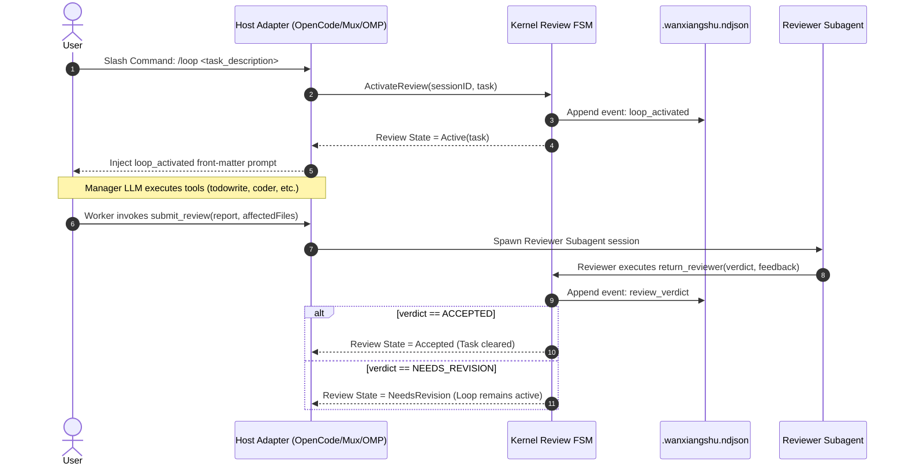

# PRD-01: 万象术 (Wanxiangshu) — Master Product Specification

> **Specification Authority**: This document serves as the master Product Requirement Document (PRD) for **万象术 (Wanxiangshu)**. All behavior, state machines, tool schemas, and host adapter contracts described herein reflect the implementation in `src/`, `tests/`, and `package.json`.

---

## 1. Product Overview

### 1.1 One-Line Definition
**万象术 (Wanxiangshu)** is a high-reliability multi-agent plugin runtime compiled from **F# to JavaScript via Fable**, running a single unified **Kernel (Pure Rules) + Shell (Side-Effect Boundaries)** across four host environments (**OpenCode, Mimocode, Mux, and oh-my-pi OMP**).

### 1.2 Background & Problem Statement
Single-host, single-session AI coding agents face five core engineering constraints in production codebases:
1. **Host Protocol Drift**: OpenCode uses hook objects and Zod schemas; Mux relies on wrappers and a plugin catalog; OMP uses Pi extensions with TypeBox schemas. Message wire formats and tool signatures vary across hosts.
2. **Dynamic Type Pollution**: Unchecked JavaScript objects (`obj` / `Dyn.*`) passed into business logic cause deep runtime failures.
3. **Host History Loss & Compaction**: Host-managed message compaction renders raw conversation history unreliable for durable state tracking.
4. **Cross-Turn State Durability**: Review cycles, backlog todos, and subagent state must survive session restarts.
5. **Side-Effect Propagation**: File I/O, network requests, sub-process execution, MCP servers, and tree-sitter operations must remain side-effect isolated so business rules are 100% unit-testable and replayable.

### 1.3 Architectural Axioms
- **Axiom 1: Stable Domain, Volatile Host**: Core rules live in `src/Kernel/` and are host-agnostic. Host bridges in `src/Opencode/`, `src/Mux/`, and `src/Omp/` only decode/encode wire formats.
- **Axiom 2: Event Sourcing over Memory**: Durable progress (review state, backlog todos, nudges) is appended to `[workspace]/.wanxiangshu.ndjson`. Memory states are pure folds over the event stream. Host conversation history is not an SSOT.
- **Axiom 3: Command Rejection, Fact Append**: Invalid commands fail fast with typed errors. Verified facts append to the event log.
- **Axiom 4: Strict Side-Effect Isolation**: Kernel functions never invoke Node I/O or `Dyn.*`. All I/O is pushed to `src/Shell/`.
- **Axiom 5: Type-Driven State Safety**: Discriminated unions (DUs) eliminate illegal states at compile time.
- **Axiom 6: Time-Independent Test Reliability**: E2E and integration tests must never rely on system clocks, random seeds, or fragile thread sleeps. Test flow synchronization must be managed via dependency injection and adaptive poll state hooks.

---

## 2. User Roles & Workflows

### 2.1 Agent Roles & Personas
Wanxiangshu categorizes agent sessions into distinct semantic roles:

| Role Persona | Target Responsibilities | Permitted Tools | Prohibited Tools |
| :--- | :--- | :--- | :--- |
| **Manager** | High-level orchestration, backlog management, subagent delegation | `todowrite` / `task`, subagents (`coder`, `investigator`, etc.), `submit_review` | `fuzzy_grep`, direct shell execution |
| **Coder** | TDD-driven code implementation and refactoring | `read`, `write`, `edit`, `patch`, `apply_patch`, `ast_edit`, `executor` | `subagent` web/submit delegation |
| **Investigator** | Multi-path codebase inspection and data collection | `read`, `fuzzy_find`, `fuzzy_grep`, `executor` (RO mode) | `write`, `edit`, `patch` (modification family) |
| **Meditator** | Architectural reflection, deep code analysis, methodology synthesis | `read`, methodology tools | Modification family |
| **Browser** | External documentation lookup and web browsing | `browser`, web search | File modification tools |
| **Reviewer** | Independent code review and quality validation | `read`, `return_reviewer` | File modification tools |
| **Executor** | Sandbox execution and testing | `executor`, `executor_wait`, `executor_abort` | Workspace file modification |

### 2.2 Slash Commands & Interaction Workflows



#### Command Specifications
- `/loop <task>`: Activates With-Review mode for `<task>`. Invoking with an empty task deactivates review and emits `verdict: cancelled`.
- `/loop-review <task>`: Spawns a pre-review subsession first. If passed (`Accepted`), activates With-Review mode; if rejected (`NeedsRevision`), injects review feedback immediately.

---

## 3. Functional Requirements

### 3.1 With-Review Mode (ReviewSession FSM)

#### Review States (`ReviewSession/Types.fs`)
- `Inactive`: No active review cycle for the session.
- `Active(task)`: Review cycle active for `task`.
- `Locked(task, reviewerId)`: Locked by an active reviewer subsession.
- `Accepted`: Task successfully reviewed and accepted.
- `NeedsRevision(feedback)`: Reviewer requested revision with feedback.

#### FSM Transition Table (`ReviewSession/StateMachine.fs`)

| Current State | Command | Next State | Emitted Event |
| :--- | :--- | :--- | :--- |
| `Inactive` | `Activate(task)` | `Active(task)` | `loop_activated` |
| `Active(task)` | `Submit` | `Active(task)` | `submit_review_wip_recorded` |
| `Active(task)` | `Lock(reviewerId)` | `Locked(task, reviewerId)` | `LockAcquired` |
| `Active(task)` | `Accept` | `Accepted` | `review_verdict(accepted)` |
| `Active(task)` | `RequestRevision(feedback)` | `NeedsRevision(feedback)` | `review_verdict(needs_revision)` |
| `Locked(task, _)` | `Unlock` | `Active(task)` | `LockReleased` |
| `Locked(_)` | `Accept` | `Accepted` | `review_verdict(accepted)` |
| `Locked(_)` | `RequestRevision(feedback)` | `NeedsRevision(feedback)` | `review_verdict(needs_revision)` |

#### Reviewer Round Decision Rule (`decideAfterRound`)
```fsharp
let decideAfterRound (nudgeCount: int) (outcome: RoundOutcome) (maxNudges: int) : LoopDecision =
    match outcome with
    | Resolved result -> Finish result
    | PromptFailed -> Finish Terminated
    | NoResult ->
        if nudgeCount + 1 >= maxNudges then Finish Terminated
        else Nudge (nudgeCount + 1)
```

### 3.2 WorkBacklog & TodoWrite Contract
Every call to `todowrite` (or `task` in Mimocode) MUST supply a full replacement of `todos` plus 5 mandatory handover report fields.

#### Handover Report Validation Rules
1. `todos`: Array of `{ content: string, status: "pending" | "in_progress" | "completed", priority: "high" | "medium" | "low" }`. Partial updates prohibited.
2. `ahaMoments`: String, minimum **1024 characters**. Must detail key technical breakthroughs and insights.
3. `changesAndReasons`: String, minimum **1024 characters**. Must detail modified files/symbols and rationales.
4. `gotchas`: String, minimum **1024 characters**. Must detail edge cases, pitfalls, and surprises discovered.
5. `lessonsAndConventions`: String, minimum **1024 characters**. Must detail patterns and conventions for future maintainers.
6. `plan`: String, minimum **1024 characters**. Must detail concrete next steps or initial architectural plan.
7. `select_methodology`: Array of strings (at least 1 item). Must select valid methodology IDs from `Kernel.Methodology.methodologyEnumValues`.

### 3.3 WarnTdd & Warn Safety Discipline
Modification and execution tools enforce mandatory TDD and side-effect declarations.

#### Tool Categories
- **Modification Tools (`WarnTdd.modificationTools`)**: `coder`, `executor`, `write`, `edit`, `apply_patch`, `patch`, `ast_edit`, `ast_grep_replace`, `file_edit_replace_string`, `file_edit_insert`, `pty_spawn`, `pty_write`, `pty_read`, `pty_list`, `pty_kill`.
  - **Mandatory Argument**: `warn_tdd: string`
  - **Canonical Value**: `"i-am-sure-i-have-followed-tdd-and-kolmolgorov-principles-and-kept-todo-updated"`
- **High-Risk Execution Tools (`WarnTdd.warnRequiredTools`)**: `executor`, `pty_spawn`, `pty_write`, `pty_read`, `pty_list`, `pty_kill`.
  - **Mandatory Argument**: `warn: string`
  - **Canonical Value**: `"it-is-not-possible-to-do-it-using-other-tools"`

### 3.4 Methodology Notebook Tools (54 Schemas)
Wanxiangshu exposes **54 structured methodology notebook tools** (`methodology_<id>`), registered via `Methodology.Registry.allSchemas`.

#### Common Methodology Arguments
- `intent`: String (Required). Core objective for invoking this methodology.
- `background`: String (Required). Context from workspace and current turn.
- `methodology_specific_fields`: Schema-defined fields (e.g., `first_principles`, `working_backwards`, `systems_thinking`).

#### Complete Methodology ID List (54)
`first_principles`, `axiomatization`, `deduction`, `induction`, `abduction`, `analogy`, `specialization`, `generalization`, `working_backwards`, `analysis_synthesis`, `auxiliary_construction`, `equivalent_transformation`, `decomposition_recombination`, `model_problem_transfer`, `constructive_method`, `reductio_ad_absurdum`, `invariance`, `symmetry_analysis`, `dimensional_reduction`, `perturbation_continuity`, `pigeonhole_principle`, `duality`, `quotient_space`, `category_mapping`, `relaxation`, `search_space_exploration`, `branch_and_bound`, `dynamic_programming`, `monte_carlo_sampling`, `simulated_annealing`, `swarm_optimization`, `systems_thinking`, `root_cause_analysis`, `state_machine_reasoning`, `type_driven_design`, `event_sourcing`, `operationalism`, `falsificationism`, `parsimony`, `dialectics`, `phenomenology`, `hermeneutics`, `deconstruction`, `pragmatism`, `structuralism`, `game_theory`, `information_theory`, `cybernetics`, `renormalization_group`, `statistical_mechanics`, `graph_theory`, `category_theory`, `user_intent_clarification`, `hermeneutic_circle`.

### 3.5 Nudge Subsystem
Nudge evaluates turn completion and prompts the model if work is incomplete.

#### Decision Priority
1. Open todos exist in backlog -> `nudge-todo`
2. Subagent / runner active -> `nudge-runner`
3. Review session active -> `nudge-loop`
4. Otherwise -> `none`

#### Suppression Rules
Nudge is suppressed if the last assistant message contains `<skip-todo-check/>`, `<skip-loop-check/>`, or an unresolved question tool call (`ask_user_question` / `question`).

---

## 4. Technical & Data Specs

### 4.1 Repository Layout & Compilation Pipeline

```text
wanxiangshu/
├── src/
│   ├── Kernel/                 # Pure domain rules (No Node/Dyn I/O)
│   │   ├── ReviewSession/      # Review state machine, registry, effects
│   │   ├── EventLog/           # Event DU, pure fold functions
│   │   ├── Nudge/              # Nudge derivation, retry progress, deduplication
│   │   ├── ToolCatalog/        # Master tool registry & specs
│   │   ├── Methodology/        # 54 methodology schemas & registry
│   │   ├── FallbackKernel/     # Perfect-square fallback state machine
│   │   └── CapsPrelude.fs      # System caps & discipline text SSOT
│   ├── Shell/                  # Side-effect boundary & codecs
│   │   ├── MessageTransformPipeline.fs
│   │   ├── EventLogFiles.fs    # .wanxiangshu.ndjson I/O & locks
│   │   ├── EventLogRuntime.fs  # Storage runtime synchronization
│   │   ├── SembleSearch.fs     # Semble MCP integration
│   │   └── Codecs/             # Tool & message codecs
│   ├── Opencode/               # OpenCode host adapter
│   ├── Mux/                    # Mux host adapter
│   └── Omp/                    # OMP host adapter
├── tests/                      # Unit, integration, & architecture tests
├── e2e/                        # End-to-end test harness with mock LLM
├── wanxiangshu-core.fsproj     # Kernel + Shell + Opencode + Mux (+ refs)
├── wanxiangshu-omp.fsproj
├── wanxiangshu-wanxiangzhen.fsproj
├── wanxiangshu-tests.fsproj
└── package.json                # NPM exports & build-and-test scripts
```

#### Build Pipeline
1. `npm run build` (fable core + omp + wanxiangzhen → `build/`)
2. Clean `build/fable_modules/.gitignore` & copy `build-package.json` to `build/package.json`
3. Execute test runner: `node tests/runner.js`

### 4.2 Tool Catalog & Host Normalization (15 Core Tools)

Kernel Catalog (`src/Kernel/ToolCatalog/Registry.fs`):
`coder`, `investigator`, `meditator`, `browser`, `executor`, `fuzzy_find`, `fuzzy_grep`, `websearch`, `webfetch`, `submit_review`, `return_reviewer`, `read`, `write`, `executor_wait`, `executor_abort`.

#### Host Tool Name Normalization Table (`HostTools.fs`)

| Canonical Tool Name | OpenCode Tool Name | Mimocode Tool Name | Mux Tool Name | OMP Tool Name |
| :--- | :--- | :--- | :--- | :--- |
| Todo Write | `todowrite` | **`task`** | `todowrite` | `todowrite` |
| Subagent Task | `task` | **`actor`** | `task` | `task` |
| Read File | `read` | `read` | `read` | `read` |
| Write File | `write` | `write` | `write` / `edit` | `write` |
| Web Fetch | `webfetch` | `webfetch` | `webfetch` | `webfetch` |
| Question | `ask_user_question` | `ask_user_question` | `question` | `ask_user_question` |

---

## 5. Non-Functional Requirements

### 5.1 Architectural Invariants (`ArchitectureTests*`)
The test suite enforces strict architectural boundaries:
- **Rule 1 (Kernel Purity)**: Files under `src/Kernel/` MUST NOT reference `Shell`, `Dyn`, `Node`, or `JS.Promise`.
- **Rule 2 (Host Isolation)**: `src/Opencode/`, `src/Mux/`, and `src/Omp/` MUST NOT import each other. `src/Omp/` MUST NOT import `src/Opencode/`, `src/Mux/`, or `engine/`.
- **Rule 3 (File Length Ceiling)**: Every F# source file (`.fs`) in `src/` and `tests/` MUST NOT exceed **300 lines**.
- **Rule 4 (No Legacy Markers)**: Source code MUST NOT contain `TODO`, `FIXME`, `HACK`, or legacy output tags.
- **Rule 5 (Codec Enforcement)**: All tool arguments from host objects MUST pass through typed codecs in `Shell`. Direct `Dyn.get` inside tool execution is strictly prohibited.
- **Rule 6 (Zero Timers in Fallback)**: Fallback code MUST NOT use `setTimeout`, `setInterval`, or `Date.now`.

### 5.2 Security & SSRF Protection (`WebFetchGuard.fs`)
- `webfetch` requests MUST validate target URLs against `WebFetchGuard`.
- Requests targeting IPv4/IPv6 loopback addresses (`127.0.0.1`, `::1`), link-local IPs, or cloud metadata endpoints (`169.254.169.254`) are rejected immediately.

---

## 6. Verification & Acceptance Criteria

### 6.1 Test Runner & Execution
Full test execution command:
```bash
npm run build-and-test
```

### 6.2 Verification Matrix

| Level | Scope | Key Modules / Files |
| :--- | :--- | :--- |
| **Unit Tests** | Pure Kernel logic & state transitions | `KernelTests.fs`, `ReviewTests.fs`, `EventLogFoldTests.fs`, `FallbackKernelTests.fs` |
| **Codec Tests** | Shell object encoding/decoding | `ToolArgsDecodeTests.fs`, `WorkBacklogToolsCodecTests.fs`, `FallbackConfigCodecTests.fs` |
| **Architecture Tests** | Structural invariants & line limits | `TestsArchitectureRegistry.fs`, `TestsArchitectureRegistryB.fs` |
| **Integration Specs** | Cross-module specs & catalog consistency | `IntegrationToolSpecCatalog.fs`, `IntegrationMuxMethodologySpecs.fs`, `IntegrationOpencodeReviewSpecs.fs` |
| **E2E Tests** | End-to-end plugin runtime round-trips | `e2e/Tests.fs`, `e2e/harness.js`, `e2e/mock-llm.js` |

---

*Document Version: 2.0.0 (Refined & Standardized)*
