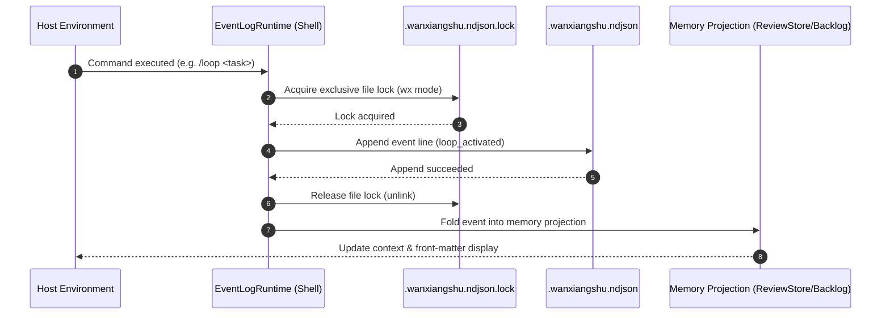

# PRD-02: 万象术 (Wanxiangshu) — Event Sourcing & Durable Persistence

> **Specification Authority**: This document is the Single Source of Truth (SSOT) for the Event Sourcing and Durable Persistence Subsystem of **万象术 (Wanxiangshu)**. All memory projections (Review state, Backlog todos, Nudge snapshots) MUST be fold functions over the event log `[workspace]/.wanxiangshu.ndjson`.

---

## 1. Product Overview

### 1.1 Problem Statement
Host environments (OpenCode, Mimocode, Mux, OMP) frequently perform **context compaction** on conversation history (`session.messages` and `experimental.chat.messages.transform`). Host-managed message histories are inherently ephemeral and lossy, making them unsuitable as the truth source for durable agent state (With-Review mode, todo backlogs, nudge deduplication).

Legacy approaches attempted to parse conversation history text (`inferReviewTaskFromTexts`) or inject multi-part YAML front-matter anchors after compaction (`See above for some messages before compaction.`). These approaches coupled agent state to host compaction algorithms, causing state corruption and split-brain states across session restarts.

### 1.2 Solution & Core Axioms
Wanxiangshu establishes **Workspace Event Sourcing**: the file `[workspace]/.wanxiangshu.ndjson` is the sole SSOT for durable state.

#### Fundamental Event Sourcing Principles
1. **Intents are Ephemeral**: Natural language prompts, draft tool arguments, and uncommitted memory thoughts are NEVER written to the event log.
2. **Facts are Immutable**: Once a command is validated and executed (e.g., `/loop` activated, `submit_review` recorded, `todowrite` committed), an immutable event is appended to the event log.
3. **Memory is a Projection (Fold)**: Runtime stores (`ReviewStore`, `WorkBacklog` projections, Nudge deduplication tables) are pure fold functions over the NDJSON event stream for a given session.
4. **Disk Before Memory (Write-Ahead)**: A fact is appended to disk first. Memory projections are updated ONLY after the disk append succeeds. If the append fails, the operation is rejected.
5. **Single Line per Event**: Every event line in `.wanxiangshu.ndjson` is a self-contained JSON object.
6. **Session Partitioning**: Every event line MUST contain a `session` field. Projections fold events matching the active session ID.

---

## 2. User Roles & Workflows

### 2.1 User & System Scenarios



#### Key Workflows
1. **Session Initialization & Replay**: Upon agent startup or session activation, `EventLogRuntime` reads `.wanxiangshu.ndjson`, filtering by `session`, and folds the event stream to re-hydrate memory projections.
2. **Compaction Recovery**: When the host compacts context history, no anchor prompts are injected. Memory state remains intact because it is derived from `.wanxiangshu.ndjson`.
3. **Process Crash Recovery**: If the node process restarts mid-task, replaying `.wanxiangshu.ndjson` restores the exact task, todo items, and review status.

---

## 3. Functional Requirements

### 3.1 Event Payloads & Schema Definitions

Every event line in `.wanxiangshu.ndjson` conforms to the event envelope schema:

```json
{
  "v": 1,
  "session": "session-xyz-123",
  "kind": "loop_activated",
  "at": "2026-07-04T12:00:00.000Z",
  "payload": {
    "task": "Refactor PRD documentation structure"
  },
  "id": "evt-01h8x9",
  "host": "opencode"
}
```

#### Event Catalog & Payload Specifications

| Event `kind` | Trigger Condition | Payload Requirements |
| :--- | :--- | :--- |
| `loop_activated` | Worker activates With-Review mode (`/loop <task>`) | `{ "task": string }` |
| `loop_cancelled` | User/Worker cancels With-Review mode | `{}` |
| `review_verdict` | Reviewer emits review conclusion | `{ "verdict": "accepted" \| "needs_revision" \| "terminated" \| "cancelled", "feedback"?: string }` |
| `work_backlog_committed` | `todowrite` / `task` tool call successfully committed | `{ "todos": TodoItem[], "ahaMoments": string, "changesAndReasons": string, "gotchas": string, "lessonsAndConventions": string, "plan": string, "select_methodology": string[] }` |
| `nudge_dispatched` | Nudge claimed in lock and dispatched to host | `{ "action": "nudge-todo" \| "nudge-loop" \| "nudge-runner", "anchor": string }` |
| `submit_review_wip_recorded` | Worker submits review with `wip: true` | `{}` |
| `nudge_dedup_cleared` | User sends new message or WIP submitted | `{}` |

---

## 4. Technical & Data Specs

### 4.1 Physical File & Locking Specifications

#### File Location
```text
[workspace]/.wanxiangshu.ndjson
[workspace]/.wanxiangshu.ndjson.lock
```

#### File Locking Protocol (`Shell/EventLogFiles.fs`)
- **Exclusive Lock Creation**: Locks use a sidecar file `.wanxiangshu.ndjson.lock` created with `O_CREAT | O_EXCL` (`wx` mode).
- **Concurrency Control**: Inside the process, all log appends pass through `Shell.PromiseQueue.SerialQueue`. Across processes, the lock file guarantees single-writer serialization.
- **Lock Release**: Upon append completion (or failure), the lock file is unlinked immediately.
- **Corrupt Line Handling**: When reading `.wanxiangshu.ndjson`, if a corrupted or incomplete line is encountered (e.g., due to sudden power outage during write), the file parser **truncates at the corrupted line** (discarding that line and any following bytes). It NEVER skips corrupted lines to fold subsequent data.

### 4.2 Pure Event Fold Engine (`Kernel/EventLog/Fold.fs`)

#### 1. Review Task Fold (`foldReviewTask`)
```fsharp
let foldReviewTask (sessionId: string) (events: EventEnvelope list) : string option =
    events
    |> List.filter (fun e -> e.Session = sessionId)
    |> List.fold (fun current e ->
        match e.Kind with
        | "loop_activated" ->
            match e.Payload.TryGetProperty("task") with
            | Some taskStr -> Some taskStr
            | None -> current
        | "review_verdict" ->
            match e.Payload.TryGetProperty("verdict") with
            | Some "accepted" | Some "cancelled" -> None
            | _ -> current
        | "loop_cancelled" -> None
        | _ -> current
    ) None
```

#### 2. WorkBacklog Fold (`foldWorkBacklogSnapshot`)
```fsharp
let foldWorkBacklogSnapshot (sessionId: string) (events: EventEnvelope list) : BacklogSnapshot option =
    events
    |> List.filter (fun e -> e.Session = sessionId)
    |> List.choose (fun e ->
        if e.Kind = "work_backlog_committed" then
            parseBacklogPayload e.Payload
        else None
    )
    |> List.tryLast
```

#### 3. Nudge Deduplication Fold (`foldNudgeDedup`)
```fsharp
let foldNudgeDedup (sessionId: string) (events: EventEnvelope list) : NudgeDedupState =
    events
    |> List.filter (fun e -> e.Session = sessionId)
    |> List.fold (fun state e ->
        match e.Kind with
        | "nudge_dispatched" ->
            { state with DispatchedAnchors = Set.add e.Payload.Anchor state.DispatchedAnchors }
        | "nudge_dedup_cleared" ->
            { state with DispatchedAnchors = Set.empty }
        | _ -> state
    ) NudgeDedupState.Empty
```

---

## 5. Non-Functional Requirements

### 5.1 Performance & Memory Limits
- **Stream Replay Ceiling**: Replaying a 10,000-event NDJSON file MUST complete within **50ms** in the JS runtime.
- **File Append Latency**: Single event lock + write + release MUST complete within **10ms**.

### 5.2 Architectural Enforcement
- **Kernel Pure Rule**: `Kernel/EventLog/Types.fs` and `Kernel/EventLog/Fold.fs` MUST NOT reference Node `fs`, `path`, or `JS.Promise`.
- **Shell I/O Isolation**: File writes and lock creations MUST reside exclusively in `Shell/EventLogFiles.fs` and `Shell/EventLogRuntime.fs`.

---

## 6. Verification & Acceptance Criteria

### 6.1 Test Suites

| Test Suite File | Scope & Verification Goals |
| :--- | :--- |
| `tests/EventLogFoldTests.fs` | Verifies `foldReviewTask`, `foldWorkBacklogSnapshot`, and `foldNudgeDedup` pure fold functions against event sequences. |
| `tests/EventLogCodecTests.fs` | Verifies JSON serialization and deserialization of all 7 event payload schemas. |
| `tests/EventLogRuntimeTests.fs` | Verifies atomic lock acquisition, corrupted line truncation, append order, and session filtering. |
| `tests/NudgeEventSourcingTests.fs` | Verifies end-to-end integration between event sourcing folds and Nudge decision logic. |

### 6.2 Acceptance Criteria
1. **Restart Recovery**: Re-initializing a session after process termination using ONLY `.wanxiangshu.ndjson` restores the exact task, complete backlog todos, and nudge deduplication state.
2. **Compaction Resilience**: Executing host compaction on a session does NOT inject anchor prompts and does NOT alter the folded memory projection.
3. **Lock Safety**: Concurrent event write requests across parallel turns queue serially without file corruption or unhandled promise rejections.

---

*Document Version: 2.0.0 (Refined & Standardized)*
