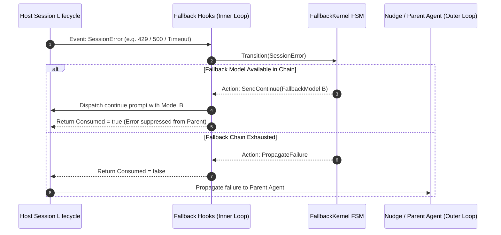

# PRD-03: 万象术 (Wanxiangshu) — Fallback & Model Degradation System

> **Specification Authority**: This document is the Product Requirement Document for the **Fallback & Model Degradation Subsystem** of **万象术 (Wanxiangshu)** (`src/Kernel/FallbackKernel/`, `src/Shell/Fallback*`, `src/*/Fallback*`).

---

## 1. Product Overview

### 1.1 Motivation & Background
When a subagent or manager session encounters upstream LLM provider failures (HTTP 401/402/403 authentication/quota errors, 429 rate limits, 5xx server errors, or transient connection drops), standard agents immediately fail the subsession and propagate an unhandled exception to the parent agent.

The **Fallback & Model Degradation Subsystem** provides a zero-timer, event-driven inner loop that intercepts model errors, applies a **Perfect-Square Heuristic** to select alternative fallback models, and sends actual `continue` prompts to test model availability. If recovery succeeds, execution resumes silently without disrupting the parent agent. The parent agent receives a failure ONLY after the fallback model chain is completely exhausted.

### 1.2 Core Architectural Axioms
1. **Zero Timers**: The system contains NO `setTimeout`, `setInterval`, or `Date.now`. All state transitions are 100% event-driven.
2. **Inner/Outer Loop Orthogonality**:
   - **Inner Loop (Fallback)**: Intercepts connection/provider errors, performs heuristic model switching, and executes continue probes.
   - **Outer Loop (Nudge / Review)**: Manages task progress, review cycles, and user feedback.
   - **Priority**: Fallback intercepts errors first. Outer loops are notified ONLY when Fallback exhausts all options (`Consumed = false`).
3. **Actual Continue Probes**: Model availability is verified by dispatching an actual `continue` prompt, not by relying on arbitrary backoff timers.
4. **Configuration Precedence**: AGENTS.md YAML `models:` configuration overrides host defaults (`opencode.json`).

---

## 2. User Roles & Workflows

### 2.1 Inner vs. Outer Loop Interception Workflow



---

## 3. Functional Requirements

### 3.1 Fallback Configuration Schema (`AGENTS.md`)
Fallback chains are defined in the front-matter YAML `models:` section of `AGENTS.md`:

```yaml
---
models:
  default:
    - anthropic/claude-sonnet-4
    - openai/gpt-5.5
    - zai-coding-plan/glm-5.1
  agents:
    sisyphus:
      - opencode-go/deepseek-v4-pro
      - openai/gpt-5.5
---
```

#### Field Semantics
- `models.default`: Array of `ModelEntry`. Used by any agent without an explicit override. Item 0 is the primary model.
- `models.agents.<name>`: Array of `ModelEntry`. Overrides the model chain for agent `<name>`. Item 0 is the primary model.
- `ModelEntry`: Short string `"provider/model:variant"` or object `{ id: "provider/model:variant", temperature?: number, top_p?: number, max_tokens?: number }`.

### 3.2 Perfect-Square Heuristic Algorithm

#### State Variables per Session
- `currentIndex` ($N$): Active model index in the chain (0-indexed).
- `failureCount` ($k$): Consecutive failure counter.
- `chain`: Ordered list of `FallbackModel`.

#### Perfect-Square Test & Scan Logic
```fsharp
let isPerfectSquare (n: int) : bool =
    if n <= 0 then false
    else
        let root = int (sqrt (float n))
        root * root = n

let scanStartIndex (failureCount: int) (currentIndex: int) : int =
    if isPerfectSquare failureCount then 0  // Rescan from top model
    else currentIndex                       // Continue scanning from current index
```

#### Failure Count ($k$) Update Rules

| Event Scenario | Next Failure Count ($k'$) |
| :--- | :--- |
| New User Message | $k = 0$ |
| Fallback succeeds & new index $N' < N$ | $k = 0$ (Recovered to higher-tier model) |
| Fallback succeeds & new index $N' > N$ | $k = k + 1$ |
| Fallback succeeds & new index $N' = N$ | $k$ unchanged |
| Session Error encountered | $k = k + 1$ (prior to scanning) |

### 3.3 Consumed Flag Routing Table

The fallback hook returns `FallbackHookResult = { Consumed: bool }`:

| Fallback Phase | SessionError | SessionBusy | SessionIdle |
| :--- | :--- | :--- | :--- |
| `Idle` | `Consumed = true` (Triggers retry/fallback) | `Consumed = false` | `Consumed = false` |
| `Retrying` | `Consumed = true` | `Consumed = false` (Restores `Idle`) | `Consumed = false` |
| `Scanning` | `Consumed = true` (Advances scan index) | `Consumed = false` (Scan succeeded) | `Consumed = false` |
| `Exhausted` | `Consumed = false` (Propagates to outer loop) | `Consumed = false` | `Consumed = false` |
| `Propagated` | `Consumed = false` | `Consumed = false` | `Consumed = false` |

### 3.4 Event-Driven Capability Mapping

| Capability | Trigger Event | Action | Implementation Method |
| :--- | :--- | :--- | :--- |
| **Tool Call Text Scan** | `SessionIdle` | Scan assistant messages for unexecuted XML tool calls | Immediate regex scan, zero delay |
| **Hallucination Detection** | `SendContinue` | Increment `continueCount`. If $\ge$ threshold, abort & resume | Pure counter |
| **Task Complete Hook** | `TaskCompleteCalled` | Mark `TaskComplete = true`. Disable further continues | Tool catalog registration |
| **Todo-Aware Continuation** | `SessionIdle` | Check backlog. If all completed, skip auto-continue | Pure event check |
| **ESC / User Cancel** | `SessionError (MessageAborted)` | Mark `Cancelled = true`. Cease fallback attempts | Immediate state update |

---

## 4. Technical & Data Specs

### 4.1 Kernel State Machine Types (`src/Kernel/FallbackKernel/Types.fs`)

```fsharp
type ModelVariant = string

type FallbackModel = {
    ProviderID: string
    ModelID: string
    Variant: ModelVariant option
    Temperature: float option
    TopP: float option
    MaxTokens: int option
    ReasoningEffort: string option
}

type FallbackChain = FallbackModel list

type ErrorClass =
    | Ignore              // Abort errors, ESC cancel
    | RetrySame           // Transient retryable error (count < maxRetries)
    | ImmediateFallback   // HTTP 401/402/403, non-retryable error
    | Exhausted           // Max retries reached, enter scanning

type FallbackPhase =
    | Idle
    | Retrying of retryCount: int
    | Scanning of scanIndex: int * originalIndex: int
    | Exhausted
    | Propagated

type SessionFallbackState = {
    Phase: FallbackPhase
    CurrentIndex: int
    FailureCount: int
    Cancelled: bool
    TaskComplete: bool
    ContinueCount: int
    Todos: TodoItem list
}

type FallbackEvent =
    | SessionError of error: ErrorInput
    | SessionIdle
    | SessionBusy
    | NewUserMessage
    | TaskCompleteCalled
    | TodoUpdated of TodoItem list

type FallbackAction =
    | DoNothing
    | SendContinue of model: FallbackModel
    | AbortAndResume of model: FallbackModel
    | PropagateFailure
    | ScanToolCallAsText
    | CheckTodoState

and ErrorInput = {
    ErrorName: string
    Message: string
    StatusCode: int option
    IsRetryable: bool option
}
```

### 4.2 Error Classification Logic (`classifyError`)
1. If `input.ErrorName = "MessageAbortedError"` or `state.Cancelled` or `state.TaskComplete` -> `ErrorClass.Ignore`.
2. If `StatusCode = 401 | 402 | 403` or `IsRetryable = Some false` -> `ErrorClass.ImmediateFallback`.
3. If `IsRetryable = Some true` or `StatusCode = 429 | 5xx` and `retryCount < maxRetries` -> `ErrorClass.RetrySame`.
4. If `retryCount >= maxRetries` -> `ErrorClass.Exhausted`.

---

## 5. Non-Functional Requirements

### 5.1 Architectural Invariants (`ArchitectureTests*`)
- **Zero Timers**: `src/Kernel/FallbackKernel/`, `src/Shell/Fallback*`, `src/*/Fallback*` MUST NOT contain `setTimeout`, `setInterval`, or `Date.now`.
- **Kernel Purity**: `FallbackKernel` MUST NOT reference `Dyn`, `Shell`, `Node`, or `JS.Promise`.
- **Host Isolation**: `src/Omp/Fallback*` MUST NOT reference `src/Opencode/` or `src/Mux/`.

---

## 6. Verification & Acceptance Criteria

### 6.1 Test Suites

| Suite File | Scope & Verification |
| :--- | :--- |
| `tests/FallbackKernelTests.fs` | Verifies `isPerfectSquare`, `scanStartIndex`, `updateFailureCount`, `classifyError`, and FSM state transitions. |
| `tests/FallbackConfigCodecTests.fs` | Verifies YAML `models:` parsing, `parseModelId` (`provider/model:variant`), and config fallback default merging. |
| `tests/FallbackRuntimeStateTests.fs` | Verifies state map CRUD and cleanup without timestamp dependencies. |
| `tests/FallbackEventBridgeTests.fs` | Verifies event translation and action execution across mock hosts. |
| `tests/FallbackIntegrationTests.fs` | Verifies inner-loop self-healing, model switching, perfect-square scanning, and exhausted failure propagation. |

### 6.2 Acceptance Criteria
1. **Perfect-Square Rescan**: When $k=1, 4, 9$, scanning resets to index 0; when $k=2, 3, 5$, scanning continues from current index $N$.
2. **Inner-Loop Recovery**: A model 429 error triggers fallback to model 2 and continues execution silently (`Consumed = true`). The parent agent receives no error notification.
3. **Exhaustion Handling**: When all models in a chain fail, `Consumed = false` is returned and failure is propagated to the parent agent.
4. **Architecture Gate**: `npm run build-and-test` passes all fallback architecture invariant guards.

---

*Document Version: 2.0.0 (Refined & Standardized)*
