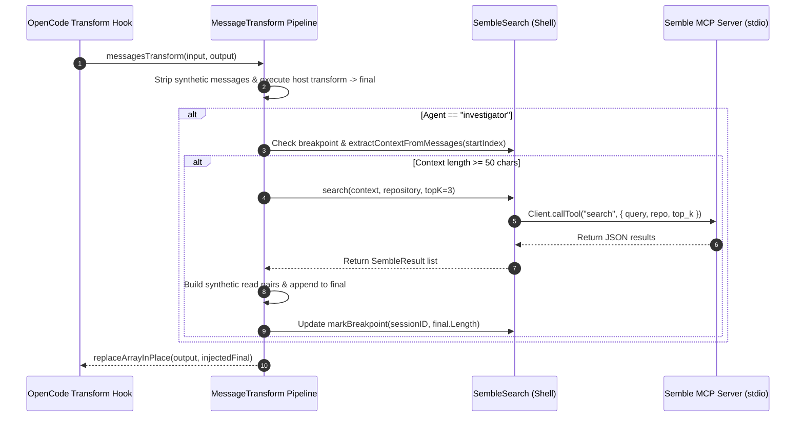

# PRD-04: 万象术 (Wanxiangshu) — Semble MCP & Investigator Injection

> **Specification Authority**: This document specifies the **Semble MCP Client & Investigator Breakpoint Injection Subsystem** of **万象术 (Wanxiangshu)** (`src/Shell/SembleSearch.fs`, `src/Opencode/MessageTransform.fs`, `src/Kernel/Messaging.fs`, `tests/SembleInjectionTests.fs`).

---

## 1. Product Overview

### 1.1 Motivation & Purpose
During code investigation tasks, the `investigator` subagent often spends multiple conversation turns performing incremental file reads.

The **Semble MCP & Investigator Injection Subsystem** performs semantic code search using Semble (via an out-of-band Model Context Protocol stdio client) at investigator breakpoints. Search results are injected directly into the LLM context window disguised as the model's own parallel `read` tool calls and tool results. This provides the LLM with relevant code snippets instantaneously without requiring extra turn round-trips.

### 1.2 Core Architectural Principles
1. **Self-Managed Best-Effort MCP**: The Semble MCP client is managed entirely in `Shell`. It is NOT registered in the host MCP map (`PluginCore`, `ToolPermission`, `Config`, `AgentConfig`).
2. **Zero Host Registration Overhead**: The host is completely unaware of the Semble MCP server.
3. **Disguised Parallel Tool Calls**: Search results are converted into synthetic `assistant` (`tool_call read`) and `toolResult` message pairs with formatted `%6d|line` outputs, perfectly mimicking real `read` tool executions.
4. **Cache Preservation**: Injections only append to the end of the context window. Previous message prefixes remain unchanged, preserving host prompt caching.
5. **Silent Fallback**: If Semble, `uvx`, or the MCP connection fails or times out, the injection pipeline silently returns the original messages without disrupting the LLM request.

---

## 2. User Roles & Workflows

### 2.1 Injection Workflow Data Flow



---

## 3. Functional Requirements

### 3.1 Best-Effort MCP Lifecycle Management
- **Stdio Spawn Command**: Spawned via `uvx` with parameters configured in `src/Kernel/Config.fs`:
  ```bash
  uvx --from git+https://github.com/MinishLab/semble.git@{ref} --extra mcp python -m semble
  ```
  where `{ref}` defaults to `master` and can be overridden via the `SEMBLE_MCP_REF` environment variable.
- **Single Instance Connection**: `SembleSearch` maintains a singleton `Client` instance. Connection attempts are asynchronous and non-blocking. Unready connections silently yield empty results (`[]`).

### 3.2 Breakpoint & Context Window Extraction
- **Session Breakpoint Tracking**: Maintains an in-memory map `lastBreakpoint: Map<sessionID, int>` tracking the message array length at the last successful injection.
- **Context Extraction Range**: Extracts text from messages in the index range `[startIndex, currentLength)`.
- **Text Filtering Rules**:
  - **Included**: User prompt text, Assistant reasoning/prose text.
  - **Excluded**: All `ToolPart` instances (both `tool_call` inputs and `tool_result` outputs).
- **Injection Threshold**: Context string must be **$\ge 50$ characters**. If below 50 characters, injection is skipped and the previous breakpoint index is retained to accumulate context across turns.

### 3.3 Synthetic Message Pair Construction

Each search result is converted into 2 messages (1 `assistant` message + 1 `toolResult` message) with a unique synthetic call ID:

#### Assistant Tool Call Message
```fsharp
{
    info = { id = "semble-synth-<guid>"; sessionID = sessionId; role = Assistant; agent = "investigator"; toolName = "read" }
    parts = [ ToolPart("read", "semble-<guid>", None, null) ]
    raw = null
}
```

#### Tool Result Message
```fsharp
{
    info = { id = "semble-synth-<guid>"; sessionID = sessionId; role = ToolResult; agent = "investigator"; toolName = "read" }
    parts = [ ToolPart("read", "semble-<guid>", Some state, null) ]
    raw = null
}
```
where `state.output` formats lines as `%6d|content` (matching `FileSys.fs` read format) and `state.input` sets `path`, `offset`, and `limit`.

### 3.4 Synthetic Message Stripping & Cleanup
To prevent synthetic messages from accumulating across turns or being persisted to disk:
- `Messaging.synthPrefixes` includes `"semble-synth-"`.
- On every transform pass, `Messaging.stripSyntheticBySource` strips all messages with IDs matching `synthPrefixes` before processing context.

---

## 4. Technical & Data Specs

### 4.1 Semble Result Types (`src/Shell/SembleSearch.fs`)

```fsharp
type SembleResult = {
    filePath: string
    startLine: int
    endLine: int
    content: string
    score: float
}
```

### 4.2 Module Map

| Component File | Role & Responsibilities |
| :--- | :--- |
| `src/Kernel/Config.fs` | Configures `sembleMcpRef` and `getSembleMcpCommand` (`uvx` args). |
| `src/Kernel/Messaging.fs` | Registers `"semble-synth-"` in `synthPrefixes`. |
| `src/Shell/SembleSearch.fs` | Wraps `@modelcontextprotocol/sdk` v1.x Client, manages connection singleton, parses JSON tool output. |
| `src/Opencode/MessageTransform.fs` | Executes breakpoint detection, context extraction, synthetic pair formatting, and output array replacement. |
| `tests/SembleInjectionTests.fs` | Unit and integration tests for breakpoint logic, context extraction, and synthetic message formatting. |

---

## 5. Non-Functional Requirements

### 5.1 Performance Ceilings
- **Warm Path Latency**: Hot-path search + result formatting MUST complete within **10ms**.
- **Cold Start Non-Blocking**: MCP client initialization runs asynchronously in the background. It MUST NOT block host message transformation.

### 5.2 Fault Tolerance
- All MCP calls are wrapped in `try ... with` blocks. Any network, sub-process, JSON parse, or timeout error is caught silently, returning `[]` and allowing normal agent execution.

---

## 6. Verification & Acceptance Criteria

### 6.1 Test Suite (`tests/SembleInjectionTests.fs`)
- **Breakpoint Test**: Verifies `breakpointStart` re-seeds on initial session or compaction, and advances only after successful injection.
- **Context Extraction Test**: Verifies `extractContextFromMessages` includes user/assistant text while excluding all tool call/result parts.
- **Synthetic Pair Test**: Verifies synthetic messages contain `"semble-synth-"` IDs, valid `read` tool formats, and are stripped by `stripSyntheticBySource`.

### 6.2 Acceptance Criteria
1. **Disguised Execution**: When `investigator` reaches a breakpoint with $\ge 50$ characters of context, Semble search results append to `final` as valid `read` tool call/result pairs.
2. **Zero Breaking Errors**: If `uvx` or Semble is not installed, the plugin operates without errors or console warnings.
3. **No Storage Pollution**: Synthetic messages are completely stripped before backlog commits or event logging.

---

*Document Version: 2.0.0 (Refined & Standardized)*
