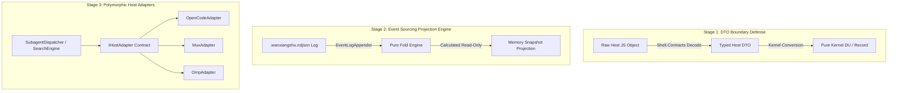

# PRD-05: 万象术 (Wanxiangshu) — Type Safety & Architecture Refactoring Roadmap

> **Specification Authority**: This document specifies the **System Architecture Diagnosis & Refactoring Blueprint** for **万象术 (Wanxiangshu)**. It outlines structural improvements, type-safety barriers, host adapter unification, and progressive migration milestones.

---

## 1. Product Overview

### 1.1 Purpose & Objectives
As Wanxiangshu evolved across four host adapters (OpenCode, Mimocode, Mux, OMP), certain boundary code paths accumulated dynamic JavaScript typing (`obj`), duplicated control loops across host bridges, and fragmented error handling.

This document presents a comprehensive **type-safe architectural blueprint** designed to:
1. Eliminate dynamic type leaks (`obj` and `Dyn.*`) at the Shell boundary using strict DTOs.
2. Guarantee single-direction event sourcing (Memory projections as pure folds over `.wanxiangshu.ndjson`).
3. Unify multi-host subagent and search workflows under a polymorphic `IHostAdapter` contract.
4. Replace magic-string error handling with a strongly typed `DomainError` discriminated union.
5. Decompose the monolithic `SessionLifecycleObserver` into decoupled functional observers (`ProgressObserver`, `FallbackCoordinator`, `NudgeTrigger`).

---

## 2. System Diagnosis & Design Defect Analysis

### Defect 1: Dynamic Type Pollution (`obj` & `'raw` Proliferation)
- **Problem**: `Part<'raw>` and `Message<'raw>` in `Kernel/Messaging.fs` use generic `'raw` parameter that is frequently bound to `obj` in host bridges.
- **Impact**: Excessive reliance on `Shell/Dyn.fs` (`Dyn.get`, `?` operator, `unbox`) shifts type mismatched errors from compile time to runtime.

### Defect 2: Dual-Write Memory/Disk Desynchronization Risk
- **Problem**: Direct state mutations in memory stores (`ReviewStore`, `SessionProjectionStore`) alongside asynchronous disk appends creates potential split-brain states if disk write fails.
- **Impact**: Memory state can diverge from the physical event log `.wanxiangshu.ndjson`.

### Defect 3: Tri-Host Bridge Code Duplication
- **Problem**: Fuzzy finder pagination, subagent lifecycle management, and TDD/warn validation logic are duplicated across `Mux/`, `Opencode/`, and `Omp/`.
- **Impact**: Increased maintenance overhead and potential behavioral discrepancies across hosts.

### Defect 4: Fragile Error Propagation & Silent Swallowing
- **Problem**: `PromiseQueue.SerialQueue` uses `Promise.catch (fun _ -> ())` to prevent chain breakage, which can swallow critical system panics (e.g., disk full). Error classification relies on string matching (e.g., `"AbortError"`).
- **Impact**: Unhandled system errors pass silently; non-standard exceptions trigger incorrect fallback paths.

### Defect 5: Monolithic `SessionLifecycleObserver` Overload
- **Problem**: `SessionLifecycleObserver` handles todo backlog synchronization, review state checking, fallback model switching, and nudge dispatching in a single class.
- **Impact**: Violation of Single Responsibility Principle, making unit testing complex.

---

## 3. Target Architecture & Refactoring Blueprints



---

## 4. Technical & Data Specs

### 4.1 Stage 1: DTO Boundary Protection (`Shell.Contracts.fs`)
Construct explicit F# Record types for all incoming host payloads, eliminating raw `obj` passing:

```fsharp
namespace Wanxiangshu.Shell

type HostMessageDto = {
    Id: string
    SessionId: string
    Role: string
    Parts: HostPartDto list
}

and HostPartDto =
    | TextPartDto of text: string
    | ToolCallDto of name: string * callId: string * argsJson: string
    | ToolResultDto of callId: string * output: string * isError: bool
```

### 4.2 Stage 2: Event Sourcing Pure Projection Engine
- Memory stores (`ReviewStore`, `SessionProjectionStore`) are refactored to be **read-only views** generated by `foldReviewTask` and `foldWorkBacklogSnapshot`.
- All mutation requests route exclusively through `EventLogAppender.appendEvent`.

### 4.3 Stage 3: Polymorphic Host Adapter (`IHostAdapter`)

```fsharp
namespace Wanxiangshu.Kernel

type IHostAdapter =
    abstract member GetSessionId: hostContext: obj -> string
    abstract member GetCwd: hostContext: obj -> string
    abstract member ResolveAgentRole: sessionID: string -> string
    abstract member SpawnSubagent: role: string * prompt: string * parentID: string -> JS.Promise<string>
    abstract member SendNudgePrompt: sessionID: string * promptText: string -> JS.Promise<unit>
```

### 4.4 Stage 4: Strongly Typed Domain Error Hierarchy

```fsharp
type DomainError =
    | FileSystemFault of path: string * code: string * message: string
    | NetworkTransportFailure hopeless: bool * targetUrl: string * statusCode: int option
    | ClientCancellation of sessionID: string * reason: string
    | HostProtocolMismatch of host: string * missingField: string
```

### 4.5 Stage 5: Observer Slice Decomposition

Decompose `SessionLifecycleObserver` into three single-responsibility components:
1. **`ProgressObserver`**: Monitors turn completions and syncs backlog todo items.
2. **`FallbackCoordinator`**: Listens for session errors and coordinates fallback model switching.
3. **`NudgeTrigger`**: Evaluates turn end (`SessionIdle`) and dispatches nudge prompts based on FSM state.

---

## 5. Non-Functional Requirements & Migration Safety

### 5.1 Zero-Regression Invariants
- All 14,700+ existing unit and integration tests MUST pass at every migration step.
- Architecture test file line limit ceiling (**$\le 300$ lines**) MUST be strictly preserved.

### 5.2 Progressive Migration Policy
Refactoring follows a 3-phase progressive roadmap. No big-bang rewrites:
- **Phase 1**: Type Boundaries & DTOs (Non-breaking).
- **Phase 2**: Host Adapter Unification (Internal refactoring).
- **Phase 3**: Event Sourcing Pure Projection & Observer Decomposition.

---

## 6. Verification & Migration Roadmap

| Phase | Milestone Deliverables | Verification Probe |
| :--- | :--- | :--- |
| **Phase 1** | Implement `Shell.Contracts.fs`, replace `obj` in host entry points with typed DTOs. | `npm run build-and-test` & `ArchitectureTests.fs` |
| **Phase 2** | Extract `IHostAdapter` and consolidate subagent dispatch into `SubagentDispatcher`. | `IntegrationPluginTests.fs` & host specs |
| **Phase 3** | Make `ReviewStore` pure read-only fold over `.wanxiangshu.ndjson`, split `SessionLifecycleObserver`. | `EventLogRuntimeTests.fs` & E2E suite |

---

*Document Version: 2.0.0 (Refined & Standardized)*
