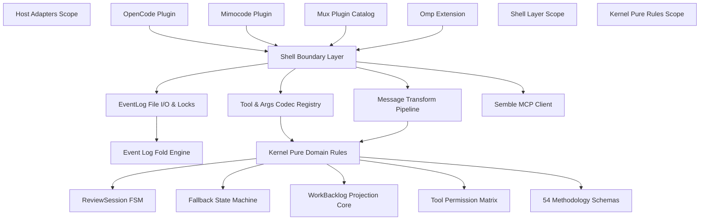

# PRD Index & Architecture Map: 万象术 (Wanxiangshu)

Welcome to the Product Requirement Documentation (PRD) directory for **万象术 (Wanxiangshu)** — a multi-agent plugin runtime compiled from F# to JavaScript via Fable.

This directory contains the authoritative technical specifications, behavioral contracts, state machine definitions, and architectural blueprints for the Wanxiangshu system.

---

## 1. Document Taxonomy & Organization

All documentation files under `PRD/` follow a standardized, numbered, kebab-case naming convention and adhere to industry-standard product requirement document structures:

```text
PRD/
├── README.md                           # Directory Index, Navigation & Architecture Map
├── 01-master-spec.md                   # Master Product Requirement Document (Core System)
├── 02-event-sourcing.md                # Event Sourcing & Durable Persistence Specification
├── 03-fallback-recovery.md             # Model Fallback & Heuristic Degradation System PRD
├── 04-semble-mcp-injection.md          # Semble MCP & Investigator Breakpoint Injection Specification
└── 05-architecture-refactoring.md      # Type Safety & System Architecture Refactoring Roadmap
```

---

## 2. Document Map & Matrix

| File | Document Title | Domain / Focus Area | Primary Audience |
| :--- | :--- | :--- | :--- |
| [`01-master-spec.md`](./01-master-spec.md) | **Master Product Specification** | Core Kernel/Shell architecture, Host adapters (OpenCode, Mimocode, Mux, OMP), With-Review Mode (`/loop`), WorkBacklog (`todowrite`), 54 Methodology Notebook Tools, Subagents, Tool Permissions & Catalog. | Architects, Engineers, QA |
| [`02-event-sourcing.md`](./02-event-sourcing.md) | **Event Sourcing & Persistence** | SSOT specification for `.wanxiangshu.ndjson`, file locking (`.wanxiangshu.ndjson.lock`), event types, state fold pure functions, and host compaction decoupling. | Core Developers, Storage Engineers |
| [`03-fallback-recovery.md`](./03-fallback-recovery.md) | **Fallback & Model Recovery** | Inner-loop fallback state machine, Perfect-Square heuristic algorithm, zero-timer design, AGENTS.md YAML models configuration, and event routing. | Infrastructure Engineers, Reliability Engineers |
| [`04-semble-mcp-injection.md`](./04-semble-mcp-injection.md) | **Semble MCP Injection Plan** | Best-effort stdio MCP client lifecycle, `investigator` context window breakpoint extraction, synthetic `read` message pair construction, and transform hook pipeline. | Plugin & Integration Developers |
| [`05-architecture-refactoring.md`](./05-architecture-refactoring.md) | **Architecture Refactoring Roadmap** | System defect diagnosis, 5-stage refactoring roadmap, DTO boundary defense (`Shell.Contracts`), `IHostAdapter` polyfill, and structured `DomainError` hierarchy. | System Architects, Tech Leads |

---

## 3. System Architecture Overview



---

## 4. Standard PRD Section Template

Every detailed PRD document in this directory adheres to the standardized 6-section structure:

1. **Product Overview**: One-Line Definition, Background & Motivation, Problem Statement, Architectural Axioms, Value Proposition.
2. **User Roles & Workflows**: User/Agent Roles, Interaction Models, Command Interfaces, End-to-End User Journeys.
3. **Functional Requirements**: Detailed Feature Specifications, State Machine Transitions, API Contracts, Input/Output Schemas, Business Rules.
4. **Technical & Data Specs**: Module & File Maps, Event Payload Definitions, Persistence Specifications, Wire Protocols, Codecs.
5. **Non-Functional Requirements**: Performance Ceilings, Concurrency Controls, Security & SSRF Protection, Architectural Invariants (`ArchitectureTests*`).
6. **Verification & Acceptance Criteria**: Test Suites, Integration Probes, E2E Verification Scenarios, Acceptance Criteria.

---

## 5. Source Code Alignment & Verification

The specifications in this directory are directly grounded in the source code of the workspace:
- **Kernel Pure Domain**: `src/Kernel/`
- **Shell & I/O Boundary**: `src/Shell/`
- **Methodology Catalog**: `src/Methodology/`
- **Host Adapters**: `src/Opencode/`, `src/Mux/`, `src/Omp/`
- **Verification Suites**: `tests/`, `e2e/`

For build and verification commands, refer to [`01-master-spec.md Section 6`](./01-master-spec.md#6-verification--acceptance-criteria).
