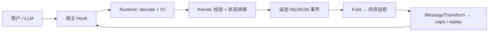

# 01 — 产品总览

## 一句话

**万象术 (wanxiangshu)**：F# 经 Fable 编译为 JavaScript 的**多代理插件运行时**。同一套 **Kernel（纯规则）+ Runtime（副作用边界）** 接到三套宿主：**OpenCode/Mimocode、Mux、oh-my-pi (OMP)**。

## 表面能力 vs 真实难题

### 对外能力

- 子代理委派（coder / inspector / browser / meditator / reviewer 等）
- 文件读写、模糊搜索、执行器、审查循环、`submit_review` / `return_reviewer`
- Nudge（todo / loop / runner）
- 54 个结构化方法论笔记本工具（`methodology_<id>`）
- 三套宿主各自的 tool schema 与 hook 接线

### 工程根问题（不解决则一切退化为脆弱 hook）

1. **宿主协议漂移**：Zod / Mux catalog / TypeBox / Pi 事件模型互不兼容。
2. **LLM 弱类型**：消息与工具参数是动态对象，须在边界立刻强类型化。
3. **宿主 compaction**：对话历史不可靠，不能作 durable 状态真相。
4. **跨轮状态**：review、nudge 须在进程重启后恢复。
5. **副作用**：Node IO 不可避免，但业务规则须可单测、可重放。

## 七条设计公理

| # | 公理 | 工程落点 |
| :---: | :--- | :--- |
| 1 | 稳定资产是领域规则 | `src/Kernel/` |
| 2 | 事件流是事实 | `.wanxiangshu.ndjson` + `EventSourcing/Fold` |
| 3 | 副作用压到边界 | `src/Runtime/` + codec |
| 4 | 边界强类型 | `obj` → DU/record |
| 5 | 进度不靠 compaction 锚点 | `assistant_completed`（`openTodosJson`） |
| 6 | 并发 = 共享可变状态 | `PromiseQueue` / session 域 |
| 7 | 测试时间无关 | 注入 + 正式 tests |

逐条展开见 [01-first-principles.md](./01-first-principles.md)。

## 与万象阵 (wanxiangzhen) 的边界

- **万象术**：单工作区内多代理工具、review；durable 事件 SSOT = `.wanxiangshu.ndjson`（`loop_*`、`nudge_*` 等 kind）。
- **万象阵**：独立协调器插件，DAG + worktree + ff-only 合并；durable 事件与万象术**共用** `.wanxiangshu.ndjson`（`squad_*`/`task_*` 行，见 [19-wanxiangzhen.md](./19-wanxiangzhen.md)）。
- 两插件**互不 import**；协同靠 slash / prompt front-matter（如 slave 侧触发 `/loop`）。

## 用户可见主流程（概念）

## 角色与工具（摘要）

权限矩阵 SSOT：`src/Kernel/ToolCatalog/Registry.fs` + `ToolPermission.fs`。典型划分：

- **Manager**：宿主原生待办写入、子代理、`submit_review`
- **Coder**：读写改、patch、executor（写模式）
- **Inspector**：read、fuzzy_*、executor（只读）
- **Reviewer**：read、`return_reviewer`

## 下一步阅读

- 第一性原理：[01-first-principles.md](./01-first-principles.md)
- 结构：[02-architecture.md](./02-architecture.md)
- 持久化：[05-event-sourcing.md](./05-event-sourcing.md)
- 构建验证：[17-build-test-verify.md](./17-build-test-verify.md)
