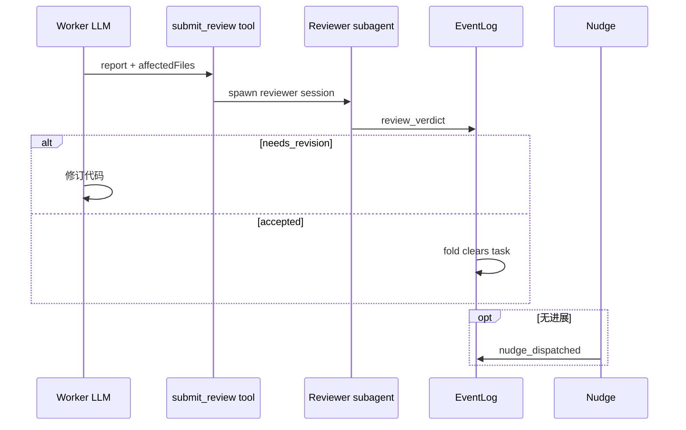

# 06 — With-Review 与 Nudge

## With-Review（/loop）

**目标**：在开发过程中嵌入独立 reviewer 子代理，形成「实现 → submit_review → verdict → 可能修订」闭环。

### 状态机 SSOT

- 类型与转移：`src/Kernel/ReviewSession/`
- Durable task 字符串：`foldReviewTask` + `loop_activated` / `review_verdict` / `loop_cancelled`

内存 `ReviewStore` = 事件投影缓存；**loop 是否活跃**以 NDJSON fold 为准（架构测试禁止 nudge 直读 store 捷径）。

### 典型转移

| 从 | 命令/事件 | 到 |
| :--- | :--- | :--- |
| Inactive | Activate(task) | Active(task) → `loop_activated` |
| Active | submit_review (wip) | Active → `submit_review_wip_recorded` |
| Active | Lock(reviewer) | Locked |
| Locked/Active | verdict accepted | Accepted → task 清空 |
| * | verdict needs_revision | NeedsRevision(feedback) |
| Active | Accept / 取消 | Accepted / Inactive |

精确表以 `StateMachine.fs` 为准。

### 工具

- **`submit_review`**：worker 提交报告；可 `wip: true` 记录部分进度。
- **`return_reviewer`**：reviewer 子代理返回 verdict（与 `ReviewVerdict` 内核类型对齐）。

### Reviewer 轮次与 nudge 上限

`decideAfterRound`：无结果时可能触发 nudge，超过 `maxNudges` 则终止 loop（`Terminated`）。

### 展示 vs 真相

- **真相**：NDJSON + `ReviewSession` FSM
- **展示**：`LoopMessages`、`ReviewPrompts`、消息 YAML front-matter（`PromptFrontMatter`）

`ReviewReplaySync.syncReviewFromTexts`：从宿主文本推断 task，**fallback**；首选 `EventLogRuntime.syncReviewFromEventLog`。

## Nudge 子系统

### 两层拆分

| 层 | 位置 | 职责 |
| :--- | :--- | :--- |
| 纯决策 | `Kernel/Nudge/*` | 给定 `SessionSnapshot`，是否应 nudge、哪种 action |
| 运行时 | `Shell/NudgeRuntime` + 宿主 `NudgeEffect` / `Omp.NudgeHooks` | 锁、去重、`session.prompt`、错误与 abort |

**禁止**在 nudge 入口用内存布尔代替事件 fold 的 loop 态（`ompNudgeHooksDoNotReadReviewStoreForLoopState`）。

### 去重

`nudge_dispatched` 事件 + `foldNudgeDedup`；用户新消息或 WIP 可触发 `nudge_dedup_cleared` / `submit_review_wip_recorded` 策略。

`EventLogRuntimeNudge.TryClaimNudgeDispatch`：在锁内追加 `nudge_dispatched`，避免重复派发。

### 决策优先级（`Kernel/Nudge`）

1. backlog 有 open todos → `nudge-todo`
2. 子代理 / runner 活跃 → `nudge-runner`
3. review loop 活跃（**事件 fold**）→ `nudge-loop`
4. 否则 → none

**抑制**：末条 assistant 含 `<skip-todo-check/>`（跳过待办检查）或 `<skip-review-check/>`（跳过 review/loop 检查）。两者独立：只写一个不跳过另一个；两个都写则两个都跳过。

**与 context budget**：`context-budget-nudge` 优先级更高（见 [13](./13-context-budget.md)）。

action / payload：`EventLogRuntimeAppend`、`nudge_dispatched`。

### 与 PromiseQueue 的关系

异步 `session.prompt` 不得阻塞全局串行队列过久；nudge flow 与队列拆分见 `NudgeRuntime` 与各宿主 effect 模块。

## 端到端序列（review）

## 源码索引

| 主题 | 路径 |
| :--- | :--- |
| FSM | `Kernel/ReviewSession/StateMachine.fs` |
| Review 运行时 | `Shell/ReviewRuntime.fs`、`ReviewReplaySync.fs` |
| Event append | `Shell/EventLogRuntimeAppend.fs` |
| Opencode nudge | `Opencode/NudgeEffect.fs`、`Shell/OpencodeSessionEventCodec*.fs` |
| OMP nudge | `Omp/NudgeHooks.fs` |

## 相关文档

- [05-event-sourcing.md](./05-event-sourcing.md)
- [11-subagents.md](./11-subagents.md)
- [08-tools-and-permissions.md](./08-tools-and-permissions.md)