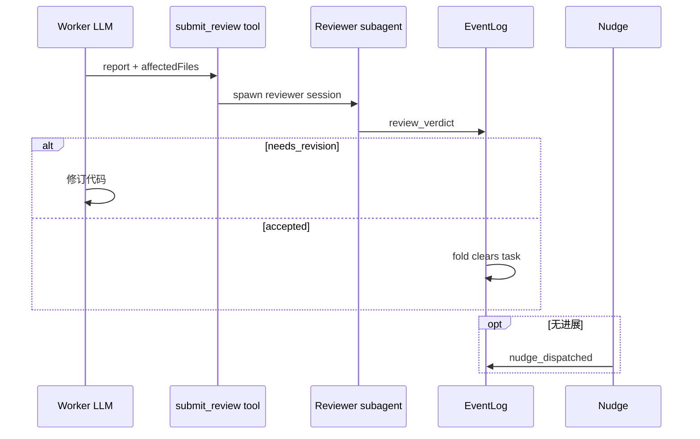

# 06 — With-Review 与 Nudge

## With-Review（/loop）

**目标**：在开发过程中嵌入独立 reviewer 子代理，形成「实现 → submit_review → verdict → 可能修订」闭环。

### 状态机 SSOT

- 类型与转移：`src/Kernel/ReviewSession/`
- Durable task 字符串：`foldReviewTask` + `loop_activated` / `review_verdict` / `loop_cancelled`

内存 `ReviewStore` = 事件投影缓存；**loop 是否活跃**以 NDJSON fold 为准（架构测试禁止 nudge 直读 store 捷径）。

### 典型转移

| 从 | 命令/事件 | 到 |
| :--- | :--- | :--- |
| Inactive | Activate(task) | Active(task) → `loop_activated` |
| Active | submit_review (wip) | Active → `submit_review_wip_recorded` |
| Active | Lock(reviewer) | Locked |
| Locked/Active | verdict accepted | Accepted → task 清空 |
| * | verdict needs_revision | NeedsRevision(feedback) |
| Active | Accept / 取消 | Accepted / Inactive |

精确表以 `StateMachine.fs` 为准。

### 工具

- **`submit_review`**：worker 提交报告；可 `wip: true` 记录部分进度。
- **`return_reviewer`**：reviewer 子代理返回 verdict（与 `ReviewVerdict` 内核类型对齐）。

### Reviewer 轮次与 nudge 上限

`decideAfterRound`：无结果时可能触发 nudge，超过 `maxNudges` 则终止 loop（`Terminated`）。

### 展示 vs 真相

- **真相**：NDJSON + `ReviewSession` FSM
- **展示**：`LoopMessages`、`ReviewPrompts`、消息 YAML front-matter（`PromptFrontMatter`）

`ReviewReplaySync.syncReviewFromTexts`：从宿主文本推断 task，**fallback**；首选 `EventLogRuntime.syncReviewFromEventLog`。

## Nudge 子系统

### 三层架构

| 层 | 位置 | 职责 |
| :--- | :--- | :--- |
| 纯决策 | `src/Kernel/Nudge/*` | 给定 `SessionSnapshot`，是否应 nudge、哪种 action |
| 运行时 | `src/Runtime/Nudge/` + `src/Runtime/EventStore/NudgeEventWriter.fs` | 锁、去重、发送、错误与 abort |
| 宿主 | `src/Hosts/*/Nudge*` 或宿主等价模块 | 事件翻译、`sendNudge` 实现 |

**禁止**在 nudge 入口用内存布尔代替事件 fold 的 loop 态（`ompNudgeHooksDoNotReadReviewStoreForLoopState`）。

### 决策路径（`Kernel/Nudge/NudgeDerivation.fs`）

#### SessionSnapshot 来源

`deriveSnapshot` 从 `NudgeSnapshotSource` 构造 `SessionSnapshot`：

```
snapshot = {
  todos,                // open todo 列表
  lastAssistantMessage, // 末次 assistant 文本
  workState,            // 从 hasRunner + isLoopActive + openTodos 三轴派生
  blockStatus,          // Blocked / Allowed
  nudgeAnchorKey,       // 去重锚点 key
  agentFromMessage,
  modelFromMessage,
  reviewLoop,           // ReviewLoop 快照
  humanTurnId
}
```

`sessionSnapshotFromFold` 从 `NudgeSnapshotState`（事件 fold 产物）+ `RunnerPresence` + `NudgeBlockStatus` 构造快照，供决策使用。

#### 工作状态七轴（`Kernel/Nudge/Types.fs`）

`workStateFromAxes(hasActiveRunner, isLoopActive, openTodos)` 派生出：

| 状态（SessionWorkState） | Runner | Loop | Todos |
| :--- | :---: | :---: | :---: |
| Idle | ✗ | ✗ | ✗ |
| BacklogOnly | ✗ | ✗ | ✓ |
| LoopIdle | ✗ | ✓ | ✗ |
| LoopWithBacklog | ✗ | ✓ | ✓ |
| RunnerOnly | ✓ | ✗ | ✗ |
| RunnerWithBacklog | ✓ | ✗ | ✓ |
| RunnerWithLoop | ✓ | ✓ | ✗ |
| AllAxes | ✓ | ✓ | ✓ |

#### Action 推导（`deriveAction`）

```
Blocked → NudgeNone
Idle → NudgeNone
RunnerWithBacklog / AllAxes → NudgeNone
RunnerWithLoop → skipsReview ? NudgeNone : NudgeLoop
RunnerOnly → NudgeRunner
LoopWithBacklog → skipsTodo ? (skipsReview ? NudgeNone : NudgeLoop) : NudgeTodo
LoopIdle → skipsReview ? NudgeNone : NudgeLoop
BacklogOnly → skipsTodo ? NudgeNone : NudgeTodo
```

#### 抑制标记

- `<skip-todo-check/>`：跳过待办检查
- `<skip-review-check/>`：跳过 review/loop 检查
- 两者独立：只写一个不跳过另一个；两个都写则两个都跳过
- 解析：`Kernel/Nudge.fs` 中 `skipsTodo` / `skipsReview`，在代码围栏外检测

### 运行时层（`src/Runtime/Nudge/`）

#### NudgeFlow 核心循环（`runNudgeFlowCore`）

```
1. takeSnapshot() → SessionSnapshot option
2. deriveAction(snapshot) → NudgeAction
3. selectNudgePrompt(host, action, snapshot) → promptText
4. tryClaimNudgeDispatch(...)  → 在锁内追加 nudge_requested 事件
   - 检查：anchor 匹配、NudgeDedup 未阻塞、generation/cancelGen/humanTurnId 匹配、
     SessionOwner 非 Fallback/Compaction/Nudge、无 pending lease
5. 若 claim 成功：
   - 设置 PendingNudgeLease（dispatch_started）
   - 设置 SessionOwner = "Nudge"
   - 设置 ActiveNudgeNonce
   - sendNudge(promptText, agent, model, nudgeId, nonce)
   - 若成功 → appendNudgeDispatched, 过渡到 "dispatched"
   - 若失败 → appendNudgeFailed / Cancelled / Settled
```

#### 去重机制

`tryClaimNudgeDispatch` 在 EventStore/Runtime 的串行边界内执行：

1. 同步最新 NDJSON 状态
2. 检查 `NudgeDedupState`（PendingNudge + LastDispatchedAnchor）
3. 检查 `SessionOwner` 非 Fallback/Compaction/Nudge
4. 检查无 pending continuation lease 或 nudge lease
5. 检查 nudge ordinal 单调递增
6. 检查当前 anchor 与 snapshot anchor 一致
7. 全部通过 → 追加 `nudge_requested` 事件 → fold → 返回 true

#### Nudge 生命周期事件

| 事件 | 时机 | payload |
| :--- | :--- | :--- |
| `nudge_requested` | Claim 成功时 | `action`、`anchor`、`nudgeId`、`nonce`、`generation`、`cancelGeneration`、`humanTurnId`、`nudgeOrdinal` |
| `nudge_dispatched` | `session.prompt` 成功 | `action`、`anchor`、`nudgeId`、`nudgeOrdinal` |
| `nudge_failed` | 发送失败 | `nudgeId`、`error`、`nudgeOrdinal` |
| `nudge_cancelled` | 被新用户消息打断 | `nudgeId`、`reason`、`nudgeOrdinal` |
| `nudge_settled` | 后续 idle 事件确认完成 | `nudgeId`、`status`、`nudgeOrdinal` |

#### NudgeSnapshotState（事件折叠）

`src/Kernel/EventSourcing/Fold.fs` 调用 Nudge projection，从事件流折叠出 `NudgeSnapshotState`：

- `assistant_completed` → 更新 `lastAssistantText`、`agentFromMessage`、`modelFromMessage`、`turnId`、`openTodos`
- `loop_activated` / `loop_cancelled` / `review_verdict` → 更新 `reviewLoop` 状态
- `nudge_requested` / `nudge_dispatched` / `nudge_failed` / `nudge_cancelled` → 更新 `pendingNudge` / `lastDispatchedAnchor`
- `submit_review_wip_recorded` / `nudge_dedup_cleared` / `human_turn_started` → 清空去重表
- `work_backlog_committed` → 更新 `openTodos`

### 宿主实现

#### OpenCode（`src/Hosts/OpenCode/NudgeEffect.fs`）

`startNudgeFlow` → `collectSnapshot`（从 OpenCode 的 `todo` API 和 `messages` API 获取）→ `runNudgeFlowCore`。

`NudgeTrigger`（`src/Hosts/OpenCode/NudgeTrigger.fs`）：

- `TrackLifetimeEvents`：监听 `stream-abort`、`session.abort`、`session.error`、`session.status` 等，标记 `forceStopped`
- `HandleNaturalStop`：`session.idle` / `session.status=idle` 时触发 nudge 决策

#### Mux（`src/Runtime/Nudge/NudgeRuntimeMux.fs`）

`collectSnapshotMux` 从 `getChatHistory` helper 获取消息，`sendNudgeMux` 调用 `helpers.nudge`。

#### OMP（`src/Hosts/Omp/NudgeHooks.fs`）

`agentEndHandler` 在 agent 轮次结束时：

1. 检查 `openTodoStatuses` + `lastAssistantMessage`
2. `appendAssistantCompletedOrFail` 记录事件
3. `getNudgeSnapshotFromEventLog` 获取折叠快照
4. `deriveAction` + `tryClaimNudgeDispatch` 并发安全派发
5. `sendNudgeReminder` 通过 `pi.sendMessage` 注入 nudge 提示

### 决策优先级

1. backlog 有 open todos → `nudge-todo`
2. 子代理 / runner 活跃 → `nudge-runner`
3. review loop 活跃（**事件 fold**）→ `nudge-loop`
4. 否则 → none

### 与 PromiseQueue 的关系

异步 `session.prompt` 不得阻塞全局串行队列过久；nudge flow 与队列拆分见 `NudgeRuntime` 与各宿主 effect 模块。

## 端到端序列（review）



## 源码索引

| 主题 | 路径 |
| :--- | :--- |
| FSM | `Kernel/ReviewSession/StateMachine.fs` |
| Review 运行时 | `src/Runtime/ReviewPrompts/`、`src/Runtime/Tooling/ReviewRuntime.fs` |
| Nudge 决策 | `Kernel/Nudge/NudgeDerivation.fs`、`Nudge.fs`、`Nudge/Types.fs` |
| Nudge 状态 | `Kernel/Nudge/TodoStatus.fs`、`SubmitReviewHooks.fs` |
| Nudge 运行时 | `src/Runtime/Nudge/NudgeRuntime.fs`、`NudgeFlow.fs`、`NudgeDispatchClaim.fs` |
| Event append | `src/Runtime/EventStore/NudgeEventWriter.fs`、`EventLogRuntime.fs` |
| Event fold | `src/Kernel/EventSourcing/Fold.fs` 与 `src/Kernel/Nudge/` projection |
| Event claim | `src/Runtime/Nudge/NudgeDispatchClaim.fs` |
| OpenCode nudge | `src/Hosts/OpenCode/NudgeEffect.fs`、`NudgeTrigger.fs` |
| Mux nudge | `src/Runtime/Nudge/NudgeRuntimeMux.fs`、`src/Hosts/Mux/EventHook.fs` |
| OMP nudge | `src/Hosts/Omp/NudgeHooks.fs`、`NudgeRuntime.fs` |

## 相关文档

- [05-event-sourcing.md](./05-event-sourcing.md) § nudge 事件
- [11-subagents.md](./11-subagents.md)
- [08-tools-and-permissions.md](./08-tools-and-permissions.md)
