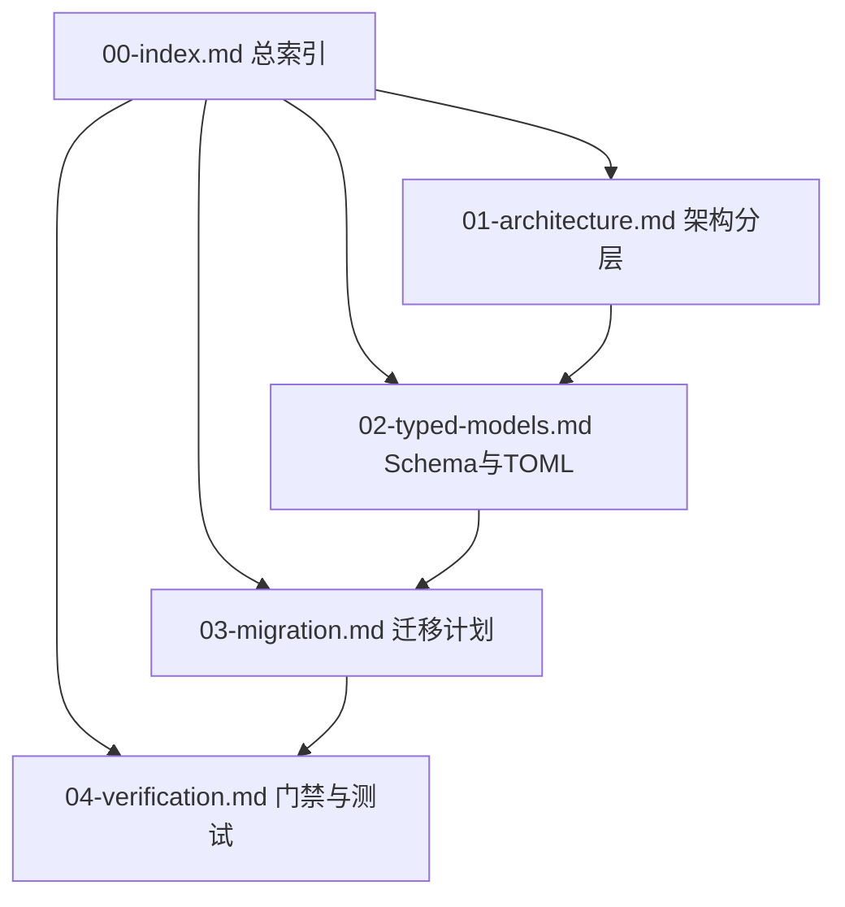

# Universal TOML & KISS 重构规范总索引 (00-index)

本文档是 `kiss-docs/docs/` 文档集的入口索引与纲领性指南。

---

## 1. 规范定位与权威顺序

### 1.1 规范定位 (Normative Status)
本 `./docs/` 目录下的文档集为 **未来实施的短、闭合、可执行规范 (Specification for Future Implementation)**，用于指导 Universal TOML 重构与 KISS 架构重塑。

> **核心纪律：严禁虚构实现状态**  
> 本规范集中所描述的架构与 Schema 为目标设计（标注为 `[TARGET]`），而非当前源码已完成的现状（标注为 `[CURRENT]`）。严禁在文档或代码中把未实现的架构（如 No Self-Parsing 全量落地、Per-Runtime Journal 等）声称为“已完成”。

### 1.2 权威顺序 (Authority Hierarchy)
当文档描述与实际代码发生分歧时，按以下降序确定权威事实：

1. **源码与测试** (`src/`, `tests/`) —— 系统的最高事实来源 (Source of Truth)。
2. **`./docs/` (本重构规范集)** —— 未来实施的短、闭合、可执行规范。
3. **`../docs/20.md` (及 `../docs/` 历史文档)** —— Universal TOML 原始设计论证与冻结决策。
4. **`KISS-*.md` / `host-docs/`** —— 前瞻架构探讨与探索性设计草案。

---

## 2. 阅读路径指南

不同角色的开发者请按以下路径阅读规范集：



- **架构师与内核开发者**：  
  `./00-index.md` → [`./01-architecture.md`](./01-architecture.md) → [`./02-typed-models.md`](./02-typed-models.md)
- **Schema 与类型定义者**：  
  `./00-index.md` → [`./02-typed-models.md`](./02-typed-models.md) → [`./03-migration.md`](./03-migration.md)
- **重构实施者与模块迁移者**：  
  `./00-index.md` → [`./03-migration.md`](./03-migration.md) → [`./02-typed-models.md`](./02-typed-models.md) → [`./04-verification.md`](./04-verification.md)
- **测试与架构门禁审查者**：  
  `./00-index.md` → [`./04-verification.md`](./04-verification.md) → [`./03-migration.md`](./03-migration.md)

---

## 3. 文档职责与状态矩阵

| 编号与文件名 | 核心职责 | 当前现状 (`[CURRENT]`) | 目标状态 (`[TARGET]`) | 主要未决风险 (Risks) |
|---|---|---|---|---|
| [`./00-index.md`](./00-index.md) | 规范总索引、阅读路径、权威顺序、旧文档映射与阶段出口 | 缺乏统一的未来可执行规范索引 | 建立短、闭合、可执行的未来规范总入口 | 规范与源码实施进度脱节；新旧文档边界混淆 |
| [`./01-architecture.md`](./01-architecture.md) | 纯 Kernel、薄 Runtime/Host、Prompt/事件分离架构 | Kernel 与 Runtime 职责存在交叉，Prose/YAML 混杂 | 彻底拆分 Host → Runtime → Kernel；Kernel 零 Fable / 零 FFI | Fable 编译依赖越界；Host 协议兼容层过厚 |
| [`./02-typed-models.md`](./02-typed-models.md) | 强类型 PromptDocument、1.7.0 `smol-toml` 唯一 stringify、No Self-Parsing | 存在手写 YAML front-matter 拼接与自解析 | 强类型 DU 单向投影至 `TomlValue`，生产零 parse，禁止自解析 | 边缘字段类型表达不足导致格式转义异常 |
| [`./03-migration.md`](./03-migration.md) | 13 个知识边界模块拆分、TDD 5 阶段迁移计划、No Shim 规则 | 9 处（扩展至 13 处）存在伪 YAML/TOML 自解析或文本拼接 | 原子切替，零 Shim/Fallback，消除所有自解析 API | 重构中途双轨复杂度残留；打破既有宿主契约 |
| [`./04-verification.md`](./04-verification.md) | 架构门禁规则 (Gates)、正式测试矩阵、Phase 0/1 阶段出口 | 仅有 300+ 行单体门禁文件，缺专用 Prompt 门禁 | 拆分架构门禁，新增 8 大硬性红线；覆盖 9 大测试矩阵 | 过度依赖旧文本快照；门禁拦截影响开发效率 |

---

## 4. 新旧文档迁移映射

从旧文档集 `../docs/` 及前瞻设计 `KISS-*.md` 迁移到本规范集 `./docs/` 的映射关系：

| 来源旧文档 / 前瞻文件 | 本规范集归宿 | 迁移与重构原则 |
|---|---|---|
| `../docs/20.md` (Universal TOML 计划) | [`./02-typed-models.md`](./02-typed-models.md), [`./03-migration.md`](./03-migration.md), [`./04-verification.md`](./04-verification.md) | **主源头吸收**：保留 20.md 冻结决策 (D1–D7)、7 根原语、No Self-Parsing、13 处迁移面与测试门禁 |
| `../docs/00-index.md` (旧总索引) | [`./00-index.md`](./00-index.md) | 重写为未来实施规范索引；移除大型源码统计与冗长历史说明 |
| `../docs/01-overview.md` ~ `04-runtime.md` | [`./01-architecture.md`](./01-architecture.md) | 收敛为纯 Kernel / 薄 Runtime / Host 三层解耦模型 |
| `../docs/08-tools-and-permissions.md` | [`./02-typed-models.md`](./02-typed-models.md) | 提炼为 ToolOutput / Search / Fetch / Caps 的独立 TOML Schema |
| `../docs/17-build-test-verify.md` | [`./04-verification.md`](./04-verification.md) | 收敛为正式测试矩阵与 Phase 0–5 门禁策略 |
| `../KISS-00.md` (第一原理) | [`./01-architecture.md`](./01-architecture.md) | 吸收 KISS 原则：只做终态投影，不做动态拦截 |
| `../KISS-01.md` / `../KISS-Driver.md` (Flow 与 Driver) | [`./01-architecture.md`](./01-architecture.md) | 吸收 Host MessageId 与 Driver 单进程执行模型 (`[TARGET]`) |
| `../KISS-03.md` (宿主桥) | [`./01-architecture.md`](./01-architecture.md) | 吸收薄 Host 隔离设计，明确外部 AGENTS.md YAML 保持豁免 |
| `../KISS-04.md` (Per-Runtime Journal) | [`./01-architecture.md`](./01-architecture.md) | 吸收先盘后内存、Per-Runtime 单写 NDJSON 前瞻设计 (`[TARGET]`) |

---

## 5. Phase 0 / Phase 1 阶段出口与状态声明

### 5.1 状态声明纪律
- 绝对不得在文档或 commit 中将尚未合并和验证的代码标为“已完成”。
- 所有中间开发状态均为 `[IN_PROGRESS]`，目标架构为 `[TARGET]`。

### 5.2 Phase 0：RED 基线与契约冻结出口 (Phase 0 Exit Gate)
- **出口条件**：
  1. 完成 `smol-toml@1.7.0` FFI、Unicode、转义、AoT 的 RED 失败测试注册。
  2. 完成 Batch iterator、Review double-check、Synthetic origin 的 typed composition 失败测试。
  3. 拆分 `ArchitectureGatesTests.fs` 为专用门禁入口，新架构门禁已注册但处于 RED 状态。
  4. 业务 F# 代码保持原样，零假 TOML 生成。

### 5.3 Phase 1：GREEN Typed Transport 出口 (Phase 1 Exit Gate)
- **出口条件**：
  1. 消息来源 (`MessageOrigin`) 与 Review challenge 状态全面进入领域 Event / Metadata，机器决策不再扫描 Prompt 文本。
  2. Batch 子代理报告全面转换为强类型组合。
  3. 物理删除生产代码中的 `parseFrontMatter`、`hasDoubleCheckAnchor` 及相关文本扫描函数。
  4. Phase 1 对应的 typed transport 单元测试与契约测试全面通过（GREEN）。

---

## 6. 实施出口与验证证据

- **实施出口 (Implementation Exit)**：按 [`./03-migration.md`](./03-migration.md) 顺序推进 Phase 0~5，最终必须全部跑通以下验证：
  ```bash
  npm run build-and-test
  npm run test:contract
  npm run test:integration
  npm run test:gates
  ```
- **验证证据 (Verification Evidence)**：
  - 生产代码中 `smol-toml.stringify` 入口唯一 (`src/Runtime/Serialization/Toml.fs`)。
  - 生产代码中针对自生成 TOML / Prompt 的 `parse` 调用为零。
  - 架构门禁 `npm run test:gates` 检查全部通过。
