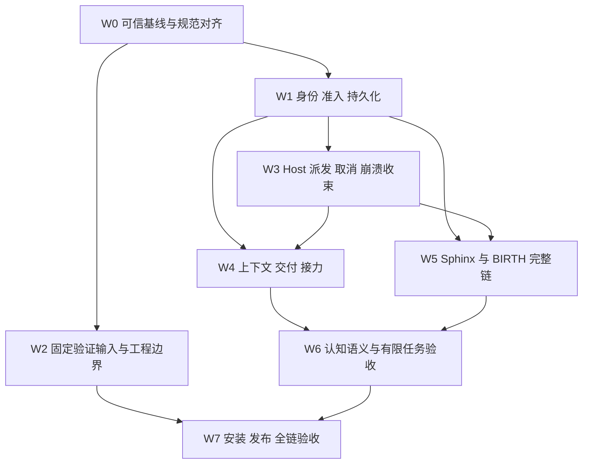

# 剩余 TODO 施工总计划（2026-10-03）

本批验收仍未闭合：gen112有效选定Node22/npm11.12.1但缺SDKroot时18排空436/0/7skip/2TODO只属较窄范围；补齐SDKroot仍5003ms静默、17/18排空，不能解释为仅遗漏环境。npm第一工具归档正例现拆真实准备完成判决与实际install/assert阶段，原强断言/held负例/预算不动；gen113最终结果待[本批附件](archive/2026-10-04/S03源码目录身份与NuGet协议夹具-2026-10-04.md)。错误001/019名单仅setup，所有输入分别记账，不提前绿色，Archive未施工。

S03 最新接手入口为[源码目录身份与NuGet协议夹具](archive/2026-10-04/S03源码目录身份与NuGet协议夹具-2026-10-04.md)。aac79的Fable边界接续到source owner：同库存foreign parent/root实际0/2红，私有dev/ino守护publication/revalidate/dispose/catch后定向12/0；archive/tools/NuGet同类问题未因此闭合，TOCTOU/ABA和完整FD/readonly仍保留。15个NuGet非法图只共享该组不改写的真实Git前提，每叶SDK/restore/HOME/feed/packages独立，typed/calls断言不动；195→13是静态Git成本，不是CI原因或耗时结论。最后统一输入待附件，T418/T419和GAP-055 PARTIAL保持。

最新9909 CI `37200928231`确实触发300000ms physical backstop：817/818排空、1active、0queued，活动身份016、无权威summary，不能称pending-only。最后test:pass是null lock framework dependency map场景，不据此认作唯一故障。新批须取得同配置正式证据，不删测试、调workers或放宽300000/5000。

随后aac79 CI `37202396189`已818/818、4253/0/103skip/404TODO，244.51s wall/370.10s testtime，exit1仅pending；它未包含当前source/NuGet共享修复，不定位9909原因或替代本批验收。NuGet同15叶before15/0 23.782s→after15/0 13.165s为本机单次观测，195→13是静态Git成本，不作CI因果。source第三个parent替换/rootmissing反例加入后完整定向13/0、2.942s，原12/0是此前截面；统一输入仍待附件。

输入证据分开：gen103 的本地静默失败及72e83 CI的300000ms backstop/817完成/无权威summary仍是历史失败或无结论，不能归因为唯一016。新 fe9 CI `37195699694` 已818排空、4188/0/102 skip/404 TODO，exit1 solely pending proof，只证明其自身输入，不定位旧72e83。后续按真实因果处理重复fixture准备，不删测试、调workers或扩大300000/5000。

最新接手入口：[31e同步与冲突处理](archive/2026-10-04/Upstream增量-31e69b3dd-2026-10-04.md)。aaa 合并已形成 `0adeee843`；第十七、十八批 upstream 自述仍属历史，不能当本地验收。新增量修复测试 oracle、排空与显式 ABSORB 分支后，继续沿既定 S03 顺序施工；GAP-077/181 的真实机制和 Host 链缺口保留。

2026-10-04 最新施工裁决见[aaa同步记录](archive/2026-10-04/Upstream增量-aaa123b12-2026-10-04.md)：第十六批的“三卡闭环”只属上游历史。本地修复开任期误退邮箱及完整 binding 重放，Suicide 退休后邮箱 append 失败尚无恢复 owner，新增接线撤回、concern006 全链 TODO 保留。下一项为真实 writer 故障与冷恢复；不复活旧任或靠重新调用无准入的工具补账。S03 已实施[SDK准备](archive/2026-10-04/S03选定SDK准备-2026-10-04.md)，后续优先 NuGet/tool restore 精确图、实际只读 Fable 及同候选 verify。

后续`fcfba389e`合并只接收与现行需求一致的更新，未关闭新GAP；具体见[最新同步记录](archive/2026-10-03/Upstream增量-fcfba389e-2026-10-03.md)。工蜂不得启用TODO覆盖、选择性重跑或Long Stroke支线裁剪来声称施工已完成。

本计划以 `8cf51cc84` 为源码基线，替代旧计划的**后续排期**，不覆盖旧轮证据。此次交付只做调查、计划和文档；没有实施下面的产品改动，也没有重新运行构建或测试。产品语义仍只来自 `requirements/<package>/WHAT.md`；计划、测试标题、GAP 和历史 README 都不能反向改写 WHAT。

以上描述计划创建时的交付。随后已实施006的Node判决输送、S02参数canary因果定位，以及下文R01—R04的Host就绪和Guard替代修复。GAP-223已由正式hook、实际发送owner及六个安装版Host场景闭合；不把这些结果算作T180、T418或T419完成。最新交付与剩余边界见[Host就绪与Guard替代记录](archive/2026-10-03/Host就绪与Guard替代修复-2026-10-03.md)，前一批证据保留在[判决输送与参数canary记录](archive/2026-10-03/判决输送与Host参数canary修复-2026-10-03.md)。接手者先读增量，不重做下列已闭合工单。

我的排序是：先使验证结果可信，理清身份、持久化和物理终结，再完成真实业务链，最后证明模型实际接收的材料与职责边界。Sphinx 与制度学习须安排实现工作，不能继续只围着已有 Surface 补局部断言。遇到冲突时先比较现行条款；条款已明确的直接对齐，只有现行条款之间仍冲突的才形成待决议题。

最新`b7768f478`增量：Blogger文案已资源化且有真实direct Surface观察；制度学习已有candidate机械准入、Born事实/投影和revision计算，不重做这些基础。GAP-077/181均PARTIAL，真实Host跨请求交付、WHAT003限定输入与机制提炼、005语义准入、生产revision门禁、同批Born/Committed/必要Deferred事实，以及统一Blogger规则索引仍待完成。不能借上游“全绿”复活墓碑、用legacy binding发行新授权或取消仍忙的固定DevOps工作。详见[增量记录](archive/2026-10-03/Upstream增量-b7768f478-2026-10-03.md)和分册04/06；当前7 OPEN、130 PARTIAL，S03优先次序不变。

2026-10-03上游同步增量：接续`faae4a602`合并upstream/master `e1e7dd3f1`的四个尚未包含提交。Sphinx已有真实MCP输入解码、typed拒绝、cancel准入和canonical持久化，GAP-219由OPEN转PARTIAL；start/claim/submit/amend驱动和OpenCode物理结果读取仍未实现，不再按“handler忽略输入”的旧诊断施工，也不称Sphinx全链可用。Predictor实际正文按新WHAT降为reasoning，原生reasoning不回传；委托增加exact AdmittedWork及空闲DevOps不阻塞Join。对应分册02/04/06随本批更新，正式结果与兼容修复见[同步记录](archive/2026-10-03/Upstream同步-e1e7dd3f1-2026-10-03.md)。424项逐项清单仍是创建时截面，新增或改写的正式TODO以现行测试为准，不捏造新的全量统计。S03（VS-016的T418/T419）仍PARTIAL：源码、依赖与完整Node/npm工具准备已有独立证据，实际verify接线、只读执行和运行期改后恢复尚未闭合，按下文S03继续施工。

### 上游历史进度（不作为本仓验收）

下面第四至第十五批及分册02的同批自述来自本次上游增量；其中gen254等generation、DevOps运行数量、变异和“结算”仅属上游历史，不代表合并后的本地构建或正式套件已通过。本次取舍与本地验收以[590同步记录](archive/2026-10-04/Upstream增量-590a3f69e-2026-10-04.md)为准。S03的copy/chmod方案因真实父目录替换反例仍PASS exitCode0未被接纳，T418/T419保留。

2026-10-04 第四批结算：分册02 两卡闭环并经 DevOps 真实验证绿——系统性 shard 缺边排查（审计工具 `scripts/checks/shard-edge-audit.mjs` 落地并实跑 271 shards 564 findings；四条实证确凿缺边补齐，含 LinkageProjection taskResult 根因闭环；剩余 findings 处理路径裁决为逐 shard 真实编译探测）与 durable-events-022 locality B4（七 contract + 两 focused runtime locality 各自单次真实 Fable 编译共 13 次，反向依赖负例先行排除假红；两次正例红均由真实缺边引起，补边后复绿，locality flat compile 确立为比词法审计更精确的缺边探测器）。

2026-10-04 第五批结算：分册02 三卡闭环并经 DevOps 真实验证绿（gen 283 编译绿、三卡测试全绿、四处变异红证零残留、022 两层复绿含 authority-runtime-surface 裁决 todo 化）——DE022-extend、session008（GAP-133 冷重开 crash cut 断言）、DP002+effect003（producer 盘点矩阵与 intent→create 写前定序）；另立 shard 重组待办卡（authority-runtime-surface 缺边与 delegation [028] 185 预算 ratchet 冲突，机械补边使闭包 118→251 超预算，正解为架构级 shard 重组，详见分册02 构建待办段）。

2026-10-04 第六批上游历史：shard-regroup 死open清理、DE023 domain-fold与session013刷新投影回归的运行记录来自上游（gen284+、013七条及相邻套件数字均非本地验收）。013实际证明先由一个实例消费，再由持有stale投影的冷reader顺序消费时不重复交付；两次RefreshProjection及其变异不证明两个实例同时进入refresh/append窗口的原子仲裁，该窗口和OS restart re-enlist仍待证。delegation-028的48→56在本仓对应新增依赖边带入8个实际source，不能沿用上游“与本批无关/此前增长”的历史归因；后续host-session-contract缺边修复又带入10个typed ChatExecution合同及既有支持模块fs，当前反增长ratchet为66，56只是中间截面。完整取舍见590同步记录。

本地focused编译进一步暴露SessionHostPort所属`host-session-contract`缺少`execution-session-chatexecution-facts`真实依赖，导致Controller使用ChatExecutionKey/ManagedChatAcceptanceWitness时缺类型；SW012 production-plan正式反例0通过/1失败，单边修复后定向2项通过。Controller独立闭包由112→132个fs/fsi（56→66个fs），facts shard分组带入10个typed合同及既有支持模块fs，不含具体Host/文件/网络适配器，单边不新授capability；须据实计入028 recovery反增长ratchet66，其余预算未超。禁止实现source断言及WHAT185预算不变。正式重构建/受影响套件结果待本批验收，不由该定向绿色推出全仓成功，详见[590同步记录](archive/2026-10-04/Upstream增量-590a3f69e-2026-10-04.md)。SDK当前只调查，未实施准备owner。

2026-10-04 第七批结算：分册02 两卡部分闭环（一绿一 todo 化）——session015 主体测试绿（前置断言 resume /Ada/、childCount=0、child===first.child、unknown 拒绝、cold snapshot deepEqual 全过，相邻回归 006/007/008/013 全绿；先红复核确认 resume 链合规、生产零改动），obligation002 B5 canary 主体绿（A/B set exact 三字段比对、B 不影响 A 隔离反例、变异红证成立——todos 反转即红、既有 in-process 用例绿）；两个真实生产缺陷转显式 todo 并在分册02 立卡（session015 settle 冷重开挂起——AwaitCurrentWorkRecord 永不完成、60s 超时；ob002 空数组清空缺口——无插件对照 VERDICT=HOST-CLEARS 证明 Host 原生清空成立、插件 toolBefore 零改写，缺口指向插件 checkpoint 链对空数组的行为）。下一批优先两个缺陷修复卡、session018（与 015 同链串行）、chat010（依 session-019）等。

2026-10-04 第八批结算：分册02 两卡收束——settle-fix 修复闭环（根因为 HostForkRuntime.AdoptExisting 冷收养无条件 Restore 植入 active 空壳 ChildRun，致后续 dispatch 的 backend Fork 回 Nudged、runTask 不启动、AwaitCurrentWorkRecord 永等 restored cell；修复为 AdoptExisting 收窄为纯 dormant 身份登记——agentId+childId，去 Restore/BindChildSession，四处调用点同步；DevOps 真实跑绿——015 GAP-133 用例转正后 11/0 从 60s 超时变为绿、回归 006/007/008/013 共 53 条 0 fail、变异红证成立（在 AdoptExisting 本体恢复 Restore 即复现挂起、还原复绿）、gen 296 编译绿、热路径零变化——AdoptExisting 仅进程表 miss 时可达）；clear-fix ob002 归因重置与证据修正（诊断分叉三命中——afterAClearSettled=旧行排除清空延迟、hostStderrTail 干净排除插件异常栈；如实修正第七批无插件对照 VERDICT=HOST-CLEARS 的证据瑕疵——该对照里 todowrite 的 tool 循环根本未执行，set-round=false、after-set=0，「清空」实为「从未设置」，「Host 1.18.29 原生清空语义成立」的前提需重估；插件侧静态排查已穷尽无空数组分支差异；现有证据无法区分「Host 空数组 no-op 语义」与「插件链运行时干扰」，002 保持 todo）。下一批：ob002 新调查卡（优先——修正无插件对照使 tool 循环可跑，或直接读 Host 二进制行为）、session018（与 015 同链串行）、chat010（依 session-019）等。

2026-10-04 第九批结算：分册02 两卡——session018 落地（四种非常规终止 TurnAborted/provider retry/Fission external-abort 形态/unknown stop 经真实 run lifecycle 复核合规——TurnAborted 与 retry 观察保留 Active、Fission 结算为可 join 的 SendFailure、unknown stop 被 stopBelongsToRun 挡下、HandleAbandoned 唯一写点仍是受权 cancel；todo 转正为四场景真实测试——handle 保留 + 冷重放一致 + 冷重开 re-enlist、Active 场景复用 root 与结算场景新 root 的条件断言；新增 emitStopWithReason 投递原语——harness 物理边界扩展、.fsi 签名由 DevOps 补齐；DevOps 真实跑绿——018 四场景 4/0、相邻回归 64 条 0 fail、delegation 027 3/0；变异红证四点留下批补、Fission group 全链与物理 Host 会话存续仍待证）；ob002 归因定案（无插件对照探针两轮独立运行 verdict 均 HOST-NO-OP——Host 1.18.29 空数组 todowrite 原生语义就是 no-op 不清空表；证据链：set 真实落表 3 行→空数组 tool-result round 到达→无第二条 todo.updated 事件、表仍 3 行；有插件 canary 与无插件行为一致——插件链无干扰，H1 成立；002 canary 清空断言需按 Host 实际语义校准并立 Host 兼容事实记录，002 保持 todo 归下批）。下一批：ob002 断言校准卡（优先）、018 变异红证补做、chat010（依 session-019）等。

2026-10-04 第十批结算：ob002 断言校准卡——002 canary 清空断言按 Host 1.18.29 实际语义校准（空数组 todowrite 为 no-op，A 表保持 set 内容 exact 不变——比对对象从 0 行变 4 行完整数组、净增 settled 稳定断言，断言强度实际加强），canary 转正为正式 integrationTest（标题校准为「replaces only the current session TodoTable; an empty todowrite is a Host no-op」），Host 兼容事实三处落点（runner A_CLEAR 段注释、evidence hostCompat 字段、测试断言注释），隔离反例保留，归因定案卡销项（原「插件 checkpoint 链缺口」假设作废——是 Host 边界事实非插件缺陷）；DevOps 真实验证（002 转正后 2/0/0/0 全绿、判别力复核成立——预期临时改回 [] 即红证明校准不是恒真、探针第三轮 HOST-NO-OP 三轮一致、包级回归 004/005 10/0）；018 变异红证③成立（①尝试编译失败已还原、②④留下批）。下一批：018 变异红证①②④补做（①需先调查 deliverFailedCompletion 真实签名）、chat010（依 session-019）、审计 findings 探测持续等。

2026-10-04 第十一批（session024 调查卡，未施工）：委派编号与仓库卡号 019/024 错位澄清——委派实质内容为 managed-session-lifecycle-024 的 DevOps crash recovery 四项义务（单一可执行 authority、固定 Persona/model、命令不重放、PTY 排空，逐字对应 024.test.mjs todo），仓库 019 卡是 cancel/delete drain（GAP-126，依 chat006/010 夹具，不依赖 D18）。024 经调查确认被 D18/GAP-129 与 C3 两项未裁决依赖阻塞（分册02 卡面『GAP129绑定范围和C3先定』），按硬约束零生产改动停下；四项义务实现 owner 已定位（ChildDispatch durable binding / ModelRouting seed / ChildWorkRecovery void / Runtime.CloseOwnedPtys），双恢复并发与跨进程不重放断言未落地，反例矩阵备于 requirements/managed-session-lifecycle/tests/README.md 的 session024 调查脚印段。下一批可开工：session019 卡（不依赖 D18）；session024 待 D18（固定 binding 范围：身份不变 vs 当次可准入）与 C3（Load Phase/durability activation 的 consumer 等待范围）裁决——规范级裁决归用户。另发现分册头『chat010（依 session-019）』与 019 卡面『依chat006/010』方向相反，待修正其一。

2026-10-04 第十二批结算：分册02 session019 落地——cancel/delete 完整 execution drain（GAP-126）先红复核确认合规（ClearSession/SignalSession 两路均 terminal-commit-await 后 exact release、无 timer/polling、persistence 失败 typed reject），生产 drain 语义零改动走基线绿；SessionRecoveryHostSurface 新增 clearSession/signalSessionCancelled 两个 lifecycle 公开入口（RecoveryHostHandle 携带 PluginSessionScope）；todo 落地为三个真测试（held 屏障/commitUnknown fail closed/decoy 隔离——复用 chat006 受控 writer 夹具与 chat010 same-session 多 key 形态）；DevOps 真实验证（019 基线 4/0、相邻回归 chat006 12/0 + lifecycle 018 4/0 + 015 11/0、gen 302 编译绿）；三处 before-provider 断言的 routing [006] 同 session 原子取代语义预期修正（测试侧修正非生产缺陷）；变异红证四点因时间预算未做如实留下批。下一批：019/018 变异红证合并补做卡（019 四点 + 018 ①②④，①先调查 deliverFailedCompletion 真实签名）、chat010 的 held-append todo、session024 待 D18/C3 用户裁决等。

2026-10-04 第十三批结算：019/018 变异红证补做部分闭环——018①完整闭环（上批失败点按 mutation-redplan-019-018.md 设计图的六参形态一次成功：变异后 turn-aborted 场景「never as an unauthorized abandon」断言精确红、逐字还原复绿 4/0；设计卡签名调查结论实证正确——deliverFailedCompletion 是 gate/pendingRuns/journal/parentId/run/error 六参、末位裸 string，上批失败是与 deliverProvenCompletion 混同）；019①实施后发现设计图偏差（变异确认编译进 dist——gen 306 --clean 强制重编后 PluginSessionScope.js:167 调用在提前位置——但预期红断言 executionCount 不敏感、测试仍 4/0；根因待查：drain 链路时序或 routing 观察口径的未查明交互；已完整还原零残留，偏差属设计图假设需重估、非实施错误）；019②③④、018②④五点因时间预算未做如实留下批；变异设计文档已落盘（tests/support/mutation-redplan-019-018.md——七点精确 diff 与签名核验，供后续按图施工）。下一批：变异红证剩余五点 + 019①设计图偏差重估（合并一张卡）、chat010 的 held-append todo、session024 待 D18/C3 用户裁决等。

2026-10-04 第十四批结算：019/018 变异红证合并补做七点全闭环——019①按修订版实施（SettleSessionExecutions 批量预释放变异使 held 期间 executionCount 断言精确红；第十三批偏差的根因三环证据链被运行证据实证：Map.toList 字典序使 before-provider key 先被 settle + held barrier park 第一个 key 的 terminal append 使 started key 的 SettleExecution 在断言观察时从未进入 + 原变异位置在已被 supersession 移除 lease 的 key 上 no-op——纯时序问题、routing 观察口径无盲区，调查结论与修订已写入设计图追加小节）；019②③④、018②④各按设计图红（delete completion promise/decoy 隔离/cancel 断言/provider-retry 场景/fission 双断言）；018①第十三批已闭环复核；各点逐字还原复绿——最终 018/019 双 4/0、零生产改动、七处零残留。下一批：cancel 侧 release 时序变异覆盖（persistTerminal 内前移——设计图补充建议，归 Manager 裁决是否补入）、chat010 的 held-append todo、session024 待 D18/C3 用户裁决等。

2026-10-04 第十五批结算：chat010 held-append 转正 + cancel 侧变异覆盖落地——chat 包 010 的 held-append todo 转正为两段真测试（public logical cancel 经 signalSessionCancelled、session delete 经 clearSession，各经 B1 受控 held Host，same-session 双 key + decoy 隔离——chat 包侧的入口级义务闭合，与 lifecycle-019 同族语义各自独立锚点；先红复核确认两路 drain 合规、零生产改动走基线绿）；变异红证四点闭环（A SignalSession 去 await 使 cancel 屏障断言红、B SettleSessionExecutions 去 await 使 delete 屏障断言红、C 去 session 过滤使 decoy 隔离断言红、D cancel 侧 release 时序——persistTerminal 单点前移与 019-① 偏差同根因，改为 SignalSession 批量预释放使 executionCount 断言红，第十四批 Manager 裁决项落地销项）；DevOps 真实跑绿（chat010 基线 3/3/0、相邻回归 chat006 12/0 + 019 4/0、零生产改动、四处零残留）。下一批：session024 待 D18/C3 用户裁决、台账矛盾修正（chat010 依赖方向两处记载相反）、审计 findings 探测持续等。

2026-10-04 第十六批结算：W4 首批三卡闭环并经 DevOps 真实验证绿（gen 338 编译绿、三卡测试全绿、三处变异红证、回归全绿、format 绿）——guidance001（GAP-115：TipGuidanceDelivered 携带 OccurrenceId、TipDeliveryProjection 拆分 occurrence Frontier 与 TipName Coverage、重放只清 Coverage、001 真实反例转正、Frontier 键退回 TipName 变异红证；journal 级 restoration 断言留待事实列举表面裁决）、relay-assessment002（GAP-194：ReplayCandidate/FreshAssessment 拆分、三重精确比对——DevOps 根因修复 View.ActiveSnapshotId 永不匹配改从 AssessmentRecord 透出、exact replay 零新事实、ReplayConflict/AlreadySubmitted 两拒绝路径；5 pass + 1 跨任期 todo 留待真实退休链夹具）、concern-routing006（GAP-157：participant 终结接线——ObligationJournalSurface LifeCompleted 分支 + SuicideTool runRetirement → retireMailboxesOf → durable MailboxRetired → ProjectionUpdate.applyConcern 退休投影；DevOps 根因修复 LifeCompleted 分支缺接线并补 shard 缺边 ProjectReference；decoy 隔离 + 后继新代断言 + 手工绿例保留 2/2；变异红证两处——跳过接线红/删 owner 过滤红；session/handle 层终结是否同接线的语义裁决归 Manager，SuicideTool 路径无独立测试锚点）。另如实记录：三卡测试存在语言运行约定问题（008/006 的语言正则依赖——runner 设语言变量或期望校准，待统一）。

2026-10-04 第十七批结算：W5 首卡两件（bd009/lang-anchor）经 DevOps 真实验证（gen 348 编译绿、bd009 4/4 + 两变异红证、lang-anchor 三组语言实验全过、回归 95/95、format 绿）——behavior-diagnosis 009（GAP-112）：raw cardinality gate 归一至 EnforcerCycleDecode.chronicleCallCount（单一实现，Repair 委托）、validateCycle 在解码过滤前执行 raw 基数 gate（rawCallCount <> 1 拒绝）、BlogSurface.decodeCycle 并列暴露 chronicleCallCount/decodedCalls；真实链（journal+ownership+continuation+commit）反例：双调用其一不可解码零 BlogObservationCommitted 零 coverage 推进、flight 保留；正例：单合法调用提交恰好一笔并释放 flight；DevOps 根因修复——009.test.mjs 的 committedCount helper 原用 journal Envelope 格式解析 EventStore canonical 行导致计数恒 0，改为 JSON.parse 原始 canonical 行按 payload.Fact union 路径判断；变异红证 A（表面 gate 删→红）与 B（真实链 gate 双点改解码后计数→mixed 挂起 90s 文件级红，红形态为挂起如实记录）；lang-anchor：第十六批「语言运行约定统一」销项——测试文件级锚定（四个语言敏感测试文件 'en' 锚定）+ 三组语言实验实证。

2026-10-04 第十八批结算：两卡（il003/ce015）部分闭环 + 缺口转 todo 收束（gen 356 编译绿、format 绿）——institutional-learning 003（GAP-181）：ABSORB 改为调用方显式 absorbedRule 声明并机械核对传入 canonical live 规则名，substring 匹配回落已移除（「词同机制不同」不再误判 ABSORB）；真实链 raw 命令/路径/时间戳经验不永久化、评估零额外 IO 已证；DevOps 真实跑绿（全包 15 pass + 4 todo 0 fail、English 变量；变异 A substring 回落恢复 3 处红 + B 删清单校验 2 处红均还原复绿；三处修复——Surface.fsi 签名漏同步、003 第 44 行清单外笔误、format 4 文件）；caller 语义判断（机制涵盖、泛化成立）的有限人工语义审阅仍待审（如实）；005 语义准入与 008 原子提交义务不变；变异 C（优先级反转）不红——缺「合法 candidate 与合法 claim 并存优先 BIRTH」优先级用例，归下批补锚点。cognitive-environment 015 补充（GAP-077）：R1-R6 六个 registered Host 用例已编写（真实插件注册链 + transform 输出 wire 字节断言），但经 DevOps 五层根因链实证（accepted-execution-missing → participant 不一致 → commit Conflict → BloggerRequestMissing），plugin fixture 的完整 transform blogger 分支要求 durable BloggerRequest 链（materialize + PromptKey 绑定 + flight claim），该链与 plugin-fixture 注册 hook 组合无先例（018 先例仅 manager 会话、009/017 走独立 journal surface 直调）——fixture 架构级缺口（未闭合，非已完成），R1-R6 转显式 todo（断言代码原样保留），归 Manager 裁决 fixture 扩展方向；B1-B5 + 5 静态检查全绿（10 pass）；变异①静态红 + 变异② B3 精确红均还原复绿；变异③（去 isCompanion）无锚点——非 companion 行为反例依赖 R2 解封，归 fixture 裁决后补。

2026-10-04 第十九批结算：两卡收束——il-lang-priority 完全闭环（institutional-learning 001/006 语言锚定 'en' 文件级——断言依赖 invalid/en.md 与 discarded/en.md 英文文案，默认中文环境语言红消除；003 新增优先级用例：合法 candidate 与合法 absorbedRule 并存 → candidate 优先 BIRTH，实现优先级经 Enhancer.fs evaluate 分支顺序确认；DevOps 真实跑绿 001/006 3/3、003 5/5、变异 C 优先级反转精确红还原复绿——第十八批「变异 C 不红」锚点缺口补齐实证）；fixture-blogger 部分闭环（plugin-fixture 新增 claimBloggerRequest——017 owner setup 先例搬进注册语境，全经公开 surface 零生产改动，第五层 BloggerRequestMissing 解封、Conflict 修复；R1-R6 逐层推进到第六层新发现 MANAGED-005 HostRunUnavailable/NoBindableRun——transform 的 snapshotOpt 读快照与 runtime 快照 client.session.messages 不同源，PluginHostWiring 的 SnapshotOpt 装配链需 wiring 层架构调查，R1-R6 转回 todo 断言与 setup 保留；fixture 回归 017 85/85、009、018 81/81 全绿证明扩展无副作用；变异③仍无行为锚点依赖 R2 解封）。下一批：snapshotOpt 装配链 wiring 层架构调查（R1-R6 第七层解封前提）、ra002 跨任期夹具、session024 待 D18/C3、W5 剩余卡等。

2026-10-04 第二十批结算：wiring-snapshot 施工卡收束——「调查闭环 + 第七层发现 + R 系列诚实回 todo」（零生产改动、format 绿）。snapshotOpt 装配链调查闭环：第六层「快照不同源」诊断被否定并经实跑证实（wiring 全程同源——PluginHostWiring input=boot.Input → PluginHost.createHost → SessionSnapshotPort.create → SdkSnapshotPort(input.client) 与 runtime.client 同一对象；R1-R4/R6 补推消息对后 boundary 拒绝消除，Engineer 修复有效）。第七层新根因完整实证：诊断链（tryReadExecution null + acquire Acquired + commit AlreadyApplied + commit 后仍 null）证明 stub chat.message 的 admission 是 session 级 reservation——lease 已 commit 但 PhysicalUserMessageId 绑定从未落地，注入门禁 bloggerChronicleTextEnabled 读 physical 绑定 committed execution → null → maybeInject 静默 no-op；R1/R3/R4 红（marker 0≠1）、R2/R6 表面绿被证明是 lease-null 假绿（未走到被测门禁分支）——R1-R4/R6 全部诚实转回 todo（七层链完整实证入理由，断言与 setup 保留）；变异③锚点继续顺延（R2 todo）。验证：fixture 回归 81/81 + 4/4、003 复核 5/5、015 恢复基线 10 pass + 6 todo 0 fail。下一批：chat.message 的 physical 绑定 admission 路径调查（R 系列第八层解封前提）、R5 断言语义重设计（Manager 已裁方向为 typed 拒绝断言）、ra002 跨任期夹具、session024 待 D18/C3、W5 剩余卡等。
2026-10-04 第二十一批结算：physical-binding施工卡收束——「第八层证伪 + continuation分支实证 + R系列诚实回todo」（零生产改动、format绿）。第八层修复被实跑证伪：root physical与chat.message physical分离后tryReadExecution仍null（Engineer的admission未运行结论不成立）；实跑揭示新分支事实：companion blogger会话的transform走Blogger continuation路径（把claimBloggerRequest建立的BloggerRequest toml材料投影为provider wire——生产行为）而非普通transform的maybeInject注入路径——R1/R3/R4的0注入与R5的静默完成都是continuation分支的行为；R1-R6全部诚实转回todo（断言与setup保留）；用例语义与生产分支的映射需重新调查（maybeInject在normalTransform中的调用条件需先厘清——哪个会话形态走到注入点）。验证：015基线10 pass + 6 todo 0 fail、回归018 81/81 + 008 9/9 + 003 5/5。下一批：maybeInject调用条件调查（R系列语义重设计前提）、ra002跨任期夹具、session024待D18/C3、W5剩余卡等。

2026-10-04 第二十二批结算：inject-condition 施工卡收束——「第九层调查闭环 + 第十层结构性证伪 + R 系列诚实回 todo」（零生产改动、format 绿）。第九层调查闭环：normalTransform 第 15 步 InjectBloggerChronicle 无条件调用（prefixHorizon 分支之外）；旧 R 系列 0 注入根因是第 11 步 continuation 投影替换 wire 使注入门禁读到无 lease 的渲染 id（与第二十一批实证吻合）；plan freeze 需要 durable open request 而 continuation 投影需要 process-local live flight——两者可分离（claim 后 dispose）。第十层结构性证伪：Engineer 的「acquireLease surface 直落」设计经实跑证伪——三步证据链（acquire Acquired → commit AlreadyApplied → tryReadExecution 仍 null）：acquire 只能 adopt chat.message 的 session 级 lease（adopt 路径不写 PhysicalUserMessageId），fresh-reserve 路径（唯一建立 physical 绑定）因 session lease 先占而不可达——physical 绑定 lease 在 stub chat.message 形态下结构性不可达（生产 chat.message 在 admission 时直接建立 physical 绑定，stub 未复刻）；R1-R4/R6 诚实转回 todo（十层链完整入理由，断言与 setup 保留），fixture 前提收窄为需要能建立 physical 绑定 lease 的 admission 入口；变异③锚点顺延。验证：015 基线 10 pass + 6 todo 0 fail、回归 018 81/81、003 5/5。下一批：physical-binding admission fixture helper 设计（R 系列第十一层解封前提）、ra002 跨任期夹具、session024 待 D18/C3、W5 剩余卡等。
2026-10-04 第二十三批结算：pb-helper 施工卡收束——「同形态重排证伪 + R 系列诚实回 todo」（零生产改动、format 绿）。pb-helper 施工经实跑证伪为同形态重排：admitExecution 与第十八批形态完全一致（acceptAuthorityRoot 不传 physical + chat.message 传 messageID——无新 physical-binding admission 机制），仅删除手动 acquireLease（lease 归 admission 独占）；第十层结构性结论原样延续：chat.message admission 是 session 级、physical 绑定不落地、tryReadExecution null、maybeInject 静默 no-op；R1/R3/R4 真红（marker 0≠1）、R2/R6 假绿（期望 0 注入但来自门禁未评估）——R1-R4/R6 全部诚实转回 todo（第十一层理由注明「同形态重排、第十层结论延续」）；连续两批 Engineer 施工（acquireLease 直落、pb-helper 重排）被实跑证伪为同根因——R 系列解封前提三次确认为需要真正的 physical-binding admission fixture 入口（ModelRouting surface 暴露 fresh physical-binding reserve 入口，或 chat.message stub 的 admission 形态对齐生产）；变异③锚点顺延。验证：015 基线 10 pass + 6 todo 0 fail、回归 018 81/81、003 5/5。下一批：physical-binding admission 入口的 Manager 裁决（fixture 设计方向——surface 暴露 fresh reserve 或 chat.message stub 形态对齐）、ra002 跨任期夹具、session024 待 D18/C3、W5 剩余卡等。

## 1. 怎样使用这份计划

| 文档 | 用途 |
|---|---|
| 本文 | 总顺序、依赖、首批任务、统一施工步骤、验证和暂停标准 |
| [01：Host 与验证](TODO施工分册-2026-10-03/01-Host与验证.md) | Host、provider、模型路由、故障政策、验证系统、发布与工程边界 |
| [02：权限与生命周期](TODO施工分册-2026-10-03/02-权限与生命周期.md) | 身份、准入、委派、Fission、持久化、崩溃恢复、Git 与物理资源 |
| [03：上下文与接力](TODO施工分册-2026-10-03/03-上下文与接力.md) | 压缩、前缀、知识、仓库能力、轨迹、工作记录、接力与退休 |
| [04：认知与 Sphinx](TODO施工分册-2026-10-03/04-认知与Sphinx.md) | 认知材料、提示交付、诊断、关注路由、制度学习、guard、Sphinx |
| [05：424 项逐项清单](TODO施工分册-2026-10-03/05-逐项清单.md) | 每个运行时 TODO 的原始标题、理由、测试文件和施工分册入口 |
| [06：GAP 补充清单](TODO施工分册-2026-10-03/06-GAP补充清单.md) | 所有仍 OPEN/PARTIAL 的 GAP；包括没有 TODO 占位的欠账 |
| [旧计划与历史结果](archive/2026-10-03/TODO测试施工计划-2026-10-01.md) | 保留每轮证明范围、失败和暂停点；不再用旧“约 60/80/20 个”的估数排工 |
| [历史归档索引](archive/README.md) | 旧设计与已结束批次的证据；归档未关闭剩余 GAP，资源审查建议仍须核对现状 |

接手者从逐项清单选择一项，读其分册中的同包、同文件卡，再执行本文第 7 节。每次只认领一个能在一次提交内闭合的边界。一个文件含多个 TODO 时，每个实例单独结算；一个 TODO 包含多项义务时，先拆清证明范围，不能只证明其中一项就删整条。

## 2. 起点与统计口径

| 证据 | 当前已记录结果 | 应怎样解释 |
|---|---|---|
| 默认全量 | 816/816 文件；3807 passed，0 failed，85 skipped，424 TODO；进程清理 accepted=true | 正常跑完，但退出 1，未完整验收 |
| 五文件定向 integration | 103 passed，0 failed，0 skipped，5 TODO | 包含一次真实 Host 正常 canary；只覆盖所选文件 |
| 完整 integration suites | 34/34 文件；362 passed，1 failed，15 TODO | 032 canary 未在既有 25 秒内看到取消调用 before；日志未见取消请求进入 provider，原因未定 |
| verification harness | 278 passed，0 failed | 验证设施局部通过，不代替产品义务 |
| distribution 子门禁 | 3 passed，0 failed，1 TODO | 仍未验收 |
| 构建、静态检查 | Fable 1538 输入、822 模块编译链接；check 通过，control-pyramid 为 0 | 构建阻断 GAP-216 已关闭，不再列为前提缺失 |

以上来自上轮保存的正式结果，本次只核对文档和清单。被中断的 canary 诊断没有权威统计；不能补进通过数。之前 434/435 等 TODO 数是历史截面。

本次把运行器的 **424 条 TODO** 全部归档，覆盖 **389 个编号文件、53 个包**。57 个有 WHAT 的包中，另 4 个是 `cognitive-workspace`、`epistemic-reasoning`、`feature-ablation`、`requirement-system`。零 TODO 不表示零欠账，处置见第 10 节。静态 `.todo(...)` 匹配得到 379 行，这既会漏掉 `options.todo` 和循环实例，也会混入 runner 的故意待办夹具，不能拿它当剩余工作总数。

`repository-investigation/007` 有 3 个循环生成标题未自带 WHAT 锚点；清单按文件关联到 007，并明确标注。后续修改该文件时补全正式标题锚点，不把重命名计为完成行为证明。

## 3. 先把工作分对类

| 类别 | 开工条件 | 该交什么 | 禁止的替代物 |
|---|---|---|---|
| A：已有实现，缺独立证明 | 现行 WHAT 清楚，真实入口可达 | 正反例、真实副作用观察、必要的隔离变异 | 只 import Surface、重复生产算法、读取源码找词 |
| B：已有可执行失败 | `options.todo` 或正式反例能重现违约 | 去除该例 TODO 后先红，修所有者，再绿 | 改预期迎合实现、删除反例、重复到通过 |
| C：生产能力未实现或未接线 | 明确缺失入口与所有者 | 最小完整业务链及其公开边界回归 | 给模板补常量、另建测试专用业务状态机 |
| D：合同需要对齐 | 当前 WHAT 与旧标题不同，或现行条款互相冲突 | 可比较的条款表、推荐方案、受影响调用方与测试 | 用测试偷偷决定产品规则 |
| E：物理证据 | 已有可控的真实 Host/进程/Git 资源 | 实际调用、磁盘、退出、回收和重开证据 | 端口 Promise 完成等同于 OS 退出，idle 等同于结果 |
| F：语义与职责审阅 | 材料、权限、交付位置已可观察 | 有限场景集、逐项审阅记录、实际任务轨迹、机械断言 | 用关键词覆盖率证明推理正确或双语等义 |

类别可叠加。例如 Sphinx 036 是 C+A+E，action-affordance 是 D+F+A，不能按当前测试 import 的难度分类。

## 4. 依赖与波次

波次是前置关系，不是必须整批串行。只有共享契约、同文件或生成产物存在冲突时才等待；已满足前提的独立卡可以提前做。每波结束只声明其通过的边界，不宣称全仓清零。



| 波次 | 具体范围 | 开始前 | 离开本波的证据 |
|---|---|---|---|
| W0 | 清单、合同冲突、Host canary 因果定位、基线与输入身份 | 本计划 | 每项都有 owner/观察点；真实失败与因 TODO 非零退出分开；不再用过期标题改生产 |
| W1 | durable-events、effect-accounting、interaction-authority、dispatch-protocol、managed-chat、失败计数、工作/attempt 身份、obligation checkpoint | 对应 D 项已定 | append 先于发布；拒绝零副作用；exact replay 与新工作可区分；独立 journal 重开一致 |
| W2 | verification 006/016、Fable 负向编译、Surface 边界、构建闭包与输入绑定 | W0 | 阶段读同一输入，修改后恢复不能蒙混；错误/取消/未完成如实传播；不影响测试本身的运行能力 |
| W3 | Host 032、TodoTable、provider 重试、managed lifecycle、process tree、crash、Fission、模型租约、guard | 对应 W1 契约 | 真实 receipt、实际 send/terminal、子资源退出、崩溃恢复；不盲目重放未知副作用 |
| W4 | context、prefix、grounding、guidance、concern、Casebook、work-record、horizon、relay | 相关身份与持久化已稳；物理项等 W3 | 实际 provider 字节、冻结/reanchor/reopen、旧 epoch 拒绝、接力和退休后资源不再复活 |
| W5 | Sphinx v2 Runtime/MCP/OpenCode、制度学习 BIRTH/规则准入 | 对应 W1/W3；Sphinx 承接合同已明确 | 至少一条公开入口从输入走到持久答案/学习收据，取消和恢复同样闭合 |
| W6 | action-affordance、cognitive-environment、attention、investigation、office、语义 Review | 投影、权限与入口已可真实观察 | 场景、完整交付、实际权限、人工语义结论分别记录；有限样本不冒充普遍智能保证 |
| W7 | distribution、feature-ablation、完整 integration、Long Stroke 与发布验证 | 相关工作卡完成 | 所有必跑层执行，物理资源收束，未完成项清楚；有 TODO/skip 时仍不宣布完整验收 |

高风险路径优先于数量：身份与持久化错误会让后面的绿色失真；Host 取消、接力退休、崩溃恢复共享资源语义；Sphinx 同时依赖这些边界。单纯删掉大量资源关键词 TODO 对这条路径没有帮助。

## 5. 需要先对齐的合同台账

这里的“推荐”是施工建议，不是已经批准的新产品语义。若现行 WHAT 已能裁决，实施者直接引用条款；若仍有两条不可兼容的现行规则，先提交具体选项、迁移影响和红例，再请用户选择。不要把普通实现取舍都变成审批。

| 决策号 | 冲突与关联范围 | 推荐推进方式 | 哪些工作可继续 |
|---|---|---|---|
| D01 | Sphinx SUPERSEDES 的 Bayes 合格条件、经典算法退化、标准 Engineer、全链取消承接不完整；GAP-222 | 在现行 WHAT 明确必要合同与作用域，逐条映射；不复活旧阶段工具/价格公式 | v2 字节、独立算法局部反例和入口结构审计 |
| D02 | intra-participant-parallelism017 仍拒绝旧只读 Sphinx Engineer，与标准 Engineer 权限不同 | 按现行 office/delegation/Sphinx 共同边界统一；旧角色仅历史解码 | 非 Sphinx Fission 身份、结果与资源证明 |
| D03 | effect003 旧 TODO 把 provider todo mutation 交给插件 intent；现行 obligation 是 Host-owned todowrite | 以现行 WHAT 裁掉旧义务，保留 Host 终态后 checkpoint；不是恢复旧账本 | 真实 TodoTable canary、checkpoint 既有回归 |
| D04 | execution-model-routing011 旧描述 resolve-before-Accepted，现行条款 accept→acquire→project；GAP-131 | 先做时序对照，按当前 WHAT 修断言/台账，不倒转生产顺序 | 活跃租约计数和失败回收 |
| D05 | provider-language008 的 bound session、recovery013 的 language provenance、behavior018 的 life 字节冻结与全局语言来源 | 区分全局语言切换、历史请求字节与 RulebookRevision 冻结各自作用域；现行条款有冲突先裁清，禁止恢复会话语言绑定 | 固定全局语言下的四视图冻结、双语完整请求捕获 |
| D06 | GAP-132：稳定handle与单次work、旧无scope历史和exact新工作准入 | 上游已增加AdmittedWork及scoped事实；保留合法未Join续做，核对所有writer/consumer和加载期void接线，不重做裸link墓碑方案 | 受权取消及真实启动/物理重启证据 |
| D07 | GAP-123：五类 authority closure 缺生产事实/执行；不只是字段缺测试 | 对每类根列闭合事实、生产者、唯一归还点；按现行 WHAT 决定类型与持久迁移 | 缺身份查询、畸形身份拒绝 |
| D08 | GAP-150：effect 合同与独立证明分类的所有权 | 先核实 verification owner 按 path/title/WHAT 管理的分类来源；若缺失，先落实该 owner 的维护方案，不把历史文件名当现有设施。业务 effect 事实不能推出测试是 Adapter/Long Stroke，effect 行不能自报证明等级；没有独立分类不计证明 | journal codec/fold 与真实崩溃切点 |
| D09 | GAP-218：Load Phase 结算与延迟 durability 激活；TargetAgent 回退 Byname | 明确“可向 Host 派发前”屏障及持久身份来源，保留已修的 append 失败传播 | Recovery 真实输入/重开，身份缺失负例 |
| D10 | GAP-115：TipOccurrence frontier 与旧按 TipName 去重 | 当前 WHAT 已按 occurrence 定义，先查事实是否携带 identity；恢复 Full 不增加首投事实 | guidance 原子提交和字节冻结 |
| D11 | GAP-113：缺 provider identity 的 process fatal 与仅终结本 attempt；behavior019 列 protocol-exhausted，而 context025 明确修复耗尽只 StopPhysicalRun | 按身份缺失、普通协议耗尽、commit-unknown、不变量破坏分列 owner/结算/终结范围；解决现行条款冲突后再验证 fatal，不能把 exhaustion 一律升级为进程 kill | 结构解码、原始多调用计数与 commit 原子性 |
| D12 | GAP-182：旧记录把 DeferredWorkResurfaced 与单事实字段列为待决，但现行 institutional008 已明确必要事实 | 默认按现行 WHAT 实施同批 LearningDispositionCommitted、必要的 InstitutionalRuleBorn/DeferredWorkResurfaced，并补 codec/fold/恢复；只有要改成单事实字段才另提规范变更，不把维持旧实现变成审批前提 | BIRTH candidate/规则准入、原子提交、未结算不 resurface |
| D13 | GAP-074：permit 消费→释放→再消费是否同一授权 | 画出一份 permit 的线性生命周期，明确释放的资源与不可复用身份 | before 拒绝零 I/O、隔离并发调用 |
| D14 | GAP-078/091：query-shell owner；horizon/js 工具命名规则 | 用实际任务、副作用与职责逐项判定；有必要才改现行条款和公开名 | 描述五问清单、请求投影同源 |
| D15 | GAP-092：完整 wire 预算小于最小结果开销 | 明确拒绝/外部承载及计量范围；不能只截正文 | UTF-8 完整结果计数与物理终结证明 |
| D16 | GAP-095：进程内诊断与可遗留快照文件 | 明确是否允许非恢复用途的诊断导出、身份和新鲜度；不能用“非权威”偷换“不落盘” | 等待的因果关联与负向编译 |
| D17 | GAP-108/111/084/086：实际收到的原字节、附加表示、跨 Y frame 记录与覆盖域 | 按 owner 分清原始值/编码载体/已见事实；为每个域给独立字节 oracle | 已闭合 TOML 原值保真保持回归，不重新改坏 |
| D18 | GAP-129/130：固定 DevOps binding、路由可用性与投机容量预占 | 区分身份不变与当次可准入；ordinary demand 与 Strength 专门的非等待 reservation 按各自合同定时序，不能把前者的 accept→acquire 一概用于后者 | 已接受 run 的 lease 多重集回收 |
| D19 | GAP-152：过期 parent 与从未存在不可区分 | 增加有依据的过期证明或明确开放边界；不靠不存在推断过期 | 双 remote、CAS 竞争、真实同步 |
| D20 | GAP-215：ref-only gate 与门内 snapshot/claim/Published 写入 | 在最小可恢复有界事务与门外协议中做具体比较，明确崩溃恢复点 | cleanliness 已修不重做；实际 Git 竞争测试设计 |
| D21 | GAP-058/060：JS 后缀、内部物理入口导入例外和运行行为 | 明确边界特例的必要性、范围及反例；保留真实退出证据 | 已登记 Surface 编解码与 Fable 编译边界 |
| D22 | durable-events024 的必填注入与 025 直接 physical adapter 的 fatal 归属；GAP-098 | 先按 incident、settlement、composition owner 分清责任，统一当前条款，再证明只 kill 一次 | codec、无副作用拒绝、独立消费者编译 |
| D23 | interaction-authority021 历史旧身份解码与 durable-events026 旧协议只离线迁移；GAP-124 | 分清仍合法载荷中的历史身份与已退役协议；不加运行时双读、不恢复活跃 Inspector | 当前活跃旧身份拒绝及合法历史材料只读观察 |
| D24 | provider-language010 的 Semantic Anchor 承载形式；distribution007 的归档根成员；GAP-070/211 | 分别对照现行条款与实际消费者，明确表示方式和允许的包成员，再同步 gate 和样例 | 双语请求交付、真实打包隔离与字节一致性 |
| D25 | context004 的“非纯 XML”与当前标签判定；GAP-105 | 为纯 XML、合法 prose 含标签、工具样标签、混合文字列决策表；effect004 是确认幂等/不得退回 Requested，虽同列旧 GAP 也须单独证明，不能当 XML 规则 | 压缩事务原子性与 effect exact replay |
| D26 | recovery007 的历史预算上限缺持久证据；GAP-140 | 区分耗尽后违规接受与历史 limit 无法验证；前者先红修复，后者明确事实表示/旧日志处置，不能回放时偷读当前配置 | 可独立证明的耗尽计数与新失败拒绝 |
| D27 | 安装版 Host 即使配置零重试仍可能双请求；GAP-144 | 以受支持版本的真实请求轨迹确认；明确兼容能力、插件可控制边界与不兼容时拒绝，不能在插件多扣领域预算掩盖 | 单次 physical run 关联、未认领 Host 错误保持可见 |
| D28 | work-record009 的 BlindPlan/首次 planComplete T1 与 context017/028/029 的 checkpoint、Opening floor；GAP-109 | 明确 OpeningBoundary 的成立事实、冻结范围和旧数据恢复；首次原生 todowrite 不自动等于 OpeningBoundary；联查 work008/009、context017、semantic007 | 用户消息永久 raw、已明确的 checkpoint K 窗口与其它字节保真 |

## 6. 第一轮实际施工怎样安排

W1 首批进度（2026-10-04）：DE019、IA017、obligation004 三卡已闭环，DevOps 真实验证绿（编译绿、测试绿、无临时残留）；pending-proof 债务与 ob004 七 slice 待裁决仍如实留在各 GAP 行。

W1 第二批进度（2026-10-04）：chat006、effect001、session006 三卡已闭环，DevOps 真实验证绿（gen 254 编译绿、三卡测试全绿、chat006 变异红证成立且零残留、上轮四卡复核绿）；各 GAP 行仍留项照实。另立构建系统待办：增量编译闭包递归不完整（.fs-only focused 编译漏后向依赖，structured-workflow-012 flat-closure 守护测试处于 tier-skip，详见分册02 文件头），修复增量闭包算法建议下一批优先立卡。

W1 第三批进度（2026-10-04）：build-closure（structured-workflow-012 默认层生产图守护 + CompanionHost 补边）、session007、DP010 三卡已闭环，DevOps 真实验证绿（gen 262 编译绿、三卡测试全绿、两处变异红证零残留、focused 修复端到端生效）；各 GAP 行仍留项照实。构建待办升级为系统性 shard 缺边排查（CompanionHost 边已修，DevOps 本轮另发现 LinkageProjection 缺边，详见分册02 文件头），保持下批优先。

不要同时启动四个全量，也不要让四人分别修改公共 Fold。以下S01—S04保留为计划创建时的工单；当前施工按后面的R01—R04更新顺序执行，不能继续把已经取得证据的006输送和032参数夹具当作未定位故障。

| 工单 | 负责人/文件所有权 | 顺序与交付 | 依赖/停止点 |
|---|---|---|---|
| S01 | 主 agent；计划/GAP/各包 README，暂不改生产 | 对齐 D01—D05 的现行条款；更新过期描述时保留历史原因；把无法由现行条款裁定的事项单独呈现 | 不允许一个 TODO 标题成为修改 WHAT 的唯一理由 |
| S02 | 子 agent A；host032 和其已有 canary support | 读失败日志→捕获请求/匹配/响应/Host call 的因果链→证明取消步骤实际被提出→原期限内执行→分别观察正常、executor error、cancel 的自动 after | 未到 provider 请求前，不修改参数回滚；没有新证据不重跑相同全量 |
| S03 | 子 agent B；verification006/016 与输入准备所有者 | 先复核 016 已有“阶段中修改后还原”可执行 TODO 并取得正式红例；设计单一验证输入与独立输出；逐项证明准备一致、阶段同源、依赖隔离、结果绑定 | 仅 copy/chmod/watch 不够；不能为了自证把业务输入换成测试夹具 |
| S04 | 子 agent C；先只读 authority/lifecycle/crash 的边界 | 为 D06—D09 做事件与时序表；列 identity、append、publish、send、terminal、release 的所有者；提出最小契约修改与 red case | 与主 agent 定契约后才改公共类型；不与其他 agent 同时改 Fold/PluginScope |

第一轮合并前，主 agent 复核 S02/S03 的独立反例及证明限制。S04 的设计若仍待产品决策，交付可审查的选项即可，不用“先改一版再说”。第二轮优先选 concern006 的终结接线、guidance001/005 的 occurrence、provider recovery007 的持久计数、relay-assessment 精确重放等已知反例；每项仍须核对自身前提，不预先承诺一轮清掉多少。

### 已完成批次：Host就绪与GAP-223（起点863b848bb）

本批从resident Predictor项目健康失败和旧Guard与新用户消息交错的HTTP500开工。R01—R04已完成其下列有限义务；下表和操作次序保留为交付依据，不是尚待认领的任务。没有降低并发或扩大原预算。

| 工单状态 | 实际完成证据 | 留给后续的范围 |
|---|---|---|
| R01 已证 | 去除100ms请求截断、严格健康/路径响应及canonical路径；Node22/26各10/10，harness285/285，完整integration的resident成功 | 不断言旧全量失败只有这一个原因；GAP-054全阶段审阅仍未完成 |
| R02 已证 | typed Accepted/容量替代、先落终态后归还exact资源；排队H可被J替代；真实ProviderStarted；Fable flight封口、exact HumanRoot重放和共享Strength准备幂等回归 | GAP-139的无assistant Accepted与真实boot sweep另开工；不能从本批推广为所有crash已证 |
| R03 已证 | 实际ManagerWorkflow发送owner拒绝失效idle许可，零SDK发送；有效许可只发送一次；隔离旧路径变异两例必红 | 不替代完整send/crash物理矩阵 |
| R04 已证 | 255文件1387 pass/0 fail/19 skip/133 TODO；完整integration35文件376 pass/0 fail/15 TODO；distribution3 pass/1 TODO；文件排空和清理均accepted=true | 入口仍因TODO退出1；不是全仓完整验收，也不删除T180 |

| 工单 | owner与文件边界 | 顺序及必须交付 | 禁止的替代 |
|---|---|---|---|
| R01：Host就绪 | verification-system；ProcessHost与已有health/readiness物理回归 | 先证明响应晚于100ms请求切片但早于原阶段deadline仍应被观察；HTTP错误/非法响应/提前退出必须失败。保留每次请求及初始化阶段的有限诊断，用受控条件区分Host初始化未完成与请求被提前取消。只认真实成功状态和响应，轮询不续期 | 不扩大5000ms启动预算、不降低并发、不把任意HTTP状态或stderr活动当ready；独立canary成功不覆盖全量失败 |
| R02：G/H exact交错 | execution-model-routing、managed-chat-execution、execution-failure-policy及Host膜 | 正式hook红例安排G已接受→H接受并取得租约或exact排队准入→G迟到params/transform/public event。替代必须由容量owner明确提供typed证据，失败policy发布exact Cancelled并由execution owner持久化；H资源与执行保全，G不能以网络重试污染H | 无lease不是Superseded证明；reader不重建G租约、不写terminal、不静默放行；不靠异常名字或错误文本选择policy |
| R03：未发出的旧Guard | ManagerWorkflow/HostSessionNudge/dispatch及quiescence owner | 正式红例暂停旧idle派发，在H已经入场后继续；旧许可必须失效且SDK没有收到过期Guard。另证G已经物理接受后被H替代的路径由R02结算，不能混为“根本未发送” | 不建立第二张session-current真相，不用sleep、debounce、计时宽限或observer到达序号决定发送 |
| R04：真实Host与正式入口 | 主agent协调，子agent分别审阅 | 核对installed1.18.29的错误/取消公开协议；真实G/H交错必须得到H成功及G正确终态、零错误ProviderRetry。先定向相关套件、再一次完整integration；保留TODO/skip非通过、文件排空、physical清理及首次失败原因 | pure Surface或隔离参数canary不能冒充G/H兼容；任何真实失败未分类时不靠重跑全量碰绿 |

R01与R02可并行，但共享接口先由R02提出、独立审阅后再改调用方；R03与R02有所有权依赖，串行修改共同Host/dispatch文件。主agent拥有计划、GAP、README、统一build与交付记录，避免各agent同时改文档或生成输入。

逐项操作：

1. 保护863b848bb现场，读取本批原始失败、WHAT及owner调用链；把每个命题写成可观察输入与结果。
2. 在正式测试位置取得红例，确认失败发生在目标断言，而不是加载、权限或无匹配测试。Host就绪的物理时间案例与G/H的受控回调顺序分别证明，不共用碰运气的时序。
3. R01保留原deadline，去除与合法初始化冲突的请求截断；R02先固定typed supersession证据、exact settlement与原异常向Host呈现的契约，再实现。已查明安装版Host共享同session旧loop：明确managed-session-lifecycle-016的真实外部Human输入例外，由唯一准入owner消费不可伪造的Accepted witness与容量owner的exact替代证据，在新输入Host保存/provider effect前收束旧attempt；不授权自动Guard、retry或普通root InterruptAttempt。R03只在真实发送owner消耗或拒绝许可。
4. 复核未准备就绪、HTTP错误、Host提前退出、旧G重复/迟到事件、H失败、append失败/未知提交、foreign exact key与取消重放。不释放H，不把Unknown当Cancelled，不吞结算失败。
5. 用实际支持Host证明旧G被正确收容，H `/message`成功且进入自身provider；真实参数canary全部旧断言保留。另在H准入完成而Host尚未保存/运行的窗口接纳第三输入J，验证H的已确定取消、新J独立回答及旧事件不撤J资源；只串行chat.message内部并不能证明此窗口安全。对无法由Host公开合同实现的边界给具体证据与最小兼容决定，不能以helper绿关闭GAP。
6. 定稿测试和文档后统一Fable build，跑相邻requirement与物理harness；只有新改动或新失败才扩大验证。一次完整integration核对权威计数、文件排空与进程清理。最终仍有TODO时明确非完整验收。
7. GAP-223只有上述两种调度、typed终态、新H执行和真实Host证据齐全才可关闭；R01只关闭已经证明的就绪缺陷，GAP-054全阶段审阅仍保留。提交/正常推送master并同步现有PR后，把本批记录归档。

调查进一步确定R02内部必须按以下次序施工，不能只修旧G缺租约的异常：

1. **容量准入先作有限决定。** 新H得到Admitted或Queued后，由容量owner确认exact替代；立即持久结算G并等待旧Host attempt物理停止，然后才等待H可用容量。只有实际拒绝H的QueueFull才保全G；队列虽满但H能立即取得target时仍须接受。不能先退G再判断是否容得下H。
2. **排队等待不占会话准入序列。** 第三条J须能取代排队H。H得到租约后重新进入有限的投影/commit序列，核对exact替代事实；不得把已经Cancelled的H再写成Failed，也不得迟到投影覆盖J。
3. **交接失败先落终态，后还资源。** SDK拒绝取消旧attempt时，新H必须通过正式transaction结算Failed，之后只释放H的exact租约或pending。terminal提交未知或结算不完整时保留资源和原始原因，不以session-only取消扫掉J。
4. **迟到公开事件只处理它能证明的执行。** 旧G的MessageAborted与idle不能撤H的许可、Strength或provider fence。idle须读取公开SDK的已完成assistant及parent，并在读取前后验证同一个attempt；coarse session信号只唤醒协调。缺少assistant不能证明Accepted输入已经终结，完整boot sweep仍归GAP-139。
5. **每层都有独立证据。** 容量满队列、取消拒绝、terminal提交未知及同physical下一provider step使用受控正式回归；安装版Host分别暂停G的transform、实际挂住G的provider，以及暂停H的公开hook返回后输入J。分别核对HTTP结果、回答parent、持久终态、一次结算、零错误retry和物理清理。
6. **同key注册与重放须真正闭合。** Fable Task是Promise，完成状态由flight自身记录，不能调用.NET的`IsCompleted`。最后一次output模型投影与注册封口必须处在同一个同步owner段；在公开投影的微任务窗口迟到的hook走正常有限重放，仍有完整model/variant且仅一个exact槽。同一HumanRoot物理消息的native replay读取已经持久Accepted的身份，不随当前authority误变为HumanMessage；malformed或更换participant仍typed拒绝。失败测试也须等待所有已启动hook后才清理其journal。
7. **同一调查决定的共享实例不能重复启动。** 相邻speculative-investigation-013保留两个插件实例并发同源transform；prepare flight结束后仍须凭实际active decision共享原语义completion，不能把同Decision误判成另一个owner冲突并追加CannotContinue。不同Decision和已关闭决定仍不得复活，不增加第二张状态真相。正式回归核对Requested/Bound/Prepared/Closed数量、原完成材料、一次Replica发送和卸载一实例后另一实例的后续决定。

### 当前批：S03不可变验证候选（T418/T419，源码、npm与工具准备增量）

已补输入符号链接拒绝：required/optional根、普通输入、tracked corpus文件及父目录的外部映射不再静默漏检或跟随；输出根保持原边界。证据与后续接入设计见[S03前置记录](archive/2026-10-03/S03输入链接边界-2026-10-03.md)。T418/T419均保留；运行期ABA、准备一致性、依赖封闭和候选结论绑定仍待施工，不能以本项取代下面六步。

2026-10-04增量为[指定Git tree源码准备](archive/2026-10-04/S03指定树源码准备-2026-10-04.md)：`prepareGitSourceCandidate`只接受完整tree OID，读取原blob并在自有Git metadata复核完整tree，发布源码摘要及清理句柄。它不是dirty工作区原子捕获，也不是immutable/execution-ready receipt；当前verify仍未改接。下一步固定依赖/工具链身份及只读输入、可写输出契约，再从候选内自举各真实阶段并完成两组反例，不能删除现有TODO。

接续[依赖归档准备](archive/2026-10-04/S03依赖归档准备-2026-10-04.md)已补两类真实准备证据，详见[本批记录](archive/2026-10-04/S03真实npm与Node工具准备-2026-10-04.md)与[016测试说明](../requirements/verification-system/tests/README.md)：真实npm安装定向45项通过、0失败；完整selected Node/npm bundle定向15项通过、0失败。前者以私有Node执行真实`npm ci --ignore-scripts`，绑定原始package/lock、完整安装成员及独立物化产物，证明非法来源预拒绝、integrity失败和取消回收；其`bootstrap-admission`仅检查启动Node与npm入口身份。后者以`selected-node-npm-bundle`绑定明确摘要归档中的完整Node/npm成员，真实执行版本及platform/arch探针，不能与入口准入哈希混称完整工具闭包。

两类归档共用`verification-archive.mjs`的路径、类型、mode、字节与闭合链接校验；工具探针结束后再次核对完整物理成员，实际CLI新增文件会阻止发布。该步骤边界复核仍不能发现改后恢复，也不授予只读资格。早期45项夹具实际npm为11.18.0，当时尚未安装仓库依赖；后续实际安装增量见下文，旧证明范围不升级。GAP-055保持PARTIAL，T418/T419保留。

新增工具回归证明npm声明的必需生产依赖图闭合于所选npm包：direct `graceful-fs`或transitive `@gar/promise-retry`缺失时，父目录实际补包也不能授予通过。optional缺失允许，存在则递归校验；这不是任意loaded module、绝对文件读取或OS闭包证明。完整npm11.12.1工具包也取得15项定向通过，仍不是实际仓库依赖安装。Homebrew Node26追加58项只有45通过、13失败，缺`libnode`的二进制被真实拒绝；后续平台证据统一见本批记录，不抹掉该失败。

工具prepare/runProbe已补AbortSignal生命周期：实际挂起npm探针取消后保留Error/null原原因，POSIX进程组和后代退出、输出管道排空及ownedroot回收；已取消调用在读取缺失归档前拒绝。

第二批见[工具归档安装与输出根](archive/2026-10-04/S03工具归档安装与输出根-2026-10-04.md)：`installVerificationDependenciesFromToolArchive`已把完整工具准备接入真实安装，定向报告10项通过、0失败（含父组）。安装器自己准备并拥有工具归档，直接运行原bundle的Node/npm路径；真实两层锁定包安装后，在公开发布边界再次复核完整工具成员，把固定`toolDigest`纳入installation及dependencyDigest。真实tarball挂起期间改非CLI库或新增工具成员，释放响应让npm正常结束后仍拒绝；actual Node/npm版本不符、Error/null取消及启动前取消均有回归。工具和安装root在返回独立依赖前回收。旧raw入口仍仅`bootstrap-admission`，不借新入口升级其45项证明。

Mac真实只读输入挂载内的可写输出挂载现保留目录根，只清理子项；输出清理、原输入不变、失败保留输出和owned挂载回收已证。这只关闭输出清理缺口，编译用受控spawn替身，尚未取得实际Fable在只读候选上执行的证据。upstream `590a3f69e` 的copy/chmod路径在真实父目录替换→读取新字节→恢复后仍报告PASS、exitCode0；原文件inode/ctime未变不能证明期间输入未变，T418/T419与GAP-055 PARTIAL保留。

接续实际application安装已取得原生Node定向4项通过、0失败、0skip/TODO（1父3叶）：选定`174c2a2533`的Git tree与源码digest，以完整Node22.23.3/npm11.12.1归档安装仓库锁定依赖；绑定toolDigest与完整11693成员inventory，实际Fable List、Acorn、Tar消费者通过，全部ownedroot回收。236包安装与平台optional取舍是本次所选输入的有限事实，不代表当前合并工作树或任意平台。详细身份和证据见[590同步记录](archive/2026-10-04/Upstream增量-590a3f69e-2026-10-04.md)。未证明native Host/lifecycle/SDK、实际Fable编译、RO或actualverify。

接续[选定SDK准备](archive/2026-10-04/S03选定SDK准备-2026-10-04.md)已实施完整归档 owner：原 global.json 私有字节实际选择 SDK10.0.302，SDK/runtime 路径与全部归档成员核对，明确身份、失败拒绝及 Error/null 取消回收已有正式证据。这仅完成 SDK 准备，不是 NuGet、Fable 或运行期闭包；前文“SDK只调查”是此前截面，按本项继续，不重复造准备 owner。

接续[本地工具恢复](archive/2026-10-04/S03本地工具恢复-2026-10-04.md)和[单项目工程准备](archive/2026-10-04/S03工程NuGet单项目准备-2026-10-04.md)已分别建立原 manifest 工具恢复与单 net10.0/no ProjectReference 的工程 owner。后者从原 project/props 派生私有 lock，清空 packages 后实际 locked --force 复验，完整选定包、graph 与产物库存绑定 source/SDK；源码 owner 同时补 canonical parent、普通全库存和公开 receipt 复核。这里没有 source 已有 lock、全仓工程闭包或实际编译结论。

接续[单项目编译 owner](archive/2026-10-04/S03实际单项目Fable编译-2026-10-04.md)已形成选定工具 DLL、原工程资产和独立 JS 输出的实际执行路径，正式结果以该批附件为准。原工程 artifacts 按字节和模式进入自有 seed，编译不能续写原 receipt；SDK packs 与工具自带 FSharp.Core 也是输入，四包图不能冒充全部编译闭包。

当前接续[源码目录身份与NuGet夹具批](archive/2026-10-04/S03源码目录身份与NuGet协议夹具-2026-10-04.md)：Fable aac79已提交，source同根因正式0/2→12/0；15 badgraph只共享真实不改写Git前提，原每叶资源与typed/calls断言独立，新输入统一验收待附件。静态195→13不能代替CI；9909 CI300000ms时817/818、active016、无summary是实际超时，须同配置再取因果。TOCTOU/ABA、其它archive/tools/NuGet owner、完整FD、monitor crash/setsid及/bin/ps来源继续保留，不扫未知parked、不删测试、不放宽300000/5000或调workers；后续按真实owner闭合再接同候选actualverify，旧gen103/gen109/72e83记录不改写。

随后沿这个 owner 核对真实 build/check/unit/integration/package 如何消费同一候选和自有输出，按实际阶段接线与结论绑定；多项目/多目标按真实反例扩展。逐项闭合 Git/OS、真正只读输入/可写输出，再执行同候选 verify 全阶段和改后恢复反例。有限编译不是 actualverify，Windows子树回收未证；不另造live目录copy快照，不跳过下面六步。

1. 从verification-system-016两条现存可执行TODO及WHAT开始，复核真实verify→build/check/unit/integration/package调用链；记录每阶段cwd、输入闭包、生成输出和依赖解析根。不得以本批绿色删除这两条。
2. 先形成一份候选准备契约：tracked文件与generator实际读取的corpus、锁文件/工具链和依赖属于输入；dist、运行日志及临时fixture属于可写输出。设计只允许一个候选身份贯穿所有阶段，原工作区编辑不改变候选。
3. 对真实入口立两组红例：阶段误读原工作区或旧dist必须失败；同阶段write→restore、rename、删除重加、符号链接替换及准备期混代必须被阻止或使候选失效。前后摘要相同不能算通过，copy/chmod/watch不能独自证明不变性。
4. 先由一名owner定公共输入/输出接口，再串行调整真实阶段入口。独立agent可审阅平台绕过、依赖闭包和反例；不得同时造多份candidate真相，也不得并发修改生成输入。
5. 对准备失败、取消、阶段子进程失败分别证明原始原因传播、资源回收和结果绑定。按对应requirement先定向验收；只有实现和全部两条义务均已证明，才去除T418/T419的TODO。
6. 更新分册01、GAP-054相关有限边界和施工记录，正常提交/推送并暂停；随后才选W1—W6业务卡。若平台不能保障某个边界，留下具体反例和未完成范围，不用放宽合同换绿。

T180 installed executor throw自动after仍独立待证。新根因若触达同一契约，修在实际owner；与本批无关的模块不顺手改。

后续 Sphinx 和 BIRTH 各设一个拥有完整调用链的负责人；其他 agent 可并行做独立 oracle、数学样例、工具 schema 和故障矩阵审查。不得两人分别写两个 Runtime 或在 MCP/Host 各持一份 Current。

## 7. 每张卡的保姆级施工步骤

1. **认领和保护现场。** 读 `git status --short`、相关 diff 和 HEAD；记录本次能改的文件、共享接口、他人修改。任何不属于任务的改动原样保留。先和其他 agent 分清所有权。
2. **读规则。** 打开当前包 WHAT 对应全文、SUPERSEDES（若有）、关联 owner 的 WHAT、tests/README 和 GAP。写一句具体命题：“输入/发生 X 后，对外应该 Y，不能 Z”。写不清就继续调查，不开始造夹具。
3. **沿真实调用链定位。** 从注册工具、plugin hook、public API、load/replay 或真实 CLI 入手，画出准入→append→Current→物理 effect→结果的路径；记录 owner、身份、取消者。Surface 只有在调用生产 owner 时才算该层入口。
4. **列前态。** 明确 session、participant/life、work/attempt/fence、epoch、revision、语言、journal、活跃资源。不要全部用空状态；至少包含足以暴露误覆盖的其他 owner 或旧记录。
5. **设计独立观察。** 对应条款选择原始 provider 请求、已持久 NDJSON、重开后的 Current、实际文件/Git ref、Host receipt、OS/PTY 退出或外部编译诊断。观察结果和生产中间变量分开；完整结构要求完整比较。
6. **先红。** 已有失败 TODO 先移除该用例的 todo 标记并定向运行，保留失败原因。缺测试的实现义务先加正式负例。若生产已经正确，使用可控违约输入或隔离候选副本中的最小变异证明 oracle 会红，不破坏共享工作区。
7. **卡住关键时序。** 并发用受控 barrier 把顺序停在真实边界：验证后/append 前、append 后/publish 前、effect 后/receipt 前、cancel 后/terminal 前。禁止 sleep 猜时间或提高超时掩盖漏洞。
8. **只修所有者。** 先改类型/契约，再调整真实调用方；移除旧路径。纯计算与外部 I/O 分开，但不把真实行为搬进测试接缝或再造 facade 维持过期接口。
9. **重建并跑对应层。** F# 变更由 `node scripts/build.mjs` 生成新产物；确认测试读到本次输入。定向正式 runner 开启必要 tier。原生 `node --test` 仅供诊断，报告时注明范围。
10. **做邻接回归。** 准入改动联查权限/派发；持久化联查重开/并发；投影联查 prefix/语言/UTF-8；取消联查 parent/child/Host/OS；公共类型检查所有调用闭包。不要无理由扩大成全量漫跑。
11. **拆分已证与未证。** 本条所有义务有证据才删 TODO。局部完成时将剩余义务写清，保持 GAP PARTIAL。规范明确退出的旧义务标 retired/removed-by-contract 并引用依据，不能计作测试通过。
12. **记录和交付。** 更新包 README 的已证/未证边界、GAP 和本计划进度；记录命令、源码 SHA/输入身份、tier、文件数、pass/fail/skip/todo、退出码、清理结果、反例证据。清理本任务临时物和进程，`git diff --check` 后原子 commit，普通 push 到 master。

每次状态只用：未开工、待合同、待实现、红例已立、实现完成待验、局部已证、全部已证、依据现行合同退出。不要用“已整理”“能编译”“单测全绿”替代完成标准。

## 8. 统一故障矩阵与夹具复用

只为实际需要建立薄观察端口。可复用的是资源和捕获机制，业务预期必须由每包独立给出。

| 夹具/观察能力 | 应复用什么 | 必须保留的反例 |
|---|---|---|
| journal 故障与重开 | 正式 store、writer、提交 barrier、独立磁盘重开 | NotAttempted、WriteUnknown、writer poisoned；不能把未知写入一律当未发生 |
| Host 收据与请求捕获 | 实际注册 hook、已有 OpenCode canary、request/response/terminal 捕获 | accepted、unknown、definitely refused；before 缺席不等于 after 漏调 |
| 物理进程收束 | 本任务创建的 child/descendant/PTY、退出与文件句柄观察 | abort Promise 已返但 child 活着；父死后后代仍活；晚结果不得复活 |
| 精确身份和重放 | 原始 accepted event、call/work/attempt/fence/epoch | 完全重放、同 key 改 payload、异 owner 同名、旧 attempt、正常新 work |
| provider 字节捕获 | 实际出站完整请求、原始值与编码后的独立解码 | CRLF/裸 CR/无末尾 LF/多 LF/中文/emoji/控制符；只 normalize 比较会掩盖违约 |
| Fable 消费者隔离 | 正式源码闭包、独立正向与负向消费者 | 负例在预期消费者与符号处失败；缺依赖/缓存污染不算类型屏障 |
| 固定验证输入 | 准备时的输入集合、内容摘要、依赖和阶段结果绑定 | 阶段中改后还原、tracked 集变更、借用外部依赖、准备期混代 |
| 有限语义场景 | 全量材料清单、双语并列、角色/请求/权限真实投影 | 同词不同职责、近义错误、无关知识不扩权；审阅标准不由关键词自动生成 |

不要求每张卡照抄全矩阵。选择与它的不变量有关的维度，写明未覆盖范围。跨包共享 fixture 由一人维护，其他人只增加自己包的独立断言。

## 9. 命令、验收层级与失败处理

以下从仓库根执行。示例文件须换成当前认领文件，不能把带 override 的结果写成全量。

```sh
# F# 或资源输入变化后刷新正式产物；本仓禁止 dotnet build。
node scripts/build.mjs

# 两个 unit 文件的正式定向入口；TESTS_MJS_FILES 是逗号分隔。
TESTS_MJS_FILES='requirements/causal-wait/tests/007.test.mjs,requirements/provider-projection/tests/012.test.mjs' node requirements/verification-system/tests/run.mjs

# 验证设施自身；修改 runner/support 后使用。
node requirements/verification-system/tests/integration/harness/run.mjs

# 查看真正 integration 文件发现结果，不运行它们。
node requirements/verification-system/tests/integration/run.mjs --dry-run

# 只有需要批次/发布验收时才运行完整入口。
node requirements/verification-system/tests/run.mjs
node requirements/verification-system/tests/integration/run.mjs
npm run format-build-test
npm run verify:release
```

不要使用 `--skip-staleness-check` 取得产品验收结论；不要把裸 `node --test` 结果冒充含监督、清理和构建身份的正式门禁。`WXS_TIER_INTEGRATION=1` 与 release tier 各有范围，skip 必须列明原因。格式化只作用于本次修改；静态检查使用仓库既有入口。

当前 integration orchestrator 自己发现文件、预热 OpenCode 并设置该层预算；它没有等同于 unit 的公开 `TESTS_MJS_FILES` 选择接口。真实 Host canary 走这个已有入口；若为了单卡需要正式定向 integration，先在 verification owner 增加有测试的显式选择能力，保留预热、tier、预算、清理与范围标识。不要仅给 unit runner 加 `WXS_TIER_INTEGRATION=1` 就声称用了 integration 监督：它仍有 unit 的 5 秒静默窗口，可能先于 canary 自身的合法等待触发。

若某条本来属于 integration 的物理/编译证明在默认层长期超出预算，先核对现行 tier 合同与登记入口，再修归属和发现测试；不能临时换环境变量让一个失败消失。默认 verdict-silence 与每 case 的 timeout 是不同限制，不能随意放宽任何一方。

失败后先分四类：业务断言失败；测试/夹具资源未收束；验证基础设施失败；未完成项导致退出非零。对每类保存原始日志、active set、最后因果事实和终结结果。相同失败无新观察时停止重跑，转入最小正式反例；改动或新证据出现后才重新验证相关层。

旧 5 秒静默问题仍有未定因的多文件情形。已有 runner 修复和当前默认全量正常完成都保留；正常异步 `test:complete` 可以及时交付，不能简单归因为 Node 全文件缓冲。若再现，使用 active set、worker CPU/事件循环、管道与真实等待链区分原因，不能把任意 diagnostic 当续命进展。

完整验收需要所有要求运行的层通过、文件/进程正常收束、零未解释失败，且每条要求有相称证据。**0 failed + TODO/skip 不等于完整验收**。某个原子修复可在保留其他已登记欠账时提交，但报告必须明确局部范围。

## 10. TODO 之外的地毯式补查

1. **GAP 全覆盖。** 分册 06 为当前所有 OPEN/PARTIAL 条目指定责任分册；没有编号 TODO 的仍排期，不因为运行器没打印就消失。历史 CLOSED 若后文已收窄，以最新具体证据为准，不擅自批量改状态。
2. **四个零 TODO 包。** requirement-system 的单次原子提交、公理/语义重复、隐性规则需要人工审阅；feature-ablation 的每包关闭后零副作用需真实调用证明；cognitive-workspace 按 GAP-221 保持退役路径不回生；epistemic-reasoning 保留历史归档，现行责任迁至 sphinx-v2，不复活旧内核。
3. **有测试无充分证明。** 各包 README 的剩余边界可能多于 TODO。先映射现行 WHAT→真实入口→已有证据→缺失观察，特别检查 provider/Host 物理链、Blogger 资源化提示的真实 Host 与跨请求历史（GAP-077）、wait 诊断生命周期（GAP-095）、Sphinx 031/033、发布隔离和全仓 ablation。
4. **历史证据漂移。** 删除“还没编译”“旧构建失败”这类已过时阻断前，要核对当前构建及所述测试是否真实执行；不能把全局构建通过扩大成某个业务场景已通过。
5. **失效测试的三种结局。** 仍符合当前合同的保留并修；现行合同已取代的更新锚点、输入和断言；确实退役的保留历史出处并退出当前通过集。不得改成 skip 掩盖不适配。
6. **权限验证边界。** Bookkeeper 当前只存在静态调查线索，没有可执行权限漏洞结论。后续从正式注册能力、受控无副作用观察和合法隔离资源证明拒绝边界；此前未获准执行的探针不重试、不绕过。若确需受限动作，单独说明具体动作及必要性，独立工作继续。

## 11. 交付、复核与暂停

每个原子提交同时带实现/正式回归/受影响文档；契约变化先明确 WHAT，再同步调用方。自动提交并正常推送 `master`，禁止 force push；若远端移动，先核对差异并保留双方改动，重新验证受影响范围，不覆盖远端。

主 agent 在接纳子 agent 工作前核对：确实进入生产 owner；红例没有测试自建替身；断言能辨别关键违约；新产物与源码同代；残余 TODO 诚实；README/GAP 没有扩大结论；没有临时文件、调试打印或存活子进程。共享状态文件的第二份修改必须等待第一份完成并复核。

用户要求“完成当前工作后暂停”时，完成当前已承诺的原子工作，不开启下一张卡；更新实现/测试/未决事项和下一入口，提交推送后暂停。若用户要求立即停止，则立即停止任务动作，不能以收尾为由继续施工。计划没有自动启动三小时施工或后台自动续跑；下一次“继续施工”从第 6 节及当时实际 HEAD 重新核对。

计划完成不等于 TODO 完成。后续进度应记录“关闭了哪个不变量的缺口、依据是什么”，再附 TODO 数量变化。目标是让真实系统满足现行合同，且证据能经得住故障、并发和重启。

本次文档校验：424 项清单索引无重号，389 个测试文件全部有施工卡，137 条未闭合 GAP 的编号和状态与台账一致，文档本地链接均可解析。三个子 agent 分工清点并交叉审阅，已修正过期标题、验证入口预算、规范误归属和不存在的历史夹具等问题。没有将这些文档检查写成产品测试通过。
